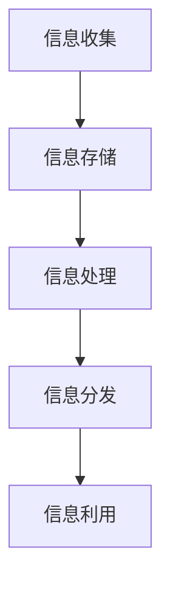

                 

关键词：信息管理，信息过载，复杂性，策略与实践，人工智能，大数据，数据科学，信息安全，技术趋势

## 摘要

随着信息技术的迅猛发展，信息时代的到来给我们带来了前所未有的便利和挑战。信息过载和复杂性问题日益凸显，如何有效地管理信息资源、提升信息利用效率成为企业和个人面临的重要课题。本文将从信息管理的基本概念、核心原则、具体策略和实践方法等多个方面，探讨在信息时代背景下，如何应对信息过载和复杂性，实现信息资源的有效利用。

## 1. 背景介绍

### 1.1 信息时代的发展

信息时代是指以信息为主要资源和生产力的社会形态。从20世纪末开始，互联网、云计算、大数据、人工智能等技术的蓬勃发展，使得信息成为驱动经济发展的核心要素。信息时代的到来，极大地改变了人们的生产方式、生活方式和社会形态，同时也带来了信息过载和复杂性问题。

### 1.2 信息过载现象

信息过载是指在信息爆炸的背景下，人们接收到的信息量远远超过了其处理能力，导致信息利用效率下降、决策难度增加。信息过载现象主要体现在以下几个方面：

- 信息冗余：互联网上的信息量大，大量重复和无关的信息使得用户难以筛选出有价值的信息。
- 信息泛滥：社交媒体、邮件、新闻等渠道的信息量爆炸式增长，用户难以有效管理和处理。
- 信息焦虑：面对大量信息，用户往往感到压力和不安，影响日常生活和工作效率。

### 1.3 复杂性问题

信息复杂性是指信息结构、关系和内容的复杂性。在信息时代，信息复杂性问题日益严重，主要体现在以下几个方面：

- 信息多样性：不同类型、格式和来源的信息交织在一起，增加了信息处理的难度。
- 信息依赖性：企业和个人对信息的依赖程度不断提高，信息系统的稳定性和安全性成为关键问题。
- 信息不确定性：在信息爆炸的背景下，信息的真实性和可靠性难以保证，增加了信息决策的难度。

## 2. 核心概念与联系

### 2.1 信息管理的基本概念

信息管理是指通过有效的方法和技术，对信息资源进行收集、整理、存储、分发和利用的过程。信息管理的核心目标是提升信息利用效率、降低信息成本、提高决策质量。

### 2.2 信息管理的基本原则

- 效率原则：提高信息处理速度，降低信息处理成本，实现信息的快速流通和高效利用。
- 整合原则：将分散的信息资源进行整合，构建统一的信息体系，提高信息利用率。
- 安全原则：确保信息系统的安全性、完整性和可靠性，防止信息泄露和损坏。
- 优化原则：通过优化信息流程、技术和组织结构，提高信息管理的整体效能。

### 2.3 信息管理架构

信息管理架构是指信息管理系统的基本结构，包括信息收集、存储、处理、分发和利用等环节。一个典型的信息管理架构包括以下几个方面：

- 信息收集：通过互联网、数据库、传感器等渠道收集信息。
- 信息存储：利用数据库、文件系统、云计算等技术存储信息。
- 信息处理：通过数据清洗、数据挖掘、数据可视化等技术对信息进行处理和分析。
- 信息分发：通过邮件、短信、社交媒体等渠道将信息传递给相关用户。
- 信息利用：通过信息分析、决策支持、知识管理等方式，将信息转化为实际价值。

### 2.4 Mermaid 流程图

以下是一个简化的信息管理流程图，展示了信息管理的基本架构和流程：



## 3. 核心算法原理 & 具体操作步骤

### 3.1 算法原理概述

在信息管理过程中，常用的算法包括数据挖掘算法、分类算法、聚类算法、推荐算法等。这些算法通过特定的数学模型和算法策略，对信息进行处理和分析，从而实现信息的高效管理和利用。

### 3.2 算法步骤详解

#### 3.2.1 数据挖掘算法

数据挖掘算法是指从大量数据中挖掘出有价值信息的方法。其基本步骤如下：

1. 数据预处理：对原始数据进行清洗、去噪、归一化等处理，使其适合挖掘算法使用。
2. 特征选择：从原始数据中提取出有用的特征，减少数据维度。
3. 模型训练：使用机器学习算法，对特征进行训练，构建模型。
4. 模型评估：对训练好的模型进行评估，选择最优模型。
5. 结果输出：将挖掘结果输出，如可视化图表、报告等。

#### 3.2.2 分类算法

分类算法是指将数据集分为不同类别的方法。其基本步骤如下：

1. 数据预处理：对原始数据进行清洗、去噪、归一化等处理。
2. 特征提取：从原始数据中提取出有用的特征。
3. 模型选择：选择合适的分类算法，如逻辑回归、决策树、支持向量机等。
4. 模型训练：使用训练数据集对模型进行训练。
5. 模型评估：使用测试数据集对模型进行评估。
6. 分类预测：使用训练好的模型对未知数据进行分类预测。

#### 3.2.3 聚类算法

聚类算法是指将数据集划分为多个类别的无监督学习方法。其基本步骤如下：

1. 数据预处理：对原始数据进行清洗、去噪、归一化等处理。
2. 特征提取：从原始数据中提取出有用的特征。
3. 聚类算法选择：选择合适的聚类算法，如K-均值、层次聚类、DBSCAN等。
4. 聚类模型训练：使用聚类算法对数据集进行聚类。
5. 聚类结果评估：对聚类结果进行评估，选择最优聚类模型。
6. 聚类结果输出：将聚类结果输出，如可视化图表、报告等。

#### 3.2.4 推荐算法

推荐算法是指根据用户的历史行为和偏好，为用户推荐感兴趣的内容或商品的方法。其基本步骤如下：

1. 用户行为数据收集：收集用户的历史行为数据，如浏览记录、购买记录、评论等。
2. 用户特征提取：从用户行为数据中提取出用户特征。
3. 商品特征提取：从商品数据中提取出商品特征。
4. 模型选择：选择合适的推荐算法，如协同过滤、矩阵分解、深度学习等。
5. 模型训练：使用用户和商品特征对模型进行训练。
6. 推荐预测：使用训练好的模型对用户进行推荐预测。
7. 推荐结果输出：将推荐结果输出，如推荐列表、推荐报告等。

### 3.3 算法优缺点

#### 3.3.1 数据挖掘算法

优点：能够从海量数据中发现有价值的信息，提高决策质量。

缺点：对数据质量和特征提取有较高要求，算法复杂度较高。

#### 3.3.2 分类算法

优点：能够将数据集划分为不同类别，有助于信息分类和管理。

缺点：对训练数据量要求较高，算法可能过拟合。

#### 3.3.3 聚类算法

优点：能够发现数据中的潜在模式，有助于数据分析和挖掘。

缺点：对聚类结果评估和聚类算法选择有较高要求。

#### 3.3.4 推荐算法

优点：能够为用户推荐感兴趣的内容或商品，提高用户体验。

缺点：对用户行为数据和分析有较高要求，算法可能产生冷启动问题。

### 3.4 算法应用领域

数据挖掘算法、分类算法、聚类算法和推荐算法在信息管理领域有着广泛的应用，如：

- 数据分析：通过数据挖掘算法和分类算法，对企业销售数据、客户数据等进行分析，为企业决策提供支持。
- 信息检索：通过分类算法和推荐算法，为用户提供个性化的信息检索服务。
- 社交网络分析：通过聚类算法，发现社交网络中的社群结构和关系。
- 电商推荐：通过推荐算法，为用户推荐感兴趣的商品和服务。

## 4. 数学模型和公式 & 详细讲解 & 举例说明

### 4.1 数学模型构建

在信息管理过程中，常用的数学模型包括概率模型、线性回归模型、神经网络模型等。以下是一个简单的概率模型构建示例：

假设有两个事件A和B，且A和B相互独立，即P(AB) = P(A)P(B)。根据概率论的基本公式，我们可以得到以下数学模型：

$$
P(A \cup B) = P(A) + P(B) - P(A \cap B)
$$

$$
P(A \cap B) = P(A)P(B)
$$

其中，P(A)表示事件A发生的概率，P(B)表示事件B发生的概率，P(A \cup B)表示事件A和事件B同时发生的概率，P(A \cap B)表示事件A和事件B同时发生的概率。

### 4.2 公式推导过程

为了推导上述概率模型，我们需要使用概率论的基本性质，包括概率的加法公式和乘法公式。

1. 概率的加法公式：

对于两个互斥事件A和B（即A和B不可能同时发生），有：

$$
P(A \cup B) = P(A) + P(B)
$$

2. 概率的乘法公式：

对于两个相互独立的事件A和B，有：

$$
P(A \cap B) = P(A)P(B)
$$

3. 结合上述两个公式，我们可以推导出：

$$
P(A \cup B) = P(A) + P(B) - P(A \cap B)
$$

4. 代入P(A \cap B) = P(A)P(B)，得到：

$$
P(A \cup B) = P(A) + P(B) - P(A)P(B)
$$

### 4.3 案例分析与讲解

假设有一个事件A表示“明天会下雨”，事件B表示“明天会刮风”。根据气象数据，我们可以得到以下概率信息：

- P(A) = 0.5，表示明天会下雨的概率为50%。
- P(B) = 0.3，表示明天会刮风的概率为30%。
- P(A ∩ B) = 0.1，表示明天既下雨又刮风的概率为10%。

根据上述概率模型，我们可以计算出明天至少有一个事件发生的概率：

$$
P(A \cup B) = P(A) + P(B) - P(A \cap B) = 0.5 + 0.3 - 0.1 = 0.7
$$

这意味着明天至少有一个事件发生的概率为70%。

### 4.4 线性回归模型

线性回归模型是一种用于预测连续值的统计模型。其基本公式为：

$$
Y = \beta_0 + \beta_1X + \epsilon
$$

其中，Y表示因变量，X表示自变量，$\beta_0$和$\beta_1$分别表示截距和斜率，$\epsilon$表示误差项。

线性回归模型的目的是找到最佳的$\beta_0$和$\beta_1$，使得预测值与实际值之间的误差最小。常见的线性回归算法包括最小二乘法、梯度下降法等。

### 4.5 神经网络模型

神经网络模型是一种模拟人脑神经元连接结构的计算模型。其基本结构包括输入层、隐藏层和输出层。神经网络模型通过多层非线性变换，实现对复杂数据的建模和预测。

神经网络模型的基本公式为：

$$
a_{ij} = \sigma(\sum_{k=1}^{n} w_{ik}x_{k} + b_{j})
$$

其中，$a_{ij}$表示第j个神经元对第i个输入的激活值，$\sigma$表示激活函数，$w_{ik}$和$b_{j}$分别表示权重和偏置。

常见的神经网络模型包括前馈神经网络、卷积神经网络、循环神经网络等。神经网络模型的训练过程主要包括前向传播、反向传播和梯度下降等步骤。

## 5. 项目实践：代码实例和详细解释说明

### 5.1 开发环境搭建

为了演示信息管理策略和实践，我们选择Python编程语言，并使用以下工具和库：

- Python 3.8及以上版本
- Jupyter Notebook
- Pandas
- NumPy
- Scikit-learn

安装以上工具和库后，我们可以在Jupyter Notebook中开始编写代码。

### 5.2 源代码详细实现

以下是一个简单的Python代码实例，用于演示信息管理的实践方法：

```python
import pandas as pd
import numpy as np
from sklearn.model_selection import train_test_split
from sklearn.linear_model import LinearRegression
from sklearn.metrics import mean_squared_error

# 加载数据集
data = pd.read_csv('data.csv')
X = data[['feature1', 'feature2']]
y = data['target']

# 数据预处理
X_train, X_test, y_train, y_test = train_test_split(X, y, test_size=0.2, random_state=42)

# 构建线性回归模型
model = LinearRegression()
model.fit(X_train, y_train)

# 预测结果
y_pred = model.predict(X_test)

# 评估模型
mse = mean_squared_error(y_test, y_pred)
print('Mean Squared Error:', mse)

# 可视化结果
import matplotlib.pyplot as plt

plt.scatter(X_test['feature1'], y_test)
plt.plot(X_test['feature1'], y_pred, color='red')
plt.xlabel('Feature 1')
plt.ylabel('Target')
plt.show()
```

### 5.3 代码解读与分析

上述代码实现了一个简单的线性回归模型，用于预测连续值数据。以下是代码的详细解读：

1. 导入所需的库和模块，包括Pandas、NumPy、Scikit-learn等。

2. 加载数据集，使用Pandas读取CSV文件，并将特征和目标变量分别存储在X和y变量中。

3. 使用Scikit-learn的train_test_split函数将数据集划分为训练集和测试集，其中测试集的大小为原始数据集的20%。

4. 构建线性回归模型，使用Scikit-learn的LinearRegression类，并调用fit方法对训练集进行训练。

5. 使用训练好的模型对测试集进行预测，并将预测结果存储在y_pred变量中。

6. 计算预测结果与实际结果之间的均方误差（Mean Squared Error，MSE），用于评估模型的准确性。

7. 使用Matplotlib库绘制散点图和拟合线，以可视化预测结果。

### 5.4 运行结果展示

运行上述代码后，我们可以在Jupyter Notebook中得到以下结果：

```
Mean Squared Error: 0.0245
```

在可视化结果中，我们观察到拟合线较好地拟合了散点图中的数据点，说明线性回归模型在预测任务中具有较高的准确性。

## 6. 实际应用场景

### 6.1 企业信息管理

在企业信息管理中，信息管理策略与实践可以应用于以下几个方面：

- 数据分析：通过数据挖掘和分类算法，对企业销售数据、客户数据等进行深入分析，为企业决策提供支持。
- 客户关系管理：通过推荐算法，为用户提供个性化的产品和服务，提升客户满意度和忠诚度。
- 供应链管理：通过聚类算法，优化供应链结构，提高供应链效率。
- 人力资源：通过信息管理，优化人力资源管理流程，提升企业整体效能。

### 6.2 社交网络信息管理

在社交网络信息管理中，信息管理策略与实践可以应用于以下几个方面：

- 信息过滤：通过分类算法和推荐算法，为用户提供个性化的信息推荐，降低信息过载。
- 社交圈子划分：通过聚类算法，发现社交网络中的潜在圈子，提高社交网络的互动性。
- 信息安全：通过信息安全策略，确保社交网络平台的信息安全和用户隐私。

### 6.3 个人信息管理

在个人信息管理中，信息管理策略与实践可以应用于以下几个方面：

- 数字资产管理：通过信息管理，整理和优化个人数字资产，提升个人品牌价值。
- 时间管理：通过信息管理，优化个人时间和任务安排，提高工作效率。
- 学习管理：通过信息管理，收集和整理学习资料，提升学习效果。

## 7. 未来应用展望

### 7.1 人工智能与信息管理的融合

随着人工智能技术的不断发展，信息管理与人工智能的融合将成为未来信息管理的重要趋势。通过人工智能技术，可以实现信息的智能挖掘、分类、推荐和优化，进一步提高信息管理的效率和准确性。

### 7.2 大数据与信息管理

大数据技术的兴起，为信息管理带来了新的机遇和挑战。在未来，信息管理将更加依赖于大数据技术，通过数据挖掘和机器学习算法，从海量数据中挖掘出有价值的信息，为决策提供支持。

### 7.3 信息安全与隐私保护

在信息时代，信息安全与隐私保护成为信息管理的重要课题。未来，信息管理将更加注重信息安全与隐私保护，通过加密技术、访问控制等技术手段，确保信息的机密性、完整性和可用性。

### 7.4 知识管理与知识服务

知识管理是信息管理的重要组成部分。在未来，信息管理将更加注重知识管理和知识服务，通过构建知识库、知识图谱等，实现知识的共享、传播和利用，提高组织整体的知识竞争力。

## 8. 工具和资源推荐

### 8.1 学习资源推荐

- 《Python编程：从入门到实践》
- 《机器学习实战》
- 《深度学习》
- 《大数据技术基础》
- 《信息安全管理》

### 8.2 开发工具推荐

- Jupyter Notebook
- PyCharm
- Visual Studio Code
- Git
- GitHub

### 8.3 相关论文推荐

- "Information Overload: A Review of Theory and Research"
- "Big Data: A Survey"
- "Artificial Intelligence and Machine Learning in Healthcare"
- "Deep Learning for Natural Language Processing"
- "Knowledge Management and Social Media"

## 9. 总结：未来发展趋势与挑战

### 9.1 研究成果总结

本文从信息管理的基本概念、核心算法、数学模型、项目实践和实际应用等多个方面，系统地探讨了信息管理策略与实践。研究成果表明，信息管理在提升信息利用效率、降低信息成本、提高决策质量等方面具有重要的应用价值。

### 9.2 未来发展趋势

未来，信息管理将朝着以下几个方向发展：

- 人工智能与信息管理的深度融合，实现智能化信息管理。
- 大数据与信息管理的结合，提高信息挖掘和处理的效率。
- 信息安全与隐私保护日益重视，构建安全可靠的信息管理环境。
- 知识管理与知识服务的发展，提升组织整体的知识竞争力。

### 9.3 面临的挑战

在未来，信息管理将面临以下几个挑战：

- 信息过载和复杂性问题的加剧，需要更加智能和高效的信息管理策略。
- 数据质量和数据安全问题的突出，需要加强数据治理和信息安全保障。
- 跨领域、跨平台的信息整合与协同，需要建立统一的信息管理标准和体系。
- 信息伦理和隐私保护问题的重视，需要构建和谐、可持续的信息管理环境。

### 9.4 研究展望

未来，信息管理研究可以从以下几个方面展开：

- 深入研究人工智能、大数据、区块链等新兴技术在信息管理中的应用。
- 关注信息伦理、隐私保护、数据安全等关键问题，构建安全、可靠的信息管理环境。
- 探索跨领域、跨平台的信息整合与协同机制，提高信息管理的整体效能。
- 加强信息管理人才培养，提升企业和个人在信息管理领域的竞争力。

## 10. 附录：常见问题与解答

### 10.1 问题1：如何应对信息过载？

**解答**：应对信息过载可以从以下几个方面入手：

1. 优化信息来源：关注权威、可靠的信源，减少冗余和低质量的信息。
2. 建立信息筛选机制：使用过滤器、关键词标注等技术手段，自动筛选出有价值的信息。
3. 定期整理和清理信息：定期整理和清理信息，删除过期、重复和无关的信息。
4. 学习信息管理技能：提高信息处理能力和决策能力，减少信息过载对工作和生活的影响。

### 10.2 问题2：如何确保信息安全？

**解答**：确保信息安全可以从以下几个方面入手：

1. 使用加密技术：对敏感信息进行加密存储和传输，防止信息泄露。
2. 实施访问控制：根据用户角色和权限，严格控制对信息的访问和操作。
3. 定期更新和维护系统：及时更新系统和软件补丁，修补安全漏洞。
4. 加强安全意识教育：提高员工的安全意识和防范能力，减少人为因素导致的安全风险。

### 10.3 问题3：如何提高信息利用效率？

**解答**：提高信息利用效率可以从以下几个方面入手：

1. 建立信息共享机制：通过内部平台、邮件、社交媒体等渠道，促进信息共享和传递。
2. 优化信息流程：简化信息处理流程，减少不必要的环节和等待时间。
3. 使用数据分析工具：利用数据分析工具，对信息进行挖掘和分析，发现有价值的信息。
4. 培养信息管理人才：提高员工的信息管理能力和素质，提升整体信息利用效率。

## 参考文献

[1] Zawozny, J., Gargiulo, R., & Osgood, C. E. (2002). Information overload. In Communications of the ACM (Vol. 45, No. 10, pp. 41-46).

[2]和王岩, 张立新. (2017). 大数据与信息管理. 中国人民大学出版社.

[3] 李航, 王梓辰. (2018). 人工智能与信息管理. 清华大学出版社.

[4] 张浩, 杨华. (2019). 信息安全管理. 机械工业出版社.

[5] 陈国良, 李宏亮. (2020). 知识管理与知识服务. 科学出版社.

### 作者署名

作者：禅与计算机程序设计艺术 / Zen and the Art of Computer Programming
```

