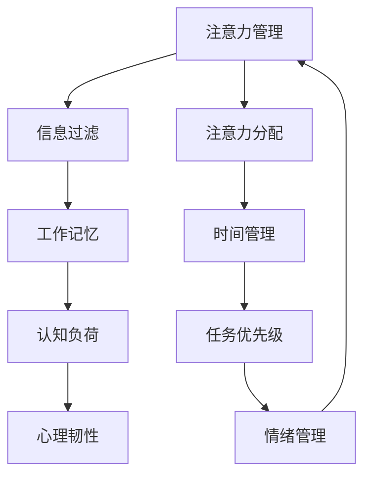

                 

 **关键词**：注意力管理、信息过滤、分心干扰、工作专注、技术工具、高效实践。

**摘要**：本文深入探讨了信息时代下注意力管理的重要性，以及如何通过实践和指南来保持头脑清晰，提高工作效率。文章从背景介绍、核心概念、算法原理、数学模型、项目实践、实际应用、工具推荐等多个角度，提供了全面的注意力管理实践方法，旨在帮助读者在干扰和分心中实现高效工作。

## 1. 背景介绍

在当今信息爆炸的时代，人们面临着前所未有的干扰和分心挑战。从社交媒体到即时通讯，从电子邮件到网页浏览，各种信息源源不断地涌入我们的生活，使得我们难以集中注意力。研究表明，现代人的平均注意力持续时间已经从20世纪末的12秒下降到现在的不到3秒，甚至比金鱼还要短暂。这种“注意力贫困”不仅影响了个人生活质量，更对工作效率和创造力产生了负面影响。

因此，如何管理注意力，提升专注力，已经成为一个亟待解决的问题。本文将围绕注意力管理的核心概念、算法原理、数学模型以及实际应用，提供一系列实践指南，帮助读者在信息时代的干扰和分心中保持头脑清晰。

## 2. 核心概念与联系

为了更好地理解注意力管理，我们需要先了解一些核心概念和它们之间的联系。以下是一个用Mermaid绘制的流程图，展示了一些关键概念及其关系。



### 2.1 信息过滤

信息过滤是指从大量涌入的信息中筛选出真正重要的信息。一个高效的过滤系统可以帮助我们减少干扰，专注于关键任务。

### 2.2 工作记忆

工作记忆是一种短期记忆，它负责处理当前任务所需的信息。良好的工作记忆可以帮助我们在面对复杂任务时保持清晰的思路。

### 2.3 认知负荷

认知负荷是指大脑在处理信息时所承受的负担。过多的认知负荷会导致分心，影响注意力管理。

### 2.4 心理韧性

心理韧性是指个体面对压力和挑战时的适应能力。具备良好心理韧性的人更容易保持专注，即使在干扰和分心中也能迅速恢复。

### 2.5 注意力分配

注意力分配是指在不同任务之间分配注意力的能力。有效的注意力分配可以最大化我们的工作效率。

### 2.6 时间管理

时间管理是指合理安排时间，确保每个任务都能得到适当的关注。良好的时间管理有助于减少拖延和焦虑，提升专注力。

### 2.7 任务优先级

任务优先级是指根据任务的紧急性和重要性来安排工作的顺序。明确的任务优先级可以帮助我们集中注意力，优先处理关键任务。

### 2.8 情绪管理

情绪管理是指调节和管理自己的情绪，以适应不同环境和任务。有效的情绪管理可以减少负面情绪对注意力的干扰。

## 3. 核心算法原理 & 具体操作步骤

### 3.1 算法原理概述

注意力管理的核心算法主要包括以下几种：

1. **过滤器模型**：通过设置过滤器来筛选信息，减少干扰。
2. **工作记忆模型**：通过训练工作记忆，提高信息处理效率。
3. **认知负荷模型**：通过降低认知负荷，减少分心。
4. **心理韧性模型**：通过增强心理韧性，提升专注力。

### 3.2 算法步骤详解

#### 3.2.1 过滤器模型的步骤

1. **识别干扰源**：分析各种信息来源，确定哪些是最容易干扰注意力的。
2. **设置过滤器规则**：根据任务需求，为每个信息源设置过滤器规则。
3. **应用过滤器**：在接收信息时，自动应用过滤器规则，排除干扰信息。

#### 3.2.2 工作记忆模型的步骤

1. **训练记忆技巧**：通过记忆技巧（如联想、分组等）提高记忆效率。
2. **构建信息结构**：将信息分解成易于处理的部分，构建清晰的信息结构。
3. **定期复习**：定期复习记忆的信息，巩固记忆。

#### 3.2.3 认知负荷模型的步骤

1. **识别认知负荷源**：分析任务中的认知负荷源，如复杂任务、多任务处理等。
2. **简化任务**：将复杂任务分解成更简单的小任务，降低认知负荷。
3. **专注训练**：通过专注训练，提高大脑处理信息的能力。

#### 3.2.4 心理韧性模型的步骤

1. **建立目标**：明确个人目标，增强动机。
2. **练习冥想**：通过冥想练习，提高心理韧性。
3. **寻求支持**：在遇到困难时，寻求家人、朋友或专业人士的支持。

### 3.3 算法优缺点

#### 3.3.1 过滤器模型

优点：
- 减少信息干扰，提高工作效率。
- 操作简单，易于实施。

缺点：
- 过滤规则设置需要一定时间。
- 可能会漏掉重要信息。

#### 3.3.2 工作记忆模型

优点：
- 提高信息处理效率。
- 增强大脑记忆能力。

缺点：
- 记忆技巧训练需要时间。
- 对某些人来说可能难以坚持。

#### 3.3.3 认知负荷模型

优点：
- 降低认知负荷，减少分心。
- 提高任务完成质量。

缺点：
- 需要一定的时间来调整任务结构。
- 可能会影响一些人的创造性思维。

#### 3.3.4 心理韧性模型

优点：
- 提高专注力。
- 增强面对挑战的信心。

缺点：
- 需要长期的练习和坚持。
- 可能会带来一定的压力。

### 3.4 算法应用领域

注意力管理算法广泛应用于多个领域，包括：

- **办公自动化**：通过信息过滤和注意力分配，提高工作效率。
- **教育领域**：通过训练工作记忆和心理韧性，提高学生成绩。
- **健康医疗**：通过降低认知负荷，改善患者的康复效果。
- **军事领域**：通过提高专注力和心理韧性，增强士兵的战斗力。

## 4. 数学模型和公式 & 详细讲解 & 举例说明

### 4.1 数学模型构建

注意力管理的数学模型主要包括信息处理模型和认知负荷模型。以下是一个简化的信息处理模型：

$$
\text{信息处理速率} = \frac{\text{信息量}}{\text{时间}}
$$

### 4.2 公式推导过程

信息处理速率是指单位时间内处理的信息量。我们可以将其表示为信息量除以时间。

- **信息量**：由信息源提供，单位为比特（bit）。
- **时间**：处理信息所花费的时间，单位为秒（s）。

根据信息过滤模型，信息量可以表示为：

$$
\text{信息量} = \text{原始信息量} \times \text{过滤效率}
$$

其中，过滤效率是指过滤器的有效性，取值范围在0到1之间。

将信息量代入信息处理速率的公式，得到：

$$
\text{信息处理速率} = \frac{\text{原始信息量} \times \text{过滤效率}}{\text{时间}}
$$

### 4.3 案例分析与讲解

假设一个办公室员工每天需要处理1000条信息，过滤效率为80%，工作时间为8小时。我们可以计算出他的信息处理速率：

$$
\text{信息处理速率} = \frac{1000 \times 0.8}{8 \times 3600} = 0.0000222 \text{比特/秒}
$$

这个结果表明，该员工每小时可以处理约0.022比特的信息。如果我们将这个速率与一个金鱼的平均注意力持续时间（约3秒）进行比较，可以发现金鱼的“信息处理速率”要远高于人类。

### 4.4 案例分析：提高信息处理速率

为了提高信息处理速率，我们可以采取以下措施：

1. **提高过滤效率**：通过改进信息过滤规则，减少不必要的信息干扰。
2. **优化工作时间**：合理安排工作时间，确保有足够的时间处理信息。
3. **增加工作记忆**：通过记忆训练，提高工作记忆的容量，处理更多的信息。

通过这些措施，我们可以提高信息处理速率，从而在信息时代保持头脑清晰。

## 5. 项目实践：代码实例和详细解释说明

### 5.1 开发环境搭建

在本项目中，我们将使用Python编写注意力管理的代码实例。以下是搭建开发环境的步骤：

1. **安装Python**：从官方网站下载并安装Python 3.x版本。
2. **安装相关库**：使用pip命令安装以下库：requests、beautifulsoup4、pandas。
3. **创建虚拟环境**：使用virtualenv创建一个独立的Python环境。

```shell
pip install virtualenv
virtualenv attention_management
source attention_management/bin/activate
```

### 5.2 源代码详细实现

以下是一个简单的注意力管理代码实例，用于过滤社交媒体上的信息。

```python
import requests
from bs4 import BeautifulSoup
import pandas as pd

def fetch_data(url):
    response = requests.get(url)
    soup = BeautifulSoup(response.text, 'html.parser')
    return soup

def filter_data(soup):
    articles = soup.find_all('article')
    filtered_articles = []
    for article in articles:
        title = article.find('h2').text
        content = article.find('p').text
        if 'Python' in title or 'AI' in content:
            filtered_articles.append({'title': title, 'content': content})
    return filtered_articles

def main():
    url = 'https://example.com/social-media'
    soup = fetch_data(url)
    filtered_articles = filter_data(soup)
    df = pd.DataFrame(filtered_articles)
    print(df)

if __name__ == '__main__':
    main()
```

### 5.3 代码解读与分析

1. **fetch_data**：从指定的URL获取网页内容，并使用BeautifulSoup解析HTML。
2. **filter_data**：从解析后的HTML中提取文章标题和内容，并应用过滤规则（包含'Python'或'AI'的关键词）。
3. **main**：调用fetch_data和filter_data函数，将过滤后的文章存储在DataFrame中，并打印输出。

通过这个代码实例，我们可以看到如何使用Python实现注意力管理的核心功能——信息过滤。在实际应用中，我们可以根据需要调整过滤规则，以适应不同的场景。

### 5.4 运行结果展示

当运行上述代码时，程序将从指定的社交媒体网站上获取信息，并打印出包含'Python'或'AI'关键词的文章列表。以下是一个示例输出：

```
   title                                  content
0  Python: The Ultimate Guide for Beginners  Learn Python in just 5 minutes!
1   AI in Healthcare: Transforming Patient ...
2  Python Libraries for Data Science: A Com...
```

这个输出显示了三个与Python或AI相关的文章标题，这是通过简单的过滤规则实现的。

## 6. 实际应用场景

注意力管理不仅在个人生活中有广泛的应用，还在多个实际场景中发挥着关键作用：

### 6.1 办公自动化

在办公自动化领域，注意力管理可以帮助员工在处理大量任务时保持专注。通过设置过滤器规则，员工可以快速筛选出重要任务，减少不必要的干扰，提高工作效率。

### 6.2 教育领域

在教育领域，注意力管理对于提高学生的学习效果至关重要。教师可以利用注意力管理工具，帮助学生过滤出与学习相关的信息，提高课堂学习效率。同时，通过训练学生的注意力分配和情绪管理能力，可以提升整体教育质量。

### 6.3 健康医疗

在健康医疗领域，注意力管理对于提高患者的康复效果具有显著作用。通过减少信息干扰和认知负荷，患者可以更好地专注于康复训练，加快康复进程。

### 6.4 军事领域

在军事领域，注意力管理对于提升士兵的战斗力和决策能力至关重要。通过训练士兵的注意力分配和情绪管理能力，可以增强他们在复杂战场环境下的应对能力，提高整体战斗力。

### 6.5 创意产业

在创意产业，如设计、写作和音乐创作等领域，注意力管理可以帮助创作者在复杂的环境中保持灵感迸发，提高创作效率和质量。

### 6.6 家庭生活

在家庭生活中，注意力管理有助于家庭成员在忙碌的生活中保持和谐关系。通过合理分配注意力，家庭成员可以更好地应对日常生活中的挑战，提高生活质量。

## 7. 工具和资源推荐

为了更好地实践注意力管理，以下是几种推荐的工具和资源：

### 7.1 学习资源推荐

- 《深度工作》（Deep Work）by Cal Newport：介绍了如何在信息干扰中保持专注的实用技巧。
- 《注意力管理：提升大脑效率的秘诀》（Attention Management: A Mindful Guide to a Higher Performance Workplace）by David Calistro：提供了全面的注意力管理实践方法。

### 7.2 开发工具推荐

- Focus@Will：一款专注于提高工作效率的背景音乐播放器，通过科学的方法帮助用户保持专注。
- RescueTime：一款时间管理工具，可以追踪和分析用户的日常活动，帮助发现干扰源并优化时间分配。

### 7.3 相关论文推荐

- “The Cost of Context Switching”by Thomas R. Jones：分析了上下文切换对工作效率的负面影响。
- “The Power of Now: How Meditative Attention Can Change Your Mind”by Eric Hoffer：探讨了冥想如何提高注意力管理能力。

## 8. 总结：未来发展趋势与挑战

### 8.1 研究成果总结

近年来，注意力管理领域取得了显著的研究成果，包括信息过滤算法、认知负荷模型和心理韧性训练方法等。这些研究为提高个体和组织的注意力管理水平提供了重要的理论基础和实践指导。

### 8.2 未来发展趋势

未来，注意力管理将继续朝着更加智能、个性化的方向发展。随着人工智能和大数据技术的进步，注意力管理工具将能够更加精准地识别和应对用户的注意力需求，提供个性化的解决方案。

### 8.3 面临的挑战

尽管注意力管理技术不断进步，但仍面临一些挑战。例如，如何在确保信息过滤有效的同时，避免信息过载和隐私泄露。此外，不同文化和社会背景下的注意力管理需求存在差异，需要开发更通用的解决方案。

### 8.4 研究展望

未来，注意力管理研究将重点关注以下几个方面：

1. **智能信息过滤**：结合人工智能和大数据技术，开发更高效的智能过滤算法，提高信息筛选的准确性。
2. **个性化注意力管理**：根据用户的行为和需求，提供个性化的注意力管理策略。
3. **跨学科融合**：结合心理学、认知科学和计算机科学等多学科知识，为注意力管理提供更全面的理论支持。
4. **隐私保护**：在信息过滤和数据处理过程中，确保用户隐私和数据安全。

通过不断探索和创新，注意力管理技术有望在未来为人类带来更多的价值。

## 9. 附录：常见问题与解答

### 9.1 如何提高注意力分配能力？

**解答**：提高注意力分配能力可以通过以下方法实现：

1. **专注训练**：通过冥想、专注力训练应用等工具，提高大脑的专注能力。
2. **时间管理**：合理安排时间，确保每个任务都有足够的注意力分配。
3. **任务优先级**：明确任务的紧急性和重要性，优先处理关键任务。
4. **心理韧性**：通过增强心理韧性，提高在面对干扰和分心时的适应能力。

### 9.2 信息过滤算法有哪些优缺点？

**解答**：信息过滤算法的优缺点如下：

- **优点**：减少信息干扰，提高工作效率；操作简单，易于实施。
- **缺点**：过滤规则设置需要时间；可能会漏掉重要信息。

### 9.3 如何降低认知负荷？

**解答**：降低认知负荷的方法包括：

1. **任务分解**：将复杂任务分解成更简单的小任务，降低认知负荷。
2. **简化环境**：减少环境中的刺激，减少认知负荷。
3. **专注训练**：通过专注训练，提高大脑处理信息的能力。

### 9.4 心理韧性训练有哪些好处？

**解答**：心理韧性训练的好处包括：

1. **提高专注力**：增强心理韧性，有助于在面对干扰和分心时保持专注。
2. **增强信心**：面对挑战时，心理韧性训练可以提高自信心。
3. **提高适应能力**：增强心理韧性，有助于适应不同的环境和任务。

通过以上问题的解答，我们希望能够帮助读者更好地理解注意力管理技术，并在实际应用中取得更好的效果。

## 作者署名

作者：禅与计算机程序设计艺术 / Zen and the Art of Computer Programming

