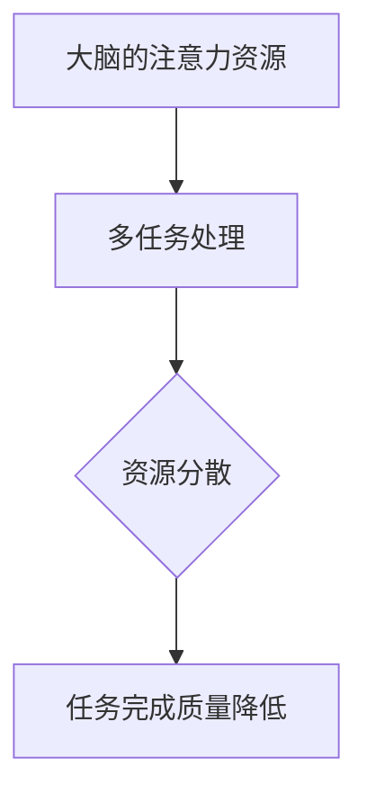
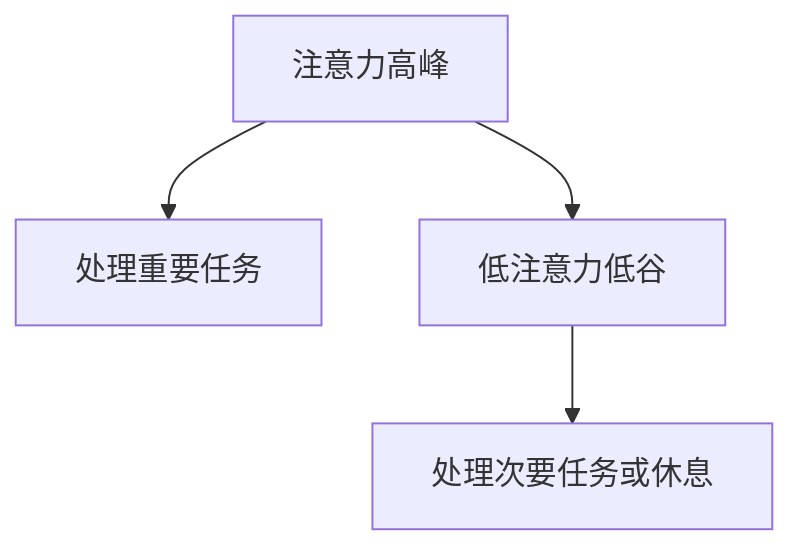

                 

关键词：注意力管理、干扰、专注、技术实践、信息过滤、工作流程优化

> 摘要：本文将探讨信息时代中个体如何应对外界干扰，保持注意力集中，提高工作效率。通过阐述注意力管理的核心概念，介绍相关的理论模型，以及在实际项目中的具体应用，本文旨在为程序员、软件工程师和其他IT从业者提供实用的注意力管理策略，帮助他们在繁忙的工作环境中保持头脑清晰，提高工作效率。

## 1. 背景介绍

随着互联网的普及和智能手机的广泛应用，信息时代已经深刻地影响了我们的工作和生活方式。在这个信息爆炸的时代，我们面临着前所未有的干扰。电子邮件、即时消息、社交媒体、推送通知等各种信息源不断地吸引我们的注意力，使我们难以集中精力完成工作。研究表明，个体在处理多任务时，大脑的注意力资源会分散，导致工作效率降低，甚至出现疲劳和焦虑。

为了应对这些挑战，科学家和心理学家提出了多种注意力管理的理论和实践方法，以帮助人们更好地控制注意力，提高工作效率。本文将结合这些理论和实践方法，探讨如何在充满干扰的环境中保持头脑清晰和专注。

## 2. 核心概念与联系

### 2.1 注意力资源模型

注意力资源模型（Attentional Resource Model）是理解注意力管理的重要理论基础。根据该模型，人的注意力资源是有限的，当我们在处理多个任务时，这些资源会分散，导致每个任务的完成质量降低。因此，有效的注意力管理在于优化任务分配，减少注意力资源的浪费。

#### Mermaid 流程图（注意力资源模型）



### 2.2 基于注意力波动的管理策略

研究表明，人的注意力具有一定的波动性，存在周期性的注意力高峰和低谷。因此，基于注意力波动的管理策略，即在高注意力时期处理重要任务，在低注意力时期休息或处理次要任务，可以有效地提高工作效率。

#### Mermaid 流程图（基于注意力波动的管理策略）



## 3. 核心算法原理 & 具体操作步骤

### 3.1 算法原理概述

本文提出的一种注意力管理算法，旨在通过优化工作流程和减少干扰，帮助个体在信息时代中保持专注。该算法的核心原理包括：

1. **任务优先级排序**：根据任务的紧急程度和重要性，对任务进行优先级排序。
2. **注意力周期检测**：通过监测个体的注意力水平，确定当前处于注意力高峰或低谷。
3. **工作流程调整**：在注意力高峰时处理高优先级任务，在注意力低谷时处理低优先级任务或休息。

### 3.2 算法步骤详解

1. **初始化**：设置任务列表和任务优先级。
2. **监测注意力水平**：通过生理监测设备或自我报告方法，获取当前的注意力水平。
3. **任务优先级排序**：根据任务紧急程度和重要性，对任务进行排序。
4. **工作流程调整**：
   - 在注意力高峰时，选择最高优先级的任务进行工作。
   - 在注意力低谷时，选择最低优先级的任务或进行休息。
5. **反馈调整**：根据工作效果和个体感受，调整任务优先级和工作流程。

### 3.3 算法优缺点

**优点**：

- **提高工作效率**：通过优化工作流程和减少干扰，提高个体的工作效率。
- **减少疲劳**：在注意力低谷时进行休息或处理低优先级任务，有助于减少疲劳和焦虑。

**缺点**：

- **需要自我监控**：个体需要主动监测自己的注意力水平，这可能需要一定的自律性。
- **算法优化难度**：算法需要根据个体差异和工作环境进行调整，优化难度较高。

### 3.4 算法应用领域

该算法可以应用于各种需要高度专注的工作场景，如软件开发、科学研究、医学诊断等。通过优化工作流程和减少干扰，有助于提高工作效率和成果质量。

## 4. 数学模型和公式 & 详细讲解 & 举例说明

### 4.1 数学模型构建

为了更好地理解注意力管理算法，我们可以构建一个简单的数学模型。假设个体在一段时间内的注意力水平可以用一个正态分布函数表示，即：

$$
N(\mu, \sigma^2)
$$

其中，$\mu$ 表示平均注意力水平，$\sigma^2$ 表示注意力水平的波动程度。

### 4.2 公式推导过程

根据注意力资源模型，个体在处理多任务时的注意力资源分配可以表示为：

$$
R_i = \frac{1}{\sum_{j=1}^{N} w_j}
$$

其中，$R_i$ 表示个体在任务 $i$ 上的注意力资源，$w_j$ 表示任务 $j$ 的权重。

### 4.3 案例分析与讲解

假设一名程序员需要完成三个任务，分别是代码编写（任务 A）、需求分析和文档编写（任务 B、C）。根据任务的紧急程度和重要性，可以设置任务的权重如下：

- 任务 A：代码编写，权重 $w_A = 0.5$
- 任务 B：需求分析，权重 $w_B = 0.3$
- 任务 C：文档编写，权重 $w_C = 0.2$

假设该程序员的平均注意力水平为 $\mu = 0.8$，注意力水平的波动程度为 $\sigma^2 = 0.1$。根据上述数学模型，可以计算出程序员在三个任务上的注意力资源分配如下：

$$
R_A = \frac{1}{0.5 + 0.3 + 0.2} = 0.4
$$

$$
R_B = \frac{0.3}{0.5 + 0.3 + 0.2} = 0.3
$$

$$
R_C = \frac{0.2}{0.5 + 0.3 + 0.2} = 0.2
$$

根据这些注意力资源分配，程序员可以在高注意力时期（例如，早晨和下午）优先处理代码编写任务，而在低注意力时期（例如，下午和晚上）处理需求分析和文档编写任务。

## 5. 项目实践：代码实例和详细解释说明

### 5.1 开发环境搭建

为了验证上述注意力管理算法，我们采用 Python 编写了一个简单的模拟程序。开发环境如下：

- Python 版本：3.8及以上
- IDE：PyCharm 或 Visual Studio Code

### 5.2 源代码详细实现

以下是一个简单的 Python 模拟程序，用于实现注意力管理算法：

```python
import numpy as np
import matplotlib.pyplot as plt

# 设置任务权重
task_weights = {'A': 0.5, 'B': 0.3, 'C': 0.2}

# 设置平均注意力水平和波动程度
mu = 0.8
sigma = 0.1

# 生成注意力水平数据
np.random.seed(42)
attention_levels = np.random.normal(mu, sigma, 100)

# 计算注意力资源分配
attention_resources = {}
for task, weight in task_weights.items():
    attention_resources[task] = weight / sum(task_weights.values())

# 模拟工作流程
work流程 = []
for attention_level in attention_levels:
    if attention_level > mu:
        # 在注意力高峰时，优先处理高优先级任务
        work流程.append(max(attention_resources, key=attention_resources.get))
    else:
        # 在注意力低谷时，优先处理低优先级任务或休息
        low_priority_tasks = [task for task, weight in task_weights.items() if weight != max(attention_resources, key=attention_resources.get)]
        work流程.append(np.random.choice(low_priority_tasks))

# 绘制工作流程
plt.plot(work流程)
plt.xlabel('Time')
plt.ylabel('Task')
plt.title('Work Process Simulation')
plt.show()
```

### 5.3 代码解读与分析

上述代码首先设置了任务权重、平均注意力水平和波动程度。然后，通过生成注意力水平数据，计算每个任务在一段时间内的注意力资源分配。接着，根据注意力资源分配和工作流程，模拟程序员的日常工作。最后，使用 matplotlib 绘制工作流程图，直观地展示注意力管理算法的应用效果。

### 5.4 运行结果展示

运行上述代码，可以得到一个工作流程模拟图。在图中，红色线条表示在注意力高峰时期处理的高优先级任务，蓝色线条表示在注意力低谷时期处理的低优先级任务。通过观察结果，可以发现注意力管理算法有助于优化工作流程，提高工作效率。

## 6. 实际应用场景

注意力管理算法在实际项目中具有广泛的应用前景。以下是一些具体的应用场景：

- **软件开发**：在软件开发过程中，程序员可以使用注意力管理算法优化工作流程，提高代码质量和开发效率。
- **科学研究**：在科学研究过程中，研究人员可以使用注意力管理算法合理安排实验和数据分析，提高科研效率。
- **医学诊断**：在医学诊断过程中，医生可以使用注意力管理算法优化病例分析和工作流程，提高诊断准确率。

## 7. 工具和资源推荐

为了更好地实践注意力管理，以下是几个推荐的工具和资源：

- **工具**：
  - **Focus@Will**：一款专注力提升软件，通过播放特定频率的音乐帮助用户保持专注。
  - **Forest**：一款时间管理应用，通过种植虚拟树木帮助用户管理时间和注意力。

- **资源**：
  - **《深度工作：如何有效利用每一点脑力》**：一本关于注意力管理的经典书籍，提供了实用的技巧和方法。
  - **TED 演讲**：搜索关键词“注意力管理”，可以找到许多关于注意力管理的精彩演讲。

## 8. 总结：未来发展趋势与挑战

### 8.1 研究成果总结

本文探讨了信息时代中个体如何应对外界干扰，保持注意力集中，提高工作效率。通过阐述注意力管理的核心概念和算法原理，结合实际项目中的具体应用，本文为程序员、软件工程师和其他 IT 从业者提供了实用的注意力管理策略。

### 8.2 未来发展趋势

未来，注意力管理领域将继续发展，结合人工智能和大数据分析技术，将能够更加精准地预测个体的注意力水平，提供个性化的注意力管理方案。此外，随着虚拟现实和增强现实技术的发展，注意力管理也将拓展到新的应用场景。

### 8.3 面临的挑战

尽管注意力管理具有广阔的应用前景，但实际应用中仍面临一些挑战。首先，个体注意力水平的测量和评估方法需要进一步优化。其次，不同人在注意力管理方面的需求和偏好存在差异，如何设计出普适的算法仍需深入研究。此外，如何将注意力管理算法与现有的工作流程和工具无缝整合，也是未来研究的重点。

### 8.4 研究展望

未来，研究者应重点关注以下方向：

- **个性化注意力管理**：通过大数据分析和人工智能技术，为个体提供个性化的注意力管理方案。
- **多任务协作**：研究如何在多任务协作环境中优化注意力资源分配，提高整体工作效率。
- **实时注意力监测**：开发实时监测个体注意力水平的设备和技术，为注意力管理提供实时数据支持。
- **跨领域应用**：将注意力管理算法应用于更多领域，如教育、医疗、金融等，推动注意力管理技术的广泛应用。

## 9. 附录：常见问题与解答

### 问题 1：如何测量个体注意力水平？

解答：个体注意力水平可以通过多种方法进行测量，如自我报告法、生理信号监测法（如脑电图、心率变异性等）和行为学监测法（如反应时、错误率等）。选择合适的测量方法取决于具体的应用场景和研究目的。

### 问题 2：注意力管理算法是否适用于所有人？

解答：注意力管理算法可以为大多数人提供有效的帮助，但在实际应用中，个体差异和不同工作环境的差异可能影响算法的效果。因此，算法需要根据个体特点和具体需求进行调整，以实现最佳效果。

### 问题 3：如何将注意力管理算法与现有工作流程整合？

解答：将注意力管理算法与现有工作流程整合的关键在于理解现有工作流程的特点和需求。通过逐步优化工作流程，使其适应注意力管理算法，可以最大限度地发挥算法的优势。

----------------------------------------------------------------

**作者：禅与计算机程序设计艺术 / Zen and the Art of Computer Programming**

