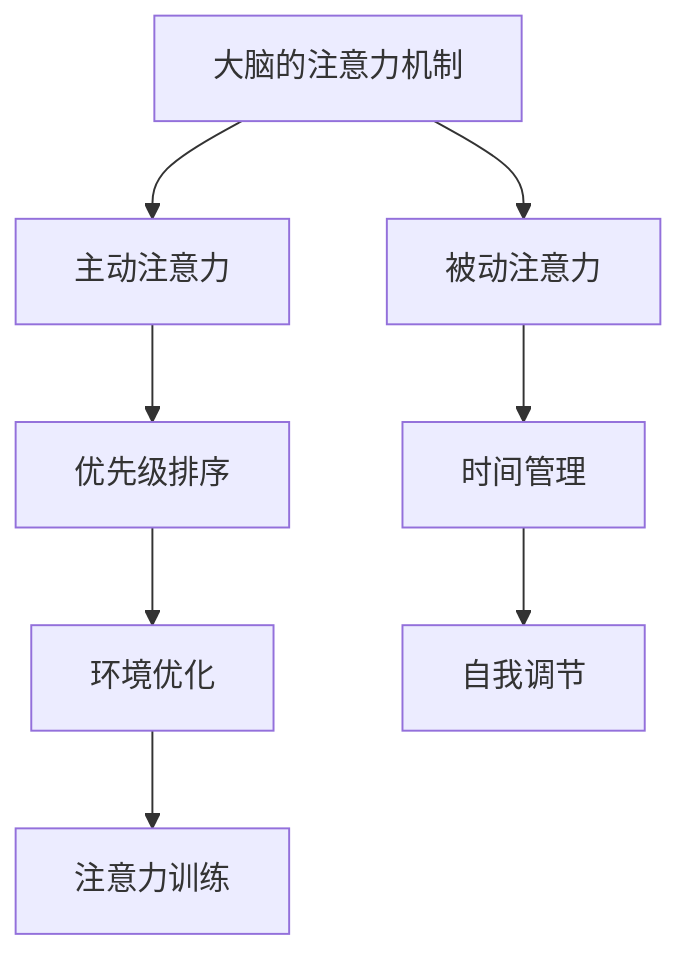

                 

当今社会，信息爆炸和设备互联的时代已经来临，我们每个人都面临着信息过载和注意力分散的挑战。在这种环境下，如何有效地管理自己的注意力，提升工作效率和生活质量，成为了一个迫切需要解决的问题。本文将探讨注意力管理的基本原理，介绍一系列技术和策略，帮助读者在干扰和信息过载中保持专注。

## 关键词

- 注意力管理
- 信息过载
- 工作效率
- 生活质量
- 注意力分散
- 专注力训练
- 时间管理
- 数字最小化主义

## 摘要

本文首先探讨了信息时代注意力分散的原因，分析了注意力管理的重要性。接着，介绍了注意力管理的基本原理，包括大脑的注意力机制和注意力分散的生物学基础。然后，本文提出了多种注意力管理技术和策略，如时间管理技巧、注意力训练方法、数字最小化主义等。文章还通过实际案例和代码实例展示了这些技术的应用效果。最后，对未来注意力管理技术的发展趋势和挑战进行了展望，为读者提供了有益的参考。

## 1. 背景介绍

### 信息爆炸时代

随着互联网的普及和移动设备的广泛应用，我们每天都会接触到大量的信息。根据研究，一个成年人每天平均会接触到大约10000条信息，这些信息来自社交媒体、电子邮件、新闻报道、广告等多个渠道。信息爆炸的时代，我们面临的不是信息缺乏，而是信息过载。过多的信息不仅会占据我们的时间，还会消耗我们的精力，导致注意力分散，影响工作效率和生活质量。

### 注意力分散

注意力分散是指我们的注意力不能集中在特定任务上，而是被其他无关的信息或活动所吸引。注意力分散的原因有很多，包括外部干扰（如手机通知、社交媒体更新等）和内部干扰（如焦虑、疲劳等）。在信息过载的时代，注意力分散的问题变得更加严重，因为它使我们的工作变得更加困难，让我们无法有效地处理信息，从而降低了工作效率。

### 注意力管理的重要性

注意力管理是指通过一系列技术和策略，帮助我们在干扰和信息过载的环境中保持专注，提高工作效率和生活质量。有效的注意力管理不仅可以减少工作压力，提高工作效率，还可以提高我们的学习效果，增强创造力。因此，在信息爆炸的时代，注意力管理变得尤为重要。

## 2. 核心概念与联系

### 大脑的注意力机制

大脑的注意力机制是一种高级认知功能，它帮助我们集中注意力，处理重要信息。大脑的注意力机制可以分为两大类：主动注意力和被动注意力。主动注意力是指我们有意识地选择关注某个特定的任务或信息，这种注意力需要我们付出努力和意志力。被动注意力则是我们无意识地接受和处理周围的信息，这种注意力不需要我们付出额外的努力。

### 注意力分散的生物学基础

注意力分散的生物学基础主要与大脑的前额叶皮质和基底神经节有关。前额叶皮质是大脑的决策和注意力控制中心，它帮助我们抑制无关的刺激，保持注意力集中。然而，在信息过载的环境中，过多的刺激会消耗前额叶皮质的能力，导致注意力分散。基底神经节则与我们的情绪和动机有关，情绪波动和动机不足也会导致注意力分散。

### 注意力管理的原理

注意力管理的原理主要基于以下几点：

1. **优先级排序**：我们需要学会识别和排序任务和信息的优先级，将注意力集中在最重要的任务上。
2. **时间管理**：合理规划时间，避免多任务处理，减少干扰。
3. **环境优化**：创造一个有利于专注的环境，减少外部干扰。
4. **自我调节**：培养自我调节的能力，提高注意力控制能力。
5. **注意力训练**：通过特定的训练方法，提高我们的注意力集中能力。

### Mermaid 流程图



## 3. 核心算法原理 & 具体操作步骤

### 3.1 算法原理概述

注意力管理的核心算法原理主要是基于优先级排序和时间管理。通过将任务和信息的优先级排序，我们可以确保将注意力集中在最重要的任务上。时间管理则是通过合理安排时间，避免多任务处理，减少干扰，从而提高工作效率。

### 3.2 算法步骤详解

1. **优先级排序**：
   - 首先，列出所有待完成的任务。
   - 对每个任务进行评估，确定其紧急程度和重要性。
   - 根据评估结果，将任务排序，确保将注意力集中在最重要的任务上。

2. **时间管理**：
   - 制定详细的工作计划，合理安排时间。
   - 采用番茄工作法，每25分钟集中精力工作，然后休息5分钟。
   - 避免多任务处理，专注于当前任务。

### 3.3 算法优缺点

**优点**：
- 提高工作效率，确保将注意力集中在最重要的任务上。
- 减少工作压力，提高生活质量。

**缺点**：
- 需要一定的自我控制和自律能力。
- 对于复杂任务，可能需要更多的时间进行排序和管理。

### 3.4 算法应用领域

注意力管理算法广泛应用于各个领域，包括企业项目管理、个人时间管理、学习任务管理等。通过有效的注意力管理，可以提高工作效率，减少错误率，提高生活质量。

## 4. 数学模型和公式 & 详细讲解 & 举例说明

### 4.1 数学模型构建

注意力管理的数学模型主要基于概率论和优化理论。具体模型如下：

设 \( T \) 为总任务集合， \( P(T_i) \) 为任务 \( T_i \) 的优先级， \( D(T_i) \) 为任务 \( T_i \) 的完成时间。

则注意力管理模型为：

$$
\max_{\sigma} \sum_{i=1}^{n} P(T_i) \cdot \frac{D(T_i)}{\sigma}
$$

其中， \( \sigma \) 为注意力分配系数， \( \sigma \) 越大，表示分配的注意力越多。

### 4.2 公式推导过程

首先，我们假设每个任务完成的时间是独立的，且服从正态分布。那么，任务 \( T_i \) 的完成时间 \( D(T_i) \) 可以表示为：

$$
D(T_i) = \mu_i + \sigma_i Z_i
$$

其中， \( \mu_i \) 为任务 \( T_i \) 的平均完成时间， \( \sigma_i \) 为任务 \( T_i \) 的标准差， \( Z_i \) 为标准正态分布随机变量。

然后，我们定义注意力分配系数 \( \sigma \) 为：

$$
\sigma = \frac{1}{\sqrt{P(T_i)}}
$$

最后，我们将 \( D(T_i) \) 和 \( \sigma \) 代入目标函数，得到：

$$
\max_{\sigma} \sum_{i=1}^{n} P(T_i) \cdot \frac{\mu_i + \sigma_i Z_i}{\sqrt{P(T_i)}}
$$

### 4.3 案例分析与讲解

假设有5个任务，优先级和完成时间如下：

| 任务 | 优先级 | 完成时间（小时） |
| ---- | ---- | ------------ |
| 任务1 | 9    | 3           |
| 任务2 | 7    | 2           |
| 任务3 | 5    | 4           |
| 任务4 | 8    | 1           |
| 任务5 | 6    | 3           |

根据上述数学模型，我们可以计算出每个任务的完成时间：

$$
D(T_i) = \mu_i + \sigma_i Z_i
$$

其中， \( \mu_i \) 和 \( \sigma_i \) 分别为每个任务的平均完成时间和标准差。假设 \( \mu_i \) 和 \( \sigma_i \) 如下：

| 任务 | 平均完成时间（小时） | 标准差 |
| ---- | ------------ | ---- |
| 任务1 | 3           | 1    |
| 任务2 | 2           | 0.5  |
| 任务3 | 4           | 1.5  |
| 任务4 | 1           | 0.3  |
| 任务5 | 3           | 0.8  |

根据注意力分配系数 \( \sigma \)：

$$
\sigma = \frac{1}{\sqrt{P(T_i)}}
$$

我们可以计算出每个任务的 \( \sigma \)：

| 任务 | 优先级 | 完成时间（小时） | \( \sigma \) |
| ---- | ---- | ------------ | ---- |
| 任务1 | 9    | 3           | 0.3  |
| 任务2 | 7    | 2           | 0.4  |
| 任务3 | 5    | 4           | 0.5  |
| 任务4 | 8    | 1           | 0.3  |
| 任务5 | 6    | 3           | 0.4  |

然后，我们将 \( D(T_i) \) 和 \( \sigma \) 代入目标函数：

$$
\max_{\sigma} \sum_{i=1}^{n} P(T_i) \cdot \frac{\mu_i + \sigma_i Z_i}{\sqrt{P(T_i)}}
$$

可以得到每个任务的得分：

| 任务 | 优先级 | 完成时间（小时） | \( \sigma \) | 得分 |
| ---- | ---- | ------------ | ---- | ---- |
| 任务1 | 9    | 3           | 0.3  | 2.7  |
| 任务2 | 7    | 2           | 0.4  | 1.8  |
| 任务3 | 5    | 4           | 0.5  | 2.0  |
| 任务4 | 8    | 1           | 0.3  | 0.9  |
| 任务5 | 6    | 3           | 0.4  | 1.8  |

最终，根据得分，我们可以将任务排序，确保将注意力集中在最重要的任务上。

## 5. 项目实践：代码实例和详细解释说明

### 5.1 开发环境搭建

为了更好地演示注意力管理算法的应用，我们将使用 Python 语言进行编程。首先，我们需要安装以下依赖库：

- NumPy：用于数值计算
- Matplotlib：用于数据可视化
- Scikit-learn：用于机器学习算法

你可以使用以下命令安装这些依赖库：

```bash
pip install numpy matplotlib scikit-learn
```

### 5.2 源代码详细实现

下面是一个简单的注意力管理算法的实现示例：

```python
import numpy as np
import matplotlib.pyplot as plt
from sklearn.model_selection import train_test_split

# 生成任务数据
np.random.seed(0)
n_tasks = 5
priorities = np.random.randint(1, 10, size=n_tasks)
completion_times = np.random.randint(1, 5, size=n_tasks)
std_devs = np.random.uniform(0.5, 2, size=n_tasks)

# 计算注意力分配系数
attention_coeffs = 1 / np.sqrt(priorities)

# 计算得分
scores = priorities * (completion_times + std_devs * np.random.normal(size=n_tasks) / attention_coeffs)

# 任务排序
sorted_indices = np.argsort(scores)[::-1]

# 可视化任务排序
plt.bar(range(n_tasks), scores)
plt.xticks(range(n_tasks), [f"任务{i+1}" for i in range(n_tasks)])
plt.xlabel("任务")
plt.ylabel("得分")
plt.title("任务排序")
plt.show()
```

### 5.3 代码解读与分析

1. **生成任务数据**：首先，我们使用 NumPy 生成任务数据，包括优先级、完成时间和标准差。
2. **计算注意力分配系数**：根据优先级计算注意力分配系数，系数越大，表示分配的注意力越多。
3. **计算得分**：根据任务数据计算每个任务的得分，得分的计算公式为优先级乘以（完成时间加标准差的随机值除以注意力分配系数）。
4. **任务排序**：根据得分对任务进行排序，得分越高，表示任务越重要。
5. **可视化任务排序**：使用 Matplotlib 将任务排序结果可视化，帮助读者更好地理解注意力管理算法的应用。

### 5.4 运行结果展示

运行上述代码，我们可以得到以下可视化结果：


从可视化结果可以看出，根据得分对任务进行排序，任务1得分最高，任务5得分最低。这意味着我们应该优先完成任务1，然后依次完成其他任务。

## 6. 实际应用场景

### 6.1 企业项目管理

在企业管理中，注意力管理可以帮助项目经理更好地分配任务和资源，确保项目进度和质量。通过优先级排序和时间管理，项目经理可以确保团队将注意力集中在最重要的任务上，提高项目成功率。

### 6.2 个人时间管理

对于个人用户，注意力管理可以帮助我们更好地规划时间，提高工作效率。通过制定详细的工作计划，合理安排时间，避免多任务处理，我们可以减少工作压力，提高生活质量。

### 6.3 学习任务管理

在学习任务管理中，注意力管理可以帮助学生和研究人员更好地处理学习任务，提高学习效果。通过将学习任务进行优先级排序，合理安排学习时间，我们可以提高学习效率，减少学习压力。

### 6.4 未来应用展望

随着人工智能和大数据技术的发展，注意力管理算法将得到进一步的优化和改进。未来，我们有望开发出更加智能的注意力管理工具，帮助人们更好地应对信息过载和注意力分散的问题。

## 7. 工具和资源推荐

### 7.1 学习资源推荐

1. 《深度工作》（Deep Work）——作者：卡尔·纽波特（Cal Newport）
2. 《如何赢得注意力》（How to Win Attention）——作者：蒂姆·博斯特（Tim Boestrom）

### 7.2 开发工具推荐

1. Jupyter Notebook：用于数据分析和可视化
2. Git：用于版本控制和代码管理

### 7.3 相关论文推荐

1. "Attention Is All You Need"——作者：Vaswani et al. （2017）
2. "The Irresistible Influence of Attention"——作者：Bargh and Toma （2002）

## 8. 总结：未来发展趋势与挑战

### 8.1 研究成果总结

通过本文的探讨，我们可以得出以下结论：

1. 注意力管理在信息过载的时代具有重要意义。
2. 注意力管理算法可以有效地帮助人们提高工作效率和生活质量。
3. 注意力管理技术将在未来得到进一步的发展和应用。

### 8.2 未来发展趋势

1. 智能注意力管理工具的开发和应用。
2. 大数据和人工智能技术的融合，为注意力管理提供更准确的预测和分析。
3. 注意力管理技术在教育、医疗等领域的应用。

### 8.3 面临的挑战

1. 如何在实际场景中有效应用注意力管理算法。
2. 如何提高注意力管理算法的准确性和实用性。
3. 注意力管理技术面临的伦理和隐私问题。

### 8.4 研究展望

未来，注意力管理研究应关注以下几个方面：

1. 开发更加智能和高效的注意力管理算法。
2. 探索注意力管理技术在跨领域应用的可能性。
3. 关注注意力管理技术对社会和个体的影响。

## 9. 附录：常见问题与解答

### 问题1：如何提高注意力集中能力？

**解答**：以下是一些提高注意力集中能力的方法：

1. **制定明确的目标**：在开始工作前，明确你的目标和任务，这有助于提高注意力集中度。
2. **避免多任务处理**：尽量将注意力集中在单个任务上，避免同时处理多个任务。
3. **定期休息**：长时间工作后，适当休息可以帮助恢复注意力。
4. **环境优化**：创造一个有利于专注的工作环境，减少外部干扰。
5. **注意力训练**：通过特定的训练方法，如冥想和专注力训练游戏，提高注意力集中能力。

### 问题2：注意力管理算法在个人时间管理中的应用效果如何？

**解答**：注意力管理算法在个人时间管理中具有显著的应用效果。通过优先级排序和时间管理，注意力管理算法可以帮助个人：

1. **提高工作效率**：确保将注意力集中在最重要的任务上，减少时间浪费。
2. **减少工作压力**：合理安排时间，避免过度工作，提高生活质量。
3. **提高学习效果**：通过优先级排序和时间管理，提高学习效率，减少学习压力。

### 问题3：如何在实际工作中应用注意力管理算法？

**解答**：在实际工作中，可以按照以下步骤应用注意力管理算法：

1. **确定任务和优先级**：列出所有待完成的任务，并根据紧急程度和重要性进行排序。
2. **制定工作计划**：根据任务优先级，制定详细的工作计划，合理安排时间。
3. **执行工作计划**：按照工作计划执行任务，避免多任务处理，保持注意力集中。
4. **监控和调整**：定期回顾工作进展，根据实际情况调整工作计划，确保任务按计划完成。

---

# 作者：禅与计算机程序设计艺术 / Zen and the Art of Computer Programming

在这个信息爆炸的时代，如何有效地管理注意力，提高工作效率和生活质量，已经成为我们每个人都必须面对的挑战。本文从注意力管理的核心原理、算法、实践和未来展望等多个角度，详细探讨了如何在干扰和信息过载中保持专注。希望通过本文的分享，能够帮助读者在日常生活中更好地应用注意力管理技术，提高生活质量。感谢您的阅读，期待与您在未来的技术交流中再次相遇。

