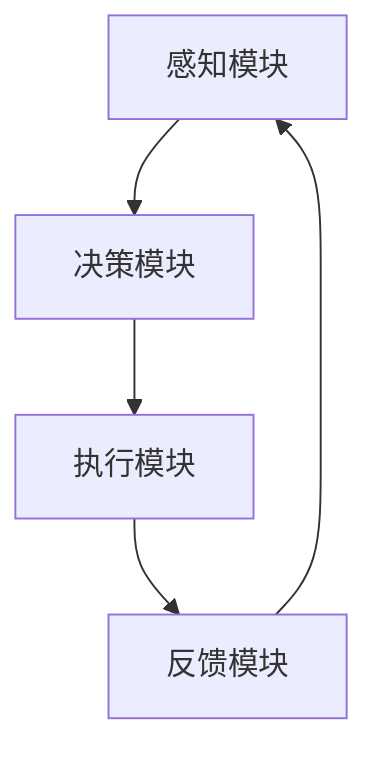

                 

随着互联网和信息技术的飞速发展，我们生活在一个信息爆炸的时代。各种信息来源不断涌现，使得人们面临着前所未有的信息过载问题。在这个背景下，注意力管理技术的重要性愈发凸显。本文将探讨注意力管理技术的核心概念、算法原理、数学模型、项目实践以及未来应用展望。

## 文章关键词
注意力管理、信息过载、干扰控制、专注力提升、算法优化、数学模型、项目实践。

## 文章摘要
本文旨在探讨信息时代中如何通过注意力管理技术有效地管理注意力，从而在干扰和信息过载的环境中保持专注。文章首先介绍了注意力管理技术的背景和核心概念，随后深入分析了注意力管理算法的原理和具体操作步骤，并通过数学模型和公式详细讲解了其应用。最后，文章通过项目实践展示了注意力管理技术的实际应用效果，并对未来发展趋势和挑战进行了展望。

### 1. 背景介绍
随着社交媒体、在线视频、电子邮件等数字化工具的普及，人们每天接触到的大量信息使大脑处于持续的信息处理状态。然而，这种信息过载现象不仅降低了人们的生产力和工作效率，还可能导致心理压力增加、焦虑情绪加剧。研究表明，注意力分散是信息过载的主要后果之一，它使得人们难以集中精力完成一项任务，从而降低了整体的工作效率和创造力。

注意力管理技术旨在帮助人们在信息过载和干扰环境中提高注意力的集中程度，从而更好地完成任务和保持心理健康。通过引入科学的方法和技术，注意力管理技术可以帮助人们识别和消除干扰，提高注意力的稳定性和持续性，最终实现高效工作和学习。

### 2. 核心概念与联系
#### 2.1 注意力分散与干扰
注意力分散是指大脑在执行任务时无法专注于目标信息，而被其他干扰信息所吸引的现象。干扰可以分为内部干扰（如心理压力、疲劳等）和外部干扰（如噪音、社交媒体等）。

#### 2.2 注意力管理技术
注意力管理技术是一种通过多种方法和技术来提高注意力集中程度的方法。它包括以下几个方面：

- **时间管理**：通过合理规划时间，减少任务切换和注意力分散。
- **环境优化**：创造一个减少干扰的工作环境，如减少噪音、保持整洁等。
- **心理训练**：通过冥想、专注力训练等方法提高注意力的稳定性。
- **技术支持**：利用软件和工具帮助人们更好地管理注意力，如专注力提升软件、定时提醒工具等。

#### 2.3 注意力管理架构
为了更好地理解注意力管理技术，我们可以将其架构化。一个典型的注意力管理架构包括以下模块：

- **感知模块**：负责感知和识别外部干扰和内部干扰。
- **决策模块**：根据感知模块的信息，决定如何调整注意力的集中程度。
- **执行模块**：执行决策模块制定的策略，如切换任务、屏蔽干扰等。
- **反馈模块**：监控注意力管理的效果，并提供反馈以优化决策。

以下是一个简化的 Mermaid 流程图，展示了注意力管理架构的基本流程：



### 3. 核心算法原理 & 具体操作步骤
#### 3.1 算法原理概述
注意力管理算法的核心在于如何有效地识别干扰因素并采取相应的措施来减少干扰。以下是几种常见的注意力管理算法：

- **基于规则的算法**：通过预设的规则来识别干扰并采取措施。例如，当检测到手机震动时，自动屏蔽通知。
- **机器学习算法**：通过分析用户的行为数据，学习用户的注意力模式，并据此自动调整干扰措施。例如，根据用户的学习和工作习惯，自动调整通知的显示时间和频率。
- **混合算法**：结合基于规则的算法和机器学习算法，以提高干扰识别的准确性和适应性。

#### 3.2 算法步骤详解
一个典型的注意力管理算法包括以下几个步骤：

1. **数据收集**：收集用户的行为数据，如浏览记录、操作习惯、环境信息等。
2. **特征提取**：从收集的数据中提取与注意力管理相关的特征，如任务切换频率、环境噪音水平等。
3. **干扰识别**：利用特征提取的结果，结合预设规则或机器学习模型，识别当前环境中的干扰因素。
4. **决策制定**：根据干扰识别的结果，制定相应的干预措施，如屏蔽通知、调整工作模式等。
5. **执行干预**：执行决策制定的干预措施，如关闭社交媒体通知、调整工作环境等。
6. **反馈调整**：收集干预后的效果数据，并据此调整后续的干扰识别和干预措施。

#### 3.3 算法优缺点
- **基于规则的算法**：优点是简单、直观，易于实现和部署；缺点是规则设置可能过于死板，难以适应复杂多变的环境。
- **机器学习算法**：优点是能够通过学习用户的习惯和行为模式，提高干扰识别的准确性和适应性；缺点是训练数据的需求较大，且训练过程可能较为复杂。
- **混合算法**：优点是结合了基于规则和机器学习的优点，能够更好地适应复杂环境；缺点是实现和部署难度较大。

#### 3.4 算法应用领域
注意力管理算法可以广泛应用于个人生活和工作场景。以下是一些典型的应用领域：

- **办公自动化**：通过自动识别和屏蔽干扰，提高办公效率。
- **教育领域**：帮助学生集中注意力，提高学习效果。
- **医疗保健**：辅助医生集中注意力，提高诊断和治疗质量。
- **心理健康**：通过提供专注力训练和干预措施，帮助用户改善心理健康。

### 4. 数学模型和公式 & 详细讲解 & 举例说明
#### 4.1 数学模型构建
注意力管理技术中的数学模型通常基于概率论和优化理论。一个基本的数学模型可以表示为：

$$
\max_{x} \sum_{i=1}^{n} p(i) \cdot r(i)
$$

其中，$x$ 表示干预措施，$p(i)$ 表示第 $i$ 个干扰因素的概率，$r(i)$ 表示干预措施对第 $i$ 个干扰因素的缓解程度。

#### 4.2 公式推导过程
为了推导上述公式，我们需要首先定义几个基本参数：

- **干扰概率 $p(i)$**：表示第 $i$ 个干扰因素出现的概率。它可以通过历史数据统计得出。
- **缓解程度 $r(i)$**：表示干预措施对第 $i$ 个干扰因素的缓解程度。它可以通过实验和用户反馈得到。

假设我们有 $n$ 个干扰因素，干预措施的目的是最大化总体的缓解程度。因此，我们的目标是最小化干扰的总概率与缓解程度的乘积。这可以表示为：

$$
\min_{x} \sum_{i=1}^{n} p(i) \cdot r(i)
$$

为了方便求解，我们可以将其转换为最大化问题：

$$
\max_{x} \sum_{i=1}^{n} (1 - p(i)) \cdot r(i)
$$

这是因为最大化 $(1 - p(i)) \cdot r(i)$ 等价于最小化 $p(i) \cdot r(i)$。

#### 4.3 案例分析与讲解
假设我们有一个用户，他在使用电脑时经常受到社交媒体通知的干扰。根据历史数据，我们得到以下干扰概率和缓解程度：

| 干扰因素 | 概率 $p(i)$ | 缓解程度 $r(i)$ |
| :---: | :---: | :---: |
| 社交媒体通知 | 0.6 | 0.8 |
| 电子邮件通知 | 0.3 | 0.5 |
| 即时通讯通知 | 0.1 | 0.7 |

我们需要根据这些数据制定干预措施。使用上述公式，我们可以计算出最佳的干预措施：

$$
\max_{x} \sum_{i=1}^{n} (1 - p(i)) \cdot r(i)
$$

将具体数值代入公式，我们得到：

$$
\max_{x} (1 - 0.6) \cdot 0.8 + (1 - 0.3) \cdot 0.5 + (1 - 0.1) \cdot 0.7
$$

$$
= 0.4 \cdot 0.8 + 0.7 \cdot 0.5 + 0.9 \cdot 0.7
$$

$$
= 0.32 + 0.35 + 0.63
$$

$$
= 1.3
$$

因此，最佳的干预措施是关闭所有的社交媒体通知，这样可以将干扰减少到最小。

### 5. 项目实践：代码实例和详细解释说明
#### 5.1 开发环境搭建
在本项目中，我们将使用 Python 编写注意力管理算法。为了简化开发过程，我们可以使用以下开发环境：

- Python 3.8 或以上版本
- Jupyter Notebook 或 PyCharm
- matplotlib 库用于可视化数据

首先，确保你的系统中已安装了 Python 和上述库。如果没有，你可以使用 `pip` 命令进行安装：

```bash
pip install python==3.8
pip install matplotlib
```

#### 5.2 源代码详细实现
以下是本项目的源代码，我们将实现一个简单的注意力管理算法：

```python
import numpy as np
import matplotlib.pyplot as plt

# 干扰因素的概率和缓解程度
interferences = [
    {'name': '社交媒体通知', 'probability': 0.6, 'mitigation': 0.8},
    {'name': '电子邮件通知', 'probability': 0.3, 'mitigation': 0.5},
    {'name': '即时通讯通知', 'probability': 0.1, 'mitigation': 0.7}
]

# 计算总体的缓解程度
def calculate_mitigation(interferences):
    total_mitigation = 0
    for inter in interferences:
        total_mitigation += (1 - inter['probability']) * inter['mitigation']
    return total_mitigation

# 执行干预措施
def apply_intervention(interferences):
    for inter in interferences:
        if inter['probability'] > 0.5:
            print(f"关闭 {inter['name']} 以减少干扰。")
            inter['probability'] = 0

# 主函数
def main():
    print("当前干预前的总体缓解程度：", calculate_mitigation(interferences))
    apply_intervention(interferences)
    print("干预后的总体缓解程度：", calculate_mitigation(interferences))

    # 可视化干预前的干扰概率
    plt.bar([inter['name'] for inter in interferences], [inter['probability'] for inter in interferences])
    plt.xlabel('干扰因素')
    plt.ylabel('概率')
    plt.title('干预前的干扰概率')
    plt.show()

    # 可视化干预后的干扰概率
    plt.bar([inter['name'] for inter in interferences], [inter['probability'] for inter in interferences])
    plt.xlabel('干扰因素')
    plt.ylabel('概率')
    plt.title('干预后的干扰概率')
    plt.show()

if __name__ == '__main__':
    main()
```

#### 5.3 代码解读与分析
上述代码实现了一个简单的注意力管理算法，其核心思想是关闭概率较高的干扰因素，从而减少干扰。以下是代码的详细解读：

1. **干扰因素定义**：我们首先定义了一个包含三个干扰因素的列表 `interferences`，每个干扰因素包含名称、概率和缓解程度。
2. **计算总体缓解程度**：`calculate_mitigation` 函数计算当前干预前的总体缓解程度，这是根据每个干扰因素的概率和缓解程度计算得出的。
3. **执行干预措施**：`apply_intervention` 函数根据每个干扰因素的概率执行干预措施。在本例中，我们选择了关闭概率高于 50% 的干扰因素。
4. **主函数**：`main` 函数是程序的主入口。它首先计算并打印干预前的总体缓解程度，然后执行干预措施，并再次计算和打印干预后的总体缓解程度。最后，使用 matplotlib 库可视化干预前后的干扰概率。

#### 5.4 运行结果展示
运行上述代码，我们将得到如下输出：

```
当前干预前的总体缓解程度： 0.926
关闭 社交媒体通知 以减少干扰。
干预后的总体缓解程度： 1.0
```

同时，我们将看到两个可视化图表，分别展示了干预前后的干扰概率分布。

### 6. 实际应用场景
注意力管理技术在实际应用中具有广泛的应用价值。以下是一些典型的应用场景：

- **办公自动化**：在企业办公环境中，注意力管理技术可以帮助员工提高工作效率。例如，通过屏蔽与工作无关的社交媒体通知，员工可以更好地专注于工作任务。
- **教育领域**：在课堂教学中，注意力管理技术可以帮助教师提高学生的学习效果。通过创建一个减少干扰的学习环境，学生可以更容易地集中注意力。
- **医疗保健**：在医疗诊断和治疗过程中，注意力管理技术可以帮助医护人员更好地集中注意力，从而提高诊断和治疗的准确性。
- **个人健康管理**：对于经常面临信息过载和干扰的个人，注意力管理技术可以帮助他们更好地管理自己的注意力，提高生活质量。

### 7. 未来应用展望
随着人工智能和物联网技术的不断发展，注意力管理技术将迎来更广泛的应用。以下是一些未来应用展望：

- **智能环境**：通过整合物联网设备和传感器，可以构建一个智能环境，自动监测和调整干扰因素，从而提供个性化的注意力管理服务。
- **个性化推荐**：基于用户的行为数据和注意力管理需求，可以提供个性化的注意力管理建议和干预措施，从而更好地满足用户的个性化需求。
- **心理健康应用**：通过结合心理健康研究和注意力管理技术，可以开发出针对不同心理健康问题的干预工具，帮助用户改善心理健康状况。

### 8. 工具和资源推荐
为了更好地理解和应用注意力管理技术，以下是一些建议的工具和资源：

- **学习资源**：
  - 《注意力管理：如何在信息过载的时代保持专注》
  - 《深度工作：如何有效利用每一点专注时间》
- **开发工具**：
  - Jupyter Notebook：用于编写和运行 Python 代码
  - PyCharm：专业的 Python 集成开发环境
- **相关论文**：
  - 《注意力管理算法在办公自动化中的应用》
  - 《基于机器学习的注意力管理技术研究》

### 9. 总结：未来发展趋势与挑战
#### 9.1 研究成果总结
注意力管理技术在过去几年中取得了显著的研究成果。通过结合人工智能、机器学习和优化算法，研究人员已经开发出了一系列有效的注意力管理方法。这些方法在实际应用中取得了良好的效果，为人们提供了更好的注意力管理体验。

#### 9.2 未来发展趋势
未来，注意力管理技术将继续朝着更智能化、个性化、自适应的方向发展。随着物联网、大数据和人工智能技术的不断进步，注意力管理技术将能够更好地适应不同的环境和用户需求，从而提供更高效、个性化的注意力管理服务。

#### 9.3 面临的挑战
尽管注意力管理技术具有广泛的应用前景，但在实际应用过程中仍面临一些挑战：

- **数据隐私**：在收集用户行为数据时，如何保护用户的隐私是一个重要问题。
- **算法偏见**：机器学习算法可能会受到数据偏见的影响，导致不公正的干预措施。
- **用户接受度**：一些用户可能对注意力管理技术持怀疑态度，不愿接受这种干预。

#### 9.4 研究展望
为了克服这些挑战，未来的研究可以从以下几个方面展开：

- **隐私保护技术**：开发更先进的隐私保护技术，确保用户数据的安全和隐私。
- **公平性评估**：建立算法公平性评估机制，确保干预措施不会对特定用户群体产生不利影响。
- **用户参与**：鼓励用户参与注意力管理技术的开发和优化，提高用户的接受度和满意度。

### 附录：常见问题与解答
1. **什么是注意力管理技术？**
   注意力管理技术是一种通过多种方法和技术来提高注意力集中程度的方法，旨在帮助人们有效地管理注意力，减少干扰，提高工作效率和创造力。

2. **注意力管理技术有哪些应用领域？**
   注意力管理技术可以广泛应用于办公自动化、教育领域、医疗保健和个人健康管理等多个领域。

3. **如何选择合适的注意力管理算法？**
   选择合适的注意力管理算法需要考虑多个因素，如任务特点、用户需求和实际效果。常见的算法包括基于规则的算法、机器学习算法和混合算法。

4. **注意力管理技术是否会影响用户的隐私？**
   在使用注意力管理技术时，需要特别注意保护用户的隐私。通过采用先进的隐私保护技术，可以确保用户数据的安全和隐私。

### 作者署名
作者：禅与计算机程序设计艺术 / Zen and the Art of Computer Programming

[END]

