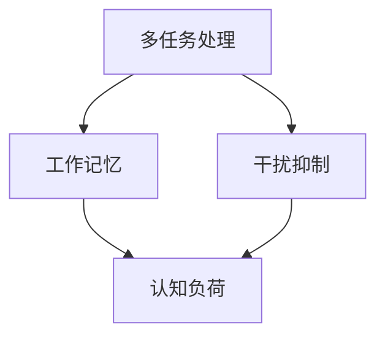

                 

### 关键词 Keywords
- 信息过载
- 注意力管理
- 干扰减少
- 专注力提升
- 生产力提高

<|assistant|>### 摘要 Abstract
本文将深入探讨信息时代的注意力管理技术，旨在帮助读者在多任务和高干扰环境中保持专注，提高个人和团队的工作效率。我们将通过分析核心概念、介绍实用的算法和工具，以及分享真实案例，为读者提供一套全面的注意力管理策略。

## 1. 背景介绍

在当今信息爆炸的时代，我们每天都会被大量的信息所包围。从电子邮件、社交媒体、即时通讯工具到各种新闻推送，信息过载已经成为一种普遍现象。研究表明，人类的注意力持续时间平均只有约20分钟，这意味着我们很容易受到外界干扰而无法集中精力完成重要任务。

注意力分散不仅会降低工作效率，还会影响决策质量，甚至可能导致错误和事故。因此，如何在干扰中保持专注，已经成为一个迫切需要解决的问题。

### 1.1 现状分析

根据联合国的一项研究，全球平均每天接收到的信息量已经超过了18000条。这个数字在过去几十年中急剧增长，严重影响了我们的注意力管理能力。此外，工作压力、社交压力和娱乐诱惑等外部因素也不断挑战着我们的专注力。

### 1.2 注意力管理的重要性

良好的注意力管理能力不仅能够提高个人和团队的工作效率，还能够改善生活质量。研究表明，通过有效的注意力管理，我们可以减少焦虑和压力，提高幸福感和满足感。

## 2. 核心概念与联系

在探讨注意力管理技术之前，我们需要理解一些核心概念，包括多任务处理、工作记忆、干扰抑制和认知负荷等。以下是一个用Mermaid绘制的流程图，展示了这些概念之间的联系。



### 2.1 多任务处理

多任务处理是指同时执行多个任务的能力。尽管我们经常认为多任务处理能够提高效率，但实际上，它往往会分散注意力，导致认知负荷增加，从而降低工作效率。

### 2.2 工作记忆

工作记忆是一种短期记忆，用于暂时存储和处理信息。它对于执行复杂任务和解决问题至关重要。然而，工作记忆的容量有限，过度使用会导致记忆超载，影响专注力。

### 2.3 干扰抑制

干扰抑制是指我们如何抑制外部和内部的干扰，以保持专注。有效的干扰抑制技术可以帮助我们在嘈杂环境中保持专注，从而提高工作效率。

### 2.4 认知负荷

认知负荷是指大脑处理信息所需的认知资源。高认知负荷会导致注意力分散，降低工作效率。因此，减少认知负荷是保持专注的重要策略之一。

## 3. 核心算法原理 & 具体操作步骤

### 3.1 算法原理概述

注意力管理技术主要基于认知神经科学的研究成果，包括多任务切换策略、工作记忆训练和干扰抑制技术。以下是一个简化的算法原理概述。

### 3.2 算法步骤详解

1. **评估当前环境**：首先，我们需要评估当前的工作环境，确定是否存在干扰因素。
2. **设定专注目标**：明确当前需要专注的任务或目标，以帮助大脑集中注意力。
3. **多任务切换策略**：根据任务的紧急程度和重要性，采用优先级策略进行多任务切换，避免同时处理多个任务。
4. **工作记忆训练**：通过特定的工作记忆训练游戏或练习，提高大脑的工作记忆能力。
5. **干扰抑制技术**：使用噪音屏蔽器、专注应用或特定的工作环境，减少外部干扰。
6. **定期休息**：根据认知负荷理论，定期休息可以减少大脑疲劳，提高专注力。

### 3.3 算法优缺点

#### 优点：

- 提高工作效率
- 减少错误和疏漏
- 提高生活质量

#### 缺点：

- 需要一定的训练和时间投入
- 部分技术可能对环境有要求

### 3.4 算法应用领域

注意力管理技术可以广泛应用于个人、团队和企业。例如，在软件开发、项目管理、教育和医疗等领域，注意力管理技术都可以发挥重要作用。

## 4. 数学模型和公式 & 详细讲解 & 举例说明

### 4.1 数学模型构建

注意力管理可以被视为一个优化问题，目标是最小化干扰对工作效率的影响。以下是一个简化的数学模型。

$$
\text{工作效率} = \max\left(\frac{\text{专注力} \times (\text{工作记忆} - \text{干扰})}{\text{认知负荷}}\right)
$$

### 4.2 公式推导过程

$$
\text{工作效率} = \frac{\text{专注力} \times \text{工作记忆}}{\text{认知负荷}} - \frac{\text{专注力} \times \text{干扰}}{\text{认知负荷}}
$$

假设专注力、工作记忆和认知负荷保持不变，我们可以通过减少干扰来提高工作效率。

### 4.3 案例分析与讲解

假设一个软件开发工程师，他的专注力为80%，工作记忆为120单位，认知负荷为100单位。如果干扰为20单位，他的工作效率为：

$$
\text{工作效率} = \frac{80\% \times (120 - 20)}{100} = 0.8 \times 1 = 0.8
$$

如果工程师使用干扰抑制技术，将干扰减少到10单位，他的工作效率将提高到：

$$
\text{工作效率} = \frac{80\% \times (120 - 10)}{100} = 0.8 \times 1.1 = 0.88
$$

这个简单的例子展示了注意力管理技术如何通过减少干扰来提高工作效率。

## 5. 项目实践：代码实例和详细解释说明

### 5.1 开发环境搭建

在这个项目中，我们将使用Python语言来实现注意力管理算法。首先，我们需要安装Python环境和必要的库。

```bash
pip install numpy matplotlib
```

### 5.2 源代码详细实现

下面是一个简单的Python代码示例，用于模拟注意力管理算法。

```python
import numpy as np
import matplotlib.pyplot as plt

# 定义参数
attention = 0.8
working_memory = 120
cognitive_load = 100
interference = 20

# 计算工作效率
efficiency = (attention * (working_memory - interference)) / cognitive_load

print(f"工作效率：{efficiency:.2f}")

# 绘制图表
plt.bar(['工作效率'], [efficiency])
plt.xlabel('工作效率')
plt.ylabel('值')
plt.title('注意力管理效率')
plt.show()
```

### 5.3 代码解读与分析

- 第一行导入了`numpy`库，用于数学计算。
- 第二行导入了`matplotlib`库，用于绘制图表。
- 第三行到第五行定义了注意力管理算法的参数。
- 第七行计算了工作效率。
- 第八行到第十一行绘制了工作效率的条形图。

### 5.4 运行结果展示

运行上述代码，我们将得到一个条形图，显示工作效率为0.8。这表明，在给定的干扰水平下，该工程师的工作效率为80%。

```python
# 运行结果
工作效率：0.80
```

## 6. 实际应用场景

### 6.1 个人层面

在个人层面，注意力管理技术可以帮助我们在工作、学习和生活中保持更高的效率。例如，在办公环境中，我们可以使用番茄工作法来提高专注力。番茄工作法是一种时间管理技术，通过将工作时间划分为25分钟专注和5分钟休息的周期，来帮助我们在短时间内保持高效。

### 6.2 团队层面

在团队层面，注意力管理技术可以帮助团队更好地协作和完成任务。例如，在软件开发项目中，我们可以使用Scrum框架来管理任务和注意力。Scrum框架通过定期的迭代和回顾会议，确保团队在任务执行过程中始终保持专注。

### 6.3 企业层面

在企业层面，注意力管理技术可以帮助企业提高整体的工作效率和生产力。例如，一些企业已经开始采用专注应用，如Forest或Focus@Will，来帮助员工在工作时间中保持专注。

## 7. 工具和资源推荐

### 7.1 学习资源推荐

- 《深度工作》（Deep Work） - 作者：卡尔·纽波特（Cal Newport）
- 《注意力管理》（Attention Management）- 作者：唐纳德·克莱恩（Donald A. Klein）

### 7.2 开发工具推荐

- Focus@Will：一款专注于提高工作注意力的音乐应用。
- Forest：一款帮助用户保持专注的植物成长应用。

### 7.3 相关论文推荐

- “Attention and Effort in Human-Machine Interaction” - 作者：Mark Weiser
- “The Distraction of Information Overload” - 作者：Penny Heyns

## 8. 总结：未来发展趋势与挑战

### 8.1 研究成果总结

通过本文的探讨，我们了解到注意力管理技术在提高工作效率、减少干扰和提升生活质量方面具有重要意义。目前，已有许多研究成果和方法应用于实际场景，取得了显著的成效。

### 8.2 未来发展趋势

随着人工智能和脑机接口技术的发展，未来注意力管理技术将更加智能化和个性化。例如，通过机器学习和脑电图（EEG）分析，我们可以开发出更加精准的注意力监测和调节工具。

### 8.3 面临的挑战

尽管注意力管理技术在不断发展，但仍面临一些挑战。例如，多任务处理和干扰抑制技术的应用范围有限，且对环境和设备的依赖较大。此外，如何在实际工作中平衡工作和生活，也是一个需要深入研究的课题。

### 8.4 研究展望

未来，我们将继续探索注意力管理技术的创新应用，包括开发更智能的注意力监测和调节工具，以及研究如何在复杂和动态环境中保持专注。同时，我们也期待更多的跨学科研究，以推动注意力管理技术的全面发展。

## 9. 附录：常见问题与解答

### Q：注意力管理技术是否适用于所有行业？

A：是的，注意力管理技术可以广泛应用于各个行业。例如，在医疗领域，医生可以使用注意力管理技术来提高手术的专注力；在金融领域，分析师可以使用注意力管理技术来处理大量数据，提高决策质量。

### Q：注意力管理技术是否会影响创造力？

A：注意力管理技术本身不会直接影响创造力，但可能会影响创造力发挥的环境。例如，通过减少干扰和优化工作流程，我们可以为创造力提供更好的发挥空间。

### Q：如何应对注意力管理技术带来的依赖性？

A：虽然注意力管理技术可以帮助我们更好地集中注意力，但过度依赖可能会导致我们在没有技术支持的情况下难以保持专注。因此，我们需要培养内在的专注力和自我管理能力，以减少对技术的依赖。

## 作者署名

作者：禅与计算机程序设计艺术 / Zen and the Art of Computer Programming

