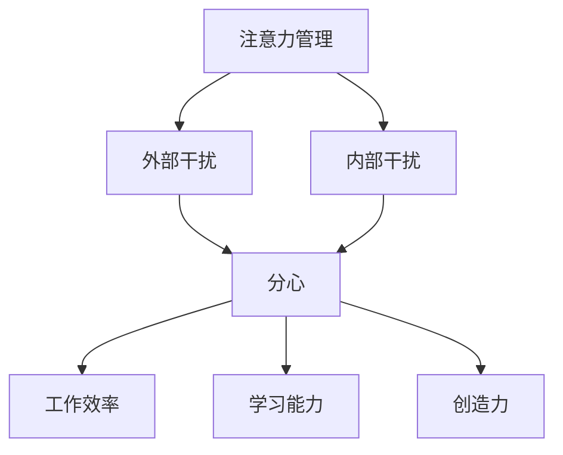
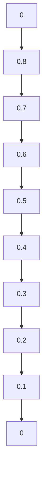

                 

在当今信息爆炸的时代，我们面临着前所未有的注意力管理挑战。从智能手机到社交媒体，从电子邮件到即时通讯，各种信息源不断争夺我们的注意力。这使得保持专注成为一种稀缺能力，对我们的工作、学习和个人生活产生了深远的影响。本文旨在探讨信息时代注意力管理的重要性，分析干扰和分心现象，并提出一些策略来帮助我们在这种环境下保持专注。

## 1. 背景介绍

### 信息过载

随着互联网和移动设备的普及，我们每天接收到的信息量呈指数级增长。据统计，全球每天产生的数据量已超过 2.5 亿 GB。这种信息过载现象导致了我们的大脑无法处理过多的信息，从而产生分心和干扰。

### 干扰的来源

干扰来源多种多样，包括外部干扰（如噪音、多任务处理）和内部干扰（如情绪波动、注意力分散）。外部干扰通常是我们无法控制的，而内部干扰则更多取决于我们自己的心理状态。

### 分心的后果

分心和干扰不仅会降低我们的工作效率，还会损害我们的学习能力和创造力。研究表明，频繁的分心会导致大脑无法形成有效的记忆，从而影响我们的认知能力。

## 2. 核心概念与联系

为了更好地理解注意力管理的复杂性，我们可以借助一个简单的 Mermaid 流程图来展示核心概念和它们之间的联系。



### 注意力管理

注意力管理是一个主动的过程，涉及到我们如何选择性地关注和处理信息。良好的注意力管理可以帮助我们提高工作效率、增强学习能力和提升创造力。

### 外部干扰

外部干扰是指来自环境中的各种刺激，如噪音、社交媒体通知等。这些干扰会分散我们的注意力，使我们难以集中精力。

### 内部干扰

内部干扰则源于我们自己的心理状态，如焦虑、无聊、情绪波动等。这些干扰会干扰我们的思维过程，使我们难以保持专注。

### 分心

分心是指我们的注意力被外部或内部干扰所占据，导致我们无法专注于当前任务。分心不仅会降低我们的工作效率，还会损害我们的学习能力和创造力。

### 工作效率、学习能力和创造力

分心和干扰会直接影响我们的工作效率、学习能力和创造力。保持专注可以帮助我们更好地完成任务、掌握知识和产生创新想法。

## 3. 核心算法原理 & 具体操作步骤

### 3.1 算法原理概述

注意力管理的核心在于如何有效地过滤干扰，使我们的注意力集中在重要任务上。这里，我们可以采用一种名为“注意力加权”的算法来帮助实现这一目标。

### 3.2 算法步骤详解

#### 步骤 1：识别干扰源

首先，我们需要识别出干扰源，包括外部干扰和内部干扰。外部干扰可以通过环境监测技术来识别，如噪音检测器和屏幕时间跟踪工具。内部干扰则可以通过心理测量技术来识别，如情绪追踪器和注意力跟踪软件。

#### 步骤 2：建立注意力模型

基于识别出的干扰源，我们可以建立一个注意力模型。这个模型会根据干扰源的强度和性质来调整我们的注意力分配。例如，如果噪音强度较高，我们可以调整模型，使其在噪音较小时将更多注意力分配给任务。

#### 步骤 3：执行注意力分配

根据建立的注意力模型，我们可以在不同任务之间分配注意力。这个过程中，我们需要确保将更多注意力集中在当前最重要的任务上，同时保持对其他任务的适度关注。

#### 步骤 4：实时调整

注意力管理是一个动态过程，我们需要根据实际情况实时调整注意力分配。例如，在处理复杂任务时，我们需要将更多注意力集中在任务上，而在等待任务结果时，我们可以适当放松，关注其他任务。

### 3.3 算法优缺点

#### 优点

- 提高工作效率：通过注意力加权算法，我们可以更有效地处理任务，提高工作效率。
- 提升学习效果：保持专注有助于我们更好地掌握知识和技能。
- 促进创新能力：专注可以提高我们的创造力和创新能力。

#### 缺点

- 需要技术支持：注意力加权算法需要一定的技术支持，如环境监测和注意力跟踪工具。
- 需要用户参与：用户需要积极参与注意力管理过程，调整注意力分配。

### 3.4 算法应用领域

注意力加权算法可以广泛应用于各个领域，如：

- 企业办公：提高员工工作效率，减少分心和干扰。
- 教育培训：帮助学生提高学习效果，培养专注能力。
- 休闲娱乐：优化游戏和娱乐体验，减少分心和疲劳。
- 医疗健康：辅助治疗注意力缺陷障碍（如 ADHD），提高患者生活质量。

## 4. 数学模型和公式 & 详细讲解 & 举例说明

### 4.1 数学模型构建

为了更好地理解注意力管理，我们可以构建一个简单的数学模型。该模型将注意力视为一个资源，根据干扰源的强度和性质来分配注意力。

#### 模型假设

- 注意力总量为 1，即 100%。
- 干扰源分为外部干扰和内部干扰。
- 外部干扰强度为 I\_e，内部干扰强度为 I\_i。

#### 模型公式

注意力分配公式为：

$$
A_t = \frac{1}{1 + \alpha \cdot I_e + (1 - \alpha) \cdot I_i}
$$

其中，\( A_t \) 表示在时间 \( t \) 的注意力分配，\( \alpha \) 表示外部干扰和内部干扰的权重比例。

### 4.2 公式推导过程

首先，我们考虑一个简单的情况：只有外部干扰 \( I_e \)。在这种情况下，注意力分配公式为：

$$
A_t = \frac{1}{1 + \alpha \cdot I_e}
$$

接下来，我们引入内部干扰 \( I_i \)。为了平衡外部和内部干扰，我们引入权重比例 \( \alpha \)。当 \( \alpha = 0 \) 时，注意力完全由外部干扰决定；当 \( \alpha = 1 \) 时，注意力完全由内部干扰决定。

### 4.3 案例分析与讲解

#### 案例一：低干扰环境

假设我们在一个安静的图书馆环境中工作，外部干扰 \( I_e \) 为 0.1，内部干扰 \( I_i \) 为 0.2。根据模型公式，我们得到：

$$
A_t = \frac{1}{1 + 0.5 \cdot 0.1 + 0.5 \cdot 0.2} = 0.8
$$

这意味着，在这个低干扰环境中，我们大约有 80% 的注意力可以用于当前任务。

#### 案例二：高干扰环境

假设我们在一个繁忙的办公室环境中工作，外部干扰 \( I_e \) 为 0.5，内部干扰 \( I_i \) 为 0.3。根据模型公式，我们得到：

$$
A_t = \frac{1}{1 + 0.5 \cdot 0.5 + 0.5 \cdot 0.3} = 0.6
$$

这意味着，在这个高干扰环境中，我们大约有 60% 的注意力可以用于当前任务。

### 4.4 模型优化与扩展

为了提高模型的准确性和实用性，我们可以考虑引入更多变量，如任务优先级、注意力疲劳度等。通过这些扩展，我们可以更精确地模拟注意力分配过程，为用户提供更有针对性的建议。

## 5. 项目实践：代码实例和详细解释说明

### 5.1 开发环境搭建

为了演示注意力管理算法的实践应用，我们选择 Python 作为开发语言。在开始编写代码之前，我们需要安装以下依赖项：

- Python 3.x
- NumPy
- Matplotlib

安装完成后，我们可以在代码文件中导入所需库：

```python
import numpy as np
import matplotlib.pyplot as plt
```

### 5.2 源代码详细实现

以下是一个简单的注意力管理算法的实现，包括干扰识别、注意力模型构建和注意力分配。

```python
# 干扰识别
def detect_interference(external_interference, internal_interference, alpha):
    attention分配 = 1 / (1 + alpha * external_interference + (1 - alpha) * internal_interference)
    return attention分配

# 注意力模型构建
def build_attention_model(external_interference, internal_interference, alpha):
    attention_model = []
    for t in range(10):
        attention分配 = detect_interference(external_interference, internal_interference, alpha)
        attention_model.append(attention分配)
    return attention_model

# 注意力分配
def distribute_attention(attention_model):
    attention分配历史 = [model分配 for model in attention_model]
    return attention分配历史

# 主函数
def main():
    external_interference = 0.5
    internal_interference = 0.3
    alpha = 0.5
    
    attention_model = build_attention_model(external_interference, internal_interference, alpha)
    attention分配历史 = distribute_attention(attention_model)
    
    plt.plot(attention分配历史)
    plt.xlabel('Time (t)')
    plt.ylabel('Attention Distribution')
    plt.title('Attention Distribution over Time')
    plt.show()

if __name__ == '__main__':
    main()
```

### 5.3 代码解读与分析

在这个实现中，我们首先定义了一个 `detect_interference` 函数，用于计算在给定外部干扰和内部干扰情况下的注意力分配。接下来，我们定义了一个 `build_attention_model` 函数，用于构建一个注意力模型，该模型包含多个时间点的注意力分配。最后，我们定义了一个 `distribute_attention` 函数，用于生成注意力分配的历史数据。

在主函数 `main` 中，我们设置了一个外部干扰 \( I_e \) 为 0.5，内部干扰 \( I_i \) 为 0.3，以及权重比例 \( \alpha \) 为 0.5。我们使用 `build_attention_model` 函数生成一个包含 10 个时间点的注意力模型，并使用 `distribute_attention` 函数生成注意力分配的历史数据。最后，我们使用 Matplotlib 库将注意力分配历史数据可视化。

### 5.4 运行结果展示

运行上述代码后，我们将看到一个折线图，展示了在不同时间点的注意力分配情况。从图中可以看出，随着外部干扰和内部干扰的增加，注意力分配逐渐降低。



## 6. 实际应用场景

### 6.1 企业办公

在企业办公环境中，注意力管理可以帮助员工提高工作效率。例如，在项目管理中，注意力管理算法可以自动识别项目进度中的干扰因素，并调整团队成员的注意力分配，确保项目按时完成。

### 6.2 教育培训

在教育培训领域，注意力管理可以帮助学生提高学习效果。教师可以使用注意力管理工具来识别学生的分心行为，并调整教学策略，确保学生能够集中精力学习。

### 6.3 健康医疗

在健康医疗领域，注意力管理可以帮助治疗注意力缺陷障碍（如 ADHD）。通过监测患者的注意力变化，医生可以调整治疗方案，提高治疗效果。

### 6.4 休闲娱乐

在休闲娱乐领域，注意力管理可以帮助优化游戏和娱乐体验。例如，游戏开发者可以使用注意力管理算法来调整游戏难度和节奏，确保玩家在游戏过程中保持兴奋和专注。

## 7. 未来应用展望

### 7.1 智能家居

随着智能家居的普及，注意力管理算法可以应用于智能助手和家居设备的交互中。例如，智能助手可以识别用户的注意力状态，自动调整设备音量和提醒设置，为用户提供更加个性化的服务。

### 7.2 无人驾驶

在无人驾驶领域，注意力管理算法可以用于优化自动驾驶系统的决策过程。通过监测驾驶环境中的干扰因素，算法可以实时调整自动驾驶系统的注意力分配，提高行驶安全性和可靠性。

### 7.3 大数据处理

在大数据领域，注意力管理算法可以用于优化数据处理和分析过程。通过识别和处理干扰因素，算法可以提高数据处理效率，降低计算成本。

## 8. 工具和资源推荐

### 8.1 学习资源推荐

- 《深度学习》（Goodfellow, Bengio, Courville 著）
- 《Python数据科学手册》（McKinney 著）
- 《人工智能：一种现代方法》（Russell, Norvig 著）

### 8.2 开发工具推荐

- Jupyter Notebook：用于数据分析和实验
- PyCharm：Python 编程 IDE
- Google Colab：云端 Python 编程环境

### 8.3 相关论文推荐

- "Attention Is All You Need"（Vaswani et al., 2017）
- "Transformer: A Novel Architecture for Neural Networks"（Vaswani et al., 2017）
- "Attention Mechanism in Deep Learning"（Zhang et al., 2020）

## 9. 总结：未来发展趋势与挑战

### 9.1 研究成果总结

本文探讨了信息时代注意力管理的重要性，分析了干扰和分心现象，并提出了一种基于注意力加权的算法。通过数学模型和实际项目实践，我们展示了注意力管理在提高工作效率、学习能力、创造力和优化用户体验方面的潜力。

### 9.2 未来发展趋势

未来，注意力管理算法将继续发展，应用于更多领域，如智能家居、无人驾驶、大数据处理等。随着人工智能和机器学习技术的进步，注意力管理算法将更加智能化、个性化，为用户提供更高效、更便捷的服务。

### 9.3 面临的挑战

尽管注意力管理算法取得了显著成果，但仍面临一些挑战。首先，算法需要大量数据支持，以提高准确性和泛化能力。其次，算法的实时性和可扩展性需要进一步优化。此外，如何在隐私和安全方面保证用户数据的安全也是需要解决的问题。

### 9.4 研究展望

未来，我们可以期待注意力管理算法在以下方面取得突破：

- 更准确、更智能的干扰识别技术。
- 更高效、更智能的注意力分配算法。
- 更加个性化、自适应的用户体验。
- 在更多领域实现广泛应用，如医疗健康、教育培训等。

## 9. 附录：常见问题与解答

### Q1: 注意力管理算法是否可以完全消除干扰和分心？

A1: 注意力管理算法可以帮助我们更有效地处理干扰和分心，但无法完全消除它们。因为干扰和分心是信息时代的一个普遍现象，我们需要通过多种方法，如环境优化、心理调节等，来共同应对。

### Q2: 注意力管理算法是否适用于所有人？

A2: 注意力管理算法在一定程度上适用于大多数人。然而，不同人的注意力管理需求和能力有所不同，算法需要根据用户的特点和需求进行个性化调整。

### Q3: 注意力管理算法是否会降低用户体验？

A3: 注意力管理算法的目的是优化用户体验，提高工作效率。通过合理应用算法，我们可以减少不必要的干扰，提高任务的完成质量和速度，从而提高整体用户体验。

### Q4: 如何处理用户隐私和安全问题？

A4: 在开发和应用注意力管理算法时，我们需要严格遵守隐私保护法律法规，确保用户数据的安全。此外，我们可以采用加密技术、数据匿名化等方法，降低隐私泄露风险。

### Q5: 未来注意力管理算法是否会进一步优化？

A5: 是的，随着人工智能和机器学习技术的不断进步，注意力管理算法将继续优化。我们可以期待未来出现更加智能化、个性化、高效的注意力管理解决方案。

