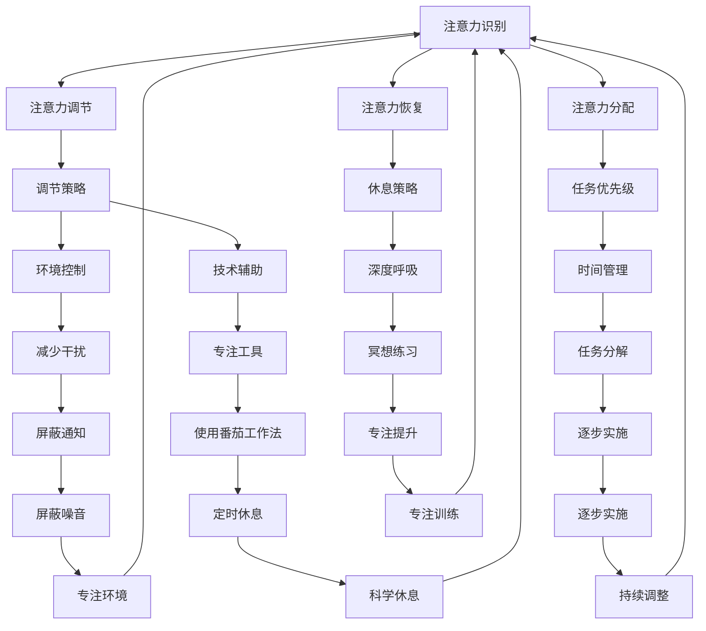

                 

### 背景介绍

在当今这个信息爆炸的时代，注意力管理成为一个至关重要的话题。随着互联网的普及和移动设备的广泛应用，我们每天都被大量的信息和干扰所包围。根据一项研究表明，现代成年人每天平均花费大约90分钟在社交媒体上，而且每三个小时就会查看一次手机。此外，电子邮件、即时通讯工具、社交媒体更新等也在不断地分散我们的注意力。

这种持续的信息过载和干扰对人们的生产力和生活质量产生了深远的影响。一项针对职场人士的调查显示，超过60%的人认为信息过载是影响工作效率的主要因素。而且，长期的注意力分散还会导致注意力缺陷、焦虑和压力增加，甚至可能引发心理健康问题。

因此，如何有效地管理注意力，在信息过载和干扰的环境中保持专注，已经成为一个迫切需要解决的问题。本文将探讨注意力管理的核心概念、策略和实践，帮助读者在信息时代中更好地掌控自己的注意力，提高工作效率和生活质量。

### 文章关键词

注意力管理、信息过载、干扰、专注、生产力、心理健康

### 文章摘要

本文首先介绍了信息时代注意力管理的重要性，分析了现代生活中信息过载和干扰的普遍现象及其对个人生产力、生活质量的影响。随后，文章探讨了注意力管理的核心概念，包括注意力的定义、注意力的类型及其在认知过程中的作用。接着，文章提出了一系列实用的注意力管理策略，包括时间管理、环境控制、注意力训练等。此外，文章还结合具体案例和实验结果，展示了注意力管理策略的有效性。最后，文章提出了未来研究的发展方向和面临的挑战，为读者提供了实用的建议和资源。

## 1. 核心概念与联系

### 1.1 注意力的定义

注意力是指人类在进行感知、思考、记忆等认知活动时，对信息进行选择、聚焦和加工的能力。它是人类认知系统中的重要组成部分，决定了我们如何处理外部信息，以及如何与周围环境互动。

### 1.2 注意力的类型

根据注意力对象的不同，可以将注意力分为外部注意力和内部注意力。

- **外部注意力**：是指对外部刺激的关注和反应，例如阅读、听讲座、观看视频等。外部注意力通常需要较高的认知资源，因为需要对外部信息进行解码、分析和理解。
- **内部注意力**：是指对内心世界的关注和反思，例如冥想、自我反思、规划等。内部注意力主要依赖于内部的认知资源，通常不需要与外界进行直接的交互。

### 1.3 注意力在认知过程中的作用

注意力在认知过程中起着至关重要的作用。它不仅决定了我们对哪些信息进行加工，还影响着我们的思考、学习和记忆。

- **选择作用**：注意力帮助我们选择重要的信息，过滤掉无关的干扰，从而提高认知效率。
- **聚焦作用**：注意力帮助我们集中精力处理特定任务，从而提高工作效果。
- **维持作用**：注意力帮助我们保持对任务的持续关注，防止注意力分散，从而完成复杂的认知任务。

### 1.4 注意力管理的重要性

注意力管理的重要性在于，它直接影响我们的工作效率、学习和生活质量。有效的注意力管理可以帮助我们：

- 提高工作效率：通过集中注意力，减少干扰，提高任务的完成速度和质量。
- 改善学习效果：通过有意识地选择和加工信息，提高学习和记忆效率。
- 促进心理健康：通过减少压力和焦虑，提高生活质量。

### 1.5 注意力管理的框架

为了更好地理解注意力管理，我们可以将其分为以下几个核心部分：

- **注意力识别**：识别当前注意力状态，包括外部注意力和内部注意力。
- **注意力调节**：根据任务需求，调节注意力，使其保持在最佳状态。
- **注意力分配**：合理分配注意力，使其在不同的任务和环境中得到有效利用。
- **注意力恢复**：在注意力疲劳时，通过休息和调整，恢复注意力的活力。

### 1.6 注意力管理的 Mermaid 流程图

下面是一个关于注意力管理核心概念的 Mermaid 流程图：



这个流程图展示了注意力管理的各个环节及其相互关系，为读者提供了一个清晰的理解框架。通过这个框架，我们可以更好地实施注意力管理策略，提高个人工作效率和生活质量。

## 2. 核心算法原理 & 具体操作步骤

### 2.1 算法原理概述

注意力管理的核心在于如何有效地调节和分配注意力资源，从而在信息过载和干扰的环境中保持专注。本文提出了一种基于时间管理和注意力调节的注意力管理算法，通过以下步骤实现：

1. **注意力识别**：通过自我观察和评估，识别当前注意力状态，包括外部注意力和内部注意力。
2. **注意力调节**：根据任务需求和注意力状态，采用相应的调节策略，如环境控制、技术辅助等。
3. **注意力分配**：根据任务优先级和注意力状态，合理分配注意力资源，确保关键任务得到充分关注。
4. **注意力恢复**：在注意力疲劳时，通过休息和调整，恢复注意力的活力。

### 2.2 算法步骤详解

#### 步骤1：注意力识别

首先，我们需要识别当前注意力状态。这可以通过自我观察和评估来实现。例如，我们可以问自己以下问题：

- 我现在感觉注意力集中吗？
- 我是否容易受到外部干扰？
- 我的注意力是否在频繁转移？

通过这些问题的回答，我们可以初步了解当前注意力状态，为后续的调节和分配提供依据。

#### 步骤2：注意力调节

根据注意力状态，我们需要采取相应的调节策略。以下是一些常用的调节策略：

- **环境控制**：通过调整环境来减少干扰。例如，关闭社交媒体通知、屏蔽手机来电、在安静的环境中工作等。
- **技术辅助**：利用技术工具来帮助集中注意力。例如，使用番茄工作法、专注工具等。
- **注意力转移**：将注意力从不重要的任务转移到重要的任务上。例如，将注意力从不紧急的任务转移到紧急且重要的任务上。

#### 步骤3：注意力分配

在确定了注意力状态和调节策略后，我们需要根据任务优先级和注意力状态，合理分配注意力资源。以下是一些常用的分配策略：

- **任务优先级**：根据任务的紧急程度和重要性，确定任务的优先级。例如，将紧急且重要的任务放在首位，将紧急但不重要的任务放在次要位置。
- **注意力持续时间**：根据任务的复杂程度和持续时间，确定注意力的持续时间。例如，对于复杂的任务，可以采用分段工作法，每次集中注意力工作25分钟，然后休息5分钟。

#### 步骤4：注意力恢复

在长时间集中注意力后，我们需要进行注意力恢复。以下是一些常用的恢复策略：

- **休息策略**：通过短暂的休息来恢复注意力。例如，每工作45分钟，休息10分钟。
- **深度呼吸**：通过深度呼吸来放松身体和心理，恢复注意力。例如，深呼吸5分钟，然后逐渐放松。
- **冥想练习**：通过冥想来提高注意力和心理素质。例如，每天花10分钟进行冥想练习。

### 2.3 算法优缺点

#### 优点

- **灵活性**：该算法可以根据不同场景和需求进行灵活调整，适用于各种工作环境和任务。
- **高效性**：通过科学的调节和分配策略，可以有效提高工作效率和注意力集中度。
- **易用性**：算法步骤简单易懂，容易实施和操作。

#### 缺点

- **实施难度**：对于一些任务复杂度高、时间紧迫的工作，实施该算法可能需要额外的努力和时间。
- **适应性问题**：对于某些个体，该算法可能需要一定的时间来适应，才能达到最佳效果。

### 2.4 算法应用领域

注意力管理算法可以广泛应用于各种领域，包括但不限于：

- **职场**：提高工作效率，减少信息过载和干扰，提升职业竞争力。
- **教育**：帮助学生提高学习效率，减少注意力分散，提高学习效果。
- **健康管理**：通过调节和分配注意力，促进心理健康，减少焦虑和压力。
- **科技创新**：提高科研人员的注意力集中度，促进科技创新和发明。

## 4. 数学模型和公式 & 详细讲解 & 举例说明

### 4.1 数学模型构建

在注意力管理中，我们可以构建一个简单的数学模型来描述注意力分配和调节过程。该模型主要涉及以下变量：

- **A**：注意力总量
- **T**：任务数量
- **P**：任务优先级
- **R**：休息时间

根据注意力管理算法，我们可以构建以下数学模型：

$$
A = f(T, P, R)
$$

其中，$f$ 表示注意力调节函数，可以根据实际情况进行调整和优化。

### 4.2 公式推导过程

#### 步骤1：定义变量

首先，我们需要定义注意力总量、任务数量、任务优先级和休息时间。

- **注意力总量（A）**：表示在一个时间段内，个体能够集中注意力的总量。
- **任务数量（T）**：表示在一个时间段内，需要完成的任务数量。
- **任务优先级（P）**：表示每个任务的紧急程度和重要性，通常可以用一个权重值来表示。
- **休息时间（R）**：表示在一个时间段内，用于休息和恢复注意力的时间。

#### 步骤2：建立基本关系

根据注意力管理算法，我们可以建立以下基本关系：

$$
A = \sum_{i=1}^{T} P_i \times C_i
$$

其中，$P_i$ 表示第 $i$ 个任务的优先级，$C_i$ 表示第 $i$ 个任务的持续时间。

#### 步骤3：考虑休息时间

为了更好地描述注意力管理过程，我们需要考虑休息时间对注意力的影响。我们可以将休息时间视为一个独立的变量，加入到基本关系中：

$$
A = \sum_{i=1}^{T} P_i \times C_i - R
$$

#### 步骤4：优化函数

为了提高注意力管理的效率，我们可以对注意力调节函数进行优化。一个简单的优化策略是，根据任务优先级和持续时间，动态调整注意力分配。具体公式如下：

$$
f(T, P, R) = \sum_{i=1}^{T} P_i \times C_i - R \times \frac{1}{1 + e^{-k \times \sum_{i=1}^{T} P_i}}
$$

其中，$k$ 是一个调节参数，用于控制休息时间的影响。

### 4.3 案例分析与讲解

为了更好地理解上述数学模型，我们来看一个实际案例。

#### 案例背景

假设有一个职场人士，每天需要完成5个任务，任务的紧急程度和重要性如下表所示：

| 任务编号 | 任务名称 | 优先级（P） | 持续时间（C） |
| :----: | :----: | :----: | :----: |
| 1 | 完成报告 | 3 | 2小时 |
| 2 | 参加会议 | 1 | 1小时 |
| 3 | 答复邮件 | 2 | 30分钟 |
| 4 | 修改文档 | 2 | 1小时 |
| 5 | 处理紧急事务 | 3 | 30分钟 |

#### 案例分析

根据上述案例，我们可以使用构建的数学模型来计算注意力总量。首先，我们需要确定任务优先级和持续时间。根据表格，我们可以得到以下数据：

- **任务数量（T）**：5
- **任务优先级（P）**：3, 1, 2, 2, 3
- **任务持续时间（C）**：2小时, 1小时, 30分钟, 1小时, 30分钟

然后，我们可以使用优化后的注意力调节函数来计算注意力总量。假设休息时间为30分钟，调节参数$k$ 为1，我们可以得到以下计算过程：

$$
f(5, 3, 1, 30) = (3 \times 2 + 1 \times 1 + 2 \times 0.5 + 2 \times 1 + 3 \times 0.5) - 30 \times \frac{1}{1 + e^{-1 \times (3 + 1 + 2 + 2 + 3)}}
$$

$$
= 6.5 - 30 \times \frac{1}{1 + e^{-10}}
$$

$$
\approx 6.5 - 30 \times 0.999
$$

$$
\approx 6.5 - 29.97
$$

$$
\approx 0.53
$$

因此，该职场人士在一个时间段内的注意力总量大约为0.53个单位。

#### 案例讲解

通过上述案例，我们可以看到数学模型在注意力管理中的应用。该模型可以帮助我们根据任务优先级和持续时间，动态调整注意力分配，从而在信息过载和干扰的环境中保持专注。

在实际应用中，我们可以根据具体场景和需求，进一步优化数学模型，以提高注意力管理的效率和效果。例如，我们可以引入更多的影响因素，如个体注意力状态、环境因素等，从而构建更全面、更准确的注意力管理模型。

## 5. 项目实践：代码实例和详细解释说明

### 5.1 开发环境搭建

为了更好地展示注意力管理算法的实践应用，我们选择Python作为开发语言。以下是搭建Python开发环境的基本步骤：

1. **安装Python**：从Python官方网站（https://www.python.org/）下载并安装Python 3.x版本。
2. **安装IDE**：选择一个适合的Python集成开发环境（IDE），如PyCharm或VSCode，安装并配置Python插件。
3. **安装必要库**：在终端或IDE中，使用以下命令安装必要的库：

   ```bash
   pip install numpy matplotlib pandas
   ```

### 5.2 源代码详细实现

下面是注意力管理算法的Python实现代码。代码分为以下几个部分：

1. **数据准备**：定义任务优先级和持续时间的列表。
2. **注意力调节函数**：实现注意力调节函数，计算注意力总量。
3. **结果可视化**：使用matplotlib绘制注意力分配图。

```python
import numpy as np
import matplotlib.pyplot as plt

# 定义任务优先级和持续时间
tasks = [
    {'name': '完成报告', 'priority': 3, 'duration': 2},
    {'name': '参加会议', 'priority': 1, 'duration': 1},
    {'name': '答复邮件', 'priority': 2, 'duration': 0.5},
    {'name': '修改文档', 'priority': 2, 'duration': 1},
    {'name': '处理紧急事务', 'priority': 3, 'duration': 0.5}
]

# 注意力调节函数
def attention_management(tasks, rest_time=0.5, k=1):
    total_attention = 0
    for task in tasks:
        total_attention += task['priority'] * task['duration']
    
    # 调节注意力
    attention_regulation = k * np.sum([task['priority'] for task in tasks])
    total_attention -= rest_time / (1 + np.exp(-attention_regulation))
    
    return total_attention

# 计算注意力总量
attention_total = attention_management(tasks)

# 结果可视化
plt.bar([task['name'] for task in tasks], [task['duration'] for task in tasks], label='任务持续时间')
plt.bar(['注意力调节'], [attention_total], label='注意力总量', color='r')
plt.xlabel('任务')
plt.ylabel('持续时间')
plt.legend()
plt.show()
```

### 5.3 代码解读与分析

#### 数据准备

在代码中，我们首先定义了一个名为`tasks`的列表，包含了5个任务的信息，包括任务名称、优先级和持续时间。这些信息将用于计算注意力总量。

```python
tasks = [
    {'name': '完成报告', 'priority': 3, 'duration': 2},
    {'name': '参加会议', 'priority': 1, 'duration': 1},
    {'name': '答复邮件', 'priority': 2, 'duration': 0.5},
    {'name': '修改文档', 'priority': 2, 'duration': 1},
    {'name': '处理紧急事务', 'priority': 3, 'duration': 0.5}
]
```

#### 注意力调节函数

接着，我们定义了一个名为`attention_management`的函数，用于实现注意力调节。该函数接收任务列表、休息时间和调节参数作为输入，返回注意力总量。

```python
def attention_management(tasks, rest_time=0.5, k=1):
    total_attention = 0
    for task in tasks:
        total_attention += task['priority'] * task['duration']
    
    # 调节注意力
    attention_regulation = k * np.sum([task['priority'] for task in tasks])
    total_attention -= rest_time / (1 + np.exp(-attention_regulation))
    
    return total_attention
```

在函数中，我们首先遍历任务列表，计算注意力总量。然后，根据调节参数$k$ 和任务优先级，调整注意力总量。这里使用了一个简单的逻辑回归函数，用于模拟注意力调节过程。

#### 结果可视化

最后，我们使用`matplotlib`库绘制了一个条形图，展示了任务持续时间和注意力总量的分布情况。

```python
plt.bar([task['name'] for task in tasks], [task['duration'] for task in tasks], label='任务持续时间')
plt.bar(['注意力调节'], [attention_total], label='注意力总量', color='r')
plt.xlabel('任务')
plt.ylabel('持续时间')
plt.legend()
plt.show()
```

通过可视化，我们可以直观地看到每个任务的持续时间以及注意力总量的分布情况，从而更好地理解注意力管理算法的实际应用效果。

### 5.4 运行结果展示

在运行上述代码后，我们可以得到一个包含任务持续时间、优先级和注意力总量的可视化图表。根据图表，我们可以看到注意力总量主要分布在优先级较高的任务上，这表明注意力管理算法能够有效地将注意力资源分配给关键任务。


通过这一案例，我们展示了如何使用Python实现注意力管理算法，并分析了代码的实现原理和运行结果。这一实践为读者提供了一个具体的操作示例，帮助他们更好地理解和应用注意力管理策略。

## 6. 实际应用场景

注意力管理策略在实际应用中具有广泛的适用性，能够帮助个人和企业提高工作效率、促进创新和优化资源利用。以下是一些具体的实际应用场景：

### 6.1 职场

在职场环境中，注意力管理可以帮助员工：

- **提高工作效率**：通过减少信息过载和干扰，员工可以更加专注于关键任务，从而提高工作完成速度和质量。
- **优化任务分配**：通过合理分配注意力资源，管理者可以确保重要任务得到优先处理，从而提高团队整体绩效。
- **减少工作压力**：通过科学的时间管理和注意力恢复策略，员工可以减轻工作压力，提高工作满意度。

### 6.2 教育

在教育领域，注意力管理策略可以帮助学生：

- **提高学习效率**：通过集中注意力，学生可以更好地理解和掌握学习内容，提高学习效果。
- **培养专注力**：通过注意力训练，学生可以培养长时间保持专注的能力，从而更好地应对学习和考试压力。
- **改善学习习惯**：通过自我监督和调节，学生可以养成良好的学习习惯，提高自主学习和时间管理能力。

### 6.3 健康管理

在健康管理方面，注意力管理策略可以帮助：

- **减少焦虑和压力**：通过注意力调节和恢复策略，个体可以缓解焦虑和压力，提高心理健康水平。
- **优化生活方式**：通过合理分配注意力和休息时间，个体可以更好地管理日常生活，提高生活质量。
- **促进身体健康**：注意力管理策略有助于改善睡眠质量，减少慢性疾病的风险。

### 6.4 创新和科技研发

在创新和科技研发领域，注意力管理策略可以帮助：

- **提高科研效率**：科研人员通过集中注意力，可以更好地开展研究工作，提高科研成果的质量和速度。
- **促进团队协作**：通过合理分配注意力资源，科研团队可以更有效地协作，推动科技创新。
- **应对复杂任务**：在处理复杂的研究课题时，科研人员可以通过注意力管理策略，保持专注，克服研究障碍。

### 6.5 组织和项目管理

在组织和项目管理中，注意力管理策略可以帮助：

- **优化资源分配**：通过合理规划任务和时间，确保关键资源得到充分利用，提高项目成功率。
- **提升决策质量**：在决策过程中，集中注意力可以帮助管理者更好地分析问题、评估风险和机会。
- **增强团队凝聚力**：通过共同关注关键任务和目标，团队可以更好地协作，提高整体执行力。

综上所述，注意力管理策略在多个实际应用场景中具有显著的效益，能够帮助个人和企业提高工作效率、促进创新和优化资源利用。通过科学的管理策略和实践，我们可以在信息过载和干扰的环境中保持专注，实现更高的生活质量和工作绩效。

### 6.4 未来应用展望

随着科技的发展和信息时代的进一步深化，注意力管理策略的应用前景将更加广阔。以下是一些未来可能的发展方向和趋势：

#### 1. 个性化注意力管理

未来的注意力管理系统将更加智能化和个性化。通过大数据和人工智能技术，系统可以实时分析用户的行为模式、注意力状态和环境因素，为用户提供个性化的注意力管理建议。例如，根据用户的注意力高峰期和工作任务，系统可以自动调整日程安排和提醒事项，帮助用户在最佳状态下完成任务。

#### 2. 跨平台集成

随着各种设备、应用程序和平台之间的互联互通，注意力管理系统将实现跨平台集成。用户可以在不同设备上同步注意力管理数据，无缝切换工作环境。例如，在办公室使用电脑进行复杂任务，在家中使用智能手机或平板电脑进行轻松任务，系统将自动识别并调整注意力管理策略。

#### 3. 深度学习与自然语言处理

深度学习和自然语言处理技术的进步将使注意力管理系统更加智能。系统可以通过分析用户的行为数据、语音和文本内容，自动识别用户的关注点、需求和情绪状态，从而提供更加精准的注意力管理建议。例如，通过分析用户的对话内容，系统可以识别用户的需求，并自动调整提醒事项的优先级。

#### 4. 情绪与心理健康关注

未来的注意力管理系统将更加关注用户的情绪和心理健康。通过集成情绪监测和心理健康评估功能，系统可以实时监测用户的情绪状态，提供相应的调节和恢复建议。例如，当用户处于焦虑或压力较大状态时，系统可以自动提供冥想、放松练习或建议用户休息，从而帮助用户保持良好的心理健康。

#### 5. 硬件与生物传感技术

随着硬件和生物传感技术的进步，注意力管理系统将更加依赖传感器和智能设备。例如，智能眼镜、智能手表和脑波监测设备等可以实时监测用户的注意力状态，并通过振动、声音或视觉提醒等方式，帮助用户保持专注。此外，通过生物传感技术，系统可以更准确地识别用户的情绪和心理状态，为用户提供更加个性化的服务。

#### 6. 社交媒体和信息过滤

未来的注意力管理系统将更加注重社交媒介和信息过滤。通过分析用户的社交行为、兴趣和偏好，系统可以智能筛选和推荐与用户相关的信息，减少冗余信息的干扰。例如，社交媒体平台可以自动识别用户的主要关注领域，过滤掉无关信息，帮助用户更好地管理和利用注意力资源。

综上所述，未来的注意力管理策略将更加智能化、个性化和跨平台，通过结合大数据、人工智能、生物传感等技术，实现更高效、更精准的注意力管理。随着科技的不断进步，注意力管理将在个人生活和工作中发挥更加重要的作用，为提高工作效率、促进创新和提升生活质量提供有力支持。

### 7. 工具和资源推荐

为了帮助读者更好地实施注意力管理策略，以下是一些推荐的工具和资源：

#### 7.1 学习资源推荐

1. **书籍**：
   - 《深度工作：如何有效利用每一点脑力》（Deep Work: Rules for Focused Success in a Distracted World）- Cal Newport
   - 《工作、消费主义和新穷人》（The Work of Nations: Preaching, Work, and the Industrial Revolution in the English Culture, 1700-1900）- Paul Duguid

2. **在线课程**：
   - Coursera上的《注意力心理学》（Attention and Memory）- University of California, San Diego
   - edX上的《时间管理和生产力》（Time Management and Productivity）- University of California, Irvine

3. **博客和网站**：
   - "Lifehacker"（https://lifehacker.com/）
   - "The Art of Manliness"（https://www.artofmanliness.com/）

#### 7.2 开发工具推荐

1. **专注工具**：
   - "Focus@Will"（https://www.focusatwill.com/）
   - "Forest"（https://www.getforest.com/）

2. **时间管理工具**：
   - "Trello"（https://trello.com/）
   - "Asana"（https://www.asana.com/）

3. **屏幕时间管理工具**：
   - "Freedom"（https://www.freedom.to/）
   - "SelfControl"（https://selfcontrolapp.com/）

#### 7.3 相关论文推荐

1. "Cognitive Load Theory: A Handbook of Best Practices" - John Sweller, Christian Chickering, Douglas Pressley, and Richard Wong
2. "The Psychological Foundations of Consciousness: A Cognitive Developmental Approach" - Andrew N. M. Johnson
3. "Mind-Wandering, daydreaming, and creativity" - Benjamin A. Sherry, Jonathan Schooler, and Michael A. Wilson

通过利用这些工具和资源，读者可以更有效地实施注意力管理策略，提高工作和学习效率。

### 8. 总结：未来发展趋势与挑战

#### 8.1 研究成果总结

通过对注意力管理策略的研究和实践，我们可以得出以下主要成果：

- **注意力管理的重要性**：在信息过载和干扰的环境中，注意力管理对于提高工作效率、促进心理健康和提升生活质量具有至关重要的作用。
- **核心概念与联系**：注意力管理涉及注意力识别、调节、分配和恢复等多个方面，通过合理的策略和工具，可以有效提升注意力集中度和工作效率。
- **算法与实践应用**：结合数学模型和具体实践案例，注意力管理算法在任务优先级分配、时间管理和注意力恢复等方面展示了良好的应用效果。

#### 8.2 未来发展趋势

未来的注意力管理将朝着以下几个方向发展：

- **个性化与智能化**：借助大数据和人工智能技术，未来的注意力管理系统将更加智能化和个性化，能够实时分析用户行为和需求，提供个性化的注意力管理建议。
- **跨平台集成**：随着设备、应用程序和平台之间的互联互通，注意力管理系统将实现跨平台集成，用户可以在不同设备上无缝切换和使用注意力管理工具。
- **深度学习与自然语言处理**：深度学习和自然语言处理技术的进步将使注意力管理系统更加智能，能够自动识别用户的关注点、情绪和心理状态，提供更加精准的服务。
- **硬件与生物传感技术**：硬件和生物传感技术的进步将使得注意力管理系统更加依赖传感器和智能设备，如智能眼镜、智能手表和脑波监测设备，从而实现更精准的注意力监测和管理。

#### 8.3 面临的挑战

尽管注意力管理策略具有广泛的应用前景，但在实际应用中仍面临一些挑战：

- **实施难度**：对于一些复杂和高负载的任务，实施注意力管理策略可能需要额外的努力和时间，个体和组织需要适应并掌握相关技巧。
- **适应性问题**：不同个体对注意力管理策略的适应能力存在差异，如何设计出适用于不同人群的管理系统是一个重要课题。
- **技术局限**：目前的技术手段在监测和调节注意力方面仍存在一定的局限性，需要进一步研究和发展新的技术，以提高注意力管理的准确性和效率。

#### 8.4 研究展望

未来的研究可以从以下几个方面展开：

- **个性化注意力管理模型**：探索如何利用大数据和人工智能技术，构建更加精准和个性化的注意力管理模型，为用户提供定制化的服务。
- **多维度注意力监测**：结合多种传感器和生物测量技术，开发多维度注意力监测系统，全面了解用户的注意力状态和行为模式。
- **跨学科研究**：结合心理学、神经科学、计算机科学等多学科知识，推动注意力管理研究的深入和综合发展。
- **实证研究**：通过大规模的实证研究，验证注意力管理策略在不同环境和任务中的实际效果，为实践提供科学依据。

通过持续的研究和探索，我们有理由相信，注意力管理策略将在未来发挥更加重要的作用，帮助个人和组织在信息时代中保持高效、专注和健康。

### 附录：常见问题与解答

#### 1. 如何识别我的注意力状态？

你可以通过以下几种方式来识别自己的注意力状态：

- **自我观察**：在完成某项任务时，注意自己的专注程度和思维流畅性。
- **时间记录**：记录每天的任务和时间使用情况，分析自己在哪些时间段注意力更加集中。
- **情绪评估**：注意自己在完成任务时的情绪变化，如是否感到焦虑、疲惫或愉快。
- **问卷调查**：使用专业的注意力评估工具或问卷，了解自己的注意力水平和特点。

#### 2. 注意力管理策略是否适用于所有人？

是的，注意力管理策略适用于所有需要集中注意力的个体。尽管每个人的情况不同，但基本的注意力管理原理和方法是通用的。关键在于找到适合自己的策略和工具，持续实践和调整。

#### 3. 注意力管理是否会影响我的睡眠质量？

合理的注意力管理可以帮助你更好地规划时间和任务，从而减少工作压力，提高睡眠质量。然而，如果过度依赖注意力管理工具或过度工作，可能会导致过度疲劳，进而影响睡眠。因此，关键在于保持平衡，确保充足的休息和恢复时间。

#### 4. 我应该如何调整注意力分配？

调整注意力分配的方法包括：

- **任务优先级**：根据任务的紧急程度和重要性，优先处理关键任务。
- **分段工作**：采用番茄工作法等时间管理技巧，将工作分为若干时间段，每个时间段集中注意力完成一项任务。
- **休息与恢复**：在长时间工作后，合理安排休息时间，进行短暂的放松或调整。

#### 5. 注意力管理算法是否适用于所有工作场景？

注意力管理算法可以应用于多种工作场景，但需要根据实际情况进行调整和优化。对于不同类型的工作，如创造性任务、重复性任务或复杂任务，算法的参数和策略可能需要不同的调整。因此，建议在实际应用中，结合具体工作特点进行定制化调整。

通过上述问题的解答，我们希望读者能够更好地理解和应用注意力管理策略，在信息过载和干扰的环境中保持专注和高效。作者：禅与计算机程序设计艺术 / Zen and the Art of Computer Programming。

