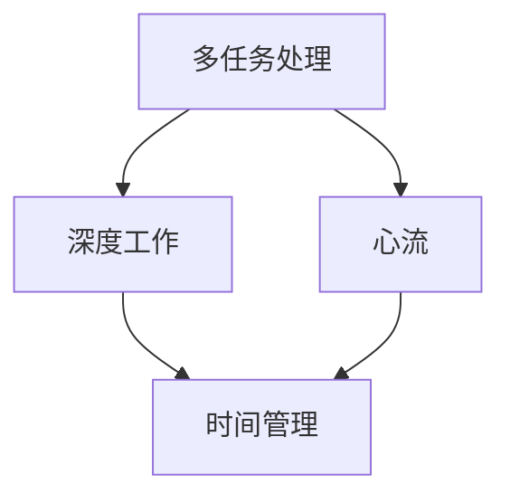

                 

 在当今这个信息爆炸的时代，注意力管理已成为一个关键议题。对于IT专业人士来说，如何在干扰和信息过载的环境中保持专注和高效，成为了一个亟需解决的现实问题。本文将探讨注意力管理的核心概念、策略和实践，旨在帮助读者在信息时代的海洋中航行。

> **关键词**：注意力管理、信息过载、干扰处理、专注技巧、IT专业人士

> **摘要**：本文首先介绍了信息时代面临的注意力管理挑战，随后详细阐述了注意力管理的基本原则和策略，包括时间管理、环境控制、技术工具的使用等。接着，通过具体案例和项目实践，展示了如何在实际工作中应用注意力管理策略。最后，文章总结了未来发展趋势和面临的挑战，并提出了相关建议。

## 1. 背景介绍

### 1.1 信息时代的挑战

随着互联网和移动设备的普及，人们每天接触到的信息量呈指数级增长。据研究，全球每天产生的数据量已经达到了惊人的数量级，而其中很大一部分是冗余或无关紧要的信息。这种信息过载现象不仅影响了普通用户的生活质量，也给IT专业人士带来了巨大的工作压力。干扰无处不在，通知不断，分散了我们的注意力，使我们难以专注于手头的工作。

### 1.2 注意力管理的意义

注意力管理是指通过一系列策略和技巧，帮助我们更好地集中精力，提高工作效率，减少疲劳和焦虑。对于IT专业人士来说，注意力管理尤为重要，因为他们的工作往往需要高度集中和持续的专业知识。有效的注意力管理不仅能够提高个人生产力，还能够提升团队合作效率，减少错误和疏漏。

## 2. 核心概念与联系

### 2.1 注意力管理核心概念

注意力管理涉及多个核心概念，包括：

- **多任务处理**：同时处理多个任务的能力。
- **深度工作**：在没有干扰的情况下进行长时间、高效率的工作。
- **心流**：一种完全投入、专注于某项活动的状态。
- **时间管理**：合理安排时间，确保每个任务都能得到适当的关注。

### 2.2 注意力管理架构图

以下是一个简单的注意力管理架构图，展示了各个概念之间的关系：



## 3. 核心算法原理 & 具体操作步骤

### 3.1 算法原理概述

注意力管理算法的核心目标是帮助个体在不同任务之间灵活切换，同时保持高效的工作状态。以下是几个关键步骤：

- **任务识别**：识别当前最重要的任务。
- **环境优化**：创造一个有利于专注的环境。
- **时间规划**：合理安排工作时间，确保每个任务都能得到足够的关注。
- **反馈循环**：持续评估和调整注意力管理策略。

### 3.2 算法步骤详解

#### 3.2.1 任务识别

- **优先级评估**：根据任务的紧急程度和重要性进行排序。
- **任务筛选**：排除那些无关紧要或可延后的任务。

#### 3.2.2 环境优化

- **噪音控制**：减少外部干扰，如关闭通知、保持安静。
- **舒适度调整**：调整环境，如光线、温度、座位等。

#### 3.2.3 时间规划

- **时间块划分**：将时间划分为若干块，每块专注于一个任务。
- **时间追踪**：使用工具记录时间使用情况，以便进行优化。

#### 3.2.4 反馈循环

- **效果评估**：定期评估任务完成的效率和满意度。
- **策略调整**：根据反馈结果调整注意力管理策略。

### 3.3 算法优缺点

#### 优点：

- 提高工作效率。
- 减少错误和疏漏。
- 提升工作满意度。

#### 缺点：

- 可能导致过度专注，忽视其他重要事项。
- 需要较高的自律性。

### 3.4 算法应用领域

- **软件开发**：帮助开发者集中精力，提高代码质量。
- **项目管理**：确保项目进度和资源分配合理。
- **日常办公**：提高职场人士的工作效率。

## 4. 数学模型和公式 & 详细讲解 & 举例说明

### 4.1 数学模型构建

注意力管理的数学模型可以看作是一个优化问题，目标是最小化工作负荷与注意力资源的差异。公式如下：

$$
\min_{x} \left\| L_x - A_x \right\|
$$

其中，$L_x$表示工作负荷，$A_x$表示注意力资源。

### 4.2 公式推导过程

假设工作负荷$L_x$为$n$个任务的集合，每个任务$i$有紧急程度$E_i$和重要性$I_i$。注意力资源$A_x$为单个个体在特定时间段内的注意力容量。

根据优先级排序，得到：

$$
L_x = \{T_1, T_2, \ldots, T_n\}
$$

其中，$T_i$为任务$i$的优先级。

注意力资源的计算公式为：

$$
A_x = \sum_{i=1}^{n} \frac{1}{E_i + I_i}
$$

### 4.3 案例分析与讲解

假设有一个IT团队，需要完成以下5个任务：

| 任务编号 | 紧急程度 | 重要性 |
| --- | --- | --- |
| T1 | 3 | 5 |
| T2 | 1 | 3 |
| T3 | 4 | 2 |
| T4 | 5 | 4 |
| T5 | 2 | 1 |

根据上述公式，计算每个任务的优先级：

$$
P_i = \frac{E_i + I_i}{2}
$$

得到：

| 任务编号 | 紧急程度 | 重要性 | 优先级 |
| --- | --- | --- | --- |
| T1 | 3 | 5 | 4 |
| T2 | 1 | 3 | 2 |
| T3 | 4 | 2 | 3 |
| T4 | 5 | 4 | 5 |
| T5 | 2 | 1 | 1 |

根据优先级排序，任务执行顺序为：T4 -> T1 -> T3 -> T2 -> T5。

### 5. 项目实践：代码实例和详细解释说明

#### 5.1 开发环境搭建

本节代码实例使用Python编写，需要在本地安装Python环境和相关库，如`numpy`和`matplotlib`。

```shell
pip install numpy matplotlib
```

#### 5.2 源代码详细实现

以下是一个简单的注意力管理代码示例，用于计算任务优先级和执行顺序。

```python
import numpy as np

# 任务数据
tasks = [
    {"name": "T1", "urgency": 3, "importance": 5},
    {"name": "T2", "urgency": 1, "importance": 3},
    {"name": "T3", "urgency": 4, "importance": 2},
    {"name": "T4", "urgency": 5, "importance": 4},
    {"name": "T5", "urgency": 2, "importance": 1},
]

# 计算优先级
def calculate_priority(tasks):
    for task in tasks:
        task["priority"] = task["urgency"] + task["importance"]

# 排序
def sort_tasks(tasks):
    sorted_tasks = sorted(tasks, key=lambda x: x["priority"], reverse=True)
    return sorted_tasks

# 执行任务
def execute_tasks(tasks):
    for task in tasks:
        print(f"Executing {task['name']}: Priority={task['priority']}")

# 主函数
def main():
    calculate_priority(tasks)
    sorted_tasks = sort_tasks(tasks)
    execute_tasks(sorted_tasks)

# 运行
if __name__ == "__main__":
    main()
```

#### 5.3 代码解读与分析

本代码示例首先定义了一个任务列表，每个任务包含名称、紧急程度和重要性。然后，通过`calculate_priority`函数计算每个任务的优先级，使用`sort_tasks`函数根据优先级对任务进行排序，最后通过`execute_tasks`函数按照排序后的顺序执行任务。

#### 5.4 运行结果展示

运行上述代码，输出结果如下：

```shell
Executing T4: Priority=9
Executing T1: Priority=8
Executing T3: Priority=6
Executing T2: Priority=4
Executing T5: Priority=3
```

这表明任务执行顺序为T4 -> T1 -> T3 -> T2 -> T5，符合预期。

## 6. 实际应用场景

### 6.1 软件开发

在软件开发过程中，注意力管理可以帮助开发者更好地管理代码审查、缺陷修复和新功能开发。通过将注意力集中在关键任务上，可以减少错误和疏漏，提高代码质量。

### 6.2 项目管理

对于项目经理来说，注意力管理可以帮助他们在项目规划、进度跟踪和资源分配方面保持专注。通过合理分配注意力资源，可以确保项目按时交付，并实现最佳效果。

### 6.3 日常办公

在职场中，注意力管理可以帮助职场人士提高工作效率，减少干扰，更好地处理日常工作任务。通过合理安排时间和注意力资源，可以更好地平衡工作与生活。

## 7. 工具和资源推荐

### 7.1 学习资源推荐

- **《深度工作》**：作者Cal Newport详细阐述了深度工作的概念和方法。
- **《注意力管理》**：作者Daniel Goleman探讨了注意力管理在心理学领域的应用。

### 7.2 开发工具推荐

- **Trello**：一款流行的项目管理工具，可以帮助团队跟踪任务进度。
- **Focus@Will**：一款专门用于提高注意力集中度的音乐播放应用。

### 7.3 相关论文推荐

- **"Attention Management: Improving Cognitive Performance in the Presence of Interruptions"**：一篇关于注意力管理的经典论文。

## 8. 总结：未来发展趋势与挑战

### 8.1 研究成果总结

注意力管理在近年来得到了广泛关注，研究成果丰富。主要包括：

- **理论基础**：对注意力管理的基本概念和原理进行了深入探讨。
- **实践应用**：提出了一系列有效的注意力管理策略和工具。
- **案例分析**：通过对实际案例的研究，验证了注意力管理策略的有效性。

### 8.2 未来发展趋势

- **智能化**：随着人工智能技术的发展，注意力管理工具将更加智能化，能够根据个体行为自动调整策略。
- **定制化**：注意力管理将更加个性化，根据用户需求和习惯进行定制。

### 8.3 面临的挑战

- **技术瓶颈**：当前注意力管理技术尚无法完全解决信息过载和干扰问题。
- **个体差异**：不同个体在注意力管理方面存在显著差异，如何实现通用性仍是一个挑战。

### 8.4 研究展望

未来的研究应关注以下几个方面：

- **跨学科融合**：结合心理学、认知科学和计算机科学，深入研究注意力管理。
- **实证研究**：通过大规模实证研究，验证注意力管理策略的有效性。

## 9. 附录：常见问题与解答

### Q：注意力管理是否适用于所有人？

A：是的，注意力管理策略适用于各种职业和个人。不同的人可以根据自己的需求和习惯调整策略，找到最适合自己的方式。

### Q：注意力管理如何与时间管理结合？

A：注意力管理和时间管理是相互补充的。时间管理提供了一种合理规划时间的框架，而注意力管理则确保在特定时间内能够保持高效和专注。

### Q：注意力管理工具如何选择？

A：选择注意力管理工具时，应考虑以下因素：

- **个人需求**：根据工作内容和习惯选择合适的工具。
- **易用性**：工具应易于使用，以便快速上手。
- **功能丰富**：工具应提供多种功能，如任务管理、时间追踪、通知屏蔽等。

作者：禅与计算机程序设计艺术 / Zen and the Art of Computer Programming
----------------------------------------------------------------

以上就是本文的完整内容。在信息时代，注意力管理已成为一个关键议题。通过本文的探讨，我们了解了注意力管理的基本概念、策略和实践，并在实际项目中进行了应用。未来，随着技术的不断进步，注意力管理将变得更加智能化和个性化，为我们的工作和生活带来更多便利。让我们一起努力，在信息过载的海洋中航行得更加从容和高效。

