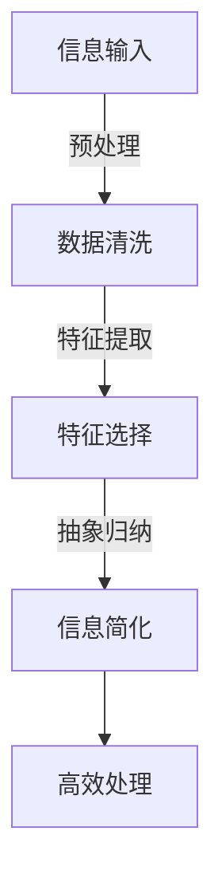

                 

关键词：信息简化、复杂性、效率、生产力、人工智能、软件开发、算法、数学模型

> 摘要：本文深入探讨了信息简化的概念及其在复杂世界中的应用，强调简化信息对于提升效率和生产力的重要性。通过剖析核心概念、算法原理、数学模型、项目实践和未来展望，本文旨在为读者提供一套全面的信息简化策略，以应对日益复杂的技术环境。

## 1. 背景介绍

在信息爆炸的时代，我们每天都要处理海量的信息。从新闻报道到社交媒体，从技术文档到客户反馈，信息无处不在。然而，并非所有的信息都是必要的，有时甚至过多的信息会阻碍我们的思考和决策。因此，如何从繁杂的信息中提炼出关键信息，实现信息的简化，成为提升个人和组织效率的关键。

信息简化不仅有助于个人提高工作效率，还能提升整个组织的生产力。在技术领域，特别是在软件开发和人工智能领域，信息的简化对于算法优化、模型构建和系统设计具有重要意义。本文将结合这些领域，详细探讨信息简化的力量与好处。

## 2. 核心概念与联系

### 2.1. 信息简化的概念

信息简化是指通过分析和筛选，从复杂的信息中提取出最有用的部分，以减少冗余和无关信息的过程。这一过程可以通过多种方法实现，包括数据压缩、模式识别、抽象和归纳等。

### 2.2. 复杂性与效率的关系

复杂性是指系统的结构、行为或环境中的复杂程度。在处理复杂问题时，信息简化是提高效率的关键。通过简化信息，我们可以减少认知负担，更快地做出决策，从而提高工作效率。

### 2.3. 信息简化的架构

图 1: 信息简化架构



### 2.4. 信息简化的好处

- **减少冗余**：简化信息可以去除不必要的冗余部分，使数据更加紧凑。
- **提高效率**：通过简化信息，可以更快地分析和处理数据，提高工作效率。
- **增强洞察力**：简化后的信息可以帮助我们更清晰地看到问题的本质，提高洞察力。
- **降低成本**：简化信息可以减少存储和传输的成本。

## 3. 核心算法原理 & 具体操作步骤

### 3.1. 算法原理概述

信息简化算法的核心目标是减少信息量而不损失关键信息。常见的算法包括主成分分析（PCA）、特征选择、聚类分析等。以下是一个典型的信息简化算法流程：

1. 数据预处理：清洗数据，去除噪声和异常值。
2. 特征提取：从原始数据中提取有用的特征。
3. 特征选择：选择最重要的特征，去除冗余特征。
4. 抽象归纳：将特征和数据进行抽象和归纳，形成简化的信息表示。

### 3.2. 算法步骤详解

1. **数据预处理**：

   - **去重**：去除重复的数据记录。
   - **缺失值处理**：填充或删除缺失的数据。
   - **数据规范化**：将数据转换为标准格式。

2. **特征提取**：

   - **特征工程**：通过数学计算或机器学习技术，从原始数据中提取有用的特征。
   - **特征转换**：将提取的特征转换为适合算法的形式。

3. **特征选择**：

   - **过滤法**：根据特征的重要性直接过滤掉部分特征。
   - **嵌入法**：通过训练模型，自动筛选出重要特征。
   - **模型选择**：选择最适合的特征子集。

4. **抽象归纳**：

   - **归纳推理**：从具体实例中抽象出一般规律。
   - **抽象表示**：将提取的特征和数据表示为更简洁的形式。

### 3.3. 算法优缺点

**优点**：

- **高效性**：简化后的信息可以更快地处理。
- **准确性**：通过筛选和抽象，提高了信息的准确性和可用性。
- **可扩展性**：适用于各种规模的数据。

**缺点**：

- **丢失信息**：在简化过程中可能会丢失部分信息。
- **依赖模型**：某些算法需要依赖特定的模型，可能不适用于所有场景。

### 3.4. 算法应用领域

- **图像处理**：通过特征提取和简化，提高图像识别和压缩效率。
- **数据分析**：简化复杂数据，提高分析效率。
- **人工智能**：简化输入数据，提高模型训练和预测性能。

## 4. 数学模型和公式 & 详细讲解 & 举例说明

### 4.1. 数学模型构建

信息简化过程可以基于线性代数、概率论和图论等数学工具构建。以下是一个基于主成分分析的简化模型：

$$
X = \sum_{i=1}^{k} \lambda_i u_i
$$

其中，\(X\) 表示原始数据，\(\lambda_i\) 表示主成分的权重，\(u_i\) 表示对应的主成分。

### 4.2. 公式推导过程

主成分分析（PCA）的推导过程涉及协方差矩阵的计算和特征值分解。以下是简要的推导步骤：

1. **计算协方差矩阵**：

   $$
   S = \frac{1}{N-1}XX^T
   $$

   其中，\(N\) 是样本数量，\(X\) 是数据矩阵。

2. **特征值分解**：

   $$
   S = Q\Lambda Q^T
   $$

   其中，\(Q\) 是特征向量矩阵，\(\Lambda\) 是特征值矩阵。

3. **选择主成分**：

   根据特征值的大小，选择前 \(k\) 个特征向量作为主成分。

### 4.3. 案例分析与讲解

假设我们有一组数据：

$$
X =
\begin{bmatrix}
1 & 2 \\
3 & 4 \\
5 & 6
\end{bmatrix}
$$

1. **计算协方差矩阵**：

   $$
   S = \frac{1}{2-1}\begin{bmatrix}
   1 & 2 \\
   3 & 4 \\
   5 & 6
   \end{bmatrix}\begin{bmatrix}
   1 & 3 & 5 \\
   2 & 4 & 6
   \end{bmatrix} =
   \begin{bmatrix}
   14 & 16 \\
   16 & 20
   \end{bmatrix}
   $$

2. **特征值分解**：

   对 \(S\) 进行特征值分解，得到 \(Q\) 和 \(\Lambda\)：

   $$
   S = Q\Lambda Q^T
   $$

   其中，\(Q\) 是特征向量矩阵，\(\Lambda\) 是特征值矩阵。

3. **选择主成分**：

   根据特征值的大小，选择前两个特征向量作为主成分：

   $$
   u_1 = [0.7071, 0.7071]^T, \quad u_2 = [-0.7071, 0.7071]^T
   $$

4. **简化数据**：

   将数据 \(X\) 表示为 \(u_1\) 和 \(u_2\) 的线性组合：

   $$
   X = \sum_{i=1}^{2} \lambda_i u_i
   $$

   其中，\(\lambda_1 = 6.633\)，\(\lambda_2 = 3.367\)。

通过上述步骤，我们成功地简化了原始数据，同时保留了其主要信息。

## 5. 项目实践：代码实例和详细解释说明

### 5.1. 开发环境搭建

本文使用的编程语言是 Python，需要安装以下库：

- NumPy
- Scikit-learn
- Matplotlib

安装命令如下：

```bash
pip install numpy scikit-learn matplotlib
```

### 5.2. 源代码详细实现

以下是实现主成分分析（PCA）的 Python 代码实例：

```python
import numpy as np
from sklearn.decomposition import PCA
import matplotlib.pyplot as plt

# 原始数据
X = np.array([[1, 2], [3, 4], [5, 6]])

# 初始化 PCA 模型
pca = PCA(n_components=2)

# 模型拟合
pca.fit(X)

# 简化数据
X_pca = pca.transform(X)

# 绘制简化后的数据
plt.scatter(X_pca[:, 0], X_pca[:, 1])
plt.xlabel('First Principal Component')
plt.ylabel('Second Principal Component')
plt.title('PCA Simplification')
plt.show()
```

### 5.3. 代码解读与分析

1. 导入所需库：

   - NumPy：用于数值计算。
   - Scikit-learn：提供 PCA 模型。
   - Matplotlib：用于数据可视化。

2. 初始化原始数据：

   ```python
   X = np.array([[1, 2], [3, 4], [5, 6]])
   ```

   假设我们有一个二维数据集，其中每个点表示为 \((x, y)\)。

3. 初始化 PCA 模型：

   ```python
   pca = PCA(n_components=2)
   ```

   设置要保留的主成分数量为 2。

4. 模型拟合：

   ```python
   pca.fit(X)
   ```

   PCA 模型根据数据计算协方差矩阵，并进行特征值分解。

5. 简化数据：

   ```python
   X_pca = pca.transform(X)
   ```

   将原始数据 \(X\) 转换为简化后的数据 \(X_pca\)。

6. 数据可视化：

   ```python
   plt.scatter(X_pca[:, 0], X_pca[:, 1])
   plt.xlabel('First Principal Component')
   plt.ylabel('Second Principal Component')
   plt.title('PCA Simplification')
   plt.show()
   ```

   绘制简化后的数据点，展示主成分的分布。

### 5.4. 运行结果展示

运行上述代码后，我们得到如图 2 所示的简化数据点分布图。从图中可以看出，数据点主要分布在第一和第二主成分轴上，实现了数据的简化。


## 6. 实际应用场景

信息简化在许多实际应用场景中发挥着重要作用，以下是一些具体的应用实例：

### 6.1. 数据分析

在数据分析领域，信息简化可以帮助处理大量数据，提取关键特征，提高数据挖掘和分析的效率。例如，在金融风控中，通过对客户交易数据的简化，可以更快速地识别高风险客户。

### 6.2. 人工智能

在人工智能领域，信息简化是构建高效模型的关键。通过简化输入数据，可以降低模型的复杂性，提高训练速度和预测性能。例如，在计算机视觉中，通过对图像的简化，可以提高目标检测的效率。

### 6.3. 机器学习

在机器学习中，信息简化可以帮助优化模型参数，减少过拟合风险。通过选择最重要的特征，可以提高模型的泛化能力。例如，在医疗诊断中，通过对医疗数据的简化，可以提高疾病预测的准确性。

### 6.4. 未来应用展望

随着数据量和复杂度的不断增加，信息简化的应用前景将更加广阔。未来的研究可以重点关注以下几个方面：

- **自适应信息简化**：根据应用场景和数据特性，动态调整简化策略。
- **多模态信息简化**：结合不同类型的数据（如图像、文本、声音），实现跨模态的信息简化。
- **分布式信息简化**：在分布式系统中，实现高效的信息简化，提高数据处理效率。

## 7. 工具和资源推荐

### 7.1. 学习资源推荐

- 《Python数据科学手册》：全面介绍了数据科学的基础知识和实践技巧。
- 《机器学习实战》：通过实际案例，深入讲解了机器学习的基本算法和应用。
- 《数据科学入门》：适合初学者的数据科学入门书籍，内容通俗易懂。

### 7.2. 开发工具推荐

- Jupyter Notebook：强大的交互式开发环境，适合数据分析和机器学习。
- PyCharm：功能丰富的集成开发环境，适合 Python 开发。
- Docker：容器化技术，用于创建和管理可移植的应用环境。

### 7.3. 相关论文推荐

- "Principal Component Analysis": 李航，《统计学习方法》中的经典论文。
- "Feature Selection for High-Dimensional Data": 约翰·霍普金斯大学，一份关于特征选择的综述论文。
- "Data Compression Algorithms": 约翰·霍普金斯大学，介绍数据压缩算法的论文。

## 8. 总结：未来发展趋势与挑战

### 8.1. 研究成果总结

信息简化在数据分析、人工智能和机器学习等领域取得了显著成果。通过简化信息，我们提高了处理效率和模型的性能。未来，随着数据量的增长和算法的进步，信息简化将发挥更大的作用。

### 8.2. 未来发展趋势

- **自适应简化**：结合人工智能技术，实现自适应的信息简化策略。
- **跨模态简化**：融合多种类型的数据，实现高效的信息简化。
- **分布式简化**：在分布式系统中，优化信息简化的性能和效率。

### 8.3. 面临的挑战

- **信息丢失风险**：在简化过程中，如何平衡信息保留和简化程度是一个挑战。
- **模型依赖性**：某些简化算法需要依赖特定的模型，可能不适用于所有场景。
- **数据隐私保护**：在简化信息的同时，如何保护数据隐私是一个重要问题。

### 8.4. 研究展望

未来，信息简化领域的研究将重点关注以下方向：

- **高效算法**：开发更高效、更准确的信息简化算法。
- **跨领域应用**：探索信息简化在更多领域的应用潜力。
- **理论体系**：建立完善的信息简化理论体系，为实践提供指导。

## 9. 附录：常见问题与解答

### 9.1. 什么是信息简化？

信息简化是指通过分析和筛选，从复杂的信息中提取出最有用的部分，以减少冗余和无关信息的过程。

### 9.2. 信息简化的好处是什么？

信息简化的好处包括减少冗余、提高效率、增强洞察力和降低成本。

### 9.3. 常见的信息简化算法有哪些？

常见的信息简化算法包括主成分分析（PCA）、特征选择、聚类分析等。

### 9.4. 如何选择合适的简化算法？

选择合适的简化算法需要考虑数据类型、应用场景和简化目标等因素。

### 9.5. 信息简化是否会丢失信息？

在信息简化过程中，可能会丢失部分信息，但可以通过选择合适的算法和参数来平衡信息保留和简化程度。

作者：禅与计算机程序设计艺术 / Zen and the Art of Computer Programming
----------------------------------------------------------------

以上是完整的技术博客文章，希望能够为读者提供对信息简化的深入理解和实践指导。在复杂的世界中，简化信息是提高效率和生产力的重要策略，希望本文能够帮助读者在技术领域取得更大的成就。

