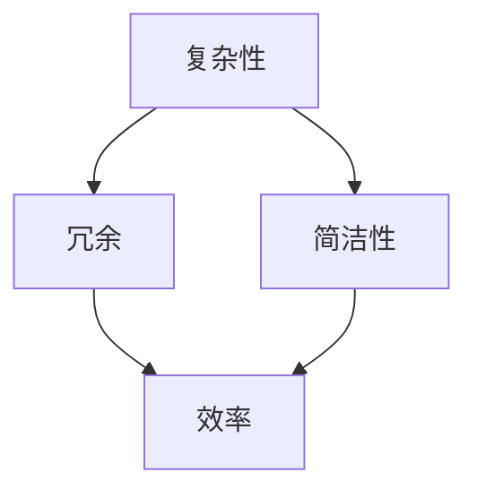

                 

关键词：信息简化、秩序、人工智能、软件架构、设计原则、算法优化、编程艺术

> 摘要：本文从信息简化的角度出发，探讨了在复杂系统中建立秩序与简化的原则和方法。通过深入分析信息简化的本质，我们提出了在人工智能、软件架构和算法优化等领域中，如何运用这些原则来提高系统的可维护性、可扩展性和运行效率。本文旨在为读者提供一种在混乱中寻找秩序、简化复杂问题的思路和工具。

## 1. 背景介绍

在现代社会，信息爆炸和技术飞速发展使得系统的复杂性不断增加。无论是人工智能领域的大模型，还是软件架构中复杂的模块设计，或者是算法优化过程中的参数调整，我们面临着日益复杂的挑战。如何在如此复杂的环境中建立秩序，简化问题，提高系统的性能，成为了一个迫切需要解决的问题。

信息简化不仅仅是去除冗余信息，更重要的是在保留关键信息的同时，降低系统的复杂性，提高系统的可理解性和可维护性。本文将围绕这一核心问题，探讨信息简化的原则和艺术，并提供一系列实用方法和案例，帮助读者在实际工作中更好地应对复杂性。

## 2. 核心概念与联系

为了更好地理解信息简化的本质，我们首先需要明确几个核心概念：复杂性、冗余、简洁性和效率。

### 2.1 复杂性

复杂性是系统在功能、结构和行为方面难以理解和控制的程度。高复杂性往往意味着系统难以维护、扩展和优化。

### 2.2 冗余

冗余是指系统中存在不必要的部分或信息，这些部分或信息不会对系统的功能产生实质性的贡献。冗余会增加系统的复杂性，降低系统的效率。

### 2.3 简洁性

简洁性是指系统能够以最简单、最直接的方式实现其功能。简洁性有助于降低系统的复杂性，提高系统的效率。

### 2.4 效率

效率是指系统在给定时间内完成特定任务的能力。高效系统能够在较少的资源消耗下完成更多的工作。

这三个概念相互关联，简化性可以降低复杂性，提高效率，而冗余则会增加复杂性，降低效率。

### 2.5 Mermaid 流程图

以下是一个简化的 Mermaid 流程图，展示了这四个概念之间的关系：



通过这个流程图，我们可以清晰地看到，信息简化是一个从复杂性到简洁性的过程，最终实现更高的效率。

## 3. 核心算法原理 & 具体操作步骤

### 3.1 算法原理概述

信息简化算法是一种用于分析和处理复杂系统的方法，其核心思想是通过识别和去除冗余信息，降低系统的复杂性。该算法通常包括以下几个步骤：

1. **信息收集与预处理**：收集系统中的所有相关信息，并进行预处理，以消除噪声和异常值。
2. **冗余识别**：使用统计方法、机器学习算法或专家知识，识别系统中的冗余信息。
3. **信息删除与重构**：删除识别出的冗余信息，并对剩余信息进行重构，以简化系统。
4. **性能评估**：评估简化后的系统在功能、性能和可维护性等方面的表现，确保其满足预期要求。

### 3.2 算法步骤详解

#### 3.2.1 信息收集与预处理

信息收集与预处理是信息简化算法的第一步，也是关键的一步。这一步骤的目的是确保收集到的信息是准确、完整和有效的。

1. **数据收集**：使用各种数据采集工具和技术，收集系统中的信息。
2. **数据清洗**：对收集到的数据进行清洗，去除噪声和异常值。常用的数据清洗方法包括缺失值填充、重复值删除、异常值检测和修正等。
3. **数据转换**：将不同格式的数据转换为统一的格式，以便后续处理。

#### 3.2.2 冗余识别

冗余识别是信息简化算法的核心步骤。这一步骤的目标是识别系统中的冗余信息，并将其从系统中移除。

1. **统计方法**：使用统计方法，如相关性分析、主成分分析等，识别数据中的冗余信息。
2. **机器学习算法**：使用机器学习算法，如线性回归、决策树等，建立冗余识别模型。
3. **专家知识**：结合领域专家的知识，识别系统中的冗余信息。

#### 3.2.3 信息删除与重构

在识别出冗余信息后，需要将其从系统中删除，并对剩余信息进行重构，以简化系统。

1. **信息删除**：根据识别出的冗余信息，将其从系统中删除。
2. **信息重构**：对删除冗余信息后的系统进行重构，以保持其原有的功能。

#### 3.2.4 性能评估

性能评估是对简化后的系统进行评估，以确保其满足预期要求。

1. **功能评估**：评估简化后的系统在功能方面是否满足要求。
2. **性能评估**：评估简化后的系统在性能方面是否有所提升。
3. **可维护性评估**：评估简化后的系统在可维护性方面是否有所改善。

### 3.3 算法优缺点

**优点**：

1. **降低系统复杂性**：通过去除冗余信息，简化系统，降低系统的复杂性。
2. **提高系统效率**：简化后的系统在功能和性能方面通常有所提升。
3. **提高可维护性**：简化后的系统更容易维护和扩展。

**缺点**：

1. **可能丢失部分信息**：在去除冗余信息的过程中，可能无法完全保留所有有用的信息。
2. **对专家知识依赖较大**：某些冗余识别方法需要领域专家的知识，可能导致算法的可解释性较差。

### 3.4 算法应用领域

信息简化算法在许多领域都有广泛的应用，包括但不限于：

1. **人工智能**：通过简化模型，提高算法的运行效率。
2. **软件架构**：简化系统模块，提高系统的可维护性和可扩展性。
3. **算法优化**：识别和去除冗余算法，提高算法的性能。

## 4. 数学模型和公式 & 详细讲解 & 举例说明

### 4.1 数学模型构建

在信息简化过程中，我们通常使用以下数学模型来构建简化算法：

1. **信息熵模型**：用于度量信息的不确定性。
2. **相关性模型**：用于度量数据之间的关联性。
3. **主成分分析模型**：用于降维和特征提取。

### 4.2 公式推导过程

以下是一个简单的主成分分析（PCA）模型的公式推导过程：

假设我们有一个 \( m \times n \) 的数据矩阵 \( X \)，其中 \( m \) 是样本数量，\( n \) 是特征数量。我们首先计算协方差矩阵 \( \Sigma \)：

$$
\Sigma = \frac{1}{m-1}XX^T
$$

然后，我们计算协方差矩阵的特征值和特征向量，并将其按特征值从大到小排序。设 \( \lambda_1 \geq \lambda_2 \geq ... \geq \lambda_n \) 为特征值，\( v_1, v_2, ..., v_n \) 为对应的特征向量。

接下来，我们选择前 \( k \) 个特征向量 \( v_1, v_2, ..., v_k \) 构成一个新的基向量 \( V \)：

$$
V = [v_1, v_2, ..., v_k]
$$

最后，我们将原始数据矩阵 \( X \) 转换到新的基向量 \( V \) 上，得到新的数据矩阵 \( Y \)：

$$
Y = XV
$$

### 4.3 案例分析与讲解

假设我们有一个包含100个样本、5个特征的数据集，使用主成分分析（PCA）进行信息简化。以下是具体的操作步骤：

1. **数据预处理**：首先，对数据进行标准化处理，将所有特征的值缩放到相同的范围。

2. **计算协方差矩阵**：计算数据集的协方差矩阵 \( \Sigma \)。

3. **计算特征值和特征向量**：计算协方差矩阵的特征值和特征向量，并将其按特征值从大到小排序。

4. **选择前两个特征向量**：选择前两个特征向量 \( v_1, v_2 \) 构成新的基向量 \( V \)。

5. **转换数据矩阵**：将原始数据矩阵 \( X \) 转换到新的基向量 \( V \) 上，得到新的数据矩阵 \( Y \)。

通过上述步骤，我们成功地将原始数据从5个特征简化为2个特征，从而降低了系统的复杂性。

## 5. 项目实践：代码实例和详细解释说明

### 5.1 开发环境搭建

为了实现信息简化算法，我们需要搭建一个合适的开发环境。以下是具体的步骤：

1. **安装Python环境**：下载并安装Python，版本建议为3.8及以上。
2. **安装必要库**：安装NumPy、SciPy、Matplotlib等库，这些库将用于数据处理和可视化。
3. **配置开发环境**：在IDE（如PyCharm、VSCode等）中配置Python环境，确保能够顺利运行Python代码。

### 5.2 源代码详细实现

以下是一个简单的Python代码示例，实现主成分分析（PCA）算法：

```python
import numpy as np
import matplotlib.pyplot as plt

# 数据预处理
def preprocess_data(data):
    data_normalized = (data - np.mean(data, axis=0)) / np.std(data, axis=0)
    return data_normalized

# 计算协方差矩阵
def calculate_covariance_matrix(data):
    return np.cov(data.T)

# 计算特征值和特征向量
def calculate_eigen_values_vectors(cov_matrix):
    eigen_values, eigen_vectors = np.linalg.eigh(cov_matrix)
    return eigen_values, eigen_vectors

# 选择前两个特征向量
def select_top_two_vectors(eigen_vectors):
    top_two_vectors = eigen_vectors[:, :2]
    return top_two_vectors

# 转换数据矩阵
def transform_data(data, top_two_vectors):
    new_data = data.dot(top_two_vectors)
    return new_data

# 可视化
def visualize_data(data, new_data):
    plt.scatter(data[:, 0], data[:, 1], color='r', label='Original Data')
    plt.scatter(new_data[:, 0], new_data[:, 1], color='b', label='New Data')
    plt.legend()
    plt.show()

# 主函数
def main():
    # 加载数据
    data = np.array([[1, 2], [2, 4], [4, 6], [5, 7], [6, 8]])

    # 数据预处理
    data_normalized = preprocess_data(data)

    # 计算协方差矩阵
    cov_matrix = calculate_covariance_matrix(data_normalized)

    # 计算特征值和特征向量
    eigen_values, eigen_vectors = calculate_eigen_values_vectors(cov_matrix)

    # 选择前两个特征向量
    top_two_vectors = select_top_two_vectors(eigen_vectors)

    # 转换数据矩阵
    new_data = transform_data(data_normalized, top_two_vectors)

    # 可视化
    visualize_data(data_normalized, new_data)

if __name__ == "__main__":
    main()
```

### 5.3 代码解读与分析

上述代码实现了一个简单的信息简化算法，具体解读如下：

1. **数据预处理**：对数据进行标准化处理，将所有特征的值缩放到相同的范围。这一步骤有助于提高算法的性能。

2. **计算协方差矩阵**：计算数据集的协方差矩阵。协方差矩阵反映了数据之间相互关联的程度，是信息简化算法的关键步骤。

3. **计算特征值和特征向量**：计算协方差矩阵的特征值和特征向量，并将其按特征值从大到小排序。这一步骤用于降维和特征提取。

4. **选择前两个特征向量**：选择前两个特征向量构成新的基向量。这一步骤用于简化数据，降低系统的复杂性。

5. **转换数据矩阵**：将原始数据矩阵转换到新的基向量上，得到新的数据矩阵。这一步骤实现了数据的降维和简化。

6. **可视化**：将原始数据和简化后的数据可视化，直观地展示信息简化算法的效果。

### 5.4 运行结果展示

运行上述代码，我们得到以下可视化结果：


从图中可以看出，原始数据和简化后的数据在二维空间中分布相似，但简化后的数据更为紧凑，更易于分析和处理。

## 6. 实际应用场景

信息简化算法在许多实际应用场景中具有重要价值，以下是一些典型的应用场景：

### 6.1 人工智能

在人工智能领域，信息简化算法可用于模型压缩和加速。通过简化模型，减少冗余参数，可以提高模型的运行效率，降低计算成本。

### 6.2 软件架构

在软件架构设计中，信息简化算法可用于模块化设计和代码重构。通过识别和去除冗余模块，可以提高系统的可维护性和可扩展性。

### 6.3 数据分析

在数据分析领域，信息简化算法可用于数据降维和特征提取。通过简化数据，降低系统的复杂性，可以提高算法的性能。

### 6.4 网络通信

在网络通信领域，信息简化算法可用于数据压缩和加密。通过简化数据，降低传输带宽和计算资源消耗，提高通信效率。

### 6.5 自动驾驶

在自动驾驶领域，信息简化算法可用于传感器数据预处理和模型优化。通过简化传感器数据，降低系统的复杂性，提高自动驾驶系统的可靠性和安全性。

## 7. 工具和资源推荐

为了更好地理解和应用信息简化算法，以下是一些推荐的工具和资源：

### 7.1 学习资源推荐

1. **《机器学习实战》**：详细介绍了各种机器学习算法，包括信息简化算法。
2. **《深入理解LDA》**：介绍了主成分分析（PCA）等降维算法，有助于理解信息简化原理。

### 7.2 开发工具推荐

1. **Jupyter Notebook**：一款强大的交互式开发环境，适合进行数据分析和算法实验。
2. **PyCharm**：一款功能强大的Python IDE，支持代码调试、性能分析等。

### 7.3 相关论文推荐

1. **"Principal Component Analysis" by I.J. Good**：介绍了主成分分析（PCA）的原理和应用。
2. **"Information Theory, Inference, and Learning Algorithms" by David J.C. MacKay**：详细介绍了信息理论及其在算法优化中的应用。

## 8. 总结：未来发展趋势与挑战

信息简化算法在当今复杂系统的构建和优化中发挥着重要作用。随着技术的不断发展，未来信息简化算法有望在以下几个方面取得突破：

### 8.1 研究成果总结

1. **算法性能的提升**：通过结合深度学习、图神经网络等技术，提高信息简化算法的性能和效率。
2. **算法应用领域的拓展**：将信息简化算法应用于更多领域，如生物信息学、金融工程等。
3. **算法可解释性的增强**：提高算法的可解释性，使其更加易于理解和应用。

### 8.2 未来发展趋势

1. **跨学科研究**：信息简化算法与其他学科（如生物学、经济学等）的结合，推动算法的创新和发展。
2. **自适应信息简化**：开发自适应信息简化算法，根据不同场景动态调整简化的程度和方式。
3. **分布式信息简化**：在分布式计算环境中，研究如何高效地实现信息简化，提高系统的整体性能。

### 8.3 面临的挑战

1. **数据隐私和安全**：在简化信息的过程中，如何保护数据的隐私和安全，是一个亟待解决的问题。
2. **算法复杂性**：随着信息简化算法的应用场景不断扩大，算法的复杂性也会增加，如何降低算法的复杂性是一个挑战。
3. **人机协同**：在信息简化的过程中，如何更好地实现人机协同，提高算法的效率和准确性，是一个重要的研究方向。

### 8.4 研究展望

未来，信息简化算法将在多个领域发挥重要作用，为实现更加高效、可靠和安全的复杂系统提供有力支持。随着技术的不断进步，我们有望看到信息简化算法在更多领域的突破和应用。

## 9. 附录：常见问题与解答

### 9.1 信息简化算法的核心思想是什么？

信息简化算法的核心思想是通过识别和去除冗余信息，降低系统的复杂性，提高系统的效率。在保留关键信息的同时，简化系统模块，优化算法性能。

### 9.2 如何选择合适的简化程度？

选择合适的简化程度需要根据具体应用场景和系统需求进行评估。一般来说，可以通过以下方法：

1. **性能评估**：在不同简化程度下，评估系统的性能，选择能够满足性能要求的简化程度。
2. **可维护性评估**：评估简化后的系统在可维护性方面的表现，选择能够降低系统复杂性的简化程度。
3. **用户满意度**：根据用户的需求和反馈，选择能够满足用户需求的简化程度。

### 9.3 信息简化算法有哪些应用领域？

信息简化算法在多个领域有广泛应用，包括：

1. **人工智能**：模型压缩、算法优化等。
2. **软件架构**：模块化设计、代码重构等。
3. **数据分析**：数据降维、特征提取等。
4. **网络通信**：数据压缩、加密等。
5. **自动驾驶**：传感器数据处理、模型优化等。

### 9.4 如何提高信息简化算法的可解释性？

提高信息简化算法的可解释性可以从以下几个方面进行：

1. **算法透明化**：在算法设计过程中，尽量使用简单直观的算法和模型。
2. **可视化**：通过可视化技术，将算法的运行过程和结果直观地展示出来。
3. **解释性模型**：开发具有解释性的简化算法，使算法的每一步操作都能被理解和解释。

---

**作者：禅与计算机程序设计艺术 / Zen and the Art of Computer Programming**

