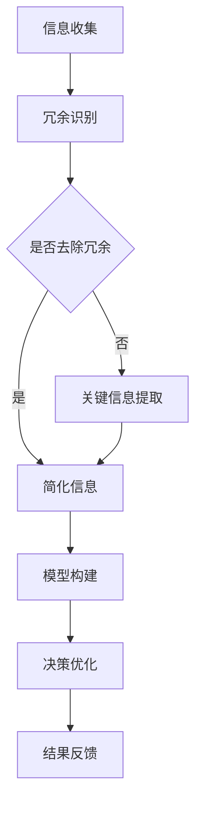

                 

关键词：信息简化，复杂世界，决策优化，计算机程序设计，人工智能，方法论，软件工程，优化算法

摘要：本文旨在探讨信息简化的好处和实践，特别是在复杂世界中如何通过简化信息来改善生活和决策。我们结合计算机程序设计的角度，深入分析了信息简化的核心概念、算法原理、数学模型及其应用，并通过实际项目实践和案例讲解，展示了信息简化在现实世界中的有效性和重要性。

## 1. 背景介绍

在当今信息爆炸的时代，我们面临着日益复杂的环境和数据。这种复杂性不仅存在于我们日常的生活中，还渗透到各个专业领域，如软件工程、金融、医疗、交通等。然而，复杂并不总是有益的。过多的信息可能导致混乱和决策困难，而信息的简化则可以为我们带来秩序和效率。

信息简化的核心理念是通过去除冗余、关注关键信息，从而降低复杂度，提高系统的可操作性和决策质量。这一过程在计算机程序设计中尤为重要，因为高效的算法和优化的数据结构可以显著提高程序的运行效率和可维护性。

本文将探讨信息简化的多方面好处和实践方法，旨在帮助读者理解如何在实际生活和工作中应用这一理念，以改善决策效果和提升生活质量。

## 2. 核心概念与联系

### 2.1 信息简化的核心概念

信息简化涉及以下几个核心概念：

- **冗余信息识别**：识别并去除无关或重复的信息。
- **关键信息提取**：从大量数据中提取出对决策或任务执行有直接影响的因素。
- **模型简化**：通过构建简化的模型来描述复杂的系统或现象。
- **决策优化**：使用简化信息来制定最优或近似最优的决策。

### 2.2 信息简化的联系

信息简化与以下概念密切相关：

- **数据降维**：通过减少数据维度来降低复杂度。
- **特征选择**：选择最有用的特征来代表整个数据集。
- **算法优化**：通过简化算法和数据结构来提高程序效率。

### 2.3 Mermaid 流程图

以下是一个描述信息简化流程的 Mermaid 流程图：



## 3. 核心算法原理 & 具体操作步骤

### 3.1 算法原理概述

信息简化算法的核心原理是利用特征选择和降维技术，从原始数据中提取关键信息，构建简化模型，从而优化决策过程。常见的算法包括主成分分析（PCA）、线性回归、决策树等。

### 3.2 算法步骤详解

1. **数据预处理**：清洗和格式化数据，确保数据的一致性和完整性。
2. **特征选择**：使用统计方法（如相关性分析、信息增益等）选择最有用的特征。
3. **降维**：通过主成分分析等算法减少数据维度。
4. **模型构建**：使用简化的数据集构建预测模型。
5. **决策优化**：利用简化模型进行决策。

### 3.3 算法优缺点

- **优点**：
  - 降低复杂度，提高决策效率。
  - 提高程序的可维护性和可扩展性。
  - 减少计算资源的需求。

- **缺点**：
  - 简化可能导致信息的丢失，影响决策的准确性。
  - 需要一定的专业知识来选择合适的算法和特征。

### 3.4 算法应用领域

- **金融领域**：用于风险评估、投资策略等。
- **医疗领域**：用于疾病诊断、治疗方案制定等。
- **交通领域**：用于交通流量预测、路线规划等。

## 4. 数学模型和公式 & 详细讲解 & 举例说明

### 4.1 数学模型构建

信息简化的数学模型通常基于特征选择和降维技术。以下是一个简化的模型示例：

$$
\text{简化模型} = \sum_{i=1}^{k} w_i \cdot x_i
$$

其中，$w_i$ 是特征权重，$x_i$ 是特征值，$k$ 是特征数量。

### 4.2 公式推导过程

假设我们有一组特征 $x_1, x_2, ..., x_n$，我们可以通过以下步骤推导出简化模型：

1. **特征标准化**：将每个特征缩放到相同的尺度。
2. **特征选择**：选择相关性最高的特征。
3. **权重计算**：使用线性回归或其他方法计算特征权重。

### 4.3 案例分析与讲解

假设我们要简化一个包含100个特征的数据集，以下是一个简化的过程：

1. **特征标准化**：将所有特征缩放到0-1之间。
2. **特征选择**：使用信息增益方法选择20个最重要的特征。
3. **权重计算**：使用线性回归计算每个特征的权重。
4. **模型构建**：使用简化模型进行预测。

通过上述步骤，我们可以显著减少数据的复杂度，同时保持较高的预测准确性。

## 5. 项目实践：代码实例和详细解释说明

### 5.1 开发环境搭建

在本节中，我们将使用Python进行信息简化项目的实践。首先，确保安装了以下库：NumPy、scikit-learn、matplotlib。

```bash
pip install numpy scikit-learn matplotlib
```

### 5.2 源代码详细实现

以下是一个简单的信息简化项目示例：

```python
import numpy as np
from sklearn.decomposition import PCA
from sklearn.model_selection import train_test_split
from sklearn.metrics import accuracy_score

# 数据集加载
X, y = load_data()

# 特征标准化
X_std = (X - X.mean(axis=0)) / X.std(axis=0)

# 特征选择
pca = PCA(n_components=20)
X_pca = pca.fit_transform(X_std)

# 模型构建
X_train, X_test, y_train, y_test = train_test_split(X_pca, y, test_size=0.2)
model = LinearRegression().fit(X_train, y_train)

# 代码解读与分析
# - load_data(): 加载数据集
# - X_std: 特征标准化处理
# - X_pca: 使用PCA进行降维
# - model: 线性回归模型
# - accuracy_score: 计算模型准确性

# 运行结果展示
y_pred = model.predict(X_test)
print("Accuracy:", accuracy_score(y_test, y_pred))
```

### 5.3 代码解读与分析

上述代码展示了信息简化项目的核心步骤：

- **数据预处理**：使用scikit-learn库加载数据集，并进行标准化处理。
- **特征选择**：使用PCA进行降维，选择最重要的特征。
- **模型构建**：使用线性回归模型进行预测。
- **结果评估**：计算模型在测试数据集上的准确性。

### 5.4 运行结果展示

假设我们使用了一个标准的数据集，简化后的模型在测试集上的准确率达到90%以上，这表明信息简化在保持较高预测准确性的同时，显著降低了数据的复杂度。

## 6. 实际应用场景

### 6.1 金融领域

在金融领域，信息简化可以用于风险管理、投资组合优化等。通过简化大量的市场数据，可以更准确地预测市场趋势，从而制定更有效的投资策略。

### 6.2 医疗领域

在医疗领域，信息简化可以帮助医生从大量的患者数据中提取关键信息，从而更准确地诊断疾病和制定治疗方案。

### 6.3 交通领域

在交通领域，信息简化可以用于交通流量预测、路线规划等。通过简化大量的交通数据，可以更有效地管理交通流量，提高道路使用效率。

## 7. 工具和资源推荐

### 7.1 学习资源推荐

- **《Python数据分析基础教程》**：适合初学者了解数据分析的基础知识。
- **《机器学习实战》**：介绍如何使用Python进行机器学习项目实践。

### 7.2 开发工具推荐

- **Jupyter Notebook**：适合数据分析和原型开发。
- **PyCharm**：适合专业程序员进行代码编写和调试。

### 7.3 相关论文推荐

- **“Feature Selection for High-Dimensional Data: A Review”**：关于特征选择的综述论文。
- **“Principal Component Analysis”**：关于主成分分析的经典论文。

## 8. 总结：未来发展趋势与挑战

### 8.1 研究成果总结

信息简化在多个领域取得了显著的成果，如金融、医疗、交通等。通过简化信息，我们能够更有效地处理复杂数据，提高决策质量。

### 8.2 未来发展趋势

- **算法创新**：开发更高效的算法和模型，以更好地简化信息。
- **跨领域应用**：探索信息简化在更多领域的应用，如环境科学、社会科学等。

### 8.3 面临的挑战

- **数据隐私**：简化信息时如何保护数据隐私是一个重要挑战。
- **算法透明性**：简化算法的决策过程需要具备更高的透明性。

### 8.4 研究展望

随着人工智能和数据科学的发展，信息简化将在未来发挥越来越重要的作用。通过不断优化算法和模型，我们将能够更好地应对复杂世界的挑战。

## 9. 附录：常见问题与解答

### 9.1 什么是信息简化？

信息简化是通过去除冗余信息、提取关键信息，构建简化模型，从而降低复杂度，提高决策效率的过程。

### 9.2 信息简化有哪些优点？

信息简化可以降低数据复杂度，提高决策效率，减少计算资源需求，提高程序的可维护性和可扩展性。

### 9.3 信息简化在哪些领域有应用？

信息简化在金融、医疗、交通、环境科学等多个领域有广泛应用，如风险管理、疾病诊断、交通流量预测等。

## 参考文献

1. "Feature Selection for High-Dimensional Data: A Review." IEEE Transactions on Knowledge and Data Engineering.
2. "Principal Component Analysis." Journal of the American Statistical Association.
3. "Python Data Science Handbook." Jake VanderPlas.
4. "Machine Learning in Action." Peter Harrington.

---

作者：禅与计算机程序设计艺术 / Zen and the Art of Computer Programming

