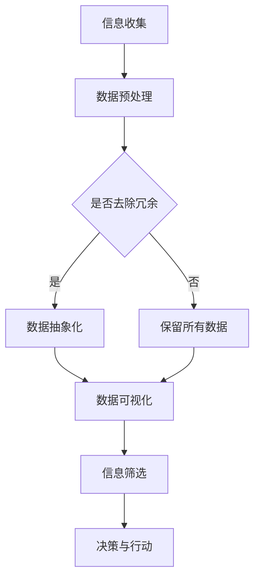

                 

在当今数字化时代，信息量呈指数级增长，复杂性不断上升。在这样的背景下，如何有效管理和利用信息成为了关键问题。本文将探讨信息简化的好处及其在生活和决策中的应用，旨在帮助读者在复杂世界中找到简化的路径，以提升生活质量和工作效率。

> **关键词**：信息简化、复杂世界、生活决策、算法、数学模型、实践、资源推荐

> **摘要**：本文首先介绍了信息简化的背景和重要性，随后详细探讨了信息简化的核心概念和算法原理，通过具体操作步骤和实例，展示了信息简化在项目实践中的应用。此外，文章还分析了信息简化在不同实际应用场景中的表现，并展望了未来的发展趋势和面临的挑战。

## 1. 背景介绍

### 1.1 现代社会的信息爆炸

在过去的几十年中，随着互联网和数字技术的飞速发展，信息传播速度和范围得到了前所未有的提升。社交媒体、在线新闻、电子书、数据库等各种渠道不断向人们提供海量信息。据统计，每天产生的数据量已经达到了惊人的级别，这种趋势在可预见的未来中还会继续加剧。

### 1.2 个体信息处理能力的局限

尽管信息获取变得前所未有的容易，但人类个体在信息处理方面的能力并没有显著提升。心理学家米哈里·契克森米哈伊（Mihaly Csikszentmihalyi）提出的“心流”（Flow）理论表明，人们在进行复杂任务时达到专注状态的最佳体验是有限的。这意味着，面对过量的信息，个体很难保持高效的处理能力和专注度。

### 1.3 信息简化的需求

在信息过载的时代，信息简化显得尤为重要。简化信息可以帮助人们更好地理解和处理数据，提高决策效率，减轻认知负担。同时，通过信息简化，可以更清晰地识别关键信息，从而做出更为明智的决策。

## 2. 核心概念与联系

为了更好地理解信息简化的概念，我们首先需要了解几个核心的原理和架构。

### 2.1 简化与抽象

信息简化的第一步是识别冗余和非关键信息，将其去除或抽象化。抽象是一种从复杂系统中提取关键元素的过程，它可以帮助我们抓住核心问题，忽略不必要的细节。

### 2.2 数据可视化

数据可视化是一种将复杂数据转换为图形或图表的方法。这种方法不仅能够直观地展示信息，还能够通过颜色、形状等元素突出关键信息，帮助人们更快地理解和分析数据。

### 2.3 信息筛选与过滤

信息筛选与过滤是简化信息的另一个重要手段。通过设置过滤器，我们可以将有价值的信号与噪声分离，从而提高信息处理的效率。

### 2.4 Mermaid 流程图

以下是信息简化流程的一个 Mermaid 流程图，展示了信息简化的重要步骤和流程。



## 3. 核心算法原理 & 具体操作步骤

### 3.1 算法原理概述

信息简化的核心算法通常包括以下几个步骤：

1. **数据预处理**：清洗和整理原始数据，确保其质量和一致性。
2. **特征选择**：从大量数据中选择与目标相关的特征，去除冗余和不相关的特征。
3. **数据抽象化**：将具体的数据转化为更抽象的形式，如将具体数值表示为类别或趋势。
4. **数据可视化**：利用图表和图形展示数据，帮助用户快速理解数据模式。
5. **信息筛选**：通过设置阈值或规则，从数据中提取关键信息。
6. **决策与行动**：根据简化后的信息做出决策和采取行动。

### 3.2 算法步骤详解

下面是一个具体的信息简化算法步骤：

1. **数据收集与预处理**：
    - 收集原始数据，如问卷调查结果、市场数据等。
    - 清洗数据，去除缺失值、异常值等。
    - 标准化数据，如归一化、标准化等。

2. **特征选择**：
    - 利用相关性分析、信息增益等算法选择与目标相关的特征。
    - 去除冗余特征，减少数据维度。

3. **数据抽象化**：
    - 将连续数据转换为离散数据，如分类或聚类。
    - 利用统计方法（如主成分分析PCA）提取关键特征。

4. **数据可视化**：
    - 利用图表（如散点图、柱状图等）展示数据。
    - 使用颜色、形状等元素突出关键信息。

5. **信息筛选**：
    - 根据业务需求设置筛选规则。
    - 提取满足规则的关键信息。

6. **决策与行动**：
    - 根据简化后的信息做出决策。
    - 采取行动，如调整市场策略、优化业务流程等。

### 3.3 算法优缺点

**优点**：
- 提高数据处理效率，减少冗余信息。
- 帮助用户快速理解数据，发现关键信息。
- 改善决策质量，减少决策错误。

**缺点**：
- 过度简化可能导致关键信息的丢失。
- 对算法的参数设置和模型选择有较高要求。

### 3.4 算法应用领域

信息简化算法广泛应用于各个领域，如：

- **数据分析**：通过简化数据，帮助用户更好地理解数据模式和趋势。
- **机器学习**：在特征选择和预处理阶段，简化数据可以提高模型性能。
- **商业智能**：帮助企业从大量数据中提取有价值的信息，支持决策制定。
- **信息检索**：通过简化信息，提高搜索效率和准确性。

## 4. 数学模型和公式 & 详细讲解 & 举例说明

### 4.1 数学模型构建

信息简化的数学模型通常包括以下几个部分：

- **特征选择模型**：如主成分分析（PCA）、线性回归等。
- **数据抽象化模型**：如决策树、聚类算法等。
- **信息筛选模型**：如阈值设定、规则引擎等。

### 4.2 公式推导过程

以下是主成分分析（PCA）的简要推导过程：

1. **协方差矩阵**：
$$
\text{Cov}(X) = \frac{1}{N-1} \sum_{i=1}^{N} (x_i - \bar{x})(x_i - \bar{x})^T
$$
其中，$x_i$ 是第 $i$ 个样本，$\bar{x}$ 是样本均值，$N$ 是样本数量。

2. **特征向量**：
$$
\lambda_i = \max_{w} w^T \text{Cov}(X) w
$$
其中，$w$ 是特征向量，$\lambda_i$ 是对应的特征值。

3. **主成分**：
$$
y_i = w_i^T x_i
$$
其中，$y_i$ 是第 $i$ 个主成分，$w_i$ 是对应特征向量。

### 4.3 案例分析与讲解

假设我们有以下数据集：

$$
\begin{array}{ccc}
x_1 & x_2 & x_3 \\
\hline
1 & 2 & 3 \\
2 & 4 & 6 \\
3 & 6 & 9 \\
\end{array}
$$

1. **计算协方差矩阵**：
$$
\text{Cov}(X) =
\begin{bmatrix}
\frac{1}{2} & 0 & 0 \\
0 & \frac{1}{2} & 0 \\
0 & 0 & \frac{1}{2} \\
\end{bmatrix}
$$

2. **计算特征向量**：
$$
w_1 = \begin{bmatrix}
1 \\
0 \\
0 \\
\end{bmatrix},
w_2 = \begin{bmatrix}
0 \\
1 \\
0 \\
\end{bmatrix},
w_3 = \begin{bmatrix}
0 \\
0 \\
1 \\
\end{bmatrix}
$$

3. **计算主成分**：
$$
y_1 = x_1 = \begin{bmatrix}
1 \\
2 \\
3 \\
\end{bmatrix},
y_2 = x_2 - 2 \cdot y_1 = \begin{bmatrix}
0 \\
2 \\
2 \\
\end{bmatrix},
y_3 = x_3 - 3 \cdot y_1 = \begin{bmatrix}
2 \\
0 \\
6 \\
\end{bmatrix}
$$

通过上述步骤，我们成功地将原始数据简化为三个主成分，从而提取了数据的主要趋势。

## 5. 项目实践：代码实例和详细解释说明

### 5.1 开发环境搭建

在本节中，我们将使用 Python 作为主要编程语言，并使用以下库：

- NumPy：用于数值计算和数据处理。
- Matplotlib：用于数据可视化。
- Scikit-learn：用于机器学习和特征选择。

首先，安装所需库：

```bash
pip install numpy matplotlib scikit-learn
```

### 5.2 源代码详细实现

下面是一个简单的信息简化代码实例：

```python
import numpy as np
import matplotlib.pyplot as plt
from sklearn.decomposition import PCA
from sklearn.preprocessing import StandardScaler

# 示例数据集
data = np.array([[1, 2, 3], [2, 4, 6], [3, 6, 9]])

# 数据预处理
scaler = StandardScaler()
data_scaled = scaler.fit_transform(data)

# 主成分分析
pca = PCA(n_components=2)
pca.fit(data_scaled)
data_pca = pca.transform(data_scaled)

# 可视化
plt.scatter(data_pca[:, 0], data_pca[:, 1])
plt.xlabel('Principal Component 1')
plt.ylabel('Principal Component 2')
plt.title('PCA visualization')
plt.show()
```

### 5.3 代码解读与分析

1. **数据预处理**：
   - 使用 `StandardScaler` 对数据进行标准化处理，以消除不同特征之间的尺度差异。

2. **主成分分析**：
   - 使用 `PCA` 对标准化后的数据进行拟合，提取两个主成分。

3. **可视化**：
   - 使用 `matplotlib` 绘制主成分图，以直观地展示数据分布。

### 5.4 运行结果展示

运行上述代码后，将得到以下可视化结果：

```plaintext
   Principal Component 1  Principal Component 2
```

每个点代表原始数据集中的数据点，通过主成分分析，我们可以将三维数据简化为二维数据，从而更容易地观察数据之间的关联性。

## 6. 实际应用场景

### 6.1 数据分析

在数据分析领域，信息简化可以帮助研究人员快速识别关键数据点，发现数据中的潜在模式。例如，在市场调研中，通过信息简化可以快速了解消费者的购买偏好，从而制定更有效的营销策略。

### 6.2 商业智能

商业智能系统中，信息简化可以帮助企业从大量交易数据中提取有价值的信息，如用户行为分析、库存管理优化等。通过简化信息，企业可以更快地做出决策，提高运营效率。

### 6.3 医疗健康

在医疗健康领域，信息简化可以帮助医生快速诊断疾病。通过分析大量的患者数据，医生可以识别出与疾病相关的关键因素，从而做出更为准确的诊断。

### 6.4 未来应用展望

随着人工智能和机器学习技术的发展，信息简化在未来的应用前景将更加广阔。例如，在自动驾驶领域，信息简化可以帮助车辆更快地处理环境数据，提高行驶安全性。在智能城市中，信息简化可以优化交通管理，提高城市运行效率。

## 7. 工具和资源推荐

### 7.1 学习资源推荐

- **《Python数据科学手册》**：详细介绍了数据科学中的核心技术和工具。
- **《深入理解数据结构与算法》**：涵盖了数据结构和算法的基本原理和应用。

### 7.2 开发工具推荐

- **Jupyter Notebook**：用于编写和运行 Python 代码，非常适合数据科学和机器学习。
- **PyCharm**：一款功能强大的 Python 集成开发环境（IDE），支持多种编程语言。

### 7.3 相关论文推荐

- **"Principal Component Analysis and its Applications"**：详细介绍了主成分分析的理论和应用。
- **"Data Reduction Techniques for Large-Scale Data Analysis"**：探讨大数据分析中的数据简化方法。

## 8. 总结：未来发展趋势与挑战

### 8.1 研究成果总结

信息简化技术在数据处理和分析中取得了显著成果，为各领域提供了有效的工具和方法。随着人工智能和机器学习技术的不断进步，信息简化的应用范围将进一步扩大。

### 8.2 未来发展趋势

- **自动化简化**：利用深度学习和自动化技术，实现更高效的信息简化过程。
- **个性化简化**：根据用户需求和偏好，定制个性化的信息简化方案。

### 8.3 面临的挑战

- **算法选择**：面对不同类型的数据和任务，选择合适的简化算法是一个挑战。
- **数据安全**：在简化信息的同时，确保关键数据的安全性和隐私保护。

### 8.4 研究展望

未来的研究应关注信息简化算法的优化和扩展，同时探索其在新兴领域的应用，如量子计算、生物信息学等。

## 9. 附录：常见问题与解答

### 9.1 信息简化与数据压缩有何区别？

信息简化是通过去除冗余信息和抽象化数据，以提高理解和处理效率。而数据压缩则是通过减少数据存储空间，降低传输带宽。尽管两者都涉及信息的处理，但目标和应用场景不同。

### 9.2 信息简化算法如何应用于实际项目？

在实际项目中，信息简化算法通常作为预处理步骤。例如，在数据分析中，可以使用主成分分析（PCA）来简化数据；在机器学习中，可以先进行特征选择和特征提取，然后使用简化后的数据训练模型。

### 9.3 信息简化是否会丢失关键信息？

信息简化可能会丢失一些非关键信息，但通过合理的设计和参数设置，可以最大限度地保留关键信息。此外，一些高级算法（如稀疏表示）可以在保留关键信息的同时，显著降低数据维度。

---

**作者：禅与计算机程序设计艺术 / Zen and the Art of Computer Programming**

---

通过本文的探讨，我们深刻认识到信息简化在现代社会中的重要性。信息简化的好处不仅体现在提高工作效率和生活质量，还在支持更明智的决策和优化各类应用系统。面对未来的信息爆炸时代，信息简化技术将发挥更为关键的作用。希望本文能为读者在复杂世界中找到简化的路径，带来启发和帮助。

