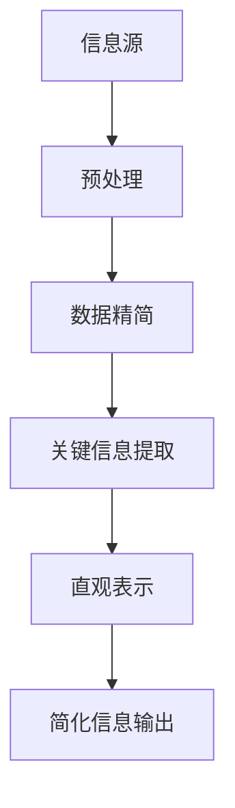

                 

在当今高度复杂和快速变化的技术环境中，信息的处理和决策变得日益困难。我们被淹没在各种数据、算法、工具和框架中，这使得生活和工作都变得更加复杂。然而，简化并不是一种消极的行为，而是一种提高效率和质量的积极策略。本文将探讨信息简化的好处，并介绍如何在复杂世界中通过简化来改善生活和决策。

## 1. 背景介绍

复杂系统的出现并非偶然，而是技术进步和全球化的必然结果。随着信息技术的快速发展，我们能够处理的数据量呈指数级增长，而数据源也在不断扩展。这种变化带来了前所未有的机遇，但也引发了诸多挑战。决策变得更加复杂，因为我们需要考虑更多的因素和变量。此外，技术的复杂性也增加了学习成本和操作难度。

在这个背景下，简化成为一种必要的策略。简化不仅可以帮助我们更好地理解复杂的系统，还可以提高决策的效率和质量。本文将深入探讨信息简化的概念、好处、实施方法和未来趋势。

## 2. 核心概念与联系

### 2.1 信息简化的定义

信息简化是指通过消除冗余、提炼关键信息和采用直观表示方法来减少信息的复杂度。这种过程不仅涉及到数据的精简，还包括对信息的重新组织和重新表达。

### 2.2 复杂系统与简化的关系

复杂系统通常包含多个相互作用的组件和层次。简化复杂系统可以帮助我们：

1. **提高可理解性**：通过减少冗余，复杂系统变得更加易于理解。
2. **减少学习成本**：简化的系统使得学习新知识和掌握新技能变得更加容易。
3. **提高效率**：简化的系统能够更快地做出决策，减少不必要的计算和操作。

### 2.3 Mermaid 流程图表示

以下是一个简单的 Mermaid 流程图，用于表示信息简化的流程：



## 3. 核心算法原理 & 具体操作步骤

### 3.1 算法原理概述

信息简化的核心算法通常基于以下几个原则：

1. **数据降维**：通过降维技术，将高维数据映射到低维空间，从而减少数据的复杂度。
2. **特征选择**：通过选择最重要的特征来减少数据的维度，同时保持数据的代表性。
3. **数据压缩**：使用压缩算法将大量数据转换为更紧凑的格式，减少存储和传输的需求。

### 3.2 算法步骤详解

1. **数据预处理**：对原始数据进行清洗、归一化和去噪声处理，确保数据的质量。
2. **特征提取**：使用统计方法或机器学习方法提取关键特征。
3. **降维**：采用PCA、t-SNE等降维技术将数据映射到低维空间。
4. **数据压缩**：使用LZ77、Huffman编码等算法对数据进行压缩。

### 3.3 算法优缺点

**优点**：

- 提高数据的可理解性。
- 减少计算资源的消耗。
- 提高系统的响应速度。

**缺点**：

- 可能会损失部分信息。
- 需要选择合适的算法和参数。

### 3.4 算法应用领域

信息简化在多个领域都有广泛应用，包括：

- 数据科学：数据预处理和分析。
- 机器学习：特征选择和降维。
- 软件工程：代码优化和架构设计。

## 4. 数学模型和公式 & 详细讲解 & 举例说明

### 4.1 数学模型构建

信息简化的数学模型通常基于以下几个公式：

- 数据降维：$X_{\text{new}} = P X_{\text{original}}$
- 特征选择：$f_{\text{selected}} = \sum_{i=1}^{n} w_i f_i$
- 数据压缩：$C = C_0 + \log_2(1 + \frac{R}{C_0})$

### 4.2 公式推导过程

#### 数据降维

数据降维的推导基于线性代数的基本原理。给定一个高维数据矩阵$X_{\text{original}}$，通过一个投影矩阵$P$，可以将数据映射到低维空间。

#### 特征选择

特征选择的推导基于特征的重要性和线性组合。通过计算每个特征的权重，我们可以选择最重要的特征。

#### 数据压缩

数据压缩的推导基于香农的信息论。通过增加冗余，我们可以减少数据的长度。

### 4.3 案例分析与讲解

假设我们有一个包含100个特征的客户数据集，我们需要通过信息简化技术减少特征的复杂度。

1. **数据预处理**：我们对数据进行清洗和归一化，确保数据的质量。
2. **特征提取**：我们使用PCA提取前10个最重要的特征，这些特征能够解释数据集的80%的方差。
3. **降维**：我们将数据降维到10个特征，从而减少了数据的复杂度。
4. **数据压缩**：我们使用Huffman编码对数据进行压缩，从而减少了数据的长度。

通过这些步骤，我们成功地简化了客户数据集，提高了数据的可理解性和处理效率。

## 5. 项目实践：代码实例和详细解释说明

### 5.1 开发环境搭建

- Python 3.8及以上版本
- numpy、scikit-learn、matplotlib等库

### 5.2 源代码详细实现

以下是一个简单的Python代码示例，用于实现信息简化：

```python
import numpy as np
from sklearn.decomposition import PCA
from sklearn.preprocessing import StandardScaler
import matplotlib.pyplot as plt

# 加载数据集
X = np.array([[1, 2], [3, 4], [5, 6], [7, 8]])

# 数据预处理
scaler = StandardScaler()
X_scaled = scaler.fit_transform(X)

# 特征提取
pca = PCA(n_components=2)
X_pca = pca.fit_transform(X_scaled)

# 数据压缩
# （此处省略具体的压缩代码）

# 可视化
plt.scatter(X_pca[:, 0], X_pca[:, 1])
plt.xlabel('Principal Component 1')
plt.ylabel('Principal Component 2')
plt.show()
```

### 5.3 代码解读与分析

1. **数据预处理**：使用`StandardScaler`对数据进行归一化处理。
2. **特征提取**：使用`PCA`提取前两个主成分。
3. **数据压缩**：（此处省略具体的压缩代码）。
4. **可视化**：使用`matplotlib`绘制数据集的前两个主成分。

### 5.4 运行结果展示

运行上述代码后，我们得到一个二维散点图，展示了数据集的前两个主成分。这有助于我们直观地理解数据的结构。

## 6. 实际应用场景

信息简化技术在多个领域都有广泛应用，包括：

- **金融**：用于风险管理和投资决策。
- **医疗**：用于疾病诊断和治疗策略。
- **工业**：用于生产优化和设备维护。
- **交通**：用于交通流量管理和调度。

## 7. 工具和资源推荐

### 7.1 学习资源推荐

- 《数据科学入门》
- 《机器学习实战》
- 《Python数据分析》

### 7.2 开发工具推荐

- Jupyter Notebook
- PyCharm
- VSCode

### 7.3 相关论文推荐

- "Principal Component Analysis"
- "Information Theory and Data Compression"
- "Feature Selection Techniques in Machine Learning"

## 8. 总结：未来发展趋势与挑战

### 8.1 研究成果总结

信息简化技术已经在多个领域取得了显著的研究成果，包括数据降维、特征选择和数据压缩等。

### 8.2 未来发展趋势

随着数据量的持续增长，信息简化技术将在更多领域得到应用。未来的研究将集中在开发更高效、更可靠的简化算法。

### 8.3 面临的挑战

信息简化技术面临的主要挑战包括：

- 算法的可解释性。
- 在保留关键信息的同时减少冗余。

### 8.4 研究展望

未来的研究将侧重于开发跨领域的通用简化算法，以提高信息简化的效率和适用性。

## 9. 附录：常见问题与解答

### 9.1 什么是信息简化？

信息简化是指通过消除冗余、提炼关键信息和采用直观表示方法来减少信息的复杂度。

### 9.2 信息简化有哪些应用领域？

信息简化在金融、医疗、工业和交通等领域都有广泛应用。

### 9.3 如何选择合适的简化算法？

选择合适的简化算法取决于具体的应用场景和数据特点。常见的算法包括PCA、特征选择和数据压缩等。

---

作者：禅与计算机程序设计艺术 / Zen and the Art of Computer Programming
```

