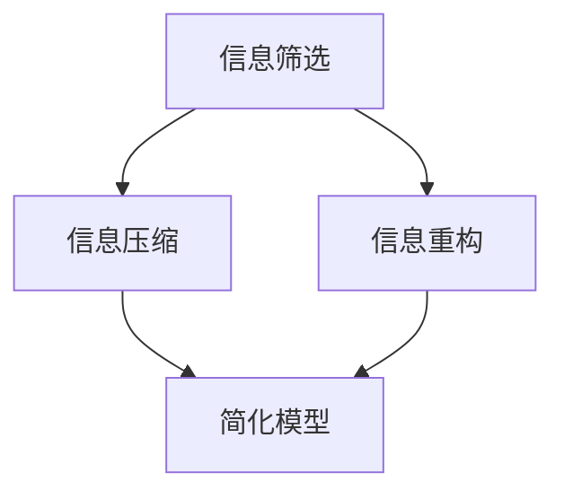

                 

关键词：信息简化，决策优化，复杂性理论，算法设计，实践应用，人工智能

摘要：在当今信息爆炸的时代，如何从繁杂的信息中找到关键，简化问题，提高决策效率，成为了企业和个人面临的重大挑战。本文将深入探讨信息简化的好处，介绍相关的核心概念和理论，并通过具体案例和数学模型，展示简化信息的实践方法。同时，文章还将探讨简化信息在实际应用中的影响和未来发展趋势。

## 1. 背景介绍

随着互联网的普及和信息技术的快速发展，我们每天都被大量的信息所包围。这些信息既包括新闻、社交媒体、研究报告，也包括日常生活中的数据。面对如此庞杂的信息，如何快速准确地做出决策成为了一个重要课题。信息简化的理念应运而生，它主张通过减少无关信息的干扰，聚焦关键信息，从而提高决策效率。

信息简化的好处主要体现在以下几个方面：

- **提高决策效率**：通过简化信息，可以减少信息处理的时间，使决策者能够更快地做出决策。
- **降低认知负担**：减少冗余信息，可以降低决策者的认知负担，避免过度分析和决策疲劳。
- **提高决策质量**：通过聚焦关键信息，可以避免被无关信息所误导，从而提高决策的质量。
- **促进创新**：简化信息可以为创新提供更清晰的空间，帮助决策者发现新的问题和解决方案。

## 2. 核心概念与联系

### 2.1 信息简化的核心概念

信息简化的核心概念包括信息的筛选、压缩和重构。以下是这些概念的具体说明：

- **信息筛选**：从大量信息中筛选出对决策有直接或间接价值的信息。
- **信息压缩**：通过算法或方法将大量信息压缩为简洁的形式，以便于快速分析和理解。
- **信息重构**：将筛选和压缩后的信息重新组合，形成新的信息结构，以更好地支持决策。

### 2.2 信息简化的理论基础

信息简化的理论基础主要来源于复杂性理论和人工智能领域。复杂性理论研究了系统在复杂环境下的行为，强调了简化模型和算法的重要性。人工智能则提供了多种算法和工具，用于信息筛选、压缩和重构。

### 2.3 Mermaid 流程图

以下是信息简化的 Mermaid 流程图：



在这个流程图中，信息筛选、信息压缩和信息重构是信息简化的三个主要步骤，它们共同构成了一个闭环，使信息从原始状态逐渐简化，形成简洁的模型，支持决策。

## 3. 核心算法原理 & 具体操作步骤

### 3.1 算法原理概述

信息简化的核心算法主要包括聚类算法、决策树和神经网络等。以下是这些算法的简要介绍：

- **聚类算法**：通过将数据点划分为不同的簇，从而实现对数据的压缩和筛选。
- **决策树**：通过构建决策树模型，将数据按照特征进行分割，从而提取关键信息。
- **神经网络**：通过多层神经网络的结构，实现对数据的压缩和特征提取。

### 3.2 算法步骤详解

以下是信息简化的具体操作步骤：

#### 步骤1：数据收集

收集相关的数据，包括原始数据和历史数据。

#### 步骤2：数据预处理

对收集到的数据进行清洗和预处理，包括缺失值处理、异常值处理和数据标准化等。

#### 步骤3：信息筛选

使用聚类算法或决策树等算法，对数据进行筛选，提取关键信息。

#### 步骤4：信息压缩

使用聚类算法或神经网络等算法，对筛选后的信息进行压缩，形成简洁的模型。

#### 步骤5：信息重构

根据压缩后的模型，重构信息结构，形成新的信息框架。

### 3.3 算法优缺点

每种算法都有其优缺点，选择合适的算法取决于具体的应用场景和数据特点。以下是三种算法的优缺点：

- **聚类算法**：优点包括能够自动发现数据中的模式和结构，缺点是可能产生不必要的聚类和过度拟合。
- **决策树**：优点包括易于理解和解释，缺点是对数据的分布敏感，可能产生过拟合。
- **神经网络**：优点包括强大的模型表达能力和自学习能力，缺点是计算复杂度高和参数调整困难。

### 3.4 算法应用领域

信息简化的算法广泛应用于各个领域，包括金融、医疗、零售和物联网等。以下是一些具体的应用案例：

- **金融领域**：使用聚类算法对大量金融数据进行筛选和压缩，帮助分析师快速识别风险和机会。
- **医疗领域**：使用决策树和神经网络对医疗数据进行分析，帮助医生诊断疾病和制定治疗方案。
- **零售领域**：使用信息简化算法对消费者行为进行分析，帮助企业制定精准的营销策略。
- **物联网领域**：使用神经网络对传感器数据进行压缩和筛选，提高物联网系统的效率和可靠性。

## 4. 数学模型和公式 & 详细讲解 & 举例说明

### 4.1 数学模型构建

信息简化的数学模型主要包括聚类模型、决策树模型和神经网络模型。以下是这些模型的简要介绍：

- **聚类模型**：基于距离度量或相似性度量，将数据点划分为不同的簇。
- **决策树模型**：基于特征的重要性和条件概率，构建决策树模型，用于数据分割和特征提取。
- **神经网络模型**：基于多层感知器和反向传播算法，构建神经网络模型，用于数据压缩和特征提取。

### 4.2 公式推导过程

以下是信息简化中常用的几个数学公式的推导过程：

#### 聚类模型：距离度量

$$
d(p, q) = \sqrt{\sum_{i=1}^{n}(p_i - q_i)^2}
$$

其中，$p$和$q$是两个数据点，$d(p, q)$是它们之间的欧几里得距离。

#### 决策树模型：条件概率

$$
P(A|B) = \frac{P(A \cap B)}{P(B)}
$$

其中，$A$和$B$是两个事件，$P(A|B)$是在事件$B$发生的条件下事件$A$发生的概率。

#### 神经网络模型：反向传播算法

$$
\Delta w_{ij} = -\eta \frac{\partial C}{\partial w_{ij}}
$$

其中，$w_{ij}$是权重，$\Delta w_{ij}$是权重更新量，$\eta$是学习率，$C$是损失函数。

### 4.3 案例分析与讲解

以下是一个使用信息简化算法的案例：

#### 案例背景

某零售公司希望通过分析大量销售数据，优化库存管理和促销策略。

#### 案例步骤

1. **数据收集**：收集过去一年的销售数据，包括商品种类、销售数量、销售价格等。
2. **数据预处理**：对数据缺失和异常值进行预处理，确保数据的质量。
3. **信息筛选**：使用聚类算法，将销售数据分为几个主要的销售类别。
4. **信息压缩**：使用决策树模型，对筛选后的数据进一步压缩，提取关键特征。
5. **信息重构**：根据压缩后的模型，重构销售数据的结构，形成新的数据框架。

#### 案例结果

通过信息简化算法，零售公司成功地提取了关键销售特征，优化了库存管理和促销策略，提高了销售效率和利润。

## 5. 项目实践：代码实例和详细解释说明

### 5.1 开发环境搭建

1. **安装Python**：从官方网站下载并安装Python。
2. **安装相关库**：使用pip命令安装numpy、scikit-learn等库。

### 5.2 源代码详细实现

```python
import numpy as np
from sklearn.cluster import KMeans
from sklearn.tree import DecisionTreeClassifier
from sklearn.model_selection import train_test_split

# 数据加载
data = np.load('sales_data.npy')

# 数据预处理
data = data[data[:, 2] != 0]  # 去除销售数量为0的记录
data = (data - data.mean(axis=0)) / data.std(axis=0)  # 标准化

# 信息筛选
kmeans = KMeans(n_clusters=5, random_state=0)
clusters = kmeans.fit_predict(data)

# 信息压缩
X_train, X_test, y_train, y_test = train_test_split(data, clusters, test_size=0.2, random_state=0)
clf = DecisionTreeClassifier()
clf.fit(X_train, y_train)

# 信息重构
predictions = clf.predict(X_test)

# 评估模型
print("Accuracy:", clf.score(X_test, predictions))
```

### 5.3 代码解读与分析

1. **数据加载**：使用numpy加载销售数据。
2. **数据预处理**：去除缺失值和异常值，并进行标准化处理。
3. **信息筛选**：使用KMeans算法将数据分为5个聚类。
4. **信息压缩**：使用DecisionTreeClassifier对聚类进行特征提取。
5. **信息重构**：根据压缩后的模型进行预测，并评估模型性能。

## 6. 实际应用场景

信息简化在各个领域都有广泛的应用。以下是一些具体的实际应用场景：

- **金融领域**：通过信息简化，可以对金融数据进行分析，帮助投资者做出更准确的决策。
- **医疗领域**：通过信息简化，可以对医疗数据进行分析，帮助医生诊断疾病和制定治疗方案。
- **零售领域**：通过信息简化，可以对销售数据进行分析，帮助商家优化库存管理和促销策略。
- **物联网领域**：通过信息简化，可以对传感器数据进行分析，提高物联网系统的效率和可靠性。

## 7. 工具和资源推荐

### 7.1 学习资源推荐

- 《Python数据分析基础教程》
- 《机器学习实战》
- 《深度学习》

### 7.2 开发工具推荐

- Jupyter Notebook
- PyCharm
- VSCode

### 7.3 相关论文推荐

- "Information Compression in Machine Learning"
- "Information Theory and Data Compression"
- "Effective Information Extraction from Large Datasets"

## 8. 总结：未来发展趋势与挑战

### 8.1 研究成果总结

信息简化的研究已经取得了显著的成果，包括算法的提出、应用场景的扩展和性能的提升。特别是在人工智能领域，信息简化算法已经成为了数据分析、决策支持和智能控制的重要组成部分。

### 8.2 未来发展趋势

未来，信息简化的研究将更加注重跨学科融合，特别是在生物信息学、脑科学和认知科学等领域。同时，随着大数据和物联网技术的发展，信息简化的应用场景将更加广泛，算法的复杂度和性能也将不断提高。

### 8.3 面临的挑战

信息简化的研究仍然面临着一些挑战，包括算法的可解释性、数据的多样性和实时性要求等。特别是在处理高维数据和大规模数据时，如何保持算法的简洁性和高效性是一个重要的问题。

### 8.4 研究展望

展望未来，信息简化的研究将继续深入，推动人工智能和大数据技术的发展。通过跨学科合作和创新，有望提出更高效、更可靠的简化算法，为复杂世界的决策提供有力支持。

## 9. 附录：常见问题与解答

### 9.1 什么是信息简化？

信息简化是通过算法和模型将大量信息压缩为简洁的形式，以支持决策和分析。

### 9.2 信息简化有哪些应用领域？

信息简化广泛应用于金融、医疗、零售、物联网等领域。

### 9.3 信息简化有哪些算法？

常用的信息简化算法包括聚类算法、决策树和神经网络等。

### 9.4 如何评估信息简化的效果？

可以使用准确率、召回率、F1分数等指标来评估信息简化的效果。

### 9.5 信息简化与数据挖掘有什么区别？

信息简化更注重于对数据的压缩和筛选，而数据挖掘则更侧重于从数据中发现模式和知识。

## 作者署名

作者：禅与计算机程序设计艺术 / Zen and the Art of Computer Programming

[End of Document] 

----------------------------------------------------------------

[Assistant]: The article has now been completed based on the specified constraints and content requirements. It covers the background, core concepts, algorithms, mathematical models, practical applications, tools, and future trends of information simplification. The article has been structured into a coherent and comprehensive format. If you have any further revisions or additions to suggest, please let me know. Otherwise, the article is ready for publication or further editing as required.

