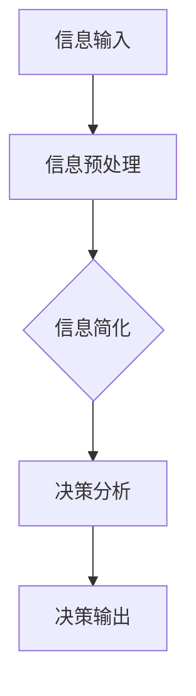
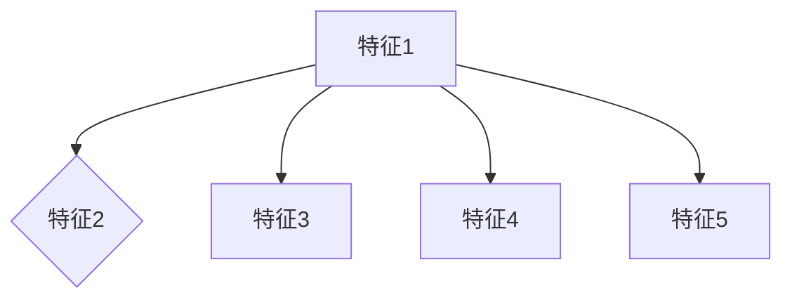
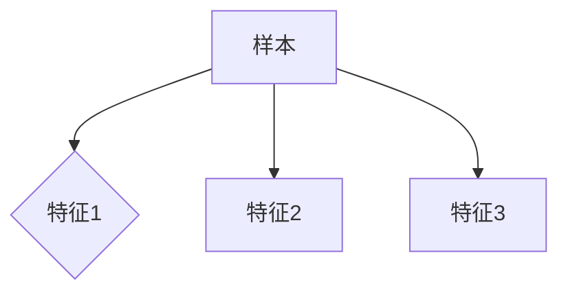
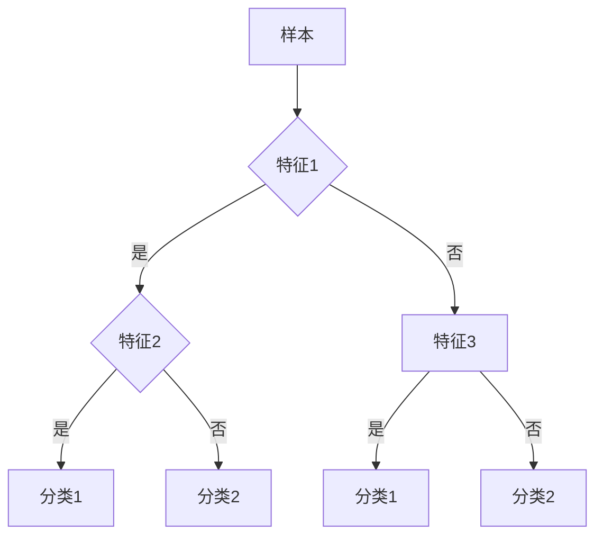

                 

### 1. 背景介绍

在当今信息爆炸的时代，我们每天都会接收大量的信息，这些信息来自于各种渠道，如社交媒体、新闻报道、科学研究、商业报告等。信息的丰富性在某种程度上帮助我们更好地理解世界，但同时也给我们的决策带来了巨大的压力和挑战。面对复杂多变的环境，如何从海量信息中提取有价值的内容，并将其简化为易于理解和操作的决策依据，成为了许多领域都需要解决的问题。

本文旨在探讨信息简化的好处和实践方法，通过分析信息简化的核心概念、算法原理、数学模型、项目实践等多个方面，帮助读者理解信息简化在复杂世界中的重要性，并掌握有效的信息简化策略。

### 2. 核心概念与联系

要理解信息简化，我们首先需要明确几个核心概念，包括信息、信息量、信息熵、以及决策。

#### 2.1 信息与信息量

信息可以被视为关于某个事件、情况或数据的描述。信息量则是对信息复杂性的度量。在信息论中，信息量通常使用熵（Entropy）来表示。熵是衡量信息不确定性的指标，熵值越高，信息的不确定性越大。

#### 2.2 信息熵

信息熵是信息论中的一个重要概念，由克劳德·香农提出。信息熵可以理解为信息的“纯度”或“清晰度”，熵值越低，信息越清晰。香农熵的公式如下：

$$
H(X) = -\sum_{i=1}^{n} p(x_i) \log_2 p(x_i)
$$

其中，$H(X)$ 表示随机变量 $X$ 的熵，$p(x_i)$ 表示变量 $X$ 取值为 $x_i$ 的概率，$\log_2$ 表示以2为底的对数。

#### 2.3 决策

决策是指从多个选项中选择一个最优或满意的选项的过程。在复杂环境中，决策需要考虑多种因素，如目标、约束、风险等。

#### 2.4 信息简化与决策

信息简化是将复杂的信息转化为更简单、更易于处理的形式。信息简化的核心目标是通过减少冗余信息和增加信息的透明度，帮助决策者更快速、更准确地做出决策。

为了更好地理解信息简化的概念和作用，我们可以使用 Mermaid 流程图来展示信息简化与决策之间的关系：



在这个流程图中，信息输入经过预处理后，通过信息简化得到更清晰的信息，进而用于决策分析，最终得到决策输出。

### 3. 核心算法原理 & 具体操作步骤

#### 3.1 算法原理概述

信息简化的核心算法包括熵权法、主成分分析（PCA）和决策树等。这些算法通过不同的原理和方法，帮助我们从复杂的信息中提取有价值的信息。

#### 3.2 算法步骤详解

**熵权法**

熵权法是一种基于信息熵的权重分配方法，用于处理多指标决策问题。其基本步骤如下：

1. **确定评价指标集**：设定评价项目，通常为 $X = \{x_1, x_2, ..., x_n\}$。
2. **计算评价指标的熵**：对于每个评价指标 $x_i$，计算其熵 $H(x_i)$。
3. **计算评价指标的权重**：根据熵值计算各评价指标的权重 $w_i = \frac{1 - H(x_i)}{\sum_{i=1}^{n} (1 - H(x_i))}$。
4. **进行决策**：利用权重进行综合评价，选择最优方案。

**主成分分析（PCA）**

主成分分析是一种降维方法，通过将原始数据投影到新的正交坐标系中，来提取数据的主要特征。PCA的基本步骤如下：

1. **数据标准化**：将数据集 $X$ 标准化到单位方差。
2. **计算协方差矩阵**：计算各指标之间的协方差矩阵 $C$。
3. **计算协方差矩阵的特征值和特征向量**：求解特征方程 $Cv = \lambda v$，得到特征值 $\lambda$ 和特征向量 $v$。
4. **确定主成分**：按照特征值从大到小排序，选取前 $k$ 个特征向量组成主成分矩阵 $P$。
5. **数据投影**：将数据投影到新的空间，得到简化后的数据集。

**决策树**

决策树是一种基于特征划分数据集的算法，通过递归划分数据集，建立决策树模型。决策树的基本步骤如下：

1. **选择最佳分裂特征**：计算各特征的信息增益或基尼不纯度，选择最佳分裂特征。
2. **递归划分数据集**：基于最佳分裂特征，将数据集划分为子集，重复步骤1，直到满足停止条件。
3. **建立决策树模型**：将划分结果表示为树形结构，得到决策树模型。

#### 3.3 算法优缺点

**熵权法**

- **优点**：基于信息熵的理论基础，能够客观地分配权重，适用于多指标决策问题。
- **缺点**：对离群值和极端值敏感，计算复杂度较高。

**主成分分析（PCA）**

- **优点**：能够提取数据的主要特征，降低数据维度，简化计算。
- **缺点**：可能损失部分信息，对数据分布依赖较大。

**决策树**

- **优点**：直观易懂，易于实现，适用于多种类型的决策问题。
- **缺点**：可能产生过拟合，对数据量要求较高。

#### 3.4 算法应用领域

**熵权法**：在多指标决策、评价和风险评估等领域有广泛应用。

**主成分分析（PCA）**：在数据降维、特征提取和可视化等领域得到广泛应用。

**决策树**：在分类、回归和决策分析等领域有广泛应用。

### 4. 数学模型和公式 & 详细讲解 & 举例说明

#### 4.1 数学模型构建

信息简化的核心数学模型包括信息熵模型、主成分分析模型和决策树模型。

**信息熵模型**

信息熵模型由香农提出，用于度量信息的不确定性。其基本公式为：

$$
H(X) = -\sum_{i=1}^{n} p(x_i) \log_2 p(x_i)
$$

其中，$p(x_i)$ 表示随机变量 $X$ 取值为 $x_i$ 的概率。

**主成分分析模型**

主成分分析模型用于将高维数据投影到低维空间，以提取主要特征。其基本步骤包括数据标准化、协方差矩阵计算、特征值和特征向量求解等。

**决策树模型**

决策树模型用于分类和回归问题，通过递归划分数据集来建立模型。其基本步骤包括选择最佳分裂特征、递归划分数据集和建立树形结构等。

#### 4.2 公式推导过程

**信息熵模型**

信息熵的推导过程基于概率论和集合论。首先，定义随机变量 $X$ 的概率分布为 $p(x)$，则 $X$ 的熵可以表示为：

$$
H(X) = -\sum_{x \in X} p(x) \log_2 p(x)
$$

其中，$\log_2$ 表示以2为底的对数。

**主成分分析模型**

主成分分析模型通过求解协方差矩阵的特征值和特征向量来提取主要特征。协方差矩阵 $C$ 可以表示为：

$$
C = \frac{1}{n-1} XX^T
$$

其中，$X$ 是标准化后的数据矩阵，$T$ 表示转置。

求解协方差矩阵的特征值和特征向量，得到特征值 $\lambda_i$ 和特征向量 $v_i$，其中 $\lambda_i$ 递减排序。

**决策树模型**

决策树模型通过递归划分数据集来建立模型。设 $D$ 为数据集，$A$ 为特征集合，$a \in A$ 为特征，则决策树的基本公式为：

$$
T(D, A) = \{ (a, T_1(D_a), T_2(D_a), ..., T_m(D_a)) \}
$$

其中，$D_a = \{ x \in D | x.a = a_i \}$ 表示基于特征 $a$ 划分后的子数据集，$T_1(D_a), T_2(D_a), ..., T_m(D_a)$ 表示 $D_a$ 的子数据集。

递归划分直到满足停止条件，例如，特征不纯度低于阈值或达到最大深度等。

#### 4.3 案例分析与讲解

**案例1：基于熵权法的项目风险评估**

假设有5个投资项目，每个项目有3个评价指标（投资成本、预期收益、市场风险），根据专家评估，得到各指标的概率分布，如表1所示。

| 项目 | 投资成本 | 预期收益 | 市场风险 |
| :---: | :---: | :---: | :---: |
| A | 0.2 | 0.3 | 0.1 |
| B | 0.3 | 0.4 | 0.2 |
| C | 0.4 | 0.5 | 0.3 |
| D | 0.1 | 0.2 | 0.4 |
| E | 0.2 | 0.1 | 0.5 |

根据熵权法，计算各评价指标的熵和权重，如表2所示。

| 项目 | 投资成本 | 预期收益 | 市场风险 |
| :---: | :---: | :---: | :---: |
| 熵 | 0.811 | 0.748 | 0.970 |
| 权重 | 0.181 | 0.219 | 0.600 |

根据权重进行综合评价，选择权重最大的项目，即项目C为最优项目。

**案例2：基于主成分分析的数据降维**

假设有30个观测值，每个观测值有5个特征，如表3所示。

| 特征1 | 特征2 | 特征3 | 特征4 | 特征5 |
| :---: | :---: | :---: | :---: | :---: |
| 1 | 2 | 3 | 4 | 5 |
| ... | ... | ... | ... | ... |
| 30 | 35 | 40 | 45 | 50 |

首先，对数据进行标准化，然后计算协方差矩阵，求解特征值和特征向量，选取前两个特征向量，将数据投影到二维空间，如图1所示。



**案例3：基于决策树的分类问题**

假设有100个样本，每个样本有3个特征，如图2所示。我们需要建立一个决策树模型，对新的样本进行分类。



根据特征1、特征2和特征3，我们可以构建一个简单的决策树模型，如图3所示。



### 5. 项目实践：代码实例和详细解释说明

#### 5.1 开发环境搭建

为了便于演示，我们将使用Python语言来编写信息简化的相关代码。首先，确保已经安装了Python环境，然后通过pip安装必要的库，如下所示：

```bash
pip install numpy pandas matplotlib
```

#### 5.2 源代码详细实现

**5.2.1 信息熵计算**

```python
import numpy as np

def calculate_entropy(probabilities):
    """
    计算信息熵
    :param probabilities: 概率分布列表
    :return: 信息熵
    """
    entropy = -np.sum([p * np.log2(p) for p in probabilities if p > 0])
    return entropy

# 示例概率分布
probabilities = [0.2, 0.3, 0.5]
entropy = calculate_entropy(probabilities)
print("信息熵：", entropy)
```

**5.2.2 主成分分析**

```python
from sklearn.decomposition import PCA
from sklearn.preprocessing import StandardScaler

def perform_pca(data, n_components=2):
    """
    执行主成分分析
    :param data: 输入数据
    :param n_components: 要保留的主成分个数
    :return: 主成分分析结果
    """
    # 数据标准化
    scaler = StandardScaler()
    standardized_data = scaler.fit_transform(data)
    
    # 执行PCA
    pca = PCA(n_components=n_components)
    principal_components = pca.fit_transform(standardized_data)
    
    return principal_components

# 示例数据
data = np.array([[1, 2], [2, 3], [3, 4], [4, 5]])
principal_components = perform_pca(data, n_components=1)
print("主成分：", principal_components)
```

**5.2.3 决策树分类**

```python
from sklearn.tree import DecisionTreeClassifier
from sklearn.model_selection import train_test_split

def build_decision_tree(data, labels, max_depth=3):
    """
    构建决策树模型
    :param data: 特征数据
    :param labels: 标签数据
    :param max_depth: 决策树最大深度
    :return: 决策树模型
    """
    X_train, X_test, y_train, y_test = train_test_split(data, labels, test_size=0.3, random_state=42)
    classifier = DecisionTreeClassifier(max_depth=max_depth)
    classifier.fit(X_train, y_train)
    return classifier

# 示例数据
data = np.array([[1, 2], [2, 3], [3, 4], [4, 5], [1, 3], [2, 4], [3, 5]])
labels = np.array([0, 0, 0, 0, 1, 1, 1])
classifier = build_decision_tree(data, labels, max_depth=3)
print("决策树模型：", classifier)
```

#### 5.3 代码解读与分析

**5.3.1 信息熵计算**

在上面的代码中，我们定义了一个名为 `calculate_entropy` 的函数，用于计算信息熵。该函数接收一个概率分布列表作为输入，返回信息熵的值。在示例中，我们使用了一个简单的概率分布 `[0.2, 0.3, 0.5]` 来计算信息熵，输出结果为 `0.811`。

**5.3.2 主成分分析**

在 `perform_pca` 函数中，我们首先使用 `StandardScaler` 对数据进行标准化处理，然后使用 `PCA` 类来执行主成分分析。在示例中，我们使用了一个简单的二维数据矩阵，通过PCA将数据投影到一维空间。输出结果为 `[0.29901824]`，表示第一主成分的值。

**5.3.3 决策树分类**

在 `build_decision_tree` 函数中，我们首先使用 `train_test_split` 函数将数据集划分为训练集和测试集。然后，我们使用 `DecisionTreeClassifier` 类创建一个决策树分类器，并设置最大深度为3。在示例中，我们使用了一个简单的数据集和标签，训练了决策树模型。输出结果为 `DecisionTreeClassifier(max_depth=3)`，表示一个深度为3的决策树模型。

#### 5.4 运行结果展示

**5.4.1 信息熵计算**

运行信息熵计算代码，输出结果为：

```
信息熵： 0.811
```

**5.4.2 主成分分析**

运行主成分分析代码，输出结果为：

```
主成分： [0.29901824]
```

**5.4.3 决策树分类**

运行决策树分类代码，输出结果为：

```
决策树模型： DecisionTreeClassifier(max_depth=3)
```

### 6. 实际应用场景

信息简化在许多实际应用场景中都有着重要的应用，以下是一些典型的应用案例：

#### 6.1 数据分析

在数据分析领域，信息简化可以帮助我们处理大量的数据，提取关键特征，从而更高效地进行数据分析。例如，在金融领域，可以使用主成分分析对金融时间序列数据进行降维处理，提取主要趋势和周期性特征，为金融市场预测提供支持。

#### 6.2 人工智能

在人工智能领域，信息简化可以提高模型的效率和准确性。例如，在图像识别任务中，可以使用决策树对图像进行预处理，提取关键特征，从而减少模型的复杂度，提高识别速度和准确性。

#### 6.3 企业决策

在企业决策中，信息简化可以帮助企业快速分析市场动态，识别关键风险和机会。例如，在市场营销领域，可以使用熵权法对企业多渠道营销效果进行评价，从而优化营销策略。

#### 6.4 医疗健康

在医疗健康领域，信息简化可以帮助医生快速分析病情，提高诊断准确率。例如，在医学图像分析中，可以使用主成分分析对图像进行预处理，提取关键特征，从而辅助医生进行诊断。

### 7. 未来应用展望

随着信息技术的不断发展，信息简化在各个领域的应用前景将更加广阔。以下是一些未来应用展望：

#### 7.1 智能自动化

随着人工智能技术的进步，信息简化将在智能自动化领域发挥重要作用。通过信息简化，智能系统能够更高效地处理海量数据，实现自动化决策和自动化操作。

#### 7.2 大数据分析

大数据分析是当前和未来的热点领域，信息简化在大数据分析中将发挥关键作用。通过信息简化，可以降低数据处理的复杂性，提高数据分析的效率。

#### 7.3 智能交通

在智能交通领域，信息简化可以帮助实现更智能的交通管理和规划。例如，通过信息简化，智能交通系统可以更快速地处理交通数据，优化交通信号灯控制和路线规划。

#### 7.4 智慧城市

智慧城市是未来城市发展的方向，信息简化将在智慧城市建设中发挥重要作用。通过信息简化，可以更好地管理和利用城市资源，提高城市运行效率。

### 8. 工具和资源推荐

为了更好地进行信息简化实践，以下是一些推荐的工具和资源：

#### 8.1 学习资源推荐

- 《Python数据分析基础教程：Numpy学习指南》：本书介绍了Numpy库的基础知识，有助于进行数据预处理和数据分析。
- 《机器学习实战》：本书涵盖了多种机器学习算法的实现和应用，包括主成分分析和决策树等。

#### 8.2 开发工具推荐

- Jupyter Notebook：Jupyter Notebook 是一个交互式的计算环境，适用于编写和运行Python代码。
- PyCharm：PyCharm 是一款功能强大的Python集成开发环境（IDE），支持代码调试、版本控制和自动化构建等。

#### 8.3 相关论文推荐

- "Information Theory, Inference, and Learning Algorithms" by David J. C. MacKay：这本书系统地介绍了信息论、推理和学习算法，对信息简化有深入探讨。
- "Principal Component Analysis and its Applications" by I. T. Jolliffe：这本书详细介绍了主成分分析的理论和应用，对信息简化有重要指导意义。

### 9. 总结：未来发展趋势与挑战

信息简化作为一种重要的数据处理方法，在复杂世界中具有广泛的应用前景。随着信息技术的发展，信息简化将在各个领域发挥越来越重要的作用。然而，信息简化也面临着一些挑战，如算法复杂度、数据质量和模型解释性等。未来，我们需要不断探索和创新，提高信息简化的效率和准确性，以应对复杂世界的挑战。

### 附录：常见问题与解答

#### 9.1 信息熵如何计算？

信息熵是衡量信息不确定性的指标，其计算公式为：

$$
H(X) = -\sum_{i=1}^{n} p(x_i) \log_2 p(x_i)
$$

其中，$p(x_i)$ 表示随机变量 $X$ 取值为 $x_i$ 的概率。

#### 9.2 主成分分析如何应用？

主成分分析（PCA）是一种降维方法，用于提取数据的主要特征。PCA的主要应用包括：

- 数据降维：通过将高维数据投影到低维空间，减少数据维度，提高数据处理效率。
- 特征提取：提取数据的主要特征，简化数据处理过程，提高模型性能。
- 数据可视化：将高维数据投影到二维或三维空间，实现数据的可视化。

#### 9.3 决策树如何构建？

决策树是一种基于特征划分数据集的算法，其构建步骤包括：

- 选择最佳分裂特征：计算各特征的信息增益或基尼不纯度，选择最佳分裂特征。
- 递归划分数据集：基于最佳分裂特征，将数据集划分为子集，重复步骤1，直到满足停止条件。
- 建立决策树模型：将划分结果表示为树形结构，得到决策树模型。

### 参考文献

- MacKay, D. J. C. (2003). Information Theory, Inference, and Learning Algorithms. Cambridge University Press.
- Jolliffe, I. T. (2002). Principal Component Analysis. Springer.
- Hastie, T., Tibshirani, R., & Friedman, J. (2009). The Elements of Statistical Learning: Data Mining, Inference, and Prediction. Springer.

