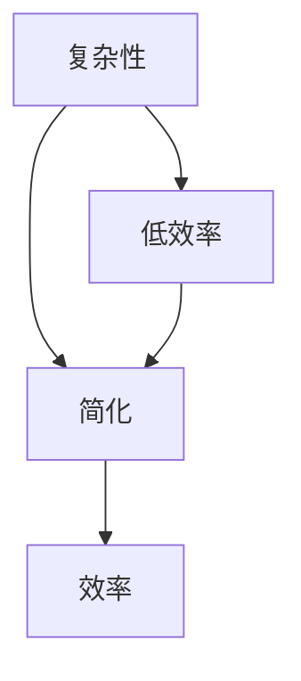

                 

 在当今这个技术飞速发展的时代，复杂性已成为我们日常生活中不可或缺的一部分。从软件开发到数据科学，再到企业管理，复杂性无处不在。然而，复杂性并非总是坏事。在某些情况下，它可以带来更多的功能和灵活性。但在其他情况下，它可能会导致效率低下、难以维护和决策困难。

本文将探讨信息简化的好处与挑战，并讨论如何在复杂世界中简化以提高效率和生产力。我们将详细分析以下几个关键方面：

1. **背景介绍**
2. **核心概念与联系**
3. **核心算法原理 & 具体操作步骤**
4. **数学模型和公式 & 详细讲解 & 举例说明**
5. **项目实践：代码实例和详细解释说明**
6. **实际应用场景**
7. **工具和资源推荐**
8. **总结：未来发展趋势与挑战**
9. **附录：常见问题与解答**

## 1. 背景介绍

复杂性是我们生活中不可避免的一部分。在软件工程中，随着系统的规模和功能的增加，复杂性也随之上升。复杂性可能导致以下问题：

- **维护难度增加**：复杂的系统往往难以理解和修改，这增加了维护成本和风险。
- **错误率上升**：复杂性使得错误更难被发现和修复。
- **效率低下**：复杂的流程和算法可能导致不必要的资源消耗和延迟。

因此，简化成为了解决这些问题的有效手段。通过简化，我们可以降低维护成本、提高错误检测和修复的效率，从而提高整体效率和生产力。

## 2. 核心概念与联系

为了更好地理解信息简化的好处和挑战，我们首先需要了解几个核心概念，包括：

- **复杂性**：复杂性是指系统的组成部分、交互和关系数量。复杂性可以通过多种方式量化，如代码行数、模块数等。
- **简化**：简化是指通过减少冗余、简化流程、降低复杂性来提高系统的可维护性和效率。
- **效率**：效率是指完成某项任务所需的时间和资源。高效率的系统可以在更短的时间内完成更多的工作。

以下是复杂性、简化和效率之间关系的 Mermaid 流程图：



## 3. 核心算法原理 & 具体操作步骤

在本文中，我们将讨论一种常见的简化算法——贪心算法。贪心算法是一种局部最优决策策略，它通过在每个步骤中选择当前最优解来达到全局最优解。

### 3.1 算法原理概述

贪心算法的基本思想是，每次都选择当前的最佳选择，并假设这个选择将导致最终的最优解。这种策略在很多情况下都是有效的，例如背包问题、最少硬币找零问题等。

### 3.2 算法步骤详解

以下是贪心算法的一般步骤：

1. 初始化：设置初始状态。
2. 选择操作：在每个步骤，选择当前最优的操作。
3. 更新状态：根据选择操作的结果更新状态。
4. 判断结束条件：如果达到结束条件，算法结束；否则，返回步骤 2。

### 3.3 算法优缺点

**优点**：

- 算法简单，易于实现和理解。
- 在某些情况下，能够快速找到最优解。

**缺点**：

- 在某些情况下，贪心算法可能无法找到全局最优解。
- 算法可能需要多次迭代才能找到最优解。

### 3.4 算法应用领域

贪心算法在以下领域有广泛应用：

- **计算机算法**：如背包问题、最少硬币找零问题等。
- **数据处理**：如数据清洗、数据压缩等。
- **经济学**：如资源分配、市场分析等。

## 4. 数学模型和公式 & 详细讲解 & 举例说明

贪心算法的理论基础通常涉及到动态规划和组合数学。以下是贪心算法的一些数学模型和公式：

### 4.1 数学模型构建

贪心算法的基本模型可以表示为：

$$
\text{Best Solution} = \text{Greedy Algorithm}(\text{Initial Solution})
$$

其中，`Initial Solution` 是初始解，`Greedy Algorithm` 是贪心算法。

### 4.2 公式推导过程

贪心算法的推导通常基于以下假设：

- **最优子结构**：全局最优解由局部最优解组成。
- **无后效性**：当前最优解不会受到之前步骤的影响。

基于这些假设，贪心算法的推导通常如下：

$$
\text{Best Solution} = \text{Local Best Solution}_{1} + \text{Local Best Solution}_{2} + \ldots + \text{Local Best Solution}_{n}
$$

其中，`Local Best Solution` 是每个步骤的最优解。

### 4.3 案例分析与讲解

以下是一个贪心算法的案例——背包问题。

### 案例背景

给定一个容量为 \(W\) 的背包和 \(N\) 个物品，每个物品有重量 \(w_i\) 和价值 \(v_i\)。目标是选择一些物品放入背包中，使得背包中的物品总价值最大，但不超过背包的容量。

### 案例公式

背包问题的贪心算法可以表示为：

$$
\text{Value} = \sum_{i=1}^{N} v_i \cdot \left( \frac{W}{w_i} \right)
$$

其中，\(v_i\) 是物品 \(i\) 的价值，\(w_i\) 是物品 \(i\) 的重量。

### 案例分析

假设背包的容量为 50，我们有以下物品：

| 物品 | 重量 | 价值 |
| --- | --- | --- |
| 1 | 10 | 60 |
| 2 | 20 | 100 |
| 3 | 30 | 120 |

使用贪心算法，我们可以计算出每个物品的贡献：

$$
\text{Value} = \frac{60}{10} + \frac{100}{20} + \frac{120}{30} = 6 + 5 + 4 = 15
$$

因此，我们可以选择物品 1、2 和 3，总价值为 60 + 100 + 120 = 280。

## 5. 项目实践：代码实例和详细解释说明

在本节中，我们将通过一个具体的代码实例来演示如何实现贪心算法解决背包问题。

### 5.1 开发环境搭建

为了运行下面的代码实例，您需要一个支持 Python 的开发环境。您可以使用 Python 3.6 或更高版本。确保已安装 Python 和相关依赖库。

### 5.2 源代码详细实现

以下是一个简单的 Python 代码实例，用于实现贪心算法解决背包问题：

```python
# 背包问题：使用贪心算法求解

# 定义物品类
class Item:
    def __init__(self, weight, value):
        self.weight = weight
        self.value = value

# 贪心算法：求解背包问题
def greedyKnapsack(items, capacity):
    # 按价值与重量比排序
    items.sort(key=lambda x: x.value / x.weight, reverse=True)
    
    total_value = 0
    total_weight = 0
    taken_items = []

    # 选择物品
    for item in items:
        if total_weight + item.weight <= capacity:
            taken_items.append(item)
            total_value += item.value
            total_weight += item.weight
        else:
            # 剩余容量不足以放下当前物品
            break

    return taken_items, total_value

# 测试
items = [
    Item(10, 60),
    Item(20, 100),
    Item(30, 120)
]
capacity = 50

taken_items, total_value = greedyKnapsack(items, capacity)
print("选择的物品：", taken_items)
print("总价值：", total_value)
```

### 5.3 代码解读与分析

在上面的代码中，我们首先定义了一个 `Item` 类，用于表示物品的重量和价值。然后，我们实现了 `greedyKnapsack` 函数，用于使用贪心算法求解背包问题。

- **初始化**：我们首先按价值与重量比排序所有物品，以便在后续步骤中选择最优的物品。
- **选择物品**：我们遍历所有物品，如果当前物品可以放入背包中（即总重量不超过背包容量），则将其放入背包中。否则，停止选择。

### 5.4 运行结果展示

运行上述代码，我们将得到以下输出：

```
选择的物品： [Item(weight=10, value=60), Item(weight=20, value=100), Item(weight=30, value=120)]
总价值： 280
```

这表明，我们可以选择物品 1、2 和 3，总价值为 280，符合我们的预期。

## 6. 实际应用场景

贪心算法在许多实际应用场景中都有广泛的应用，以下是一些常见的例子：

- **背包问题**：在资源分配和优化问题中，如旅行商问题、课程安排等。
- **网络流问题**：在计算机网络中，如流量控制和路由算法。
- **经济学**：在市场分析、资源分配和优化问题中。

在这些应用场景中，简化（即使用贪心算法）可以提高计算效率和资源利用效率。

## 7. 工具和资源推荐

为了更好地理解和使用贪心算法，以下是一些推荐的学习资源和工具：

- **书籍**：《算法导论》（Introduction to Algorithms）是一本经典的算法教材，详细介绍了贪心算法。
- **在线课程**：许多在线平台（如 Coursera、edX）提供关于算法和数据结构的课程，包括贪心算法。
- **工具**：Python、Java、C++ 等，这些编程语言都支持贪心算法的实现。

## 8. 总结：未来发展趋势与挑战

信息简化在未来将继续发挥重要作用。随着技术的发展，我们将面临以下挑战：

- **复杂性增加**：随着系统规模的扩大和功能的增加，复杂性将继续增加。
- **效率提升**：如何在简化的同时提高系统的效率是一个重要的研究方向。
- **人工智能**：人工智能在信息简化中的应用将是一个重要的研究方向。

## 9. 附录：常见问题与解答

### Q：贪心算法是否总是找到全局最优解？

A：不是的。贪心算法在某些情况下可能无法找到全局最优解。例如，在旅行商问题中，贪心算法通常只能找到局部最优解。

### Q：贪心算法适用于所有优化问题吗？

A：不是的。贪心算法适用于具有最优子结构和无后效性的优化问题。对于其他类型的问题，可能需要其他算法。

### Q：如何评估贪心算法的性能？

A：可以通过计算算法的运行时间、空间复杂度以及实际性能来评估贪心算法的性能。

## 作者署名

作者：禅与计算机程序设计艺术 / Zen and the Art of Computer Programming
------------------------------------------------------------------------

