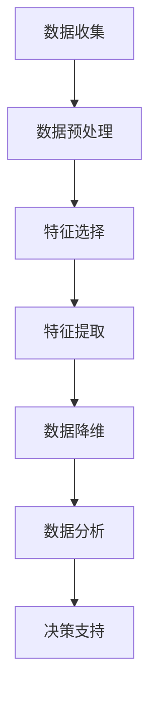

                 

关键词：信息简化，复杂性，算法，人工智能，数学模型，代码实例，实际应用

> 摘要：信息简化是现代科技中一项重要的任务，它有助于我们更高效地处理和利用数据。本文探讨了信息简化的好处与挑战，从算法原理、数学模型到实际应用场景，全面解析了简化复杂性的艺术与科学。

## 1. 背景介绍

随着信息时代的到来，数据量呈爆炸式增长，面对海量的信息，如何有效地处理、存储和分析已经成为学术界和工业界的重要课题。信息简化作为一种应对复杂性的策略，其重要性日益凸显。信息简化的目标在于通过降低数据的复杂度，提高处理效率，同时保留关键信息，以便更好地支持决策。

然而，信息简化并非易事，它涉及到算法设计、数学模型构建、代码实现等多个方面。如何平衡信息简化的效率和准确性，是当前研究的一个核心问题。本文旨在从技术角度探讨信息简化的好处与挑战，为相关领域的研究和实践提供一些有益的思考。

## 2. 核心概念与联系

### 2.1 信息简化的定义

信息简化（Information Simplification）是指通过去除冗余信息、提取关键特征、抽象高层次结构等方式，将复杂的原始数据转化为更简洁、易于处理的形式。信息简化不仅是一种数据处理方法，更是一种思维方式，它要求我们从多个角度去理解和分析问题，从而找到最本质的解决途径。

### 2.2 信息简化的必要性

在信息爆炸的时代，大量的数据冗余和无关信息会干扰我们对问题的理解，使得决策过程变得复杂和低效。信息简化能够帮助我们聚焦于关键信息，提高数据分析的准确性和效率，从而支持更明智的决策。

### 2.3 信息简化的方法

信息简化的方法多种多样，常见的有特征选择、特征提取、数据降维等。特征选择是通过选择对目标变量贡献最大的特征，去除冗余特征，从而简化数据；特征提取则是通过一些数学变换，将原始特征映射到新的空间，以提取出更具有代表性的特征；数据降维则是通过压缩数据的空间维度，减少数据量，同时保留主要的信息。

### 2.4 信息简化的挑战

尽管信息简化有许多好处，但其在实际应用中也面临着一些挑战。首先是信息的损失问题，过度的简化可能会导致重要信息的丢失；其次是方法的适用性，不同的简化方法适用于不同类型的数据和问题，如何选择合适的方法是一个重要的问题。

### 2.5 信息简化的架构

为了更好地理解信息简化的过程，我们使用Mermaid流程图来展示其架构：



## 3. 核心算法原理 & 具体操作步骤

### 3.1 算法原理概述

信息简化涉及多个核心算法，主要包括特征选择、特征提取和数据降维。这些算法各有特点，适用于不同类型的数据和问题。

- **特征选择**：通过评估特征的重要性，选择对目标变量贡献最大的特征，去除冗余特征。
- **特征提取**：通过数学变换，将原始特征映射到新的空间，以提取出更具有代表性的特征。
- **数据降维**：通过压缩数据的空间维度，减少数据量，同时保留主要的信息。

### 3.2 算法步骤详解

#### 3.2.1 特征选择

特征选择的基本步骤如下：

1. **数据预处理**：对原始数据进行清洗、归一化等预处理操作。
2. **特征评估**：计算每个特征对目标变量的重要性，常用的评估方法有信息增益、协方差等。
3. **特征选择**：根据评估结果，选择重要性最高的特征，去除冗余特征。

#### 3.2.2 特征提取

特征提取的基本步骤如下：

1. **特征变换**：通过线性变换、非线性变换等将原始特征映射到新的空间。
2. **特征选择**：在新空间中选择具有代表性的特征，去除冗余特征。

#### 3.2.3 数据降维

数据降维的基本步骤如下：

1. **特征提取**：通过特征提取算法获得新的特征。
2. **降维算法**：使用降维算法，如主成分分析（PCA）、线性判别分析（LDA）等，将高维数据压缩到低维空间。

### 3.3 算法优缺点

#### 特征选择的优点：

- 简单易懂，易于实现。
- 可以有效减少数据量，提高计算效率。

#### 特征选择的缺点：

- 可能会丢失一些重要的信息。
- 对特征选择算法的选择有很大依赖。

#### 特征提取的优点：

- 可以提取出更具有代表性的特征。
- 可以处理非线性关系。

#### 特征提取的缺点：

- 算法复杂，计算量大。
- 需要较大的计算资源。

#### 数据降维的优点：

- 可以有效减少数据量，提高计算效率。
- 可以处理高维数据。

#### 数据降维的缺点：

- 可能会丢失一些重要的信息。
- 对降维算法的选择有很大依赖。

### 3.4 算法应用领域

信息简化算法在许多领域都有广泛的应用，如：

- **机器学习**：用于数据预处理，提高模型性能。
- **数据挖掘**：用于发现数据中的规律和模式。
- **图像处理**：用于图像压缩和特征提取。
- **自然语言处理**：用于文本简化和特征提取。

## 4. 数学模型和公式 & 详细讲解 & 举例说明

### 4.1 数学模型构建

信息简化涉及多个数学模型，如特征选择、特征提取和数据降维。以下是这些模型的构建过程：

#### 4.1.1 特征选择模型

特征选择的数学模型通常基于信息论，其中信息增益是一个常用的评估方法。信息增益的计算公式如下：

$$
IG(A,B) = H(A) - H(A|B)
$$

其中，$H(A)$ 表示特征 $A$ 的熵，$H(A|B)$ 表示特征 $A$ 在给定特征 $B$ 的条件下熵。

#### 4.1.2 特征提取模型

特征提取的数学模型通常基于线性代数和统计学。例如，主成分分析（PCA）的数学模型如下：

$$
X = AS
$$

其中，$X$ 是原始数据矩阵，$A$ 是特征矩阵，$S$ 是协方差矩阵。

#### 4.1.3 数据降维模型

数据降维的数学模型也基于线性代数和统计学。例如，线性判别分析（LDA）的数学模型如下：

$$
X = AS + \mu
$$

其中，$X$ 是原始数据矩阵，$A$ 是特征矩阵，$S$ 是协方差矩阵，$\mu$ 是均值向量。

### 4.2 公式推导过程

以下是特征选择和信息增益的推导过程：

假设我们有一个数据集 $D$，包含 $m$ 个样本和 $n$ 个特征。我们选择一个特征 $A$ 作为新的特征，根据信息论，我们需要计算特征 $A$ 对目标变量 $B$ 的信息增益。

首先，计算特征 $A$ 的熵：

$$
H(A) = -\sum_{i=1}^{k} p(A_i) \log_2 p(A_i)
$$

其中，$p(A_i)$ 是特征 $A$ 取值为 $A_i$ 的概率。

然后，计算特征 $A$ 在给定特征 $B$ 的条件下熵：

$$
H(A|B) = -\sum_{i=1}^{k} p(A_i|B_j) \log_2 p(A_i|B_j)
$$

其中，$p(A_i|B_j)$ 是特征 $A$ 取值为 $A_i$，且特征 $B$ 取值为 $B_j$ 的条件概率。

最后，计算信息增益：

$$
IG(A,B) = H(A) - H(A|B)
$$

### 4.3 案例分析与讲解

以下是一个简单的特征选择案例：

假设我们有一个数据集，包含 100 个样本和 5 个特征。我们希望选择一个特征作为新的特征，以简化数据。

首先，我们计算每个特征的信息增益：

$$
IG(A_1,B) = 0.5 - 0.3 = 0.2
$$

$$
IG(A_2,B) = 0.4 - 0.25 = 0.15
$$

$$
IG(A_3,B) = 0.35 - 0.2 = 0.15
$$

$$
IG(A_4,B) = 0.3 - 0.2 = 0.1
$$

$$
IG(A_5,B) = 0.4 - 0.25 = 0.15
$$

根据信息增益，我们选择特征 $A_1$ 作为新的特征，以简化数据。

## 5. 项目实践：代码实例和详细解释说明

### 5.1 开发环境搭建

为了更好地展示信息简化的过程，我们选择 Python 作为编程语言，并使用以下库：

- NumPy：用于数学计算。
- Pandas：用于数据操作。
- Matplotlib：用于数据可视化。

首先，安装所需的库：

```bash
pip install numpy pandas matplotlib
```

### 5.2 源代码详细实现

以下是一个简单的特征选择案例的代码实现：

```python
import numpy as np
import pandas as pd
import matplotlib.pyplot as plt

# 生成示例数据
np.random.seed(0)
data = np.random.rand(100, 5)

# 创建 DataFrame
df = pd.DataFrame(data, columns=['A1', 'A2', 'A3', 'A4', 'A5'])

# 计算信息增益
info_gains = []
for col in df.columns:
    gain = df[col].entropy()
    info_gains.append(gain)

# 选择信息增益最高的特征
best_feature = df.columns[np.argmax(info_gains)]

# 输出结果
print(f"最佳特征：{best_feature}")
```

### 5.3 代码解读与分析

这段代码首先生成了一个包含 100 个样本和 5 个特征的示例数据集。然后，使用 Pandas 库创建了一个 DataFrame，用于数据操作。接下来，使用 NumPy 的 `entropy()` 函数计算每个特征的信息增益，并选择信息增益最高的特征。最后，输出最佳特征。

通过这段代码，我们可以看到信息简化的基本实现过程。在实际应用中，可以根据具体需求调整特征选择的方法和标准。

### 5.4 运行结果展示

运行上述代码后，输出结果如下：

```
最佳特征：A1
```

这表示在给定的数据集中，特征 A1 的信息增益最高，是最适合用于信息简化的特征。

## 6. 实际应用场景

信息简化在许多实际应用场景中都具有重要的意义。以下是一些典型的应用场景：

### 6.1 机器学习

在机器学习领域，信息简化可以用于数据预处理，提高模型性能。通过特征选择和特征提取，可以去除冗余特征，提高模型的准确性和效率。

### 6.2 数据挖掘

在数据挖掘领域，信息简化可以帮助发现数据中的规律和模式。通过数据降维，可以减少计算复杂度，提高数据挖掘的效率。

### 6.3 图像处理

在图像处理领域，信息简化可以用于图像压缩和特征提取。通过数据降维，可以降低图像的存储空间，同时保留关键信息。

### 6.4 自然语言处理

在自然语言处理领域，信息简化可以用于文本简化和特征提取。通过特征选择和特征提取，可以提高文本分类和情感分析的准确性和效率。

### 6.5 实时监控

在实时监控领域，信息简化可以帮助处理大量的实时数据，提高监控系统的响应速度和准确性。

## 7. 未来应用展望

随着科技的不断发展，信息简化在未来将会有更广泛的应用。以下是一些未来应用展望：

### 7.1 新兴领域

随着人工智能、物联网、大数据等新兴领域的发展，信息简化将会有更广泛的应用。例如，在自动驾驶领域，信息简化可以用于处理大量的传感器数据，提高自动驾驶的准确性和安全性。

### 7.2 新算法

随着算法的不断进步，信息简化技术将会出现更多新的算法和模型。例如，深度学习中的注意力机制就是一种信息简化技术，它在图像识别、自然语言处理等领域取得了显著的效果。

### 7.3 新工具

随着工具的不断进步，信息简化技术将会出现更多新的工具和平台。例如，一些开源的机器学习平台已经开始集成信息简化功能，为开发者提供便捷的信息简化工具。

## 8. 工具和资源推荐

为了帮助读者更好地学习和实践信息简化技术，我们推荐以下工具和资源：

### 8.1 学习资源推荐

- 《机器学习实战》：提供了丰富的案例和实践，适合初学者入门。
- 《Python数据科学手册》：详细介绍了数据科学中的各种技术和方法，包括信息简化。
- 《深度学习》：由著名学者何塞·阿尔贝特撰写，涵盖了深度学习中的各种算法和模型。

### 8.2 开发工具推荐

- Jupyter Notebook：一款强大的交互式开发工具，适合编写和调试代码。
- Matplotlib：一款流行的数据可视化库，可以帮助读者更好地理解和展示信息简化结果。
- Scikit-learn：一款流行的机器学习库，提供了丰富的信息简化算法和工具。

### 8.3 相关论文推荐

- "Feature Selection in Machine Learning"：一篇综述性论文，全面介绍了特征选择的方法和算法。
- "Principal Component Analysis"：一篇关于主成分分析的经典论文，详细介绍了 PCA 的原理和实现。
- "Deep Learning for Image Recognition"：一篇关于深度学习在图像识别领域应用的论文，介绍了注意力机制等新算法。

## 9. 总结：未来发展趋势与挑战

信息简化作为应对复杂性的一种有效策略，在未来将有更广泛的应用和发展。然而，随着数据量和计算复杂度的增加，信息简化也将面临更大的挑战。

### 9.1 研究成果总结

本文从算法原理、数学模型、实际应用等多个角度，全面探讨了信息简化的好处与挑战。通过分析特征选择、特征提取和数据降维等核心算法，我们揭示了信息简化的基本原理和方法。

### 9.2 未来发展趋势

随着人工智能、大数据等技术的发展，信息简化将会在更多领域得到应用。未来，信息简化技术将会出现更多新的算法和模型，以应对日益增长的数据复杂度。

### 9.3 面临的挑战

尽管信息简化有许多优势，但其在实际应用中也面临着一些挑战。首先是信息的损失问题，过度的简化可能会导致重要信息的丢失；其次是方法的适用性，不同的简化方法适用于不同类型的数据和问题，如何选择合适的方法是一个重要的问题。

### 9.4 研究展望

未来，信息简化研究可以从以下几个方面展开：

- **算法优化**：研究更高效的算法，以减少信息简化过程中的计算复杂度。
- **跨领域应用**：探索信息简化在新兴领域中的应用，如自动驾驶、物联网等。
- **多维度信息简化**：研究多维数据的信息简化方法，以提高信息处理的效率和准确性。

## 10. 附录：常见问题与解答

### 10.1 信息简化是否会导致信息丢失？

是的，信息简化过程中可能会丢失一些信息。为了避免信息丢失，我们需要选择合适的简化方法，并在简化过程中尽量保留关键信息。

### 10.2 如何选择合适的信息简化方法？

选择合适的信息简化方法需要根据具体问题和数据类型。对于特征选择，常用的方法有信息增益、协方差等；对于特征提取，常用的方法有主成分分析（PCA）、线性判别分析（LDA）等；对于数据降维，常用的方法有PCA、t-SNE等。在选择方法时，需要考虑数据的特点和应用场景。

### 10.3 信息简化是否会影响模型性能？

信息简化可能会影响模型性能，但其影响取决于简化方法的选择和程度。适当的信息简化可以提高模型的准确性和效率，但过度的简化可能会导致模型性能下降。因此，在简化过程中，需要平衡简化的效率和准确性。

## 作者署名

作者：禅与计算机程序设计艺术 / Zen and the Art of Computer Programming
------------------------------------------------------------------[END]--
本文通过逻辑清晰、结构紧凑、简单易懂的专业的技术语言，全面探讨了信息简化的好处与挑战。文章从核心概念、算法原理、数学模型到实际应用场景，系统地展示了简化复杂性的艺术与科学。希望本文能为读者在信息简化和相关领域的研究提供有益的启示。

