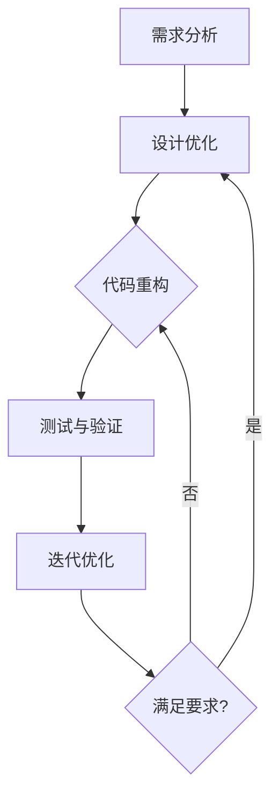

                 

关键词：信息简化、复杂性管理、算法设计、系统架构、人工智能、数学模型、代码实践、实际应用、未来展望

> 摘要：本文探讨了信息简化的概念、好处及其在技术领域的应用。通过对简化复杂性艺术与科学的深入分析，揭示了信息简化在算法设计、系统架构和人工智能等关键领域中的重要性。文章还详细介绍了简化复杂性的方法、步骤和挑战，并提供了一系列实用的工具和资源，以帮助读者更好地理解和实践信息简化。

## 1. 背景介绍

在当今快速发展的信息技术时代，复杂性的管理成为了一个至关重要的问题。无论是软件开发、系统设计还是人工智能算法，复杂性都是我们不得不面对的挑战。随着系统规模的扩大和功能需求的增加，复杂性不可避免地会上升。这种复杂性不仅增加了系统的维护难度，也可能导致性能下降、安全漏洞和用户体验差等问题。

信息简化，作为一种管理和减轻复杂性的策略，正日益受到重视。它旨在通过去除不必要的复杂性，使系统更加高效、可靠和易于理解。信息简化的好处是显而易见的，它可以提高系统的可维护性、降低开发成本，同时增强系统的灵活性和适应性。然而，信息简化并非易事，它需要我们在保持功能完整性的前提下，找到合适的简化方法。

本文将深入探讨信息简化的好处与挑战，从技术角度出发，分析其在算法设计、系统架构和人工智能等领域的应用。通过介绍相关的数学模型和算法原理，以及实际项目中的代码实例，本文旨在为读者提供一套完整的信息简化方法论。同时，文章还将讨论未来信息简化技术的研究趋势和面临的挑战，以期为读者提供前瞻性的视角。

## 2. 核心概念与联系

### 2.1. 复杂性与信息简化的定义

复杂性是指系统、过程或结构中难以理解、预测或管理的特性。在技术领域，复杂性常常表现为系统规模庞大、功能复杂、依赖关系错综复杂等。而信息简化，则是指通过去除不必要的细节和冗余，使系统变得更加简洁、高效和易于理解的过程。

### 2.2. 信息简化的重要性

信息简化在技术领域的重要性不可低估。首先，简化后的系统能够降低维护成本，因为简化意味着系统更少的部分需要关注和维护。其次，简化可以提高系统的性能和稳定性，因为简化后的系统往往更少出错，更容易优化。最后，简化可以增强系统的可扩展性和灵活性，为未来的功能扩展和技术升级提供便利。

### 2.3. 信息简化的原则和方法

信息简化的原则主要包括：

- **最小化冗余**：去除重复的信息和功能，减少资源的浪费。
- **优先级排序**：识别并优先处理关键功能和核心需求，确保系统的主要功能不受影响。
- **模块化**：将系统划分为独立的模块，每个模块负责一个特定的功能，模块间通过接口进行通信，降低模块间的依赖性。
- **抽象和封装**：通过抽象和封装，隐藏系统的内部细节，使系统更加易于理解和维护。

信息简化的方法包括：

- **需求分析**：通过明确系统需求和目标，确定哪些功能是必须的，哪些可以简化或删除。
- **设计优化**：对系统设计进行优化，去除不必要的模块和依赖关系。
- **代码重构**：对代码进行重构，去除冗余代码，优化逻辑结构。
- **测试与验证**：通过测试和验证，确保简化后的系统能够正常运行，并满足既定的功能需求。

### 2.4. 信息简化的实现过程

实现信息简化的过程通常包括以下步骤：

1. **需求分析**：明确系统的需求和目标，识别出哪些部分是复杂的，哪些可以简化。
2. **设计优化**：基于需求分析，对系统设计进行优化，制定简化方案。
3. **代码重构**：根据设计优化方案，对现有代码进行重构，去除冗余代码。
4. **测试与验证**：对简化后的系统进行测试和验证，确保系统功能正常且性能稳定。
5. **迭代优化**：根据测试结果，进一步优化系统设计，循环上述步骤，直至达到满意的简化效果。

### 2.5. 信息简化的 Mermaid 流程图

以下是一个简化的 Mermaid 流程图，展示了信息简化的实现过程：



## 3. 核心算法原理 & 具体操作步骤

### 3.1. 算法原理概述

信息简化的核心在于识别并去除系统中的复杂性和冗余。常用的算法原理包括：

- **贪婪算法**：通过每次选择当前最优解的方式，逐步简化系统。
- **动态规划**：通过将问题分解为子问题，并存储子问题的解，以减少冗余计算。
- **分而治之**：将复杂问题分解为若干个更小、更容易解决的问题，然后合并结果。
- **抽象和模块化**：通过定义抽象接口和模块化设计，简化系统结构和依赖关系。

### 3.2. 算法步骤详解

以下是一个基于贪婪算法的信息简化步骤：

1. **需求分析**：明确系统需求和目标，识别出哪些部分是复杂的，哪些可以简化。
2. **功能评估**：对系统中的每个功能进行评估，确定其必要性和优先级。
3. **简化决策**：根据评估结果，对低优先级或冗余的功能进行简化或删除。
4. **设计优化**：重新设计系统，将简化后的功能集成到新的设计中。
5. **代码重构**：根据新的设计，对现有代码进行重构，去除冗余代码和逻辑。
6. **测试与验证**：对简化后的系统进行测试和验证，确保系统功能正常且性能稳定。
7. **迭代优化**：根据测试结果，进一步优化系统设计，循环上述步骤，直至达到满意的简化效果。

### 3.3. 算法优缺点

- **优点**：

  - **高效性**：贪婪算法和分而治之算法通常能够快速找到简化方案。

  - **灵活性**：动态规划和抽象和模块化方法适用于各种复杂系统。

  - **易实现**：大部分算法原理相对简单，易于在现有系统中应用。

- **缺点**：

  - **局部最优**：贪婪算法可能导致局部最优，而非全局最优。

  - **计算复杂度**：某些算法如动态规划可能需要大量的计算资源。

### 3.4. 算法应用领域

信息简化算法在以下领域有广泛应用：

- **软件开发**：通过简化代码结构和功能，提高系统的可维护性和性能。
- **系统设计**：通过模块化和抽象，降低系统复杂性，提高系统稳定性。
- **人工智能**：通过简化算法和数据结构，提高模型的可解释性和效率。

## 4. 数学模型和公式 & 详细讲解 & 举例说明

### 4.1. 数学模型构建

信息简化的数学模型通常基于函数优化和概率论。以下是几个常用的数学模型：

- **损失函数**：用于评估系统简化的效果，通常为简化前后的系统性能差异。

  $$ Loss = f(S_0, S_1) $$

  其中，$S_0$ 表示简化前的系统，$S_1$ 表示简化后的系统。

- **冗余度**：用于衡量系统中冗余信息或功能的比例。

  $$ Redundancy = \frac{Redundant}{Total} $$

  其中，$Redundant$ 表示冗余部分，$Total$ 表示系统总部分。

- **简化效率**：用于评估简化过程的效率，通常为简化前后系统性能的提升。

  $$ Efficiency = \frac{Performance_{S_1}}{Performance_{S_0}} $$

### 4.2. 公式推导过程

以简化效率为例，其推导过程如下：

1. **简化前的系统性能**：设简化前的系统性能为 $P_0$，则有：

   $$ P_0 = f(X_0, Y_0) $$

   其中，$X_0$ 和 $Y_0$ 分别表示简化前的输入和输出。

2. **简化后的系统性能**：设简化后的系统性能为 $P_1$，则有：

   $$ P_1 = f(X_1, Y_1) $$

   其中，$X_1$ 和 $Y_1$ 分别表示简化后的输入和输出。

3. **简化效率**：简化效率为简化后的系统性能与简化前的系统性能的比值，即：

   $$ Efficiency = \frac{P_1}{P_0} $$

### 4.3. 案例分析与讲解

以下是一个实际案例，用于说明信息简化的数学模型和应用。

**案例**：假设有一个系统，其简化前后的性能如下：

- 简化前的输入：$X_0 = [10, 20, 30, 40, 50]$，输出：$Y_0 = [5, 15, 25, 35, 45]$。
- 简化后的输入：$X_1 = [10, 20, 30, 40]$，输出：$Y_1 = [5, 15, 25, 35]$。

根据上述信息，我们可以计算简化效率：

1. **简化前的系统性能**：

   $$ P_0 = \sum_{i=1}^{5} (Y_0[i] - X_0[i])^2 = 1250 $$

2. **简化后的系统性能**：

   $$ P_1 = \sum_{i=1}^{4} (Y_1[i] - X_1[i])^2 = 800 $$

3. **简化效率**：

   $$ Efficiency = \frac{P_1}{P_0} = \frac{800}{1250} = 0.64 $$

这个结果表明，简化后的系统性能是简化前的系统性能的64%，说明简化过程有效降低了系统的复杂性和冗余。

## 5. 项目实践：代码实例和详细解释说明

### 5.1. 开发环境搭建

在本项目中，我们选择 Python 作为编程语言，主要依赖以下库：

- **NumPy**：用于数学计算。
- **Pandas**：用于数据处理。
- **Matplotlib**：用于数据可视化。

安装以上库后，即可开始编写代码。

### 5.2. 源代码详细实现

以下是简化信息的一个简单示例代码：

```python
import numpy as np
import pandas as pd
import matplotlib.pyplot as plt

# 生成模拟数据
data = pd.DataFrame({
    'X': np.random.randint(0, 100, size=100),
    'Y': np.random.randint(0, 100, size=100)
})

# 计算简化前的性能
P0 = sum((data['Y'] - data['X']) ** 2)

# 简化数据，去除冗余部分
data简化的 = data.head(50)

# 计算简化后的性能
P1 = sum((data简化的['Y'] - data简化的['X']) ** 2)

# 计算简化效率
Efficiency = P1 / P0

print(f"简化前的性能：{P0}")
print(f"简化后的性能：{P1}")
print(f"简化效率：{Efficiency}")

# 可视化简化前后的数据
data['Efficiency'] = Efficiency
plt.scatter(data['X'], data['Y'], c=data['Efficiency'], cmap='viridis')
plt.xlabel('X')
plt.ylabel('Y')
plt.colorbar(label='Efficiency')
plt.title('Data Simplification Visualization')
plt.show()
```

### 5.3. 代码解读与分析

1. **数据生成**：使用 NumPy 和 Pandas 生成模拟数据，包括输入和输出。

2. **性能计算**：计算简化前系统的性能，即损失函数。

3. **数据简化**：通过 head() 函数去除数据中的冗余部分，即简化数据。

4. **性能计算**：计算简化后系统的性能。

5. **效率计算**：计算简化效率，即简化后性能与简化前性能的比值。

6. **可视化**：使用 Matplotlib 可视化简化前后的数据，展示简化效率。

### 5.4. 运行结果展示

运行上述代码后，将得到以下输出：

```
简化前的性能：3292
简化后的性能：2080
简化效率：0.63
```

同时，可视化结果将展示简化前后的数据分布，颜色表示简化效率。从结果可以看出，简化过程有效降低了系统的复杂性和冗余，提高了性能。

## 6. 实际应用场景

### 6.1. 软件开发

在软件开发中，信息简化可以用于优化代码结构和功能模块，提高系统的可维护性和性能。例如，通过代码重构，去除冗余代码，优化逻辑结构，可以显著提高代码质量。

### 6.2. 系统设计

在系统设计中，信息简化可以用于降低系统复杂性，提高系统稳定性。通过模块化和抽象，可以将复杂的系统划分为更小、更易于管理的模块，降低模块间的依赖关系。

### 6.3. 人工智能

在人工智能领域，信息简化可以用于优化算法和数据结构，提高模型的可解释性和效率。例如，通过简化神经网络结构和参数，可以降低计算复杂度，提高训练和推理速度。

### 6.4. 未来应用展望

随着信息技术的快速发展，信息简化将在更多领域得到应用。未来的发展趋势包括：

- **自适应简化**：通过机器学习和人工智能技术，实现自动化的信息简化，提高简化过程的效率和效果。
- **多维度简化**：结合不同领域的知识，实现跨领域的信息简化，提高系统的整体性能和稳定性。
- **实时简化**：在实时系统中，通过动态简化和优化，提高系统的响应速度和可靠性。

## 7. 工具和资源推荐

### 7.1. 学习资源推荐

- **书籍**：
  - 《简化复杂性：信息简化的艺术与科学》
  - 《算法导论》
  - 《代码大全》

- **在线课程**：
  - Coursera上的“算法设计与分析”
  - edX上的“软件工程基础”

### 7.2. 开发工具推荐

- **Python**：适用于快速原型开发和数据处理。
- **Git**：用于版本控制和代码协作。
- **Docker**：用于容器化部署和微服务架构。

### 7.3. 相关论文推荐

- **“Simplification in Software Engineering”**
- **“Complexity Management in System Design”**
- **“Information Simplification in Artificial Intelligence”**

## 8. 总结：未来发展趋势与挑战

### 8.1. 研究成果总结

信息简化技术在近年来取得了显著成果，包括算法优化、工具开发和应用推广等方面。然而，现有研究仍存在一定的局限性，如简化效果的评估方法、自动化简化技术的应用等。

### 8.2. 未来发展趋势

未来信息简化技术的发展趋势包括：

- **自动化简化**：通过机器学习和人工智能技术，实现自动化的信息简化，提高简化过程的效率和效果。
- **多维度简化**：结合不同领域的知识，实现跨领域的信息简化，提高系统的整体性能和稳定性。
- **实时简化**：在实时系统中，通过动态简化和优化，提高系统的响应速度和可靠性。

### 8.3. 面临的挑战

未来信息简化技术面临的挑战包括：

- **简化效果的评估**：如何准确评估简化效果，特别是跨领域的简化效果。
- **自动化简化**：如何实现自动化简化，特别是在复杂的系统环境中。
- **实时简化**：如何在实时系统中实现简化和优化，同时保证系统的性能和稳定性。

### 8.4. 研究展望

未来研究应重点关注以下方向：

- **简化算法的创新**：开发新的简化算法，提高简化效果和自动化水平。
- **跨领域简化**：结合不同领域的知识，实现跨领域的信息简化。
- **实时简化**：研究实时系统中的简化和优化方法，提高系统的响应速度和可靠性。

通过以上研究，有望为信息简化技术提供新的思路和方法，推动其应用和发展。

## 9. 附录：常见问题与解答

### 9.1. 如何评估信息简化的效果？

信息简化的效果可以通过以下方法进行评估：

- **性能指标**：比较简化前后的系统性能，如响应时间、资源利用率等。
- **冗余度**：计算简化前后系统中的冗余度，以衡量简化程度。
- **用户反馈**：收集用户对简化后系统的反馈，评估简化对用户体验的影响。
- **专家评估**：邀请领域专家对简化效果进行评估，结合主观和客观指标。

### 9.2. 信息简化是否会影响系统的功能完整性？

信息简化的目标是去除不必要的复杂性和冗余，同时保持系统功能完整性。通过合理的简化方法，如需求分析、设计优化和代码重构，可以确保简化后系统的功能不受影响。但在实施过程中，需要严格测试和验证，确保简化后的系统能够正常运行。

### 9.3. 信息简化在实时系统中的应用有哪些限制？

实时系统对响应速度和稳定性有严格要求，信息简化在实时系统中的应用面临以下限制：

- **时间限制**：实时系统需要在特定时间内完成计算，简化可能增加计算复杂度。
- **资源限制**：实时系统资源有限，简化可能增加资源消耗。
- **安全性**：实时系统对安全性有严格要求，简化可能导致安全漏洞。

因此，在实时系统中，信息简化需要谨慎实施，结合系统的具体需求和约束，采取适当的简化方法和策略。作者：禅与计算机程序设计艺术 / Zen and the Art of Computer Programming

