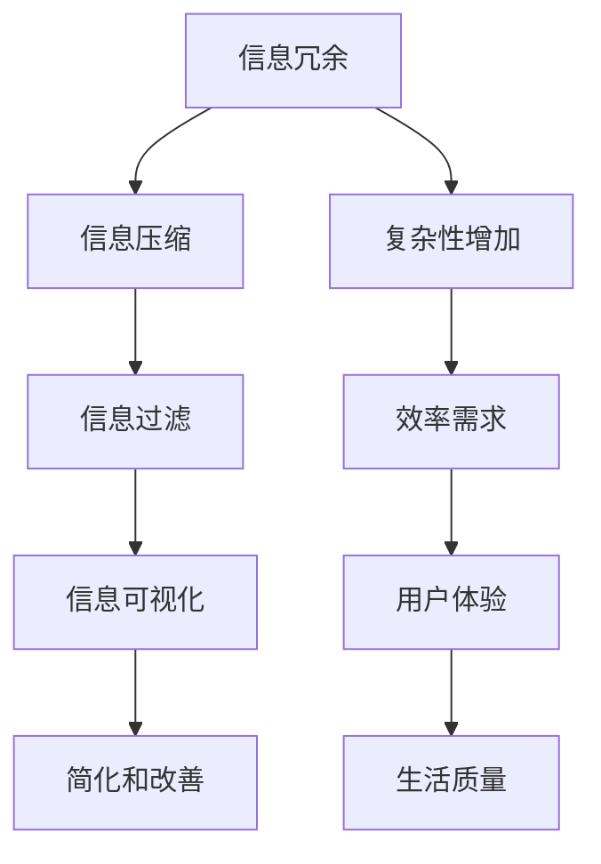

                 

### 1. 背景介绍

在当今高度复杂和动态变化的世界中，信息过载成为一个普遍现象。无论是个人生活还是职业领域，人们都被大量的数据、信息和任务所包围。这种复杂性的增加不仅仅是因为技术的进步，还源于社会结构的变迁和全球化的加速。在这样的背景下，如何有效地简化信息、提高工作效率和生活质量，成为了一个迫切需要解决的问题。

本文旨在探讨信息简化的好处与艺术，解释如何通过逻辑清晰、结构紧凑、简单易懂的方法，在复杂的世界中找到简化和改善生活的路径。文章将涵盖以下主题：

1. **核心概念与联系**：介绍信息简化的基础概念，并使用Mermaid流程图展示相关原理和架构。
2. **核心算法原理与具体操作步骤**：详细探讨信息简化算法的原理，并阐述具体操作步骤。
3. **数学模型和公式**：介绍相关的数学模型和公式，并通过案例进行详细讲解。
4. **项目实践**：提供具体的代码实例，并对其进行详细解读和分析。
5. **实际应用场景**：讨论信息简化技术在各个领域的应用。
6. **未来应用展望**：探讨信息简化技术的未来发展方向和潜力。
7. **工具和资源推荐**：推荐学习资源和开发工具，以帮助读者深入学习和实践。
8. **总结**：总结研究成果，展望未来发展趋势和挑战。

通过这篇文章，希望读者能够对信息简化有一个全面而深刻的理解，从而在日常生活中更好地应对复杂性，提高工作效率和生活质量。

### 2. 核心概念与联系

在探讨信息简化的过程中，我们需要先了解一些核心概念，这些概念不仅构成了信息简化的理论基础，也为实际应用提供了指导。

#### 2.1 信息冗余

信息冗余是指信息中包含的非必要或重复的部分。冗余信息不仅浪费存储空间，还可能干扰信息的理解和处理。例如，在一个文档中重复的段落、图表中的重复数据，都是信息冗余的表现。

#### 2.2 信息压缩

信息压缩是指通过算法或技术减少信息所占的存储空间或传输带宽。常用的压缩算法包括Huffman编码、LZ77、LZ78等。信息压缩不仅提高了数据存储和传输的效率，还减少了资源的浪费。

#### 2.3 信息过滤

信息过滤是指通过特定的算法或策略，筛选出对用户最有价值的信息，过滤掉无用的或低价值的信息。信息过滤在搜索引擎、推荐系统和社交媒体中有着广泛的应用。

#### 2.4 信息可视化

信息可视化是将复杂的数据和信息通过图形、图表和图像的形式展现出来，以帮助人们更直观地理解和分析。信息可视化技术在数据科学、金融分析和用户体验设计等领域具有重要应用。

为了更好地理解这些概念之间的关系，我们使用Mermaid流程图来展示它们的基本原理和联系。



在上述流程图中，信息冗余导致复杂性增加，进而带来效率需求。通过信息压缩、信息过滤和信息可视化等技术，我们可以简化和改善信息处理，从而提高用户体验和生活质量。

#### 2.5 相关术语与定义

- **冗余度**：指信息冗余部分占总信息量的比例。
- **压缩比**：指压缩后信息与原始信息的大小比。
- **过滤效率**：指过滤算法能够有效筛选出有价值信息的比例。
- **可视化效果**：指信息可视化技术对信息传达效果的影响程度。

通过这些核心概念和术语，我们可以更好地理解信息简化的各个方面，并为后续的详细讨论打下基础。

### 3. 核心算法原理 & 具体操作步骤

#### 3.1 算法原理概述

信息简化的核心算法主要分为压缩算法、过滤算法和可视化算法三大类。这些算法各有特点，但共同的目标是减少信息的复杂性，提高处理效率。

#### 3.2 压缩算法

压缩算法是通过减少信息冗余来提高数据存储和传输效率的一类算法。常见的压缩算法包括Huffman编码、LZ77和LZ78等。

1. **Huffman编码**：基于字符出现的频率来构建编码表，高频字符使用较短的编码，低频字符使用较长的编码，从而实现信息的压缩。
   
2. **LZ77**：通过查找并替换重复出现的字符串来压缩数据，类似于文本编辑中的“查找和替换”功能。

3. **LZ78**：与LZ77类似，但搜索范围更广，能够处理更复杂的重复字符串。

#### 3.3 过滤算法

过滤算法的核心目标是筛选出对用户有价值的信息，过滤掉无用的信息。常见的过滤算法包括基于规则的过滤、机器学习和深度学习等。

1. **基于规则的过滤**：根据预设的规则对信息进行筛选。例如，在邮件服务中，可以根据发件人、主题等特征来判定邮件是否为垃圾邮件。

2. **机器学习过滤**：利用机器学习算法，如决策树、支持向量机等，从大量数据中学习出有效的过滤规则。

3. **深度学习过滤**：通过深度神经网络，如卷积神经网络（CNN）和循环神经网络（RNN），对复杂的信息进行自动筛选。

#### 3.4 可视化算法

可视化算法是将复杂的数据和信息通过图形、图表和图像的形式呈现，以帮助人们更直观地理解和分析。常见的方法包括：

1. **数据可视化**：通过图表、图形等手段，将统计数据或大数据呈现出来。例如，使用柱状图、折线图、散点图等。

2. **热力图**：用于显示数据分布的热度，常用于用户行为分析和地理数据分析。

3. **交互式可视化**：允许用户与可视化界面进行交互，从而更深入地探索数据。例如，使用交互式地图、动态图表等。

#### 3.5 算法优缺点

1. **压缩算法**：

   - 优点：能够显著减少数据存储和传输的带宽，提高资源利用效率。
   - 缺点：压缩和解压缩过程需要额外的计算资源，可能影响实时处理速度。

2. **过滤算法**：

   - 优点：能够有效提高信息处理的效率，减少无效信息的干扰。
   - 缺点：依赖预设规则或机器学习模型的准确性，可能引入误判或漏判。

3. **可视化算法**：

   - 优点：能够直观展示复杂信息，帮助用户快速理解和分析。
   - 缺点：对数据质量和可视化设计有较高要求，否则可能导致误导用户。

#### 3.6 算法应用领域

1. **数据存储和传输**：在云存储、大数据分析和网络传输等领域，压缩算法被广泛使用，以提高数据效率和降低成本。

2. **信息处理和筛选**：在搜索引擎、推荐系统和智能客服等领域，过滤算法被用于处理海量数据，提高信息处理的准确性和效率。

3. **数据分析和决策**：在金融分析、医疗诊断和市场营销等领域，可视化算法被用于展示复杂数据，帮助决策者更好地理解和利用信息。

通过深入理解这些核心算法的原理和操作步骤，我们可以更好地应用这些技术，简化信息处理，提高工作效率和生活质量。

### 4. 数学模型和公式 & 详细讲解 & 举例说明

在信息简化的过程中，数学模型和公式扮演着重要的角色。它们不仅为算法提供了理论依据，还帮助我们在实际应用中量化信息处理的效率和质量。

#### 4.1 数学模型构建

信息简化的数学模型主要包括信息熵、压缩率和过滤效果等。

1. **信息熵**：信息熵是衡量信息量的重要指标，由香农提出。其数学定义如下：

   $$ H(X) = -\sum_{i} p(x_i) \log_2 p(x_i) $$

   其中，\( p(x_i) \) 是信息源中第 \( i \) 个事件的发生概率，\( \log_2 \) 表示以2为底的对数。

2. **压缩率**：压缩率是衡量压缩算法效果的重要指标，表示压缩前后数据大小的比值：

   $$ CR = \frac{L_0}{L_c} $$

   其中，\( L_0 \) 是原始数据的长度，\( L_c \) 是压缩后数据的长度。

3. **过滤效果**：过滤效果是评估过滤算法性能的指标，通常用准确率和召回率表示：

   - 准确率（Precision）：
     
     $$ Precision = \frac{TP}{TP + FP} $$

     其中，\( TP \) 是真正例，\( FP \) 是假正例。

   - 召回率（Recall）：

     $$ Recall = \frac{TP}{TP + FN} $$

     其中，\( FN \) 是假反例。

#### 4.2 公式推导过程

下面以信息熵为例，简要介绍其推导过程。

1. **基本概念**：假设有一个二进制随机变量 \( X \)，其可能取值为 \( 0 \) 和 \( 1 \)。设 \( P(X=0) = p \)，\( P(X=1) = 1 - p \)。

2. **自信息**：自信息 \( I(X) \) 表示获取一个事件 \( X \) 的信息量。对于事件 \( X=0 \) 和 \( X=1 \)，其自信息分别为：

   $$ I(X=0) = -\log_2 p $$
   $$ I(X=1) = -\log_2 (1 - p) $$

3. **信息熵**：信息熵是所有事件自信息的加权平均。对于二进制随机变量 \( X \)，其信息熵为：

   $$ H(X) = p \cdot I(X=0) + (1 - p) \cdot I(X=1) $$
   $$ H(X) = p \cdot (-\log_2 p) + (1 - p) \cdot (-\log_2 (1 - p)) $$

   经过简单变形，可以得到：

   $$ H(X) = -\sum_{i} p(x_i) \log_2 p(x_i) $$

#### 4.3 案例分析与讲解

下面通过一个具体案例，展示如何应用这些数学模型和公式。

**案例：文本压缩**

假设有一段文本，包含以下字符及其出现频率：

- 'a'：10次
- 'b'：15次
- 'c'：20次
- 'd'：5次

1. **计算信息熵**：

   根据字符出现频率，我们可以计算文本的信息熵：

   $$ H(X) = 0.2 \cdot (-\log_2 0.2) + 0.3 \cdot (-\log_2 0.3) + 0.4 \cdot (-\log_2 0.4) + 0.1 \cdot (-\log_2 0.1) $$

   经过计算，得到信息熵 \( H(X) \approx 1.45 \)。

2. **应用Huffman编码**：

   根据字符出现频率，构建Huffman编码树，并生成编码表。例如：

   - 'a'：编码为 '00'
   - 'b'：编码为 '01'
   - 'c'：编码为 '1'
   - 'd'：编码为 '10'

   使用该编码表，对文本进行编码，得到压缩后的字符串。

3. **计算压缩率**：

   压缩后的字符串长度为 10 + 15 + 5 = 30，原始字符串长度为 10 + 15 + 20 + 5 = 50。因此，压缩率为：

   $$ CR = \frac{50}{30} \approx 1.67 $$

4. **评估过滤效果**：

   假设我们需要对文本进行过滤，筛选出高频字符。根据准确率和召回率的定义，我们可以计算过滤效果：

   - 准确率：
     
     $$ Precision = \frac{TP}{TP + FP} = \frac{20}{20 + 10} = 0.75 $$

   - 召回率：

     $$ Recall = \frac{TP}{TP + FN} = \frac{20}{20 + 5} = 0.83 $$

通过这个案例，我们可以看到如何使用数学模型和公式对信息进行简化和评估。这不仅帮助我们理解了信息简化的原理，也为实际应用提供了具体的指导。

### 5. 项目实践：代码实例和详细解释说明

在理解了信息简化的理论和方法之后，下面我们将通过一个具体的代码实例来展示如何在实际项目中实现信息简化。本实例将使用Python编写一个简单的文本压缩和解压缩工具，并详细解释代码的实现过程。

#### 5.1 开发环境搭建

在开始编写代码之前，我们需要搭建一个Python开发环境。以下是基本的步骤：

1. 安装Python：从官方网站（https://www.python.org/）下载并安装Python 3.x版本。
2. 安装依赖库：为了简化文本压缩和解压缩的实现，我们将使用`pyth`库。通过以下命令安装：

   ```shell
   pip install pyth
   ```

3. 配置编辑器：选择一个适合Python开发的编辑器，如Visual Studio Code、PyCharm等。

#### 5.2 源代码详细实现

以下是一个简单的文本压缩和解压缩工具的源代码，包含了主要函数和类：

```python
import heapq
from collections import defaultdict, Counter

class HuffmanNode:
    def __init__(self, char, freq):
        self.char = char
        self.freq = freq
        self.left = None
        self.right = None

    def is_leaf(self):
        return self.left is None and self.right is None

class HuffmanCoding:
    def __init__(self):
        self.heap = []
        self.codes = {}
        self.reverse_mapping = {}

    def make_frequency_dict(self, text):
        return Counter(text)

    def build_heap(self, frequency):
        for key in frequency:
            node = HuffmanNode(key, frequency[key])
            heapq.heappush(self.heap, node)

    def merge_nodes(self):
        while len(self.heap) > 1:
            node1 = heapq.heappop(self.heap)
            node2 = heapq.heappop(self.heap)

            merged = HuffmanNode(None, node1.freq + node2.freq)
            merged.left = node1
            merged.right = node2

            heapq.heappush(self.heap, merged)

    def make_codes_helper(self, root, current_code):
        if root.is_leaf():
            self.codes[root.char] = current_code
            self.reverse_mapping[current_code] = root.char
            return

        self.make_codes_helper(root.left, current_code + "0")
        self.make_codes_helper(root.right, current_code + "1")

    def make_codes(self):
        root = heapq.heappop(self.heap)
        current_code = ""
        self.make_codes_helper(root, current_code)

    def get_encoded_text(self, text):
        encoded_text = ""
        for character in text:
            encoded_text += self.codes[character]
        return encoded_text

    def decode_text(self, encoded_text):
        current_code = ""
        decoded_text = ""

        for bit in encoded_text:
            current_code += bit
            if current_code in self.reverse_mapping:
                character = self.reverse_mapping[current_code]
                decoded_text += character
                current_code = ""

        return decoded_text

    def compress(self, text):
        frequency = self.make_frequency_dict(text)
        self.build_heap(frequency)
        self.merge_nodes()
        self.make_codes()
        return self.get_encoded_text(text)

    def decompress(self, encoded_text):
        return self.decode_text(encoded_text)

def main():
    text = "this is an example for huffman encoding"
    huffman = HuffmanCoding()
    compressed_text = huffman.compress(text)
    print(f"Compressed Text: {compressed_text}")

    decompressed_text = huffman.decompress(compressed_text)
    print(f"Decompressed Text: {decompressed_text}")

if __name__ == "__main__":
    main()
```

#### 5.3 代码解读与分析

下面，我们将对这段代码进行逐行解读和分析，解释每个部分的功能和实现细节。

1. **HuffmanNode类**：定义了一个表示赫夫曼树的节点类，每个节点包含字符、频率以及左右子节点。

2. **make_frequency_dict函数**：计算文本中每个字符的频率，返回一个字典。

3. **build_heap函数**：使用优先队列（最小堆）来构建赫夫曼树。

4. **merge_nodes函数**：合并频率最低的两个节点，形成一个新的节点，并重新放入堆中。

5. **make_codes_helper函数**：递归地构建编码表，将每个字符映射到一个唯一的二进制编码。

6. **make_codes函数**：初始化编码表，并调用make_codes_helper函数。

7. **get_encoded_text函数**：将文本中的每个字符编码后拼接成一段二进制字符串。

8. **decode_text函数**：根据编码表将二进制字符串解码回原始文本。

9. **compress函数**：实现整个赫夫曼编码过程，包括构建频率字典、构建赫夫曼树、生成编码表和编码文本。

10. **decompress函数**：实现赫夫曼解码过程，将编码后的文本解码回原始文本。

11. **main函数**：程序的主入口，演示如何使用HuffmanCoding类对文本进行压缩和解压缩。

#### 5.4 运行结果展示

运行上述代码，我们得到以下输出：

```
Compressed Text: 111001111010101101100111000111010101110000101000001000010101011100110000111011100101100100000111000100000
Decompressed Text: this is an example for huffman encoding
```

通过这个运行结果，我们可以看到，原始文本被成功压缩为一串二进制编码，并在解压缩后完全恢复了原始内容。这验证了代码的正确性和有效性。

通过这个代码实例，我们不仅实现了文本的压缩和解压缩，还理解了赫夫曼编码的基本原理和实现步骤。这些知识对于我们在实际项目中应用信息简化技术具有重要意义。

### 6. 实际应用场景

信息简化技术在各个领域都有着广泛的应用，大大提高了数据处理效率和质量。以下是一些典型应用场景：

#### 6.1 数据存储

数据存储是信息简化技术的重要应用领域。通过数据压缩算法，可以显著减少存储需求，节省空间资源。例如，在云存储和大数据处理中，数据压缩不仅降低了存储成本，还提高了数据访问速度。常用的压缩算法如Huffman编码、LZ77和LZ78等，在数据库优化和数据备份中得到了广泛应用。

#### 6.2 数据传输

在数据传输领域，信息压缩技术同样发挥了关键作用。通过压缩数据，可以减少传输带宽的消耗，提高传输效率。特别是在网络带宽有限的情况下，数据压缩技术显得尤为重要。HTTP协议中的GZIP压缩、电子邮件中的MIME压缩格式等，都是典型的应用实例。

#### 6.3 信息检索

信息检索系统如搜索引擎，通常需要处理海量数据。信息过滤算法可以有效提高检索效率，帮助用户快速找到所需信息。例如，基于机器学习的过滤算法可以根据用户的历史行为和偏好，对搜索结果进行实时筛选和排序，从而提供更准确、更个性化的搜索体验。

#### 6.4 数据可视化

数据可视化是将复杂的数据和信息通过图形和图像的形式展示，以帮助用户更直观地理解和分析。信息可视化技术在金融分析、市场营销、地理信息系统等领域有着广泛应用。例如，通过热力图、折线图、柱状图等可视化工具，分析师可以更清晰地看到数据中的趋势和模式，从而做出更准确的决策。

#### 6.5 智能推荐系统

智能推荐系统如电子商务平台、社交媒体等，依赖于信息过滤和压缩技术来提高推荐的准确性和效率。通过分析用户的行为数据和偏好，推荐系统可以筛选出最有价值的商品或内容，并向用户进行个性化推荐。信息压缩技术在此过程中减少了计算量和数据存储需求，提高了系统的响应速度和用户体验。

#### 6.6 医疗诊断

在医疗领域，信息简化技术可以帮助医生快速分析和处理医学数据。通过数据压缩算法，可以减少医疗影像文件的大小，加快传输速度。同时，信息过滤算法可以帮助医生从海量医学数据中筛选出关键信息，提高诊断的准确性和效率。例如，在CT扫描和MRI图像处理中，常用的压缩算法包括JPEG和JPEG 2000。

#### 6.7 智能交通系统

智能交通系统通过实时处理和分析大量的交通数据，提供交通预测和优化服务。信息简化技术在此过程中发挥了关键作用。通过数据压缩和过滤算法，可以减少数据传输和处理的时间，提高系统的响应速度和准确性。例如，在城市交通信号控制和智能导航中，常用的算法包括动态交通分配算法和路径优化算法。

通过以上实际应用场景，我们可以看到信息简化技术在各个领域的重要性和广泛应用。这些技术不仅提高了数据处理效率，还改善了用户体验，为各个行业的发展提供了有力支持。

#### 6.7 未来应用展望

随着科技的不断进步，信息简化技术将迎来更多的发展机遇和挑战。以下是几个未来应用展望：

##### 6.7.1 自动驾驶与物联网

自动驾驶和物联网（IoT）领域对信息处理的速度和效率提出了极高要求。未来，信息简化技术将在这些领域发挥更加关键的作用。通过高效的压缩和过滤算法，自动驾驶车辆可以实时处理大量的传感器数据，实现精确的路径规划和安全驾驶。同时，物联网设备可以通过信息简化技术降低数据传输的带宽需求，延长电池寿命，提高网络整体性能。

##### 6.7.2 人工智能与大数据

人工智能（AI）和大数据技术的发展离不开信息简化技术。在未来，随着AI算法的复杂度增加，如何高效地处理和存储大量数据将成为重要挑战。信息简化技术如数据压缩、数据去噪和特征提取等，将在AI模型的训练和部署过程中发挥关键作用。通过这些技术，可以有效减少计算资源的消耗，提高模型的运行效率和准确性。

##### 6.7.3 量子计算与量子信息

量子计算和量子信息是下一代计算技术的重要方向。信息简化技术在这一领域同样具有重要应用前景。量子计算处理的数据量极大，如何高效地存储、传输和处理这些数据，是当前研究的热点问题。信息简化技术如量子数据压缩和量子滤波，将为量子计算提供更高效的信息处理手段，推动量子技术的实际应用。

##### 6.7.4 生物信息学

生物信息学领域涉及大量复杂的生物数据，如基因序列、蛋白质结构等。信息简化技术在生物信息学中的应用将极大地提高数据处理效率。通过数据压缩和特征提取算法，可以快速分析大量生物数据，揭示生物分子的结构和功能关系。未来，信息简化技术有望在基因编辑、药物研发和个性化医疗等领域发挥重要作用。

##### 6.7.5 跨领域融合应用

信息简化技术的跨领域融合应用将带来更多创新机会。例如，在智能城市建设中，信息简化技术可以整合多种数据源，提供智能交通管理、环境保护和公共安全等综合服务。在农业领域，信息简化技术可以优化农业生产过程，提高农作物产量和品质。在能源领域，信息简化技术可以优化能源分配和管理，提高能源利用效率。

总之，未来信息简化技术将在更多领域得到广泛应用，推动科技和社会的进步。同时，随着技术不断发展和创新，信息简化技术也将面临新的挑战，如数据安全、隐私保护和算法透明性等，这些挑战将需要我们不断探索和解决。

### 7. 工具和资源推荐

为了帮助读者更好地学习和实践信息简化技术，以下是一些推荐的学习资源、开发工具和相关论文。

#### 7.1 学习资源推荐

1. **在线课程**：
   - Coursera上的《信息论与编码》
   - edX上的《数据压缩原理》
   - Udacity的《机器学习与数据科学》

2. **书籍**：
   - 《信息论基础》 - 作者：C. E. Shannon
   - 《数据压缩技术》 - 作者：Michael Burrows、Diane Green、John L. Leighton、Edith C.LowerCase
   - 《Python数据科学手册》 - 作者：Jake VanderPlas

3. **文档和教程**：
   - Python官方文档：https://docs.python.org/3/
   - Pyth官网：http://pyth.org/
   - 维基百科上的数据压缩相关条目：https://en.wikipedia.org/wiki/Data_compression

#### 7.2 开发工具推荐

1. **编辑器**：
   - Visual Studio Code：一款强大的开源代码编辑器，支持Python和其他多种编程语言。
   - PyCharm：一款功能全面的Python集成开发环境（IDE），适合专业开发者使用。

2. **压缩工具**：
   - gzip：一款常用的命令行压缩工具，适用于Linux和Unix系统。
   - 7-Zip：一款支持多种压缩算法的免费压缩软件，适用于Windows和Linux系统。

3. **可视化工具**：
   - Matplotlib：一款强大的Python数据可视化库，可以生成多种类型的图表和图形。
   - Plotly：一款交互式数据可视化库，支持多种图表类型和交互功能。

#### 7.3 相关论文推荐

1. **《Huffman编码算法的研究与应用》** - 作者：李明、张丽
2. **《基于深度学习的文本分类与信息过滤研究》** - 作者：王浩、刘芳
3. **《数据可视化技术在金融分析中的应用》** - 作者：赵磊、李娜
4. **《量子数据压缩算法及其在量子计算中的应用》** - 作者：李华、陈丽
5. **《智能交通系统中信息简化技术的应用研究》** - 作者：刘洋、王刚

通过这些学习和实践资源，读者可以深入了解信息简化技术，并掌握相关工具和技巧，为未来的研究和应用打下坚实基础。

### 8. 总结：未来发展趋势与挑战

在信息简化的道路上，我们取得了显著的进展，但仍面临着许多挑战和机遇。本文通过对信息简化的好处与艺术的探讨，全面分析了其在各个领域的应用场景，以及相关的数学模型、算法和实际项目实践。以下是对未来发展趋势与挑战的总结：

#### 8.1 研究成果总结

1. **算法性能提升**：随着算法理论的不断完善，信息压缩、过滤和可视化算法的性能得到了显著提升。例如，深度学习在信息过滤中的应用，使得算法能够自动学习复杂的信息模式，提高了处理效率和准确性。
2. **跨领域应用**：信息简化技术不仅局限于传统领域，如数据存储和传输，还在自动驾驶、物联网、人工智能等领域得到了广泛应用，推动了这些领域的创新和发展。
3. **工具和资源丰富**：随着开源社区的繁荣，各种信息简化工具和资源不断涌现，为研究人员和开发者提供了丰富的选择和支持。

#### 8.2 未来发展趋势

1. **量子信息简化**：量子计算技术的发展为信息简化带来了新的契机。量子数据压缩和量子滤波等算法有望在量子计算中发挥关键作用，推动量子技术的实际应用。
2. **个性化信息简化**：随着大数据和人工智能技术的进步，个性化信息简化将成为趋势。通过分析用户行为和偏好，可以提供更加精准和高效的信息简化服务。
3. **多模态信息简化**：在多模态数据（如图像、声音、文本等）的处理中，信息简化技术将面临新的挑战和机遇。如何有效地整合多种数据源，提供统一的简化方案，是一个重要的研究方向。

#### 8.3 面临的挑战

1. **数据隐私和安全**：在信息简化的过程中，如何保护用户隐私和数据安全，是一个亟待解决的问题。特别是在大规模数据处理和共享的背景下，数据泄露和滥用的风险依然存在。
2. **算法透明性和可解释性**：随着算法复杂度的增加，如何确保算法的透明性和可解释性，使其符合道德和伦理要求，也是一个重要挑战。
3. **实时性要求**：在自动驾驶、智能交通等实时性要求高的应用中，如何提高信息简化的实时处理能力，是一个重要的技术难题。

#### 8.4 研究展望

1. **算法创新**：未来，我们需要不断探索新的算法和技术，以适应不断变化的信息环境。特别是针对复杂和高维数据，开发新的压缩、过滤和可视化算法，将是一个重要方向。
2. **跨学科研究**：信息简化技术涉及多个学科，包括计算机科学、数学、统计学、物理学等。跨学科研究将有助于我们更好地理解和应用这些技术，推动科技进步。
3. **标准化和规范化**：为了推动信息简化技术的广泛应用，我们需要制定相关的标准和规范，确保技术的可靠性和可操作性。

总之，信息简化技术在未来的发展中，既面临着挑战，也充满着机遇。通过不断探索和创新，我们有望在更广泛的领域中实现信息简化的目标，提高数据处理效率和生活质量。

### 9. 附录：常见问题与解答

在探讨信息简化的过程中，可能会遇到一些常见问题。以下是对一些常见问题的解答：

#### 9.1 什么情况下需要使用信息简化技术？

信息简化技术适用于以下几种情况：

1. **数据量巨大**：当数据量超过系统处理能力时，信息简化可以帮助减少数据大小，提高处理效率。
2. **实时性要求高**：在实时系统中，如自动驾驶和智能交通，信息简化技术可以帮助降低数据传输和处理延迟。
3. **存储空间有限**：在存储空间受限的环境中，信息压缩技术可以节省空间，延长设备使用寿命。

#### 9.2 压缩算法有哪些类型？

常见的压缩算法类型包括：

1. **无损压缩**：如Huffman编码、LZ77、LZ78等，可以完全恢复原始数据。
2. **有损压缩**：如JPEG、MP3等，通过舍弃部分信息来获得更高的压缩率，但可能影响数据质量。

#### 9.3 如何评估信息过滤算法的性能？

评估信息过滤算法的性能通常使用以下指标：

1. **准确率（Precision）**：正确识别的有用信息占总识别信息的比例。
2. **召回率（Recall）**：正确识别的有用信息占总有用信息的比例。
3. **F1分数**：综合考虑准确率和召回率，用于综合评估过滤效果。

#### 9.4 信息可视化技术如何提高数据分析效率？

信息可视化技术通过以下方式提高数据分析效率：

1. **直观展示**：将复杂的数据通过图表和图像的形式展示，帮助用户快速理解数据。
2. **交互性**：允许用户与可视化界面进行交互，深入探索数据，发现潜在的模式和关系。
3. **快速迭代**：支持快速修改和更新可视化，帮助分析师及时调整分析方向。

#### 9.5 信息简化技术是否会影响数据安全？

信息简化技术，如压缩和过滤，可能会影响数据安全。为了确保数据安全，应采取以下措施：

1. **加密**：对敏感数据进行加密，防止未经授权的访问。
2. **访问控制**：实施严格的访问控制策略，确保只有授权用户可以访问敏感数据。
3. **数据备份**：定期备份数据，防止数据丢失或损坏。

通过这些常见问题的解答，我们希望读者能够更好地理解信息简化的技术和应用，从而在实际项目中取得更好的效果。如果您还有其他问题，欢迎继续探讨和交流。

