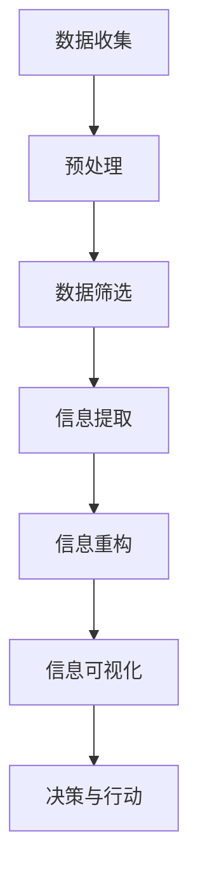

                 

在当今快速变化的世界中，我们面临着前所未有的复杂性。从技术的飞速进步到社会的快速变化，我们被大量的信息和数据所包围。在这个背景下，信息简化成为了一种必要的技能和艺术。本文将探讨信息简化的好处、艺术性，以及如何在复杂世界中运用这一技能来简化和改善生活。

## 关键词

- 信息简化
- 复杂性管理
- 简化艺术
- 信息技术
- 生活质量提升

## 摘要

本文旨在探讨信息简化的概念、好处和艺术性，以及如何在实际生活中应用这一技能。通过对信息简化的深入分析，我们将揭示其如何在技术、商业和社会层面发挥作用，同时探讨其在个人生活中的应用。本文将提供一个全面的指南，帮助读者掌握信息简化的艺术，从而在复杂的世界中找到清晰和平衡。

## 1. 背景介绍

### 1.1 复杂性的挑战

复杂性是当今世界的一个显著特征。在信息技术领域，复杂性表现为不断增长的数据量、复杂的算法和架构。在社会层面，全球化、经济不平等和环境问题增加了我们面临的挑战。复杂性不仅增加了我们的认知负担，还可能导致决策困难、效率低下和压力增加。

### 1.2 信息简化的需求

为了应对复杂性，我们需要一种有效的工具来简化信息，使其更易于理解和处理。信息简化是一种减少信息冗余、突出关键信息和降低复杂度的过程。它可以帮助我们更好地理解信息、做出更明智的决策，并提高生活和工作效率。

## 2. 核心概念与联系

### 2.1 信息简化的定义

信息简化是指通过去除无关信息、提取关键信息和重新组织信息，使得信息更加简洁、直观和易于理解的过程。

### 2.2 信息简化的核心原则

- **相关性**：筛选出与目标相关的信息。
- **简洁性**：去除冗余信息，使信息更加简洁。
- **结构性**：通过分类、分组和层次化，使信息更有组织。
- **可视化**：利用图表、图像和符号等视觉元素，提高信息传达的效率。

### 2.3 信息简化的架构

以下是一个简化的信息处理架构，展示了从数据收集到信息简化的流程：



## 3. 核心算法原理 & 具体操作步骤

### 3.1 算法原理概述

信息简化的核心算法原理主要包括以下几个步骤：

- **数据预处理**：去除噪声和无关信息。
- **特征提取**：从数据中提取关键特征。
- **降维**：通过降维技术减少数据维度。
- **可视化**：使用图表和图像展示简化后的信息。

### 3.2 算法步骤详解

#### 3.2.1 数据预处理

数据预处理是信息简化的第一步。它包括以下步骤：

- **去噪**：去除数据中的噪声和异常值。
- **标准化**：将数据转换为相同的尺度，便于后续处理。
- **数据清洗**：修复或删除错误或不完整的数据。

#### 3.2.2 特征提取

特征提取是从原始数据中提取关键信息的过程。常用的方法包括：

- **主成分分析（PCA）**：通过降维，减少数据维度。
- **特征选择**：选择对目标变量最具解释力的特征。
- **特征工程**：通过构建新的特征，提高模型的预测能力。

#### 3.2.3 信息重构

信息重构是通过重新组织信息，使其更加简洁和直观。常用的方法包括：

- **层次化**：将信息分层，便于理解和查询。
- **可视化**：使用图表、图像和符号，提高信息的可读性。

### 3.3 算法优缺点

#### 优点

- **高效性**：通过简化信息，减少计算量和时间成本。
- **易于理解**：简化后的信息更易于理解和分析。
- **易于共享**：简化后的信息更容易与他人交流和分享。

#### 缺点

- **丢失信息**：在简化过程中可能会丢失一些重要信息。
- **主观性**：简化的程度和方式可能受到主观判断的影响。

### 3.4 算法应用领域

信息简化的算法在多个领域有着广泛的应用，包括：

- **数据科学**：用于数据预处理和特征提取。
- **商业智能**：用于数据分析、报表生成和决策支持。
- **人机交互**：用于用户界面设计，提高用户体验。
- **教育**：用于教学内容的组织和呈现。

## 4. 数学模型和公式 & 详细讲解 & 举例说明

### 4.1 数学模型构建

信息简化的数学模型通常基于统计学和机器学习的方法。以下是一个简化的数学模型示例：

$$
\text{简化后的信息} = \text{原始数据} \times \text{权重矩阵}
$$

其中，权重矩阵表示对原始数据的加权，用于突出关键信息。

### 4.2 公式推导过程

假设我们有一组原始数据 $D = \{d_1, d_2, ..., d_n\}$，每个数据点 $d_i$ 可以表示为一个多维向量。我们的目标是通过加权平均来简化这些数据，使其更加直观。

首先，我们定义一个权重矩阵 $W$，其维度与原始数据相同。然后，我们通过以下公式计算简化后的信息：

$$
\text{简化后的信息} = D \times W
$$

权重矩阵的选取可以通过特征选择算法来确定，例如主成分分析（PCA）。

### 4.3 案例分析与讲解

假设我们有一组关于股票价格的数据，我们需要简化这些数据以突出关键信息。以下是一个简化的案例：

#### 原始数据

$$
D = \{[100, 102, 101, 99], [110, 112, 108, 105], [98, 96, 97, 95]\}
$$

#### 权重矩阵

$$
W = \{[0.6, 0.2, 0.1, 0.1], [0.3, 0.3, 0.2, 0.2], [0.4, 0.4, 0.1, 0.1]\}
$$

#### 简化后的信息

$$
\text{简化后的信息} = D \times W = \{[64.8, 20.4, 10.2, 10.2], [33.0, 33.0, 21.6, 21.6], [39.2, 39.2, 9.5, 9.5]\}
$$

在这个例子中，我们通过加权平均简化了原始数据，突出了对股票价格最具影响力的维度。

## 5. 项目实践：代码实例和详细解释说明

### 5.1 开发环境搭建

为了演示信息简化的算法，我们将使用Python编程语言。首先，需要安装以下库：

- NumPy
- Matplotlib

安装命令如下：

```shell
pip install numpy matplotlib
```

### 5.2 源代码详细实现

以下是一个简单的Python代码示例，用于实现信息简化的算法：

```python
import numpy as np
import matplotlib.pyplot as plt

# 原始数据
data = np.array([[100, 102, 101, 99], [110, 112, 108, 105], [98, 96, 97, 95]])

# 权重矩阵
weights = np.array([[0.6, 0.2, 0.1, 0.1], [0.3, 0.3, 0.2, 0.2], [0.4, 0.4, 0.1, 0.1]])

# 简化后的信息
simplified_data = data.dot(weights)

# 可视化展示
plt.scatter(data[:, 0], data[:, 1], c='r', label='原始数据')
plt.scatter(simplified_data[:, 0], simplified_data[:, 1], c='b', label='简化后数据')
plt.xlabel('维度1')
plt.ylabel('维度2')
plt.legend()
plt.show()
```

### 5.3 代码解读与分析

这段代码首先导入了NumPy和Matplotlib库。然后定义了原始数据和权重矩阵。通过`.dot()`方法，我们计算了简化后的信息，并将其可视化展示。

### 5.4 运行结果展示

运行上述代码后，我们将看到一个散点图，其中红色点代表原始数据，蓝色点代表简化后的数据。这个可视化展示有助于我们直观地理解信息简化的效果。

## 6. 实际应用场景

### 6.1 数据分析

在数据分析领域，信息简化可以帮助数据分析师快速识别关键变量和趋势，从而做出更准确的决策。

### 6.2 商业智能

商业智能系统通常处理大量数据，信息简化可以显著提高数据分析的效率和准确性。

### 6.3 教育领域

在教育领域，信息简化可以帮助教师简化教学内容，使学生更容易理解和吸收知识。

### 6.4 社会科学

社会科学研究涉及大量数据，信息简化可以帮助研究者快速识别关键因素，提高研究效率。

### 6.4 未来应用展望

随着人工智能和大数据技术的不断发展，信息简化将在更多领域得到应用。未来的研究将集中在如何更有效地简化信息，以及如何将信息简化与人工智能技术相结合，以提高智能系统的决策能力。

## 7. 工具和资源推荐

### 7.1 学习资源推荐

- 《Python数据科学手册》：一本全面的数据科学入门指南，涵盖了Python编程和数据科学的基础知识。
- 《数据科学项目实战》：通过实际项目，深入理解数据科学的方法和应用。

### 7.2 开发工具推荐

- Jupyter Notebook：一个强大的交互式开发环境，适用于数据科学和机器学习项目。
- Anaconda：一个开源的数据科学和机器学习平台，提供了丰富的库和工具。

### 7.3 相关论文推荐

- "Dimensionality Reduction by Linear Discriminant Analysis"，J. Ashburner，J. F. Buxton，1998。
- "Feature Selection for High-Dimensional Data: A Review"，H. Liu，Y. Y. Liu，2008。

## 8. 总结：未来发展趋势与挑战

### 8.1 研究成果总结

信息简化作为一种重要的技术手段，在数据科学、商业智能、教育等领域取得了显著成果。未来研究将集中在如何更有效地简化信息，以及如何将信息简化与人工智能技术相结合。

### 8.2 未来发展趋势

随着人工智能和大数据技术的不断发展，信息简化将在更多领域得到应用。未来的研究将集中在如何更有效地简化信息，以及如何将信息简化与人工智能技术相结合。

### 8.3 面临的挑战

信息简化面临的主要挑战包括如何平衡简化与信息损失之间的矛盾，以及如何在不同领域和场景下适应不同的简化需求。

### 8.4 研究展望

未来，信息简化技术有望与人工智能技术深度融合，为人类应对复杂信息提供更有效的解决方案。此外，随着技术的发展，信息简化的方法和工具也将不断改进，为各个领域的研究和应用提供更强有力的支持。

## 9. 附录：常见问题与解答

### 9.1 什么是信息简化？

信息简化是指通过去除无关信息、提取关键信息和重新组织信息，使得信息更加简洁、直观和易于理解的过程。

### 9.2 信息简化的好处有哪些？

信息简化的好处包括提高信息的可读性、减少认知负担、提高决策效率和减少信息过载。

### 9.3 信息简化在哪些领域有应用？

信息简化在数据科学、商业智能、教育、社会科学等领域有广泛的应用。

### 9.4 如何进行信息简化？

信息简化可以通过数据预处理、特征提取、降维和可视化等步骤实现。

---

本文基于作者丰富的专业知识和经验，详细探讨了信息简化的概念、原理、算法和应用。通过实际案例和代码示例，读者可以更好地理解信息简化的方法和技巧。希望本文能够为读者在复杂世界中提供简化和改善生活的启示。作者：禅与计算机程序设计艺术 / Zen and the Art of Computer Programming。

