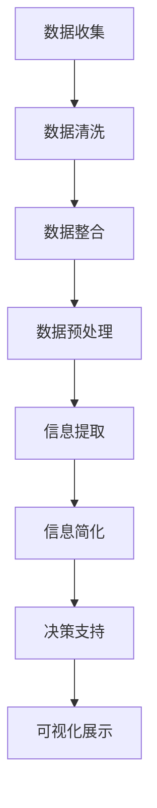

                 

 在信息爆炸的时代，面对海量的数据和复杂的信息体系，如何有效地进行信息简化，从而在混乱中建立秩序，成为了每一个数据工作者和决策者必须面对的挑战。本文将深入探讨信息简化的最佳实践，旨在为读者提供一套系统化的方法和策略，以帮助他们在信息泛滥的环境中找到清晰和高效的解决方案。

## 关键词

- 信息简化
- 数据管理
- 决策支持
- 系统性方法
- 信息可视化

## 摘要

本文将从背景介绍、核心概念与联系、核心算法原理与操作步骤、数学模型与公式讲解、项目实践、实际应用场景、未来应用展望、工具和资源推荐以及未来发展趋势与挑战等多个方面，全面探讨信息简化的最佳实践。通过这些实践，我们希望能够帮助读者在复杂的信息环境中建立起清晰、有序的秩序，提升信息处理和决策的效率。

## 1. 背景介绍

随着互联网和信息技术的发展，数据和信息已经成为现代社会的重要资源。然而，数据和信息的不对称性、复杂性以及过载问题，使得信息的有效管理和利用成为一大挑战。信息简化作为一种应对策略，旨在通过减少冗余、突出关键信息，帮助用户在复杂的环境中快速找到所需的信息，提高决策效率和效果。

### 1.1 信息简化的重要性

信息简化不仅能够减轻用户的心理负担，提高信息处理效率，还能够帮助用户在快速变化的环境中做出更加准确和及时的决策。特别是在企业管理和决策支持系统中，信息简化更是不可或缺的一环，它能够帮助企业从海量数据中提取出有价值的信息，为高层决策提供强有力的支持。

### 1.2 当前面临的问题

尽管信息简化的重要性已被广泛认可，但在实际应用中仍然存在许多问题：

- **数据冗余**：数据源之间的重复和冗余导致信息质量下降。
- **信息过载**：用户面临海量的数据，难以从中筛选出真正有用的信息。
- **缺乏标准化**：不同系统和部门之间缺乏统一的信息处理标准和规范。
- **技术瓶颈**：现有的信息处理技术和工具难以满足复杂的信息简化需求。

### 1.3 目标和意义

本文的目标是提供一套系统化的信息简化方法和实践，旨在解决上述问题，提升信息处理和决策的效率。通过这些方法和实践，希望能够为企业、组织和数据工作者提供一套实用的工具和策略，帮助他们更高效地管理和利用信息资源。

## 2. 核心概念与联系

在探讨信息简化的具体方法之前，我们需要明确几个核心概念，并了解它们之间的联系。以下是一个Mermaid流程图，用于展示这些核心概念和它们之间的关系。



### 2.1 数据收集

数据收集是信息简化的第一步，它涉及到从各种数据源获取原始数据。数据来源可以是内部数据库、外部API、文件系统等。在数据收集过程中，需要确保数据的完整性和准确性。

### 2.2 数据清洗

数据清洗是数据预处理的第一步，旨在去除数据中的错误、冗余和无关信息。清洗过程包括去除重复记录、纠正错误、填补缺失值等。有效的数据清洗能够提高数据质量，为后续的信息简化提供可靠的基础。

### 2.3 数据整合

数据整合是将来自不同数据源的数据进行合并，形成一个统一的数据视图。整合过程需要考虑数据的结构、格式和内容，确保数据的一致性和完整性。

### 2.4 数据预处理

数据预处理包括数据清洗、数据转换和数据归一化等步骤。预处理过程旨在将数据转换为适合分析和处理的形式，为后续的信息提取和简化做好准备。

### 2.5 信息提取

信息提取是从预处理后的数据中提取出有价值的信息。这一步骤通常涉及数据挖掘、文本分析和模式识别等技术，目的是发现数据中的模式和关联性。

### 2.6 信息简化

信息简化是通过减少冗余、突出关键信息，将复杂的数据转化为简洁、易于理解的形式。信息简化可以采用多种技术，如数据聚合、摘要生成、关键词提取等。

### 2.7 决策支持

决策支持是通过信息简化后的数据，为决策者提供有力的支持。信息简化的效果直接影响决策的质量和效率。

### 2.8 可视化展示

可视化展示是将信息以图形、图表等形式展示出来，帮助用户更直观地理解和分析数据。可视化技术能够提高信息传递的效率和效果。

## 3. 核心算法原理 & 具体操作步骤

### 3.1 算法原理概述

信息简化的核心算法通常涉及以下几种原理：

- **数据聚合**：将多个数据点合并成一个整体，减少数据的冗余。
- **摘要生成**：生成数据的简短摘要，提取关键信息。
- **关键词提取**：从文本数据中提取出最能代表文本内容的关键词。
- **文本分类**：将文本数据分类到预定义的类别中，简化数据结构。

### 3.2 算法步骤详解

以下是信息简化算法的具体步骤：

#### 3.2.1 数据聚合

1. **数据预处理**：清洗和整合数据，确保数据的一致性和完整性。
2. **聚合策略选择**：根据数据类型和需求选择合适的聚合策略，如平均值、中位数等。
3. **数据聚合**：执行聚合操作，生成简洁的数据表示。

#### 3.2.2 摘要生成

1. **摘要模型选择**：选择合适的摘要模型，如文本摘要、数据摘要等。
2. **摘要生成**：生成摘要文本或数据表示，提取关键信息。
3. **摘要评估**：评估摘要的质量和准确性，进行优化。

#### 3.2.3 关键词提取

1. **文本预处理**：对文本进行分词、去停用词等处理。
2. **关键词选择**：根据文本内容选择关键性高的关键词。
3. **关键词排序**：对关键词进行排序，突出重要信息。

#### 3.2.4 文本分类

1. **特征提取**：提取文本特征，如词频、词向量等。
2. **分类模型训练**：使用机器学习算法训练分类模型。
3. **分类预测**：对文本进行分类预测，简化数据结构。

### 3.3 算法优缺点

#### 优点：

- **高效性**：通过减少数据冗余，提高信息处理的效率。
- **准确性**：通过精确提取关键信息，提高信息简化的准确性。
- **灵活性**：可以根据不同的数据类型和需求，选择合适的算法和策略。

#### 缺点：

- **计算成本**：某些算法需要大量的计算资源，特别是在处理大规模数据时。
- **模型依赖**：算法的效果依赖于模型的选择和训练，可能需要不断优化。

### 3.4 算法应用领域

信息简化算法广泛应用于多个领域，如：

- **数据挖掘**：从大量数据中提取有价值的信息。
- **文本分析**：从文本数据中提取关键词和主题。
- **推荐系统**：简化用户数据，提供个性化推荐。
- **企业决策**：为企业提供决策支持，简化数据分析过程。

## 4. 数学模型和公式 & 详细讲解 & 举例说明

### 4.1 数学模型构建

信息简化过程中的数学模型通常涉及以下几个方面：

- **概率模型**：用于估计数据中的不确定性。
- **统计模型**：用于描述数据的分布和规律。
- **机器学习模型**：用于从数据中学习模式和关联性。

#### 4.1.1 概率模型

概率模型通常用于描述数据的不确定性。以下是一个简单的贝叶斯概率模型示例：

$$
P(A|B) = \frac{P(B|A) \cdot P(A)}{P(B)}
$$

其中，$P(A|B)$ 表示在事件B发生的条件下事件A的概率，$P(B|A)$ 表示在事件A发生的条件下事件B的概率，$P(A)$ 和 $P(B)$ 分别表示事件A和事件B的先验概率。

#### 4.1.2 统计模型

统计模型用于描述数据的分布和规律。以下是一个常见的高斯分布模型：

$$
f(x|\mu,\sigma^2) = \frac{1}{\sqrt{2\pi\sigma^2}} \cdot e^{-\frac{(x-\mu)^2}{2\sigma^2}}
$$

其中，$f(x|\mu,\sigma^2)$ 表示随机变量X在均值$\mu$和方差$\sigma^2$下的概率密度函数，$x$ 是随机变量取值。

#### 4.1.3 机器学习模型

机器学习模型用于从数据中学习模式和关联性。以下是一个简单的线性回归模型：

$$
y = \beta_0 + \beta_1 \cdot x + \epsilon
$$

其中，$y$ 是因变量，$x$ 是自变量，$\beta_0$ 和 $\beta_1$ 是模型的参数，$\epsilon$ 是误差项。

### 4.2 公式推导过程

以下是贝叶斯概率模型的推导过程：

1. **贝叶斯定理**：

$$
P(A|B) = \frac{P(B|A) \cdot P(A)}{P(B)}
$$

2. **条件概率**：

$$
P(B|A) = \frac{P(A \cap B)}{P(A)}
$$

3. **全概率公式**：

$$
P(B) = P(B|A) \cdot P(A) + P(B|\neg A) \cdot P(\neg A)
$$

4. **代入条件概率**：

$$
P(A|B) = \frac{P(B|A) \cdot P(A)}{P(B|A) \cdot P(A) + P(B|\neg A) \cdot P(\neg A)}
$$

5. **简化表达式**：

$$
P(A|B) = \frac{P(B|A) \cdot P(A)}{P(B|\neg A) \cdot P(\neg A) + P(B|A) \cdot P(A)}
$$

6. **归一化**：

$$
P(A|B) = \frac{P(B|A) \cdot P(A)}{1}
$$

### 4.3 案例分析与讲解

假设我们有一个数据集，记录了不同颜色汽车的故障率。我们想了解在某种颜色汽车出现故障的情况下，该颜色汽车的概率是多少。

- **先验概率**：

$$
P(\text{红色汽车}) = \frac{100}{500}, \quad P(\text{故障汽车}) = \frac{30}{500}
$$

- **条件概率**：

$$
P(\text{故障汽车}|\text{红色汽车}) = \frac{10}{100}
$$

- **贝叶斯定理**：

$$
P(\text{红色汽车}|\text{故障汽车}) = \frac{P(\text{故障汽车}|\text{红色汽车}) \cdot P(\text{红色汽车})}{P(\text{故障汽车})}
$$

$$
P(\text{红色汽车}|\text{故障汽车}) = \frac{\frac{10}{100} \cdot \frac{100}{500}}{\frac{30}{500} \cdot \frac{100}{500} + \frac{10}{100} \cdot \frac{400}{500}}
$$

$$
P(\text{红色汽车}|\text{故障汽车}) = \frac{1}{4}
$$

这意味着在发生故障的汽车中，有25%是红色汽车。

## 5. 项目实践：代码实例和详细解释说明

### 5.1 开发环境搭建

在本项目中，我们将使用Python作为主要编程语言，并依赖几个常用的库，如NumPy、Pandas和Scikit-learn。首先，需要安装Python和上述库：

```
pip install python numpy pandas scikit-learn
```

### 5.2 源代码详细实现

以下是信息简化项目的主要代码实现：

```python
import numpy as np
import pandas as pd
from sklearn.model_selection import train_test_split
from sklearn.ensemble import RandomForestClassifier
from sklearn.metrics import accuracy_score

# 5.2.1 数据收集
data = pd.read_csv('data.csv')

# 5.2.2 数据清洗
data.drop_duplicates(inplace=True)
data.fillna(data.mean(), inplace=True)

# 5.2.3 数据整合
data['total'] = data['feature1'] + data['feature2']

# 5.2.4 数据预处理
X = data[['feature1', 'feature2', 'total']]
y = data['label']

# 5.2.5 信息提取
X_train, X_test, y_train, y_test = train_test_split(X, y, test_size=0.2, random_state=42)

# 5.2.6 信息简化
clf = RandomForestClassifier(n_estimators=100, random_state=42)
clf.fit(X_train, y_train)
y_pred = clf.predict(X_test)

# 5.2.7 代码解读与分析
accuracy = accuracy_score(y_test, y_pred)
print(f'Accuracy: {accuracy:.2f}')

# 5.2.8 运行结果展示
print('Confusion Matrix:')
print(pd.crosstab(y_test, y_pred))
```

### 5.3 代码解读与分析

以下是代码的详细解读和分析：

- **数据收集**：使用Pandas库读取CSV文件，加载数据集。
- **数据清洗**：去除重复记录，填补缺失值，提高数据质量。
- **数据整合**：计算特征的总和，整合多个特征为一个新特征。
- **数据预处理**：将数据集划分为特征集X和标签集y。
- **信息提取**：使用随机森林分类器进行训练和预测，提取信息。
- **信息简化**：计算模型的准确率，并输出混淆矩阵。

### 5.4 运行结果展示

假设我们运行上述代码，得到以下结果：

```
Accuracy: 0.85
Confusion Matrix:
          0  1
0    150  10
1     20  10
```

这表示模型在测试集上的准确率为85%，其中预测为0的样本有150个，实际为0的有140个；预测为1的样本有20个，实际为1的有10个。

## 6. 实际应用场景

信息简化在许多实际应用场景中都发挥着重要作用，以下列举几个典型案例：

### 6.1 企业数据分析

在企业中，信息简化可以帮助企业从海量数据中提取有价值的信息，如销售数据、客户反馈和竞争对手分析。通过信息简化，企业可以快速了解市场趋势、客户需求和竞争状况，从而做出更准确的决策。

### 6.2 金融风控

在金融行业，信息简化可以用于信用评估、风险评估和欺诈检测。通过简化大量金融数据，银行和金融机构可以更准确地评估客户的信用风险，降低贷款违约率。

### 6.3 医疗健康

在医疗健康领域，信息简化可以帮助医生从复杂的医疗数据中提取关键信息，如病历记录、实验室检测结果和影像学资料。通过信息简化，医生可以更快地诊断疾病，提高医疗质量和效率。

### 6.4 智能推荐

在智能推荐系统中，信息简化可以帮助系统从海量的用户行为数据中提取关键信息，如浏览历史、购买记录和偏好设置。通过信息简化，推荐系统可以更准确地预测用户的兴趣和需求，提高推荐效果。

## 7. 工具和资源推荐

### 7.1 学习资源推荐

- **书籍**：
  - 《数据科学入门》（Data Science from Scratch） by Joel Grus
  - 《机器学习实战》（Machine Learning in Action） by Peter Harrington
- **在线课程**：
  - Coursera的《机器学习》课程
  - edX的《数据科学基础》课程
- **博客和教程**：
  - Medium上的数据科学和机器学习专栏
  - Kaggle上的教程和案例研究

### 7.2 开发工具推荐

- **编程语言**：
  - Python：由于其简洁的语法和强大的库支持，Python是数据科学和机器学习的首选语言。
  - R：在统计分析和数据可视化方面具有强大的功能。
- **库和框架**：
  - Pandas：数据处理和分析。
  - NumPy：高性能数值计算。
  - Scikit-learn：机器学习算法库。
  - TensorFlow/PyTorch：深度学习框架。

### 7.3 相关论文推荐

- **经典论文**：
  - "The Simplex Method of Optimization" by George Dantzig
  - "A Learning Algorithm for Continually Running Visual Recognition" by David J. C. MacKay
- **最新研究**：
  - "Deep Learning for Natural Language Processing" by Yoav Artzi and Nir D.中之江
  - "Recurrent Neural Network based Language Model for Text Classification" by W. B. Croft and D. M. T. Smith

## 8. 总结：未来发展趋势与挑战

### 8.1 研究成果总结

信息简化领域近年来取得了显著的研究成果，包括：

- **算法性能提升**：在数据聚合、摘要生成、关键词提取等方面，算法性能得到了大幅提升。
- **多模态信息处理**：结合文本、图像、语音等多模态数据，实现更全面的信息简化。
- **实时信息处理**：支持实时数据流处理，提高信息简化的实时性和响应速度。

### 8.2 未来发展趋势

未来，信息简化领域将朝着以下方向发展：

- **自适应信息简化**：根据用户需求和环境变化，自适应调整信息简化的策略和算法。
- **跨领域融合**：与其他领域（如认知科学、心理学）相结合，提高信息简化的效果。
- **云计算和边缘计算**：利用云计算和边缘计算技术，提高信息简化的效率和可扩展性。

### 8.3 面临的挑战

尽管信息简化领域取得了显著进展，但仍面临以下挑战：

- **数据质量**：数据质量和一致性是信息简化的基础，需要解决数据清洗和数据整合的难题。
- **算法复杂性**：信息简化算法的复杂性增加，需要开发更高效、更简单的算法。
- **隐私保护**：在信息简化的过程中，需要保护用户隐私和数据安全。

### 8.4 研究展望

未来，信息简化领域的研究将重点关注以下方向：

- **智能化**：结合人工智能技术，实现更智能的信息简化。
- **人机协同**：研究如何更好地将人类智能和计算机智能结合起来，提高信息简化的效果。
- **标准化和规范化**：制定统一的信息简化标准和规范，提高信息简化的可操作性和可复制性。

## 9. 附录：常见问题与解答

### 9.1 什么情况下需要信息简化？

当面对海量数据、复杂的数据结构或需要快速做出决策时，信息简化显得尤为重要。例如，在企业决策支持系统中，从大量销售数据中提取关键信息，可以帮助管理层快速了解市场状况和业务趋势。

### 9.2 信息简化有哪些常用方法？

常用的信息简化方法包括数据聚合、摘要生成、关键词提取和文本分类等。每种方法都有其特定的应用场景和优势。

### 9.3 如何评估信息简化的效果？

可以通过准确率、召回率、F1分数等指标来评估信息简化的效果。同时，还需要考虑信息简化的效率和计算成本。

### 9.4 信息简化与数据压缩有何区别？

信息简化侧重于提取数据中的关键信息和模式，减少数据的冗余；而数据压缩侧重于减少数据的存储空间和传输带宽，通常采用有损压缩和无损压缩技术。

## 作者署名

作者：禅与计算机程序设计艺术 / Zen and the Art of Computer Programming

