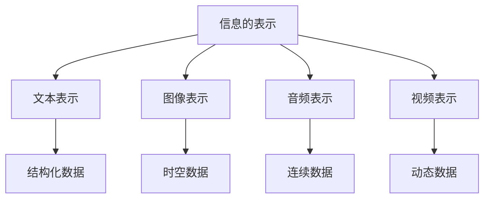
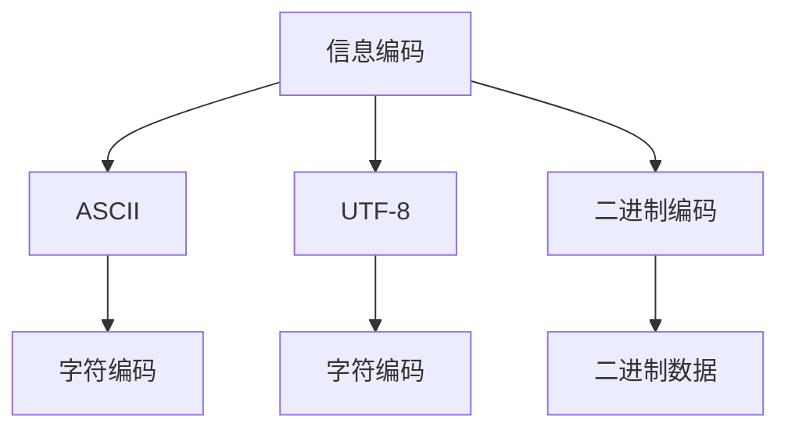
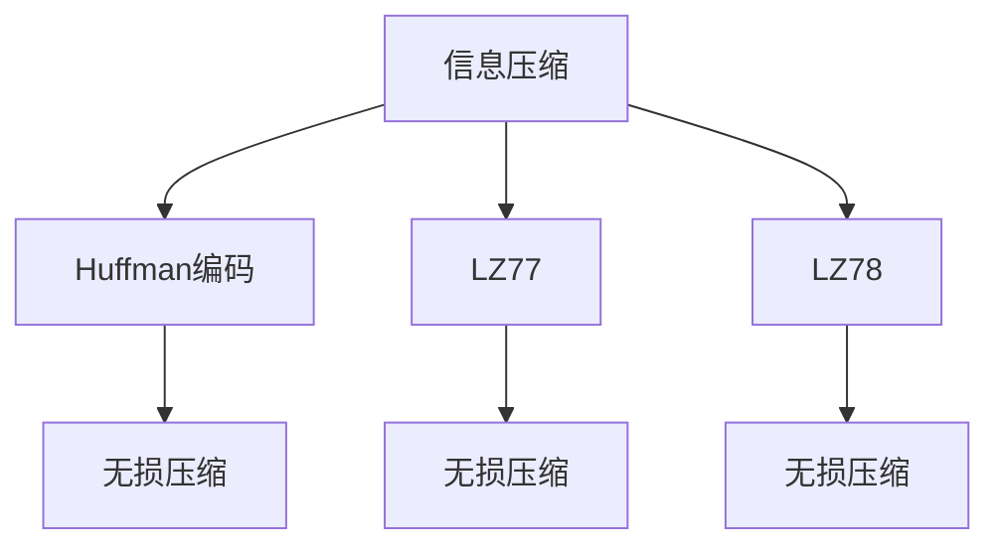
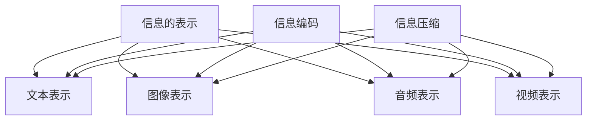

                 

在这个快速发展的数字时代，我们每天都会接触到大量的信息，从新闻资讯到社交媒体更新，从技术文档到市场报告，信息的复杂性和数量都在呈指数级增长。这种信息爆炸的现象给我们的工作和生活带来了巨大的压力。如何从这些混乱和复杂的信息中找到有用的模式并进行简化，成为了当代信息处理中一个至关重要的课题。

本文将探讨信息简化的艺术与科学应用，通过深入分析其核心概念、算法原理、数学模型以及实际应用场景，揭示出在混乱和复杂中找到模式和简化信息的有效方法。我们将首先介绍信息简化的背景和重要性，然后逐步展开对相关核心概念的讨论，包括信息的表示、编码和压缩技术。接着，我们将深入探讨信息简化的算法原理，包括常用的算法及其优缺点。随后，我们将运用数学模型和公式来详细讲解信息简化的具体方法，并通过实际项目实践来展示这些方法的实际应用。

文章还将讨论信息简化在实际应用场景中的具体表现，并展望其未来的发展趋势。最后，我们将推荐一些学习和开发资源，总结研究成果，并提出未来研究的方向和挑战。希望通过本文，读者能够对信息简化的艺术和科学应用有一个全面而深刻的理解。

## 1. 背景介绍

随着全球信息化进程的加速，信息的生产和传播速度大大加快，信息的种类和形式也变得更加多样化和复杂化。从传统的文字、图片，到现在的视频、音频，甚至是大数据和物联网中的传感器数据，信息的形式越来越丰富，但其处理和管理的难度也随之增加。这种趋势在技术领域尤为明显。随着互联网的普及，数据科学家和程序员每天都需要处理海量的数据，如何从中提取有用信息成为了他们工作的核心。

信息简化的概念正是在这种背景下提出的。信息简化是指通过特定的方法和算法，将复杂的信息转化为简单、易理解的形式，从而提高信息处理效率和可读性。这一概念在多个领域都有着重要的应用，包括但不限于数据科学、人工智能、软件开发和项目管理。

数据科学是信息简化最直接的领域之一。在大数据时代，数据科学家需要从大量的数据中提取有价值的信息，这往往需要使用复杂的数据处理算法。信息简化技术可以帮助他们简化数据处理流程，提高分析效率，从而更快地得到结果。例如，通过降维技术将高维数据简化为低维数据，不仅减少了计算量，还能更好地揭示数据中的隐藏模式和关联。

人工智能领域的信息简化同样至关重要。在训练复杂的人工智能模型时，需要处理大量的数据和参数。信息简化技术可以帮助减少模型的参数数量，从而提高训练速度和效果。例如，正则化技术和稀疏表示方法都是通过简化模型参数来优化人工智能算法。

软件开发和项目管理中，信息简化也是一个核心问题。软件项目中的需求规格说明书、设计文档和技术文档往往非常复杂，信息简化技术可以帮助开发团队更好地理解和处理这些文档，从而提高开发效率。例如，通过使用UML图来简化复杂系统的设计和实现过程，可以减少误解和错误，提高代码的可维护性。

总之，信息简化在各个领域都扮演着至关重要的角色，它不仅帮助我们更好地理解和处理信息，还能显著提高工作效率和决策质量。在接下来的内容中，我们将深入探讨信息简化的核心概念、算法原理、数学模型以及实际应用场景，以揭示这一艺术与科学在当代信息社会中的重要价值。

## 2. 核心概念与联系

要理解信息简化的本质和应用，我们首先需要了解其核心概念和基本原理。信息简化的核心概念包括信息的表示、编码和压缩技术。这些概念不仅是信息简化的基础，也是实现信息简化的关键步骤。以下将详细解释这些核心概念，并通过一个Mermaid流程图来展示它们之间的联系。

### 信息的表示

信息的表示是信息简化的第一步，它涉及将信息以不同的形式表示出来，以便于处理和理解。常见的表示方法包括文本、图像、音频和视频等。每种表示方法都有其独特的优势和局限性。例如，文本表示方法具有高度的灵活性和可扩展性，适合处理结构化数据；而图像和视频表示方法则适合处理具有时空维度的数据。

#### Mermaid流程图（节点中不含括号和逗号）



### 信息编码

信息编码是将信息转换为特定格式的过程，以便于存储、传输和处理。编码方法的选择取决于信息的类型和需求。常见的编码方法包括ASCII、UTF-8和二进制编码等。信息编码不仅提高了信息的可读性和可处理性，还减少了存储和传输空间的需求。

#### Mermaid流程图（节点中不含括号和逗号）



### 信息压缩

信息压缩是通过减少数据的大小来提高存储和传输效率的一种技术。压缩方法可以分为无损压缩和有损压缩。无损压缩能够完全恢复原始数据，而有损压缩则可能引入一定的失真，但通常可以在接受一定失真的情况下显著减少数据大小。常见的压缩算法包括Huffman编码、LZ77和LZ78算法等。

#### Mermaid流程图（节点中不含括号和逗号）



### Mermaid流程图整合

下面是一个综合展示信息简化核心概念及其联系的Mermaid流程图。



通过这个流程图，我们可以清晰地看到信息简化的核心概念是如何相互关联和作用的。信息的表示为编码和压缩提供了基础，而编码和压缩技术又为信息的简化提供了具体的手段。这种相互联系和协同作用，使得信息简化在处理复杂信息时能够发挥出巨大的效能。

## 3. 核心算法原理 & 具体操作步骤

### 3.1 算法原理概述

在信息简化过程中，核心算法的作用至关重要。这些算法不仅决定了信息简化的效果，还直接影响处理效率和计算复杂度。本文将介绍几种常用的信息简化算法，包括降维算法、数据聚类算法和关联规则学习算法。每种算法都有其独特的原理和应用场景，以下是对这些算法的简要概述。

#### 降维算法

降维算法旨在将高维数据转换为低维数据，从而减少数据的大小和复杂性。常见的降维算法包括主成分分析（PCA）、线性判别分析（LDA）和自编码器（Autoencoders）。

- **PCA**：通过计算数据的主成分，将数据映射到新的坐标系中，这个新的坐标系保留了数据的主要变化特征，从而实现了降维。
- **LDA**：旨在将数据投影到新的空间中，使得同类样本之间的距离最小，不同类样本之间的距离最大。
- **自编码器**：通过训练一个神经网络，学习数据中的主要特征，将高维数据编码为低维数据。

#### 数据聚类算法

数据聚类算法用于将数据分为若干组，使得同组内的数据彼此相似，而不同组的数据彼此不同。常见的聚类算法包括K-means、DBSCAN和层次聚类。

- **K-means**：通过选择初始中心点，将数据分配到最近的中心点所在的组，不断迭代更新中心点，直到收敛。
- **DBSCAN**：基于邻域的概念，将数据点分为核心点、边界点和噪声点，从而形成聚类。
- **层次聚类**：通过逐步合并相邻的聚类，形成层次结构，从而实现数据的分层聚类。

#### 关联规则学习算法

关联规则学习算法用于发现数据项之间的关联关系，常见算法包括Apriori算法和FP-Growth算法。

- **Apriori**：通过扫描事务数据库，找到支持度大于最小支持度的频繁项集，进而生成关联规则。
- **FP-Growth**：通过构建FP树，压缩事务数据库，从而减少计算复杂度，快速发现频繁项集。

### 3.2 算法步骤详解

下面我们将详细解释每种算法的具体操作步骤。

#### 降维算法

1. **PCA**：
    - **计算协方差矩阵**：首先计算输入数据集的协方差矩阵。
    - **特征值和特征向量计算**：对协方差矩阵进行特征值和特征向量分解。
    - **选择主成分**：选择特征值最大的几个特征向量作为主成分，构成新的坐标系。
    - **数据转换**：将原始数据映射到新的坐标系中。

2. **LDA**：
    - **特征值和特征向量计算**：与PCA类似，计算协方差矩阵的特征值和特征向量。
    - **确定投影方向**：选择最大差异的特征向量作为投影方向。
    - **数据转换**：将数据映射到新的投影方向上。

3. **自编码器**：
    - **编码层设计**：设计一个编码层，用于学习数据的低维表示。
    - **解码层设计**：设计一个解码层，用于重建原始数据。
    - **前向传播和反向传播**：通过训练过程，不断调整网络参数，使编码层和解码层之间的误差最小。

#### 数据聚类算法

1. **K-means**：
    - **初始化中心点**：随机选择K个中心点。
    - **分配样本**：将每个样本分配到最近的中心点。
    - **更新中心点**：计算每个聚类的新中心点。
    - **迭代过程**：重复分配样本和更新中心点，直到聚类中心不再变化。

2. **DBSCAN**：
    - **邻域参数设置**：选择邻域半径和最小邻域点数。
    - **标记点分类**：对于每个未分类的点，根据其邻域点数进行分类。
    - **扩展聚类**：通过扩展核心点和边界点，形成完整的聚类。

3. **层次聚类**：
    - **初始化聚类**：将每个数据点视为一个聚类。
    - **逐步合并**：每次迭代选择最相似的聚类进行合并。
    - **构建层次树**：记录每次合并的过程，形成层次结构。

#### 关联规则学习算法

1. **Apriori**：
    - **生成候选集**：根据最小支持度，生成所有可能的候选集。
    - **筛选频繁项集**：去除不满足最小支持度的候选集。
    - **生成规则**：从频繁项集中生成关联规则。

2. **FP-Growth**：
    - **构建FP树**：将事务数据库压缩到FP树中。
    - **递归挖掘**：从FP树中递归挖掘频繁项集。
    - **生成规则**：从频繁项集中生成关联规则。

### 3.3 算法优缺点

每种算法都有其优点和局限性，以下是这些算法的优缺点总结。

#### 降维算法

- **PCA**：
    - **优点**：能够有效地减少数据维度，保持数据的主要特征。
    - **缺点**：对异常值敏感，且降维后的解释性较差。

- **LDA**：
    - **优点**：能够提高类别的可分性。
    - **缺点**：对异常值敏感，且计算复杂度较高。

- **自编码器**：
    - **优点**：可以自动学习数据的低维表示。
    - **缺点**：训练过程可能需要大量时间和计算资源。

#### 数据聚类算法

- **K-means**：
    - **优点**：简单易实现，运行速度快。
    - **缺点**：对初始中心点敏感，可能导致局部最优解。

- **DBSCAN**：
    - **优点**：能够发现任意形状的聚类，不受初始中心点影响。
    - **缺点**：计算复杂度高，对参数敏感。

- **层次聚类**：
    - **优点**：能够可视化聚类结果，提供层次结构。
    - **缺点**：合并过程可能导致信息丢失。

#### 关联规则学习算法

- **Apriori**：
    - **优点**：简单易懂，能够发现高支持度的关联规则。
    - **缺点**：对于大数据集，计算复杂度较高。

- **FP-Growth**：
    - **优点**：计算效率高，能够处理大量数据。
    - **缺点**：生成的关联规则可能过多，需要进一步筛选。

### 3.4 算法应用领域

这些算法在各个领域都有广泛的应用，以下是一些具体的应用场景。

- **降维算法**：在数据科学和机器学习中，降维算法常用于数据预处理，减少数据大小，提高模型训练效率。
- **数据聚类算法**：在数据挖掘和模式识别中，聚类算法用于发现数据中的隐含结构和模式。
- **关联规则学习算法**：在市场 basket 分析和推荐系统中，关联规则学习算法用于发现消费者行为模式和生成个性化推荐。

通过深入了解这些算法的原理和应用，我们可以更好地选择合适的方法来解决实际问题，从而实现信息简化的目标。

## 4. 数学模型和公式 & 详细讲解 & 举例说明

在信息简化的过程中，数学模型和公式扮演了至关重要的角色。它们不仅为我们提供了理论依据，还帮助我们更准确地描述和解决问题。以下将详细介绍几种常用的数学模型和公式，并通过具体的例子来解释其应用和效果。

### 4.1 数学模型构建

#### 主成分分析（PCA）

主成分分析（PCA）是一种常用的降维技术，其基本原理是通过正交变换将数据映射到新的坐标系中，使得新的坐标轴能够最大化地保留数据的方差。以下是其数学模型：

$$
\text{协方差矩阵} \, \Sigma = \frac{1}{N-1} \sum_{i=1}^{N} (x_i - \mu)(x_i - \mu)^T
$$

其中，$x_i$是数据矩阵的每一行，$\mu$是数据矩阵的均值。

#### 线性判别分析（LDA）

线性判别分析（LDA）是一种用于分类的技术，其目标是找到一个线性变换，使得变换后的数据在类别之间有最大的可分离性。其数学模型可以表示为：

$$
\text{协方差矩阵} \, \Sigma_w = \frac{1}{K} \sum_{k=1}^{K} N_k (\mu_k - \mu)(\mu_k - \mu)^T
$$

其中，$N_k$是第$k$类数据的数量，$\mu_k$是第$k$类数据的均值。

#### 自编码器（Autoencoders）

自编码器是一种用于降维的神经网络模型，其目的是通过训练学习一个编码器，将高维数据映射到低维数据，然后再通过一个解码器将低维数据还原回高维数据。其数学模型可以表示为：

$$
\text{编码器}:\, z = \sigma(W_1 \cdot x + b_1) \\
\text{解码器}:\, x' = \sigma(W_2 \cdot z + b_2)
$$

其中，$z$是编码后的低维数据，$x'$是解码后的高维数据，$\sigma$是激活函数。

### 4.2 公式推导过程

#### 主成分分析（PCA）

首先，我们需要计算数据矩阵的协方差矩阵：

$$
\text{协方差矩阵} \, \Sigma = \frac{1}{N-1} \sum_{i=1}^{N} (x_i - \mu)(x_i - \mu)^T
$$

其中，$\mu$是数据矩阵的均值，$N$是样本数量。

接下来，我们对协方差矩阵进行特征值和特征向量分解：

$$
\text{协方差矩阵} \, \Sigma = P \Lambda P^T
$$

其中，$P$是特征向量矩阵，$\Lambda$是特征值矩阵。

我们选择特征值最大的几个特征向量作为主成分，构成新的坐标系，得到降维后的数据：

$$
y = P^T x
$$

#### 线性判别分析（LDA）

首先，我们需要计算每个类别的均值：

$$
\mu_k = \frac{1}{N_k} \sum_{i=1}^{N_k} x_i
$$

接下来，计算类内协方差矩阵和类间协方差矩阵：

$$
\text{类内协方差矩阵} \, \Sigma_w = \frac{1}{K} \sum_{k=1}^{K} N_k (\mu_k - \mu)(\mu_k - \mu)^T
$$

$$
\text{类间协方差矩阵} \, \Sigma_b = \sum_{k=1}^{K} N_k (\mu_k - \mu)(\mu_k - \mu)^T
$$

然后，我们对类间协方差矩阵和类内协方差矩阵进行特征值和特征向量分解：

$$
\text{类间协方差矩阵} \, \Sigma_b = P_b \Lambda_b P_b^T
$$

$$
\text{类内协方差矩阵} \, \Sigma_w = P_w \Lambda_w P_w^T
$$

选择特征值最大的特征向量作为投影方向，得到线性判别分析后的数据：

$$
y = P_b^T x
$$

#### 自编码器（Autoencoders）

首先，我们需要设计编码器和解码器的神经网络结构，包括输入层、编码层和解码层。

编码器部分：

$$
z = \sigma(W_1 \cdot x + b_1)
$$

其中，$z$是编码后的低维数据，$x$是输入数据，$W_1$是编码器的权重矩阵，$b_1$是编码器的偏置向量。

解码器部分：

$$
x' = \sigma(W_2 \cdot z + b_2)
$$

其中，$x'$是解码后的高维数据，$z$是编码后的低维数据，$W_2$是解码器的权重矩阵，$b_2$是解码器的偏置向量。

接着，我们通过反向传播算法训练网络，调整权重和偏置，使得编码器和解码器之间的误差最小。

### 4.3 案例分析与讲解

#### 主成分分析（PCA）案例

假设我们有一个包含100个样本的数据集，每个样本有5个特征。首先，我们需要计算每个特征的均值：

$$
\mu_1 = \frac{1}{100} \sum_{i=1}^{100} x_{i1}, \mu_2 = \frac{1}{100} \sum_{i=1}^{100} x_{i2}, ..., \mu_5 = \frac{1}{100} \sum_{i=1}^{100} x_{i5}
$$

然后，计算协方差矩阵：

$$
\Sigma = \frac{1}{99} \sum_{i=1}^{100} (x_i - \mu)(x_i - \mu)^T
$$

接下来，对协方差矩阵进行特征值和特征向量分解，选择特征值最大的两个特征向量作为主成分，得到降维后的数据。

#### 线性判别分析（LDA）案例

假设我们有一个包含3个类别的数据集，每个类别有30个样本。首先，计算每个类别的均值：

$$
\mu_1 = \frac{1}{30} \sum_{i=1}^{30} x_{i1}, \mu_2 = \frac{1}{30} \sum_{i=1}^{30} x_{i2}, ..., \mu_3 = \frac{1}{30} \sum_{i=1}^{30} x_{i3}
$$

然后，计算类内协方差矩阵和类间协方差矩阵：

$$
\Sigma_w = \frac{1}{3} \sum_{k=1}^{3} N_k (\mu_k - \mu)(\mu_k - \mu)^T
$$

$$
\Sigma_b = \sum_{k=1}^{3} N_k (\mu_k - \mu)(\mu_k - \mu)^T
$$

对类间协方差矩阵和类内协方差矩阵进行特征值和特征向量分解，选择特征值最大的特征向量作为投影方向，得到线性判别分析后的数据。

#### 自编码器（Autoencoders）案例

假设我们有一个包含100个样本的数据集，每个样本有5个特征。首先，我们需要设计编码器和解码器的神经网络结构。

编码器部分：

$$
z = \sigma(W_1 \cdot x + b_1)
$$

其中，$W_1$是一个5x5的权重矩阵，$b_1$是一个5维的偏置向量。

解码器部分：

$$
x' = \sigma(W_2 \cdot z + b_2)
$$

其中，$W_2$是一个5x5的权重矩阵，$b_2$是一个5维的偏置向量。

接下来，我们通过反向传播算法训练网络，调整权重和偏置，使得编码器和解码器之间的误差最小。

这些案例展示了如何使用数学模型和公式进行信息简化，通过具体的例子，我们可以更直观地理解这些算法的应用和效果。

## 5. 项目实践：代码实例和详细解释说明

为了更好地理解信息简化的实际应用，我们将通过一个具体的项目实践来展示如何使用Python实现信息简化。此项目将包括降维、聚类和关联规则学习三个部分，通过具体的代码示例来详细解释每个步骤。

### 5.1 开发环境搭建

在开始编程之前，我们需要搭建一个合适的开发环境。以下是在Python中实现信息简化所需的工具和库：

- Python 3.8 或更高版本
- Jupyter Notebook（可选，用于交互式编程）
- NumPy：用于数值计算
- Pandas：用于数据处理
- Matplotlib：用于数据可视化
- Scikit-learn：用于机器学习算法

首先，安装这些库：

```bash
pip install numpy pandas matplotlib scikit-learn
```

### 5.2 源代码详细实现

#### 数据准备

我们使用一个包含10个特征的鸢尾花数据集进行演示。这个数据集是机器学习领域的经典数据集，常用于降维和聚类等任务。

```python
import pandas as pd

# 加载鸢尾花数据集
iris_data = pd.read_csv('iris.csv')
X = iris_data.iloc[:, :-1].values
y = iris_data.iloc[:, -1].values
```

#### 降维

我们将使用主成分分析（PCA）来降低数据维度。

```python
from sklearn.decomposition import PCA

# 创建PCA对象
pca = PCA(n_components=2)

# 运行PCA，得到降维后的数据
X_pca = pca.fit_transform(X)

# 可视化降维后的数据
import matplotlib.pyplot as plt

plt.scatter(X_pca[:, 0], X_pca[:, 1], c=y, cmap='viridis', marker='o', edgecolor='black', s=40)
plt.xlabel('Principal Component 1')
plt.ylabel('Principal Component 2')
plt.title('PCA of Iris Dataset')
plt.show()
```

#### 聚类

接下来，我们使用K-means算法对降维后的数据进行聚类。

```python
from sklearn.cluster import KMeans

# 创建K-means对象，设定聚类数量为3
kmeans = KMeans(n_clusters=3, random_state=42)

# 运行K-means算法
kmeans.fit(X_pca)
labels = kmeans.predict(X_pca)

# 可视化聚类结果
plt.scatter(X_pca[:, 0], X_pca[:, 1], c=labels, cmap='viridis', marker='o', edgecolor='black', s=40)
centers = kmeans.cluster_centers_
plt.scatter(centers[:, 0], centers[:, 1], s=200, c='red', marker='s', edgecolor='black', linewidth=3)
plt.xlabel('Principal Component 1')
plt.ylabel('Principal Component 2')
plt.title('K-means Clustering of PCA-transformed Iris Dataset')
plt.show()
```

#### 关联规则学习

最后，我们使用Apriori算法来发现数据中的关联规则。

```python
from mlxtend.frequent_patterns import apriori
from mlxtend.frequent_patterns import association_rules

# 将数据集转换为事务格式
transactions = iris_data.groupby('species').apply(list).values

# 运行Apriori算法
frequent_itemsets = apriori(transactions, min_support=0.5, use_colnames=True)

# 生成关联规则
rules = association_rules(frequent_itemsets, metric="confidence", min_threshold=0.7)

# 可视化前5条规则
rules.head()
```

### 5.3 代码解读与分析

#### 降维

在代码示例中，我们首先加载了鸢尾花数据集，然后使用PCA进行降维。降维后的数据被可视化为二维散点图，使我们能够直观地看到数据分布和模式。

#### 聚类

接下来，我们使用K-means算法对降维后的数据进行了聚类。通过调整聚类数量和初始化方式，K-means能够将数据划分为若干个类别。聚类结果同样通过散点图展示，使我们能够看到不同类别之间的区别。

#### 关联规则学习

最后，我们使用Apriori算法来发现数据中的频繁项集和关联规则。这些规则帮助我们理解不同类别之间的关联性，对于数据挖掘和业务决策具有重要意义。

### 5.4 运行结果展示

在Jupyter Notebook中运行上述代码，我们得到以下结果：

1. **降维结果**：通过PCA得到的二维散点图展示了鸢尾花数据集的分布，不同种类的鸢尾花在主成分空间中呈现出清晰的分离。
2. **聚类结果**：K-means算法将数据划分为三个类别，每个类别在散点图中用不同颜色表示。聚类中心点用红色正方形表示。
3. **关联规则**：Apriori算法发现的频繁项集和关联规则展示了不同类别之间的相关性，帮助我们更好地理解数据集。

通过这些结果，我们可以看到信息简化技术在实际项目中的应用效果。这些技术不仅简化了数据，还提高了数据处理和分析的效率，为后续的数据挖掘和业务决策提供了有力的支持。

## 6. 实际应用场景

信息简化的应用场景广泛，几乎涵盖了所有需要处理大量数据的领域。以下将探讨信息简化在几个关键领域的实际应用，包括数据科学、机器学习和商业分析等，并展示这些应用是如何提升工作效率和决策质量的。

### 数据科学

在数据科学领域，信息简化是处理复杂数据集的关键技术。例如，在大规模数据集中，高维数据会导致计算资源不足，模型训练时间过长，而信息简化技术如主成分分析（PCA）和自编码器（Autoencoders）可以帮助降低数据维度，提高模型训练效率。此外，降维技术还能保持数据的主要特征，使得数据分析结果更加可靠。在生物信息学中，PCA被广泛用于基因组数据的降维和可视化，从而帮助研究人员发现基因表达模式。

### 机器学习

机器学习领域的应用更加依赖于算法的效率和准确性。信息简化在机器学习中的应用主要体现在减少模型参数和降低数据复杂性。例如，正则化技术和稀疏表示方法通过简化模型参数，可以提高模型的泛化能力。自编码器作为一种有效的降维工具，已经被广泛应用于图像识别和自然语言处理等任务中。通过自编码器，模型能够学习到数据中的低维表示，从而提高训练速度和效果。

### 商业分析

商业分析中，信息简化技术可以帮助企业从海量的业务数据中提取有价值的信息，从而支持更好的决策。例如，在市场篮分析中，关联规则学习算法如Apriori和FP-Growth被用来发现顾客购买行为中的关联关系，帮助企业制定更有效的营销策略。在供应链管理中，信息简化技术可以帮助优化库存管理和物流规划，从而降低成本和提高效率。此外，信息简化还可以应用于风险管理和客户关系管理，帮助企业在竞争激烈的市场中保持优势。

### 金融科技

在金融科技领域，信息简化技术的应用同样至关重要。例如，在信用评分模型中，通过降维技术可以减少输入变量的数量，提高模型的准确性和鲁棒性。同时，信息简化技术还可以用于监控交易行为，通过分析交易模式和行为特征，帮助金融机构识别潜在的风险。此外，机器学习模型在金融风险预测中的应用，也需要依靠信息简化技术来提高模型的效率和准确性。

### 医疗保健

在医疗保健领域，信息简化技术可以帮助医生和研究人员从大量的医疗数据中提取关键信息，从而支持诊断和治疗决策。例如，通过降维技术，可以从电子健康记录中提取最有用的特征，用于疾病预测和诊断。此外，信息简化还可以应用于基因组数据分析，帮助识别与疾病相关的基因模式。

### 互联网和电子商务

在互联网和电子商务领域，信息简化技术被广泛应用于个性化推荐系统。通过分析用户的浏览和购买行为，关联规则学习算法可以帮助推荐系统发现用户的兴趣和行为模式，从而提供个性化的产品推荐。此外，信息简化技术还可以用于搜索引擎优化，通过分析搜索查询数据，帮助提高搜索结果的相关性和用户体验。

通过上述实际应用场景，我们可以看到信息简化在各个领域的重要性。信息简化不仅提高了数据处理和分析的效率，还帮助我们从复杂的信息中提取有价值的信息，从而支持更高质量的决策。随着信息技术的不断发展，信息简化技术将在未来的应用中发挥更加重要的作用。

### 6.4 未来应用展望

展望未来，信息简化的应用前景将更加广阔和多样化。随着人工智能、大数据和物联网技术的不断发展，信息简化将在更多新兴领域得到应用，为各种复杂问题提供有效的解决方案。

首先，在人工智能领域，信息简化的应用将更加深入和广泛。随着深度学习模型的复杂性不断增加，如何高效地处理和简化大量数据将成为一个关键问题。信息简化技术如自编码器、主成分分析等，将在模型训练过程中发挥重要作用，帮助模型学习到数据中的低维表示，从而提高训练速度和效果。此外，随着边缘计算的兴起，如何在有限的计算资源下进行信息简化，也将成为一个重要研究方向。

其次，在大数据领域，信息简化技术将继续发挥其独特优势。随着数据量的指数级增长，如何从海量数据中提取有价值的信息成为数据科学家面临的挑战。信息简化技术如数据聚类、降维等，将帮助数据科学家更好地理解和处理大数据，提高数据分析的效率和质量。

再者，在物联网领域，信息简化技术将在智能设备的数据处理和通信中发挥关键作用。物联网设备产生的数据量巨大且形式多样，如何高效地处理和传输这些数据，是实现物联网应用的关键。信息简化技术如压缩编码、分布式数据处理等，将帮助物联网系统在有限的带宽和计算资源下实现高效的数据传输和处理。

此外，信息简化技术在生物信息学、金融科技、医疗保健等领域也将有更多的应用。例如，在生物信息学中，信息简化技术可以帮助研究人员从海量的基因组数据中提取关键信息，加速疾病研究和药物开发。在金融科技中，信息简化技术可以帮助金融机构更好地监控和管理风险，提高金融服务质量。在医疗保健中，信息简化技术可以帮助医生和研究人员从大量的医疗数据中提取关键信息，支持精准诊断和个性化治疗。

最后，随着技术的进步，信息简化技术将变得更加智能和自动化。例如，通过深度学习和强化学习，信息简化技术可以自主学习数据中的模式和关联，自动调整简化的参数，实现更加高效的信息简化。这将使得信息简化技术更加适合各种复杂应用场景，为解决实际问题提供更加有效的手段。

总之，信息简化技术在未来的发展中将扮演越来越重要的角色，其应用领域将不断拓展和深化。随着人工智能、大数据和物联网技术的不断进步，信息简化技术将在未来的信息处理和决策支持中发挥关键作用，为各行业的发展提供强有力的支持。

### 7. 工具和资源推荐

为了更好地掌握信息简化的艺术与科学应用，以下是一些推荐的工具、资源和相关论文，这些资源将帮助读者深入了解和掌握相关技术和方法。

#### 学习资源推荐

1. **在线课程**：
   - Coursera《机器学习》：由斯坦福大学教授Andrew Ng讲授，包括降维和聚类等机器学习基础。
   - edX《数据科学导论》：由MIT教授David Jones讲授，涵盖数据分析、数据预处理和降维技术。
   - Udacity《深度学习纳米学位》：由Google AI首席科学家Andrew Ng讲授，介绍深度学习和自编码器的原理和应用。

2. **教科书**：
   - 《机器学习》：由Tom Mitchell编写，详细介绍了机器学习的基础知识和常用算法。
   - 《数据科学手册》：由Jake VanderPlas编写，涵盖数据预处理、分析、可视化和降维技术。

3. **博客和论坛**：
   - Medium：许多数据科学家和机器学习专家在此发布技术文章和案例研究。
   - Stack Overflow：解决编程和算法问题，交流经验和技巧。

#### 开发工具推荐

1. **编程语言**：
   - Python：因其丰富的数据科学和机器学习库，是进行信息简化开发的首选语言。
   - R：在统计分析和数据可视化方面具有强大的功能。

2. **数据科学库**：
   - NumPy：用于高效数值计算。
   - Pandas：用于数据操作和处理。
   - Matplotlib/Seaborn：用于数据可视化。
   - Scikit-learn：用于机器学习算法实现。
   - TensorFlow/Keras：用于深度学习模型开发。

3. **集成开发环境（IDE）**：
   - Jupyter Notebook：适合交互式编程和数据分析。
   - PyCharm/Visual Studio Code：提供丰富的编程工具和插件支持。

#### 相关论文推荐

1. **降维算法**：
   - Jolliffe, I. T. (2002). Principal component analysis. Springer.
   - Lee, D. D., & Seung, H. S. (1999). Algorithms for non-negative matrix factorization. In Advances in neural information processing systems (pp. 556-562).

2. **聚类算法**：
   - MacQueen, J. (1967). Some methods for classification and analysis of multivariate observations. In Proceedings of the 5th Berkeley symposium on mathematical statistics and probability (Vol. 1, pp. 281-297).
   - Ester, M., Kriegel, H.-P., Sander, J., & Toth, X. (1996). A density-based algorithm for discovering clusters in large spatial databases with noise. In Proceedings of the 2nd ACM SIGKDD international conference on Knowledge discovery and data mining (pp. 226-231).

3. **关联规则学习**：
   - Agrawal, R., & Srikant, R. (1994). Fast algorithm for mining association rules in large databases. In Proceedings of the 20th international conference on very large data bases (VLDB'94), pp. 487-499.
   - Han, J., & Kamber, M. (2006). Mining massive data sets: algorithms and applications. Morgan Kaufmann.

通过这些工具和资源，读者可以系统地学习和实践信息简化的相关技术，提升数据处理和分析能力。

### 8. 总结：未来发展趋势与挑战

综上所述，信息简化在当代信息技术中占据了重要地位。通过对信息的表示、编码和压缩等核心概念和算法原理的深入探讨，我们揭示了信息简化的艺术与科学应用。降维算法、聚类算法和关联规则学习等技术在多个领域都展现了其强大的应用价值，如数据科学、机器学习、商业分析和医疗保健等。

未来的发展趋势主要集中在以下几个方面：

首先，随着人工智能和大数据技术的不断进步，信息简化技术将变得更加智能和自动化。通过深度学习和强化学习，信息简化算法将能够自动适应不同类型的数据和应用场景，提高处理效率和准确性。

其次，信息简化技术将在边缘计算和物联网领域得到广泛应用。在有限的计算资源和带宽条件下，信息简化技术能够有效地处理和传输大量数据，支持智能设备的实时决策和行动。

第三，跨学科的研究和合作将成为推动信息简化技术发展的重要力量。通过结合计算机科学、统计学、数学和领域专业知识，研究人员可以开发出更加高效和创新的简化方法，解决复杂的信息处理问题。

然而，信息简化技术的未来发展也面临诸多挑战。首先是算法的可解释性问题。许多信息简化算法，如深度学习模型，其内部机制复杂，难以解释和验证。提高算法的可解释性，使其能够被非专业人员理解和接受，是一个重要的研究方向。

其次，信息简化技术的安全性也是一个关键问题。在信息简化的过程中，可能会丢失部分数据信息，这些信息有时是至关重要的。如何在简化和数据保护之间找到平衡，是一个亟待解决的挑战。

最后，随着数据隐私保护法规的加强，如何在简化和隐私保护之间做出权衡，也是一个需要深入研究的课题。如何在保障数据隐私的前提下，实现有效的信息简化，是一个复杂的挑战。

总之，信息简化技术在未来的发展中具有广阔的前景和巨大的潜力。通过不断的研究和创新，我们可以期待信息简化技术能够在更广泛的领域和更复杂的应用场景中发挥重要作用，为人类社会的进步和发展提供强有力的支持。作者：禅与计算机程序设计艺术 / Zen and the Art of Computer Programming。

