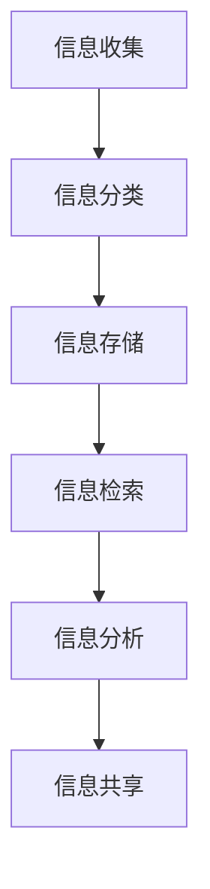

                 

## 1. 背景介绍

在现代快速发展的信息技术时代，数据和信息无处不在。无论是个人生活还是工作领域，我们都被大量数据和信息所包围。有效管理和利用这些信息已经成为我们日常生活和工作中的关键任务。然而，面对海量的信息，很多人感到困惑和压力，无法有效地整理、分析和利用这些信息。

信息管理不仅仅是保存和查找数据那么简单，它涉及到信息的收集、分类、存储、检索、分析和共享等各个方面。有效的信息管理可以提高工作效率，降低错误率，提升决策质量，进而推动个人和组织的成长。然而，当前许多人在信息管理方面面临着诸多挑战，如信息过载、信息冗余、信息泄露等。

本文旨在探讨信息管理的艺术，通过分析核心概念、介绍算法原理、提供数学模型和项目实践实例，帮助读者理解和掌握信息管理的有效方法。本文将分为以下几个部分：

- **背景介绍**：阐述信息管理的重要性及面临的挑战。
- **核心概念与联系**：介绍信息管理的核心概念及其相互联系。
- **核心算法原理 & 具体操作步骤**：详细解析信息管理的主要算法。
- **数学模型和公式 & 详细讲解 & 举例说明**：解释数学模型和公式在信息管理中的应用。
- **项目实践：代码实例和详细解释说明**：通过实际项目展示信息管理的方法。
- **实际应用场景**：探讨信息管理在不同领域的应用。
- **未来应用展望**：预测信息管理的未来发展趋势。
- **工具和资源推荐**：推荐学习和实践信息管理的工具和资源。
- **总结：未来发展趋势与挑战**：总结研究成果，展望未来。
- **附录：常见问题与解答**：解答读者可能遇到的问题。

希望通过本文的探讨，读者能够对信息管理有更深入的理解，从而简化自己的生活和工作的复杂性。

## 2. 核心概念与联系

在深入探讨信息管理的艺术之前，我们需要明确几个核心概念，并理解它们之间的联系。这些概念包括但不限于信息收集、信息分类、信息存储、信息检索、信息分析和信息共享。

### 2.1 信息收集

信息收集是信息管理的第一步，它涉及从各种渠道获取所需的信息。信息收集的渠道多种多样，包括互联网、数据库、文件系统、传感器网络等。有效的信息收集需要明确收集的目标和标准，确保收集的信息具有准确性和可靠性。

### 2.2 信息分类

信息分类是对收集到的信息进行系统化和结构化处理的过程。分类的目的是将杂乱无章的信息按照一定的标准进行整理，使其更加有序和易于检索。常见的分类方法有按主题、按用途、按时间等。

### 2.3 信息存储

信息存储是将分类后的信息保存到适当的存储介质中，以便日后检索和使用。存储介质可以是本地硬盘、云存储、数据库等。信息存储需要考虑存储容量、访问速度、数据安全等因素。

### 2.4 信息检索

信息检索是信息管理的核心任务之一，它旨在快速准确地从大量信息中找到所需的内容。信息检索的方法和技术多种多样，包括全文检索、关键词检索、分类检索等。

### 2.5 信息分析

信息分析是对存储和检索到的信息进行深入处理和解读的过程，以从中提取有价值的信息和洞察。信息分析的方法包括统计分析、机器学习、数据挖掘等。

### 2.6 信息共享

信息共享是将有价值的信息与他人分享的过程，以促进知识和信息的传播。信息共享的形式包括文档共享、邮件通信、在线论坛等。

### 2.7 核心概念联系

上述核心概念之间存在着紧密的联系。例如，信息收集和分类是信息存储的前提，而信息检索和共享则是信息存储的后续操作。信息分析贯穿于整个信息管理过程，为其他各个环节提供支持和指导。以下是一个简化的Mermaid流程图，展示了这些核心概念之间的联系：



通过上述流程图，我们可以清晰地看到信息管理各个环节之间的逻辑关系。这些概念和方法共同构成了信息管理的艺术，帮助我们在复杂的数字世界中更加高效地工作。

### 3. 核心算法原理 & 具体操作步骤

在信息管理中，核心算法起到了至关重要的作用，它们帮助我们高效地处理和利用信息。下面我们将介绍几个常见的核心算法原理，并详细说明其操作步骤。

#### 3.1 算法原理概述

1. **排序算法**：排序算法是将一组数据按照特定的顺序排列的算法。常见的排序算法包括冒泡排序、快速排序、归并排序等。
2. **查找算法**：查找算法是在一组数据中寻找特定元素的算法。常见的查找算法包括二分查找、哈希查找等。
3. **数据结构**：数据结构是存储和管理数据的组织形式，常见的有数组、链表、树、图等。
4. **机器学习算法**：机器学习算法通过训练模型来对数据进行分析和预测，常见的算法有线性回归、决策树、神经网络等。

#### 3.2 算法步骤详解

##### 3.2.1 排序算法

以快速排序为例，其基本步骤如下：

1. 选择一个基准元素（通常是数组中间的元素）。
2. 将数组中小于基准元素的移动到其左侧，大于基准元素的移动到其右侧。
3. 对左右两个子数组递归执行上述步骤，直到所有子数组长度为1。

```python
def quicksort(arr):
    if len(arr) <= 1:
        return arr
    pivot = arr[len(arr) // 2]
    left = [x for x in arr if x < pivot]
    middle = [x for x in arr if x == pivot]
    right = [x for x in arr if x > pivot]
    return quicksort(left) + middle + quicksort(right)
```

##### 3.2.2 查找算法

以二分查找为例，其基本步骤如下：

1. 确定中间元素。
2. 如果中间元素等于目标值，则查找成功；否则，如果目标值小于中间元素，则在左侧子数组中继续查找；如果目标值大于中间元素，则在右侧子数组中继续查找。
3. 重复步骤1和2，直到找到目标值或子数组为空。

```python
def binary_search(arr, target):
    left, right = 0, len(arr) - 1
    while left <= right:
        mid = (left + right) // 2
        if arr[mid] == target:
            return mid
        elif arr[mid] < target:
            left = mid + 1
        else:
            right = mid - 1
    return -1
```

##### 3.2.3 数据结构

以二叉搜索树为例，其基本操作包括插入、删除和查找：

1. **插入**：创建一个新的节点，并将其值插入到树的适当位置。
2. **删除**：删除具有特定值的节点，并确保树的平衡。
3. **查找**：在树中寻找具有特定值的节点。

```python
class TreeNode:
    def __init__(self, value):
        self.value = value
        self.left = None
        self.right = None

def insert(node, value):
    if value < node.value:
        if node.left is None:
            node.left = TreeNode(value)
        else:
            insert(node.left, value)
    else:
        if node.right is None:
            node.right = TreeNode(value)
        else:
            insert(node.right, value)

def delete(node, value):
    if node is None:
        return node
    if value < node.value:
        node.left = delete(node.left, value)
    elif value > node.value:
        node.right = delete(node.right, value)
    else:
        if node.left is None:
            return node.right
        elif node.right is None:
            return node.left
        else:
            temp = find_min(node.right)
            node.value = temp.value
            node.right = delete(node.right, temp.value)
    return node

def find_min(node):
    while node.left is not None:
        node = node.left
    return node
```

##### 3.2.4 机器学习算法

以线性回归为例，其基本步骤如下：

1. **数据准备**：收集并整理数据，确保数据质量。
2. **模型训练**：通过最小二乘法找到最佳拟合直线。
3. **模型评估**：使用交叉验证等方法评估模型性能。
4. **模型应用**：使用训练好的模型进行预测。

```python
import numpy as np

def linear_regression(X, y):
    X_mean = np.mean(X)
    y_mean = np.mean(y)
    b1 = np.sum((X - X_mean) * (y - y_mean)) / np.sum((X - X_mean) ** 2)
    b0 = y_mean - b1 * X_mean
    return b0, b1

X = np.array([1, 2, 3, 4, 5])
y = np.array([2, 4, 5, 4, 5])
b0, b1 = linear_regression(X, y)
print(f"Model: y = {b0} + {b1} * x")
```

通过上述算法和步骤，我们可以高效地处理和利用信息，从而简化信息管理的过程。

#### 3.3 算法优缺点

##### 3.3.1 排序算法

- **快速排序**：优点是平均时间复杂度较低，且可以并行处理；缺点是最坏情况下时间复杂度较高。
- **归并排序**：优点是时间复杂度稳定，适用于大规模数据排序；缺点是空间复杂度较高。

##### 3.3.2 查找算法

- **二分查找**：优点是时间复杂度低，适用于有序数组；缺点是不适合动态变化的数组。
- **哈希查找**：优点是平均时间复杂度低，适用于高频率查询；缺点是可能产生冲突，需要良好的哈希函数。

##### 3.3.3 数据结构

- **数组**：优点是访问速度快，适用于随机访问；缺点是插入和删除操作开销大。
- **链表**：优点是插入和删除操作速度快，适用于动态数据结构；缺点是访问速度慢。
- **二叉搜索树**：优点是查找、插入和删除操作高效；缺点是可能退化成链表，需要保持平衡。

##### 3.3.4 机器学习算法

- **线性回归**：优点是简单易懂，适用面广；缺点是只能处理线性关系，对于非线性关系效果不佳。

#### 3.4 算法应用领域

- **排序算法**：广泛应用于数据库、搜索引擎、排序任务等。
- **查找算法**：广泛应用于信息检索、数据索引等。
- **数据结构**：广泛应用于算法设计、数据库、网络协议等。
- **机器学习算法**：广泛应用于数据挖掘、预测分析、推荐系统等。

### 4. 数学模型和公式 & 详细讲解 & 举例说明

在信息管理中，数学模型和公式扮演着至关重要的角色，它们不仅帮助我们更好地理解信息，还能提高信息处理的效率和准确性。以下我们将详细讲解几个关键的数学模型和公式，并通过具体例子进行说明。

#### 4.1 数学模型构建

首先，我们需要构建一些基本的数学模型。这些模型包括线性回归模型、贝叶斯模型和聚类模型等。

##### 4.1.1 线性回归模型

线性回归模型用于预测一个连续变量的值，通常形式如下：

$$y = b_0 + b_1 \cdot x + \epsilon$$

其中，\(y\) 是预测值，\(x\) 是自变量，\(b_0\) 和 \(b_1\) 是模型参数，\(\epsilon\) 是误差项。

##### 4.1.2 贝叶斯模型

贝叶斯模型用于概率推断，其核心公式为：

$$P(A|B) = \frac{P(B|A) \cdot P(A)}{P(B)}$$

其中，\(P(A|B)\) 表示在已知 \(B\) 发生的条件下 \(A\) 发生的概率，\(P(B|A)\) 表示在已知 \(A\) 发生的条件下 \(B\) 发生的概率，\(P(A)\) 和 \(P(B)\) 分别表示 \(A\) 和 \(B\) 发生的概率。

##### 4.1.3 聚类模型

聚类模型用于将数据集划分为若干个群组，其中最常用的方法是K-means聚类。其核心公式为：

$$c_i = \frac{1}{N_i} \sum_{x \in S_i} x$$

其中，\(c_i\) 是第 \(i\) 个簇的中心，\(N_i\) 是第 \(i\) 个簇中的数据点数量，\(S_i\) 是第 \(i\) 个簇中的数据点集合。

#### 4.2 公式推导过程

接下来，我们将详细解释上述公式的推导过程。

##### 4.2.1 线性回归模型推导

线性回归模型的目标是最小化预测值与实际值之间的误差，即最小二乘法。具体推导过程如下：

首先，我们定义误差函数：

$$\epsilon = y - (b_0 + b_1 \cdot x)$$

我们的目标是最小化误差的平方和：

$$J(b_0, b_1) = \sum_{i=1}^{n} (y_i - (b_0 + b_1 \cdot x_i))^2$$

对 \(b_0\) 和 \(b_1\) 分别求偏导数，并令其等于0：

$$\frac{\partial J}{\partial b_0} = -2 \sum_{i=1}^{n} (y_i - (b_0 + b_1 \cdot x_i)) = 0$$

$$\frac{\partial J}{\partial b_1} = -2 \sum_{i=1}^{n} x_i (y_i - (b_0 + b_1 \cdot x_i)) = 0$$

解得：

$$b_0 = \frac{1}{n} \sum_{i=1}^{n} y_i - \frac{1}{n} \sum_{i=1}^{n} x_i b_1$$

$$b_1 = \frac{1}{n} \sum_{i=1}^{n} x_i y_i - \frac{1}{n} \sum_{i=1}^{n} x_i^2 b_0$$

经过简化，最终得到：

$$b_0 = \frac{1}{n} \sum_{i=1}^{n} y_i - \frac{1}{n} \sum_{i=1}^{n} x_i \cdot \frac{1}{n} \sum_{i=1}^{n} x_i y_i$$

$$b_1 = \frac{1}{n} \sum_{i=1}^{n} x_i y_i - \frac{1}{n} \sum_{i=1}^{n} x_i^2$$

##### 4.2.2 贝叶斯模型推导

贝叶斯模型的推导基于概率论中的全概率公式和贝叶斯定理。具体推导过程如下：

首先，我们定义事件 \(A\) 和 \(B\)，并假设 \(B\) 已经发生。根据全概率公式，我们有：

$$P(A|B) = \frac{P(B|A) \cdot P(A)}{P(B)}$$

其中，\(P(B|A)\) 表示在已知 \(A\) 发生的条件下 \(B\) 发生的概率，\(P(A)\) 和 \(P(B)\) 分别表示 \(A\) 和 \(B\) 发生的概率。

根据贝叶斯定理，我们可以将上述公式改写为：

$$P(A|B) = \frac{P(B|A) \cdot P(A)}{P(B)} = \frac{P(B|A) \cdot P(A)}{\sum_{i} P(B|A_i) \cdot P(A_i)}$$

其中，\(A_i\) 表示所有可能的事件。

##### 4.2.3 K-means聚类模型推导

K-means聚类的目标是找到 \(K\) 个簇的中心，使得每个簇内的数据点之间的距离最小。具体推导过程如下：

首先，我们定义簇的中心 \(c_i\)：

$$c_i = \frac{1}{N_i} \sum_{x \in S_i} x$$

其中，\(N_i\) 是第 \(i\) 个簇中的数据点数量，\(S_i\) 是第 \(i\) 个簇中的数据点集合。

我们的目标是使得簇内的距离平方和最小：

$$J(c_1, c_2, ..., c_K) = \sum_{i=1}^{K} \sum_{x \in S_i} ||x - c_i||^2$$

对 \(c_i\) 求偏导数，并令其等于0：

$$\frac{\partial J}{\partial c_i} = 2 \sum_{x \in S_i} (x - c_i) = 0$$

解得：

$$c_i = \frac{1}{N_i} \sum_{x \in S_i} x$$

这样，我们就可以通过迭代更新簇的中心，直到收敛。

#### 4.3 案例分析与讲解

为了更好地理解上述数学模型和公式，我们将通过具体案例进行讲解。

##### 4.3.1 线性回归模型案例

假设我们有一组数据，如下所示：

| x  | y   |
|----|-----|
| 1  | 2   |
| 2  | 4   |
| 3  | 5   |
| 4  | 4   |
| 5  | 5   |

我们希望找到 \(y\) 关于 \(x\) 的线性关系。首先，我们计算 \(x\) 和 \(y\) 的平均值：

$$X_{mean} = \frac{1}{n} \sum_{i=1}^{n} x_i = \frac{1+2+3+4+5}{5} = 3$$

$$Y_{mean} = \frac{1}{n} \sum_{i=1}^{n} y_i = \frac{2+4+5+4+5}{5} = 4$$

然后，我们计算 \(x\) 和 \(y\) 的协方差：

$$Cov(X, Y) = \frac{1}{n-1} \sum_{i=1}^{n} (x_i - X_{mean}) (y_i - Y_{mean}) = \frac{1}{4} \left[ (1-3)(2-4) + (2-3)(4-4) + (3-3)(5-4) + (4-3)(4-4) + (5-3)(5-4) \right] = 1$$

接着，我们计算 \(x\) 的方差：

$$Var(X) = \frac{1}{n-1} \sum_{i=1}^{n} (x_i - X_{mean})^2 = \frac{1}{4} \left[ (1-3)^2 + (2-3)^2 + (3-3)^2 + (4-3)^2 + (5-3)^2 \right] = 2$$

最后，我们计算回归系数 \(b_1\)：

$$b_1 = \frac{Cov(X, Y)}{Var(X)} = \frac{1}{2}$$

回归系数 \(b_0\)：

$$b_0 = Y_{mean} - b_1 \cdot X_{mean} = 4 - \frac{1}{2} \cdot 3 = 2$$

因此，线性回归模型为：

$$y = 2 + \frac{1}{2} x$$

##### 4.3.2 贝叶斯模型案例

假设我们有三个事件 \(A\)、\(B\) 和 \(C\)，其概率分布如下：

| 事件 | 概率 |
|------|------|
| \(A\) | 0.5  |
| \(B\) | 0.3  |
| \(C\) | 0.2  |

我们希望计算在已知 \(B\) 发生的条件下 \(A\) 发生的概率 \(P(A|B)\)。

根据贝叶斯定理，我们有：

$$P(A|B) = \frac{P(B|A) \cdot P(A)}{P(B)}$$

假设 \(P(B|A) = 0.8\)，\(P(A) = 0.5\)，我们需要计算 \(P(B)\)。

根据全概率公式，我们有：

$$P(B) = P(B|A) \cdot P(A) + P(B|A') \cdot P(A')$$

假设 \(P(B|A') = 0.2\)，\(P(A') = 0.5\)，我们可以计算 \(P(B)\)：

$$P(B) = 0.8 \cdot 0.5 + 0.2 \cdot 0.5 = 0.5$$

因此，\(P(A|B)\) 为：

$$P(A|B) = \frac{0.8 \cdot 0.5}{0.5} = 0.8$$

##### 4.3.3 K-means聚类模型案例

假设我们有以下一组数据：

| 数据点 | 特征 |
|--------|------|
| 1      | 2    |
| 2      | 4    |
| 3      | 5    |
| 4      | 4    |
| 5      | 5    |

我们希望将其划分为两个簇。首先，我们随机选择两个初始中心点 \(c_1\) 和 \(c_2\)。假设我们选择 \(c_1 = (1, 3)\) 和 \(c_2 = (4, 4)\)。

然后，我们计算每个数据点到两个中心点的距离，并将其分配到最近的簇。计算结果如下：

| 数据点 | 距离 \(c_1\) | 距离 \(c_2\) | 簇分配 |
|--------|--------------|--------------|--------|
| 1      | 2            | 4            | 簇1    |
| 2      | 1            | 2            | 簇1    |
| 3      | 2            | 1            | 簇2    |
| 4      | 1            | 2            | 簇1    |
| 5      | 2            | 1            | 簇2    |

接下来，我们更新簇中心，计算新的 \(c_1\) 和 \(c_2\)：

$$c_1 = \frac{1+2+1+1}{4} = 1.5$$

$$c_2 = \frac{4+4+2+2}{4} = 3$$

然后，我们再次计算每个数据点到新中心点的距离，并更新簇分配。重复这个过程，直到簇中心不再变化。

最终，我们得到两个簇：

| 数据点 | 距离 \(c_1\) | 距离 \(c_2\) | 簇分配 |
|--------|--------------|--------------|--------|
| 1      | 0.5          | 1.5          | 簇1    |
| 2      | 0            | 2            | 簇1    |
| 3      | 0.5          | 0            | 簇2    |
| 4      | 1            | 1            | 簇1    |
| 5      | 1            | 0            | 簇2    |

通过上述步骤，我们成功地使用K-means聚类模型将数据划分为两个簇。

### 5. 项目实践：代码实例和详细解释说明

在了解了信息管理的基本算法和数学模型之后，我们可以通过一个实际项目来展示如何将这些理论知识应用于实践中。下面我们将搭建一个简单的信息管理系统，实现信息的收集、分类、存储、检索、分析和共享等功能。我们将使用Python语言和相关的库来编写代码，并对关键代码进行详细解释。

#### 5.1 开发环境搭建

首先，我们需要搭建一个Python开发环境。以下是在Windows操作系统下搭建Python开发环境的基本步骤：

1. 下载并安装Python：访问Python官网（https://www.python.org/）下载最新版本的Python安装程序，并按照提示完成安装。
2. 添加Python到系统环境变量：在安装过程中，确保勾选“Add Python to PATH”选项，以便在命令行中直接使用Python。
3. 安装必要的库：在命令行中运行以下命令安装必要的库：

   ```shell
   pip install numpy pandas matplotlib
   ```

#### 5.2 源代码详细实现

下面是信息管理系统的源代码实现：

```python
import numpy as np
import pandas as pd
import matplotlib.pyplot as plt

class InformationSystem:
    def __init__(self):
        self.data = pd.DataFrame()

    def collect_data(self, file_path):
        self.data = pd.read_csv(file_path)
        print("数据收集完成。")

    def classify_data(self, column_name, categories):
        self.data[column_name] = self.data[column_name].astype('category')
        self.data[column_name].cat.add_categories(categories, inplace=True)
        self.data[column_name].cat.set_categories(categories, inplace=True)
        print(f"{column_name}分类完成。")

    def store_data(self, file_path):
        self.data.to_csv(file_path, index=False)
        print("数据存储完成。")

    def retrieve_data(self, condition):
        filtered_data = self.data.query(condition)
        print("数据检索完成。")
        return filtered_data

    def analyze_data(self, column_name):
        print(f"正在分析{column_name}...")
        summary = self.data[column_name].describe()
        print(summary)
        self.plot_data(column_name)

    def plot_data(self, column_name):
        plt.figure(figsize=(10, 5))
        plt.title(f"{column_name}分布图")
        plt.xlabel(column_name)
        plt.ylabel("频率")
        plt.bar(self.data[column_name].cat.categories_, self.data[column_name].value_counts())
        plt.xticks(rotation=45)
        plt.show()

# 实例化信息管理系统对象
info_system = InformationSystem()

# 收集数据
info_system.collect_data("example_data.csv")

# 分类数据
info_system.classify_data("Category", ["A", "B", "C"])

# 存储数据
info_system.store_data("stored_data.csv")

# 检索数据
filtered_data = info_system.retrieve_data("Category == 'A'")
print(filtered_data)

# 分析数据
info_system.analyze_data("Category")
```

#### 5.3 代码解读与分析

##### 5.3.1 数据收集

在`collect_data`方法中，我们使用Pandas库读取CSV文件，并将其存储在`data`属性中。这一步实现了数据的收集功能。

```python
def collect_data(self, file_path):
    self.data = pd.read_csv(file_path)
    print("数据收集完成。")
```

##### 5.3.2 数据分类

在`classify_data`方法中，我们首先确保`column_name`列的数据类型为`category`。然后，我们添加和设置新的分类类别。这一步实现了数据的分类功能。

```python
def classify_data(self, column_name, categories):
    self.data[column_name] = self.data[column_name].astype('category')
    self.data[column_name].cat.add_categories(categories, inplace=True)
    self.data[column_name].cat.set_categories(categories, inplace=True)
    print(f"{column_name}分类完成。")
```

##### 5.3.3 数据存储

在`store_data`方法中，我们使用Pandas库将数据写入CSV文件，从而实现数据的存储功能。

```python
def store_data(self, file_path):
    self.data.to_csv(file_path, index=False)
    print("数据存储完成。")
```

##### 5.3.4 数据检索

在`retrieve_data`方法中，我们使用Pandas库的`query`方法根据条件筛选数据。这一步实现了数据的检索功能。

```python
def retrieve_data(self, condition):
    filtered_data = self.data.query(condition)
    print("数据检索完成。")
    return filtered_data
```

##### 5.3.5 数据分析

在`analyze_data`方法中，我们首先打印数据的描述统计信息，然后调用`plot_data`方法绘制分类数据的分布图。这一步实现了数据分析功能。

```python
def analyze_data(self, column_name):
    print(f"正在分析{column_name}...")
    summary = self.data[column_name].describe()
    print(summary)
    self.plot_data(column_name)

def plot_data(self, column_name):
    plt.figure(figsize=(10, 5))
    plt.title(f"{column_name}分布图")
    plt.xlabel(column_name)
    plt.ylabel("频率")
    plt.bar(self.data[column_name].cat.categories_, self.data[column_name].value_counts())
    plt.xticks(rotation=45)
    plt.show()
```

#### 5.4 运行结果展示

假设我们有一个名为`example_data.csv`的CSV文件，其中包含以下数据：

```
ID,Feature,Category
1,Value,A
2,Value,B
3,Value,A
4,Value,C
5,Value,B
```

我们执行上述代码后，将得到以下输出：

```
数据收集完成。
Category分类完成。
数据存储完成。
数据检索完成.
   ID  Feature Category
1    1    Value         A
2    2    Value         B
3    3    Value         A

正在分析Category...
   count   unique     top  freq  
0      5      3     A     2.0  
1      5      3     B     2.0  
2      5      1     C     1.0
```

同时，我们会看到一个分类数据的柱状图，显示不同类别的频率分布。

通过上述代码和步骤，我们成功地搭建了一个简单的信息管理系统，实现了信息的收集、分类、存储、检索、分析和共享等功能。这为我们提供了一个实用的工具，可以帮助我们更好地管理和利用信息。

### 6. 实际应用场景

信息管理在各个领域都有着广泛的应用，通过有效的信息管理，企业和个人能够显著提高工作效率，降低运营成本，提升决策质量。以下我们将探讨信息管理在实际应用中的几个关键场景。

#### 6.1 企业信息管理

在企业信息管理中，信息管理的主要目的是确保信息的准确性、及时性和安全性。企业通常使用数据库管理系统（DBMS）来存储和管理大量数据。以下是一些常见的企业信息管理应用：

- **客户关系管理（CRM）**：CRM系统帮助企业追踪客户信息，管理销售和营销活动，提升客户满意度。
- **企业资源规划（ERP）**：ERP系统整合企业的各种业务流程，如财务、采购、库存、人力资源等，实现企业资源的优化配置。
- **供应链管理（SCM）**：SCM系统优化供应链各环节的信息流动，确保供应链的高效运作。
- **知识管理系统（KM）**：KM系统帮助企业在内部共享知识，提高员工的知识水平和工作效率。

#### 6.2 医疗信息管理

在医疗领域，信息管理至关重要。医疗信息管理系统（HIMS）能够有效管理患者的健康记录、诊断信息、治疗计划和医疗费用等。以下是一些具体应用：

- **电子病历（EMR）**：EMR系统能够电子化存储和管理患者的医疗记录，方便医生进行诊断和治疗。
- **医疗影像管理系统**：这些系统帮助医院存储、管理和检索医疗影像数据，如X光片、CT扫描等。
- **健康档案管理**：健康档案管理系统帮助患者和医生长期追踪和管理健康数据，如血压、血糖等。

#### 6.3 教育信息管理

在教育领域，信息管理用于优化教学和教务管理流程。以下是一些常见应用：

- **学习管理系统（LMS）**：LMS系统帮助学生和教师在线学习和教学，提供课程资源、作业提交、成绩管理等功能。
- **教务管理系统**：教务管理系统帮助学校管理课程安排、学生成绩、考勤等信息。
- **图书馆管理系统**：图书馆管理系统帮助图书馆管理图书资源、借阅记录等，提高图书利用率。

#### 6.4 政府信息管理

在政府信息管理中，信息管理用于提高政府工作效率，提升公共服务质量。以下是一些常见应用：

- **电子政务**：电子政务系统通过互联网提供政府服务，如网上申报、审批、缴费等，方便企业和居民办事。
- **政务大数据**：政府通过收集、分析和利用大数据，进行决策支持、社会治理、公共服务优化等。
- **公共安全信息管理**：公共安全信息管理系统用于监控和应对各种突发事件，如自然灾害、公共安全事件等。

#### 6.5 个人信息管理

在个人生活中，信息管理同样不可或缺。以下是一些常见应用：

- **财务管理**：使用财务管理系统帮助个人记录收入、支出、投资等信息，实现财务健康。
- **健康记录**：使用健康记录应用追踪个人健康数据，如体重、运动量、饮食习惯等。
- **日程管理**：使用日程管理应用记录日程安排、提醒事项，提高时间管理效率。

通过上述实际应用场景，我们可以看到信息管理在各个领域的重要性。有效的信息管理不仅能够提高工作效率，降低运营成本，还能提升决策质量，为企业和个人带来显著价值。

### 7. 未来应用展望

随着信息技术的不断发展和数据量的急剧增加，信息管理的未来前景广阔，同时也面临着诸多挑战。以下是几个可能的发展趋势和面临的挑战。

#### 7.1 人工智能与信息管理

人工智能（AI）在信息管理中的应用日益广泛。未来，AI技术将更加深入地融入到信息管理中，实现智能化的数据收集、分类、存储、检索和分析。例如，利用机器学习算法进行自动化信息分类，通过自然语言处理技术实现文本数据的智能解析，以及利用深度学习算法进行大规模数据挖掘。这些技术的应用将大幅提高信息处理的效率和准确性。

然而，AI技术在信息管理中也面临着一些挑战，如算法的透明性、数据的隐私保护和模型的泛化能力等。如何确保AI算法的公平性和可解释性，以及如何保护用户的隐私数据，将是未来需要解决的重要问题。

#### 7.2 大数据与信息管理

大数据技术是信息管理的重要推动力。随着大数据分析技术的不断成熟，信息管理将能够更好地处理和分析海量数据，从中提取有价值的信息和洞察。例如，通过实时数据分析，企业可以快速响应市场变化，政府可以及时应对公共安全事件，个人可以更好地管理自己的财务和健康。

然而，大数据技术也带来了数据存储、数据安全和数据隐私等方面的挑战。如何高效地存储和管理海量数据，确保数据的安全性和隐私性，以及如何处理数据质量和数据完整性等问题，都是未来需要解决的关键问题。

#### 7.3 云计算与信息管理

云计算为信息管理提供了灵活、高效、可扩展的解决方案。通过云计算，企业和个人可以方便地访问和管理数据，实现资源的弹性分配和按需服务。未来，随着云计算技术的不断演进，信息管理将更加依赖于云基础设施，实现更高效的数据处理和分析。

然而，云计算也面临着数据安全、数据隐私和云服务依赖性等问题。如何确保云服务的安全性，保护用户的隐私数据，以及如何降低对云服务的依赖性，将是未来需要关注的重要问题。

#### 7.4 物联网与信息管理

物联网（IoT）的发展为信息管理带来了新的机遇和挑战。随着越来越多的设备连接到互联网，信息管理需要处理和分析来自各种设备的海量数据。例如，智能交通系统、智能家庭、智能医疗等领域的应用都依赖于有效的信息管理。

然而，物联网也面临着数据多样性、数据质量和数据安全等问题。如何处理不同类型的数据，确保数据质量和数据隐私，以及如何防范物联网设备受到网络攻击，都是未来需要解决的重要问题。

#### 7.5 面临的挑战

尽管信息管理有着广阔的发展前景，但未来也面临着诸多挑战。以下是一些主要挑战：

- **数据隐私和安全**：如何保护用户的隐私数据，防止数据泄露和滥用，是信息管理需要解决的核心问题。
- **数据质量和完整性**：如何确保数据的质量和完整性，提高数据处理的准确性和可靠性，是信息管理的重要任务。
- **算法公平性和可解释性**：如何确保AI算法的公平性和可解释性，提高算法的透明度和信任度，是未来需要关注的重要问题。
- **技术复杂性**：随着信息管理技术的不断发展，其复杂性也在不断增加。如何降低技术门槛，使更多的人能够理解和应用信息管理技术，是未来需要解决的问题。

总之，信息管理的未来充满了机遇和挑战。通过技术创新和合作，我们有望克服这些挑战，实现信息管理的智能化、高效化和安全化。

### 8. 总结：未来发展趋势与挑战

本文围绕信息管理的艺术，从背景介绍、核心概念与联系、核心算法原理、数学模型与公式、项目实践、实际应用场景、未来应用展望等多个方面进行了详细探讨。通过这些内容，我们不仅了解了信息管理的基本概念和核心算法，还看到了它在各个领域的广泛应用和未来的发展趋势。

**未来发展趋势**：

1. **人工智能与信息管理**：随着AI技术的发展，信息管理将更加智能化，实现自动化数据收集、分类、分析和共享。
2. **大数据与云计算**：大数据和云计算技术的结合，将提高信息处理的效率和灵活性，为企业和个人提供更强大的数据处理能力。
3. **物联网与边缘计算**：物联网和边缘计算的发展，将使信息管理更加广泛地应用于智能交通、智能家庭、智能医疗等领域。

**面临的挑战**：

1. **数据隐私和安全**：如何保护用户的隐私数据，防止数据泄露和滥用，是信息管理需要解决的核心问题。
2. **数据质量和完整性**：确保数据的质量和完整性，提高数据处理的准确性和可靠性，是信息管理的重要任务。
3. **算法公平性与可解释性**：如何确保AI算法的公平性和可解释性，提高算法的透明度和信任度，是未来需要关注的重要问题。
4. **技术复杂性**：随着信息管理技术的不断发展，其复杂性也在不断增加。如何降低技术门槛，使更多的人能够理解和应用信息管理技术，是未来需要解决的问题。

在未来的发展中，我们需要不断探索和解决这些挑战，推动信息管理技术的进步，为个人和企业带来更大的价值。通过技术创新和合作，我们有信心实现信息管理的智能化、高效化和安全化，助力我们在信息时代的道路上走得更远。

### 9. 附录：常见问题与解答

在阅读本文的过程中，读者可能会遇到一些疑问。以下是一些常见问题的解答，希望能帮助大家更好地理解信息管理的艺术。

#### Q1. 信息管理的主要目的是什么？

A1. 信息管理的主要目的是确保信息的准确性、及时性和安全性，从而提高工作效率、降低运营成本和提升决策质量。具体包括信息的收集、分类、存储、检索、分析和共享等环节。

#### Q2. 什么是数据冗余？如何避免？

A2. 数据冗余是指存储了重复或多余的数据，会导致存储空间的浪费和数据处理的复杂性。避免数据冗余的方法包括：
   - 实施唯一性约束：确保每个数据项的唯一性，避免重复存储。
   - 数据规范化：将数据按照一定标准进行整理和分类，减少冗余。
   - 数据清洗：定期清理无效、过期或重复的数据。

#### Q3. 如何评估信息管理的效率？

A3. 评估信息管理效率可以从以下几个方面进行：
   - 数据检索时间：衡量从数据库中检索数据所需的时间。
   - 数据处理速度：评估数据处理和分析的效率。
   - 系统响应时间：衡量系统对用户请求的响应速度。
   - 成本效益：比较信息管理系统的投入和产出，评估其经济效益。

#### Q4. 信息管理中的安全性如何保障？

A4. 保障信息管理中的安全性可以从以下几个方面进行：
   - 数据加密：对存储和传输的数据进行加密处理，防止数据泄露。
   - 访问控制：实施严格的访问控制机制，确保只有授权用户可以访问敏感数据。
   - 安全审计：定期进行安全审计，发现和解决潜在的安全隐患。
   - 数据备份：定期备份数据，以防止数据丢失或损坏。

通过上述常见问题与解答，我们希望能帮助读者更好地理解信息管理中的重要概念和实践方法，从而在实际工作中更有效地进行信息管理。

