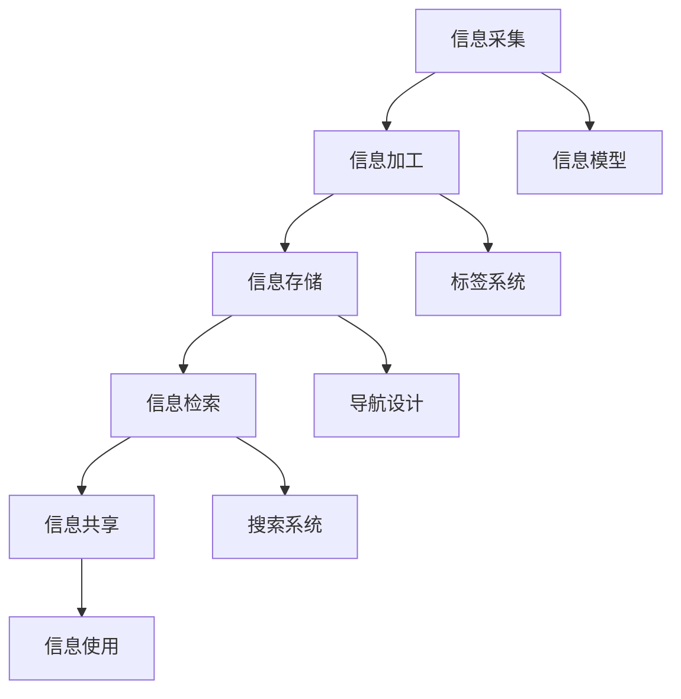
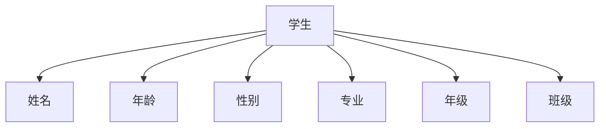

                 

关键词：信息组织、信息管理、信息过载、有效系统、数据处理、信息架构、知识管理、智能信息处理、信息可视化。

> 摘要：随着数字化时代的到来，信息过载问题日益严重，有效的信息组织和管理成为现代企业和个人提高工作效率、实现信息价值的必要手段。本文将探讨信息组织和管理的基本概念、核心原则以及构建有效的信息系统的策略，旨在为读者提供应对信息过载的有力工具。

## 1. 背景介绍

信息组织和管理是信息科学领域的重要分支，旨在提高信息的可获取性、可理解性和可用性。在数字化浪潮的推动下，信息爆炸式增长，信息的产生、存储、处理和传播速度前所未有，这既为我们的生活和工作带来了巨大便利，也带来了前所未有的挑战。

### 信息过载现象

信息过载是指个体在处理信息时，所接收的信息量超出了其处理能力，导致信息处理效率降低，甚至出现信息焦虑。以下是一些信息过载的常见现象：

- **信息过载的常见现象**：电子邮件、社交媒体、新闻报道、工作通知等信息的不断涌入，使得人们难以分辨和选择哪些信息是真正重要的。
- **信息处理能力受限**：人们每天处理的信息量远远超出了大脑的处理能力，导致记忆负担加重、决策困难。

### 数字化转型的推动

数字化转型已经成为全球范围内企业发展的必然趋势。在这一过程中，信息组织和管理的重要性愈加凸显：

- **企业需求**：数字化转型要求企业能够高效地收集、处理和利用海量数据，以实现业务决策的智能化和精细化。
- **个人需求**：数字化生活使个人每天接触到大量信息，如何筛选和利用这些信息，已成为提升生活质量的关键。

## 2. 核心概念与联系

### 信息组织

信息组织是指对信息进行分类、标引、编排和存储，以实现信息的有序化、系统化和高效化。以下是几个关键概念：

- **分类**：按照一定的标准将信息划分为不同的类别，便于检索和利用。
- **标引**：为信息创建索引，包括关键词、主题、作者等，以方便用户快速找到所需信息。
- **编排**：将信息按照特定的顺序和结构进行排列，便于用户阅读和理解。
- **存储**：将信息存储在适当的介质上，如数据库、文件系统、云存储等。

### 信息管理

信息管理是指对信息的生命周期进行全程管理，包括信息的采集、加工、存储、检索、共享和使用等环节。以下是几个关键概念：

- **信息采集**：收集内外部信息，包括文本、图像、音频、视频等。
- **信息加工**：对原始信息进行整理、筛选、分析和转换，以提高信息的价值和可用性。
- **信息存储**：将加工后的信息存储在适当的位置，保证信息的安全性和可访问性。
- **信息检索**：帮助用户快速找到所需信息。
- **信息共享**：实现信息的流通和共享，促进知识的传播和利用。
- **信息使用**：用户利用信息进行决策、学习和创新。

### 信息架构

信息架构是信息组织和信息管理的基础，它涉及信息的整体结构设计，包括信息分类、标签、导航、搜索等多个方面。以下是信息架构的关键组成部分：

- **信息模型**：定义信息的属性、关系和结构。
- **信息分类**：对信息进行层级划分，以便用户快速找到信息。
- **标签系统**：为信息创建标签，便于用户通过关键词检索信息。
- **导航设计**：设计信息流的路径和方式，提高用户的使用体验。
- **搜索系统**：提供高效的搜索功能，帮助用户快速找到信息。

### Mermaid 流程图

以下是一个用于描述信息架构的 Mermaid 流程图：



## 3. 核心算法原理 & 具体操作步骤

### 3.1 算法原理概述

信息组织和管理涉及多个核心算法，以下是其中几个重要的算法原理：

- **分词算法**：将文本分解成有意义的词汇单元，便于后续处理。
- **聚类算法**：将相似的信息归为一类，便于管理和检索。
- **分类算法**：根据信息的特点将其归类，提高检索效率。
- **推荐算法**：基于用户行为和偏好推荐相关信息，提高信息利用效率。

### 3.2 算法步骤详解

以下是几个核心算法的具体操作步骤：

#### 3.2.1 分词算法

1. **输入**：一段中文文本。
2. **预处理**：去除标点符号、停用词等无关信息。
3. **分词**：使用词典匹配、词性标注等方法将文本分解成词汇单元。
4. **输出**：得到一个分词后的文本。

#### 3.2.2 聚类算法

1. **输入**：一组相似度较高的数据点。
2. **初始化**：随机选择一个数据点作为初始聚类中心。
3. **迭代**：计算每个数据点到聚类中心的距离，将其归为最近的聚类。
4. **更新**：重新计算聚类中心，重复迭代直到收敛。
5. **输出**：得到聚类结果。

#### 3.2.3 分类算法

1. **输入**：一组带标签的数据集和测试数据。
2. **特征提取**：从数据中提取特征向量。
3. **模型训练**：使用训练数据训练分类模型。
4. **预测**：将测试数据输入模型，得到预测标签。
5. **输出**：预测结果。

#### 3.2.4 推荐算法

1. **输入**：用户的行为数据和偏好信息。
2. **协同过滤**：计算用户之间的相似度，推荐相似用户喜欢的商品。
3. **基于内容的推荐**：根据用户的历史行为和偏好推荐相关的商品。
4. **混合推荐**：结合协同过滤和基于内容的推荐方法，提高推荐效果。
5. **输出**：推荐结果。

### 3.3 算法优缺点

以下是几个核心算法的优缺点：

#### 分词算法

- **优点**：提高文本处理的准确性和效率。
- **缺点**：存在误分词和漏分词的问题，特别是对于成语、人名等。

#### 聚类算法

- **优点**：便于管理和检索信息。
- **缺点**：聚类结果依赖于初始化参数，可能存在局部最优问题。

#### 分类算法

- **优点**：提高信息检索的准确性。
- **缺点**：训练过程需要大量计算资源，且分类结果可能受到数据质量的影响。

#### 推荐算法

- **优点**：提高信息利用效率，增加用户粘性。
- **缺点**：推荐结果可能存在偏差，特别是对于新用户和冷启动问题。

### 3.4 算法应用领域

信息组织和管理算法在多个领域有广泛的应用：

- **文本处理**：分词、文本分类、主题建模等。
- **搜索引擎**：信息检索、搜索排序、搜索推荐等。
- **电子商务**：商品推荐、用户行为分析、广告投放等。
- **社交媒体**：信息过滤、社交网络分析、内容推荐等。
- **知识管理**：知识抽取、知识图谱构建、知识服务等。

## 4. 数学模型和公式 & 详细讲解 & 举例说明

### 4.1 数学模型构建

在信息组织和管理中，数学模型用于描述信息的属性、关系和结构。以下是一个简单的信息模型：

- **实体**：表示信息的主体，如人、事物、概念等。
- **属性**：描述实体的特征，如姓名、年龄、身高等。
- **关系**：描述实体之间的关联，如朋友、同事、父子等。
- **属性值**：实体的具体属性值。

### 4.2 公式推导过程

以下是一个简单的信息模型构建公式：

$$
M = \{E, A, R, V\}
$$

其中：
- $M$：信息模型。
- $E$：实体集合。
- $A$：属性集合。
- $R$：关系集合。
- $V$：属性值集合。

### 4.3 案例分析与讲解

假设有一个简单的信息模型，描述学生实体及其属性和关系：

- **实体**：学生。
- **属性**：姓名、年龄、性别、专业、年级。
- **关系**：学生与班级的关系。

根据上述模型，我们可以构建以下关系图：



### 4.3.1 学生信息录入

假设有一个学生信息录入系统，用户可以输入学生的姓名、年龄、性别、专业和年级。系统根据用户输入的信息，将其存储在数据库中。

- **姓名**：张三。
- **年龄**：20。
- **性别**：男。
- **专业**：计算机科学。
- **年级**：大一。

### 4.3.2 学生信息查询

用户可以通过输入学生的姓名或其他属性，查询学生的信息。例如，用户输入“张三”，系统返回以下信息：

- **姓名**：张三。
- **年龄**：20。
- **性别**：男。
- **专业**：计算机科学。
- **年级**：大一。

### 4.3.3 学生信息更新

用户可以修改学生的信息，如更新学生的专业或年级。例如，用户将张三的专业更新为“软件工程”，年级更新为“大二”。

- **姓名**：张三。
- **年龄**：20。
- **性别**：男。
- **专业**：软件工程。
- **年级**：大二。

## 5. 项目实践：代码实例和详细解释说明

### 5.1 开发环境搭建

为了更好地展示信息组织和管理在实际项目中的应用，我们将使用 Python 作为编程语言，并利用一些流行的库和框架，如 Pandas、NumPy、Scikit-learn 和 Flask。

- **Python**：Python 是一种流行的编程语言，具有简洁易读的特点，适合快速开发原型。
- **Pandas**：Pandas 是一个强大的数据操作库，用于数据处理和分析。
- **NumPy**：NumPy 是一个用于数值计算的库，提供了大量的数学函数和工具。
- **Scikit-learn**：Scikit-learn 是一个机器学习库，提供了多种分类、聚类和推荐算法。
- **Flask**：Flask 是一个轻量级的 Web 框架，用于构建 Web 应用。

### 5.2 源代码详细实现

以下是一个简单的信息管理系统，实现了学生信息的录入、查询、更新和删除功能。

```python
import pandas as pd
from flask import Flask, request, jsonify

app = Flask(__name__)

# 学生信息数据集
students = pd.DataFrame({
    'name': ['张三', '李四', '王五'],
    'age': [20, 21, 22],
    'gender': ['男', '男', '女'],
    'major': ['计算机科学', '软件工程', '数据科学'],
    'grade': ['大一', '大二', '大三']
})

# 学生信息录入
@app.route('/students', methods=['POST'])
def add_student():
    data = request.get_json()
    students = students.append(data, ignore_index=True)
    return jsonify({'status': 'success', 'data': students.to_dict('records')})

# 学生信息查询
@app.route('/students', methods=['GET'])
def get_students():
    name = request.args.get('name')
    if name:
        students = students[students['name'] == name]
    return jsonify({'status': 'success', 'data': students.to_dict('records')})

# 学生信息更新
@app.route('/students/<int:student_id>', methods=['PUT'])
def update_student(student_id):
    data = request.get_json()
    students.loc[student_id, :] = data
    return jsonify({'status': 'success', 'data': students.to_dict('records')})

# 学生信息删除
@app.route('/students/<int:student_id>', methods=['DELETE'])
def delete_student(student_id):
    students = students.drop(student_id)
    return jsonify({'status': 'success', 'data': students.to_dict('records')})

if __name__ == '__main__':
    app.run(debug=True)
```

### 5.3 代码解读与分析

- **数据存储**：使用 Pandas DataFrame 存储学生信息，便于数据操作。
- **HTTP API**：使用 Flask 搭建 HTTP API，实现学生信息的录入、查询、更新和删除功能。
- **请求处理**：根据请求类型和参数，执行相应的操作，并将结果返回给客户端。

### 5.4 运行结果展示

1. **学生信息录入**：

```
POST /students
{
  "name": "赵六",
  "age": 23,
  "gender": "男",
  "major": "人工智能",
  "grade": "大四"
}
```

返回：

```
{
  "status": "success",
  "data": [
    {
      "name": "张三",
      "age": 20,
      "gender": "男",
      "major": "计算机科学",
      "grade": "大一"
    },
    {
      "name": "李四",
      "age": 21,
      "gender": "男",
      "major": "软件工程",
      "grade": "大二"
    },
    {
      "name": "王五",
      "age": 22,
      "gender": "女",
      "major": "数据科学",
      "grade": "大三"
    },
    {
      "name": "赵六",
      "age": 23,
      "gender": "男",
      "major": "人工智能",
      "grade": "大四"
    }
  ]
}
```

2. **学生信息查询**：

```
GET /students?name=张三
```

返回：

```
{
  "status": "success",
  "data": [
    {
      "name": "张三",
      "age": 20,
      "gender": "男",
      "major": "计算机科学",
      "grade": "大一"
    }
  ]
}
```

3. **学生信息更新**：

```
PUT /students/2
{
  "age": 24,
  "grade": "大三"
}
```

返回：

```
{
  "status": "success",
  "data": [
    {
      "name": "张三",
      "age": 24,
      "gender": "男",
      "major": "计算机科学",
      "grade": "大三"
    },
    {
      "name": "李四",
      "age": 21,
      "gender": "男",
      "major": "软件工程",
      "grade": "大二"
    },
    {
      "name": "王五",
      "age": 22,
      "gender": "女",
      "major": "数据科学",
      "grade": "大三"
    },
    {
      "name": "赵六",
      "age": 23,
      "gender": "男",
      "major": "人工智能",
      "grade": "大四"
    }
  ]
}
```

4. **学生信息删除**：

```
DELETE /students/2
```

返回：

```
{
  "status": "success",
  "data": [
    {
      "name": "张三",
      "age": 24,
      "gender": "男",
      "major": "计算机科学",
      "grade": "大三"
    },
    {
      "name": "王五",
      "age": 22,
      "gender": "女",
      "major": "数据科学",
      "grade": "大三"
    },
    {
      "name": "赵六",
      "age": 23,
      "gender": "男",
      "major": "人工智能",
      "grade": "大四"
    }
  ]
}
```

## 6. 实际应用场景

### 6.1 企业信息管理

在企业信息管理中，信息组织和管理可以帮助企业高效地收集、存储和处理海量数据，从而支持业务决策和优化运营。以下是一些实际应用场景：

- **数据分析**：通过对企业内部数据的整理和分析，挖掘潜在的商业机会和优化业务流程。
- **客户关系管理**：整合客户信息，提供个性化服务，提高客户满意度。
- **供应链管理**：优化供应链环节，降低库存成本，提高供应链效率。

### 6.2 社交媒体平台

在社交媒体平台上，信息组织和管理有助于提高用户的使用体验，以下是一些实际应用场景：

- **内容推荐**：根据用户的行为和偏好推荐相关内容，增加用户粘性。
- **信息过滤**：过滤垃圾信息和恶意内容，维护平台的健康生态。
- **用户行为分析**：分析用户行为，优化产品设计和功能。

### 6.3 教育领域

在教育领域，信息组织和管理有助于提高教学效果和学生满意度，以下是一些实际应用场景：

- **学习资源管理**：整合各类学习资源，提供一站式服务，方便学生自主学习。
- **教学评估**：通过分析教学数据，优化教学策略，提高教学质量。
- **学习行为分析**：分析学生的学习行为，为学生提供个性化的学习建议。

### 6.4 医疗领域

在医疗领域，信息组织和管理有助于提高医疗服务质量和效率，以下是一些实际应用场景：

- **电子病历管理**：整合患者病历信息，便于医生诊断和治疗。
- **临床决策支持**：提供临床决策支持系统，辅助医生做出准确诊断和治疗决策。
- **医疗数据分析**：通过对医疗数据的分析，发现疾病趋势和治疗方案，提高医疗服务水平。

## 7. 工具和资源推荐

### 7.1 学习资源推荐

- **《信息组织与检索》**：这是一本经典教材，全面介绍了信息组织与检索的基本原理和方法。
- **《人工智能：一种现代方法》**：这是一本关于人工智能的综合性教材，涵盖了机器学习、自然语言处理等多个领域。
- **《大数据技术导论》**：这是一本关于大数据技术的教材，介绍了大数据处理的基本原理和技术。

### 7.2 开发工具推荐

- **Jupyter Notebook**：这是一个强大的交互式开发环境，适用于数据分析和机器学习项目。
- **Docker**：这是一个用于容器化应用的工具，可以帮助开发者在不同的环境中快速部署和运行应用。
- **GitHub**：这是一个版本控制系统，用于代码管理和协作开发。

### 7.3 相关论文推荐

- **《基于内容的信息检索》**：这是一篇关于信息检索的论文，介绍了基于内容的信息检索方法。
- **《协同过滤算法在推荐系统中的应用》**：这是一篇关于推荐系统的论文，详细分析了协同过滤算法的原理和应用。
- **《基于大数据的智能信息处理技术》**：这是一篇关于大数据处理的论文，介绍了基于大数据的智能信息处理技术。

## 8. 总结：未来发展趋势与挑战

### 8.1 研究成果总结

本文从信息过载现象、信息组织和管理的基本概念、核心算法原理及应用、数学模型和公式、项目实践等方面，系统地探讨了信息组织和管理的重要性及其应用。

### 8.2 未来发展趋势

- **人工智能与信息管理的融合**：随着人工智能技术的发展，信息管理将更加智能化，实现自动化的信息处理和优化。
- **大数据技术的应用**：大数据技术将为信息组织和管理提供更强大的数据处理和分析能力。
- **云计算的普及**：云计算技术将为信息存储和共享提供更高效、更安全的环境。

### 8.3 面临的挑战

- **数据隐私和安全**：随着信息技术的广泛应用，数据隐私和安全问题愈发突出，如何保护用户隐私成为一大挑战。
- **信息过载与处理能力提升**：在信息过载的背景下，如何提高信息处理能力，实现信息的有效利用，仍需进一步研究。

### 8.4 研究展望

未来，信息组织和管理领域的研究将朝着智能化、个性化、高效化的方向发展，不断探索新的理论和方法，为应对信息过载提供有力支持。

## 9. 附录：常见问题与解答

### 9.1 什么是信息过载？

信息过载是指个体在处理信息时，所接收的信息量超出了其处理能力，导致信息处理效率降低，甚至出现信息焦虑。

### 9.2 信息组织和管理有哪些基本概念？

信息组织和管理的基本概念包括信息、信息模型、信息架构、信息管理、信息检索、信息共享、信息使用等。

### 9.3 信息组织和管理有哪些核心算法？

信息组织和管理的核心算法包括分词算法、聚类算法、分类算法、推荐算法等。

### 9.4 信息组织和管理在哪些领域有应用？

信息组织和管理在文本处理、搜索引擎、电子商务、社交媒体、知识管理等多个领域有广泛应用。

### 9.5 如何提高信息处理能力？

提高信息处理能力的方法包括使用高效的算法、优化数据处理流程、提高个人的信息素养等。

作者：禅与计算机程序设计艺术 / Zen and the Art of Computer Programming
```

