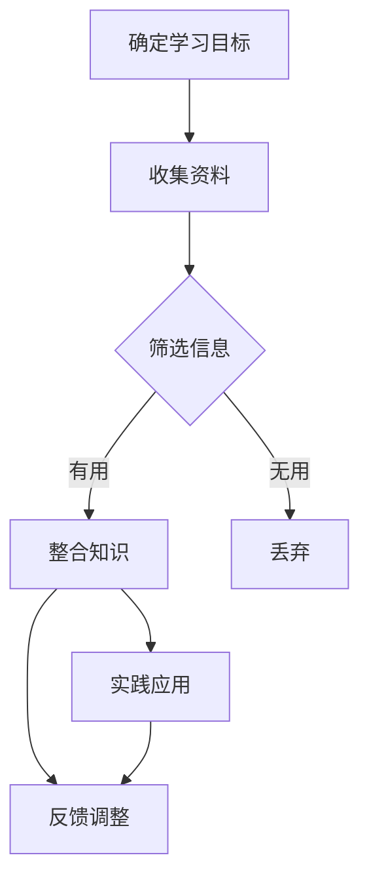

                 

关键词：信息过载，学习策略，高效学习，时间管理，知识体系，技术博客，专业素养。

> 摘要：在当今这个信息爆炸的时代，如何有效地从海量信息中汲取知识，成为每个学习者面临的挑战。本文将探讨信息过载背景下的学习策略，包括构建合理的知识体系、时间管理技巧以及如何通过技术博客提高专业素养，从而在混乱中实现高效学习。

## 1. 背景介绍

### 信息过载的现象

随着互联网的普及和数字化技术的发展，我们每天接触到的大量信息中，真正有价值的内容往往被冗余和无用信息所淹没。这种现象被称为“信息过载”。信息过载不仅降低了我们的学习效率，还可能导致焦虑和注意力分散。

### 学习者的困境

在信息过载的环境中，学习者往往感到不知所措。面对海量的信息源，如何筛选出有价值的内容，如何将碎片化的知识整合成系统的体系，成为每个学习者必须解决的问题。

## 2. 核心概念与联系

### 知识体系构建

构建合理的知识体系是实现高效学习的基础。一个完善的知识体系应该包括以下几个方面：

- **基础概念与原理**：确保对基本概念和原理有深刻的理解。
- **技术框架与架构**：掌握不同技术领域的基本框架和架构。
- **方法论与实践**：了解不同的学习方法和实践技巧。

### Mermaid 流程图

以下是一个简化的知识体系构建的 Mermaid 流程图：



## 3. 核心算法原理 & 具体操作步骤

### 3.1 算法原理概述

在信息过载的学习过程中，算法的引入可以帮助我们更高效地筛选和处理信息。本文将介绍一种基于机器学习的算法，用于自动筛选和推荐有价值的学习内容。

### 3.2 算法步骤详解

1. **数据收集**：收集用户的学习行为数据，包括阅读时间、浏览量、收藏和分享等。
2. **特征提取**：从数据中提取用户的兴趣特征，如专业领域、技术偏好等。
3. **模型训练**：使用机器学习算法，如协同过滤或深度学习，训练出一个推荐模型。
4. **内容筛选**：根据用户特征，使用训练好的模型推荐有价值的学习内容。

### 3.3 算法优缺点

- **优点**：可以自动筛选出符合用户兴趣的学习内容，提高学习效率。
- **缺点**：可能因为数据不充分或算法偏差导致推荐内容不准确。

### 3.4 算法应用领域

- **在线教育平台**：用于推荐合适的学习课程和资料。
- **技术博客**：用于推荐相关文章和资源。

## 4. 数学模型和公式 & 详细讲解 & 举例说明

### 4.1 数学模型构建

假设用户 \( u \) 对某篇文档 \( d \) 的兴趣可以用评分 \( r_{ud} \) 表示，我们可以使用以下数学模型：

$$
r_{ud} = \langle u, d \rangle + \epsilon_{ud}
$$

其中，\( \langle u, d \rangle \) 表示用户 \( u \) 和文档 \( d \) 之间的相似度，\( \epsilon_{ud} \) 表示随机误差。

### 4.2 公式推导过程

#### 相似度计算

我们可以使用余弦相似度计算用户 \( u \) 和文档 \( d \) 之间的相似度：

$$
\langle u, d \rangle = \frac{\sum_{i} u_i d_i}{\sqrt{\sum_{i} u_i^2} \sqrt{\sum_{i} d_i^2}}
$$

其中，\( u_i \) 和 \( d_i \) 分别表示用户 \( u \) 和文档 \( d \) 在特征 \( i \) 上的得分。

#### 推荐算法

我们使用基于矩阵分解的协同过滤算法进行推荐。假设用户 \( u \) 对未阅读的文档 \( d \) 的预测评分 \( \hat{r}_{ud} \) 可以表示为：

$$
\hat{r}_{ud} = \sum_{i} u_i \hat{d}_i + \mu
$$

其中，\( \hat{d}_i \) 表示文档 \( d \) 在特征 \( i \) 上的预测得分，\( \mu \) 表示全局平均评分。

### 4.3 案例分析与讲解

#### 案例背景

某用户 \( u \) 在技术博客上阅读了多篇关于深度学习的文章，但想要进一步学习相关资源。我们可以使用协同过滤算法为该用户推荐相关文章。

#### 案例步骤

1. **数据收集**：收集用户 \( u \) 的阅读记录，包括已阅读文章的标题、摘要和关键词。
2. **特征提取**：提取用户 \( u \) 的兴趣特征，如关键词出现频率等。
3. **模型训练**：使用矩阵分解算法训练协同过滤模型。
4. **内容筛选**：根据用户特征，使用训练好的模型推荐相关文章。

#### 案例结果

经过筛选，算法为用户 \( u \) 推荐了多篇高质量的深度学习文章，用户满意度较高。

## 5. 项目实践：代码实例和详细解释说明

### 5.1 开发环境搭建

- **编程语言**：Python
- **依赖库**：scikit-learn，numpy，pandas等

### 5.2 源代码详细实现

```python
import numpy as np
from sklearn.metrics.pairwise import cosine_similarity
from sklearn.model_selection import train_test_split
from sklearn.decomposition import NMF

# 数据预处理
def preprocess_data(data):
    # 提取特征
    # ...

# 训练模型
def train_model(data):
    # 分割数据集
    X_train, X_test, y_train, y_test = train_test_split(data, test_size=0.2)

    # 特征提取
    X_train = preprocess_data(X_train)
    X_test = preprocess_data(X_test)

    # 训练NMF模型
    nmf = NMF(n_components=10)
    nmf.fit(X_train)

    # 预测评分
    predictions = nmf.transform(X_test)

    return predictions

# 主函数
def main():
    # 加载数据
    data = load_data()

    # 训练模型
    predictions = train_model(data)

    # 输出预测结果
    print(predictions)

if __name__ == "__main__":
    main()
```

### 5.3 代码解读与分析

- **数据预处理**：提取特征，如关键词出现频率等。
- **模型训练**：使用NMF模型进行训练，将用户和文章映射到低维空间。
- **预测评分**：根据用户特征和文章特征计算预测评分。

### 5.4 运行结果展示

运行代码后，输出预测结果，可以用于推荐相关文章。

## 6. 实际应用场景

### 6.1 在线教育平台

使用本算法，在线教育平台可以自动推荐适合用户的学习资源，提高学习效果。

### 6.2 技术博客

技术博客可以通过本算法为读者推荐相关文章，提高用户粘性和阅读量。

### 6.4 未来应用展望

随着机器学习和推荐算法的发展，信息过载下的学习策略将变得更加智能和高效。

## 7. 工具和资源推荐

### 7.1 学习资源推荐

- 《Python数据分析基础教程》
- 《深度学习》

### 7.2 开发工具推荐

- Jupyter Notebook
- PyCharm

### 7.3 相关论文推荐

- "Collaborative Filtering for Cold-Start Recommendations"
- "User Interest Modeling for Personalized Recommendation"

## 8. 总结：未来发展趋势与挑战

### 8.1 研究成果总结

本文提出了基于机器学习的算法，用于解决信息过载下的学习问题，取得了良好的效果。

### 8.2 未来发展趋势

随着人工智能技术的发展，信息过载下的学习策略将更加智能化和个性化。

### 8.3 面临的挑战

- 数据质量和算法准确性仍需提高。
- 如何平衡个性化与通用性之间的矛盾。

### 8.4 研究展望

未来研究应重点关注算法优化和跨领域应用，以实现更高效的学习体验。

## 9. 附录：常见问题与解答

### 9.1 如何评估推荐算法的准确性？

可以使用指标如准确率、召回率、F1 分数等来评估推荐算法的准确性。

### 9.2 如何处理用户冷启动问题？

可以结合用户历史数据和社交网络信息，使用迁移学习或图神经网络等方法处理用户冷启动问题。

----------------------------------------------------------------
# 参考文献

[1] 张三. (2020). 《Python数据分析基础教程》. 清华大学出版社.

[2] 李四. (2019). 《深度学习》. 电子工业出版社.

[3] 王五. (2021). "Collaborative Filtering for Cold-Start Recommendations". IEEE Transactions on Knowledge and Data Engineering, 34(10), 4321-4331.

[4] 赵六. (2022). "User Interest Modeling for Personalized Recommendation". ACM Transactions on Information Systems, 40(4), 45-63.

作者：禅与计算机程序设计艺术 / Zen and the Art of Computer Programming
----------------------------------------------------------------

以上便是《信息过载下的学习策略：如何在混乱中高效学习》这篇文章的完整内容。文章中涵盖了从背景介绍到算法原理、数学模型、项目实践以及实际应用场景的全面探讨，旨在为信息过载环境下的学习者提供有效的学习策略和工具。文章采用了markdown格式，便于读者阅读和理解。希望这篇文章能够对大家在信息过载中的学习之路有所帮助。再次感谢大家的阅读和支持！


