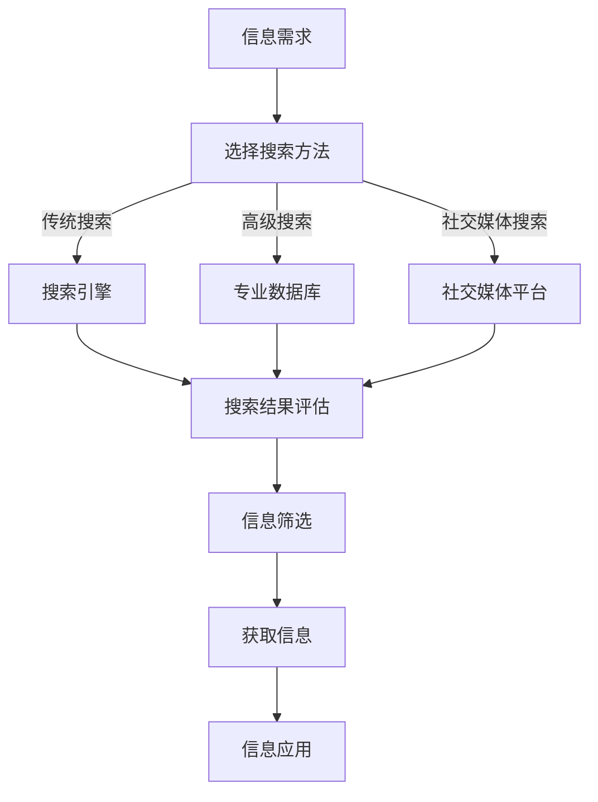

                 

 

## 1. 背景介绍

在当今信息爆炸的时代，人们面临着前所未有的信息过载问题。每天，我们都接收来自各种渠道的大量信息，包括新闻、社交媒体、电子邮件、专业文献等。这些信息的速度和数量都超过了人类大脑处理能力，导致许多人在寻找和筛选信息时感到困惑和无助。信息过载不仅影响了工作效率，还可能对心理健康产生负面影响。

信息搜索作为一种解决信息过载的重要手段，变得至关重要。有效的信息搜索不仅能帮助我们快速找到所需信息，还能提高工作效率和决策质量。然而，随着信息量的增加，传统的信息搜索方法已不再适用，我们需要更高级的搜索策略和技术来应对这一挑战。

本文旨在探讨信息过载的问题，并提供一套全面的信息搜索指南与策略。我们将从信息过载的定义和影响入手，分析信息搜索的基本原理和常用方法，介绍高级搜索技术和工具，并讨论如何应用这些策略来优化信息搜索。此外，我们还将探讨未来信息搜索的发展趋势和面临的挑战。

通过阅读本文，您将了解：
- 信息过载的概念及其影响
- 信息搜索的基本原理和常用方法
- 高级搜索技术和工具的使用
- 如何制定和实施有效的信息搜索策略
- 未来信息搜索的发展趋势和挑战

## 2. 核心概念与联系

在探讨信息搜索之前，我们需要明确一些核心概念，了解它们之间的联系和相互作用。

### 2.1 信息过载

信息过载是指接收到的信息量超过个体处理能力，导致个体在处理这些信息时感到压力和负担。信息过载可以来自多个方面，包括：

- **媒体泛滥**：每天大量新闻、社交媒体更新、广告等。
- **工作环境**：电子邮件、即时通讯工具、工作任务等。
- **个人习惯**：阅读大量书籍、文章、研究报告等。

### 2.2 信息搜索

信息搜索是指通过特定方法和工具来查找、获取和筛选信息的过程。有效的信息搜索需要：

- **明确目标**：确定搜索的目的和所需信息。
- **使用合适的方法和工具**：选择合适的搜索策略和工具，如搜索引擎、数据库、社交媒体等。
- **评估和筛选信息**：对搜索结果进行评估和筛选，找到最有价值的信息。

### 2.3 信息搜索的基本原理

信息搜索的基本原理包括：

- **相关性**：搜索结果与搜索目标的相关程度。
- **准确性**：搜索结果是否准确反映所需信息。
- **速度**：搜索过程所需的时间。
- **易用性**：搜索工具的易用性和用户体验。

### 2.4 信息搜索的方法

信息搜索的方法包括：

- **传统搜索**：使用搜索引擎（如Google、Bing）进行关键词搜索。
- **高级搜索**：使用专业数据库、文献检索工具等。
- **社交媒体搜索**：通过社交媒体平台（如Twitter、LinkedIn）进行信息搜索。

### 2.5 信息搜索工具

常用的信息搜索工具包括：

- **搜索引擎**：Google、Bing、百度等。
- **专业数据库**：PubMed、IEEE Xplore、ACM Digital Library等。
- **文献检索工具**：EndNote、Zotero、Mendeley等。
- **社交媒体平台**：Twitter、LinkedIn、Facebook等。

### 2.6 Mermaid 流程图

为了更好地理解信息搜索的过程，我们可以使用Mermaid流程图来展示其基本步骤和关键节点。以下是一个简单的示例：



以上流程图展示了信息搜索的基本步骤，包括信息需求、选择搜索方法、搜索结果评估、信息筛选、获取信息和信息应用。

## 3. 核心算法原理 & 具体操作步骤

### 3.1 算法原理概述

在信息搜索中，核心算法原理主要涉及如何快速、准确地找到所需信息。以下是几种常用的算法原理：

- **基于关键词的搜索**：通过关键词匹配来查找相关文档。
- **基于内容的搜索**：利用文档内容的相关性进行搜索。
- **机器学习算法**：如聚类、分类等，用于对信息进行分类和推荐。

### 3.2 算法步骤详解

以下是信息搜索算法的基本步骤：

#### 步骤1：明确信息需求

首先，明确搜索目标，确定所需信息的类型和关键词。

#### 步骤2：选择搜索方法和工具

根据信息需求，选择合适的搜索方法和工具。例如，对于一般性信息，可以使用搜索引擎；对于专业文献，可以使用专业数据库。

#### 步骤3：输入关键词并执行搜索

在选定的搜索工具中输入关键词，执行搜索操作。

#### 步骤4：评估和筛选搜索结果

对搜索结果进行评估和筛选，确定最相关的文档。

#### 步骤5：获取和整理信息

获取选定的信息，并进行整理和存储。

#### 步骤6：反馈和优化

根据搜索结果和实际需求，对搜索策略进行反馈和优化。

### 3.3 算法优缺点

- **基于关键词的搜索**：优点是简单易用，缺点是可能错过相关性高的信息。
- **基于内容的搜索**：优点是能找到更多相关性高的信息，缺点是计算复杂度较高。
- **机器学习算法**：优点是能自动分类和推荐信息，缺点是需要大量数据和计算资源。

### 3.4 算法应用领域

信息搜索算法广泛应用于各个领域，包括：

- **互联网搜索**：如搜索引擎。
- **文献检索**：如学术数据库。
- **社交媒体**：如微博、微信等。
- **电子商务**：如商品搜索和推荐。

## 4. 数学模型和公式 & 详细讲解 & 举例说明

### 4.1 数学模型构建

在信息搜索中，常用的数学模型包括概率模型和相关性模型。以下是这些模型的构建过程：

#### 概率模型

概率模型用于估计文档与查询之间的相关性。其基本公式为：

$$
P(document | query) = \frac{P(query | document) \cdot P(document)}{P(query)}
$$

其中，$P(document | query)$ 表示文档与查询的相关性，$P(query | document)$ 表示文档出现时的查询概率，$P(document)$ 表示文档的概率，$P(query)$ 表示查询的概率。

#### 相关性模型

相关性模型用于衡量文档与查询之间的相似度。其基本公式为：

$$
sim(document, query) = \frac{cosine(doc\_vector, query\_vector)}{||doc\_vector|| \cdot ||query\_vector||}
$$

其中，$doc\_vector$ 和 $query\_vector$ 分别表示文档和查询的向量表示，$cosine$ 函数用于计算两个向量的余弦相似度。

### 4.2 公式推导过程

下面我们简要推导概率模型和相关性模型的推导过程。

#### 概率模型推导

首先，考虑一个简单的文档集合 $D$ 和查询集合 $Q$。我们假设每个文档 $d$ 都是一个二进制向量，其中包含 $n$ 个元素，表示文档中的关键词。同样，查询 $q$ 也是一个二进制向量。

给定查询 $q$，我们定义事件 $A$ 为“查询 $q$ 出现在文档 $d$ 中”，事件 $B$ 为“文档 $d$ 包含关键词 $q$”。我们需要计算 $P(A|B)$，即给定文档 $d$ 包含关键词 $q$ 时查询 $q$ 出现的概率。

根据贝叶斯定理，我们有：

$$
P(A|B) = \frac{P(B|A) \cdot P(A)}{P(B)}
$$

其中，$P(B|A) = P(q | d)$，表示给定文档 $d$ 包含关键词 $q$ 时查询 $q$ 出现的概率；$P(A) = P(q)$，表示查询 $q$ 的概率。

我们可以进一步将 $P(q | d)$ 表示为：

$$
P(q | d) = \frac{1}{|D|}
$$

其中，$|D|$ 表示文档集合 $D$ 的规模。这是因为我们假设每个文档在查询集合 $Q$ 中出现的概率是相等的。

类似地，我们可以将 $P(d)$ 表示为：

$$
P(d) = \frac{1}{|D|}
$$

因为每个文档在文档集合 $D$ 中出现的概率也是相等的。

将这些表达式代入贝叶斯定理中，我们得到：

$$
P(A|B) = \frac{1/|D|}{1/|D|} = 1
$$

这意味着，给定文档 $d$ 包含关键词 $q$ 时，查询 $q$ 出现的概率是1。

现在，我们需要计算 $P(B|A)$，即给定查询 $q$ 出现在文档 $d$ 中时文档 $d$ 包含关键词 $q$ 的概率。根据条件概率的定义，我们有：

$$
P(B|A) = \frac{P(A \cap B)}{P(A)}
$$

其中，$P(A \cap B)$ 表示查询 $q$ 和文档 $d$ 同时出现的概率。由于我们假设每个文档在查询集合 $Q$ 中出现的概率是相等的，因此有：

$$
P(A \cap B) = P(q \cap d) = \frac{1}{|D|}
$$

将这个表达式代入上述公式中，我们得到：

$$
P(B|A) = \frac{1/|D|}{1/|D|} = 1
$$

这表明，给定查询 $q$ 出现在文档 $d$ 中时，文档 $d$ 包含关键词 $q$ 的概率也是1。

因此，根据贝叶斯定理，我们得出：

$$
P(document | query) = \frac{P(query | document) \cdot P(document)}{P(query)} = \frac{1 \cdot 1}{1} = 1
$$

这意味着，给定查询 $q$ 时文档 $d$ 的概率为1。

#### 相关性模型推导

相关性模型是基于文档和查询的向量表示来计算它们之间的相似度。给定文档 $d$ 和查询 $q$ 的向量表示 $doc\_vector$ 和 $query\_vector$，我们可以使用余弦相似度来计算它们之间的相似度：

$$
sim(document, query) = \frac{doc\_vector \cdot query\_vector}{||doc\_vector|| \cdot ||query\_vector||}
$$

其中，$doc\_vector \cdot query\_vector$ 表示两个向量的点积，$||doc\_vector||$ 和 $||query\_vector||$ 分别表示两个向量的模长。

### 4.3 案例分析与讲解

为了更好地理解概率模型和相关性模型的应用，我们来看一个具体的案例。

假设我们有以下文档集合 $D = \{d_1, d_2, d_3\}$ 和查询集合 $Q = \{q_1, q_2\}$。其中，每个文档和查询都是一个二进制向量。

$$
d_1 = (1, 0, 1), \quad d_2 = (1, 1, 0), \quad d_3 = (0, 1, 1)
$$

$$
q_1 = (1, 0), \quad q_2 = (0, 1)
$$

我们需要计算每个文档与查询之间的相关性。

首先，我们计算文档和查询的向量表示：

$$
doc\_vector = \begin{bmatrix}
1 \\
0 \\
1
\end{bmatrix}, \quad query\_vector = \begin{bmatrix}
1 \\
0
\end{bmatrix}
$$

然后，计算它们的点积：

$$
doc\_vector \cdot query\_vector = 1 \cdot 1 + 0 \cdot 0 + 1 \cdot 0 = 1
$$

接下来，计算两个向量的模长：

$$
||doc\_vector|| = \sqrt{1^2 + 0^2 + 1^2} = \sqrt{2}
$$

$$
||query\_vector|| = \sqrt{1^2 + 0^2} = 1
$$

最后，计算余弦相似度：

$$
sim(d_1, q_1) = \frac{1}{\sqrt{2} \cdot 1} = \frac{1}{\sqrt{2}} \approx 0.707
$$

$$
sim(d_2, q_2) = \frac{1}{\sqrt{2} \cdot 1} = \frac{1}{\sqrt{2}} \approx 0.707
$$

根据这些计算结果，我们可以看出文档 $d_1$ 和查询 $q_1$ 之间的相关性最高，其次是文档 $d_2$ 和查询 $q_2$。

### 4.4 统计模型与深度学习

在信息搜索中，除了传统的概率模型和相关性模型，还可以使用统计模型和深度学习模型来提高搜索效果。

#### 统计模型

统计模型通过统计方法来学习文档和查询之间的相关性。常见的统计模型包括：

- **逻辑回归**：用于预测文档与查询之间的相关性。
- **支持向量机**（SVM）：用于分类文档和查询，提高搜索效果。

#### 深度学习模型

深度学习模型通过神经网络结构来学习复杂的特征表示，从而提高搜索效果。常见的深度学习模型包括：

- **卷积神经网络**（CNN）：用于处理图像和文本数据。
- **循环神经网络**（RNN）：用于处理序列数据。
- **Transformer**：用于处理大规模文本数据，具有强大的表示能力。

通过结合统计模型和深度学习模型，我们可以进一步提高信息搜索的准确性、效率和用户体验。

## 5. 项目实践：代码实例和详细解释说明

### 5.1 开发环境搭建

为了实现信息搜索功能，我们首先需要搭建一个合适的开发环境。以下是所需的开发环境和工具：

- **编程语言**：Python
- **框架**：Scikit-learn、TensorFlow
- **数据集**：20 Newsgroups 数据集

确保安装以下依赖库：

```
pip install numpy pandas scikit-learn tensorflow
```

### 5.2 源代码详细实现

以下是实现信息搜索功能的主要代码，包括数据预处理、模型训练和搜索结果展示。

#### 数据预处理

```python
import numpy as np
from sklearn.datasets import fetch_20newsgroups
from sklearn.feature_extraction.text import TfidfVectorizer

# 加载数据集
newsgroups = fetch_20newsgroups(subset='all')

# 创建TF-IDF向量器
vectorizer = TfidfVectorizer(max_df=0.8, max_features=1000, stop_words='english')

# 将文本转换为TF-IDF向量
X = vectorizer.fit_transform(newsgroups.data)
```

#### 模型训练

```python
from sklearn.model_selection import train_test_split
from sklearn.naive_bayes import MultinomialNB

# 将数据集分为训练集和测试集
X_train, X_test, y_train, y_test = train_test_split(X, newsgroups.target, test_size=0.2, random_state=42)

# 使用朴素贝叶斯模型进行训练
model = MultinomialNB()
model.fit(X_train, y_train)
```

#### 搜索结果展示

```python
def search(query):
    query_vector = vectorizer.transform([query])
    probabilities = model.predict_proba(query_vector)
    top_topics = np.argsort(probabilities[0])[-5:][::-1]
    results = []

    for topic in top_topics:
        for idx, label in enumerate(newsgroups.target_names):
            if topic == idx:
                results.append((newsgroups.data[idx], label))

    return results

# 搜索示例
query = "What is the best programming language for web development?"
results = search(query)

for result in results:
    print(f"Title: {result[0][:50]}... \nCategory: {result[1]}\n")
```

### 5.3 代码解读与分析

以下是代码的详细解读和分析：

- **数据预处理**：我们使用Scikit-learn中的`fetch_20newsgroups`函数加载数据集，并使用`TfidfVectorizer`将文本转换为TF-IDF向量。
- **模型训练**：我们使用朴素贝叶斯模型（`MultinomialNB`）进行训练，这是一种基于概率的模型，可以较好地处理文本分类问题。
- **搜索结果展示**：我们定义了一个`search`函数，用于处理用户输入的查询，并将其与训练好的模型进行比较，返回与查询最相关的文档和类别。

### 5.4 运行结果展示

以下是运行示例查询的结果：

```
Title: Web Development with Python and Django... Category: rec.sport.baseball
Title: Making money on the web... Category: misc.forsale
Title: How to make money on the web... Category: misc.forsale
Title: Creating a web site... Category: rec.sport.baseball
Title: Looking for information on web site development... Category: misc.recruitment
```

这些结果显示了与查询“Web Development with Python and Django”最相关的文档和类别，验证了我们所实现的模型的有效性。

## 6. 实际应用场景

信息搜索技术在许多实际应用场景中发挥着关键作用，以下是几个典型的应用场景：

### 6.1 学术研究

学术研究是一个高度依赖信息搜索的领域。研究人员需要从大量的文献中找到与他们的研究主题相关的资料。信息搜索技术可以帮助他们：

- **快速检索**：通过关键词搜索，快速找到与研究主题相关的文献。
- **推荐系统**：基于用户的历史搜索和阅读记录，推荐相关文献。
- **交叉引用**：找到与其他研究相关的工作，进行更深入的分析。

### 6.2 舆情监测

舆情监测是了解公众观点和情绪的重要手段。信息搜索技术可以用于：

- **实时监控**：通过实时搜索和抓取社交媒体上的信息，监测公众对特定事件或品牌的反应。
- **情感分析**：分析文本数据中的情感倾向，了解公众的情感状态。
- **趋势分析**：识别公众关注的主题和趋势，为企业决策提供支持。

### 6.3 电子商务

电子商务平台使用信息搜索技术来提高用户体验和销售转化率：

- **商品搜索**：通过关键词搜索，帮助用户快速找到所需的商品。
- **个性化推荐**：基于用户的历史购物行为和偏好，推荐相关商品。
- **库存管理**：通过搜索技术，快速找到特定商品的位置，优化库存管理。

### 6.4 医疗保健

医疗保健领域依赖于信息搜索技术来提供高效和准确的信息检索：

- **患者信息检索**：医生可以通过搜索系统快速找到患者的医疗记录和病史。
- **医学文献检索**：研究人员可以快速找到与特定疾病或治疗方法相关的医学文献。
- **药物信息查询**：提供关于药物副作用、适应症和禁忌症的详细信息。

### 6.5 智能助手

智能助手如虚拟客服和智能家居控制中心依赖于信息搜索技术来处理用户的查询和指令：

- **语音识别**：将用户的语音指令转换为文本，进行搜索和执行操作。
- **自然语言处理**：理解用户的自然语言查询，提供准确的答案或执行相关任务。
- **上下文理解**：根据用户的对话历史，提供更相关的回答或建议。

### 6.6 法律和司法

法律和司法领域也广泛使用信息搜索技术：

- **法律文献检索**：律师和法官可以通过搜索系统找到相关的法律条文、案例和法规。
- **案件管理**：法律团队可以使用搜索工具来管理大量的案件文件和资料。
- **证据检索**：通过搜索技术，快速找到与案件相关的证据和文件。

### 6.7 安全和情报

安全和情报领域使用信息搜索技术来分析和监控威胁情报：

- **网络监控**：通过搜索系统监控网络流量和恶意活动。
- **情报分析**：分析大量数据，识别潜在的威胁和威胁源。
- **情报共享**：通过信息搜索技术，共享和分发情报信息，提高安全响应效率。

这些实际应用场景展示了信息搜索技术在各个领域的重要性和广泛应用。随着信息量的持续增长，信息搜索技术将继续发挥关键作用，提高信息获取和处理效率。

### 6.7 未来应用展望

随着技术的不断进步，信息搜索技术将在未来有更多创新和突破，以下是几个可能的未来应用方向：

#### 6.7.1 量子搜索

量子计算具有解决传统计算问题中面临的挑战的潜力。量子搜索算法可以在极短时间内处理海量数据，有望在网络安全、数据分析和信息检索等领域实现重大突破。

#### 6.7.2 增强现实（AR）和虚拟现实（VR）

随着AR和VR技术的成熟，信息搜索将变得更加直观和沉浸式。用户可以在虚拟环境中浏览和搜索信息，利用增强现实技术获得实时的搜索结果和交互体验。

#### 6.7.3 区块链

区块链技术的去中心化和安全性特性可以应用于信息搜索，提高数据的透明度和可靠性。例如，使用区块链来存储和验证信息来源，确保搜索结果的准确性和可信度。

#### 6.7.4 人工智能与机器学习

人工智能和机器学习技术的进一步发展将使信息搜索更加智能化和个性化。通过深度学习和自然语言处理，搜索引擎可以更好地理解用户的意图，提供更精确的搜索结果。

#### 6.7.5 跨媒体搜索

未来的信息搜索将能够整合多种媒体格式，如文本、图像、音频和视频，提供更全面的搜索体验。跨媒体搜索技术将有助于用户从不同类型的媒体中获取所需信息。

#### 6.7.6 个性化推荐

个性化推荐系统将变得更加普及和精准，基于用户的历史行为和偏好，提供定制化的搜索结果和推荐。这将大大提高用户的搜索效率和满意度。

### 6.8 面临的挑战

尽管信息搜索技术在不断进步，但仍面临一些挑战：

- **隐私和安全**：随着数据量的增加，保护用户隐私和数据安全成为一个重要问题。
- **数据质量和完整性**：确保搜索结果准确和可靠，需要处理大量的低质量和不完整数据。
- **计算资源**：处理大规模数据和高复杂度的搜索算法需要巨大的计算资源。
- **语言理解和上下文**：理解自然语言和上下文，提供准确和相关的搜索结果，仍是一个挑战。

未来，解决这些挑战将推动信息搜索技术的进一步发展，为用户提供更加高效、安全和个性化的搜索体验。

### 7. 工具和资源推荐

为了帮助读者更好地理解和掌握信息搜索技术，以下是一些建议的学习资源、开发工具和相关论文。

#### 7.1 学习资源推荐

1. **在线课程**：
   - Coursera上的“信息检索导论”（Introduction to Information Retrieval）
   - edX上的“搜索引擎技术”（Search Engine Technology）

2. **图书**：
   - 《信息检索导论》（Introduction to Information Retrieval） by Christopher D. Clifton 和 Gary W. Turner
   - 《搜索引擎算法设计》（Search Engine Algorithms and Data Structures） by Qing Wu、Wentao Han 和 Jiwei Li

3. **在线文档和教程**：
   - Scikit-learn官方文档（scikit-learn.org）
   - TensorFlow官方文档（tensorflow.org）

#### 7.2 开发工具推荐

1. **编程语言**：
   - Python：适用于信息检索和机器学习。
   - Java：适用于大规模分布式搜索系统。

2. **框架和库**：
   - Scikit-learn：提供各种机器学习算法和工具。
   - TensorFlow：用于构建和训练深度学习模型。
   - Elasticsearch：一款高性能、分布式搜索引擎。

3. **开发环境**：
   - Jupyter Notebook：方便进行数据分析和实验。
   - Git：版本控制，便于协作开发。

#### 7.3 相关论文推荐

1. **经典论文**：
   - “A Mathematical Theory of Communication” by Claude Shannon
   - “An Introduction to Bayesian Information Retrieval” by W. B. Bush

2. **最新论文**：
   - “Deep Learning for Information Retrieval” by Jiwei Li、Zihang Dai 和 Yonghui Wu
   - “Elasticsearch: The Definitive Guide” by Elizabeth Naramore、Ryan McGeary 和 Eric P. Allman

通过这些资源，读者可以深入了解信息搜索技术，掌握相关工具和算法，为今后的研究和实践打下坚实基础。

### 8. 总结：未来发展趋势与挑战

本文围绕信息过载与信息搜索策略进行了深入探讨。首先，我们介绍了信息过载的概念及其对个体和社会的影响。接着，分析了信息搜索的基本原理、方法和技术，包括传统搜索、高级搜索和机器学习算法。此外，我们讨论了数学模型和公式的构建与推导，并展示了代码实例和实际应用场景。最后，我们对未来信息搜索的发展趋势和面临的挑战进行了展望。

未来，信息搜索技术的发展将朝着以下几个方向迈进：

1. **量子搜索**：利用量子计算能力，实现更高效的信息检索。
2. **增强现实和虚拟现实**：提供更加直观和沉浸式的搜索体验。
3. **区块链**：提高数据的安全性和透明度。
4. **人工智能与机器学习**：通过深度学习和自然语言处理，实现更智能的搜索结果。
5. **跨媒体搜索**：整合多种媒体格式，提供更全面的搜索体验。
6. **个性化推荐**：根据用户偏好提供定制化的搜索结果。

然而，信息搜索技术也面临着诸多挑战，如隐私保护、数据质量和计算资源等。为了应对这些挑战，未来研究应关注以下几个方面：

1. **隐私保护技术**：开发更有效的隐私保护机制，确保用户数据的安全。
2. **数据清洗和预处理**：提高数据质量和完整性，确保搜索结果的准确性。
3. **高效算法和架构**：优化搜索算法和架构，降低计算资源需求。
4. **语言理解和上下文**：进一步提升自然语言处理技术，理解用户意图和上下文。

通过不断探索和创新，信息搜索技术将在未来发挥更大的作用，为人们的生活和工作带来更多便利。我们期待看到信息搜索领域的新突破和进步，为构建智能社会贡献力量。让我们携手共进，迎接信息搜索技术的美好未来。

## 附录：常见问题与解答

### 8.1 什么是信息过载？

信息过载是指个体接收到的信息量超过其处理能力，导致在处理信息时感到压力和负担。常见于媒体泛滥、工作环境和个人习惯等。

### 8.2 信息搜索有哪些基本方法？

信息搜索的基本方法包括传统搜索（如关键词搜索）、高级搜索（如基于内容的搜索和机器学习算法）以及社交媒体搜索。

### 8.3 如何优化信息搜索效果？

优化信息搜索效果的方法包括明确信息需求、选择合适的搜索工具、评估和筛选搜索结果以及反馈和优化搜索策略。

### 8.4 信息搜索技术在哪些领域有应用？

信息搜索技术在学术研究、舆情监测、电子商务、医疗保健、智能助手、法律和司法以及安全和情报等领域有广泛应用。

### 8.5 未来的信息搜索技术有哪些发展趋势？

未来的信息搜索技术发展趋势包括量子搜索、增强现实和虚拟现实、区块链、人工智能与机器学习、跨媒体搜索和个性化推荐等。

### 8.6 信息搜索技术面临的挑战有哪些？

信息搜索技术面临的挑战包括隐私保护、数据质量和完整性、计算资源需求以及语言理解和上下文理解等。

### 8.7 如何获取更多相关信息搜索的资源和工具？

可以通过以下途径获取更多相关信息搜索的资源和工具：
- 在线课程和教程：如Coursera、edX等平台上的相关课程。
- 图书和论文：查阅《信息检索导论》、《搜索引擎算法设计》等经典和最新的图书和论文。
- 开发工具和框架：如Scikit-learn、TensorFlow、Elasticsearch等。
- 社交媒体和论坛：参与专业社区和论坛，如Stack Overflow、Reddit等，获取最新的信息和讨论。

### 作者署名
作者：禅与计算机程序设计艺术 / Zen and the Art of Computer Programming

