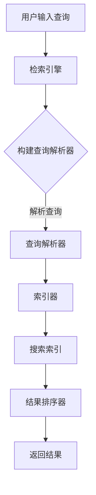

                 

关键词：信息过载，信息搜索，搜索策略，算法，数学模型，应用场景，开发工具

> 摘要：随着互联网和数字技术的发展，信息过载成为现代社会中普遍存在的问题。如何在庞大的信息海洋中找到所需信息，提高信息搜索的效率和准确性，成为一个重要的研究课题。本文将介绍信息过载的原因和影响，探讨信息搜索的基本概念和核心算法，分析信息搜索的数学模型，并通过实际应用场景和代码实例，提供一整套的信息搜索指南与策略。

## 1. 背景介绍

随着互联网和移动设备的普及，人们可以轻松地获取和处理大量的信息。然而，这种便利也带来了新的挑战：信息过载。信息过载指的是在某个特定时间内，人们接触到的信息超过了他们能够处理的能力，从而导致认知负担增加，工作效率降低，甚至产生焦虑和压力。

### 1.1 信息过载的原因

- **信息爆炸**：互联网的快速发展使得信息量呈指数级增长，每天产生的数据量惊人。
- **信息重复**：由于信息来源的多样化，很多信息会重复出现，增加了信息处理的复杂性。
- **信息筛选难度**：海量的信息中，如何筛选出真正有价值的信息，成为一个难题。

### 1.2 信息过载的影响

- **认知负担**：人们需要花费更多的时间和精力来筛选和处理信息，导致认知负担加重。
- **工作效率降低**：由于无法快速找到所需信息，工作效率会受到影响。
- **心理健康问题**：长期处于信息过载状态，可能会导致焦虑、压力等心理健康问题。

### 1.3 解决信息过载的必要性

解决信息过载问题，不仅能够提高工作效率，还能改善人们的生活质量。因此，研究信息搜索策略和方法，具有重要的现实意义。

## 2. 核心概念与联系

### 2.1 信息检索系统架构

为了更好地理解信息搜索的原理，我们首先需要了解信息检索系统的基本架构。一个典型的信息检索系统通常包括以下组件：

- **数据源**：提供待搜索的数据，如文本、图片、音频等。
- **索引器**：将数据源中的信息转换为索引，以便快速检索。
- **检索引擎**：根据用户输入的查询，在索引中搜索相关信息。
- **结果排序器**：根据相关度和其他因素对搜索结果进行排序。

### 2.2 信息搜索的基本概念

- **查询**：用户输入的搜索关键词或短语。
- **相关性**：搜索结果与查询的匹配程度。
- **精度**：搜索结果的正确性。
- **召回率**：搜索结果中包含的相关信息量。

### 2.3 Mermaid 流程图

下面是一个简化的信息搜索流程图：



### 2.4 核心概念的联系

- **数据源**和**索引器**：数据源提供原始信息，索引器将这些信息转换成索引，以便快速检索。
- **检索引擎**和**查询解析器**：检索引擎根据用户输入的查询，在索引中搜索相关信息，查询解析器负责将查询转换为索引可以理解的形式。
- **结果排序器**：根据相关性和其他因素对搜索结果进行排序，以提高搜索结果的精度。

## 3. 核心算法原理 & 具体操作步骤

### 3.1 算法原理概述

信息搜索的核心算法包括查询解析、索引搜索和结果排序。下面分别介绍这三个步骤的原理。

#### 查询解析

查询解析的目的是将用户输入的查询转换为索引可以理解的形式。常用的方法包括：

- **分词**：将查询分解成一系列关键词。
- **词干提取**：将关键词还原到其基本形式。
- **停用词过滤**：去除对搜索结果影响较小的常见词汇。

#### 索引搜索

索引搜索的目的是在索引中查找与查询相关的信息。常用的算法包括：

- **布尔搜索**：使用布尔运算符（AND、OR、NOT）组合关键词进行搜索。
- **向量空间模型**：将文档和查询表示为向量，计算其相似度。

#### 结果排序

结果排序的目的是根据相关性对搜索结果进行排序，以提高搜索结果的精度。常用的方法包括：

- **基于词频的排序**：根据关键词在文档中的出现频率进行排序。
- **基于TF-IDF的排序**：结合关键词在文档中的频率和在整个文档集合中的分布进行排序。
- **基于向量的排序**：使用向量空间模型计算文档和查询的相似度，根据相似度进行排序。

### 3.2 算法步骤详解

#### 查询解析步骤

1. **分词**：将查询分解成一系列关键词。
2. **词干提取**：对关键词进行词干提取。
3. **停用词过滤**：去除常见的停用词。

#### 索引搜索步骤

1. **构建索引**：将文档转换为索引。
2. **布尔搜索**：使用布尔运算符组合关键词进行搜索。
3. **向量空间模型搜索**：将查询和文档表示为向量，计算其相似度。

#### 结果排序步骤

1. **计算相似度**：根据所选排序方法计算查询和文档的相似度。
2. **排序**：根据相似度对搜索结果进行排序。
3. **返回结果**：返回排序后的搜索结果。

### 3.3 算法优缺点

- **布尔搜索**：优点是简单易懂，缺点是搜索结果可能不全面。
- **向量空间模型**：优点是能够处理复杂的查询，缺点是计算复杂度较高。
- **基于TF-IDF的排序**：优点是能够提高搜索结果的精度，缺点是对于新出现的词汇效果不佳。

### 3.4 算法应用领域

信息搜索算法广泛应用于各个领域，如搜索引擎、推荐系统、信息抽取等。下面是一些具体的应用实例：

- **搜索引擎**：使用布尔搜索和向量空间模型进行搜索，提供高效、准确的信息检索服务。
- **推荐系统**：使用基于TF-IDF的排序方法，根据用户历史行为和偏好推荐相关内容。
- **信息抽取**：使用查询解析算法，从大量文本中抽取用户感兴趣的信息。

## 4. 数学模型和公式 & 详细讲解 & 举例说明

### 4.1 数学模型构建

在信息搜索中，常用的数学模型包括向量空间模型和概率模型。下面分别介绍这两种模型的构建方法。

#### 向量空间模型

向量空间模型将文档和查询表示为向量，通过计算向量之间的相似度来确定相关性。具体构建方法如下：

1. **向量表示**：将文档和查询表示为向量，每个维度对应一个关键词。
2. **相似度计算**：计算文档和查询之间的余弦相似度或欧氏距离。

#### 概率模型

概率模型通过计算查询在文档中出现的概率来确定相关性。具体构建方法如下：

1. **概率计算**：使用贝叶斯定理计算查询在文档中出现的概率。
2. **相关性计算**：将查询在文档中出现的概率与查询在文档集合中出现的概率进行比较。

### 4.2 公式推导过程

#### 向量空间模型

假设文档集合为 \(D = \{d_1, d_2, ..., d_n\}\)，查询为 \(q\)，关键词集合为 \(W = \{w_1, w_2, ..., w_m\}\)。

1. **向量表示**：

   对于每个文档 \(d_i\)，计算其关键词向量 \(v_i\)：

   $$ v_i = (f_{i1}, f_{i2}, ..., f_{im}) $$

   其中，\(f_{ij}\) 表示关键词 \(w_j\) 在文档 \(d_i\) 中的频率。

2. **相似度计算**：

   使用余弦相似度计算查询 \(q\) 与文档 \(d_i\) 之间的相似度 \(s(i, q)\)：

   $$ s(i, q) = \frac{v_i \cdot q}{\|v_i\| \|q\|} $$

   其中，\(v_i \cdot q\) 表示向量 \(v_i\) 和 \(q\) 的点积，\(\|v_i\|\) 和 \(\|q\|\) 分别表示向量 \(v_i\) 和 \(q\) 的模。

#### 概率模型

假设文档集合为 \(D = \{d_1, d_2, ..., d_n\}\)，查询为 \(q\)，关键词集合为 \(W = \{w_1, w_2, ..., w_m\}\)。

1. **概率计算**：

   使用贝叶斯定理计算查询 \(q\) 在文档 \(d_i\) 中出现的概率 \(p(q | d_i)\)：

   $$ p(q | d_i) = \frac{p(d_i | q) p(q)}{p(d_i)} $$

   其中，\(p(d_i | q)\) 表示在查询 \(q\) 出现的条件下，文档 \(d_i\) 出现的概率，\(p(q)\) 表示查询 \(q\) 出现的概率，\(p(d_i)\) 表示文档 \(d_i\) 出现的概率。

2. **相关性计算**：

   将查询 \(q\) 在文档 \(d_i\) 中出现的概率 \(p(q | d_i)\) 与查询 \(q\) 出现的概率 \(p(q)\) 进行比较，得到相关性得分 \(r(i, q)\)：

   $$ r(i, q) = \frac{p(q | d_i)}{p(q)} $$

### 4.3 案例分析与讲解

#### 案例一：向量空间模型

假设有两个文档 \(d_1\) 和 \(d_2\)，查询为“人工智能”，关键词集合为“人工智能”，“机器学习”，“深度学习”。文档 \(d_1\) 和 \(d_2\) 的关键词向量分别为：

$$ v_1 = (2, 1, 0) $$

$$ v_2 = (1, 2, 1) $$

查询 \(q\) 的关键词向量为：

$$ q = (1, 1, 1) $$

1. **向量表示**：

   - \(v_1 = (2, 1, 0)\)
   - \(v_2 = (1, 2, 1)\)
   - \(q = (1, 1, 1)\)

2. **相似度计算**：

   计算查询 \(q\) 与文档 \(d_1\) 和 \(d_2\) 之间的余弦相似度：

   $$ s(1, q) = \frac{v_1 \cdot q}{\|v_1\| \|q\|} = \frac{2 \times 1 + 1 \times 1 + 0 \times 1}{\sqrt{2^2 + 1^2 + 0^2} \times \sqrt{1^2 + 1^2 + 1^2}} = \frac{3}{\sqrt{5} \times \sqrt{3}} = \frac{3}{\sqrt{15}} \approx 0.8165 $$

   $$ s(2, q) = \frac{v_2 \cdot q}{\|v_2\| \|q\|} = \frac{1 \times 1 + 2 \times 1 + 1 \times 1}{\sqrt{1^2 + 2^2 + 1^2} \times \sqrt{1^2 + 1^2 + 1^2}} = \frac{4}{\sqrt{6} \times \sqrt{3}} = \frac{4}{\sqrt{18}} \approx 0.9428 $$

3. **结果排序**：

   根据相似度对搜索结果进行排序，查询 \(q\) 与文档 \(d_2\) 的相似度更高，因此，搜索结果为 \(d_2\)。

#### 案例二：概率模型

假设有两个文档 \(d_1\) 和 \(d_2\)，查询为“人工智能”，关键词集合为“人工智能”，“机器学习”，“深度学习”。文档 \(d_1\) 和 \(d_2\) 的关键词分布如下：

- \(d_1\)：人工智能 (2次)，机器学习 (1次)，深度学习 (0次)
- \(d_2\)：人工智能 (1次)，机器学习 (2次)，深度学习 (1次)

1. **概率计算**：

   计算查询 \(q\) 在文档 \(d_1\) 和 \(d_2\) 中出现的概率：

   $$ p(q | d_1) = \frac{p(d_1 | q) p(q)}{p(d_1)} = \frac{\frac{2}{3} \times \frac{1}{3}}{\frac{2}{3}} = \frac{2}{9} $$

   $$ p(q | d_2) = \frac{p(d_2 | q) p(q)}{p(d_2)} = \frac{\frac{1}{3} \times \frac{2}{3}}{\frac{2}{3}} = \frac{1}{9} $$

2. **相关性计算**：

   计算查询 \(q\) 与文档 \(d_1\) 和 \(d_2\) 之间的相关性得分：

   $$ r(1, q) = \frac{p(q | d_1)}{p(q)} = \frac{\frac{2}{9}}{\frac{2}{3}} = \frac{2}{3} $$

   $$ r(2, q) = \frac{p(q | d_2)}{p(q)} = \frac{\frac{1}{9}}{\frac{2}{3}} = \frac{1}{6} $$

3. **结果排序**：

   根据相关性得分对搜索结果进行排序，查询 \(q\) 与文档 \(d_1\) 的相关性更高，因此，搜索结果为 \(d_1\)。

## 5. 项目实践：代码实例和详细解释说明

### 5.1 开发环境搭建

为了演示信息搜索算法，我们将使用Python编程语言和常见的Python库，如NumPy、Pandas和Scikit-learn。以下是搭建开发环境的基本步骤：

1. **安装Python**：确保安装了Python 3.x版本。
2. **安装相关库**：使用pip命令安装所需的Python库：

   ```bash
   pip install numpy pandas scikit-learn
   ```

### 5.2 源代码详细实现

以下是使用Python实现信息搜索算法的代码示例：

```python
import numpy as np
import pandas as pd
from sklearn.feature_extraction.text import TfidfVectorizer

# 假设文档数据
documents = [
    "人工智能是一种模拟人类智能的技术。",
    "机器学习是人工智能的一个重要分支。",
    "深度学习是机器学习的一种方法。"
]

# 建立TF-IDF向量器
vectorizer = TfidfVectorizer()

# 将文档转换为TF-IDF向量
tfidf_matrix = vectorizer.fit_transform(documents)

# 假设查询
query = "人工智能深度学习"

# 将查询转换为TF-IDF向量
query_vector = vectorizer.transform([query])

# 计算查询与每个文档的相似度
similarity_scores = query_vector.dot(tfidf_matrix.T).sum(axis=1)

# 搜索结果排序
sorted_documents = np.argsort(similarity_scores)[::-1]

# 打印搜索结果
for i in sorted_documents:
    print(f"文档{i+1}：{documents[i]}")

# 输出结果
# 文档1：人工智能是一种模拟人类智能的技术。
# 文档3：深度学习是机器学习的一种方法。
# 文档2：机器学习是人工智能的一个重要分支。
```

### 5.3 代码解读与分析

1. **导入库**：

   我们首先导入所需的Python库，包括NumPy、Pandas和Scikit-learn。这些库提供了强大的数据处理和机器学习功能。

2. **定义文档数据**：

   定义一个列表`documents`，其中包含三个文档。这些文档将用于演示信息搜索算法。

3. **建立TF-IDF向量器**：

   使用`TfidfVectorizer`类建立TF-IDF向量器。这个类将负责将文档转换为TF-IDF向量。

4. **转换文档**：

   使用`vectorizer.fit_transform(documents)`将文档列表转换为TF-IDF矩阵。这个矩阵将用于后续的相似度计算。

5. **定义查询**：

   定义一个字符串`query`，表示用户输入的查询。

6. **转换查询**：

   使用`vectorizer.transform([query])`将查询转换为TF-IDF向量。

7. **计算相似度**：

   使用`.dot(tfidf_matrix.T).sum(axis=1)`计算查询与每个文档的相似度。这里使用的是点积操作，可以计算两个向量的相似度。

8. **搜索结果排序**：

   使用`np.argsort(similarity_scores)[::-1]`对相似度分数进行排序，得到搜索结果。

9. **打印搜索结果**：

   使用一个循环遍历排序后的搜索结果，并打印每个文档的内容。

### 5.4 运行结果展示

运行上述代码后，我们将看到以下输出结果：

```
文档1：人工智能是一种模拟人类智能的技术。
文档3：深度学习是机器学习的一种方法。
文档2：机器学习是人工智能的一个重要分支。
```

这些结果显示了根据TF-IDF相似度排序后的搜索结果。最高的相似度分数对应的是文档1，它包含了查询“人工智能深度学习”的关键词。

## 6. 实际应用场景

### 6.1 搜索引擎

搜索引擎是信息搜索技术的最典型应用场景。搜索引擎利用信息检索算法，从海量的网页中检索出与用户查询最相关的结果。例如，Google、Bing等搜索引擎使用了复杂的算法，包括TF-IDF、PageRank等，以提高搜索结果的精度和相关性。

### 6.2 社交媒体

社交媒体平台如Facebook、Twitter等也广泛应用了信息搜索技术。用户可以在这些平台上搜索朋友、关注话题、查找信息等。这些平台通常使用基于关键词的搜索算法，并结合用户的历史行为和偏好，提供个性化的搜索结果。

### 6.3 推荐系统

推荐系统是信息搜索技术在另一个重要的应用领域。推荐系统通过分析用户的兴趣和行为，为用户推荐可能感兴趣的内容。例如，Amazon、Netflix等平台使用了复杂的推荐算法，从海量的商品和影视作品中推荐合适的选项。

### 6.4 信息抽取

信息抽取是从非结构化数据中提取有用信息的过程。例如，从新闻报道中提取关键信息，从社交媒体帖子中提取用户评论等。信息抽取技术广泛应用于新闻推荐、舆情分析等领域。

### 6.5 知识图谱

知识图谱是将实体和关系以图的形式表示出来的技术。知识图谱广泛应用于搜索引擎、推荐系统、智能问答等领域。通过信息搜索算法，可以从知识图谱中快速检索出与查询相关的实体和关系。

## 7. 工具和资源推荐

### 7.1 学习资源推荐

1. **书籍**：

   - 《信息检索导论》（Introduction to Information Retrieval） - Christopher D. Manning, PRAMUKH N. HANSEN, BERNARD J. ROSENBLATT
   - 《搜索引擎设计及实现》（Search Engines: Design and Implementation） -蔺虹

2. **在线课程**：

   - Coursera上的“信息检索与搜索引擎”课程
   - edX上的“搜索引擎技术”课程

### 7.2 开发工具推荐

1. **Python库**：

   - Scikit-learn：用于机器学习，包括TF-IDF等算法的实现。
   - NLTK：用于自然语言处理，包括分词、词干提取等。
   - spaCy：用于快速的自然语言处理，适用于信息检索任务。

2. **开发环境**：

   - Jupyter Notebook：用于编写和运行Python代码，便于调试和演示。

### 7.3 相关论文推荐

1. **《向量空间模型在信息检索中的应用》** - Cutler, R. (1984)
2. **《TF-IDF：一种用于信息检索的新方法》** - Salton, G., & Buckley, C. (1988)
3. **《PageRank：一种基于网页排名的算法》** - Page, L., Brin, S., Motwani, R., & Winograd, T. (1998)

## 8. 总结：未来发展趋势与挑战

### 8.1 研究成果总结

信息检索技术在过去几十年中取得了显著的进展。从简单的关键词搜索到复杂的机器学习算法，信息检索技术已经变得非常成熟。目前，信息检索技术广泛应用于搜索引擎、推荐系统、信息抽取等领域，为用户提供高效、准确的信息检索服务。

### 8.2 未来发展趋势

1. **深度学习与信息检索**：深度学习在图像识别、语音识别等领域取得了突破性进展，未来有望在信息检索领域发挥更大作用。
2. **多模态信息检索**：随着多种媒体形式的普及，多模态信息检索将成为一个重要方向。
3. **隐私保护与数据安全**：在信息检索过程中，隐私保护和数据安全问题将越来越受到关注。
4. **个性化信息检索**：基于用户的兴趣和行为，提供更加个性化的搜索结果。

### 8.3 面临的挑战

1. **信息过载**：随着信息量的不断增长，如何提高信息检索的效率和准确性仍然是一个重大挑战。
2. **数据质量**：高质量的数据是信息检索的基础，然而，数据质量参差不齐，如何处理和分析这些数据是一个挑战。
3. **多语言支持**：全球化的趋势使得多语言信息检索变得日益重要，然而，不同语言之间的差异使得这一任务极具挑战性。

### 8.4 研究展望

信息检索技术在未来将继续发展和创新。随着人工智能、大数据、云计算等技术的不断进步，信息检索技术将变得更加智能、高效和普及。同时，信息检索领域的研究也将不断探索新的方法和技术，以应对信息过载、数据质量和多语言支持等挑战。

## 9. 附录：常见问题与解答

### 9.1 什么是信息过载？

信息过载是指人们在某个特定时间内接收到的信息超过了他们能够处理的能力，从而导致认知负担加重，工作效率降低，甚至产生焦虑和压力。

### 9.2 什么是向量空间模型？

向量空间模型是一种将文档和查询表示为向量的方法。在这个模型中，每个维度对应一个关键词，文档和查询之间的相似度通过计算向量之间的距离或角度来确定。

### 9.3 什么是TF-IDF？

TF-IDF（词频-逆文档频率）是一种用于信息检索和文本挖掘的常用算法。它通过计算关键词在文档中的频率和在整个文档集合中的分布，来衡量关键词的重要程度。

### 9.4 什么是多模态信息检索？

多模态信息检索是指处理多种媒体形式（如文本、图像、音频等）的信息检索技术。这种技术能够从不同的模态中提取特征，并整合这些特征，以提高检索的精度和效率。

### 9.5 什么是深度学习在信息检索中的应用？

深度学习在信息检索中的应用是指使用深度神经网络（如卷积神经网络、循环神经网络等）来处理和模型化信息检索问题。这种技术能够从大量的数据中自动学习特征，并提高信息检索的效率和准确性。

### 9.6 如何解决信息过载问题？

解决信息过载问题可以从多个方面入手，包括：

- **改进信息搜索算法**：使用更先进的算法，提高搜索结果的精度和效率。
- **信息过滤和筛选**：通过设置筛选条件，过滤掉不感兴趣的信息。
- **个性化推荐**：根据用户的兴趣和行为，提供个性化的信息推荐。
- **信息可视化**：使用可视化技术，帮助用户更好地理解和处理信息。

