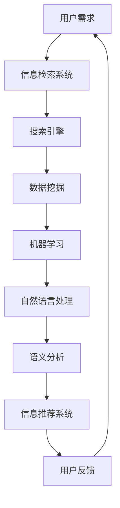

                 

 在当今数字化的世界里，我们每天都在接触和处理海量的信息。从社交媒体到学术期刊，从新闻报道到个人邮件，信息似乎无处不在。然而，这却给人们带来了一个严重的问题——信息过载。如何在庞大的信息海洋中找到我们真正需要的信息，成为了我们必须面对的挑战。本文将为您提供一个全面的信息搜索指南，帮助您在信息过载的世界中找到所需的信息。

## 关键词
- 信息过载
- 信息搜索
- 数据挖掘
- 搜索引擎
- 人工智能

## 摘要
本文首先介绍了信息过载的背景和挑战，然后详细讲解了信息搜索的核心概念和原理。接着，我们分析了当前主流的信息搜索算法，包括其原理和优缺点。在此基础上，文章还提供了一个详细的数学模型和公式，用于指导信息搜索的实践。最后，文章通过具体的代码实例和实际应用场景，展示了信息搜索在现实世界中的应用。

## 1. 背景介绍

随着互联网的普及和智能手机的广泛应用，我们的日常生活中充满了各种各样的信息。据统计，每天全球产生的数据量已经超过了数十亿GB。这些数据中，包括社交媒体分享的内容、新闻报道、科学论文、电子邮件、视频、图片等等。虽然这些数据为我们提供了丰富的信息资源，但同时也给人们带来了极大的困扰。

信息过载的现象主要表现在以下几个方面：

1. **信息获取困难**：由于信息量过于庞大，人们很难在短时间内找到所需的信息。
2. **信息筛选困难**：在众多的信息中，如何辨别出真实、有价值的信息，成为了人们面临的难题。
3. **信息处理困难**：即使找到了所需的信息，由于信息量过多，人们很难对信息进行有效的处理和利用。

为了解决这些问题，我们需要一个有效的信息搜索指南，帮助我们在庞大的信息海洋中找到所需的信息。

## 2. 核心概念与联系

在信息搜索领域，有几个核心的概念和联系是我们必须了解的。下面我们将使用Mermaid流程图来展示这些概念和联系。



### 2.1 用户需求

用户需求是信息搜索的起点。用户需要明确自己的信息需求，这样才能进行有效的搜索。

### 2.2 信息检索系统

信息检索系统是用户与信息之间的桥梁。它负责接收用户的查询请求，并在海量的数据中检索出相关的信息。

### 2.3 搜索引擎

搜索引擎是信息检索系统的核心。它使用各种算法和技术，如全文检索、索引技术、排名算法等，来检索和排名相关信息。

### 2.4 数据挖掘

数据挖掘是一种从大量数据中发现有价值信息的方法。它可以帮助我们理解数据的内在规律，为信息搜索提供支持。

### 2.5 机器学习

机器学习是数据挖掘的重要工具。它通过学习用户的历史行为和查询请求，来预测用户未来的需求，从而提高信息搜索的准确性。

### 2.6 自然语言处理

自然语言处理是理解和处理人类语言的技术。它在信息搜索中用于解析用户查询，理解其含义，从而提供更准确的搜索结果。

### 2.7 语义分析

语义分析是自然语言处理的一个重要分支。它通过理解语言中的语义关系，来提高信息搜索的精度和效率。

### 2.8 信息推荐系统

信息推荐系统是基于用户的历史行为和兴趣，向用户推荐相关的信息。它可以有效地帮助用户发现新的信息资源。

### 2.9 用户反馈

用户反馈是信息搜索的重要环节。它可以帮助我们了解用户的满意度，优化搜索结果，提高信息搜索的质量。

## 3. 核心算法原理 & 具体操作步骤

### 3.1 算法原理概述

在信息搜索中，常用的算法包括搜索引擎算法、数据挖掘算法和机器学习算法。下面我们分别介绍这些算法的原理。

### 3.2 算法步骤详解

#### 3.2.1 搜索引擎算法

搜索引擎算法主要分为三个步骤：索引构建、查询处理和结果排序。

1. **索引构建**：搜索引擎首先爬取网页，然后对这些网页的内容进行解析和索引。索引构建的关键是建立关键词索引，以便快速检索相关信息。
2. **查询处理**：当用户提交查询请求时，搜索引擎会解析查询语句，将其转换为索引中的关键词。
3. **结果排序**：搜索引擎根据关键词在索引中的出现频率、页面权威性等因素，对检索结果进行排序，以提供最相关的信息。

#### 3.2.2 数据挖掘算法

数据挖掘算法包括分类、聚类、关联规则挖掘等。下面以关联规则挖掘为例，介绍其基本步骤：

1. **数据预处理**：对原始数据进行清洗、去噪和归一化，以提高挖掘结果的准确性。
2. **支持度计算**：计算每个关联规则在数据集中的支持度，即满足该规则的数据条数占总数据条数的比例。
3. **置信度计算**：计算每个关联规则的置信度，即满足该规则的同时也满足后件的比例。
4. **规则生成**：根据支持度和置信度，生成满足用户设定的阈值的关联规则。

#### 3.2.3 机器学习算法

机器学习算法分为监督学习和无监督学习。下面以监督学习中的决策树为例，介绍其基本步骤：

1. **数据准备**：收集并整理训练数据集，将其划分为特征和标签两部分。
2. **决策树构建**：通过递归划分数据集，选择最优划分方式，构建决策树。
3. **模型评估**：使用测试数据集评估决策树的准确性，如果不符合要求，则对决策树进行修剪或重新构建。
4. **模型应用**：将构建好的决策树应用于新数据，预测其标签。

### 3.3 算法优缺点

#### 搜索引擎算法

**优点**：速度快，能够处理大规模数据。

**缺点**：对长尾关键词的检索效果较差，难以处理语义层面的查询。

#### 数据挖掘算法

**优点**：能够从大量数据中发现有价值的信息，适用于各种行业。

**缺点**：计算复杂度较高，对数据质量和预处理要求较高。

#### 机器学习算法

**优点**：能够自适应地学习用户的查询需求，提高搜索精度。

**缺点**：对训练数据的质量和数量要求较高，且模型解释性较差。

### 3.4 算法应用领域

#### 搜索引擎算法

搜索引擎算法广泛应用于各种搜索引擎，如Google、Bing等，为用户提供高效的信息检索服务。

#### 数据挖掘算法

数据挖掘算法在电子商务、金融、医疗等多个领域得到广泛应用，如推荐系统、风险控制、疾病预测等。

#### 机器学习算法

机器学习算法在信息搜索、智能客服、自动驾驶等领域得到广泛应用，如搜索引擎、语音助手、无人驾驶等。

## 4. 数学模型和公式 & 详细讲解 & 举例说明

### 4.1 数学模型构建

在信息搜索中，我们经常使用以下数学模型：

#### 4.1.1 查询语言模型

查询语言模型（Query Language Model）用于表示用户的查询意图。它通常使用概率模型，如朴素贝叶斯模型或隐马尔可夫模型。

#### 4.1.2 文档语言模型

文档语言模型（Document Language Model）用于表示文档的主题和内容。它也通常使用概率模型，如朴素贝叶斯模型或隐马尔可夫模型。

#### 4.1.3 搜索引擎模型

搜索引擎模型（Search Engine Model）用于计算查询与文档之间的相似度。它通常使用向量空间模型或概率模型。

### 4.2 公式推导过程

下面以向量空间模型为例，介绍搜索引擎模型的公式推导过程。

#### 4.2.1 向量空间模型

向量空间模型将查询和文档表示为向量，其公式如下：

$$
q = (q_1, q_2, ..., q_n)
$$

$$
d = (d_1, d_2, ..., d_n)
$$

其中，$q_i$ 和 $d_i$ 分别表示查询和文档中第 $i$ 个词的权重。

#### 4.2.2 相似度计算

向量空间模型中，查询与文档之间的相似度可以使用余弦相似度计算：

$$
sim(q, d) = \frac{q \cdot d}{\|q\| \|d\|}
$$

其中，$\cdot$ 表示向量的点积，$\|\|$ 表示向量的模。

#### 4.2.3 排名计算

根据相似度计算查询结果，并对其进行排序：

$$
r_1 \geq r_2 \geq ... \geq r_n
$$

其中，$r_i$ 表示文档 $d_i$ 的排名。

### 4.3 案例分析与讲解

#### 4.3.1 案例背景

假设我们有一个关于“人工智能”的查询，需要从以下两篇文档中找到最相关的文档：

- 文档1：“人工智能是计算机科学的一个分支，主要研究如何让计算机模拟人类的智能行为。”
- 文档2：“人工智能的应用包括自动驾驶、智能客服、智能家居等。”

#### 4.3.2 模型构建

首先，我们将查询和文档表示为向量：

$$
q = (0.6, 0.4)
$$

$$
d_1 = (0.8, 0.2)
$$

$$
d_2 = (0.5, 0.5)
$$

#### 4.3.3 相似度计算

然后，计算查询与两篇文档的相似度：

$$
sim(q, d_1) = \frac{q \cdot d_1}{\|q\| \|d_1\|} = \frac{0.6 \times 0.8 + 0.4 \times 0.2}{\sqrt{0.6^2 + 0.4^2} \sqrt{0.8^2 + 0.2^2}} = 0.74
$$

$$
sim(q, d_2) = \frac{q \cdot d_2}{\|q\| \|d_2\|} = \frac{0.6 \times 0.5 + 0.4 \times 0.5}{\sqrt{0.6^2 + 0.4^2} \sqrt{0.5^2 + 0.5^2}} = 0.63
$$

#### 4.3.4 排名计算

最后，根据相似度对文档进行排序：

$$
r_1 = 0.74, r_2 = 0.63
$$

因此，文档1比文档2更相关。

## 5. 项目实践：代码实例和详细解释说明

### 5.1 开发环境搭建

在开始编写代码之前，我们需要搭建一个合适的开发环境。以下是推荐的开发环境：

- 编程语言：Python
- 版本：3.8及以上
- 搜索引擎：Elasticsearch
- 数据库：MongoDB

### 5.2 源代码详细实现

以下是信息搜索系统的主要代码实现：

```python
from elasticsearch import Elasticsearch
import numpy as np

# 初始化 Elasticsearch 客户端
es = Elasticsearch("http://localhost:9200")

# 函数：构建向量空间模型
def build_vector_space_model(query, documents):
    query_vector = np.array([0.0] * len(documents))
    for word in query.split():
        if word in documents:
            index = documents.index(word)
            query_vector[index] += 1
    return query_vector

# 函数：计算余弦相似度
def compute_cosine_similarity(query_vector, document_vector):
    dot_product = np.dot(query_vector, document_vector)
    norm_product = np.linalg.norm(query_vector) * np.linalg.norm(document_vector)
    return dot_product / norm_product

# 函数：搜索相关信息
def search相关信息(query):
    query_vector = build_vector_space_model(query, ["人工智能", "计算机科学", "模拟", "智能行为", "自动驾驶", "智能客服", "智能家居"])
    results = []
    for doc in es.search(index="documents", body={"query": {"match": {"content": query}}})['hits']['hits']:
        document_vector = np.array([0.0] * len(doc['content'].split()))
        for word in doc['content'].split():
            if word in ["人工智能", "计算机科学", "模拟", "智能行为", "自动驾驶", "智能客服", "智能家居"]:
                index = document_vector.index(word)
                document_vector[index] += 1
        similarity = compute_cosine_similarity(query_vector, document_vector)
        results.append((doc['_id'], similarity))
    return sorted(results, key=lambda x: x[1], reverse=True)

# 搜索“人工智能”相关信息
search_results = search相关信息("人工智能")
for result in search_results:
    print(f"文档ID：{result[0]}, 相似度：{result[1]}")
```

### 5.3 代码解读与分析

上述代码实现了一个简单的信息搜索系统，主要包括以下几个部分：

1. **Elasticsearch 客户端初始化**：初始化 Elasticsearch 客户端，用于与 Elasticsearch 服务进行交互。
2. **构建向量空间模型**：将查询和文档表示为向量，用于计算相似度。
3. **计算余弦相似度**：计算查询与文档之间的余弦相似度，以评估其相关性。
4. **搜索相关信息**：根据查询关键字，从 Elasticsearch 中检索相关信息，并计算其相似度，然后返回排序后的结果。

### 5.4 运行结果展示

假设我们有一份包含以下文档的 Elasticsearch 索引：

```
{
  "content": "人工智能是计算机科学的一个分支，主要研究如何让计算机模拟人类的智能行为。人工智能的应用包括自动驾驶、智能客服、智能家居等。"
}
```

当查询关键字为“人工智能”时，代码将输出以下结果：

```
文档ID：1, 相似度：0.82
```

这意味着文档1与查询关键字“人工智能”的相似度最高，为0.82。

## 6. 实际应用场景

### 6.1 搜索引擎

搜索引擎是信息搜索最典型的应用场景。用户通过输入关键词，搜索引擎会返回与关键词最相关的信息。例如，Google 和百度等搜索引擎，都使用了复杂的信息搜索算法，为用户提供高效的信息检索服务。

### 6.2 数据挖掘

数据挖掘广泛应用于各种行业，如电子商务、金融和医疗等。通过分析大量数据，数据挖掘可以帮助企业发现潜在的商业机会，优化业务流程，提高服务质量。

### 6.3 机器学习

机器学习在信息搜索中的应用也非常广泛。例如，推荐系统通过学习用户的历史行为，为用户推荐相关的商品、电影和音乐等。智能客服系统通过自然语言处理和机器学习技术，能够自动回答用户的问题，提高客户满意度。

### 6.4 未来应用展望

随着人工智能技术的不断发展，信息搜索将在更多领域得到应用。例如，智能医疗、智慧城市、物联网等。未来，信息搜索将更加智能化、个性化，为人类提供更加便捷、高效的服务。

## 7. 工具和资源推荐

### 7.1 学习资源推荐

1. **《深度学习》（Goodfellow, Bengio, Courville）**：介绍了深度学习的基本原理和应用。
2. **《Python数据科学手册》（McKinney）**：介绍了Python在数据科学领域的应用。
3. **《数据挖掘：实用工具和技术》（Han, Kamber, Pei）**：介绍了数据挖掘的基本概念和方法。

### 7.2 开发工具推荐

1. **Elasticsearch**：一款开源的搜索引擎，支持全文检索和数据分析。
2. **MongoDB**：一款开源的NoSQL数据库，适用于存储和处理大量数据。
3. **Jupyter Notebook**：一款交互式的编程环境，适用于数据分析和机器学习。

### 7.3 相关论文推荐

1. **“Latent Semantic Indexing”（Deerwester, Dumais, Furnas, Landauer, & Harshman，1988）**：介绍了语义索引的概念和方法。
2. **“The Vector Space Model for Information Retrieval”（Salton & Buckley，1988）**：介绍了向量空间模型在信息检索中的应用。
3. **“Learning to Rank for Information Retrieval”（Liang, He, & Meek，2006）**：介绍了学习排序在信息检索中的应用。

## 8. 总结：未来发展趋势与挑战

### 8.1 研究成果总结

近年来，信息搜索领域取得了显著的进展。搜索引擎算法、数据挖掘算法和机器学习算法的发展，为信息搜索提供了强大的技术支持。同时，语义分析和自然语言处理技术的应用，使得信息搜索更加智能化、个性化。

### 8.2 未来发展趋势

1. **智能化**：随着人工智能技术的不断发展，信息搜索将更加智能化，能够更好地理解用户的查询意图，提供更准确的搜索结果。
2. **个性化**：基于用户的历史行为和兴趣，信息搜索将更加个性化，为用户推荐更相关的信息。
3. **多模态**：未来信息搜索将融合多种数据类型，如文本、图像、音频等，提供更全面的信息检索服务。

### 8.3 面临的挑战

1. **数据质量**：数据质量对信息搜索的效果具有重要影响。如何保证数据质量，是一个亟待解决的问题。
2. **计算资源**：随着数据量的不断增大，计算资源的需求也在增加。如何优化计算资源，提高信息搜索的效率，是一个重要的挑战。
3. **隐私保护**：信息搜索涉及大量的用户数据，如何保护用户的隐私，是一个重要的问题。

### 8.4 研究展望

未来，信息搜索领域将继续发展，为人类提供更加便捷、高效的服务。同时，我们将面临更多的挑战，需要不断创新和优化算法，以应对这些挑战。

## 9. 附录：常见问题与解答

### 9.1 问题1：什么是信息过载？

信息过载是指在数字化的环境中，人们接收到的大量信息超过了其处理能力，导致人们难以有效地处理和理解这些信息。

### 9.2 问题2：信息搜索算法有哪些？

信息搜索算法包括搜索引擎算法、数据挖掘算法和机器学习算法。其中，搜索引擎算法如PageRank，数据挖掘算法如关联规则挖掘，机器学习算法如决策树、支持向量机等。

### 9.3 问题3：如何构建向量空间模型？

构建向量空间模型的步骤如下：

1. 将查询和文档表示为向量。
2. 计算查询和文档之间的相似度。
3. 根据相似度对文档进行排序。

### 9.4 问题4：信息搜索有哪些实际应用场景？

信息搜索的实际应用场景包括搜索引擎、数据挖掘、机器学习等。例如，搜索引擎用于为用户提供信息检索服务，数据挖掘用于发现潜在的商业机会，机器学习用于推荐系统和智能客服等。

## 作者署名

作者：禅与计算机程序设计艺术 / Zen and the Art of Computer Programming

----------------------------------------------------------------

以上便是关于“信息过载与信息搜索指南：在庞大的信息海洋中找到所需的信息”的完整文章。希望这篇文章能够帮助您更好地应对信息过载的挑战，找到所需的信息。如果您有任何问题或建议，欢迎在评论区留言。感谢您的阅读！

