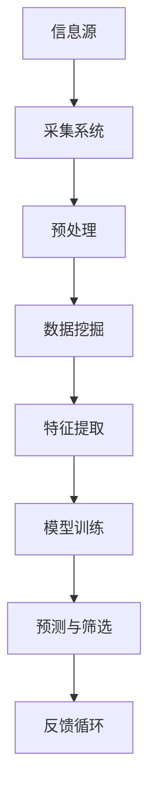

                 

关键词：信息过载、信息筛选、数据挖掘、机器学习、自然语言处理、算法优化

> 摘要：随着互联网和数字技术的迅猛发展，信息爆炸成为了现代社会的一个显著特征。如何在海量信息中筛选出有价值的信息，成为了个人和企业在信息时代面临的重大挑战。本文将探讨信息过载的背景和问题，介绍信息筛选的核心概念与关键技术，并分析其在不同领域的应用和未来发展趋势。

## 1. 背景介绍

在过去的几十年中，互联网和数字技术的迅猛发展已经彻底改变了我们的生活方式。社交媒体、电子商务、在线教育等领域的普及，使得信息以前所未有的速度和规模在我们周围传播。根据统计，截至2021年，全球互联网用户已超过46亿，每天产生的数据量达到了惊人的EB级别。

### 1.1 信息过载的挑战

然而，信息爆炸也带来了一系列的问题。首先，信息过载成为了现代人的一个主要困扰。研究表明，现代人每天平均接触到大约10000条信息，这远远超出了人类大脑能够有效处理的信息量。信息过载不仅会降低我们的工作效率，还会对我们的心理健康产生负面影响。

### 1.2 个人与企业的影响

对个人来说，信息过载可能导致注意力分散，降低决策质量，甚至引发焦虑和压力。对于企业来说，信息过载则意味着无法及时获取关键数据，从而影响战略决策和运营效率。

### 1.3 社会影响

信息过载还可能导致社会信任的下降。当人们无法区分信息的真实性和价值，容易受到虚假信息的影响，从而对事实和权威产生怀疑。

## 2. 核心概念与联系

为了在信息洪流中找到有价值的信息，我们需要理解信息筛选的核心概念和关键技术。以下是关键概念及其相互关系的 Mermaid 流程图：



### 2.1 信息采集系统

信息采集系统是信息筛选的第一步，它负责从各种来源收集数据，包括网页、社交媒体、新闻媒体等。采集系统需要高效且可靠，以处理海量数据。

### 2.2 预处理

预处理是对原始数据进行清洗、格式化和归一化等操作，以便后续分析。预处理的质量直接影响数据挖掘的效果。

### 2.3 数据挖掘

数据挖掘是一种从大量数据中提取有价值信息的过程，包括关联规则挖掘、分类、聚类等。数据挖掘技术是信息筛选的核心。

### 2.4 特征提取

特征提取是将原始数据转换为对模型有意义的特征表示。这通常涉及降维、特征选择和特征工程技术。

### 2.5 模型训练

模型训练是使用机器学习算法对特征进行学习和建模，以便能够对新的数据进行预测和筛选。

### 2.6 预测与筛选

预测与筛选是基于训练好的模型对新数据进行评估，以确定其价值和相关性。

### 2.7 反馈循环

反馈循环是信息筛选系统持续改进的关键。通过收集用户反馈，系统可以不断优化模型，提高筛选效果。

## 3. 核心算法原理 & 具体操作步骤

### 3.1 算法原理概述

信息筛选的核心算法通常基于机器学习和自然语言处理技术。其中，常用的算法包括支持向量机（SVM）、决策树、随机森林、神经网络等。这些算法通过学习大量的标记数据，能够自动识别数据的特征，从而对新数据进行预测和筛选。

### 3.2 算法步骤详解

1. **数据收集**：从各种信息源收集大量数据，包括文本、图像、音频等。

2. **数据预处理**：对收集的数据进行清洗、格式化和归一化等操作，以消除噪声和异常值。

3. **特征提取**：将原始数据转换为特征向量，通常使用词袋模型、TF-IDF、词嵌入等技术。

4. **模型选择**：根据任务需求选择合适的机器学习算法，并进行参数调优。

5. **模型训练**：使用标记数据训练模型，使其能够学习数据的特征和模式。

6. **模型评估**：使用验证集评估模型的性能，包括准确率、召回率、F1分数等指标。

7. **预测与筛选**：使用训练好的模型对新的数据进行预测和筛选，确定其价值和相关性。

8. **反馈循环**：收集用户反馈，对模型进行调整和优化，以提高筛选效果。

### 3.3 算法优缺点

- **优点**：机器学习算法能够自动学习和适应数据，具有很高的灵活性和鲁棒性。自然语言处理技术使得文本数据的处理变得高效和准确。

- **缺点**：训练过程通常需要大量的计算资源和时间。模型的泛化能力依赖于训练数据的质量和多样性。

### 3.4 算法应用领域

- **推荐系统**：使用信息筛选技术推荐用户可能感兴趣的内容，如电子商务、社交媒体、新闻网站等。

- **舆情分析**：从社交媒体和新闻中筛选出关键信息，用于监测公共舆论和舆情趋势。

- **金融风控**：通过对交易数据进行分析，识别潜在的风险和欺诈行为。

- **医疗健康**：从医疗记录中筛选出重要的健康指标，辅助医生进行诊断和治疗。

## 4. 数学模型和公式 & 详细讲解 & 举例说明

### 4.1 数学模型构建

在信息筛选中，常用的数学模型包括监督学习和无监督学习。以下是一个简单的监督学习模型的构建过程：

#### 4.1.1 监督学习模型

$$
y = f(x; \theta)
$$

其中，$y$ 是预测标签，$x$ 是特征向量，$f(x; \theta)$ 是由参数 $\theta$ 控制的预测函数。

#### 4.1.2 损失函数

损失函数用于衡量预测值与真实值之间的差距，常用的损失函数包括均方误差（MSE）和交叉熵损失。

$$
L(y, \hat{y}) = \frac{1}{2} \sum_{i=1}^{n} (y_i - \hat{y}_i)^2 \quad \text{(MSE)}
$$

$$
L(y, \hat{y}) = - \sum_{i=1}^{n} y_i \log \hat{y}_i \quad \text{(交叉熵损失)}
$$

#### 4.1.3 优化算法

为了最小化损失函数，常用的优化算法包括梯度下降、随机梯度下降和Adam优化器。

### 4.2 公式推导过程

以梯度下降算法为例，其更新规则如下：

$$
\theta = \theta - \alpha \nabla_\theta L(\theta)
$$

其中，$\alpha$ 是学习率，$\nabla_\theta L(\theta)$ 是损失函数关于参数 $\theta$ 的梯度。

### 4.3 案例分析与讲解

#### 4.3.1 案例背景

假设我们有一个新闻推荐系统，需要根据用户的浏览历史推荐相关新闻。用户的历史浏览数据包括新闻标题和分类标签。

#### 4.3.2 数据预处理

1. **数据收集**：从新闻网站收集大量新闻标题及其分类标签。

2. **数据清洗**：去除重复数据、缺失值和噪声数据。

3. **特征提取**：使用词袋模型将新闻标题转换为特征向量。

#### 4.3.3 模型训练

1. **模型选择**：选择基于神经网络的分类模型，如卷积神经网络（CNN）或循环神经网络（RNN）。

2. **模型训练**：使用标记数据训练模型，调整参数以最小化损失函数。

#### 4.3.4 预测与筛选

1. **预测**：使用训练好的模型预测新新闻标题的分类标签。

2. **筛选**：根据预测结果，筛选出与用户浏览历史相关的新闻推荐给用户。

#### 4.3.5 反馈循环

1. **用户反馈**：收集用户对新闻推荐的评价，如点赞、评论等。

2. **模型调整**：根据用户反馈调整模型，提高推荐效果。

## 5. 项目实践：代码实例和详细解释说明

### 5.1 开发环境搭建

1. **Python环境**：安装Python 3.8及以上版本。

2. **依赖库**：安装Scikit-learn、TensorFlow、Keras等。

3. **数据集**：从Kaggle或其他公开数据集下载新闻数据。

### 5.2 源代码详细实现

```python
import numpy as np
import pandas as pd
from sklearn.feature_extraction.text import TfidfVectorizer
from sklearn.model_selection import train_test_split
from sklearn.metrics import accuracy_score
from keras.models import Sequential
from keras.layers import Dense, Embedding, LSTM

# 数据加载与预处理
data = pd.read_csv('news_data.csv')
X = data['title']
y = data['label']

# 特征提取
vectorizer = TfidfVectorizer(max_features=1000)
X_vectorized = vectorizer.fit_transform(X)

# 模型训练
model = Sequential()
model.add(Embedding(input_dim=X_vectorized.shape[1], output_dim=128))
model.add(LSTM(units=128))
model.add(Dense(units=y.shape[1], activation='softmax'))

model.compile(optimizer='adam', loss='categorical_crossentropy', metrics=['accuracy'])
model.fit(X_vectorized, y, epochs=10, batch_size=32)

# 预测与筛选
predictions = model.predict(X_vectorized)
predicted_labels = np.argmax(predictions, axis=1)

# 评估与反馈
accuracy = accuracy_score(y, predicted_labels)
print('Accuracy:', accuracy)
```

### 5.3 代码解读与分析

1. **数据加载与预处理**：使用Pandas加载新闻数据，并进行特征提取。

2. **模型构建**：使用Keras构建基于LSTM的神经网络模型。

3. **模型训练**：使用Scikit-learn的TFIDF向量器对标题进行特征提取，然后使用LSTM模型进行训练。

4. **预测与筛选**：使用训练好的模型对新的新闻标题进行预测，并筛选出与用户浏览历史相关的新闻。

5. **评估与反馈**：使用准确率评估模型效果，并根据用户反馈调整模型。

## 6. 实际应用场景

### 6.1 推荐系统

信息筛选技术在推荐系统中有着广泛的应用，如电商平台的商品推荐、视频平台的视频推荐等。通过分析用户的浏览历史和偏好，系统可以推荐用户可能感兴趣的商品或视频，从而提高用户满意度和平台收益。

### 6.2 舆情分析

信息筛选技术可用于从社交媒体和新闻中提取关键信息，用于监测公共舆论和舆情趋势。这有助于政府、企业和研究机构了解公众情绪，制定相应的政策和策略。

### 6.3 金融风控

在金融领域，信息筛选技术可用于识别潜在的风险和欺诈行为。通过分析交易数据和行为模式，系统可以预测欺诈风险，从而采取措施降低金融损失。

### 6.4 医疗健康

在医疗健康领域，信息筛选技术可用于辅助医生进行诊断和治疗。通过对医疗记录和患者数据的分析，系统可以识别关键的健康指标，提供个性化的治疗方案。

## 7. 未来应用展望

随着人工智能技术的不断发展，信息筛选技术将变得更加智能和高效。未来，我们可以预见到以下应用趋势：

### 7.1 个性化推荐

个性化推荐将更加精准，基于用户行为和偏好进行深度分析，为用户提供量身定制的内容和服务。

### 7.2 智能客服

智能客服系统将利用信息筛选技术自动处理大量用户咨询，提供高效、准确的响应，提高客户满意度。

### 7.3 智能交通

智能交通系统将利用信息筛选技术实时分析交通数据，优化交通流量，减少拥堵和事故。

### 7.4 智能医疗

智能医疗系统将利用信息筛选技术辅助医生进行诊断和治疗，提高医疗效率和患者满意度。

## 8. 工具和资源推荐

### 8.1 学习资源推荐

1. **《深度学习》（Goodfellow, Bengio, Courville著）**：全面介绍深度学习的基础知识和最新进展。

2. **《机器学习实战》（Peter Harrington著）**：通过实际案例介绍机器学习算法和应用。

### 8.2 开发工具推荐

1. **TensorFlow**：开源深度学习框架，适用于各种规模的机器学习项目。

2. **Scikit-learn**：开源机器学习库，提供丰富的算法和工具。

### 8.3 相关论文推荐

1. **"A Brief History of Time Series Data Mining"**：介绍时间序列数据挖掘的背景和发展。

2. **"Deep Learning for Natural Language Processing"**：介绍深度学习在自然语言处理领域的应用。

## 9. 总结：未来发展趋势与挑战

信息筛选技术在现代社会中具有广泛的应用前景，随着人工智能技术的不断进步，其性能和效率将得到显著提升。然而，面对海量数据的挑战和隐私保护的约束，未来研究需要关注以下方向：

### 9.1 数据质量和多样性

提高数据质量和多样性，以增强模型的泛化能力。

### 9.2 模型解释性

增强模型解释性，提高用户对筛选结果的信任度。

### 9.3 可扩展性

开发高效、可扩展的算法和系统，以处理实时、大规模的数据流。

### 9.4 隐私保护

在信息筛选过程中确保用户隐私，防止数据泄露和滥用。

## 附录：常见问题与解答

### 9.1 什么是信息过载？

信息过载是指信息量超出了个体或组织能够处理和吸收的范围，导致信息处理的效率降低和心理健康问题。

### 9.2 信息筛选技术有哪些类型？

信息筛选技术主要包括基于规则的方法、基于机器学习的方法和基于深度学习的方法。

### 9.3 信息筛选技术在金融领域有哪些应用？

信息筛选技术在金融领域可以用于交易风险监控、欺诈检测和投资策略优化等。

### 9.4 如何评估信息筛选系统的效果？

可以使用准确率、召回率、F1分数等指标评估信息筛选系统的效果。

### 9.5 信息筛选技术如何保护用户隐私？

通过数据加密、隐私保护算法和用户隐私政策等措施，确保用户隐私不被泄露。

### 9.6 未来信息筛选技术有哪些研究方向？

未来信息筛选技术的研究方向包括模型解释性、隐私保护、可解释性和跨模态信息处理等。

---

作者：禅与计算机程序设计艺术 / Zen and the Art of Computer Programming
```

