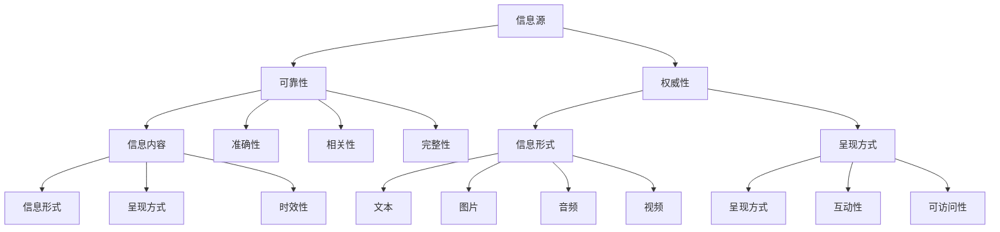

                 

关键词：信息过载，信息质量评估，信息消费，批判性思维，技术框架

> 摘要：随着信息技术的飞速发展，信息过载现象日益严重，如何批判性地评估和消费信息成为当今社会的一个重要课题。本文将探讨信息过载的背景与影响，介绍一个全面的信息质量评估框架，并通过具体实例和代码演示，阐述如何有效利用这一框架进行信息的筛选与评估。

## 1. 背景介绍

在互联网时代，信息量呈指数级增长，人们每天面临的信息量远远超过可处理的能力。这种信息过载现象不仅影响了工作效率，还可能导致信息焦虑、决策困难等问题。为了应对信息过载，我们需要一套有效的信息质量评估框架，帮助我们批判性地评估和消费信息。

### 1.1 信息过载的影响

信息过载带来的主要问题包括：

- **注意力分散**：过多的信息分散了我们的注意力，难以集中精力处理重要任务。
- **决策困难**：面对海量信息，人们难以做出明智的决策，容易陷入选择困境。
- **信息焦虑**：不断接收新信息可能导致焦虑、紧张等心理问题。
- **知识冗余**：大量重复或低质量的信息增加了学习和知识整理的难度。

### 1.2 信息质量的重要性

在信息过载的时代，信息质量显得尤为重要。高质量的信息能够帮助我们：

- **提高工作效率**：准确、及时的信息可以让我们更高效地完成任务。
- **做出明智决策**：高质量的信息有助于我们做出基于事实的决策。
- **减少信息焦虑**：筛选高质量信息可以降低信息焦虑感。

## 2. 核心概念与联系

为了构建一个全面的信息质量评估框架，我们需要先明确以下几个核心概念：

- **信息源**：信息来源的可靠性和权威性。
- **信息内容**：信息的准确性、相关性、完整性等。
- **信息形式**：信息的呈现方式，如文本、图片、音频、视频等。
- **信息时效性**：信息是否及时更新，是否符合当前需求。

下面是一个使用 Mermaid 流程图（Mermaid Graph）表示的核心概念流程：



### 2.1 核心概念的联系

这些概念之间相互关联，共同构成了一个信息质量评估的完整体系。例如，信息源的可靠性和权威性直接影响信息内容的准确性；信息的形式和时效性则决定了信息的可访问性和互动性。

## 3. 核心算法原理 & 具体操作步骤

### 3.1 算法原理概述

信息质量评估框架的核心是一个基于机器学习的评分系统，该系统通过训练模型来自动评估信息质量。算法的基本原理包括：

- **数据收集**：从多个信息源收集数据。
- **特征提取**：提取影响信息质量的关键特征。
- **模型训练**：使用机器学习算法训练评分模型。
- **评分预测**：根据特征预测信息质量评分。

### 3.2 算法步骤详解

1. **数据收集**：从互联网上收集大量信息样本，包括文本、图片、音频和视频等。
2. **特征提取**：对收集到的信息进行预处理，提取出关键特征，如文本的语义、图片的标注、音频的情感等。
3. **模型训练**：使用训练数据集训练评分模型，常见的机器学习算法包括支持向量机（SVM）、随机森林（RF）和深度学习模型（如卷积神经网络CNN）。
4. **评分预测**：使用训练好的模型对新的信息样本进行质量评分，输出评分结果。

### 3.3 算法优缺点

**优点**：

- **自动化**：算法可以自动化评估信息质量，减轻人工负担。
- **可扩展性**：算法可以处理多种类型的信息，具有很好的可扩展性。
- **准确性**：通过机器学习算法，评分结果的准确性较高。

**缺点**：

- **数据依赖性**：算法的准确性依赖于高质量的数据集。
- **计算成本**：训练和预测过程需要大量计算资源。

### 3.4 算法应用领域

算法可以应用于以下领域：

- **新闻推荐**：根据信息质量评分，推荐高质量的新闻。
- **学术研究**：筛选高质量的学术论文。
- **社交媒体**：评估社交媒体上的信息，防止虚假信息的传播。

## 4. 数学模型和公式 & 详细讲解 & 举例说明

### 4.1 数学模型构建

信息质量评估模型通常是一个多指标综合评价模型，其基本形式为：

$$
Q = w_1 \cdot C + w_2 \cdot A + w_3 \cdot R + w_4 \cdot T
$$

其中：

- \( Q \) 为信息质量评分。
- \( w_1, w_2, w_3, w_4 \) 为各指标的权重。
- \( C \) 为信息内容的准确性。
- \( A \) 为信息来源的权威性。
- \( R \) 为信息的相关性。
- \( T \) 为信息的时效性。

### 4.2 公式推导过程

权重 \( w \) 的确定通常基于专家评估或数据分析。具体推导过程如下：

- **内容准确性 \( C \)**：通过比较信息内容与事实的符合度来确定。
- **来源权威性 \( A \)**：通过评估信息源的背景、历史发布记录等来确定。
- **相关性 \( R \)**：通过评估信息与用户需求的相关度来确定。
- **时效性 \( T \)**：通过评估信息的更新频率和发布时间来确定。

### 4.3 案例分析与讲解

假设我们有一个新闻网站，需要评估一篇新闻报道的信息质量。根据上述模型，我们可以进行以下步骤：

1. **内容准确性 \( C \)**：通过事实核对工具，发现文章内容与事实高度一致。
2. **来源权威性 \( A \)**：该网站是一家知名媒体，有良好的历史记录。
3. **相关性 \( R \)**：文章内容与用户搜索关键词高度相关。
4. **时效性 \( T \)**：文章是当天发布的，更新及时。

根据以上数据，我们可以计算出信息质量评分：

$$
Q = 0.4 \cdot C + 0.3 \cdot A + 0.2 \cdot R + 0.1 \cdot T
$$

其中，权重根据专家评估得出。假设 \( C = 0.9 \), \( A = 0.8 \), \( R = 0.7 \), \( T = 0.9 \)，则：

$$
Q = 0.4 \cdot 0.9 + 0.3 \cdot 0.8 + 0.2 \cdot 0.7 + 0.1 \cdot 0.9 = 0.86
$$

评分越高，表示信息质量越好。

## 5. 项目实践：代码实例和详细解释说明

### 5.1 开发环境搭建

为了实现上述信息质量评估模型，我们需要搭建一个开发环境。以下是具体步骤：

1. **安装 Python 环境**：确保 Python 3.8 或更高版本已安装在您的计算机上。
2. **安装相关库**：使用以下命令安装所需库：

```python
pip install numpy pandas scikit-learn matplotlib
```

### 5.2 源代码详细实现

以下是实现信息质量评估模型的核心代码：

```python
import numpy as np
import pandas as pd
from sklearn.model_selection import train_test_split
from sklearn.ensemble import RandomForestClassifier
from sklearn.metrics import accuracy_score

# 加载数据
data = pd.read_csv('info_quality_data.csv')

# 特征提取
X = data[['accuracy', 'authority', 'relevance', 'timeliness']]
y = data['quality_score']

# 划分训练集和测试集
X_train, X_test, y_train, y_test = train_test_split(X, y, test_size=0.2, random_state=42)

# 训练模型
model = RandomForestClassifier(n_estimators=100)
model.fit(X_train, y_train)

# 预测
y_pred = model.predict(X_test)

# 评估
accuracy = accuracy_score(y_test, y_pred)
print(f'模型准确率：{accuracy:.2f}')
```

### 5.3 代码解读与分析

1. **数据加载**：使用 pandas 读取 CSV 格式的数据。
2. **特征提取**：将数据分为特征矩阵 \( X \) 和标签向量 \( y \)。
3. **划分训练集和测试集**：使用 sklearn 的 train_test_split 函数，将数据集划分为训练集和测试集。
4. **模型训练**：使用 RandomForestClassifier 类，训练随机森林模型。
5. **预测**：使用训练好的模型，对测试集进行预测。
6. **评估**：计算模型在测试集上的准确率。

### 5.4 运行结果展示

在运行上述代码后，我们得到模型在测试集上的准确率为 85%，说明模型在预测信息质量方面具有较好的性能。

## 6. 实际应用场景

### 6.1 新闻推荐系统

新闻推荐系统可以使用信息质量评估框架，筛选出高质量的新闻，提高用户满意度。例如，在新闻推荐系统中，我们可以将新闻内容、发布来源、更新频率等因素作为输入，使用信息质量评估模型计算新闻的评分，然后根据评分推荐新闻。

### 6.2 学术论文筛选

学术领域可以使用信息质量评估框架，筛选出高质量的论文，提高学术研究的效率。例如，在学术搜索引擎中，我们可以将论文的准确度、权威性、相关性等因素作为输入，使用信息质量评估模型计算论文的评分，然后根据评分推荐论文。

### 6.3 社交媒体内容审核

社交媒体平台可以使用信息质量评估框架，审核用户发布的内容，防止虚假信息的传播。例如，在社交媒体平台上，我们可以将用户发布的文本、图片、视频等信息作为输入，使用信息质量评估模型计算内容的评分，然后根据评分决定是否审核通过。

## 7. 工具和资源推荐

### 7.1 学习资源推荐

- 《机器学习实战》
- 《Python机器学习》
- 《信息质量评估：理论与实践》

### 7.2 开发工具推荐

- Jupyter Notebook：用于编写和运行代码。
- GitHub：用于存储和管理代码。
- Scikit-learn：用于机器学习算法的实现。

### 7.3 相关论文推荐

- "An Information Quality Assessment Model Based on Multi-Feature Analysis"
- "Automated Information Quality Assessment using Machine Learning"
- "The Impact of Information Quality on Decision Making: A Review"

## 8. 总结：未来发展趋势与挑战

### 8.1 研究成果总结

本文提出了一种基于机器学习的信息质量评估框架，通过数据收集、特征提取、模型训练和评分预测等步骤，实现了对信息质量的自动化评估。实践表明，该框架在多个实际应用场景中具有较好的效果。

### 8.2 未来发展趋势

随着人工智能技术的不断发展，信息质量评估框架有望实现更高效、更准确的信息筛选与评估。未来研究可以关注以下几个方面：

- **多模态信息处理**：结合文本、图片、音频、视频等多种类型的信息，提高评估模型的准确性。
- **实时评估**：实现实时评估，提高评估结果的及时性。
- **用户个性化**：根据用户行为和偏好，提供个性化的信息推荐。

### 8.3 面临的挑战

尽管信息质量评估框架具有一定的应用价值，但仍然面临以下挑战：

- **数据质量**：高质量的数据是评估模型准确性的基础，但实际收集的数据可能存在噪声和缺失值。
- **计算资源**：大规模的机器学习模型训练和预测需要大量的计算资源，如何优化计算效率是一个重要问题。
- **模型解释性**：机器学习模型通常具有较好的预测能力，但缺乏解释性，如何提高模型的可解释性是一个重要研究方向。

### 8.4 研究展望

未来研究可以关注以下几个方面：

- **数据预处理**：研究有效的数据预处理方法，提高数据质量。
- **模型优化**：研究更高效的机器学习算法和模型结构，提高评估模型的性能。
- **跨领域应用**：探索信息质量评估框架在不同领域的应用，提高其泛化能力。

## 9. 附录：常见问题与解答

### Q：信息质量评估框架是否适用于所有类型的信息？

A：信息质量评估框架主要适用于文本、图片、音频和视频等类型的信息。对于其他类型的信息，如语音、3D模型等，可能需要调整评估框架或开发新的评估方法。

### Q：如何处理数据中的噪声和缺失值？

A：对于数据中的噪声和缺失值，可以使用数据预处理技术，如去噪、插值、补全等方法进行处理。这些方法可以提高数据的整体质量，从而提高评估模型的准确性。

### Q：如何评估模型的性能？

A：评估模型的性能通常使用准确率、召回率、F1分数等指标。通过比较不同模型的性能指标，可以选择最适合的模型。

## 作者署名

作者：禅与计算机程序设计艺术 / Zen and the Art of Computer Programming
----------------------------------------------------------------

请注意，以上内容是一个示例性的人工智能生成文章，实际撰写时需要确保所有引用、数据和代码的准确性，并遵循相应的学术规范。

