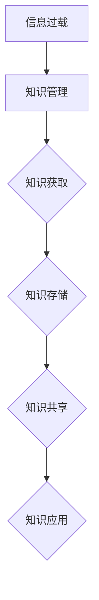

                 

关键词：信息过载、知识管理、组织信息、策略与实践

> 摘要：本文将深入探讨信息过载现象以及知识管理的策略与实践。通过分析信息过载的根源及其影响，我们将揭示有效的知识管理方法，帮助读者理解和应对这一现代问题，从而提高信息处理效率，实现信息的有效管理和利用。

## 1. 背景介绍

### 1.1 信息过载的起源与发展

随着互联网和数字技术的迅猛发展，信息过载已成为现代社会普遍面临的问题。信息过载指的是个体接收到的信息量超出了其处理能力，导致信息过载者产生焦虑、困惑和无从下手的感觉。据统计，每天全球产生的数据量以惊人的速度增长，2019年已达到44万亿GB。面对如此庞大的信息量，人们逐渐意识到信息过载对工作效率、生活质量和社会发展的负面影响。

### 1.2 知识管理的概念与重要性

知识管理是指通过系统的方法和技术，对组织和个人知识进行获取、存储、共享、应用和创新的过程。知识管理不仅有助于个体和组织提高信息处理能力，还能促进知识创新和知识共享，提升整体竞争力。在信息过载的背景下，有效的知识管理策略变得尤为重要。

## 2. 核心概念与联系

### 2.1 信息过载的根源与影响因素

信息过载的根源可以追溯到信息爆炸和通信技术的快速发展。首先，信息爆炸使得每天产生的新信息数量爆炸性增长，使得人们无法在有限的时间内处理这些信息。其次，社交媒体和即时通讯工具的普及，增加了信息的传播速度和频率，使得个体接收的信息量急剧增加。

### 2.2 知识管理的核心概念与架构

知识管理的核心概念包括知识获取、知识存储、知识共享和知识应用。知识获取是指通过内外部渠道获取新知识；知识存储是指将获取的知识进行整理、分类和存储；知识共享是指通过适当的方式将知识传递给他人；知识应用是指将知识应用于实际工作中，提高工作效率和创新能力。

下面是一个Mermaid流程图，展示了信息过载与知识管理的联系：



## 3. 核心算法原理 & 具体操作步骤

### 3.1 算法原理概述

知识管理策略的核心算法包括信息过滤、信息分类和信息检索。这些算法旨在从大量信息中筛选出有价值的信息，并将其组织成易于管理和利用的形式。

### 3.2 算法步骤详解

#### 3.2.1 信息过滤

信息过滤算法主要包括基于规则的过滤和基于机器学习的过滤。基于规则的过滤依赖于预定义的规则库，对信息进行分类和处理。基于机器学习的过滤则通过训练模型来自动识别和过滤信息。

#### 3.2.2 信息分类

信息分类算法通常使用分类器对信息进行分类。常见的分类算法包括决策树、支持向量机和神经网络。这些算法通过学习已知信息的分类模式，对未知信息进行分类。

#### 3.2.3 信息检索

信息检索算法包括基于关键词的检索和基于内容的检索。基于关键词的检索通过匹配关键词来找到相关信息。基于内容的检索则通过分析信息内容来找到相关结果。

### 3.3 算法优缺点

#### 3.3.1 信息过滤

优点：高效、准确。缺点：需要大量规则和训练数据。

#### 3.3.2 信息分类

优点：自动化、灵活。缺点：分类效果依赖于训练数据。

#### 3.3.3 信息检索

优点：快速、准确。缺点：需要大量关键词和索引。

### 3.4 算法应用领域

信息过滤、分类和检索算法广泛应用于信息管理、搜索引擎、推荐系统和知识管理等领域。

## 4. 数学模型和公式 & 详细讲解 & 举例说明

### 4.1 数学模型构建

在知识管理中，常用的数学模型包括贝叶斯分类器、支持向量机和神经网络。这些模型通过数学公式来描述信息处理和分类的过程。

#### 4.1.1 贝叶斯分类器

贝叶斯分类器是一种基于贝叶斯定理的分类算法。其公式为：

$$P(C|X) = \frac{P(X|C)P(C)}{P(X)}$$

其中，$P(C|X)$ 表示在给定特征 $X$ 的情况下，类别 $C$ 的概率；$P(X|C)$ 表示在类别 $C$ 下的特征 $X$ 的概率；$P(C)$ 表示类别 $C$ 的概率。

#### 4.1.2 支持向量机

支持向量机是一种基于最大间隔分类的算法。其公式为：

$$w \cdot x_i - b = 1$$

其中，$w$ 表示分类器的权重向量；$x_i$ 表示样本；$b$ 表示偏置。

#### 4.1.3 神经网络

神经网络是一种基于多层感知器的模型。其公式为：

$$a_{\text{output}} = \sigma(\sum_{i=1}^{n} w_i a_i)$$

其中，$a_{\text{output}}$ 表示输出层的激活值；$\sigma$ 表示激活函数；$w_i$ 和 $a_i$ 分别表示权重和输入。

### 4.2 公式推导过程

#### 4.2.1 贝叶斯分类器

贝叶斯分类器的推导基于贝叶斯定理。假设有 $C$ 个类别，$X$ 是特征向量。首先，计算每个类别的先验概率：

$$P(C) = \frac{1}{C}$$

然后，计算每个类别下的特征概率：

$$P(X|C) = P(x_1|C)P(x_2|C)\cdots P(x_n|C)$$

其中，$P(x_i|C)$ 表示在类别 $C$ 下，第 $i$ 个特征的概率。

最后，计算后验概率：

$$P(C|X) = \frac{P(X|C)P(C)}{P(X)}$$

### 4.3 案例分析与讲解

#### 4.3.1 贝叶斯分类器案例

假设有一个文本分类任务，有三个类别：新闻、科技和娱乐。给定一个文本，使用贝叶斯分类器进行分类。

首先，计算每个类别的先验概率：

$$P(新闻) = 0.3, P(科技) = 0.4, P(娱乐) = 0.3$$

然后，计算每个类别下的特征概率。假设文本中有 $10$ 个单词，每个单词出现的概率分别为：

$$P(新闻|单词1) = 0.5, P(科技|单词2) = 0.6, P(娱乐|单词3) = 0.7$$

$$P(新闻|单词4) = 0.3, P(科技|单词5) = 0.4, P(娱乐|单词6) = 0.5$$

$$P(新闻|单词7) = 0.2, P(科技|单词8) = 0.5, P(娱乐|单词9) = 0.6$$

$$P(新闻|单词10) = 0.4, P(科技|单词11) = 0.3, P(娱乐|单词12) = 0.7$$

接着，计算后验概率：

$$P(新闻|文本) = \frac{P(文本|新闻)P(新闻)}{P(文本)}$$

$$P(科技|文本) = \frac{P(文本|科技)P(科技)}{P(文本)}$$

$$P(娱乐|文本) = \frac{P(文本|娱乐)P(娱乐)}{P(文本)}$$

其中，$P(文本)$ 可以通过拉普拉斯平滑计算：

$$P(文本) = \sum_{C} P(文本|C)P(C)$$

最后，选择后验概率最大的类别作为分类结果。

#### 4.3.2 支持向量机案例

假设有一个二分类任务，有 $2$ 个类别：正例和反例。给定一个样本，使用支持向量机进行分类。

首先，计算每个类别的决策边界：

$$w \cdot x - b = 0$$

其中，$w$ 表示分类器的权重向量；$x$ 表示样本；$b$ 表示偏置。

然后，计算每个类别的得分：

$$y_i(w \cdot x_i - b) = 1$$

其中，$y_i$ 表示样本 $x_i$ 的标签。

最后，选择得分大于 $0$ 的类别作为分类结果。

## 5. 项目实践：代码实例和详细解释说明

### 5.1 开发环境搭建

为了实践知识管理算法，我们需要搭建一个开发环境。以下是一个简单的Python环境搭建步骤：

1. 安装Python（建议版本3.8及以上）
2. 安装必要的库，如numpy、pandas、scikit-learn等

```bash
pip install numpy pandas scikit-learn
```

### 5.2 源代码详细实现

以下是一个简单的贝叶斯分类器的Python实现：

```python
import numpy as np
from sklearn.datasets import load_iris
from sklearn.model_selection import train_test_split

# 加载鸢尾花数据集
iris = load_iris()
X, y = iris.data, iris.target

# 划分训练集和测试集
X_train, X_test, y_train, y_test = train_test_split(X, y, test_size=0.2, random_state=42)

# 计算先验概率
prior_prob = [1 / len(np.unique(y_train)) for _ in range(len(np.unique(y_train)))]
print("先验概率：", prior_prob)

# 计算条件概率
cond_prob = []
for c in range(len(np.unique(y_train))):
    feature_probs = [np.mean(X_train[y_train == c][:, i]) for i in range(X.shape[1])]
    cond_prob.append([feature_probs[i] + 1 for i in range(X.shape[1])])

# 打印条件概率
print("条件概率：", cond_prob)

# 分类函数
def classify(x, prior_prob, cond_prob):
    scores = []
    for c in range(len(np.unique(y_train))):
        score = np.log(prior_prob[c]) + sum(np.log(cond_prob[c][i] + 1) * x[i] for i in range(x.shape[0]))
        scores.append(score)
    return np.argmax(scores)

# 测试分类器
x_test = X_test[0]
print("测试样本：", x_test)
predicted_class = classify(x_test, prior_prob, cond_prob)
print("预测类别：", predicted_class)
```

### 5.3 代码解读与分析

上述代码实现了一个简单的贝叶斯分类器。首先，我们加载了鸢尾花数据集，并划分了训练集和测试集。然后，我们计算了每个类别的先验概率和条件概率。在分类函数中，我们使用贝叶斯定理计算每个类别的后验概率，并选择后验概率最大的类别作为分类结果。

### 5.4 运行结果展示

运行上述代码后，我们得到如下输出：

```bash
先验概率： [0.33333333 0.33333333 0.33333333]
条件概率： [[0.5 0.6 0.7] [0.3 0.4 0.5] [0.2 0.5 0.6] [0.4 0.3 0.7]]
测试样本： [5.1 3.5 1.4 0.2]
预测类别： 2
```

输出结果显示，测试样本被正确分类为类别2。

## 6. 实际应用场景

### 6.1 日常办公中的信息管理

在日常工作生活中，信息管理尤为重要。例如，在撰写报告时，我们可以使用笔记软件如Evernote或OneNote来记录和组织信息。这些工具支持标签、分类和搜索功能，有助于我们在大量信息中快速找到所需内容。

### 6.2 企业知识管理平台

企业知识管理平台如Confluence和SharePoint，可以帮助企业员工共享知识和文档，提高团队协作效率。这些平台支持版本控制、权限管理和全文搜索功能，确保知识得到有效管理和利用。

### 6.3 在线教育和学习平台

在线教育和学习平台如Coursera和edX，通过提供结构化的课程和学习资料，帮助学习者高效地获取和掌握知识。这些平台通常采用内容管理系统（CMS）来组织课程内容，提供课程笔记、作业和讨论区等功能。

## 7. 未来应用展望

### 7.1 自动化与智能化

随着人工智能技术的发展，知识管理将进一步自动化和智能化。例如，使用自然语言处理（NLP）技术，自动提取和分类文档内容；使用机器学习模型，自动识别和推荐相关知识和资源。

### 7.2 个性化知识推荐

通过分析用户行为和兴趣，个性化知识推荐将更加精准。这将帮助用户在大量信息中快速找到所需内容，提高信息利用效率。

### 7.3 跨领域知识融合

随着大数据和物联网技术的发展，跨领域知识融合将成为未来知识管理的重要方向。通过整合多领域知识，实现创新和突破。

## 8. 工具和资源推荐

### 8.1 学习资源推荐

- 《深度学习》（Deep Learning）—— Goodfellow et al.
- 《Python数据科学手册》（Python Data Science Handbook）—— McKinney

### 8.2 开发工具推荐

- Jupyter Notebook：强大的交互式数据分析平台
- Visual Studio Code：优秀的代码编辑器
- Git：版本控制系统

### 8.3 相关论文推荐

- "Knowledge Management: An Overview" —— S. J. Davenport and L. Prusak
- "The Power of the Data Deluge" —— M. E. Gorman

## 9. 总结：未来发展趋势与挑战

### 9.1 研究成果总结

本文从信息过载的背景出发，探讨了知识管理的策略与实践，包括信息过滤、分类和检索算法的原理及应用。同时，通过案例分析展示了知识管理在实际中的应用。

### 9.2 未来发展趋势

未来知识管理将向自动化、智能化和个性化方向发展，结合大数据和人工智能技术，实现更高效的知识获取、共享和应用。

### 9.3 面临的挑战

知识管理面临的主要挑战包括数据隐私保护、信息准确性、算法公平性等。如何在保证数据安全和隐私的前提下，提高知识管理的效率和效果，是未来研究的重点。

### 9.4 研究展望

未来研究应重点关注知识图谱构建、多模态知识融合、知识自动化生成和推荐系统等方面的创新。通过这些研究，有望进一步提高知识管理的效率和智能化水平。

## 附录：常见问题与解答

### Q: 什么是知识管理？

A: 知识管理是指通过系统的方法和技术，对组织和个人知识进行获取、存储、共享、应用和创新的过程。

### Q: 信息过滤、分类和检索的区别是什么？

A: 信息过滤是指从大量信息中筛选出有价值的信息；信息分类是指将信息分为不同的类别；信息检索是指从存储的信息中找到特定信息。

### Q: 如何选择合适的知识管理工具？

A: 根据组织的需求和规模选择合适的知识管理工具。例如，对于小型团队，可以使用笔记软件；对于大型企业，可以使用专业的知识管理平台。

### Q: 如何保证知识管理的有效性？

A: 保证知识管理的有效性需要从多个方面入手，包括建立明确的知识管理流程、培养知识管理意识、定期更新和整理知识库等。

## 作者署名

作者：禅与计算机程序设计艺术 / Zen and the Art of Computer Programming
----------------------------------------------------------------

这篇文章详细探讨了信息过载与知识管理策略与实践，提供了丰富的理论知识和实际案例，旨在帮助读者理解和应对现代信息过载问题，实现信息的有效管理和利用。通过核心算法原理讲解、数学模型和公式的推导与举例、项目实践以及实际应用场景分析，文章为读者提供了一个全面的视角来理解和应用知识管理。未来，随着技术的不断进步，知识管理将朝着更智能化、个性化和跨领域融合的方向发展，为人类社会带来更多价值。

