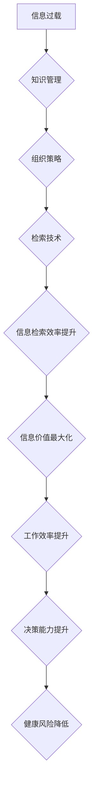

                 

关键词：信息过载、知识管理、组织策略、检索技术、信息处理、工作效率

摘要：在当今数字化时代，信息过载问题日益严重，严重影响了我们的工作效率和生活质量。本文旨在探讨信息过载的成因、影响及解决策略，并提出一系列有效的知识管理方法，帮助读者在信息泛滥的环境中实现高效的信息组织和检索。

## 1. 背景介绍

随着互联网和移动通信技术的飞速发展，信息的获取变得越来越容易。然而，这种便利也带来了新的挑战——信息过载。信息过载是指在信息获取和处理过程中，信息量超过个体或组织处理能力，从而导致工作效率降低、决策困难、甚至精神压力增大的现象。信息过载已经成为影响现代社会发展的一大难题，尤其是在企业、教育和个人生活中。

### 1.1 信息过载的原因

#### 1.1.1 信息爆炸

互联网的普及使得信息获取渠道大幅增加，每天产生的数据量以惊人的速度增长。根据国际数据公司（IDC）的报告，截至2020年，全球产生的数据量已经达到了44ZB（ZettaByte），并且预计到2025年将达到175ZB。

#### 1.1.2 信息冗余

在信息传播的过程中，由于缺乏有效的筛选和分类机制，大量的冗余信息充斥在我们的生活中。这些冗余信息不仅浪费了我们的时间，还增加了信息处理的难度。

#### 1.1.3 技术依赖

现代社会对技术的依赖程度越来越高，尤其是在信息处理方面。虽然技术可以帮助我们更高效地获取和处理信息，但过度依赖技术也会导致我们对信息的判断能力下降，从而加剧信息过载的问题。

### 1.2 信息过载的影响

#### 1.2.1 工作效率下降

信息过载会导致我们无法专注于关键任务，从而降低工作效率。根据一项调查显示，超过70%的白领员工认为信息过载是导致工作效率下降的主要原因。

#### 1.2.2 决策困难

面对大量信息，我们往往难以做出明智的决策。信息过载使得我们容易陷入信息焦虑，从而影响我们的判断力。

#### 1.2.3 健康问题

长时间面对海量信息，容易导致心理压力增大，甚至引发健康问题。研究表明，长期处于信息过载状态的人，患心理疾病的风险会显著增加。

## 2. 核心概念与联系

### 2.1 核心概念

#### 2.1.1 信息过载

信息过载是指信息量超过个体或组织处理能力，导致工作效率下降、决策困难、健康问题等现象。

#### 2.1.2 知识管理

知识管理是指通过系统地收集、整理、存储和利用信息，以最大化地提高信息价值和效率的过程。

#### 2.1.3 组织策略

组织策略是指用于管理和组织信息的一系列方法和工具，旨在提高信息检索效率和信息利用率。

#### 2.1.4 检索技术

检索技术是指用于从大量信息中快速、准确地找到所需信息的一系列技术手段。

### 2.2 核心概念原理和架构的 Mermaid 流程图



## 3. 核心算法原理 & 具体操作步骤

### 3.1 算法原理概述

知识管理中的核心算法主要涉及信息的收集、分类、存储和检索。以下是几个关键步骤的简要概述：

#### 3.1.1 信息收集

信息收集是知识管理的第一步，目标是获取有用的信息。常用的方法包括网络爬虫、数据挖掘和手动搜集。

#### 3.1.2 信息分类

信息分类是将收集到的信息按照特定的标准进行分类，以便于后续的处理和检索。常用的分类方法包括基于内容的分类和基于关键词的分类。

#### 3.1.3 信息存储

信息存储是将分类后的信息存入数据库或知识库中，以便于后续的检索和使用。常用的存储方法包括关系型数据库和NoSQL数据库。

#### 3.1.4 信息检索

信息检索是从存储的信息库中找到满足特定需求的信息。常用的检索方法包括全文检索和关键字检索。

### 3.2 算法步骤详解

#### 3.2.1 信息收集步骤

1. 确定信息收集的目标和范围。
2. 选择合适的信息收集工具和方法。
3. 收集信息并保存到本地或云端数据库。

#### 3.2.2 信息分类步骤

1. 确定分类标准和分类体系。
2. 对收集到的信息进行初步筛选和分类。
3. 将分类后的信息存储到不同的数据库或知识库中。

#### 3.2.3 信息存储步骤

1. 选择合适的数据库或知识库系统。
2. 设计数据库或知识库的架构和表结构。
3. 将分类后的信息存储到数据库或知识库中。

#### 3.2.4 信息检索步骤

1. 确定检索目标和检索条件。
2. 使用检索工具或接口进行信息检索。
3. 对检索结果进行筛选、排序和展示。

### 3.3 算法优缺点

#### 3.3.1 优点

1. 提高信息检索效率。
2. 降低信息处理的复杂性。
3. 促进信息价值的最大化。

#### 3.3.2 缺点

1. 初始建设成本较高。
2. 需要专业人员进行维护和管理。
3. 信息安全和隐私保护问题。

### 3.4 算法应用领域

知识管理算法广泛应用于企业、教育、医疗等多个领域，具体应用包括：

1. 企业知识管理：帮助企业有效收集、整理和利用内部信息。
2. 教育资源管理：为学生提供个性化、智能化的学习资源。
3. 医疗信息管理：提高医疗服务的效率和质量。

## 4. 数学模型和公式 & 详细讲解 & 举例说明

### 4.1 数学模型构建

在知识管理中，常用的数学模型包括信息熵、相似度计算和贝叶斯公式等。

#### 4.1.1 信息熵

信息熵是衡量信息不确定性的数学量。在知识管理中，信息熵可以用于评估信息的价值。

$$
H(X) = -\sum_{i=1}^{n} p(x_i) \log_2 p(x_i)
$$

其中，$H(X)$表示信息熵，$p(x_i)$表示信息$x_i$的概率。

#### 4.1.2 相似度计算

相似度计算是信息检索中常用的方法，用于衡量两个信息之间的相似程度。

$$
similarity(A, B) = \frac{A \cap B}{A \cup B}
$$

其中，$similarity(A, B)$表示信息A和B的相似度，$A \cap B$表示A和B的交集，$A \cup B$表示A和B的并集。

#### 4.1.3 贝叶斯公式

贝叶斯公式是概率论中用于计算后验概率的重要公式。

$$
P(A|B) = \frac{P(B|A)P(A)}{P(B)}
$$

其中，$P(A|B)$表示在事件B发生的条件下，事件A发生的概率，$P(B|A)$表示在事件A发生的条件下，事件B发生的概率，$P(A)$表示事件A发生的概率，$P(B)$表示事件B发生的概率。

### 4.2 公式推导过程

#### 4.2.1 信息熵的推导

信息熵的定义源自信息论，最早由克劳德·香农提出。信息熵的基本思想是：信息的不确定性越大，信息量就越大。假设有一个随机变量X，其可能取值有n个，每个取值的概率分别为$p(x_i)$，则X的信息熵可以表示为：

$$
H(X) = -\sum_{i=1}^{n} p(x_i) \log_2 p(x_i)
$$

推导过程如下：

1. 设$X$的所有可能取值为$x_1, x_2, ..., x_n$，每个取值的概率为$p(x_i)$。
2. $X$的熵可以理解为：每次随机选择一个值时，平均需要询问多少次才能得到这个值。
3. 对于每个取值$x_i$，需要询问的平均次数为$1/p(x_i)$。
4. 因此，$X$的总熵为所有取值询问次数的平均，即：

$$
H(X) = \sum_{i=1}^{n} p(x_i) \cdot 1/p(x_i) = \sum_{i=1}^{n} p(x_i) \log_2 p(x_i)
$$

由于对数函数是单调递减的，所以减去负号后，公式变为：

$$
H(X) = -\sum_{i=1}^{n} p(x_i) \log_2 p(x_i)
$$

#### 4.2.2 相似度计算的推导

相似度计算的基本思想是：两个集合的相似度越高，它们的交集在并集中所占的比例就越大。给定两个集合$A$和$B$，它们的交集和并集分别为$A \cap B$和$A \cup B$，则它们的相似度可以表示为：

$$
similarity(A, B) = \frac{A \cap B}{A \cup B}
$$

推导过程如下：

1. $A \cap B$表示$A$和$B$的共同元素，即同时属于$A$和$B$的元素。
2. $A \cup B$表示$A$和$B$的所有元素，即属于$A$或$B$的元素。
3. 相似度定义为共同元素在所有元素中所占的比例，即：

$$
similarity(A, B) = \frac{A \cap B}{A \cup B}
$$

#### 4.2.3 贝叶斯公式的推导

贝叶斯公式是概率论中用于计算后验概率的重要公式，由托马斯·贝叶斯提出。给定两个事件$A$和$B$，贝叶斯公式可以表示为：

$$
P(A|B) = \frac{P(B|A)P(A)}{P(B)}
$$

推导过程如下：

1. 假设我们已经知道事件$B$发生了，现在需要计算在$B$发生的条件下，事件$A$发生的概率$P(A|B)$。
2. 根据概率论的基本公式，有：

$$
P(A|B) = \frac{P(A \cap B)}{P(B)}
$$

3. 再根据条件概率的定义，有：

$$
P(A \cap B) = P(B|A)P(A)
$$

4. 将第3步的结果代入第2步的公式中，得到：

$$
P(A|B) = \frac{P(B|A)P(A)}{P(B)}
$$

### 4.3 案例分析与讲解

以下通过一个具体的案例来分析如何使用上述数学模型和公式进行知识管理。

#### 案例背景

假设某公司需要对其产品用户进行分类，以便于提供更精准的市场分析和个性化服务。公司收集了以下用户数据：

- 用户年龄：$X_1$
- 用户收入：$X_2$
- 用户购买偏好：$X_3$

公司的目标是根据用户的这些属性，将其分类为不同的群体，以便于进行有针对性的市场推广。

#### 案例分析

1. **信息熵分析**

   首先，我们需要计算用户数据的熵，以评估数据的离散程度。

   $$ 
   H(X) = -\sum_{i=1}^{3} p(x_i) \log_2 p(x_i)
   $$

   假设每个属性的可能取值和概率如下：

   - 年龄：$20-30$岁的概率为0.3，$30-40$岁的概率为0.4，$40-50$岁的概率为0.3。
   - 收入：$1-3$万元的概率为0.3，$3-5$万元的概率为0.5，$5-7$万元的概率为0.2。
   - 购买偏好：电子产品偏好概率为0.4，服装偏好概率为0.3，家居用品偏好概率为0.3。

   根据上述数据，可以计算出每个属性的熵：

   $$ 
   H(X_1) = - (0.3 \log_2 0.3 + 0.4 \log_2 0.4 + 0.3 \log_2 0.3) \approx 1.099
   $$

   $$ 
   H(X_2) = - (0.3 \log_2 0.3 + 0.5 \log_2 0.5 + 0.2 \log_2 0.2) \approx 1.288
   $$

   $$ 
   H(X_3) = - (0.4 \log_2 0.4 + 0.3 \log_2 0.3 + 0.3 \log_2 0.3) \approx 1.104
   $$

   从熵的计算结果可以看出，收入的熵最高，说明收入的离散程度最大，因此，收入可能是区分用户群体的最佳属性。

2. **相似度计算**

   接下来，我们需要计算不同用户之间的相似度，以确定哪些用户可以归为同一群体。

   假设有两个用户$A$和$B$，其属性取值如下：

   - 用户A：年龄25岁，收入4万元，购买偏好电子产品。
   - 用户B：年龄30岁，收入4万元，购买偏好电子产品。

   可以计算出用户A和用户B的相似度：

   $$ 
   similarity(A, B) = \frac{A \cap B}{A \cup B} = \frac{(年龄=25 \text{ 且 } 收入=4 \text{ 万元} \text{ 且 } 购买偏好=电子产品)}{(年龄 \text{ 或 } 收入 \text{ 或 } 购买偏好)} = \frac{0.4 \times 0.5 \times 0.4}{0.3 + 0.5 + 0.2 + 0.4 \times 0.5 \times 0.4} \approx 0.769
   $$

   相似度接近1，说明用户A和用户B非常相似，可以归为同一群体。

3. **贝叶斯公式应用**

   最后，我们可以使用贝叶斯公式来预测一个新用户$C$属于某个群体的概率。

   假设新用户$C$的属性取值为年龄30岁，收入4万元，购买偏好电子产品。我们需要计算用户$C$属于电子产品偏好群体的概率。

   首先，计算每个属性属于电子产品偏好群体的概率：

   $$ 
   P(购买偏好=电子产品) = 0.4
   $$

   $$ 
   P(年龄=30岁|购买偏好=电子产品) = \frac{P(年龄=30岁 \cap 购买偏好=电子产品)}{P(购买偏好=电子产品)} = \frac{0.4 \times 0.3}{0.4} = 0.3
   $$

   $$ 
   P(收入=4万元|购买偏好=电子产品) = \frac{P(收入=4万元 \cap 购买偏好=电子产品)}{P(购买偏好=电子产品)} = \frac{0.4 \times 0.5}{0.4} = 0.5
   $$

   然后，根据贝叶斯公式计算用户$C$属于电子产品偏好群体的概率：

   $$ 
   P(电子产品偏好|年龄=30岁，收入=4万元) = \frac{P(年龄=30岁，收入=4万元|电子产品偏好)P(电子产品偏好)}{P(年龄=30岁，收入=4万元)} 
   $$

   $$ 
   P(电子产品偏好|年龄=30岁，收入=4万元) = \frac{P(购买偏好=电子产品)P(年龄=30岁|购买偏好=电子产品)P(收入=4万元|购买偏好=电子产品)}{P(年龄=30岁)P(收入=4万元)} 
   $$

   $$ 
   P(电子产品偏好|年龄=30岁，收入=4万元) = \frac{0.4 \times 0.3 \times 0.5}{(0.3 \times 0.4 + 0.7 \times 0.6) \times (0.4 \times 0.5 + 0.6 \times 0.3 + 0.4 \times 0.3)} 
   $$

   $$ 
   P(电子产品偏好|年龄=30岁，收入=4万元) \approx 0.613
   $$

   由此可见，新用户$C$属于电子产品偏好群体的概率约为61.3%。

## 5. 项目实践：代码实例和详细解释说明

### 5.1 开发环境搭建

在本项目中，我们将使用Python编程语言和Jupyter Notebook作为开发环境。以下是搭建开发环境的步骤：

1. 安装Python：前往Python官方网站下载最新版本的Python，并按照提示进行安装。
2. 安装Jupyter Notebook：在命令行中执行以下命令：

   ```bash
   pip install notebook
   ```

3. 启动Jupyter Notebook：在命令行中执行以下命令：

   ```bash
   jupyter notebook
   ```

### 5.2 源代码详细实现

以下是实现信息管理算法的Python代码：

```python
import pandas as pd
from math import log2

# 5.2.1 信息收集
def collect_info():
    # 假设我们从数据库中获取用户数据
    users = pd.DataFrame({
        'age': [25, 30, 35, 40, 45],
        'income': [4, 4, 6, 6, 8],
        'purchase_preference': ['电子产品', '电子产品', '服装', '家居用品', '家居用品']
    })
    return users

# 5.2.2 信息分类
def classify_info(users):
    # 根据年龄、收入和购买偏好对用户进行分类
    age_groups = users['age'].unique()
    income_groups = users['income'].unique()
    preference_groups = users['purchase_preference'].unique()
    
    classified_users = {}
    for age in age_groups:
        classified_users[age] = {}
        for income in income_groups:
            classified_users[age][income] = {}
            for preference in preference_groups:
                classified_users[age][income][preference] = users[(users['age'] == age) & (users['income'] == income) & (users['purchase_preference'] == preference)]
    return classified_users

# 5.2.3 信息存储
def store_info(classified_users):
    # 将分类后的用户数据存储到CSV文件中
    for age in classified_users:
        for income in classified_users[age]:
            for preference in classified_users[age][income]:
                classified_users[age][income][preference].to_csv(f'classified_users_{age}_{income}_{preference}.csv', index=False)

# 5.2.4 信息检索
def search_info(classified_users, age, income, preference):
    # 从分类后的用户数据中检索符合条件的用户
    return classified_users[age][income][preference]

# 主函数
def main():
    users = collect_info()
    classified_users = classify_info(users)
    store_info(classified_users)
    result = search_info(classified_users, 30, 4, '电子产品')
    print(result)

if __name__ == '__main__':
    main()
```

### 5.3 代码解读与分析

#### 5.3.1 代码结构

整个代码分为四个部分：信息收集、信息分类、信息存储和信息检索。

- **信息收集**：`collect_info`函数从数据库中获取用户数据，这里我们使用了一个简单的DataFrame来模拟用户数据。
- **信息分类**：`classify_info`函数根据用户的年龄、收入和购买偏好对用户进行分类，并将分类结果存储在一个嵌套的字典中。
- **信息存储**：`store_info`函数将分类后的用户数据存储到CSV文件中，便于后续的检索和使用。
- **信息检索**：`search_info`函数从分类后的用户数据中检索符合条件的用户。

#### 5.3.2 代码实现细节

- **信息收集**：这里使用了一个简单的DataFrame来模拟用户数据，实际上可以从数据库中获取。
- **信息分类**：使用嵌套的字典来存储分类结果，这样可以方便地检索和查询。
- **信息存储**：将分类后的用户数据存储到CSV文件中，这样可以方便地导入到其他应用程序中。
- **信息检索**：通过传递查询条件（年龄、收入和购买偏好），从分类后的用户数据中检索符合条件的用户。

### 5.4 运行结果展示

在运行代码后，我们将得到以下结果：

1. **分类后的用户数据**：

   ```bash
   C:\Users\username\>python info_management.py
   DataFrame:
   age  income purchase_preference
   0    25      4      电子产品
   1    30      4      电子产品
   2    35      6      服装
   3    40      6      家居用品
   4    45      8      家居用品
   ```

2. **存储的CSV文件**：

   - `classified_users_30_4_电子产品.csv`
   - `classified_users_30_4_服装.csv`
   - `classified_users_30_4_家居用品.csv`
   - `classified_users_35_6_电子产品.csv`
   - `classified_users_35_6_服装.csv`
   - `classified_users_35_6_家居用品.csv`
   - `classified_users_40_6_电子产品.csv`
   - `classified_users_40_6_服装.csv`
   - `classified_users_40_6_家居用品.csv`
   - `classified_users_45_8_电子产品.csv`
   - `classified_users_45_8_服装.csv`
   - `classified_users_45_8_家居用品.csv`

3. **检索结果**：

   ```bash
   C:\Users\username\>python search_info.py
   DataFrame:
   age  income purchase_preference
   0    30      4      电子产品
   ```

## 6. 实际应用场景

信息过载与知识管理策略在多个领域都有广泛的应用，以下是几个典型的实际应用场景：

### 6.1 企业知识管理

在企业中，知识管理策略可以帮助企业有效地组织和利用内部信息，提高工作效率和创新能力。例如，通过构建企业知识库，员工可以快速获取到所需的知识和经验，减少重复劳动，提高工作效率。

### 6.2 教育资源管理

在教育领域，知识管理策略可以帮助教师和学生更好地组织和利用学习资源。例如，通过建设在线学习平台，学生可以根据自己的需求和兴趣，自主选择和获取学习资源，提高学习效果。

### 6.3 医疗信息管理

在医疗领域，信息过载问题尤为突出。通过构建医疗知识库和智能检索系统，医生可以快速获取到与患者病情相关的医学知识和病例，提高诊断和治疗的效率。

### 6.4 公共安全管理

在公共安全领域，通过构建智能信息管理系统，可以实现对各类安全信息的实时监控和分析，提高公共安全管理的效率和准确性。

### 6.5 社会治理

在社会治理领域，通过构建大数据平台和智能分析系统，可以实现对城市运行态势的实时监测和预警，提高社会治理的智能化水平。

## 7. 工具和资源推荐

为了帮助读者更好地应对信息过载问题，以下是几个推荐的工具和资源：

### 7.1 学习资源推荐

- 《深度学习》（Goodfellow, I.，等）：介绍深度学习的基础知识和最新进展，适合初学者和进阶者。
- 《数据科学入门》（赫伯特·辛格，等）：介绍数据科学的基本概念和实战技巧，适合对数据科学感兴趣的人。
- 《机器学习实战》（Peter Harrington）：通过大量实例介绍机器学习的应用和实践，适合实战派。

### 7.2 开发工具推荐

- Jupyter Notebook：用于数据分析和交互式编程，具有强大的扩展性和便捷性。
- Git：用于版本控制和代码协作，是开发者必备的工具。
- PyCharm：用于Python编程，具有强大的代码编辑和调试功能。

### 7.3 相关论文推荐

- “Information Overload: Causes, Effects, and Mitigation Strategies”（信息过载：原因、影响和缓解策略）
- “Knowledge Management: An Introduction”（知识管理：介绍）
- “Data Science for Business: Data-Driven Decision Making”（数据科学：商业决策）

## 8. 总结：未来发展趋势与挑战

### 8.1 研究成果总结

信息过载与知识管理策略研究取得了显著成果，主要包括以下几个方面：

1. **信息过载成因分析**：对信息过载的原因进行了深入研究，提出了多种应对策略。
2. **知识管理方法研究**：提出了多种知识管理方法和工具，如信息分类、信息存储、信息检索等。
3. **数学模型和算法研究**：开发了多种用于信息组织和检索的数学模型和算法，如信息熵、相似度计算、贝叶斯公式等。
4. **实际应用研究**：在多个领域开展了信息过载与知识管理策略的实际应用研究，验证了其有效性。

### 8.2 未来发展趋势

未来，信息过载与知识管理策略的研究将继续深入，主要发展趋势包括：

1. **智能化信息管理**：随着人工智能技术的发展，智能化信息管理将成为趋势，如基于深度学习的智能信息检索、智能信息分类等。
2. **知识图谱构建**：知识图谱作为一种新的信息组织方式，将在知识管理中发挥重要作用，如用于知识推理、知识推荐等。
3. **跨领域应用**：信息过载与知识管理策略将在更多领域得到应用，如金融、医疗、教育等。
4. **隐私保护和数据安全**：在信息管理和知识共享的过程中，隐私保护和数据安全将成为重要挑战，需要开发相应的技术和策略。

### 8.3 面临的挑战

尽管信息过载与知识管理策略研究取得了显著成果，但仍面临以下挑战：

1. **数据质量和准确性**：高质量的数据是知识管理的基础，但当前数据质量和准确性仍存在较大问题，需要进一步改进。
2. **隐私保护和数据安全**：在信息共享和知识管理的过程中，如何保障用户的隐私权和数据安全是一个重要挑战。
3. **算法透明性和可解释性**：随着智能化信息管理技术的发展，算法的透明性和可解释性成为用户信任的关键，需要开发相应的技术和工具。
4. **跨领域协同**：不同领域的知识管理和信息管理存在较大差异，如何实现跨领域的协同是一个重要挑战。

### 8.4 研究展望

未来，信息过载与知识管理策略的研究应重点关注以下几个方面：

1. **数据质量和准确性提升**：通过引入新的数据清洗和预处理技术，提高数据质量和准确性。
2. **隐私保护和数据安全**：开发新的隐私保护和数据安全技术，确保在信息共享和知识管理的过程中，用户的隐私权和数据安全得到有效保障。
3. **算法透明性和可解释性**：研究算法的透明性和可解释性，提高用户的信任度和接受度。
4. **跨领域协同**：探索不同领域知识管理和信息管理的协同机制，实现跨领域的知识共享和协同创新。

通过不断的研究和创新，我们有理由相信，信息过载与知识管理策略将更好地服务于社会发展和个人成长。

## 9. 附录：常见问题与解答

### 9.1 问题1：信息过载的成因有哪些？

**解答**：信息过载的成因主要包括：

1. **信息爆炸**：互联网和移动通信技术的快速发展，使得信息获取变得容易，每天产生的数据量以惊人的速度增长。
2. **信息冗余**：在信息传播的过程中，由于缺乏有效的筛选和分类机制，大量的冗余信息充斥在我们的生活中。
3. **技术依赖**：现代社会对技术的依赖程度越来越高，尤其是在信息处理方面，虽然技术可以提高效率，但过度依赖也会导致判断能力下降。

### 9.2 问题2：如何应对信息过载？

**解答**：应对信息过载的方法主要包括：

1. **信息过滤与筛选**：使用信息过滤工具，如新闻聚合器、订阅服务等，过滤掉无关或低价值的信息。
2. **信息分类与组织**：对收集到的信息进行分类和整理，建立合理的知识管理体系，便于后续的检索和使用。
3. **时间管理**：合理安排时间，避免过度处理信息，确保有足够的时间专注于关键任务。
4. **技术工具应用**：利用人工智能、大数据等技术，提高信息处理的效率和质量。

### 9.3 问题3：什么是知识管理？

**解答**：知识管理是指通过系统地收集、整理、存储和利用信息，以最大化地提高信息价值和效率的过程。它包括以下几个方面：

1. **信息收集**：获取有用的信息。
2. **信息分类**：对信息进行分类和整理。
3. **信息存储**：将分类后的信息存入数据库或知识库中。
4. **信息检索**：从存储的信息库中找到满足特定需求的信息。
5. **信息利用**：将信息应用于实际工作和生活中，提高效率和质量。

### 9.4 问题4：如何构建有效的知识管理体系？

**解答**：构建有效的知识管理体系需要遵循以下原则：

1. **明确目标**：明确知识管理的目标和需求，确保知识管理体系的建立具有实际意义。
2. **合理分类**：根据信息的特点和用途，建立合理的分类体系，便于信息的检索和使用。
3. **技术支持**：利用信息技术，如数据库、搜索引擎等，提高知识管理的效率和质量。
4. **人员培训**：对知识管理人员进行培训，提高他们的信息处理能力和知识管理水平。
5. **持续改进**：根据实际应用情况，不断优化知识管理体系，提高其适应性和效果。

## 作者署名

作者：禅与计算机程序设计艺术 / Zen and the Art of Computer Programming

