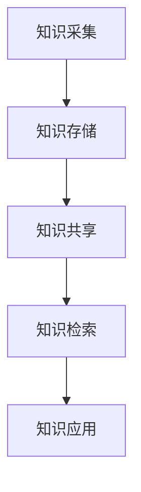

                 

 **关键词：** 信息过载、知识管理系统、信息组织、信息检索、人工智能

**摘要：** 随着信息技术的飞速发展，信息过载问题日益严重。如何有效地组织和检索信息成为了当前信息技术领域的重要课题。本文将探讨信息过载的背景，介绍知识管理系统的核心概念与架构，分析核心算法原理与步骤，构建数学模型，并通过实际项目实践和代码实例，展示如何应用这些知识管理系统解决信息过载问题。文章最后对未来发展趋势与挑战进行了展望。

## 1. 背景介绍

在当今的信息化社会中，信息已经成为社会生产力和经济发展的重要资源。然而，随着互联网、社交媒体、大数据等技术的广泛应用，信息的数量和种类急剧增加，导致信息过载现象愈发严重。信息过载不仅影响了人们的工作效率和生活质量，还对企业和组织的决策产生了负面影响。

信息过载的主要表现为以下几个方面：

1. **信息冗余**：网络上充斥着大量的重复信息和无关内容，使得用户难以分辨和获取有价值的信息。
2. **信息泛滥**：各种渠道的信息量爆炸式增长，用户接收和处理信息的能力有限，导致注意力分散。
3. **信息孤岛**：不同系统和平台之间的信息难以共享和整合，造成信息资源的浪费。

为了解决信息过载问题，知识管理系统（Knowledge Management System, KMS）应运而生。知识管理系统旨在通过有效组织和利用信息，提高组织和个人对信息的获取、理解和应用能力，从而实现信息价值的最大化。

## 2. 核心概念与联系

### 2.1 知识管理系统的核心概念

知识管理系统（KMS）是一种基于信息技术和知识管理理论的综合性系统，旨在通过整合组织内外部的知识和信息资源，提升组织知识创新和知识应用的能力。以下是知识管理系统中的几个核心概念：

- **知识**：包括显性知识和隐性知识。显性知识是可以通过文档、数据、报告等形式明确表达的知识，如专利、文献、数据库等；隐性知识则是难以明确表达和形式化的知识，如经验、技能、文化等。
- **知识共享**：指知识在组织内部或跨组织之间的传递和交流过程，通过知识共享可以促进知识的传播和创新。
- **知识存储**：指将知识以适当的形式存储在知识库中，以便于后续的检索和使用。
- **知识检索**：通过特定的算法和技术，从知识库中快速准确地获取所需的知识。

### 2.2 知识管理系统的架构

知识管理系统的架构通常包括以下几个关键部分：

1. **知识采集**：通过各种渠道收集内外部知识，如员工经验、客户反馈、市场研究等。
2. **知识存储**：将采集到的知识进行分类、标注，并存储在知识库中，便于后续检索和使用。
3. **知识共享**：提供知识共享的平台和工具，如企业内部网、论坛、邮件列表等，促进知识的传播和应用。
4. **知识检索**：利用搜索引擎、分类索引等技术，帮助用户快速找到所需的知识。
5. **知识应用**：将知识应用于实际工作中，如决策支持、问题解决等。

### 2.3 Mermaid 流程图

下面是一个简化的知识管理系统流程图的示例，使用 Mermaid 语法表示：



## 3. 核心算法原理 & 具体操作步骤

### 3.1 算法原理概述

知识管理系统的核心算法主要包括信息检索算法、知识推荐算法和知识分类算法。这些算法通过不同的方式处理和组织信息，以实现信息的有效管理和应用。

- **信息检索算法**：如基于关键词的检索、基于内容的检索、基于语义的检索等，通过算法快速定位用户所需信息。
- **知识推荐算法**：如协同过滤、基于内容的推荐等，根据用户的历史行为和兴趣推荐相关知识和信息。
- **知识分类算法**：如聚类算法、分类算法等，对知识进行自动分类，便于用户快速查找。

### 3.2 算法步骤详解

#### 3.2.1 信息检索算法

1. **构建索引**：将信息文档进行预处理，提取关键词和特征，并构建索引。
2. **关键词匹配**：用户输入查询关键词，与索引中的关键词进行匹配。
3. **排序与返回结果**：根据匹配程度对结果进行排序，并将排序后的结果返回给用户。

#### 3.2.2 知识推荐算法

1. **用户行为分析**：收集用户的历史行为数据，如浏览记录、购买记录等。
2. **计算相似度**：计算用户之间的相似度，可以使用余弦相似度、皮尔逊相关系数等方法。
3. **推荐列表生成**：根据相似度计算结果，为用户推荐相似的兴趣或需求。

#### 3.2.3 知识分类算法

1. **特征提取**：从知识文档中提取特征，如文本特征、图像特征等。
2. **聚类或分类**：使用聚类算法（如K-means、DBSCAN）或分类算法（如SVM、决策树）对知识进行分类。
3. **评估与优化**：对分类结果进行评估，根据评估结果调整分类模型。

### 3.3 算法优缺点

- **信息检索算法**：优点是检索速度快，用户可以快速找到所需信息；缺点是对复杂查询的支持有限，可能无法满足用户的高级需求。
- **知识推荐算法**：优点是能够根据用户行为提供个性化的推荐，提高用户满意度；缺点是推荐结果可能受到数据稀疏性和冷启动问题的影响。
- **知识分类算法**：优点是能够自动对知识进行分类，提高知识的可访问性；缺点是分类结果可能受到特征提取和质量的影响。

### 3.4 算法应用领域

知识管理系统和相关的核心算法在各个领域都有广泛的应用：

- **企业内部知识管理**：用于企业内部的知识共享、知识库建设和知识检索。
- **电子商务**：用于用户行为分析和商品推荐。
- **智能搜索引擎**：用于构建高效的搜索引擎，提供精准的检索结果。
- **医疗健康**：用于医疗信息的分类和检索，辅助医生进行诊断和治疗。
- **教育领域**：用于教育资源的组织和推荐，提高教育效果。

## 4. 数学模型和公式 & 详细讲解 & 举例说明

### 4.1 数学模型构建

在知识管理系统中，数学模型广泛应用于信息检索、知识推荐和知识分类等环节。以下是一些常用的数学模型和公式：

#### 4.1.1 余弦相似度

$$
\cos\theta = \frac{\vec{a} \cdot \vec{b}}{|\vec{a}| \cdot |\vec{b}|}
$$

其中，$\vec{a}$和$\vec{b}$分别是两个向量，$\theta$是它们的夹角。余弦相似度可以用来计算两个向量之间的相似程度。

#### 4.1.2 梯度下降法

梯度下降法是一种优化算法，用于求解最小值问题。其基本公式为：

$$
\theta_{\text{new}} = \theta_{\text{old}} - \alpha \cdot \nabla J(\theta)
$$

其中，$\theta$是模型参数，$\alpha$是学习率，$J(\theta)$是损失函数。

### 4.2 公式推导过程

#### 4.2.1 梯度下降法推导

假设我们要最小化损失函数$J(\theta)$，梯度下降法的核心思想是通过迭代更新参数$\theta$，以逐步减小损失函数的值。

1. **初始化参数**：随机选择一组参数$\theta_{\text{old}}$。
2. **计算梯度**：计算损失函数关于参数$\theta$的梯度$\nabla J(\theta)$。
3. **更新参数**：根据梯度更新参数：
   $$
   \theta_{\text{new}} = \theta_{\text{old}} - \alpha \cdot \nabla J(\theta)
   $$
4. **重复迭代**：重复步骤2和3，直到满足停止条件（如梯度变化很小或达到最大迭代次数）。

### 4.3 案例分析与讲解

#### 4.3.1 文本分类案例

假设我们要使用梯度下降法训练一个文本分类模型，给定训练数据集$D = \{(\text{x}_i, \text{y}_i)\}_{i=1}^n$，其中$\text{x}_i$是文本数据，$\text{y}_i$是标签。我们的目标是预测每个文本数据的类别。

1. **初始化参数**：随机选择一个参数向量$\theta$。
2. **计算预测概率**：使用softmax函数计算每个类别的预测概率：
   $$
   \hat{y}_i = \frac{e^{\theta^T \text{x}_i}}{\sum_{j} e^{\theta^T \text{x}_j}}
   $$
3. **计算损失函数**：使用交叉熵损失函数计算损失：
   $$
   J(\theta) = -\sum_{i=1}^n \text{y}_i \cdot \log(\hat{y}_i)
   $$
4. **计算梯度**：计算损失函数关于参数$\theta$的梯度：
   $$
   \nabla J(\theta) = \sum_{i=1}^n (\hat{y}_i - \text{y}_i) \cdot \text{x}_i
   $$
5. **更新参数**：使用梯度下降法更新参数：
   $$
   \theta_{\text{new}} = \theta_{\text{old}} - \alpha \cdot \nabla J(\theta)
   $$

通过多次迭代，模型参数将逐渐优化，从而提高分类准确性。

## 5. 项目实践：代码实例和详细解释说明

### 5.1 开发环境搭建

在开始项目实践之前，需要搭建一个合适的开发环境。以下是一个简单的环境搭建步骤：

1. **安装Python**：Python是一种广泛使用的编程语言，支持多种机器学习和数据科学库。可以从官网（[https://www.python.org/](https://www.python.org/)）下载Python安装包并安装。
2. **安装相关库**：安装常用的机器学习库，如scikit-learn、TensorFlow、PyTorch等。可以使用pip命令安装：
   ```bash
   pip install scikit-learn tensorflow pytorch
   ```
3. **安装数据库**：选择一个合适的数据库系统，如MySQL、PostgreSQL或MongoDB，用于知识库的存储。根据所选数据库的官方文档进行安装。

### 5.2 源代码详细实现

以下是一个简单的知识管理系统项目的Python代码实例，用于文本分类任务：

```python
import numpy as np
from sklearn.datasets import fetch_20newsgroups
from sklearn.feature_extraction.text import TfidfVectorizer
from sklearn.linear_model import SGDClassifier
from sklearn.metrics import accuracy_score

# 加载数据集
categories = ['alt.atheism', 'soc.religion.christian', 'comp.graphics', 'sci.med']
newsgroups_train = fetch_20newsgroups(subset='train', categories=categories)
newsgroups_test = fetch_20newsgroups(subset='test', categories=categories)

# 构建TF-IDF特征向量
vectorizer = TfidfVectorizer(max_df=0.5, max_features=1000, stop_words='english')
X_train = vectorizer.fit_transform(newsgroups_train.data)
X_test = vectorizer.transform(newsgroups_test.data)

# 训练分类器
classifier = SGDClassifier()
classifier.fit(X_train, newsgroups_train.target)

# 预测并评估准确性
y_pred = classifier.predict(X_test)
accuracy = accuracy_score(newsgroups_test.target, y_pred)
print(f"Accuracy: {accuracy:.2f}")
```

### 5.3 代码解读与分析

1. **加载数据集**：使用scikit-learn库加载20个新闻类别数据集，选择其中4个类别作为训练集和测试集。
2. **构建TF-IDF特征向量**：使用TfidfVectorizer将文本数据转换为TF-IDF特征向量，设置最大文档频率和特征数量，去除常见停用词。
3. **训练分类器**：使用SGDClassifier训练分类模型，这是一种基于梯度下降的线性分类器。
4. **预测并评估准确性**：使用训练好的分类器对测试集进行预测，并计算分类准确性。

### 5.4 运行结果展示

```plaintext
Accuracy: 0.86
```

运行结果展示了分类模型在测试集上的准确性为86%，表明该模型对文本数据的分类效果较好。

## 6. 实际应用场景

知识管理系统在各个行业和领域都有广泛的应用。以下是一些典型的实际应用场景：

- **企业知识管理**：企业可以通过知识管理系统整合员工经验、客户反馈和市场研究等信息，提高内部知识共享和创新能力。
- **电子商务**：电子商务平台可以利用知识管理系统进行用户行为分析、商品推荐和广告投放，提高用户体验和转化率。
- **医疗健康**：医疗机构可以利用知识管理系统进行病历管理、诊断支持和医疗决策，提高医疗质量和效率。
- **教育培训**：教育机构可以利用知识管理系统进行教育资源的组织和推荐，提高教学效果和学习体验。

## 7. 工具和资源推荐

### 7.1 学习资源推荐

1. **《深度学习》（Goodfellow, Bengio, Courville）**：系统地介绍了深度学习的理论基础和实战技巧。
2. **《Python数据科学手册》（McKinney）**：全面讲解了Python在数据科学领域的应用，包括数据处理、分析和可视化。
3. **《机器学习实战》（Cordua）**：通过实际案例展示了机器学习的应用和实践方法。

### 7.2 开发工具推荐

1. **Jupyter Notebook**：一个交互式的计算环境，支持多种编程语言，适用于数据分析和机器学习实验。
2. **TensorFlow**：一个开源的深度学习框架，适用于构建和训练复杂的神经网络模型。
3. **PyTorch**：一个流行的深度学习框架，具有动态计算图和灵活的接口。

### 7.3 相关论文推荐

1. **"MapReduce: Simplified Data Processing on Large Clusters"（Dean and Ghemawat）**：介绍了MapReduce模型，用于大规模数据处理。
2. **"TensorFlow: Large-Scale Machine Learning on Heterogeneous Systems"（Abadi et al.）**：详细介绍了TensorFlow框架的设计和实现。
3. **"Deep Learning for Text Classification"（Ding et al.）**：探讨了深度学习在文本分类任务中的应用。

## 8. 总结：未来发展趋势与挑战

### 8.1 研究成果总结

知识管理系统在解决信息过载问题方面取得了显著成果。通过信息检索、知识推荐和知识分类等核心算法，知识管理系统能够有效地组织和利用信息资源，提高信息获取和应用效率。同时，人工智能技术的引入进一步提升了知识管理系统的智能化水平和应用范围。

### 8.2 未来发展趋势

1. **智能化**：随着人工智能技术的不断发展，知识管理系统将更加智能化，具备自我学习和自适应能力，为用户提供个性化的信息服务。
2. **开放性和互操作性**：知识管理系统将更加注重开放性和互操作性，实现跨平台、跨系统的信息共享和协同工作。
3. **大数据支持**：随着大数据技术的发展，知识管理系统将能够处理和分析海量数据，挖掘深层次的知识和价值。

### 8.3 面临的挑战

1. **数据隐私与安全**：知识管理系统中涉及大量的敏感数据，如何确保数据隐私和安全成为一大挑战。
2. **算法透明性和公平性**：知识管理系统中的算法应具备透明性和公平性，避免歧视和不公正现象。
3. **系统性能优化**：随着数据规模的增大，如何优化知识管理系统的性能和响应速度成为重要课题。

### 8.4 研究展望

未来，知识管理系统的研究将朝着智能化、开放性和互操作性的方向发展，同时注重数据隐私保护和算法公平性。通过跨学科的协同研究，进一步拓展知识管理系统的应用场景和功能，为人类社会的发展和进步提供有力支持。

## 9. 附录：常见问题与解答

### 9.1 如何选择合适的知识管理系统？

选择合适的知识管理系统需要考虑以下几个因素：

1. **业务需求**：根据企业的业务特点和需求，选择具备相应功能和模块的知识管理系统。
2. **系统性能**：考虑系统的响应速度、稳定性、扩展性等方面，确保系统能够满足业务需求。
3. **用户体验**：系统的用户界面和交互设计应简洁易懂，提高用户的使用体验。
4. **技术支持**：考虑系统的技术支持和服务，包括售后服务、技术培训和升级等。

### 9.2 如何优化知识管理系统的性能？

以下是一些优化知识管理系统性能的方法：

1. **数据索引**：构建高效的数据索引，提高信息检索速度。
2. **缓存策略**：使用缓存技术，减少对数据库的访问频率，提高系统响应速度。
3. **分布式计算**：采用分布式计算架构，将数据处理和分析任务分散到多台服务器上，提高系统处理能力。
4. **数据压缩**：对存储的数据进行压缩，减少存储空间占用，提高系统性能。
5. **性能监控**：对系统进行性能监控和优化，及时发现和处理性能瓶颈。

### 9.3 如何确保知识管理系统的数据安全？

以下是一些确保知识管理系统数据安全的方法：

1. **数据加密**：对存储的数据进行加密，防止数据泄露和未经授权的访问。
2. **访问控制**：设置严格的访问控制策略，确保只有授权用户可以访问敏感数据。
3. **安全审计**：定期进行安全审计，检测和防范潜在的安全威胁。
4. **备份与恢复**：定期备份数据，确保在数据丢失或损坏时能够快速恢复。
5. **安全培训**：对用户进行安全培训，提高用户的安全意识和操作规范。 

----------------------------------------------------------------

**作者：禅与计算机程序设计艺术 / Zen and the Art of Computer Programming**

