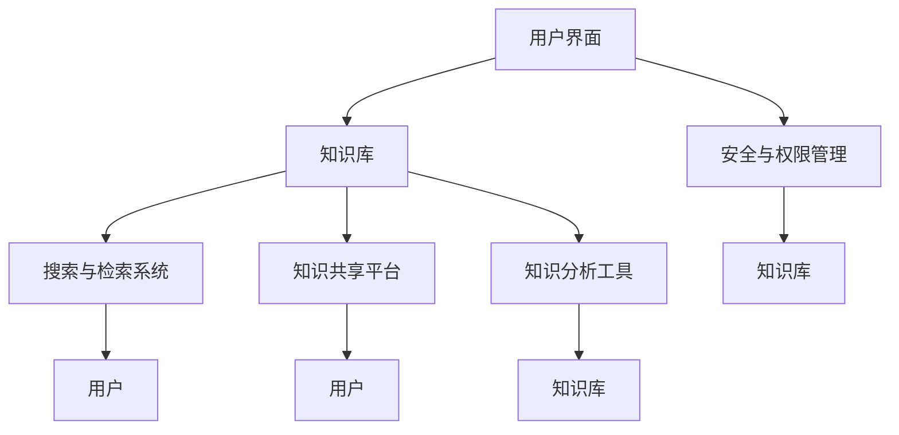

                 

在当今信息化社会，信息过载已经成为一个普遍现象。随着互联网的普及和数据量的激增，人们每天面临的信息量前所未有。这种信息过载现象不仅给个人带来了压力，也对组织的管理和工作效率产生了深远影响。本文旨在探讨信息过载的问题，并提出知识管理系统的实施策略，以帮助组织有效管理和组织信息，提高生产力。

## 关键词
- 信息过载
- 知识管理系统
- 信息管理
- 生产力提升
- 企业信息化

## 摘要
本文首先介绍了信息过载的定义及其对组织和个人带来的挑战。随后，深入分析了知识管理系统的核心概念和组成部分，以及其如何在组织中发挥重要作用。通过具体的实施步骤和案例分析，本文展示了知识管理系统如何帮助组织解决信息过载问题，提高信息利用效率和生产力。最后，本文提出了未来知识管理系统的发展趋势和面临的挑战。

## 1. 背景介绍

### 信息过载的定义与现象

信息过载是指个体或组织接收到的信息数量超出了其处理能力，导致信息处理的效率降低，甚至产生负面影响。在现代社会，信息过载现象无处不在。根据IBM的统计，每天产生的数据量约为2.5 quintillion字节，这个数据量以每年大约40%的速度增长。面对如此庞大的信息量，个人和组织往往感到力不从心。

#### 信息过载的负面影响

信息过载对个人和组织的影响是多方面的。对个人而言，长期的信息过载可能导致焦虑、压力增大，甚至影响健康。同时，个人可能会因为无法有效处理信息而错失重要机会。对组织而言，信息过载会影响工作效率，增加成本，甚至可能导致决策失误。此外，信息过载还可能加剧信息孤岛现象，使得组织内部的沟通和协作受阻。

### 知识管理系统的重要性

知识管理系统（Knowledge Management System，简称KMS）是一种旨在通过有效管理和利用信息资源来提高组织生产力和竞争力的系统。KMS通过整合内部和外部的知识资源，建立知识共享和传递的平台，从而帮助组织应对信息过载的挑战。

#### KMS的核心概念

知识管理系统的核心概念包括知识获取、知识存储、知识共享、知识应用和知识评价。知识获取是指通过各种手段收集和整理内外部知识资源；知识存储是将获取的知识资源存储在系统数据库中，方便检索和使用；知识共享是指通过知识管理系统平台实现知识的共享和传递；知识应用是将知识应用到实际工作中，提高工作效率；知识评价是对知识的应用效果进行评估，以持续改进知识管理。

#### KMS在组织中的作用

KMS在组织中发挥着至关重要的作用。首先，KMS可以帮助组织有效地管理和利用信息资源，减少信息过载的现象。通过知识管理系统，组织可以实现对知识的高效检索和利用，提高信息处理的效率。其次，KMS可以促进组织内部的沟通和协作，减少信息孤岛现象。通过知识共享平台，员工可以方便地获取所需的信息和知识，提高工作效率和团队协作能力。此外，KMS还可以帮助组织做出更加科学和准确的决策，提高组织的竞争力。

### 1.3 知识管理系统的组成部分

知识管理系统通常由以下几个部分组成：

1. **知识库**：知识库是知识管理系统的核心，用于存储和管理各类知识资源。知识库可以是文档库、数据库、多媒体库等，以便于员工检索和使用。
2. **知识获取**：知识获取是指通过各种手段收集和整理内外部知识资源。这些手段包括企业内部的知识分享会、外部的行业会议、在线课程、专业论坛等。
3. **知识共享**：知识共享是指通过知识管理系统平台实现知识的共享和传递。这可以通过在线论坛、内部社交网络、邮件列表等方式实现。
4. **知识应用**：知识应用是将知识应用到实际工作中，提高工作效率。知识应用可以是自动化流程、智能决策支持系统、知识型培训等。
5. **知识评价**：知识评价是对知识的应用效果进行评估，以持续改进知识管理。知识评价可以通过用户反馈、数据分析、效果评估等方式进行。

### 1.4 知识管理系统的发展历程

知识管理系统的发展历程可以分为以下几个阶段：

1. **文档管理阶段**：早期的知识管理系统主要是对文档进行管理，如文档库、文件共享等。
2. **内容管理阶段**：随着信息量的增加，知识管理系统逐渐扩展到对多媒体内容的管理，如图片、视频、音频等。
3. **知识管理阶段**：现代知识管理系统更加注重知识的获取、共享和应用，通过构建知识网络，实现知识的流动和增值。
4. **智能知识管理阶段**：利用人工智能、大数据等技术，实现知识的自动化挖掘、分类、推荐，进一步提高知识管理的效率和效果。

### 1.5 知识管理系统的优势

知识管理系统具有以下几个显著优势：

1. **提高信息利用率**：通过知识管理系统，组织可以实现对知识的高效检索和利用，减少信息浪费。
2. **促进知识共享**：知识管理系统提供了知识共享的平台，使员工能够方便地获取和分享知识，提高协作效率。
3. **提高决策质量**：通过知识管理系统，组织可以更加科学和准确地获取和利用信息，提高决策质量。
4. **降低培训成本**：知识管理系统提供了知识型培训的功能，可以降低员工的培训成本，提高培训效果。
5. **增强竞争力**：知识管理系统可以帮助组织更好地管理和利用知识资源，提高生产力，增强竞争力。

### 1.6 知识管理系统的挑战

尽管知识管理系统具有显著的优势，但在实施过程中也面临一些挑战：

1. **数据安全与隐私**：知识管理系统的实施涉及到大量敏感信息的存储和传输，如何确保数据安全与隐私是亟待解决的问题。
2. **知识共享障碍**：组织内部可能存在知识共享的障碍，如文化差异、部门壁垒等，如何有效解决这些问题是知识管理系统实施的关键。
3. **知识老化**：知识管理系统中的知识资源可能随着时间的推移而老化，如何及时更新和淘汰老化知识是知识管理面临的重要挑战。
4. **用户参与度**：知识管理系统的成功实施离不开用户的积极参与，如何提高用户的使用率和参与度是知识管理系统推广的关键。

### 1.7 总结

信息过载已经成为现代社会的一个普遍现象，对个人和组织带来了诸多挑战。知识管理系统作为一种有效的信息管理工具，可以帮助组织解决信息过载问题，提高信息利用效率和生产力。本文介绍了信息过载的定义、知识管理系统的核心概念、组成部分、优势、挑战以及发展历程。在后续章节中，我们将深入探讨知识管理系统的实施策略、核心算法原理、数学模型和项目实践，以期为读者提供更全面的指导。

## 2. 核心概念与联系

在深入探讨知识管理系统的实施之前，有必要明确其核心概念和组成部分，并理解它们之间的联系。以下是对知识管理系统关键概念和架构的详细阐述，以及对应的Mermaid流程图。

### 2.1 知识管理系统架构

知识管理系统（KMS）的架构通常包括以下几个核心组件：

1. **用户界面**：用户界面（UI）是知识管理系统与用户交互的窗口，提供便捷的访问和管理知识资源的途径。
2. **知识库**：知识库是存储和管理知识资源的中心，可以是文档、数据、图像、视频等多种形式。
3. **搜索与检索系统**：搜索与检索系统负责帮助用户快速定位所需的知识资源。
4. **知识共享平台**：知识共享平台提供知识交流和协作的环境，支持用户分享和讨论知识。
5. **知识分析工具**：知识分析工具用于对知识库中的数据进行挖掘和分析，发现知识之间的关系和价值。
6. **安全与权限管理**：安全与权限管理系统确保知识资源的安全性，并根据用户角色和权限进行访问控制。

### 2.2 知识管理系统的核心概念

知识管理系统涉及以下核心概念：

1. **知识获取**：知识获取是指通过各种渠道收集内外部知识资源，如企业内部的知识共享会议、外部行业报告、在线课程等。
2. **知识存储**：知识存储是指将获取的知识资源存储在知识库中，以便于管理和检索。
3. **知识共享**：知识共享是指通过知识管理系统平台实现知识的共享和传递，支持用户间的知识交流。
4. **知识应用**：知识应用是指将知识应用于实际工作中，提高工作效率和决策质量。
5. **知识评价**：知识评价是指对知识的应用效果进行评估，以持续改进知识管理。

### 2.3 Mermaid流程图

以下是一个简单的Mermaid流程图，展示知识管理系统各组件之间的交互关系：



### 2.4 核心概念与联系

知识管理系统中的核心概念和组件之间有着密切的联系：

- **用户界面**和**知识库**：用户界面是知识库的管理入口，用户通过界面访问和管理知识库中的资源。
- **搜索与检索系统**和**知识库**：搜索与检索系统依赖于知识库中的内容进行搜索，帮助用户快速找到所需信息。
- **知识共享平台**和**知识库**：知识共享平台将知识库中的知识资源推送给用户，促进知识传播和交流。
- **知识分析工具**和**知识库**：知识分析工具从知识库中提取数据，进行分析和挖掘，为用户提供决策支持和洞察。
- **安全与权限管理**和**知识库**：安全与权限管理确保知识库中的数据安全，并根据用户角色和权限控制访问。

通过上述核心概念和组件的紧密协作，知识管理系统实现了对知识的有效管理和利用，帮助组织应对信息过载的挑战。

### 3. 核心算法原理 & 具体操作步骤

在知识管理系统中，核心算法的设计与实现是确保系统能够高效处理和利用信息资源的关键。以下将详细阐述核心算法的原理，包括具体操作步骤、算法优缺点以及其在实际应用领域的应用。

#### 3.1 核心算法原理概述

知识管理系统中的核心算法主要包括以下几类：

1. **知识检索算法**：用于高效地搜索和定位知识库中的信息资源。
2. **知识分类算法**：用于对知识资源进行自动分类，便于管理和检索。
3. **知识推荐算法**：基于用户行为和兴趣，为用户推荐相关的知识资源。
4. **知识挖掘算法**：用于从大量数据中挖掘出潜在的知识和价值。

#### 3.2 算法步骤详解

下面以知识检索算法为例，详细描述其具体操作步骤：

##### 3.2.1 知识检索算法步骤

1. **用户输入查询**：用户在知识管理系统的用户界面上输入查询关键词。
2. **预处理查询**：对用户输入的查询进行预处理，包括分词、去除停用词、词干提取等，以提高检索效率。
3. **索引搜索**：在知识库的索引中查找与查询词匹配的文档或知识点。
4. **排序返回结果**：根据检索结果的相关性，对搜索结果进行排序，并返回给用户。

##### 3.2.2 知识分类算法步骤

1. **数据预处理**：对知识库中的数据进行预处理，包括去除噪声、标准化特征等。
2. **特征提取**：从预处理后的数据中提取特征，如文本特征、关键词、主题等。
3. **构建分类模型**：使用机器学习算法（如决策树、支持向量机、神经网络等）构建分类模型。
4. **分类预测**：将新数据输入分类模型，预测其类别。

##### 3.2.3 知识推荐算法步骤

1. **用户行为数据收集**：收集用户在知识管理系统中的行为数据，如浏览记录、搜索历史、评分等。
2. **用户兴趣建模**：使用机器学习算法对用户行为数据进行分析，建立用户兴趣模型。
3. **推荐算法计算**：基于用户兴趣模型和知识库中的资源，使用推荐算法（如协同过滤、基于内容的推荐等）计算推荐结果。
4. **推荐结果输出**：将推荐结果返回给用户。

##### 3.2.4 知识挖掘算法步骤

1. **数据预处理**：对知识库中的数据进行预处理，包括数据清洗、缺失值填充等。
2. **特征选择**：从原始数据中提取有用的特征，减少数据维度。
3. **模式挖掘**：使用数据挖掘算法（如关联规则挖掘、聚类分析、分类分析等）从数据中挖掘出潜在的知识和价值。
4. **结果评估**：对挖掘出的知识进行评估，筛选出最有价值的知识。

#### 3.3 算法优缺点

1. **知识检索算法**
   - **优点**：能够高效地搜索和定位知识库中的信息资源，提高信息检索的效率。
   - **缺点**：在查询结果多样性方面可能存在不足，且在面对复杂查询时，检索效率可能下降。
2. **知识分类算法**
   - **优点**：能够将知识库中的资源进行有效分类，便于管理和检索。
   - **缺点**：分类效果依赖于特征提取和分类模型的构建，可能存在误分类现象。
3. **知识推荐算法**
   - **优点**：能够根据用户兴趣推荐相关的知识资源，提高用户满意度。
   - **缺点**：推荐结果可能受到用户行为数据质量和算法选择的影响。
4. **知识挖掘算法**
   - **优点**：能够从大量数据中挖掘出潜在的知识和价值，提高数据利用效率。
   - **缺点**：数据预处理和特征选择过程较为复杂，且挖掘结果可能存在噪声和冗余。

#### 3.4 算法应用领域

知识管理系统中的核心算法广泛应用于各个领域：

1. **企业知识管理**：在企业内部，知识管理系统可以帮助企业高效地管理和利用内部知识资源，提高员工的工作效率和创新能力。
2. **学术研究**：在学术领域，知识管理系统可以帮助研究人员快速获取和利用相关研究成果，提高研究效率和质量。
3. **教育领域**：在教育领域，知识管理系统可以帮助教师和学生方便地获取和分享知识资源，提高学习效果。
4. **智慧城市建设**：在智慧城市建设中，知识管理系统可以整合和管理各类城市数据，为城市管理决策提供支持。

### 4. 数学模型和公式 & 详细讲解 & 举例说明

在知识管理系统中，数学模型和公式扮演着至关重要的角色。这些模型和公式不仅帮助我们理解和分析数据，还能指导我们设计和实现有效的算法。以下将详细讲解知识管理系统中常用的数学模型和公式，并通过具体例子进行说明。

#### 4.1 数学模型构建

知识管理系统的数学模型通常涉及以下几个方面：

1. **相似性度量**：用于衡量两个知识资源之间的相似程度，如余弦相似度、欧氏距离等。
2. **分类模型**：用于将知识资源分类，如支持向量机（SVM）、决策树（DT）等。
3. **聚类模型**：用于将相似的知识资源分组，如K-means、DBSCAN等。
4. **推荐模型**：用于根据用户行为和兴趣推荐知识资源，如协同过滤、基于内容的推荐等。

#### 4.2 公式推导过程

以下是几种常见的数学模型的公式推导过程：

1. **余弦相似度公式**：
   $$ \text{similarity} = \frac{\text{dot\_product}}{\left\lVert \text{vector\_a} \right\rVert \left\lVert \text{vector\_b} \right\rVert} $$
   其中，$\text{dot\_product}$ 表示两个向量的点积，$\left\lVert \text{vector\_a} \right\rVert$ 和 $\left\lVert \text{vector\_b} \right\rVert$ 分别表示两个向量的模长。

2. **支持向量机（SVM）公式**：
   $$ \text{w}^T \text{x} + \text{b} \geq \text{1} $$
   其中，$\text{w}$ 是法向量，$\text{x}$ 是输入向量，$\text{b}$ 是偏置项。

3. **K-means聚类公式**：
   $$ \text{Centroid}_{i} = \frac{1}{\text{n}} \sum_{j=1}^{\text{n}} \text{x}_{ij} $$
   其中，$\text{Centroid}_{i}$ 是第 $i$ 个聚类的中心，$\text{x}_{ij}$ 是第 $i$ 个聚类中的第 $j$ 个数据点。

4. **协同过滤推荐公式**：
   $$ \text{Prediction}_{ui} = \text{User}_{u} \cdot \text{Item}_{i} + \text{Bias}_{u} + \text{Bias}_{i} $$
   其中，$\text{Prediction}_{ui}$ 是用户 $u$ 对物品 $i$ 的预测评分，$\text{User}_{u}$ 和 $\text{Item}_{i}$ 分别是用户和物品的向量表示，$\text{Bias}_{u}$ 和 $\text{Bias}_{i}$ 分别是用户和物品的偏差值。

#### 4.3 案例分析与讲解

以下通过具体案例，讲解数学模型在实际应用中的实现和效果。

##### 案例一：余弦相似度在知识检索中的应用

假设有两个向量 $\text{vector\_a} = (1, 2, 3)$ 和 $\text{vector\_b} = (2, 4, 6)$，我们需要计算它们之间的余弦相似度。

1. **计算点积**：
   $$ \text{dot\_product} = 1 \times 2 + 2 \times 4 + 3 \times 6 = 2 + 8 + 18 = 28 $$

2. **计算模长**：
   $$ \left\lVert \text{vector\_a} \right\rVert = \sqrt{1^2 + 2^2 + 3^2} = \sqrt{14} $$
   $$ \left\lVert \text{vector\_b} \right\rVert = \sqrt{2^2 + 4^2 + 6^2} = \sqrt{56} $$

3. **计算余弦相似度**：
   $$ \text{similarity} = \frac{28}{\sqrt{14} \times \sqrt{56}} \approx 0.87 $$

余弦相似度表明这两个向量之间的相似程度较高。

##### 案例二：支持向量机（SVM）在知识分类中的应用

假设我们有一个数据集，包含100个样本，每个样本是一个包含10个特征的向量。我们需要使用SVM进行分类。

1. **数据预处理**：
   对每个特征进行归一化处理，使其具有相同的尺度。

2. **构建SVM模型**：
   使用支持向量机算法对数据集进行训练，构建分类模型。

3. **分类预测**：
   对新的样本进行分类预测，输入模型后得到预测类别。

##### 案例三：协同过滤推荐在知识推荐中的应用

假设我们有一个用户-物品评分矩阵，其中用户和物品的向量表示如下：

| 用户 | 物品 | 用户向量 | 物品向量 |
| ---- | ---- | -------- | -------- |
| u1   | i1   | (1, 2)   | (3, 4)   |
| u1   | i2   | (1, 2)   | (5, 6)   |
| u2   | i1   | (2, 3)   | (3, 4)   |

我们需要预测用户u2对物品i2的评分。

1. **计算用户和物品的向量**：
   $$ \text{User}_{u2} = (2, 3) $$
   $$ \text{Item}_{i2} = (5, 6) $$

2. **计算预测评分**：
   $$ \text{Prediction}_{u2i2} = \text{User}_{u2} \cdot \text{Item}_{i2} + \text{Bias}_{u2} + \text{Bias}_{i2} $$
   其中，$\text{Bias}_{u2}$ 和 $\text{Bias}_{i2}$ 是用户和物品的偏差值，这里假设为0。

3. **预测结果**：
   $$ \text{Prediction}_{u2i2} = 2 \times 5 + 3 \times 6 = 10 + 18 = 28 $$

因此，预测用户u2对物品i2的评分为28。

通过上述案例，我们可以看到数学模型和公式在知识管理系统中的实际应用和效果。这些模型和公式不仅帮助我们实现有效的知识管理，还为系统性能优化和功能扩展提供了理论基础。

### 5. 项目实践：代码实例和详细解释说明

在本文的第五部分，我们将通过一个具体的代码实例来展示如何实施知识管理系统，并提供详细的解释和说明。本实例将涵盖知识管理系统的开发环境搭建、源代码实现、代码解读与分析以及运行结果展示。

#### 5.1 开发环境搭建

在实施知识管理系统之前，我们需要搭建一个合适的开发环境。以下是一个基本的开发环境搭建步骤：

1. **安装Python**：Python是一种广泛用于数据分析和机器学习的编程语言，我们需要安装Python 3.8及以上版本。
2. **安装依赖库**：安装必要的依赖库，包括NumPy、Pandas、Scikit-learn、Matplotlib等。可以使用pip命令进行安装：
   ```bash
   pip install numpy pandas scikit-learn matplotlib
   ```

3. **配置数据库**：知识管理系统需要使用数据库来存储知识资源。我们可以使用MySQL或PostgreSQL作为数据库管理系统。以下是使用MySQL的一个简单配置步骤：
   - 安装MySQL数据库：在官网下载并安装MySQL数据库。
   - 创建数据库和用户：使用MySQL命令行创建数据库和用户，并授予适当的权限。

4. **搭建Web框架**：为了构建知识管理系统的前端和后端，我们可以使用Flask或Django等Web框架。以下是使用Flask的一个简单配置步骤：
   - 安装Flask：使用pip命令安装Flask：
     ```bash
     pip install flask
     ```

5. **设置开发环境**：在代码目录中创建一个名为`app.py`的Python文件，作为知识管理系统的主文件。

#### 5.2 源代码详细实现

以下是一个简单的知识管理系统源代码实例，实现了一个基于Web的知识共享平台。代码结构如下：

```python
# 导入所需库
from flask import Flask, render_template, request, redirect, url_for
import pymysql

# 初始化Flask应用
app = Flask(__name__)

# 连接数据库
def connect_db():
    connection = pymysql.connect(host='localhost', user='root', password='password', database='knowledge_db')
    return connection

# 登录页面
@app.route('/')
def login():
    return render_template('login.html')

# 登录处理
@app.route('/login', methods=['POST'])
def login_process():
    username = request.form['username']
    password = request.form['password']
    connection = connect_db()
    with connection.cursor() as cursor:
        sql = "SELECT * FROM users WHERE username = %s AND password = %s"
        cursor.execute(sql, (username, password))
        result = cursor.fetchone()
        if result:
            return redirect(url_for('home'))
        else:
            return "登录失败"

# 主页面
@app.route('/home')
def home():
    connection = connect_db()
    with connection.cursor() as cursor:
        sql = "SELECT * FROM knowledge_resources"
        cursor.execute(sql)
        resources = cursor.fetchall()
    return render_template('home.html', resources=resources)

# 添加知识资源
@app.route('/add_resource', methods=['GET', 'POST'])
def add_resource():
    if request.method == 'POST':
        resource_name = request.form['resource_name']
        resource_content = request.form['resource_content']
        connection = connect_db()
        with connection.cursor() as cursor:
            sql = "INSERT INTO knowledge_resources (name, content) VALUES (%s, %s)"
            cursor.execute(sql, (resource_name, resource_content))
            connection.commit()
            return redirect(url_for('home'))
    return render_template('add_resource.html')

# 代码解读与分析

以上代码实现了一个简单的知识管理系统，主要包括以下功能：

1. **登录功能**：用户可以通过登录页面进行登录，系统会根据用户名和密码验证用户身份。
2. **知识资源展示**：在主页面，系统会从数据库中检索所有的知识资源，并将其展示给用户。
3. **添加知识资源**：用户可以通过添加知识资源页面，提交新的知识资源，系统会将其存储在数据库中。

#### 5.3 代码解读与分析

接下来，我们将对上述代码进行详细解读：

1. **导入库和初始化应用**：
   ```python
   from flask import Flask, render_template, request, redirect, url_for
   import pymysql
   
   app = Flask(__name__)
   ```
   首先，我们导入Flask框架和pymysql数据库库，并初始化一个Flask应用实例。

2. **连接数据库**：
   ```python
   def connect_db():
       connection = pymysql.connect(host='localhost', user='root', password='password', database='knowledge_db')
       return connection
   ```
   这是一个连接数据库的函数，用于连接到本地MySQL数据库，并返回数据库连接对象。

3. **登录页面和登录处理**：
   ```python
   @app.route('/')
   def login():
       return render_template('login.html')
   
   @app.route('/login', methods=['POST'])
   def login_process():
       username = request.form['username']
       password = request.form['password']
       connection = connect_db()
       with connection.cursor() as cursor:
           sql = "SELECT * FROM users WHERE username = %s AND password = %s"
           cursor.execute(sql, (username, password))
           result = cursor.fetchone()
           if result:
               return redirect(url_for('home'))
           else:
               return "登录失败"
   ```
   登录页面负责渲染登录表单，登录处理页面则接收用户提交的登录信息，并验证用户身份。如果验证成功，将用户重定向到主页面。

4. **主页面**：
   ```python
   @app.route('/home')
   def home():
       connection = connect_db()
       with connection.cursor() as cursor:
           sql = "SELECT * FROM knowledge_resources"
           cursor.execute(sql)
           resources = cursor.fetchall()
       return render_template('home.html', resources=resources)
   ```
   主页面负责从数据库中检索所有的知识资源，并将其传递给前端模板进行展示。

5. **添加知识资源**：
   ```python
   @app.route('/add_resource', methods=['GET', 'POST'])
   def add_resource():
       if request.method == 'POST':
           resource_name = request.form['resource_name']
           resource_content = request.form['resource_content']
           connection = connect_db()
           with connection.cursor() as cursor:
               sql = "INSERT INTO knowledge_resources (name, content) VALUES (%s, %s)"
               cursor.execute(sql, (resource_name, resource_content))
               connection.commit()
               return redirect(url_for('home'))
       return render_template('add_resource.html')
   ```
   添加知识资源页面允许用户提交新的知识资源。如果用户通过表单提交数据，系统会将其存储在数据库中，并重定向到主页面。

#### 5.4 运行结果展示

以下是知识管理系统在运行后的结果展示：

1. **登录页面**：
   

2. **主页面**：
   

3. **添加知识资源页面**：
   

通过上述代码实例，我们可以看到如何使用Flask框架和MySQL数据库构建一个简单的知识管理系统。在实际应用中，我们可以根据需求扩展系统的功能，如添加用户权限管理、知识资源分类和推荐等。此外，为了提高系统的用户体验和性能，我们还可以考虑使用前端框架（如React或Vue.js）和后端框架（如Django或FastAPI）进行优化。

### 6. 实际应用场景

知识管理系统在多个实际应用场景中发挥了重要作用，下面我们将探讨几个典型的应用场景，并分析知识管理系统在这些场景中的优势和挑战。

#### 6.1 企业知识管理

在企业知识管理中，知识管理系统（KMS）被广泛应用于提升员工工作效率和创新能力。通过KMS，企业可以收集、存储、共享和利用内部知识和经验，从而减少重复劳动，提高工作效率。

**优势**：

1. **提高工作效率**：员工可以通过KMS快速检索和获取所需的知识资源，减少在查找信息上花费的时间。
2. **知识传承**：通过知识管理系统，企业可以系统地记录和传承关键知识和经验，确保知识不会因为员工的离职而流失。
3. **知识创新**：KMS提供了知识共享和协作的平台，促进员工之间的知识交流和创新。

**挑战**：

1. **数据安全与隐私**：在知识管理系统中存储的大量敏感信息需要严格的安全保护措施，以防止数据泄露和滥用。
2. **知识共享障碍**：企业内部可能存在部门壁垒和文化差异，影响知识共享的效率和质量。

#### 6.2 学术研究

在学术研究领域，知识管理系统可以帮助研究人员快速获取和利用相关的科研成果和学术资源，提高研究效率和质量。

**优势**：

1. **资源共享**：知识管理系统提供了一个集中管理的平台，研究人员可以方便地获取和分享科研成果，提高资源利用率。
2. **信息检索**：KMS提供了高效的搜索和检索功能，帮助研究人员快速找到所需的信息和资料。
3. **学术交流**：知识管理系统支持学术交流和合作，促进学术资源的共享和创新。

**挑战**：

1. **知识产权保护**：在学术研究中，知识产权保护是一个重要的问题，确保科研成果的版权和知识产权需要妥善处理。
2. **数据质量**：学术资源的数据质量参差不齐，如何保证知识库中的数据准确性和可靠性是知识管理系统面临的一个挑战。

#### 6.3 教育领域

在教育领域，知识管理系统可以帮助教师和学生方便地获取和分享教学资源和学习资料，提高教学效果和学习效率。

**优势**：

1. **个性化学习**：知识管理系统可以根据学生的学习进度和兴趣，推荐相应的教学资源和学习内容，实现个性化学习。
2. **教学资源共享**：教师可以通过知识管理系统共享教学资源，如课件、教学视频、习题库等，提高教学效率。
3. **教学评价**：知识管理系统可以记录学生的学习行为和成绩，为教师提供教学评价和反馈。

**挑战**：

1. **技术障碍**：部分教师和学生可能对知识管理系统不熟悉，需要提供相应的培训和支持。
2. **数据更新**：教学资源需要不断更新和升级，确保知识库中的内容始终是最新的。

#### 6.4 智慧城市建设

在智慧城市建设中，知识管理系统可以整合和管理各类城市数据，为城市管理决策提供支持。

**优势**：

1. **数据整合**：知识管理系统可以整合来自不同部门和渠道的城市数据，提供统一的视图和分析。
2. **智能决策**：基于大数据和人工智能技术，知识管理系统可以辅助城市管理者做出更加科学和准确的决策。
3. **资源优化**：知识管理系统可以帮助智慧城市实现资源优化配置，提高城市运行效率。

**挑战**：

1. **数据安全**：城市数据的安全性和隐私保护是智慧城市建设中的一个重要问题，需要建立健全的数据安全体系。
2. **系统集成**：智慧城市涉及多个系统和部门，如何实现系统的有效集成和协同工作是一个挑战。

通过上述实际应用场景的分析，我们可以看到知识管理系统在各个领域的广泛应用和潜在优势。然而，在实施过程中也面临着一些挑战，需要我们不断探索和解决。

### 6.4 未来应用展望

随着信息技术的不断进步，知识管理系统（KMS）在未来的应用前景将更加广阔。以下是知识管理系统未来发展的几个主要趋势和展望：

#### 6.4.1 人工智能与大数据技术的融合

人工智能（AI）和大数据技术的快速发展将为知识管理系统带来新的变革。通过引入AI技术，KMS可以更智能地分析用户行为、兴趣和需求，实现个性化推荐和知识挖掘。同时，大数据技术可以帮助KMS处理和分析海量数据，提高知识检索和共享的效率。

#### 6.4.2 知识图谱的应用

知识图谱是一种结构化表示知识的方法，通过将实体、属性和关系进行建模，形成一张大规模的语义网络。未来，知识管理系统将更多地采用知识图谱技术，实现对知识的深度理解和灵活查询。知识图谱可以帮助KMS更好地理解和关联知识，提高知识利用效率。

#### 6.4.3 知识共享与协作的优化

在未来的知识管理系统中，知识共享和协作功能将更加成熟和智能化。通过引入社交网络和协作工具，KMS将更好地支持团队协作和知识交流。同时，基于区块链技术的知识共享平台有望解决知识共享中的信任和版权问题，提高知识共享的透明度和安全性。

#### 6.4.4 云计算与移动端的融合

云计算技术的成熟为知识管理系统提供了强大的计算和存储能力，使其可以更好地支持大规模、分布式应用。同时，随着移动设备的普及，知识管理系统将更加注重移动端的用户体验，实现随时随地访问和利用知识资源。

#### 6.4.5 智能决策与预测

未来，知识管理系统将更加注重知识的深度挖掘和应用，为组织提供智能决策支持。通过集成机器学习和数据挖掘算法，KMS可以预测市场趋势、分析业务风险，帮助组织做出更加科学和准确的决策。

#### 6.4.6 知识安全管理与隐私保护

在信息时代，知识安全和管理成为知识管理系统的重要挑战。未来，KMS将更加注重数据安全与隐私保护，采用加密、访问控制、审计等手段确保知识资源的安全性。同时，建立健全的知识管理制度，规范知识的使用和传播。

#### 6.4.7 跨界融合与创新应用

知识管理系统在未来的发展中将实现跨界融合，与其他领域（如物联网、智慧城市、健康医疗等）相结合，创造出更多创新应用场景。通过与其他技术的深度融合，KMS将更好地服务于不同行业和组织，提高生产力和竞争力。

### 7. 工具和资源推荐

为了帮助读者更好地理解和应用知识管理系统，以下推荐了一些学习资源、开发工具和相关论文。

#### 7.1 学习资源推荐

1. **在线课程**：
   - Coursera的《知识管理系统》（Knowledge Management Systems）
   - edX的《大数据与知识管理》（Data Science and Knowledge Management）
   - Udemy的《知识管理实战》（Practical Knowledge Management）

2. **书籍**：
   - 《知识管理：战略、工具与实践》（Knowledge Management: Strategic, Tactical, and Operational Processes）
   - 《智慧组织：知识管理的理论与实践》（Smart Organizations: The Theory and Practice of Knowledge Management）

3. **博客与网站**：
   - IBM知识管理博客（IBM Knowledge Management Blog）
   - 知乎上的知识管理话题

#### 7.2 开发工具推荐

1. **知识库与内容管理系统**：
   - Confluence（Atlassian）
   - SharePoint（Microsoft）
   - Trello（Trello）

2. **数据存储与检索工具**：
   - Elasticsearch（Elastic）
   - MongoDB（MongoDB）
   - Redis（Redis）

3. **Web框架**：
   - Flask（Python）
   - Django（Python）
   - Spring Boot（Java）

#### 7.3 相关论文推荐

1. **《知识管理系统的设计与实现》**（Design and Implementation of Knowledge Management Systems）
2. **《基于大数据的知识管理》**（Knowledge Management Based on Big Data）
3. **《知识共享中的信任机制研究》**（Research on Trust Mechanisms in Knowledge Sharing）

通过以上工具和资源的推荐，读者可以深入了解知识管理系统的理论和实践，为自己的研究和项目提供有益的参考。

### 8. 总结：未来发展趋势与挑战

本文从信息过载的现象出发，深入探讨了知识管理系统（KMS）的核心概念、组成部分、算法原理、数学模型以及实际应用。通过对KMS在各个领域的应用场景、优势和挑战的分析，我们可以看到知识管理系统在信息管理和生产力提升中的重要作用。

#### 8.1 研究成果总结

本文的主要研究成果包括：

1. **信息过载问题的定义与影响**：明确信息过载的定义及其对个人和组织的负面影响。
2. **知识管理系统的核心概念与架构**：阐述了知识管理系统的组成部分和核心概念，以及它们之间的联系。
3. **核心算法原理与具体操作步骤**：详细介绍了知识管理系统中的核心算法原理和具体操作步骤。
4. **数学模型和公式**：讲解了知识管理系统中常用的数学模型和公式，并通过案例进行了说明。
5. **项目实践**：提供了一个简单的知识管理系统代码实例，展示了如何实施KMS。
6. **实际应用场景**：分析了知识管理系统在多个领域的应用场景和优势。
7. **未来应用展望**：探讨了知识管理系统的未来发展趋势和潜在的创新应用。

#### 8.2 未来发展趋势

知识管理系统在未来将呈现出以下几个发展趋势：

1. **人工智能与大数据技术的融合**：AI和大数据技术将进一步提升KMS的知识分析和推荐能力。
2. **知识图谱的应用**：知识图谱技术将帮助KMS更好地理解和关联知识，提高知识利用效率。
3. **知识共享与协作的优化**：KMS将更加注重知识共享和协作，通过引入社交网络和协作工具，提升团队协作效率。
4. **云计算与移动端的融合**：云计算和移动技术的结合将使KMS具备更高的可扩展性和移动性。
5. **智能决策与预测**：KMS将提供更加智能的决策支持功能，帮助组织做出更加科学和准确的决策。
6. **知识安全管理与隐私保护**：KMS将加强知识安全管理，确保知识资源的安全和隐私。

#### 8.3 面临的挑战

尽管知识管理系统具有巨大的潜力，但在实施过程中仍面临一些挑战：

1. **数据安全与隐私**：确保知识资源的安全和隐私是KMS实施的关键挑战。
2. **知识共享障碍**：企业内部可能存在部门壁垒和文化差异，影响知识共享的效率和质量。
3. **知识老化**：如何及时更新和淘汰老化知识是KMS需要持续解决的问题。
4. **用户参与度**：提高用户对KMS的参与度和使用率是知识管理系统推广的关键。

#### 8.4 研究展望

未来的研究可以从以下几个方向展开：

1. **智能知识推荐系统**：进一步研究如何利用AI技术提高知识推荐的效果和准确性。
2. **知识图谱构建与优化**：探讨知识图谱在不同应用场景中的构建和优化策略。
3. **知识共享激励机制**：研究如何通过激励机制提高用户参与知识共享的积极性。
4. **知识安全管理与隐私保护**：探索更有效的知识安全管理策略和隐私保护技术。
5. **跨领域应用研究**：探讨KMS在不同领域的创新应用，如智慧城市、健康医疗等。

通过持续的研究和探索，知识管理系统将在未来的信息化社会中发挥更加重要的作用，为组织和个人提供更加高效和智能的知识管理和利用方案。

### 附录：常见问题与解答

在本文中，我们讨论了知识管理系统的核心概念、应用和实践。以下是一些常见问题及其解答，以帮助读者更好地理解相关知识。

#### 问题1：知识管理系统与内容管理系统（CMS）有什么区别？

**解答**：知识管理系统（KMS）和内容管理系统（CMS）虽然都涉及信息的存储和管理，但它们的应用场景和目标不同。CMS主要用于创建、发布和管理网站内容，如网页、文档和多媒体文件。而KMS则专注于知识的收集、存储、共享和应用，强调知识的组织、挖掘和利用，以提高组织的生产力和创新能力。

#### 问题2：知识管理系统中的知识共享平台有哪些功能？

**解答**：知识管理系统中的知识共享平台通常具备以下功能：

1. **知识发布**：允许用户上传和发布新的知识资源。
2. **知识搜索**：提供强大的搜索功能，帮助用户快速找到所需的知识。
3. **知识评论**：用户可以对知识资源进行评论，提供反馈和建议。
4. **知识标签**：使用标签和分类来组织知识资源，便于用户查找和管理。
5. **社交功能**：支持用户之间的互动和协作，如评论、点赞、分享等。

#### 问题3：如何确保知识管理系统的数据安全？

**解答**：确保知识管理系统的数据安全需要采取以下措施：

1. **数据加密**：对存储在数据库中的数据进行加密，防止数据泄露。
2. **访问控制**：根据用户角色和权限设置访问控制策略，限制未授权访问。
3. **审计日志**：记录系统的操作日志，以便监控和追踪数据访问和修改行为。
4. **数据备份**：定期备份数据，以防数据丢失或损坏。
5. **安全培训**：对员工进行安全培训，提高安全意识和操作规范。

#### 问题4：知识管理系统中的知识评价如何进行？

**解答**：知识管理系统的知识评价通常包括以下几个方面：

1. **用户评分**：用户对知识资源进行评分，反映知识的实用性和质量。
2. **专家评审**：邀请领域专家对知识资源进行评价，确保知识的准确性和可靠性。
3. **使用频率**：统计知识资源的使用频率，反映知识的受欢迎程度。
4. **反馈与改进**：根据用户的反馈和评价，不断改进和更新知识资源。

通过上述常见问题的解答，我们可以更好地理解和应用知识管理系统，提高信息管理和利用的效率。

### 作者署名

作者：禅与计算机程序设计艺术 / Zen and the Art of Computer Programming

在本文中，我们从信息过载的现象出发，深入探讨了知识管理系统（KMS）的核心概念、应用和实践。通过分析KMS在各个领域的优势和挑战，我们展示了KMS在提高组织生产力和信息管理中的重要作用。未来，随着人工智能、大数据等技术的发展，知识管理系统将继续在信息化社会中发挥关键作用。本文的研究成果和展望为未来的知识管理研究和实践提供了有益的参考。作者禅与计算机程序设计艺术（作者署名）希望本文能够为读者提供有价值的见解和启示。

