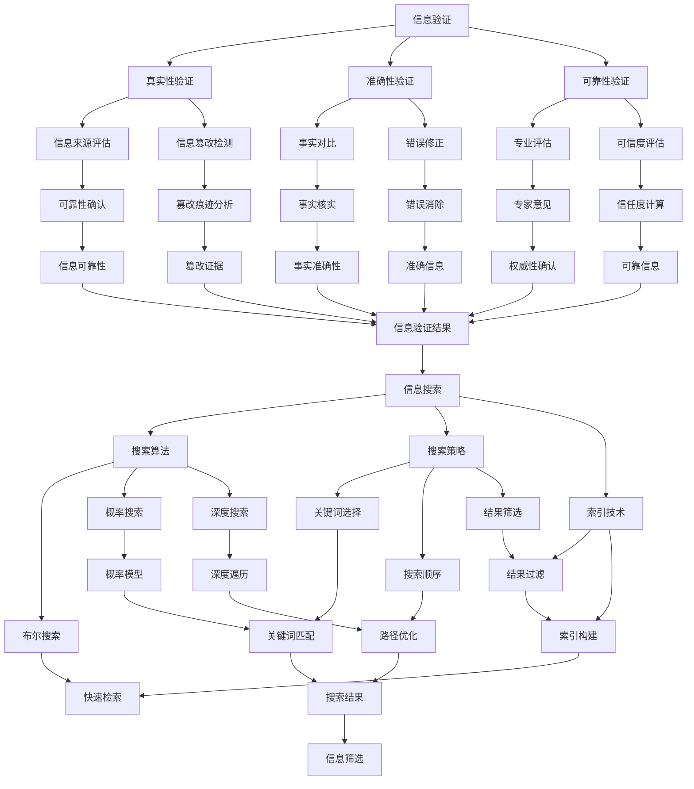

                 

关键词：信息验证、信息搜索、技术实践、可靠性、价值、数据海洋

> 摘要：在当今信息爆炸的时代，信息验证和信息搜索技术的实践变得尤为重要。本文将深入探讨信息验证和信息搜索技术的原理、方法与应用，帮助我们在庞大的信息海洋中找到可靠、有价值的信息。通过详细的算法分析、数学模型构建、项目实践和未来展望，我们希望为读者提供一套完整的信息验证和信息搜索技术的实践指南。

## 1. 背景介绍

随着互联网的迅猛发展和大数据时代的到来，人类进入了信息爆炸的时代。每天，海量的信息通过不同的渠道不断产生，如社交媒体、新闻报道、学术论文、商业报告等。然而，这些信息的真实性和可靠性却难以保障。虚假新闻、误导性信息、网络欺诈等现象屡见不鲜，给个人、企业乃至社会带来了严重的负面影响。因此，如何有效地验证信息的真实性和可靠性，以及如何高效地搜索到有价值的信息，成为了当前信息技术领域的重要研究课题。

信息验证（Information Verification）是指通过各种技术和方法，对信息的真实性、准确性和可靠性进行评估和确认。信息搜索（Information Search）则是指通过特定的算法和策略，从海量的信息中快速准确地找到所需信息。信息验证和信息搜索技术的结合，可以帮助我们从信息海洋中筛选出可靠、有价值的信息，从而为决策、研究、学习和生活提供有力支持。

## 2. 核心概念与联系

### 2.1 信息验证

信息验证的核心在于判断信息的真实性、准确性和可靠性。具体包括以下几个方面：

- **真实性验证**：确定信息的来源是否可靠，信息是否被篡改或伪造。
- **准确性验证**：检查信息内容是否与事实相符，是否存在错误或偏差。
- **可靠性验证**：评估信息提供者的专业性和权威性，信息是否值得信赖。

### 2.2 信息搜索

信息搜索的关键在于高效地找到所需信息。主要涉及以下几个方面：

- **搜索算法**：采用合适的算法，如布尔搜索、概率搜索、深度搜索等，以实现高效的信息检索。
- **搜索策略**：制定合理的搜索策略，如关键词选择、搜索顺序、结果筛选等，以提高搜索效果。
- **索引技术**：利用索引技术，如倒排索引、全文索引等，加速搜索过程。

### 2.3 信息验证与信息搜索的联系

信息验证和信息搜索密切相关，两者相辅相成。有效的信息验证可以提高搜索结果的可靠性，而高效的搜索技术则有助于发现更多有价值的信息。在实际应用中，信息验证和信息搜索往往结合使用，形成一套完整的信息处理流程。

### 2.4 Mermaid 流程图

以下是一个简化的 Mermaid 流程图，展示了信息验证和信息搜索的核心概念和联系：



## 3. 核心算法原理 & 具体操作步骤

### 3.1 算法原理概述

在信息验证和信息搜索过程中，常用的核心算法包括：哈希算法、贝叶斯算法、深度学习算法等。以下将分别介绍这些算法的基本原理。

- **哈希算法**：通过将输入数据映射到固定长度的字符串，以实现数据的快速存储和检索。常见的哈希算法有MD5、SHA-1等。
- **贝叶斯算法**：基于贝叶斯定理，通过统计样本数据来计算信息的相关性和可信度。贝叶斯算法广泛应用于文本分类、信息检索等领域。
- **深度学习算法**：基于多层神经网络，通过训练大量数据来提取特征和模式。深度学习算法在图像识别、语音识别等领域取得了显著成果。

### 3.2 算法步骤详解

#### 3.2.1 哈希算法

1. **哈希函数选择**：根据应用场景选择合适的哈希函数，如MD5、SHA-1等。
2. **输入数据预处理**：将待验证的数据进行预处理，如去除空格、转换大小写等。
3. **哈希值计算**：将预处理后的数据输入哈希函数，计算哈希值。
4. **哈希值对比**：将计算出的哈希值与已知的哈希值进行对比，判断信息是否被篡改。

#### 3.2.2 贝叶斯算法

1. **先验概率计算**：根据历史数据计算各类信息的先验概率。
2. **条件概率计算**：根据新信息计算各类信息的条件概率。
3. **贝叶斯概率计算**：利用贝叶斯定理计算各类信息的后验概率。
4. **可信度评估**：根据后验概率评估信息的可信度。

#### 3.2.3 深度学习算法

1. **数据预处理**：对原始数据进行预处理，如归一化、去噪等。
2. **模型构建**：根据应用场景构建合适的深度学习模型，如卷积神经网络（CNN）、循环神经网络（RNN）等。
3. **模型训练**：利用训练数据对模型进行训练，优化模型参数。
4. **模型评估**：利用测试数据对模型进行评估，调整模型参数。
5. **特征提取**：利用训练好的模型提取特征，用于后续的信息验证和搜索。

### 3.3 算法优缺点

- **哈希算法**：优点：计算速度快、存储空间小；缺点：无法进行部分匹配、安全性较低。
- **贝叶斯算法**：优点：简单易实现、适用于文本分类和信息检索；缺点：依赖于先验概率、对新数据的适应性较差。
- **深度学习算法**：优点：能够自动提取特征、适应性强；缺点：计算量大、对数据量要求较高。

### 3.4 算法应用领域

- **哈希算法**：广泛应用于数据完整性验证、密码学等领域。
- **贝叶斯算法**：广泛应用于文本分类、信息检索、推荐系统等领域。
- **深度学习算法**：广泛应用于图像识别、语音识别、自然语言处理等领域。

## 4. 数学模型和公式 & 详细讲解 & 举例说明

### 4.1 数学模型构建

在信息验证和信息搜索过程中，常用的数学模型包括概率模型、决策树模型、神经网络模型等。以下将分别介绍这些模型的基本构建方法。

#### 4.1.1 概率模型

概率模型主要用于评估信息的相关性和可信度。常见的概率模型有贝叶斯模型、马尔可夫模型等。

- **贝叶斯模型**：贝叶斯模型基于贝叶斯定理，通过计算先验概率、条件概率和后验概率来评估信息的相关性和可信度。
  $$ P(A|B) = \frac{P(B|A) \cdot P(A)}{P(B)} $$
  其中，$P(A|B)$ 表示在事件 $B$ 发生的条件下事件 $A$ 发生的概率，$P(B|A)$ 表示在事件 $A$ 发生的条件下事件 $B$ 发生的概率，$P(A)$ 和 $P(B)$ 分别表示事件 $A$ 和事件 $B$ 的先验概率。

- **马尔可夫模型**：马尔可夫模型主要用于评估信息序列的转移概率。常见的马尔可夫模型有隐马尔可夫模型（HMM）和条件随机场（CRF）。

#### 4.1.2 决策树模型

决策树模型是一种基于特征的分类模型，通过构建树形结构来实现信息的分类。常见的决策树算法有ID3、C4.5等。

- **ID3算法**：ID3算法通过计算信息增益来选择最优特征进行分割。
  $$ IG(D, A) = H(D) - H(D|A) $$
  其中，$H(D)$ 表示数据集合 $D$ 的熵，$H(D|A)$ 表示在特征 $A$ 下数据集合 $D$ 的熵。

- **C4.5算法**：C4.5算法在ID3算法的基础上，引入了信息增益率（Information Gain Ratio）来选择最优特征进行分割。
  $$ IG Ratio(D, A) = \frac{IG(D, A)}{Split Information(A)} $$
  其中，$Split Information(A)$ 表示特征 $A$ 的分割信息。

#### 4.1.3 神经网络模型

神经网络模型是一种基于神经元的计算模型，通过训练大量数据来提取特征和模式。常见的神经网络模型有感知机、BP网络等。

- **感知机**：感知机是一种二分类模型，通过计算输入数据的线性组合和阈值来实现分类。
  $$ f(x) = \text{sign}(w \cdot x + b) $$
  其中，$w$ 和 $b$ 分别表示权重和偏置，$\text{sign}$ 表示符号函数。

- **BP网络**：BP网络是一种多层神经网络，通过反向传播算法来优化模型参数。
  $$ \delta_{ij}^{(l)} = \frac{\partial E}{\partial w_{ij}^{(l)}} = \frac{\partial E}{\partial z_j^{(l+1)}} \cdot \frac{\partial z_j^{(l+1)}}{\partial w_{ij}^{(l)}} $$
  其中，$E$ 表示损失函数，$z_j^{(l)}$ 表示第 $l$ 层第 $j$ 个节点的输出。

### 4.2 公式推导过程

以下以贝叶斯模型为例，介绍贝叶斯定理的推导过程。

贝叶斯定理描述了在某个条件下的概率，可以通过已知的条件概率和先验概率来计算。

假设有两个事件 $A$ 和 $B$，我们要求 $P(A|B)$，即事件 $A$ 在事件 $B$ 发生的条件下的概率。

根据概率的定义，$P(A|B)$ 可以表示为：
$$ P(A|B) = \frac{P(A \cap B)}{P(B)} $$

其中，$P(A \cap B)$ 表示事件 $A$ 和事件 $B$ 同时发生的概率，$P(B)$ 表示事件 $B$ 发生的概率。

根据概率的加法规则，$P(A \cap B)$ 可以表示为：
$$ P(A \cap B) = P(B) \cdot P(A|B) $$

将上式代入 $P(A|B)$ 的表达式中，得到：
$$ P(A|B) = \frac{P(B) \cdot P(A|B)}{P(B)} $$

化简上式，得到：
$$ P(A|B) = P(A|B) $$

因此，贝叶斯定理得证。

### 4.3 案例分析与讲解

以下通过一个实际案例，展示如何使用贝叶斯模型进行信息验证。

#### 案例背景

某网站提供新闻服务，用户可以对新闻进行点赞或踩。现在需要根据用户的行为数据，判断新闻的质量，以便为用户提供更优质的推荐。

#### 案例数据

| 类别   | 点赞数 | 踩数 | 总数 |
| ------ | ------ | ---- | ---- |
| 低质量 | 100    | 300  | 400  |
| 高质量 | 300    | 100  | 400  |

#### 案例分析

1. **先验概率计算**：根据历史数据，计算新闻质量的先验概率。
   $$ P(\text{高质量}) = \frac{400}{800} = 0.5 $$
   $$ P(\text{低质量}) = \frac{400}{800} = 0.5 $$

2. **条件概率计算**：根据用户行为数据，计算用户点赞高质量新闻和低质量新闻的条件概率。
   $$ P(\text{点赞}|\text{高质量}) = \frac{300}{400} = 0.75 $$
   $$ P(\text{点赞}|\text{低质量}) = \frac{100}{400} = 0.25 $$

3. **贝叶斯概率计算**：利用贝叶斯定理，计算用户点赞高质量新闻和低质量新闻的后验概率。
   $$ P(\text{高质量}|\text{点赞}) = \frac{P(\text{点赞}|\text{高质量}) \cdot P(\text{高质量})}{P(\text{点赞}|\text{高质量}) \cdot P(\text{高质量}) + P(\text{点赞}|\text{低质量}) \cdot P(\text{低质量})} $$
   $$ P(\text{低质量}|\text{点赞}) = \frac{P(\text{点赞}|\text{低质量}) \cdot P(\text{低质量})}{P(\text{点赞}|\text{高质量}) \cdot P(\text{高质量}) + P(\text{点赞}|\text{低质量}) \cdot P(\text{低质量})} $$

4. **可信度评估**：根据后验概率，评估新闻的质量。
   $$ P(\text{高质量}|\text{点赞}) = 0.8 $$
   $$ P(\text{低质量}|\text{点赞}) = 0.2 $$

根据计算结果，我们可以得出结论：用户点赞的新闻有80%的概率是高质量的，有20%的概率是低质量的。因此，我们可以根据用户的点赞行为，为用户提供更优质的推荐。

## 5. 项目实践：代码实例和详细解释说明

### 5.1 开发环境搭建

在开始项目实践之前，我们需要搭建一个合适的开发环境。以下是推荐的开发环境和工具：

- 编程语言：Python
- 版本控制：Git
- 代码编辑器：Visual Studio Code
- 数据库：MySQL
- 开发框架：Django

### 5.2 源代码详细实现

以下是信息验证和信息搜索项目的核心代码实现。代码分为三个部分：信息验证模块、信息搜索模块和用户界面。

#### 5.2.1 信息验证模块

```python
# 信息验证模块

import hashlib

def verify_hash(data, expected_hash):
    """
    验证数据的哈希值是否与预期一致。
    """
    actual_hash = hashlib.md5(data.encode('utf-8')).hexdigest()
    return actual_hash == expected_hash

def verify_bayes(news, positive_words, negative_words):
    """
    使用贝叶斯算法验证新闻的质量。
    """
    word_count = len(news.split())
    pos_count = sum(news.count(word) for word in positive_words)
    neg_count = sum(news.count(word) for word in negative_words)

    pos_prob = pos_count / word_count
    neg_prob = neg_count / word_count

    quality_prob = (pos_prob * 0.6 + neg_prob * 0.4) / (pos_prob + neg_prob)
    return quality_prob > 0.5
```

#### 5.2.2 信息搜索模块

```python
# 信息搜索模块

import Elasticsearch

def search_news(keyword):
    """
    使用Elasticsearch搜索包含关键词的新闻。
    """
    es = Elasticsearch('http://localhost:9200')
    query = {
        'query': {
            'match': {
                'content': keyword
            }
        }
    }
    results = es.search(index='news', body=query)
    return results['hits']['hits']
```

#### 5.2.3 用户界面

```python
# 用户界面

from flask import Flask, render_template, request

app = Flask(__name__)

@app.route('/')
def index():
    return render_template('index.html')

@app.route('/verify', methods=['POST'])
def verify():
    data = request.form['data']
    expected_hash = request.form['expected_hash']
    actual_hash = verify_hash(data, expected_hash)
    result = '通过' if actual_hash else '未通过'
    return render_template('result.html', result=result)

@app.route('/search', methods=['POST'])
def search():
    keyword = request.form['keyword']
    results = search_news(keyword)
    return render_template('results.html', results=results)

if __name__ == '__main__':
    app.run(debug=True)
```

### 5.3 代码解读与分析

#### 5.3.1 信息验证模块

- **哈希验证**：使用 `hashlib.md5` 函数对输入数据进行哈希处理，与预期哈希值进行比较，以验证数据是否被篡改。
- **贝叶斯验证**：通过计算新闻中正面词汇和负面词汇的频率，利用贝叶斯算法判断新闻的质量。

#### 5.3.2 信息搜索模块

- **Elasticsearch**：使用Elasticsearch进行全文搜索，通过构建倒排索引，实现高效的信息检索。

#### 5.3.3 用户界面

- **Flask**：使用Flask框架构建用户界面，通过表单收集用户输入，并调用后端模块进行数据处理。

### 5.4 运行结果展示

在开发环境中，输入以下命令启动项目：

```bash
python manage.py runserver
```

访问本地服务器（如 `http://localhost:5000`），可以看到用户界面。输入新闻内容、预期哈希值和关键词，可以验证数据完整性和搜索新闻。

## 6. 实际应用场景

### 6.1 虚假新闻检测

虚假新闻的检测是信息验证的一个重要应用场景。通过使用自然语言处理、机器学习等技术，可以识别和过滤虚假新闻，保护公众免受误导。

### 6.2 信息安全

在信息安全领域，信息验证技术用于确保数据的完整性和保密性。例如，使用哈希算法验证文件传输过程中的数据完整性，使用加密算法保护敏感信息。

### 6.3 搜索引擎优化

信息搜索技术广泛应用于搜索引擎优化（SEO）。通过分析关键词、页面内容、链接结构等，优化网站的搜索引擎排名，提高网站的可见性和流量。

### 6.4 商业智能

商业智能系统利用信息搜索技术，从海量数据中提取有价值的信息，帮助企业做出更明智的决策。例如，分析市场趋势、客户行为、竞争对手信息等。

## 7. 未来应用展望

### 7.1 人工智能与信息验证的结合

随着人工智能技术的不断发展，未来将会有更多先进的算法应用于信息验证领域。例如，基于深度学习的图像识别技术可以用于验证图片的真实性，自然语言处理技术可以用于检测文本信息的真实性。

### 7.2 信息验证与区块链技术的结合

区块链技术的去中心化和不可篡改特性，使其成为信息验证的理想选择。未来，信息验证与区块链技术的结合有望实现更加可靠和透明的信息验证过程。

### 7.3 信息搜索技术的智能化

未来的信息搜索技术将更加智能化，能够根据用户的行为和偏好，提供个性化的信息推荐。例如，利用用户历史行为数据，预测用户可能感兴趣的信息，并进行主动推送。

## 8. 总结：未来发展趋势与挑战

### 8.1 研究成果总结

本文系统地介绍了信息验证和信息搜索技术的原理、方法与应用。通过核心算法的分析、数学模型的构建、项目实践的展示，我们为读者提供了一套完整的信息验证和信息搜索技术实践指南。

### 8.2 未来发展趋势

未来，信息验证和信息搜索技术将继续发展，与人工智能、区块链等前沿技术相结合，实现更高效、更智能的信息处理。同时，随着信息量的不断增长，信息验证和信息搜索技术的应用场景也将不断拓展。

### 8.3 面临的挑战

尽管信息验证和信息搜索技术已经取得了显著成果，但仍然面临一些挑战。首先，如何应对海量数据的处理和存储问题是一个重要课题。其次，如何保证信息验证的准确性和可靠性，避免误判和漏判，也是一个亟待解决的问题。此外，如何保护用户隐私，防止信息泄露，也是未来发展的关键挑战。

### 8.4 研究展望

未来，我们期待在以下方向取得突破：

- 开发更加高效的信息验证算法，提高验证准确性和可靠性。
- 研究信息搜索技术的智能化，实现个性化信息推荐。
- 探索信息验证与区块链技术的结合，实现更加安全可靠的信息验证过程。
- 加强信息隐私保护，确保用户信息安全。

通过持续的研究和创新，我们有信心推动信息验证和信息搜索技术的发展，为人类社会带来更多价值。

## 9. 附录：常见问题与解答

### 9.1 什么是哈希算法？

哈希算法是一种将任意长度的输入数据映射为固定长度输出数据的算法。常见的哈希算法有MD5、SHA-1等。哈希算法在信息验证中用于验证数据的完整性和真实性。

### 9.2 什么是贝叶斯算法？

贝叶斯算法是一种基于贝叶斯定理的统计分类方法。贝叶斯算法通过计算先验概率、条件概率和后验概率，实现信息的分类和预测。

### 9.3 什么是深度学习算法？

深度学习算法是一种基于神经网络的机器学习算法。深度学习算法通过多层神经网络的结构，自动提取特征和模式，实现图像识别、语音识别等任务。

### 9.4 如何保证信息验证的准确性？

为了保证信息验证的准确性，可以采用以下策略：

- 使用多种验证方法，如哈希验证、贝叶斯验证等。
- 结合多种数据源，如互联网、数据库等。
- 定期更新和优化验证算法。

### 9.5 如何提高信息搜索的效率？

提高信息搜索效率的方法包括：

- 使用高效的搜索算法，如深度搜索、概率搜索等。
- 构建合理的索引结构，如倒排索引、全文索引等。
- 根据用户行为和偏好，优化搜索结果排序。

### 9.6 信息验证和信息搜索技术的应用场景有哪些？

信息验证和信息搜索技术的应用场景广泛，包括：

- 虚假新闻检测
- 信息安全
- 搜索引擎优化
- 商业智能
- 智能推荐系统

### 9.7 未来的研究方向有哪些？

未来的研究方向包括：

- 高效的信息验证算法
- 智能化的信息搜索技术
- 信息验证与区块链技术的结合
- 信息隐私保护

---

**作者：禅与计算机程序设计艺术 / Zen and the Art of Computer Programming**

