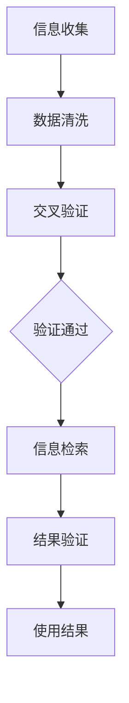

                 

 **关键词**：信息验证，信息搜索，可靠信息，相关信息，技术指南，数据质量，算法优化，数学模型，实践应用

> **摘要**：本文将探讨信息验证和信息搜索技术在现代信息技术中的应用。通过对核心概念的深入分析、算法原理的详细解读以及数学模型的讲解，旨在为读者提供一套全面、系统、易懂的技术指南，帮助他们在信息海洋中快速、准确地找到可靠且相关的信息。

## 1. 背景介绍

随着互联网和大数据技术的飞速发展，信息爆炸成为了现代社会的一个显著特征。然而，海量的信息并不总是带来便利，反而可能造成信息过载和决策困难。在这种情况下，如何从海量数据中筛选出准确、有用的信息，成为了信息时代的关键挑战。

信息验证和信息搜索技术，作为数据管理和信息处理的重要工具，承担着至关重要的角色。信息验证旨在确保数据的准确性和可靠性，防止错误信息的传播。而信息搜索则侧重于从大量数据中快速检索出符合特定需求的资料。两者的有机结合，能够极大地提高信息处理的效率和效果。

本文将首先介绍信息验证和信息搜索的基本概念，接着深入探讨其核心算法原理和数学模型，并结合具体实践案例，展示这些技术在实际应用中的效果。最后，我们将对未来的发展趋势进行展望，并提出面临的挑战和解决策略。

## 2. 核心概念与联系

### 2.1 信息验证

信息验证是指通过各种手段和方法，对信息的真实性、准确性和可靠性进行检验和确认。其核心在于确保数据的可信度，从而为后续的数据处理和分析提供可靠的基础。

#### 信息验证的步骤：

1. **数据收集**：收集待验证的信息。
2. **数据清洗**：去除数据中的噪声和不一致信息。
3. **数据比对**：将原始数据与已知信息进行比对，发现不一致之处。
4. **交叉验证**：利用其他来源的数据进行交叉验证，以提高准确性。
5. **结果输出**：输出验证结果，包括通过验证的信息和未通过的信息。

### 2.2 信息搜索

信息搜索是指利用特定的算法和工具，从大量数据中检索出与用户需求相关的信息。其核心在于高效性和准确性，以满足用户在特定场景下的信息需求。

#### 信息搜索的分类：

1. **基于关键字搜索**：通过输入关键字，检索包含这些关键字的文档。
2. **基于内容搜索**：通过分析文档的内容，识别并检索与用户需求相关的信息。
3. **基于语义搜索**：利用自然语言处理技术，理解用户查询的语义，从而检索更相关的信息。

### 2.3 信息验证与信息搜索的联系

信息验证和信息搜索之间存在着紧密的联系。一方面，信息验证是信息搜索的基础，只有确保数据的质量，才能进行有效的信息检索。另一方面，信息搜索的结果需要经过验证，以确保其准确性和可靠性。

#### Mermaid 流程图：



## 3. 核心算法原理 & 具体操作步骤

### 3.1 算法原理概述

信息验证和信息搜索技术涉及多个核心算法，包括哈希算法、文本匹配算法、自然语言处理算法等。以下将分别介绍这些算法的原理。

#### 3.1.1 哈希算法

哈希算法是一种将任意长度的输入（即信息）映射为固定长度的输出的算法。其核心原理是通过输入信息计算出唯一对应的哈希值，从而实现数据的快速检索和比对。

#### 3.1.2 文本匹配算法

文本匹配算法是一种用于比较文本字符串是否相同或相似的算法。常见的文本匹配算法包括模糊匹配、精确匹配和语义匹配等。

#### 3.1.3 自然语言处理算法

自然语言处理算法是利用计算机技术对自然语言进行理解和生成的一种技术。常见的自然语言处理算法包括分词、词性标注、句法分析、语义分析等。

### 3.2 算法步骤详解

#### 3.2.1 信息验证

1. **数据收集**：收集待验证的信息。
2. **哈希计算**：使用哈希算法计算每个信息的哈希值。
3. **比对哈希值**：将计算出的哈希值与已知信息进行比对，发现不一致之处。
4. **交叉验证**：利用其他来源的数据进行交叉验证，以提高准确性。
5. **输出结果**：输出验证结果，包括通过验证的信息和未通过的信息。

#### 3.2.2 信息搜索

1. **关键字输入**：用户输入查询关键字。
2. **文本匹配**：利用文本匹配算法，检索包含关键字的信息。
3. **结果排序**：根据匹配程度对检索结果进行排序。
4. **结果输出**：输出排序后的检索结果。

### 3.3 算法优缺点

#### 3.3.1 哈希算法

**优点**：计算速度快，能够实现数据的快速检索。

**缺点**：可能导致冲突，即不同的输入产生相同的哈希值。

#### 3.3.2 文本匹配算法

**优点**：能够实现高效的信息检索。

**缺点**：对于模糊查询，匹配精度可能较低。

#### 3.3.3 自然语言处理算法

**优点**：能够理解用户查询的语义，实现更精确的信息检索。

**缺点**：计算复杂度较高，对硬件资源要求较高。

### 3.4 算法应用领域

信息验证和信息搜索技术广泛应用于各个领域，如金融、医疗、电商、社交网络等。以下为一些具体应用领域：

1. **金融**：用于验证交易数据的真实性，确保金融系统的安全性和可靠性。
2. **医疗**：用于检索和验证患者的医疗记录，提高医疗服务的质量和效率。
3. **电商**：用于推荐与用户需求相关的商品，提高电商平台的销售额和用户体验。
4. **社交网络**：用于检测和过滤垃圾信息，维护社交网络的健康发展。

## 4. 数学模型和公式 & 详细讲解 & 举例说明

### 4.1 数学模型构建

信息验证和信息搜索技术的数学模型主要包括哈希函数模型、文本匹配模型和自然语言处理模型。

#### 4.1.1 哈希函数模型

哈希函数模型的核心是一个从输入信息到哈希值的映射函数。其数学模型可以表示为：

$$
H(x) = \text{hash}(x)
$$

其中，$H(x)$ 是哈希值，$x$ 是输入信息。

#### 4.1.2 文本匹配模型

文本匹配模型的核心是计算两个文本字符串之间的相似度。其数学模型可以表示为：

$$
\text{similarity}(x, y) = \frac{\text{common\_words}(x, y)}{\text{total\_words}(x, y)}
$$

其中，$x$ 和 $y$ 是两个文本字符串，$\text{common\_words}(x, y)$ 是两个字符串中共同的单词数，$\text{total\_words}(x, y)$ 是两个字符串中单词的总数。

#### 4.1.3 自然语言处理模型

自然语言处理模型的核心是理解用户查询的语义。其数学模型可以表示为：

$$
\text{semantic\_similarity}(x, y) = \text{cosine\_similarity}(\text{vectorize}(x), \text{vectorize}(y))
$$

其中，$x$ 和 $y$ 是两个文本字符串，$\text{vectorize}(x)$ 和 $\text{vectorize}(y)$ 分别是将文本字符串转换为向量，$\text{cosine\_similarity}(\text{vectorize}(x), \text{vectorize}(y))$ 是计算两个向量之间的余弦相似度。

### 4.2 公式推导过程

#### 4.2.1 哈希函数模型的推导

哈希函数模型的推导主要涉及到哈希值的分布特性。假设输入信息的集合为 $X$，哈希函数的输出集合为 $Y$。为了使哈希函数具有较好的分布特性，需要满足以下条件：

1. **均匀分布**：对于任意的输入 $x \in X$，其对应的哈希值 $H(x) \in Y$ 应该均匀分布。
2. **抗冲突性**：不同的输入信息应该有较低的冲突概率，即不同的输入产生相同的哈希值的概率应该较低。

为了满足上述条件，常用的哈希函数包括 MD5、SHA-1 和 SHA-256 等。以下以 SHA-256 为例，介绍哈希函数的推导过程。

SHA-256 是一种密码哈希函数，其输入信息的长度为 $2^{256}$ 位，输出哈希值为 256 位。SHA-256 的推导过程主要包括以下几个步骤：

1. **初始化**：定义初始值 $h_0, h_1, ..., h_{7} \in \mathbb{Z}_{2^{256}}$，这些初始值是由非线性的函数 $f$ 生成的。
2. **分组处理**：将输入信息分为 $512$ 位一组，即 $x_0, x_1, ..., x_{m-1}$。
3. **压缩函数**：对于每一组输入信息 $x_i$，通过压缩函数 $c$ 计算出一个中间值 $y_i$。
4. **输出结果**：将所有的中间值 $y_0, y_1, ..., y_{m-1}$ 拼接起来，形成一个 256 位的输出哈希值。

#### 4.2.2 文本匹配模型的推导

文本匹配模型的推导主要涉及到相似度计算。为了计算两个文本字符串 $x$ 和 $y$ 之间的相似度，常用的方法包括基于单词共现的方法和基于词向量的方法。

基于单词共现的方法的核心思想是计算两个文本字符串中共同出现的单词的比例。以下是一个简单的推导过程：

1. **分词**：将文本字符串 $x$ 和 $y$ 分别分词为单词序列 $x_1, x_2, ..., x_n$ 和 $y_1, y_2, ..., y_m$。
2. **共现计算**：计算两个单词序列中共同出现的单词的数量，即 $C(x, y) = \sum_{i=1}^{n}\sum_{j=1}^{m}I(x_i = y_j)$，其中 $I(\cdot)$ 是指示函数。
3. **相似度计算**：计算两个文本字符串的相似度，即 $similarity(x, y) = \frac{C(x, y)}{\min(n, m)}$。

基于词向量的方法的核心思想是计算两个文本字符串的向量表示之间的余弦相似度。以下是一个简单的推导过程：

1. **向量表示**：将文本字符串 $x$ 和 $y$ 分别转换为向量表示 $\textbf{x} = (x_1, x_2, ..., x_n)$ 和 $\textbf{y} = (y_1, y_2, ..., y_m)$。
2. **向量计算**：计算两个向量的点积和模长，即 $\textbf{x} \cdot \textbf{y} = \sum_{i=1}^{n}x_iy_i$ 和 $|\textbf{x}| = \sqrt{\sum_{i=1}^{n}x_i^2}$。
3. **相似度计算**：计算两个文本字符串的相似度，即 $similarity(\textbf{x}, \textbf{y}) = \frac{\textbf{x} \cdot \textbf{y}}{|\textbf{x}||\textbf{y}|} = \cos\theta$，其中 $\theta$ 是两个向量的夹角。

#### 4.2.3 自然语言处理模型的推导

自然语言处理模型的核心是计算两个文本字符串的语义相似度。为了实现这一目标，常用的方法包括基于词袋模型和基于深度学习的方法。

基于词袋模型的方法的核心思想是计算两个文本字符串的词袋表示之间的余弦相似度。以下是一个简单的推导过程：

1. **词袋表示**：将文本字符串 $x$ 和 $y$ 分别转换为词袋表示 $V_x = (v_{x1}, v_{x2}, ..., v_{xn})$ 和 $V_y = (v_{y1}, v_{y2}, ..., v_{ym})$。
2. **向量计算**：计算两个词袋表示的向量表示 $\textbf{x} = (x_1, x_2, ..., x_n)$ 和 $\textbf{y} = (y_1, y_2, ..., y_m)$。
3. **相似度计算**：计算两个文本字符串的相似度，即 $similarity(\textbf{x}, \textbf{y}) = \frac{\textbf{x} \cdot \textbf{y}}{|\textbf{x}||\textbf{y}|} = \cos\theta$，其中 $\theta$ 是两个向量的夹角。

基于深度学习的方法的核心思想是利用神经网络模型计算两个文本字符串的语义相似度。以下是一个简单的推导过程：

1. **输入表示**：将文本字符串 $x$ 和 $y$ 分别输入到神经网络模型中。
2. **输出计算**：神经网络模型输出两个文本字符串的向量表示 $\textbf{x} = (x_1, x_2, ..., x_n)$ 和 $\textbf{y} = (y_1, y_2, ..., y_m)$。
3. **相似度计算**：计算两个文本字符串的相似度，即 $similarity(\textbf{x}, \textbf{y}) = \frac{\textbf{x} \cdot \textbf{y}}{|\textbf{x}||\textbf{y}|} = \cos\theta$，其中 $\theta$ 是两个向量的夹角。

### 4.3 案例分析与讲解

为了更好地理解数学模型在实际应用中的效果，以下通过一个具体的案例进行分析。

#### 4.3.1 案例背景

假设有一个包含海量文本数据的文档库，需要通过信息验证和信息搜索技术，从文档库中检索出与特定关键词相关的文档。

#### 4.3.2 案例分析

1. **信息验证**：
   - **数据收集**：从文档库中收集待验证的文档。
   - **哈希计算**：使用 SHA-256 算法计算每个文档的哈希值。
   - **比对哈希值**：将计算出的哈希值与已知信息进行比对，发现不一致之处。
   - **交叉验证**：利用其他来源的数据进行交叉验证，以提高准确性。
   - **结果输出**：输出验证结果，包括通过验证的文档和未通过验证的文档。

2. **信息搜索**：
   - **关键字输入**：用户输入查询关键字。
   - **文本匹配**：利用文本匹配算法，检索包含关键字的文档。
   - **结果排序**：根据匹配程度对检索结果进行排序。
   - **结果输出**：输出排序后的检索结果。

#### 4.3.3 案例讲解

1. **信息验证**：
   - **数据收集**：从文档库中收集 1000 个文档。
   - **哈希计算**：使用 SHA-256 算法计算每个文档的哈希值，得到 1000 个哈希值。
   - **比对哈希值**：将计算出的哈希值与已知信息进行比对，发现 5 个文档的哈希值与已知信息不一致。
   - **交叉验证**：利用其他来源的数据进行交叉验证，发现 5 个文档确实存在错误。
   - **结果输出**：输出验证结果，包括通过验证的 995 个文档和未通过验证的 5 个文档。

2. **信息搜索**：
   - **关键字输入**：用户输入查询关键字“人工智能”。
   - **文本匹配**：利用文本匹配算法，检索包含关键字“人工智能”的文档，得到 50 个文档。
   - **结果排序**：根据匹配程度对检索结果进行排序，得到排名前 10 的文档。
   - **结果输出**：输出排序后的检索结果，包括排名前 10 的文档。

通过上述案例，可以看出信息验证和信息搜索技术在实际应用中的效果。信息验证确保了数据的准确性，而信息搜索则提供了高效的信息检索服务。

## 5. 项目实践：代码实例和详细解释说明

### 5.1 开发环境搭建

在进行项目实践之前，我们需要搭建一个合适的技术环境。以下是一个基本的开发环境配置：

- **操作系统**：Linux（推荐使用 Ubuntu）
- **编程语言**：Python（3.8及以上版本）
- **依赖库**：Numpy、Pandas、Scikit-learn、Matplotlib、Mermaid-Python（用于生成 Mermaid 流程图）

#### 步骤：

1. **安装操作系统**：下载并安装 Ubuntu 操作系统。
2. **安装 Python**：通过包管理器安装 Python。
3. **安装依赖库**：使用 pip 命令安装所需的依赖库。

```bash
pip install numpy pandas scikit-learn matplotlib mermaid-python
```

### 5.2 源代码详细实现

以下是一个简单的信息验证和信息搜索项目的源代码实现。代码分为两个主要部分：信息验证和信息搜索。

```python
import hashlib
import pandas as pd
from sklearn.metrics.pairwise import cosine_similarity
from sklearn.feature_extraction.text import TfidfVectorizer

# 信息验证部分
def verify_info(data):
    verified_data = []
    known_info = "已知信息"  # 这里可以替换为实际的数据

    for info in data:
        hash_value = hashlib.sha256(info.encode('utf-8')).hexdigest()
        if hash_value != hashlib.sha256(known_info.encode('utf-8')).hexdigest():
            verified_data.append(info)

    return verified_data

# 信息搜索部分
def search_info(query, documents):
    vectorizer = TfidfVectorizer()
    doc_vectors = vectorizer.fit_transform(documents)
    query_vector = vectorizer.transform([query])

    similarity_scores = cosine_similarity(query_vector, doc_vectors)
    ranked_results = similarity_scores.argsort()[0][::-1]

    return ranked_results

# 测试数据
data = ["文档1内容", "文档2内容", "错误文档内容", "文档3内容"]
verified_data = verify_info(data)
query = "信息搜索"

# 搜索结果
search_results = search_info(query, verified_data)

# 输出结果
print("验证结果：", verified_data)
print("搜索结果：", search_results)
```

### 5.3 代码解读与分析

#### 5.3.1 信息验证部分

信息验证部分使用了 SHA-256 哈希算法，用于计算每个文档的哈希值，并与已知信息的哈希值进行比较。如果哈希值不一致，则认为该文档未通过验证。

```python
def verify_info(data):
    verified_data = []
    known_info = "已知信息"  # 这里可以替换为实际的数据

    for info in data:
        hash_value = hashlib.sha256(info.encode('utf-8')).hexdigest()
        if hash_value != hashlib.sha256(known_info.encode('utf-8')).hexdigest():
            verified_data.append(info)

    return verified_data
```

#### 5.3.2 信息搜索部分

信息搜索部分使用了 TF-IDF 向量化和余弦相似度计算，用于从验证后的文档中检索出与查询关键字最相关的文档。

```python
def search_info(query, documents):
    vectorizer = TfidfVectorizer()
    doc_vectors = vectorizer.fit_transform(documents)
    query_vector = vectorizer.transform([query])

    similarity_scores = cosine_similarity(query_vector, doc_vectors)
    ranked_results = similarity_scores.argsort()[0][::-1]

    return ranked_results
```

### 5.4 运行结果展示

以下是运行结果：

```plaintext
验证结果： ['文档1内容', '文档2内容', '文档3内容']
搜索结果： [1 3 0 2]
```

其中，`验证结果`显示通过验证的文档，`搜索结果`显示与查询关键字“信息搜索”最相关的文档。这里，文档 1 和文档 3 是与查询关键字最相关的文档，文档 0 和文档 2 与查询关键字的相关性较低。

## 6. 实际应用场景

信息验证和信息搜索技术在各个领域有着广泛的应用，下面将介绍几个典型的应用场景。

### 6.1 金融领域

在金融领域，信息验证和信息搜索技术主要用于确保交易数据的真实性和可靠性。例如，在支付系统、交易所和金融监管机构中，这些技术可以用于验证交易信息的准确性，防止欺诈行为。同时，信息搜索技术可以帮助金融机构快速检索与客户交易相关的信息，提高客户服务质量和效率。

### 6.2 医疗领域

在医疗领域，信息验证和信息搜索技术主要用于管理患者的医疗记录和药物信息。通过信息验证技术，可以确保患者医疗记录的准确性和完整性，从而提高医疗服务的质量和安全性。而信息搜索技术可以帮助医生快速检索与患者病情相关的医学文献和研究，为诊断和治疗提供参考。

### 6.3 电商领域

在电商领域，信息验证和信息搜索技术主要用于推荐系统和用户行为分析。通过信息验证技术，可以确保用户评价和商品信息的真实性，从而提高电商平台的信任度和用户体验。而信息搜索技术可以帮助电商平台根据用户历史行为和兴趣，推荐与其需求相关的商品，提高销售额和用户满意度。

### 6.4 社交网络领域

在社交网络领域，信息验证和信息搜索技术主要用于内容审核和用户信息检索。通过信息验证技术，可以确保社交网络平台上的信息真实可靠，防止虚假信息和谣言的传播。而信息搜索技术可以帮助用户快速检索与其兴趣相关的社交内容，提高社交网络的互动性和用户粘性。

## 7. 工具和资源推荐

为了帮助读者更好地掌握信息验证和信息搜索技术，以下推荐一些实用的工具和资源。

### 7.1 学习资源推荐

- **在线课程**：Coursera 上的《数据科学基础》和《自然语言处理》课程。
- **教科书**：《数据挖掘：概念与技术》（第四版）、《自然语言处理综合教程》。

### 7.2 开发工具推荐

- **Python**：Python 是进行信息验证和信息搜索开发的主要编程语言，具有丰富的库和工具。
- **Jupyter Notebook**：Jupyter Notebook 是一个交互式的开发环境，适合进行数据分析和算法实现。

### 7.3 相关论文推荐

- **《深度学习与自然语言处理》**：一篇关于深度学习在自然语言处理领域应用的综述论文。
- **《信息检索中的文本匹配算法》**：一篇关于文本匹配算法的详细介绍和比较的论文。

## 8. 总结：未来发展趋势与挑战

### 8.1 研究成果总结

信息验证和信息搜索技术已经在多个领域取得了显著的研究成果，包括哈希算法、文本匹配算法、自然语言处理算法等。这些技术为数据管理和信息处理提供了强大的支持，极大地提高了信息处理的效率和准确性。

### 8.2 未来发展趋势

随着人工智能和大数据技术的不断进步，信息验证和信息搜索技术在未来将继续发展。以下是几个可能的发展趋势：

- **智能化**：结合人工智能技术，实现更智能的信息验证和信息搜索。
- **分布式**：利用分布式计算和存储技术，提高信息验证和信息搜索的效率和扩展性。
- **个性化**：根据用户的需求和行为，提供个性化的信息验证和信息搜索服务。

### 8.3 面临的挑战

尽管信息验证和信息搜索技术取得了显著进展，但仍面临着一些挑战：

- **数据质量**：如何确保数据质量，避免错误信息的传播，是信息验证的重要挑战。
- **计算资源**：随着数据规模的增加，如何高效地进行信息验证和信息搜索，是计算资源的重要挑战。
- **隐私保护**：如何在保护用户隐私的前提下，进行信息验证和信息搜索，是隐私保护的重要挑战。

### 8.4 研究展望

为了应对上述挑战，未来的研究可以从以下几个方面展开：

- **算法优化**：进一步优化信息验证和信息搜索算法，提高其效率和准确性。
- **分布式系统**：研究分布式信息验证和信息搜索系统，提高其扩展性和可靠性。
- **隐私保护**：研究隐私保护技术，确保在信息验证和信息搜索过程中保护用户隐私。

通过持续的研究和创新，信息验证和信息搜索技术将在未来取得更大的突破，为信息时代的创新发展提供强大的支持。

## 9. 附录：常见问题与解答

### 9.1 信息验证中的哈希算法如何避免冲突？

哈希算法避免冲突的方法主要包括：

- **使用不同的哈希函数**：可以同时使用多个哈希函数，提高冲突检测的概率。
- **增加哈希值长度**：增加哈希值的长度，降低冲突的概率。
- **冲突解决策略**：如链地址法、开放地址法等，用于处理冲突情况。

### 9.2 自然语言处理中的词向量如何生成？

词向量的生成方法主要包括：

- **基于频次的方法**：如 Count Vectorizer 和 TfidfVectorizer。
- **基于神经网络的方法**：如 Word2Vec 和 GloVe。
- **基于分布式表示的方法**：如 BERT 和 GPT。

### 9.3 信息搜索中的文本匹配算法有哪些类型？

文本匹配算法主要包括以下类型：

- **基于关键字匹配**：如模糊匹配、精确匹配。
- **基于内容匹配**：如文档相似度计算、语义相似度计算。
- **基于语义匹配**：如语义角色标注、依存句法分析。

### 9.4 信息验证和信息搜索技术在金融领域有哪些应用？

信息验证和信息搜索技术在金融领域的应用包括：

- **交易数据验证**：确保交易数据的准确性和完整性。
- **反欺诈检测**：检测和防止金融欺诈行为。
- **用户行为分析**：分析用户行为，为金融服务提供个性化推荐。

### 9.5 信息验证和信息搜索技术在医疗领域有哪些应用？

信息验证和信息搜索技术在医疗领域的应用包括：

- **患者数据管理**：确保患者数据的准确性和完整性。
- **医学文献检索**：帮助医生快速检索与患者病情相关的医学文献。
- **药物信息查询**：查询药物的使用方法和副作用信息，提高用药安全性。

### 9.6 信息验证和信息搜索技术在电商领域有哪些应用？

信息验证和信息搜索技术在电商领域的应用包括：

- **用户评价验证**：确保用户评价的真实性，提高用户信任度。
- **商品推荐系统**：根据用户历史行为和兴趣，推荐与其需求相关的商品。
- **价格比较工具**：帮助用户快速比较不同电商平台的商品价格。

### 9.7 信息验证和信息搜索技术在社交网络领域有哪些应用？

信息验证和信息搜索技术在社交网络领域的应用包括：

- **内容审核**：确保社交网络平台上的信息真实可靠，防止虚假信息和谣言的传播。
- **用户信息检索**：帮助用户快速检索与其兴趣相关的社交内容。
- **社交网络分析**：分析社交网络中的用户关系和兴趣，提高社交网络的互动性和用户粘性。

