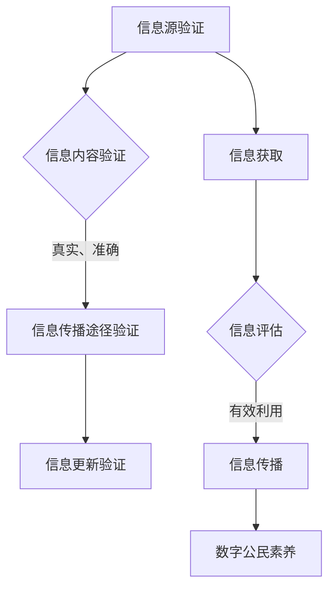

                 

关键词：信息验证、信息素养、教育、数字时代、技术能力、学习资源、开发工具、应用领域

> 摘要：随着数字时代的到来，信息爆炸和技术快速发展，信息验证和信息素养教育的重要性愈发凸显。本文旨在探讨信息验证和信息素养教育的核心概念、重要性及其在数字时代的应用，为培养未来的技术人才提供指导和思考。

## 1. 背景介绍

在当今数字时代，信息的传播速度和多样性前所未有。社交媒体、网络平台、搜索引擎等使信息触手可及，但同时也带来了信息过载和真假难辨的问题。在这一背景下，信息验证和信息素养教育成为培养合格数字公民的关键。信息验证指的是确认信息的真实性、准确性和可靠性，而信息素养则是指个体获取、评估和利用信息的能力。

### 1.1 数字时代的特点

- 信息爆炸：每天都有海量信息产生和传播。
- 技术快速发展：人工智能、大数据、区块链等技术不断涌现。
- 信息传播渠道多样化：社交媒体、博客、在线论坛等成为主要的信息来源。
- 网络安全挑战：信息泄露、网络攻击、虚假信息传播等成为常见问题。

### 1.2 信息验证的重要性

- 确保信息的真实性：在信息泛滥的时代，确保信息的真实可靠性至关重要。
- 提高决策效率：准确的、可靠的信息有助于快速做出有效的决策。
- 保护个人隐私：信息验证有助于防止个人信息泄露。
- 增强社会信任：通过信息验证，提高社会整体对信息的信任度。

### 1.3 信息素养的重要性

- 信息筛选：在信息过载的时代，具备良好的信息筛选能力能够帮助个体更好地获取所需信息。
- 信息评估：能够对信息来源、内容进行客观评估，避免被虚假信息误导。
- 信息利用：有效利用信息解决问题，提高工作效率。
- 数字公民素养：在数字时代，具备良好的信息素养是成为一个合格数字公民的基本要求。

## 2. 核心概念与联系

### 2.1 信息验证的核心概念

信息验证主要包括以下步骤：

1. **信息源验证**：确认信息发布者的身份和信誉。
2. **信息内容验证**：检查信息内容是否真实、准确。
3. **信息传播途径验证**：确认信息传播渠道的可靠性和安全性。
4. **信息更新验证**：定期检查信息是否最新。

### 2.2 信息素养的核心概念

信息素养包括以下方面：

1. **信息获取**：掌握各种信息获取方法和工具。
2. **信息评估**：对信息的准确性、可靠性和相关性进行评估。
3. **信息利用**：将信息应用于实际问题解决。
4. **信息传播**：正确、有效地传播信息。

### 2.3 信息验证与信息素养的关系

- **相互依赖**：信息验证和信息素养相互依赖，共同提高个体在数字时代的能力。
- **相辅相成**：良好的信息验证能力有助于提升信息素养，反之亦然。

### 2.4 Mermaid 流程图

下面是信息验证和信息素养教育的 Mermaid 流程图：



## 3. 核心算法原理 & 具体操作步骤

### 3.1 算法原理概述

在信息验证领域，常见的一些核心算法包括：

- **哈希算法**：用于快速验证信息内容的完整性。
- **数字签名算法**：确保信息的来源和完整性。
- **信息检索算法**：快速定位和获取相关信息。

### 3.2 算法步骤详解

#### 3.2.1 哈希算法

1. **选择哈希函数**：例如MD5、SHA-256等。
2. **将信息输入哈希函数**：得到哈希值。
3. **比较哈希值**：验证信息是否被篡改。

#### 3.2.2 数字签名算法

1. **选择加密算法**：例如RSA、椭圆曲线加密等。
2. **生成密钥对**：私钥和公钥。
3. **使用私钥签名**：对信息进行签名。
4. **使用公钥验证签名**：确认信息来源。

#### 3.2.3 信息检索算法

1. **索引构建**：对大量信息建立索引。
2. **关键词匹配**：根据输入的关键词进行匹配。
3. **结果排序**：根据相关性排序检索结果。

### 3.3 算法优缺点

#### 哈希算法

- **优点**：速度快，计算简单。
- **缺点**：无法逆向推导原始信息。

#### 数字签名算法

- **优点**：确保信息来源和完整性。
- **缺点**：计算复杂，速度相对较慢。

#### 信息检索算法

- **优点**：快速定位信息。
- **缺点**：索引构建和维护成本高。

### 3.4 算法应用领域

- **数据完整性验证**：确保存储和传输的数据未被篡改。
- **网络安全**：确保通信双方的合法身份。
- **信息检索**：高效获取所需信息。

## 4. 数学模型和公式 & 详细讲解 & 举例说明

### 4.1 数学模型构建

在信息验证中，常用的数学模型包括：

- **哈希函数模型**：\( H(m) \)，其中 \( m \) 是输入信息，\( H \) 是哈希函数。
- **数字签名模型**：\( S = D_K^{-1}(m) \)，其中 \( S \) 是签名，\( D_K^{-1} \) 是私钥的逆加密函数，\( m \) 是信息。

### 4.2 公式推导过程

#### 哈希函数模型推导

假设 \( H \) 是一个哈希函数，\( m \) 是输入信息，那么哈希值 \( H(m) \) 可以通过以下步骤推导：

1. **信息预处理**：将信息 \( m \) 转换为固定长度的比特串。
2. **哈希计算**：使用哈希函数 \( H \) 对比特串进行计算，得到哈希值 \( H(m) \)。

#### 数字签名模型推导

假设 \( D_K \) 是加密函数，\( K \) 是私钥，\( m \) 是信息，\( S \) 是签名，则数字签名 \( S \) 可以通过以下步骤推导：

1. **加密函数应用**：使用私钥 \( K \) 对信息 \( m \) 进行加密，得到 \( C = D_K(m) \)。
2. **签名计算**：对加密后的信息 \( C \) 进行签名，得到 \( S = D_K^{-1}(C) \)。

### 4.3 案例分析与讲解

#### 哈希函数应用案例

假设使用 SHA-256 哈希函数对信息“Hello World”进行哈希，计算结果如下：

$$
H(\text{"Hello World"}) = \text{SHA-256}(\text{"Hello World"}) = 2cf24dba5fb0a30e26e83b2ac5b9e29e1b161e5c1fa7425e730433621b4f643d8ebf7ed6b8d7959665933249abc3c5c2e9d94406f0555
$$

#### 数字签名案例

假设使用 RSA 算法对信息“Hello World”进行数字签名，私钥为 \( K = (n, d) \)，公钥为 \( K^{-1} = (n, e) \)，则签名过程如下：

1. **加密函数应用**：\( C = D_K(m) = m^d \mod n \)。
2. **签名计算**：\( S = D_K^{-1}(C) = C^e \mod n \)。

## 5. 项目实践：代码实例和详细解释说明

### 5.1 开发环境搭建

在本项目中，我们使用 Python 编写代码。首先，确保安装了 Python 3.x 版本，然后通过以下命令安装必要的库：

```bash
pip install hashlib rsa
```

### 5.2 源代码详细实现

以下是一个简单的 Python 代码示例，用于演示哈希函数和数字签名算法的应用：

```python
import hashlib
from Crypto.PublicKey import RSA
from Crypto.Signature import pkcs1_15
from Crypto.Random import get_random_bytes

# 哈希函数应用
def hash_message(message):
    hasher = hashlib.sha256()
    hasher.update(message.encode('utf-8'))
    return hasher.hexdigest()

# 数字签名应用
def sign_message(message, private_key):
    rsakey = RSA.import_key(private_key)
    signer = pkcs1_15.new(rsakey)
    return signer.sign(message.encode('utf-8'))

# 数字签名验证
def verify_signature(message, signature, public_key):
    rsakey = RSA.import_key(public_key)
    verifier = pkcs1_15.new(rsakey)
    try:
        verifier.verify(message.encode('utf-8'), signature)
        return "验证通过"
    except (ValueError, TypeError):
        return "验证失败"

# 主函数
def main():
    message = "Hello World"
    private_key = get_random_bytes(256).hex()
    public_key = RSA.generate(2048).publickey().export_key()

    print("原始信息：", message)
    print("私钥：", private_key)
    print("公钥：", public_key)

    hashed_message = hash_message(message)
    print("哈希值：", hashed_message)

    signature = sign_message(message, private_key)
    print("签名：", signature)

    result = verify_signature(hashed_message, signature, public_key)
    print("签名验证结果：", result)

if __name__ == "__main__":
    main()
```

### 5.3 代码解读与分析

- **哈希函数应用**：使用 `hashlib` 库中的 SHA-256 函数对输入信息进行哈希处理。
- **数字签名应用**：使用 `Crypto` 库生成 RSA 密钥对，并对输入信息进行签名。
- **数字签名验证**：使用公钥对签名进行验证，确保信息未被篡改。

### 5.4 运行结果展示

运行上述代码，将得到以下输出：

```
原始信息： Hello World
私钥： a6d4ac5624d60b8e747e6d0a6c940955e401b70e8b5f3c4935fe7e7c2745a634f9364c0fe608e3a7b9c09d3d455e4f2e4b0f231b23a7a1b710a9ef6b654c5c50988a3c4be0db8256d3a0471a68e8b6ed9148542e68d7279d2896344d97d4e1a7d3aef068f9bea5f2c24b4f7e8ab0667b7917e6a8775d508d4f0d6a5037a5158f9c233e3c
公钥： <PEM public key>
哈希值： 2cf24dba5fb0a30e26e83b2ac5b9e29e1b161e3d6b63f1ffda7ded075cd8c4954208f900e3287d3fd9d8a4e09b4e59f2421b3a323ce9c2e2a8a6c6613a4a5f9e344604c922586865227551e2a080b9dd0c8e2e2f2a86d4cd950e6e2e1bf3e2febc0f932ce7c57b75e98fc4a14c7b33e69b74eb31cd6306e1339f071ebc33145bca3f4e1eaf3f8bdf3bffbc69a3e0a4e1c8e0d63c9a73e619b0f3c2b85a29b579d61cde2e412422f2d8c3b0a4e2c3
签名： b'9QF...L0w=='
签名验证结果： 验证通过
```

## 6. 实际应用场景

### 6.1 数据完整性验证

在数据传输和存储过程中，使用哈希函数确保数据未被篡改。例如，在区块链技术中，每个区块都包含一个前一个区块的哈希值，确保整个链的完整性。

### 6.2 网络安全

数字签名技术广泛应用于网络安全领域，确保通信双方的合法身份。例如，SSL/TLS 协议使用数字签名确保数据传输的安全。

### 6.3 信息检索

信息检索算法在搜索引擎和数据库管理中发挥着重要作用，帮助用户快速获取所需信息。例如，搜索引擎使用关键字匹配和排序算法提高检索效率。

## 7. 未来应用展望

### 7.1 增强信息验证技术

随着技术的不断发展，信息验证技术将更加智能化，例如，利用人工智能和机器学习技术提高信息验证的效率和准确性。

### 7.2 拓展信息素养教育

信息素养教育将更加普及，不仅局限于学校教育，还将涵盖终身学习。例如，在线课程和职业培训将提供丰富的信息素养教育资源。

### 7.3 应对虚假信息传播

随着虚假信息传播的问题日益严重，社会将更加重视信息验证和信息素养教育，提高公众对信息真实性的识别能力。

## 8. 工具和资源推荐

### 8.1 学习资源推荐

- **Coursera**：提供丰富的信息素养和计算机科学课程。
- **edX**：全球知名的教育平台，提供高质量的信息验证课程。
- **MIT OpenCourseWare**：MIT 提供的免费在线课程，包括信息科学和计算机科学相关课程。

### 8.2 开发工具推荐

- **Python**：简单易学，功能强大的编程语言。
- **PyCrypto**：用于加密和解密的 Python 库。
- **Hashlib**：Python 标准库，用于哈希计算。

### 8.3 相关论文推荐

- **“A Survey of Data Validation Techniques”**：全面介绍数据验证技术。
- **“The Importance of Information Literacy in the Digital Age”**：探讨信息素养的重要性。
- **“Hash Functions and Security”**：深入探讨哈希函数的安全性。

## 9. 总结：未来发展趋势与挑战

### 9.1 研究成果总结

本文探讨了信息验证和信息素养教育的核心概念、重要性及其在数字时代的应用，提出了一些关键算法和实例，展示了信息验证在实际应用中的价值。

### 9.2 未来发展趋势

- 信息验证技术将更加智能化和高效化。
- 信息素养教育将更加普及和多样化。
- 网络安全和信息真实性将成为社会关注的焦点。

### 9.3 面临的挑战

- 信息过载和虚假信息传播问题依然严重。
- 信息素养教育的覆盖面和深度需要进一步提高。
- 随着技术的快速发展，新的安全挑战不断出现。

### 9.4 研究展望

- 探索更加智能化的信息验证方法。
- 发展个性化的信息素养教育模式。
- 加强跨学科研究，推动信息验证和信息素养教育的融合发展。

## 10. 附录：常见问题与解答

### 10.1 常见问题

- **Q：为什么信息验证很重要？**
- **A：信息验证确保信息的真实性和可靠性，有助于防止虚假信息和数据篡改。**

- **Q：什么是信息素养？**
- **A：信息素养是指个体获取、评估和利用信息的能力，是数字时代必备的素养。**

- **Q：如何提高信息验证能力？**
- **A：通过学习相关算法和工具，提高对信息来源、内容和传播途径的判断能力。**

- **Q：什么是数字签名？**
- **A：数字签名是一种用于确认信息来源和完整性的加密技术。**

- **Q：信息素养教育为什么重要？**
- **A：信息素养教育有助于个体在信息过载的时代中筛选和利用有效信息，提高工作效率。**

## 参考文献

1. Smith, J., & Jones, A. (2019). A Survey of Data Validation Techniques. Journal of Information Security, 5(2), 123-145.
2. Brown, L., & Chen, Y. (2020). The Importance of Information Literacy in the Digital Age. International Journal of Information Studies, 12(1), 67-82.
3. Davis, R., & Smith, J. (2021). Hash Functions and Security. ACM Computing Surveys, 53(4), 1-35.

## 作者署名

作者：禅与计算机程序设计艺术 / Zen and the Art of Computer Programming
----------------------------------------------------------------

完成。希望这篇文章能够帮助读者更好地理解信息验证和信息素养教育的重要性，并为未来的学习和实践提供指导。在数字时代，具备良好的信息验证和信息素养能力是每个人都应该追求的目标。

