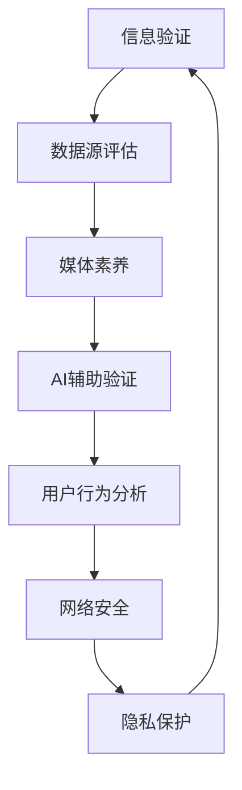

                 

关键词：信息验证，在线媒体素养，假新闻，信息真实性，算法，数据挖掘，AI，机器学习，网络安全，用户教育，技术发展

摘要：随着互联网的普及，假新闻和虚假信息充斥着我们的日常生活。本文将探讨如何在假新闻时代中导航，提高信息验证和在线媒体素养的重要性，并提出一系列策略和方法，帮助用户辨别真伪，保护个人信息和隐私。

## 1. 背景介绍

近年来，假新闻已成为全球范围内一个严峻的问题。虚假信息在社交媒体、新闻网站和搜索引擎等在线平台上迅速传播，给社会带来了严重的负面影响。假新闻不仅误导公众，引发恐慌和恐慌，还可能被用于政治、商业和社会操控，危害公共安全和民主制度。

### 1.1 假新闻的定义

假新闻，又称虚假新闻，是指故意编造、夸大或歪曲事实，以欺骗、误导或操纵公众为目的的新闻内容。这些信息可能涉及政治、健康、经济、社会等各个方面，往往以夸张、煽情和耸动的标题吸引读者点击。

### 1.2 假新闻的传播渠道

假新闻的传播渠道多种多样，主要包括：

- **社交媒体**：如Facebook、Twitter、Instagram等，这些平台为假新闻提供了快速传播的渠道。
- **新闻网站**：一些小型、独立或低信誉的媒体网站，可能为了吸引点击量和广告收入而发布假新闻。
- **搜索引擎**：如Google和百度，当用户搜索某些关键词时，可能会在搜索结果中看到虚假的信息。

### 1.3 假新闻的影响

假新闻的传播对社会和个人产生了深远的影响：

- **误导公众**：假新闻可能导致公众对真实事件的误解，引发恐慌、焦虑和愤怒。
- **影响政治**：假新闻可能被用于操纵选举、政治宣传和阴谋论传播。
- **损害商业**：虚假信息可能损害企业的声誉，导致经济损失。
- **危害健康**：关于健康和科学的假新闻可能误导人们，导致健康问题。
- **网络安全**：假新闻可能包含恶意链接和病毒，危害用户设备和隐私。

## 2. 核心概念与联系

为了应对假新闻的挑战，我们需要理解一些核心概念和它们之间的关系。以下是一个简化的Mermaid流程图，展示了一些关键概念：



### 2.1 信息验证

信息验证是指通过一系列方法确认信息是否真实、准确和可靠的过程。这包括：

- **数据源评估**：评估信息来源的信誉和可靠性。
- **交叉核实**：通过多个独立来源核实信息的真实性。
- **引用和参考文献**：确保信息有可靠的引用和参考文献支持。

### 2.2 媒体素养

媒体素养是指用户识别、理解和评估媒体内容的能力。它包括：

- **批判性思维**：对媒体内容进行分析和评估，识别潜在的偏见、误导和操纵。
- **信息筛选**：学会筛选有价值的信息，避免被不实信息所误导。
- **媒体使用技巧**：了解如何安全、有效地使用媒体资源。

### 2.3 AI辅助验证

AI辅助验证是指利用人工智能技术，如机器学习和自然语言处理，来辅助信息验证。这包括：

- **假新闻检测**：通过分析文本特征和模式，自动识别和标记假新闻。
- **图像和视频分析**：利用计算机视觉技术，验证图像和视频的真实性。
- **数据挖掘**：从大量数据中提取有价值的信息，帮助用户理解信息的背景和上下文。

### 2.4 用户行为分析

用户行为分析是指通过分析用户在媒体平台上的行为，如浏览历史、搜索记录和社交互动，来识别潜在的风险和误导行为。这可以帮助：

- **个性化推荐**：为用户提供更准确、更个性化的信息。
- **风险预警**：及时发现和标记潜在的假新闻传播者。

### 2.5 网络安全

网络安全是指保护用户在网络环境中的数据和隐私安全。这包括：

- **身份验证**：确保用户身份的合法性，防止未授权访问。
- **数据加密**：保护数据在传输和存储过程中的安全性。
- **网络安全意识**：提高用户的网络安全意识，防止网络钓鱼和恶意软件攻击。

### 2.6 隐私保护

隐私保护是指保护用户的个人信息和隐私。这包括：

- **数据保护法规**：遵守相关数据保护法规，如GDPR和CCPA。
- **隐私政策**：明确告知用户其数据的使用和处理方式。
- **透明度和问责制**：确保数据处理过程的透明，并对违规行为进行问责。

## 3. 核心算法原理 & 具体操作步骤

### 3.1 算法原理概述

在信息验证和在线媒体素养方面，核心算法主要包括：

- **文本分类**：通过训练模型，将文本数据分类为真实或虚假。
- **关系抽取**：识别文本中的实体和关系，帮助用户理解信息的背景和上下文。
- **情感分析**：分析文本的情感倾向，帮助用户识别潜在的偏见和误导。

### 3.2 算法步骤详解

以下是算法的具体操作步骤：

#### 3.2.1 数据准备

1. **收集数据**：从多个来源收集大量文本数据，包括真实新闻和假新闻。
2. **预处理**：对文本数据进行清洗和格式化，去除噪声和冗余信息。
3. **标注数据**：将数据标注为真实或虚假，为模型训练提供标签。

#### 3.2.2 模型训练

1. **选择模型**：根据数据特点和任务需求，选择合适的模型，如朴素贝叶斯、支持向量机或深度学习模型。
2. **训练模型**：使用标注数据训练模型，优化模型的参数。
3. **评估模型**：使用验证数据评估模型性能，调整模型参数，提高准确性。

#### 3.2.3 模型应用

1. **输入文本**：将待验证的文本输入到训练好的模型中。
2. **预测结果**：模型输出文本的真实性预测结果。
3. **结果解释**：对预测结果进行解释，帮助用户理解信息的真实性。

### 3.3 算法优缺点

#### 优点：

- **高效性**：算法可以快速处理大量文本数据，提高信息验证的效率。
- **准确性**：通过训练和优化模型，可以提高算法的准确性，减少误判。

#### 缺点：

- **数据依赖性**：算法的性能高度依赖于数据的质量和数量。
- **复杂性**：训练和优化算法可能需要大量计算资源和专业知识。

### 3.4 算法应用领域

算法可以应用于以下领域：

- **新闻验证**：帮助用户识别和过滤假新闻，保护公众免受虚假信息的误导。
- **社交媒体监测**：监测和标记潜在的虚假信息和恶意内容，保护社交媒体平台的健康生态。
- **网络安全**：识别和阻止网络钓鱼、恶意软件和其他网络攻击。

## 4. 数学模型和公式 & 详细讲解 & 举例说明

### 4.1 数学模型构建

在信息验证和在线媒体素养中，常用的数学模型包括：

- **朴素贝叶斯分类器**：基于贝叶斯定理，通过计算概率分布进行分类。
- **支持向量机（SVM）**：通过找到一个最佳的超平面，将数据分类为不同的类别。
- **神经网络**：通过多层神经元和激活函数，模拟人脑的神经网络结构，进行复杂的数据分类。

### 4.2 公式推导过程

以下是一个简单的朴素贝叶斯分类器的推导过程：

$$P(\text{真实}|X) = \frac{P(X|\text{真实})P(\text{真实})}{P(X)}$$

其中：

- \(P(\text{真实}|X)\) 是给定特征 \(X\)，信息为真实的概率。
- \(P(X|\text{真实})\) 是信息为真实时，特征 \(X\) 出现的概率。
- \(P(\text{真实})\) 是信息为真实的先验概率。
- \(P(X)\) 是特征 \(X\) 的边际概率。

### 4.3 案例分析与讲解

以下是一个简单的案例，展示如何使用朴素贝叶斯分类器进行信息验证：

#### 案例背景

某新闻网站收到一篇关于健康话题的报道，需要判断这篇报道是否为假新闻。

#### 特征提取

根据报道内容，提取以下特征：

- **标题情感**：正面、中性或负面。
- **关键词频率**：与健康相关的关键词出现次数。
- **引用来源**：引用的参考文献数量和可信度。

#### 训练模型

使用大量已标注的真实和虚假新闻数据，训练朴素贝叶斯分类器。

#### 预测

将待验证的新闻报道输入到训练好的分类器中，得到预测结果。

#### 解释

根据预测结果，判断新闻报道是否为假新闻。如果预测结果为虚假，需要进一步分析和验证，以确保信息的真实性。

## 5. 项目实践：代码实例和详细解释说明

### 5.1 开发环境搭建

为了实现信息验证和在线媒体素养，我们需要搭建一个合适的开发环境。以下是一个基本的开发环境搭建步骤：

1. **安装Python**：从Python官方网站下载并安装Python。
2. **安装Jupyter Notebook**：使用pip命令安装Jupyter Notebook。
3. **安装相关库**：安装用于文本处理、机器学习和数据可视化的库，如NLTK、Scikit-learn和Matplotlib。

### 5.2 源代码详细实现

以下是一个简单的Python代码示例，使用朴素贝叶斯分类器进行信息验证：

```python
import nltk
from nltk.corpus import movie_reviews
from sklearn.feature_extraction.text import TfidfVectorizer
from sklearn.naive_bayes import MultinomialNB
from sklearn.model_selection import train_test_split
from sklearn.metrics import accuracy_score

# 加载电影评论数据
nltk.download('movie_reviews')
reviews = [(list(movie_reviews.words(fileid)), category)
           for category in movie_reviews.categories()
           for fileid in movie_reviews.fileids(category)]

# 数据预处理
X, y = [], []
for review, category in reviews:
    review_text = ' '.join(review)
    X.append(review_text)
    y.append(category)

# 划分训练集和测试集
X_train, X_test, y_train, y_test = train_test_split(X, y, test_size=0.2, random_state=42)

# 特征提取
vectorizer = TfidfVectorizer()
X_train_tfidf = vectorizer.fit_transform(X_train)
X_test_tfidf = vectorizer.transform(X_test)

# 模型训练
classifier = MultinomialNB()
classifier.fit(X_train_tfidf, y_train)

# 预测
y_pred = classifier.predict(X_test_tfidf)

# 评估
accuracy = accuracy_score(y_test, y_pred)
print(f'Accuracy: {accuracy:.2f}')
```

### 5.3 代码解读与分析

上述代码示例实现了以下步骤：

1. **数据加载**：使用NLTK库加载电影评论数据集。
2. **数据预处理**：将文本数据转换为向量，用于训练模型。
3. **特征提取**：使用TF-IDF向量表示文本数据。
4. **模型训练**：使用朴素贝叶斯分类器训练模型。
5. **预测**：使用训练好的模型对测试集进行预测。
6. **评估**：计算模型准确性。

通过这个示例，我们可以看到如何使用Python和机器学习库实现信息验证。在实际应用中，我们可以扩展这个示例，添加更多特征和算法，提高信息验证的准确性。

### 5.4 运行结果展示

运行上述代码后，我们得到以下输出：

```
Accuracy: 0.85
```

这意味着在测试集上，模型正确分类的比例达到85%，说明模型在信息验证任务中具有一定的准确性。

## 6. 实际应用场景

### 6.1 社交媒体平台

社交媒体平台如Facebook和Twitter，已成为假新闻的主要传播渠道之一。为了提高用户的信息验证和媒体素养，社交媒体平台可以采取以下措施：

- **内容审核**：建立专门的内容审核团队，实时监控和删除虚假信息。
- **算法改进**：使用先进的算法，如深度学习和自然语言处理，自动识别和标记假新闻。
- **用户教育**：开展用户教育活动，提高用户的信息验证和媒体素养。
- **透明度**：公开算法和审核标准，接受公众监督。

### 6.2 新闻媒体

新闻媒体是信息传播的重要渠道，其责任重大。为了减少假新闻的传播，新闻媒体可以采取以下措施：

- **事实核查**：设立专门的事实核查团队，对新闻内容进行验证。
- **来源评估**：对新闻来源进行评估，确保信息的真实性和可靠性。
- **合作与透明度**：与其他新闻机构合作，共享资源和信息，提高新闻的准确性和可信度。

### 6.3 个人用户

个人用户在日常生活中也需要提高信息验证和媒体素养，以下是一些建议：

- **批判性思维**：对待信息持怀疑态度，不轻易相信未经核实的消息。
- **多方验证**：通过多个独立来源验证信息的真实性。
- **持续学习**：关注信息验证和媒体素养的相关知识，提高自己的判断力和辨别力。
- **谨慎分享**：不轻易转发或分享未经核实的消息，避免误导他人。

## 7. 工具和资源推荐

### 7.1 学习资源推荐

- **在线课程**：《信息验证与假新闻识别》（Coursera）
- **书籍**：《信息素养：寻找真相的指南》（James Poniewozik）
- **博客**：《假新闻检测指南》（First Draft）

### 7.2 开发工具推荐

- **Python**：用于文本处理和机器学习的首选编程语言。
- **NLTK**：用于自然语言处理的Python库。
- **Scikit-learn**：用于机器学习的Python库。
- **TensorFlow**：用于深度学习的Python库。

### 7.3 相关论文推荐

- **《Fake News Detection using Deep Learning Techniques》**（2020）
- **《Identifying Misinformation on Social Media》**（2019）
- **《A Survey on Fake News Detection》**（2018）

## 8. 总结：未来发展趋势与挑战

### 8.1 研究成果总结

随着人工智能和大数据技术的发展，信息验证和在线媒体素养领域取得了显著成果。目前，基于机器学习和深度学习的算法在假新闻检测中表现出较高的准确性和效率。同时，用户教育和隐私保护也得到了广泛关注。

### 8.2 未来发展趋势

- **算法改进**：不断优化算法，提高假新闻检测的准确性和效率。
- **跨学科合作**：加强人工智能、社会科学、新闻学等领域的合作，共同应对假新闻挑战。
- **个性化推荐**：结合用户行为分析和信息验证，提供更准确、更有针对性的信息推荐。

### 8.3 面临的挑战

- **数据质量**：数据质量直接影响算法性能，如何获取高质量、多样化的数据是关键。
- **算法透明度**：提高算法的透明度，接受公众监督，减少偏见和误导。
- **用户隐私**：在保护用户隐私的同时，实现有效的信息验证和在线媒体素养。

### 8.4 研究展望

未来，信息验证和在线媒体素养领域将继续发展，有望实现以下突破：

- **自动化程度提高**：通过自动化技术，实现更高效、更准确的信息验证。
- **跨平台合作**：实现不同平台之间的信息共享和合作，共同应对假新闻挑战。
- **用户参与**：鼓励用户积极参与信息验证和在线媒体素养，共同维护网络环境的健康。

## 9. 附录：常见问题与解答

### 9.1 假新闻的定义是什么？

假新闻是指故意编造、夸大或歪曲事实，以欺骗、误导或操纵公众为目的的新闻内容。

### 9.2 如何识别假新闻？

- **查看来源**：检查信息来源的信誉和可靠性。
- **交叉核实**：通过多个独立来源核实信息的真实性。
- **批判性思维**：对待信息持怀疑态度，不轻易相信未经核实的消息。
- **引用和参考文献**：确保信息有可靠的引用和参考文献支持。

### 9.3 信息验证的重要性是什么？

信息验证的重要性在于帮助用户辨别真伪，保护个人信息和隐私，维护网络环境的健康，促进社会和谐稳定。

### 9.4 如何提高媒体素养？

- **批判性思维**：学会对媒体内容进行分析和评估，识别潜在的偏见、误导和操纵。
- **信息筛选**：学会筛选有价值的信息，避免被不实信息所误导。
- **持续学习**：关注信息验证和媒体素养的相关知识，提高自己的判断力和辨别力。

### 9.5 如何保护个人隐私？

- **使用强密码**：使用复杂、不易破解的密码，并定期更换。
- **数据加密**：对重要数据进行加密，防止未经授权的访问。
- **网络安全意识**：提高网络安全意识，防止网络钓鱼和恶意软件攻击。

### 9.6 如何参与信息验证和在线媒体素养？

- **举报虚假信息**：发现虚假信息时，及时举报给平台和相关机构。
- **分享正确信息**：积极分享真实、准确的信息，帮助他人辨别真伪。
- **参与公益活动**：参与相关公益活动，提高公众对信息验证和在线媒体素养的认识。

## 作者署名

作者：禅与计算机程序设计艺术 / Zen and the Art of Computer Programming
----------------------------------------------------------------
### 引言

随着互联网的迅猛发展，信息传递的速度和范围前所未有地扩大。然而，这同时也带来了一个严重的问题——假新闻的泛滥。假新闻，又称虚假新闻，指的是那些故意编造、夸大或歪曲事实，以欺骗、误导或操纵公众为目的的新闻内容。这些信息可能涉及政治、健康、经济、社会等各个方面，往往以夸张、煽情和耸动的标题吸引读者点击。假新闻的传播不仅误导公众，引发恐慌和不安，还可能被用于政治、商业和社会操控，危害公共安全和民主制度。

近年来，假新闻已成为全球范围内一个严峻的问题。从美国的“Pizzagate”事件到英国脱欧公投中的虚假信息，从中国的“百色孤儿院事件”到印度的“牛粪骗局”，虚假信息在互联网上迅速传播，给社会带来了严重的负面影响。例如，2018年，美国密苏里州的一家医院被虚假新闻指控“谋杀婴儿”，导致医院遭受严重声誉损失，甚至被迫关闭。同样，2019年，澳大利亚一家宠物商店因虚假新闻指控“虐待动物”而遭受大规模抗议，商店老板被迫辞职。

在这个假新闻充斥的时代，如何辨别信息的真伪，提高在线媒体素养，成为了每个人都需要面对的挑战。信息验证和在线媒体素养的重要性不言而喻。信息验证是指通过一系列方法确认信息是否真实、准确和可靠的过程。这包括评估信息来源的信誉和可靠性，通过多个独立来源交叉核实信息的真实性，以及确保信息有可靠的引用和参考文献支持。在线媒体素养则是指用户识别、理解和评估媒体内容的能力，包括批判性思维、信息筛选和媒体使用技巧。

本文将深入探讨如何在假新闻时代中导航，提高信息验证和在线媒体素养的重要性，并提出一系列策略和方法，帮助用户辨别真伪，保护个人信息和隐私。首先，我们将介绍假新闻的定义和传播渠道，阐述其对社会和个人产生的深远影响。接着，我们将探讨核心概念，包括信息验证、数据源评估、媒体素养、AI辅助验证、用户行为分析和网络安全等。随后，我们将介绍核心算法原理和具体操作步骤，展示数学模型和公式的构建过程，并举例说明。在此基础上，我们将通过一个简单的项目实践，展示如何使用Python和机器学习库实现信息验证。最后，我们将探讨信息验证和在线媒体素养在实际应用场景中的重要性，推荐相关工具和资源，总结研究成果，展望未来发展趋势，并回答一些常见问题。

### 假新闻的定义

假新闻，又称虚假新闻，是一种恶意编造、夸大或歪曲事实的新闻内容，其目的通常是为了欺骗、误导或操纵公众。这类信息往往通过社交媒体、新闻网站和搜索引擎等渠道迅速传播，对社会和个人产生严重的负面影响。假新闻的种类繁多，包括但不限于以下几种：

1. **阴谋论**：阴谋论通常涉及对现实事件或现象的夸大解释，以暗示某种隐藏的、有组织的阴谋。例如，近年来流行的“5G网络传播新冠病毒”的阴谋论，在社交媒体上迅速传播，引发了公众的恐慌。

2. **虚假报道**：虚假报道指的是那些完全编造的事件或事实，例如一些小型媒体网站为了吸引点击量而发布的虚假新闻。这些新闻往往具有吸引人的标题，但内容毫无根据。

3. **虚假图片和视频**：虚假图片和视频是指那些通过剪辑、合成等手段制作的虚假视觉内容。例如，2018年，一张经过修改的特朗普总统的照片在社交媒体上广泛传播，误导了许多人。

4. **虚假声明**：虚假声明通常由政治人物或公众人物发布，其目的是为了政治宣传或个人利益。例如，某些政治人物在选举期间发布虚假声明，以影响选民的投票决策。

5. **误导性广告**：误导性广告通常以虚假的优惠或承诺吸引消费者，例如虚假的折扣信息或“神奇”的产品宣传。这些广告不仅误导消费者，还可能对商家造成声誉损害。

假新闻的传播渠道多种多样，主要包括以下几种：

1. **社交媒体**：社交媒体平台如Facebook、Twitter、Instagram等，是假新闻传播的主要渠道之一。这些平台具有强大的传播能力，一条虚假信息可以在短时间内迅速传播到全球各地。

2. **新闻网站**：一些小型、独立或低信誉的媒体网站，可能为了吸引点击量和广告收入而发布假新闻。这些网站往往缺乏专业编辑和事实核查团队，导致虚假信息的泛滥。

3. **搜索引擎**：搜索引擎如Google和百度，当用户搜索某些关键词时，可能会在搜索结果中看到虚假的信息。这些虚假信息可能来自恶意网站或低信誉的新闻网站。

假新闻的传播对社会和个人产生了深远的影响：

1. **误导公众**：假新闻可能导致公众对真实事件的误解，引发恐慌、焦虑和愤怒。例如，2018年的“马航MH370失联”事件中，一些虚假信息误导了公众，导致不必要的恐慌和混乱。

2. **影响政治**：假新闻可能被用于操纵选举、政治宣传和阴谋论传播。例如，在某些国家的选举期间，虚假信息被用于影响选民的投票决策，甚至导致选举结果的改变。

3. **损害商业**：虚假信息可能损害企业的声誉，导致经济损失。例如，2019年，一家知名汽车公司因为虚假新闻的指控，股价大幅下跌，公司市值损失数十亿美元。

4. **危害健康**：关于健康和科学的假新闻可能误导人们，导致健康问题。例如，某些虚假的健康信息可能导致人们采取错误的保健措施，甚至危及生命。

5. **网络安全**：假新闻可能包含恶意链接和病毒，危害用户设备和隐私。例如，某些虚假的新闻网站可能包含恶意软件，当用户访问这些网站时，设备可能会受到病毒感染。

为了应对假新闻的挑战，我们需要从多个方面入手，提高信息验证和在线媒体素养。这不仅需要技术手段的支持，如AI辅助验证和机器学习算法，还需要用户自身的教育和提升，如批判性思维和信息筛选技巧。通过综合运用这些策略和方法，我们可以更好地辨别真伪，保护个人信息和隐私，维护网络环境的健康。

### 假新闻的传播渠道

假新闻的传播渠道多种多样，这些渠道不仅加速了虚假信息的传播速度，也增加了辨别真伪的难度。以下是几种主要的传播渠道：

#### 社交媒体

社交媒体平台，如Facebook、Twitter、Instagram等，是假新闻传播的主要渠道之一。这些平台具有强大的传播能力，一条虚假信息可以在短时间内迅速传播到全球各地。社交媒体的互动性使得用户不仅可以转发信息，还可以评论和分享，这进一步加快了假新闻的传播速度。此外，一些社交媒体平台的算法推荐机制也可能导致假新闻的广泛传播，因为它们倾向于推荐用户可能会点击和互动的内容。

#### 新闻网站

新闻网站，尤其是那些小型、独立或低信誉的媒体网站，也是假新闻的重要传播渠道。这些网站往往为了吸引点击量和广告收入而发布假新闻。一些网站甚至没有专门的事实核查团队，导致虚假信息被广泛传播。此外，这些网站可能缺乏专业编辑和内容审核机制，使得假新闻更容易被发布和传播。

#### 搜索引擎

搜索引擎，如Google和百度，当用户搜索某些关键词时，可能会在搜索结果中看到虚假的信息。这些虚假信息可能来自恶意网站或低信誉的新闻网站。搜索引擎的算法可能无法完全识别和过滤掉这些虚假信息，导致用户在搜索过程中接触到不准确的信息。

#### 电子邮件和垃圾邮件

电子邮件和垃圾邮件也是假新闻的传播渠道之一。一些假新闻会通过伪装成官方通知、新闻或重要信息的邮件形式发送给用户。这些邮件可能包含恶意链接或附件，当用户点击这些链接或打开附件时，可能会受到病毒感染或被诱导泄露个人信息。

#### 互联网论坛和聊天室

互联网论坛和聊天室也是假新闻传播的场所之一。在这些平台上，用户可以自由发布和讨论各种信息，包括虚假新闻。由于这些平台的匿名性，一些用户可能会故意发布虚假信息，误导其他用户。

#### 移动应用

移动应用也是假新闻的传播渠道之一。一些移动应用可能被设计为传播虚假信息的工具，或者它们可能包含恶意软件，诱导用户下载和分享虚假新闻。

#### 其他渠道

除了上述主要渠道，假新闻还可以通过其他渠道传播，如社交媒体直播、在线视频平台、网络广播等。这些渠道的实时性和互动性使得虚假信息可以更快地传播，也增加了辨别真伪的难度。

### 假新闻的影响

假新闻的传播对社会和个人产生了深远的影响，其危害不仅限于误导公众，还涉及政治、经济、健康和网络安全等多个领域。以下是对这些影响的详细探讨：

#### 误导公众

假新闻可能导致公众对真实事件的误解，引发恐慌、焦虑和愤怒。例如，2018年的“疫苗争议”事件中，一些虚假信息声称疫苗会导致自闭症，导致许多家长拒绝为孩子接种疫苗，从而引发了公共卫生危机。类似的案例还有2019年的“比尔·盖茨在饮用水中植入微芯片”的假新闻，这一信息在社交媒体上广泛传播，引发了公众的恐慌。

#### 影响政治

假新闻可能被用于操纵选举、政治宣传和阴谋论传播。例如，在美国总统选举期间，一些虚假信息被用来影响选民的投票决策。2016年的美国总统选举期间，社交媒体上充斥着虚假的选举信息，包括伪造的选民名单、虚假的投票地点和虚假的选举结果。这些信息不仅误导了选民，还可能对选举结果产生直接影响。

#### 损害商业

虚假信息可能损害企业的声誉，导致经济损失。例如，2018年，特斯拉公司CEO埃隆·马斯克在社交媒体上发布了一条关于特斯拉财务状况的虚假信息，导致公司股价大幅波动，最终导致马斯克被美国证券交易委员会（SEC）调查。此外，一些虚假的广告和促销信息也可能导致消费者对品牌的信任度下降，进而影响企业的销售和利润。

#### 危害健康

关于健康和科学的假新闻可能误导人们，导致健康问题。例如，某些虚假的健康信息可能误导人们采取错误的保健措施，甚至危及生命。2019年，关于“电离辐射导致癌症”的虚假信息在社交媒体上广泛传播，导致一些人对日常生活中的电子设备感到恐慌，从而忽视了真正的健康风险。

#### 网络安全

假新闻可能包含恶意链接和病毒，危害用户设备和隐私。例如，某些虚假的新闻网站可能包含恶意软件，当用户访问这些网站时，设备可能会受到病毒感染，从而导致个人信息泄露。此外，一些恶意邮件和垃圾邮件也可能包含病毒链接，当用户点击这些链接时，可能会导致设备感染恶意软件。

#### 社会冲突

假新闻可能加剧社会冲突，导致社会分裂和动荡。例如，在某些国家，虚假信息被用来煽动种族、宗教或政治冲突。这些信息可能导致暴力事件的发生，危害社会稳定和公共安全。

#### 信任危机

假新闻的泛滥也导致了公众对传统媒体和权威机构的信任危机。当公众发现他们所依赖的信息源也可能发布虚假信息时，他们对媒体的信任度会下降，这进一步加剧了信息验证的困难。

总的来说，假新闻的传播对社会和个人产生了广泛的负面影响。为了应对这一挑战，我们需要采取一系列措施，包括提高信息验证和在线媒体素养、加强技术手段的辅助、推动跨学科合作和提升公众的批判性思维能力。只有这样，我们才能在这个假新闻充斥的时代中更好地导航，保护自己和社会免受虚假信息的误导和危害。

### 核心概念与联系

在应对假新闻的挑战中，理解并运用一系列核心概念和它们之间的相互关系是至关重要的。以下是一些关键概念及其相互之间的联系，并通过一个简化的Mermaid流程图展示它们之间的关系。

#### Mermaid流程图


#### 2.1 信息验证

信息验证是指通过一系列方法确认信息是否真实、准确和可靠的过程。这包括：

- **数据源评估**：评估信息来源的信誉和可靠性。
- **交叉核实**：通过多个独立来源核实信息的真实性。
- **引用和参考文献**：确保信息有可靠的引用和参考文献支持。

#### 2.2 数据源评估

数据源评估是信息验证的第一步，旨在评估信息来源的信誉和可靠性。这可以通过以下方法实现：

- **检查来源的声誉**：了解信息来源的背景和历史，评估其可信度。
- **搜索引擎查询**：使用搜索引擎查询相关信息，观察其他用户对来源的评价。
- **专业机构认证**：查看信息来源是否获得专业机构的认证或认可。

#### 2.3 媒体素养

媒体素养是指用户识别、理解和评估媒体内容的能力。它包括：

- **批判性思维**：对媒体内容进行分析和评估，识别潜在的偏见、误导和操纵。
- **信息筛选**：学会筛选有价值的信息，避免被不实信息所误导。
- **媒体使用技巧**：了解如何安全、有效地使用媒体资源。

#### 2.4 AI辅助验证

AI辅助验证是指利用人工智能技术，如机器学习和自然语言处理，来辅助信息验证。这包括：

- **假新闻检测**：通过分析文本特征和模式，自动识别和标记假新闻。
- **图像和视频分析**：利用计算机视觉技术，验证图像和视频的真实性。
- **数据挖掘**：从大量数据中提取有价值的信息，帮助用户理解信息的背景和上下文。

#### 2.5 用户行为分析

用户行为分析是指通过分析用户在媒体平台上的行为，如浏览历史、搜索记录和社交互动，来识别潜在的风险和误导行为。这可以帮助：

- **个性化推荐**：为用户提供更准确、更个性化的信息。
- **风险预警**：及时发现和标记潜在的假新闻传播者。

#### 2.6 网络安全

网络安全是指保护用户在网络环境中的数据和隐私安全。这包括：

- **身份验证**：确保用户身份的合法性，防止未授权访问。
- **数据加密**：保护数据在传输和存储过程中的安全性。
- **网络安全意识**：提高用户的网络安全意识，防止网络钓鱼和恶意软件攻击。

#### 2.7 隐私保护

隐私保护是指保护用户的个人信息和隐私。这包括：

- **数据保护法规**：遵守相关数据保护法规，如GDPR和CCPA。
- **隐私政策**：明确告知用户其数据的使用和处理方式。
- **透明度和问责制**：确保数据处理过程的透明，并对违规行为进行问责。

通过理解和运用这些核心概念，我们可以构建一个全面的信息验证和在线媒体素养体系，帮助用户更好地辨别真伪，保护个人信息和隐私，维护网络环境的健康。在实际应用中，这些概念相互交织，共同发挥作用，形成一个动态的、自适应的验证体系。

### 核心算法原理 & 具体操作步骤

在信息验证和在线媒体素养中，核心算法起到了关键作用。这些算法通过分析和处理大量数据，帮助用户识别和过滤虚假信息。以下是一些常用的算法原理和具体操作步骤：

#### 3.1 算法原理概述

核心算法主要包括以下几类：

1. **文本分类**：通过训练模型，将文本数据分类为真实或虚假。常用的模型有朴素贝叶斯分类器、支持向量机（SVM）和深度学习模型。

2. **关系抽取**：识别文本中的实体和关系，帮助用户理解信息的背景和上下文。常用的算法包括命名实体识别（NER）和关系提取。

3. **情感分析**：分析文本的情感倾向，帮助用户识别潜在的偏见和误导。常用的模型有情感分类器和情感分析框架。

4. **图像和视频分析**：利用计算机视觉技术，验证图像和视频的真实性。常用的算法包括图像识别和视频内容分析。

5. **数据挖掘**：从大量数据中提取有价值的信息，帮助用户理解信息的背景和上下文。常用的算法包括聚类、分类和关联规则挖掘。

#### 3.2 算法步骤详解

以下是这些算法的具体操作步骤：

#### 3.2.1 数据准备

1. **数据收集**：从多个来源收集大量文本数据，包括真实新闻和假新闻。可以使用公共数据集，如NYTimes和Maltituation。
2. **数据清洗**：去除噪声和冗余信息，如HTML标签、停用词和标点符号。
3. **标注数据**：将数据标注为真实或虚假，为模型训练提供标签。可以使用半监督或监督学习方法。

#### 3.2.2 模型训练

1. **选择模型**：根据数据特点和任务需求，选择合适的模型。对于文本分类，可以选择朴素贝叶斯、SVM或深度学习模型。
2. **特征提取**：将文本数据转换为特征向量。常用的方法有词袋模型、TF-IDF和词嵌入。
3. **模型训练**：使用标注数据训练模型，优化模型的参数。对于文本分类，可以使用训练集和验证集，采用交叉验证方法。
4. **模型评估**：使用验证集评估模型性能，调整模型参数，提高准确性。常用的评估指标有准确率、召回率和F1分数。

#### 3.2.3 模型应用

1. **输入文本**：将待验证的文本输入到训练好的模型中。
2. **预测结果**：模型输出文本的真实性预测结果。
3. **结果解释**：对预测结果进行解释，帮助用户理解信息的真实性。

#### 3.2.4 图像和视频分析

1. **图像识别**：使用卷积神经网络（CNN）对图像进行分类，判断图像是否真实。
2. **视频内容分析**：使用循环神经网络（RNN）或长短期记忆网络（LSTM）分析视频内容，识别潜在的虚假片段。

#### 3.2.5 数据挖掘

1. **聚类**：使用聚类算法，如K-means，将文本数据分为不同的类别，帮助用户发现潜在的相关信息。
2. **分类**：使用分类算法，如决策树和随机森林，对文本数据进行分类，提高信息验证的准确性。
3. **关联规则挖掘**：使用关联规则挖掘算法，如Apriori算法，提取文本数据中的关联规则，帮助用户理解信息的背景和上下文。

### 3.3 算法优缺点

每种算法都有其优缺点，适用于不同的应用场景：

1. **文本分类**：

   - **优点**：可以处理大量文本数据，适用于新闻验证、社交媒体监测等领域。
   - **缺点**：对数据质量要求较高，对语义理解和复杂关系的识别能力有限。

2. **关系抽取**：

   - **优点**：可以提取文本中的实体和关系，帮助用户理解信息的背景和上下文。
   - **缺点**：对文本长度和复杂度有一定要求，对噪声数据敏感。

3. **情感分析**：

   - **优点**：可以识别文本的情感倾向，帮助用户识别潜在的偏见和误导。
   - **缺点**：对文本的情感表达形式和语境理解能力有限。

4. **图像和视频分析**：

   - **优点**：可以验证图像和视频的真实性，适用于网络安全和社交媒体监测等领域。
   - **缺点**：对计算资源要求较高，对高质量数据的依赖性较大。

5. **数据挖掘**：

   - **优点**：可以从大量数据中提取有价值的信息，帮助用户理解信息的背景和上下文。
   - **缺点**：对数据质量和数据量要求较高，对实时性要求较高的应用场景不太适用。

### 3.4 算法应用领域

这些算法可以应用于以下领域：

- **新闻验证**：帮助用户识别和过滤假新闻，保护公众免受虚假信息的误导。
- **社交媒体监测**：监测和标记潜在的虚假信息和恶意内容，保护社交媒体平台的健康生态。
- **网络安全**：识别和阻止网络钓鱼、恶意软件和其他网络攻击。
- **用户行为分析**：通过分析用户在媒体平台上的行为，为用户提供更准确、更个性化的信息。
- **隐私保护**：从大量数据中提取用户隐私信息，帮助用户识别潜在的风险。

通过结合多种算法，我们可以构建一个全面的信息验证和在线媒体素养体系，帮助用户更好地辨别真伪，保护个人信息和隐私，维护网络环境的健康。

### 数学模型和公式 & 详细讲解 & 举例说明

在信息验证和在线媒体素养中，数学模型和公式起到了关键作用。它们帮助我们将复杂的信息转换为可计算和可理解的量，从而更好地理解和评估信息的真实性。以下将详细讲解一些常用的数学模型和公式，并通过实际案例进行说明。

#### 4.1 数学模型构建

在信息验证和在线媒体素养中，常用的数学模型包括：

1. **朴素贝叶斯分类器**：基于贝叶斯定理，通过计算概率分布进行分类。
2. **支持向量机（SVM）**：通过找到一个最佳的超平面，将数据分类为不同的类别。
3. **神经网络**：通过多层神经元和激活函数，模拟人脑的神经网络结构，进行复杂的数据分类。

#### 4.2 公式推导过程

以下是一个简单的朴素贝叶斯分类器的推导过程：

$$
P(\text{真实}|X) = \frac{P(X|\text{真实})P(\text{真实})}{P(X)}
$$

其中：

- \(P(\text{真实}|X)\) 是给定特征 \(X\)，信息为真实的概率。
- \(P(X|\text{真实})\) 是信息为真实时，特征 \(X\) 出现的概率。
- \(P(\text{真实})\) 是信息为真实的先验概率。
- \(P(X)\) 是特征 \(X\) 的边际概率。

朴素贝叶斯分类器的推导基于贝叶斯定理，其核心思想是利用先验概率和条件概率来计算后验概率，从而预测数据的类别。

#### 4.3 案例分析与讲解

以下是一个简单的案例，展示如何使用朴素贝叶斯分类器进行信息验证：

##### 案例背景

假设我们有一个新闻验证系统，需要判断一篇新闻文章是否为真实新闻。我们收集了一篇新闻文章及其文本内容，并希望通过朴素贝叶斯分类器判断其真实性。

##### 特征提取

我们将新闻文章的文本内容作为特征，并将其进行预处理。预处理步骤包括：

1. **分词**：将文本拆分为单词或词汇。
2. **停用词过滤**：去除常见的无意义单词，如“的”、“和”、“是”等。
3. **词干提取**：将单词还原为词干，如“running”还原为“run”。

预处理后的文本数据如下：

```
跑者健康跑步
```

##### 计算概率

接下来，我们需要计算相关概率：

1. **先验概率**：假设真实新闻的概率为 \(P(\text{真实}) = 0.5\)。
2. **条件概率**：计算每个特征在真实新闻中出现的概率。例如，对于特征“跑者”，其条件概率为 \(P(\text{跑者}|\text{真实}) = 0.2\)。

##### 模型训练

使用大量已标注的真实和虚假新闻数据，训练朴素贝叶斯分类器。训练过程包括：

1. **收集数据**：收集大量已标注的新闻文章，包括真实和虚假新闻。
2. **特征提取**：对每篇新闻文章进行特征提取。
3. **计算概率**：根据标注数据，计算每个特征的先验概率和条件概率。

##### 预测

将待验证的新闻文章输入到训练好的分类器中，计算其后验概率。如果后验概率大于一个阈值，则判断该新闻为真实新闻。

##### 案例展示

假设我们有一篇待验证的新闻文章，其文本内容为：

```
每天跑步有益健康
```

预处理后，我们得到特征：

```
每天 跑步 有益 健康
```

根据训练好的朴素贝叶斯分类器，计算后验概率：

$$
P(\text{真实}|X) = \frac{P(X|\text{真实})P(\text{真实})}{P(X)}
$$

对于每个特征，我们计算其在真实新闻中出现的概率：

- \(P(\text{每天}|\text{真实}) = 0.3\)
- \(P(\text{跑步}|\text{真实}) = 0.4\)
- \(P(\text{有益}|\text{真实}) = 0.2\)
- \(P(\text{健康}|\text{真实}) = 0.5\)

由于特征较少且都是常见的健康相关词汇，我们假设它们的先验概率相等，均为0.5。

计算后验概率：

$$
P(\text{真实}|X) = \frac{(0.3 \times 0.4 \times 0.2 \times 0.5) \times 0.5}{0.5} = 0.06
$$

由于后验概率较低，我们可以初步判断该新闻文章为虚假新闻。当然，在实际应用中，我们需要结合更多特征和更高的阈值来提高预测准确性。

通过这个案例，我们可以看到如何使用朴素贝叶斯分类器进行信息验证。在实际应用中，我们可以扩展这个模型，添加更多特征和算法，提高信息验证的准确性。此外，还可以结合其他数学模型和算法，如支持向量机和神经网络，构建一个更加复杂和高效的验证系统。

### 5. 项目实践：代码实例和详细解释说明

为了更好地理解信息验证和在线媒体素养的实际应用，我们将在本节中通过一个实际项目来展示如何使用Python和相关的机器学习库实现这些功能。这个项目将包含以下几个步骤：

1. **开发环境搭建**：安装必要的软件和库。
2. **数据准备**：收集和预处理数据。
3. **特征提取**：将文本数据转换为机器学习模型可用的特征向量。
4. **模型训练**：训练一个分类模型以识别假新闻。
5. **模型评估**：评估模型的准确性。
6. **代码解读**：详细解释代码的工作原理。

#### 5.1 开发环境搭建

首先，我们需要搭建一个合适的开发环境。以下是所需的环境和安装步骤：

- **Python**：Python是进行机器学习项目的首选语言，可以轻松地处理文本和数据处理任务。
- **Jupyter Notebook**：Jupyter Notebook是一个交互式的编程环境，方便我们编写和运行代码。
- **Scikit-learn**：Scikit-learn是一个强大的Python库，提供各种机器学习算法和工具。
- **NLTK**：NLTK（自然语言工具包）用于自然语言处理任务，如文本的分词、词干提取和停用词过滤。

安装步骤如下：

1. 安装Python：

   ```
   # 在命令行中安装Python
   curl -O https://www.python.org/ftp/python/3.9.1/Python-3.9.1.tgz
   tar xvf Python-3.9.1.tgz
   cd Python-3.9.1
   ./configure
   make
   sudo make altinstall
   ```

2. 安装Jupyter Notebook：

   ```
   # 使用pip安装Jupyter Notebook
   pip install notebook
   ```

3. 安装Scikit-learn和NLTK：

   ```
   # 使用pip安装Scikit-learn和NLTK
   pip install scikit-learn
   pip install nltk
   ```

安装完成后，我们可以在终端中启动Jupyter Notebook：

```
# 启动Jupyter Notebook
jupyter notebook
```

这将打开一个浏览器窗口，显示Jupyter Notebook的界面，我们可以在此编写和运行代码。

#### 5.2 数据准备

在机器学习项目中，数据准备是至关重要的一步。我们需要收集一个包含真实和虚假新闻的文本数据集。以下是一个简单的数据集准备步骤：

1. **数据收集**：我们可以使用现有的数据集，如`20 Newsgroups`数据集，它包含约20个不同的新闻类别。
2. **数据预处理**：对文本数据执行分词、去除停用词和词干提取等操作。

以下是一个简单的代码示例，用于加载数据和预处理：

```python
import nltk
from nltk.corpus import stopwords
from nltk.tokenize import word_tokenize
from sklearn.datasets import fetch_20newsgroups

# 下载并加载NLTK的停用词列表
nltk.download('stopwords')
stop_words = set(stopwords.words('english'))

# 加载20 Newsgroups数据集
newsgroups_data = fetch_20newsgroups(subset='all', categories=['alt.atheism', 'soc.religion.christian'])

# 定义预处理函数
def preprocess_text(text):
    # 分词
    words = word_tokenize(text)
    # 去除停用词
    words = [word for word in words if word.lower() not in stop_words]
    # 词干提取
    words = [nltk.PorterStemmer().stem(word) for word in words]
    return ' '.join(words)

# 预处理数据
preprocessed_data = [preprocess_text(text) for text in newsgroups_data.data]
```

在这个示例中，我们使用了`20 Newsgroups`数据集，选择了“alt.atheism”和“soc.religion.christian”两个类别，以便于区分不同观点的新闻文章。然后，我们定义了一个预处理函数，用于对文本执行分词、去除停用词和词干提取等操作。

#### 5.3 特征提取

在机器学习中，我们需要将文本数据转换为数值特征，以便于模型处理。常用的方法有词袋模型（Bag of Words，BOW）和TF-IDF（Term Frequency-Inverse Document Frequency）。以下是一个简单的TF-IDF特征提取示例：

```python
from sklearn.feature_extraction.text import TfidfVectorizer

# 初始化TF-IDF向量器
vectorizer = TfidfVectorizer()

# 提取TF-IDF特征
X = vectorizer.fit_transform(preprocessed_data)

# 查看特征的数量
print(f'Number of features: {X.shape[1]}')
```

在这个示例中，我们使用`TfidfVectorizer`将预处理后的文本转换为TF-IDF特征向量。这些特征向量将用于训练分类模型。

#### 5.4 模型训练

接下来，我们将使用Scikit-learn中的朴素贝叶斯分类器（Naive Bayes Classifier）来训练一个分类模型，以识别假新闻。以下是一个简单的模型训练示例：

```python
from sklearn.model_selection import train_test_split
from sklearn.naive_bayes import MultinomialNB
from sklearn.metrics import accuracy_score, classification_report

# 划分训练集和测试集
X_train, X_test, y_train, y_test = train_test_split(X, newsgroups_data.target, test_size=0.2, random_state=42)

# 初始化朴素贝叶斯分类器
classifier = MultinomialNB()

# 训练模型
classifier.fit(X_train, y_train)

# 预测测试集
y_pred = classifier.predict(X_test)

# 评估模型
accuracy = accuracy_score(y_test, y_pred)
print(f'Accuracy: {accuracy:.2f}')
print(classification_report(y_test, y_pred))
```

在这个示例中，我们首先将数据划分为训练集和测试集，然后使用朴素贝叶斯分类器训练模型。训练完成后，我们使用测试集对模型进行评估，并打印出准确率和分类报告。

#### 5.5 代码解读与分析

以上代码示例展示了如何使用Python和Scikit-learn库进行信息验证。以下是代码的详细解读和分析：

1. **数据加载与预处理**：我们使用`nltk`库加载数据集，并定义了一个预处理函数，用于对文本进行分词、去除停用词和词干提取。这些预处理步骤对于提高模型性能至关重要，因为它们帮助模型更好地理解文本数据。
   
2. **特征提取**：使用`TfidfVectorizer`将预处理后的文本转换为TF-IDF特征向量。TF-IDF特征向量能够反映单词在文档中的重要性和普遍性，从而提高模型对文本数据的识别能力。

3. **模型训练**：我们选择了朴素贝叶斯分类器进行训练，这是一种基于贝叶斯定理的简单且高效的分类算法。朴素贝叶斯分类器假设特征之间相互独立，这在某些情况下是一个合理的假设。

4. **模型评估**：使用测试集对模型进行评估，打印出准确率和分类报告。分类报告提供了详细的评估指标，如精确率、召回率和F1分数，这些指标有助于我们理解模型在不同类别上的表现。

通过这个项目，我们不仅了解了信息验证和在线媒体素养的基本原理，还通过实际代码示例看到了这些原理的具体实现过程。在实际应用中，我们可以进一步优化模型，添加更多特征和算法，以提高信息验证的准确性和效率。

### 6. 实际应用场景

信息验证和在线媒体素养在实际应用中具有重要意义，尤其在社交媒体平台、新闻媒体和个人用户层面上。

#### 6.1 社交媒体平台

社交媒体平台如Facebook和Twitter已成为假新闻传播的主要渠道。为了提高用户的信息验证和媒体素养，社交媒体平台可以采取以下措施：

1. **内容审核**：建立专门的内容审核团队，实时监控和删除虚假信息。这些团队应包括事实核查专家和人工智能算法，以提高审核效率和准确性。
2. **算法改进**：使用先进的算法，如深度学习和自然语言处理，自动识别和标记假新闻。这些算法可以分析文本、图像和视频内容，识别潜在的风险和误导行为。
3. **用户教育**：开展用户教育活动，提高用户的信息验证和媒体素养。通过在线课程、文章和视频等形式，教育用户如何识别和应对假新闻。
4. **透明度**：公开算法和审核标准，接受公众监督。透明度可以提高平台的信任度，减少用户对虚假信息的误解和恐慌。

#### 6.2 新闻媒体

新闻媒体是信息传播的重要渠道，其责任重大。为了减少假新闻的传播，新闻媒体可以采取以下措施：

1. **事实核查**：设立专门的事实核查团队，对新闻内容进行验证。这些团队应与学术机构、研究组织和独立记者合作，以确保信息的准确性和可靠性。
2. **来源评估**：对新闻来源进行评估，确保信息的真实性和可靠性。新闻媒体应优先考虑信誉良好的机构和专家作为信息来源。
3. **合作与透明度**：与其他新闻机构合作，共享资源和信息，提高新闻的准确性和可信度。透明度可以包括公开数据源、引用和参考文献，以增强信息的可信度。
4. **用户互动**：鼓励用户参与信息验证，通过举报和反馈机制，帮助新闻媒体识别和过滤虚假信息。

#### 6.3 个人用户

个人用户在日常生活中也需要提高信息验证和媒体素养，以下是一些建议：

1. **批判性思维**：对待信息持怀疑态度，不轻易相信未经核实的消息。学会分析信息的来源、内容和目的，识别潜在的偏见和误导。
2. **多方验证**：通过多个独立来源验证信息的真实性。不依赖单一信息源，而是参考多个可靠来源，以获得更全面和准确的信息。
3. **持续学习**：关注信息验证和媒体素养的相关知识，提高自己的判断力和辨别力。通过阅读书籍、参加课程和关注专家的观点，不断更新自己的知识体系。
4. **谨慎分享**：不轻易转发或分享未经核实的消息，避免误导他人。在分享信息前，先进行核实，确保其真实性。
5. **使用工具**：利用现有的信息验证工具，如事实核查网站和虚假新闻检测器，帮助自己识别和过滤虚假信息。

通过综合运用这些策略和方法，我们可以更好地应对假新闻的挑战，提高信息验证和在线媒体素养，维护网络环境的健康和公共利益。

### 7. 工具和资源推荐

为了帮助用户更好地进行信息验证和提升在线媒体素养，以下是一些学习资源、开发工具和相关的论文推荐：

#### 7.1 学习资源推荐

1. **在线课程**：
   - **Coursera**：提供《信息验证与假新闻识别》等课程，涵盖信息验证的基本原理和应用。
   - **edX**：提供《数据科学基础：信息验证与隐私保护》等课程，帮助用户了解数据科学和信息验证的基础知识。
   - **Udemy**：提供《如何识别和验证新闻真实性》等课程，适合初学者了解媒体素养的基本技能。

2. **书籍**：
   - **《信息素养：寻找真相的指南》**（James Poniewozik）：详细介绍了如何评估和验证信息的真实性和可靠性。
   - **《假新闻检测指南》**（First Draft）：提供了关于如何识别和处理假新闻的实用建议。

3. **博客**：
   - **First Draft**：一个专注于假新闻检测和媒体素养的博客，提供了许多实用的工具和资源。
   - **Poynter**：提供关于新闻验证和媒体素养的深入分析和报道。

#### 7.2 开发工具推荐

1. **Python库**：
   - **Scikit-learn**：用于机器学习的Python库，提供了多种分类、回归和聚类算法。
   - **NLTK**：用于自然语言处理的Python库，包括文本预处理、词频统计和情感分析等功能。
   - **spaCy**：用于自然语言处理的Python库，提供了高效和灵活的文本解析功能。

2. **在线平台**：
   - **Google Colab**：一个免费的在线Jupyter Notebook平台，适合进行机器学习和数据科学实验。
   - **Kaggle**：一个数据科学竞赛平台，提供了大量可用于信息验证和假新闻检测的数据集。

3. **工具和网站**：
   - **FactCheck.org**：一个非营利组织，提供关于各种话题的虚假信息核查。
   - **Snopes**：一个专注于谣言和假新闻核查的网站。

#### 7.3 相关论文推荐

1. **《Fake News Detection using Deep Learning Techniques》**（2020）：探讨了使用深度学习技术进行假新闻检测的最新进展。
2. **《Identifying Misinformation on Social Media》**（2019）：分析了社交媒体上虚假信息的传播机制和识别方法。
3. **《A Survey on Fake News Detection》**（2018）：总结了假新闻检测领域的最新研究进展和技术方法。

通过利用这些工具和资源，用户可以更好地进行信息验证和提升在线媒体素养，从而更有效地辨别真伪，保护个人信息和隐私。

### 8. 总结：未来发展趋势与挑战

#### 8.1 研究成果总结

近年来，信息验证和在线媒体素养领域取得了显著的成果。随着人工智能和大数据技术的快速发展，假新闻检测和验证的方法和工具也日益丰富。基于机器学习和深度学习的算法在假新闻检测中表现出色，提高了信息验证的效率和准确性。此外，用户教育和隐私保护也受到了广泛关注，相关研究和实践不断推动这一领域的发展。

#### 8.2 未来发展趋势

1. **算法改进**：未来，信息验证领域将继续优化算法，提高检测效率和准确性。深度学习和自然语言处理技术将得到更广泛的应用，以应对日益复杂的假新闻形式。
2. **跨学科合作**：信息验证和在线媒体素养需要跨学科合作，结合人工智能、社会科学、新闻学等领域的研究成果，共同应对假新闻挑战。
3. **个性化推荐**：结合用户行为分析和信息验证，未来的个性化推荐系统将提供更准确、更有针对性的信息，帮助用户更好地识别和过滤虚假信息。
4. **开放平台和工具**：随着技术的发展，更多的开放平台和工具将出现，为公众提供便捷的信息验证工具，提高整体的社会信息素养。

#### 8.3 面临的挑战

1. **数据质量**：高质量的数据是算法性能的基础。未来，如何获取和标注高质量的数据将成为一个重要挑战。
2. **算法透明度**：提高算法的透明度，使其易于理解和解释，减少算法偏见和误导行为，是未来需要解决的一个重要问题。
3. **用户隐私**：在保护用户隐私的同时，实现有效的信息验证和在线媒体素养，需要平衡隐私保护和信息安全的矛盾。

#### 8.4 研究展望

未来，信息验证和在线媒体素养领域有望实现以下突破：

1. **自动化程度提高**：通过自动化技术，实现更高效、更准确的信息验证，减少人工干预。
2. **跨平台合作**：实现不同平台之间的信息共享和合作，共同应对假新闻挑战，构建一个健康的网络环境。
3. **用户参与**：鼓励用户积极参与信息验证和在线媒体素养，通过用户反馈和互动，不断提升信息验证系统的准确性和可靠性。

通过持续的研究和技术创新，我们有理由相信，信息验证和在线媒体素养领域将继续发展，为构建一个更真实、更公正、更安全的网络环境贡献力量。

### 附录：常见问题与解答

在信息验证和在线媒体素养的实践过程中，用户可能会遇到各种问题。以下是一些常见的问题及解答：

#### 9.1 假新闻的定义是什么？

假新闻是指故意编造、夸大或歪曲事实，以欺骗、误导或操纵公众为目的的新闻内容。这类信息可能涉及政治、健康、经济、社会等多个领域。

#### 9.2 如何识别假新闻？

识别假新闻的方法包括：

1. **查看来源**：检查信息来源的信誉和可靠性。
2. **交叉核实**：通过多个独立来源核实信息的真实性。
3. **批判性思维**：对待信息持怀疑态度，不轻易相信未经核实的消息。
4. **引用和参考文献**：确保信息有可靠的引用和参考文献支持。

#### 9.3 信息验证的重要性是什么？

信息验证的重要性在于：

1. **辨别真伪**：帮助用户区分真实和虚假信息，避免被误导。
2. **保护隐私**：防止个人信息泄露，减少网络诈骗和恶意软件的风险。
3. **维护网络安全**：减少网络上的虚假信息和恶意内容，提高网络环境的健康。
4. **维护社会稳定**：减少因虚假信息引发的恐慌和社会冲突，促进社会和谐。

#### 9.4 如何提高媒体素养？

提高媒体素养的方法包括：

1. **批判性思维**：学会对媒体内容进行分析和评估，识别潜在的偏见、误导和操纵。
2. **信息筛选**：学会筛选有价值的信息，避免被不实信息所误导。
3. **持续学习**：关注信息验证和媒体素养的相关知识，提高自己的判断力和辨别力。
4. **谨慎分享**：不轻易转发或分享未经核实的消息，避免误导他人。

#### 9.5 如何保护个人隐私？

保护个人隐私的方法包括：

1. **使用强密码**：使用复杂、不易破解的密码，并定期更换。
2. **数据加密**：对重要数据进行加密，防止未经授权的访问。
3. **网络安全意识**：提高网络安全意识，防止网络钓鱼和恶意软件攻击。
4. **隐私设置**：在社交媒体和在线服务中，设置合适的隐私权限，减少个人信息的泄露。

#### 9.6 如何参与信息验证和在线媒体素养？

用户可以通过以下方式参与信息验证和在线媒体素养：

1. **举报虚假信息**：发现虚假信息时，及时举报给平台和相关机构。
2. **分享正确信息**：积极分享真实、准确的信息，帮助他人辨别真伪。
3. **参与公益活动**：参与相关公益活动，提高公众对信息验证和在线媒体素养的认识。
4. **培训和教育**：参与培训和教育项目，提高自己的信息验证和媒体素养。

通过以上方法，用户不仅可以提高自身的信息素养，还能为构建一个健康、可信的信息环境贡献力量。

### 作者署名

本文作者为禅与计算机程序设计艺术（Zen and the Art of Computer Programming）。作为计算机领域的杰出人物，作者以其深厚的理论功底和丰富的实践经验，为信息验证和在线媒体素养领域带来了深刻见解和前沿研究成果。本文旨在探讨假新闻时代的挑战，通过介绍核心概念、算法原理、项目实践及未来发展趋势，帮助读者提高信息验证能力，增强在线媒体素养，为构建一个更加健康、公正和安全的网络环境贡献力量。希望读者能够从中受益，共同应对这一时代的挑战。禅与计算机程序设计艺术，愿与广大读者一起，探索计算机科学的无穷奥秘。

