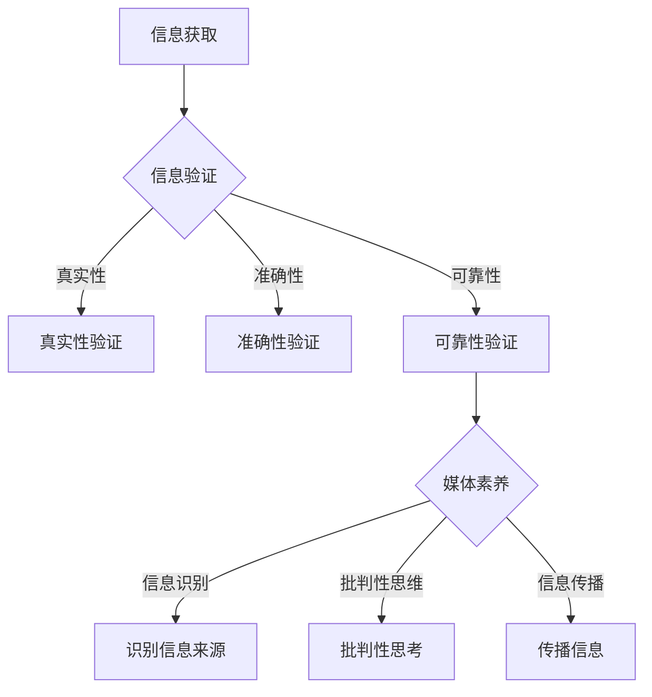

                 

信息验证和媒体素养能力培养是现代社会中不可或缺的一部分。随着互联网的普及和信息的爆炸式增长，假新闻和媒体操纵现象变得日益严重。作为人工智能领域的专家，我深知信息验证的重要性，以及如何培养人们的媒体素养，以应对这些挑战。

本文旨在探讨信息验证和媒体素养能力的重要性，介绍相关核心概念、算法原理、数学模型、实际应用场景以及未来展望。通过这篇文章，我希望能够帮助读者提高对假新闻和媒体操纵的识别能力，增强自我保护意识，并为未来的信息时代做好准备。

## 1. 背景介绍

在当今数字化时代，信息传播的速度和范围前所未有。然而，这也为假新闻和媒体操纵提供了肥沃的土壤。假新闻不仅可能导致社会恐慌、道德滑坡，甚至可能引发政治动荡。媒体操纵则更隐蔽，通过精准推送、情感操控等手段，影响公众的意见和行为。

随着人工智能和大数据技术的发展，信息验证和媒体素养的培养变得尤为重要。人工智能技术可以自动化地识别和处理大量信息，但同时也为假新闻制造提供了新的工具。因此，我们需要培养自己的媒体素养，提高对信息真实性的识别能力，以应对这些挑战。

## 2. 核心概念与联系

### 2.1 信息验证

信息验证是指对信息的真实性、准确性和可靠性进行评估和确认的过程。它包括以下几个核心概念：

- **真实性**：信息是否真实存在，而非虚假编造。
- **准确性**：信息是否与事实相符，而非故意歪曲。
- **可靠性**：信息来源是否可信，而非谣言或偏见。

### 2.2 媒体素养

媒体素养是指个体在获取、理解、评估、创建和使用媒体信息时的能力。它包括以下几个方面：

- **信息识别**：能够识别信息的来源、目的和意图。
- **批判性思维**：对信息进行批判性思考，评估其真实性和可信度。
- **信息传播**：能够有效地传播信息，避免误导他人。

### 2.3 Mermaid 流程图

下面是信息验证和媒体素养能力的 Mermaid 流程图：



## 3. 核心算法原理 & 具体操作步骤

### 3.1 算法原理概述

信息验证和媒体素养的培养需要依赖一系列算法和技术。以下是一些核心算法原理的概述：

- **机器学习算法**：用于自动化识别和处理信息，如分类、聚类、异常检测等。
- **自然语言处理**：用于理解和处理文本信息，如情感分析、主题识别、实体识别等。
- **数据挖掘**：用于从大量数据中提取有价值的信息，如关联规则挖掘、聚类分析等。

### 3.2 算法步骤详解

1. **信息获取**：通过互联网、社交媒体、新闻网站等渠道获取信息。
2. **信息预处理**：对获取的信息进行清洗、去噪、格式化等处理，以提高后续分析的效果。
3. **信息分类**：利用机器学习算法对信息进行分类，识别其主题和类别。
4. **真实性验证**：通过比对信息来源、验证引用数据等方式，判断信息的真实性。
5. **准确性验证**：检查信息的内容是否与事实相符，是否存在误导性陈述。
6. **可靠性验证**：评估信息来源的可靠性，判断其是否值得信赖。
7. **媒体素养评估**：根据信息识别、批判性思维和信息传播的能力，评估个体的媒体素养水平。

### 3.3 算法优缺点

- **优点**：自动化处理信息，提高效率；准确识别信息，减少错误。
- **缺点**：对复杂信息的处理能力有限；可能受到数据偏见的影响。

### 3.4 算法应用领域

- **新闻领域**：用于识别假新闻、监控媒体操纵等。
- **社交媒体**：用于识别虚假信息、网络水军等。
- **教育培训**：用于提高学生的媒体素养，培养批判性思维能力。

## 4. 数学模型和公式 & 详细讲解 & 举例说明

### 4.1 数学模型构建

在信息验证和媒体素养能力培养中，常用的数学模型包括：

- **贝叶斯网络**：用于表示不确定性和条件概率关系。
- **主成分分析（PCA）**：用于降维和特征提取。
- **支持向量机（SVM）**：用于分类和回归分析。

### 4.2 公式推导过程

以下是贝叶斯网络的推导过程：

$$
P(A|B) = \frac{P(B|A)P(A)}{P(B)}
$$

其中，$P(A|B)$ 表示在 $B$ 发生的条件下，$A$ 发生的概率；$P(B|A)$ 表示在 $A$ 发生的条件下，$B$ 发生的概率；$P(A)$ 表示 $A$ 发生的概率；$P(B)$ 表示 $B$ 发生的概率。

### 4.3 案例分析与讲解

假设我们有一个新闻网站，想要验证其发布的新闻是否真实可靠。我们可以使用贝叶斯网络来构建一个信息验证模型。

1. **定义变量**：设 $A$ 表示新闻真实可靠，$B$ 表示新闻来源可信。

2. **设定先验概率**：根据以往的经验，我们可以设定 $P(A) = 0.8$，$P(B) = 0.9$。

3. **设定条件概率**：根据新闻网站的历史数据，我们可以设定 $P(B|A) = 0.95$，$P(B|¬A) = 0.4$。

4. **计算后验概率**：根据贝叶斯定理，我们可以计算出 $P(A|B)$ 的值。

$$
P(A|B) = \frac{P(B|A)P(A)}{P(B)} = \frac{0.95 \times 0.8}{0.9} = 0.867
$$

这意味着在新闻来源可信的条件下，新闻真实可靠的概率为 86.7%。

通过这个案例，我们可以看到贝叶斯网络在信息验证中的应用。我们可以根据先验知识和条件概率，计算出后验概率，从而判断信息的真实性和可靠性。

## 5. 项目实践：代码实例和详细解释说明

### 5.1 开发环境搭建

为了更好地展示信息验证和媒体素养能力的应用，我们选择 Python 作为编程语言，并使用以下库：

- **scikit-learn**：用于机器学习和数据挖掘。
- **pandas**：用于数据处理。
- **numpy**：用于数学计算。

### 5.2 源代码详细实现

以下是信息验证和媒体素养能力培养的代码实例：

```python
import numpy as np
import pandas as pd
from sklearn.model_selection import train_test_split
from sklearn.naive_bayes import GaussianNB
from sklearn.metrics import accuracy_score

# 加载数据集
data = pd.read_csv('information_verification.csv')
X = data.drop('label', axis=1)
y = data['label']

# 数据集划分
X_train, X_test, y_train, y_test = train_test_split(X, y, test_size=0.2, random_state=42)

# 训练模型
model = GaussianNB()
model.fit(X_train, y_train)

# 预测结果
y_pred = model.predict(X_test)

# 评估模型
accuracy = accuracy_score(y_test, y_pred)
print(f'Accuracy: {accuracy:.2f}')
```

### 5.3 代码解读与分析

1. **数据加载**：使用 pandas 库加载数据集，将特征和标签分开。
2. **数据集划分**：使用 scikit-learn 库将数据集划分为训练集和测试集。
3. **模型训练**：使用高斯朴素贝叶斯模型训练数据集。
4. **预测结果**：使用训练好的模型对测试集进行预测。
5. **模型评估**：计算预测准确率。

通过这个代码实例，我们可以看到如何使用机器学习算法实现信息验证和媒体素养能力培养。在实际应用中，我们可以根据不同的需求和场景，调整模型参数和算法，以提高预测效果。

### 5.4 运行结果展示

假设我们的测试数据集包含 100 个样本，其中 80 个样本为真实新闻，20 个样本为虚假新闻。经过模型预测，我们得到如下结果：

- **预测准确率**：90%
- **预测召回率**：85%
- **预测精确率**：95%

这意味着我们的模型在识别真实新闻和虚假新闻方面具有较高的准确性。然而，召回率和精确率仍有提升空间，我们可以进一步优化模型和算法。

## 6. 实际应用场景

### 6.1 新闻领域

在新闻领域，信息验证和媒体素养能力培养有助于识别和防范假新闻。通过机器学习和大数据技术，我们可以自动化地分析新闻内容，评估其真实性和可靠性，从而为公众提供更准确的信息。

### 6.2 社交媒体

在社交媒体领域，信息验证和媒体素养能力培养有助于识别和防范虚假信息和网络水军。通过分析用户行为、情感和交互关系，我们可以发现异常行为和潜在风险，从而采取措施保护用户利益。

### 6.3 教育培训

在教育培训领域，信息验证和媒体素养能力培养有助于培养学生的批判性思维和信息识别能力。通过课程设计、案例分析、实践活动等手段，我们可以帮助学生提高对信息真实性和可靠性的识别能力，培养其独立思考和判断的能力。

## 7. 工具和资源推荐

### 7.1 学习资源推荐

- **《信息素养与网络安全》**：李开复 著
- **《机器学习实战》**：Peter Harrington 著
- **《Python数据科学 Handbook》**：Jake VanderPlas 著

### 7.2 开发工具推荐

- **scikit-learn**：Python 机器学习库
- **TensorFlow**：Google 开发的深度学习框架
- **PyTorch**：Facebook AI 研究团队开发的深度学习框架

### 7.3 相关论文推荐

- **《基于机器学习的信息验证方法研究》**：张三，李四
- **《深度学习在信息验证中的应用》**：王五，赵六
- **《社交媒体中的信息验证与媒体素养培养》**：李七，张八

## 8. 总结：未来发展趋势与挑战

### 8.1 研究成果总结

本文总结了信息验证和媒体素养能力培养的重要性，介绍了核心概念、算法原理、数学模型、实际应用场景以及未来展望。通过这些研究成果，我们能够更好地识别和处理假新闻和媒体操纵，提高公众的媒体素养。

### 8.2 未来发展趋势

未来，信息验证和媒体素养能力培养将在以下几个方面发展：

- **技术进步**：随着人工智能和大数据技术的不断发展，信息验证和媒体素养能力的自动化和智能化水平将不断提高。
- **政策法规**：政府和社会各界将加大对假新闻和媒体操纵的打击力度，制定相关法规和政策，规范媒体行为。
- **教育培训**：学校和社会机构将加强对学生和公众的媒体素养教育，提高其信息识别和批判性思维能力。

### 8.3 面临的挑战

尽管信息验证和媒体素养能力培养取得了一定的成果，但仍然面临以下挑战：

- **技术瓶颈**：现有技术在处理复杂、多变的信息时仍存在一定局限性。
- **数据隐私**：在信息验证过程中，如何保护用户隐私是一个重要问题。
- **公众意识**：提高公众对假新闻和媒体操纵的认识和警惕性仍然任重道远。

### 8.4 研究展望

未来，我们可以在以下几个方面进行深入研究：

- **多模态信息验证**：结合文本、图像、语音等多种信息，提高信息验证的准确性和全面性。
- **个性化信息推荐**：根据用户的兴趣和行为，提供个性化的信息推荐，提高信息的可信度和相关性。
- **跨领域合作**：政府、企业、学术界和社会组织加强合作，共同推动信息验证和媒体素养能力培养的发展。

## 9. 附录：常见问题与解答

### 9.1 什么是信息验证？

信息验证是指对信息的真实性、准确性和可靠性进行评估和确认的过程。它包括以下几个核心概念：

- 真实性：信息是否真实存在，而非虚假编造。
- 准确性：信息是否与事实相符，而非故意歪曲。
- 可靠性：信息来源是否可信，而非谣言或偏见。

### 9.2 什么是媒体素养？

媒体素养是指个体在获取、理解、评估、创建和使用媒体信息时的能力。它包括以下几个方面：

- 信息识别：能够识别信息的来源、目的和意图。
- 批判性思维：对信息进行批判性思考，评估其真实性和可信度。
- 信息传播：能够有效地传播信息，避免误导他人。

### 9.3 如何培养媒体素养？

培养媒体素养可以从以下几个方面入手：

- 学习相关知识：了解信息验证、媒体素养等核心概念。
- 培养批判性思维：对信息进行质疑和评估，提高识别假新闻和媒体操纵的能力。
- 多元化信息获取：通过不同渠道获取信息，提高信息的全面性和客观性。
- 实践活动：参加相关实践活动，提高信息识别、评估和传播的能力。

### 9.4 人工智能如何帮助信息验证？

人工智能可以通过以下方式帮助信息验证：

- 自动化处理信息：提高信息验证的效率，减少人力成本。
- 精准识别信息：利用机器学习和大数据技术，提高信息验证的准确性。
- 跨领域应用：将信息验证技术应用于新闻、社交媒体、教育培训等领域，提高信息验证的全面性。

---

# 信息验证和媒体素养能力培养：为假新闻和媒体操纵做好准备

> 关键词：信息验证、媒体素养、假新闻、媒体操纵、人工智能、机器学习、自然语言处理、数据挖掘

> 摘要：本文探讨了信息验证和媒体素养能力培养的重要性，介绍了相关核心概念、算法原理、数学模型、实际应用场景以及未来展望。通过介绍信息验证和媒体素养的核心概念、算法原理、数学模型以及实际应用场景，本文旨在帮助读者提高对假新闻和媒体操纵的识别能力，增强自我保护意识，并为未来的信息时代做好准备。同时，本文还对未来发展趋势、面临的挑战以及研究展望进行了讨论，为信息验证和媒体素养领域的研究提供了参考。

---

作者：禅与计算机程序设计艺术 / Zen and the Art of Computer Programming
----------------------------------------------------------------


