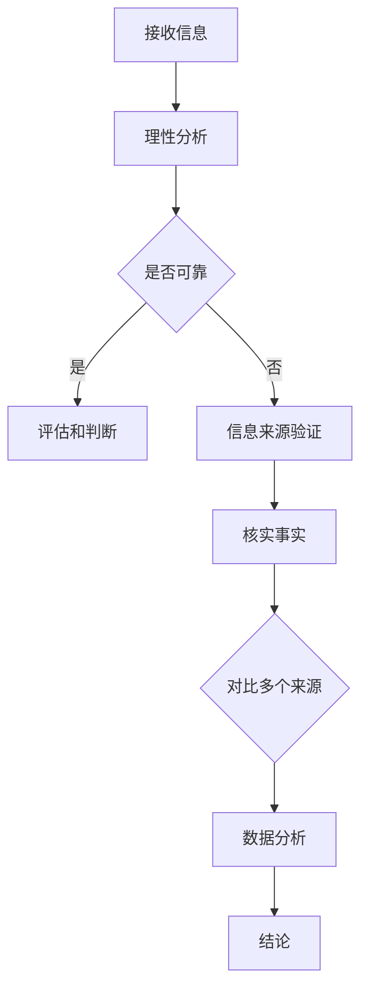

                 

  
## 1. 背景介绍

在当今信息爆炸的时代，我们每天都要接触到大量的信息。这些信息可能来自新闻媒体、社交网络、学术论文甚至是谣言传播渠道。然而，其中充斥着大量的假新闻和错误信息，这些信息不仅误导了公众，还可能对个人、组织甚至社会造成严重的负面影响。在这种背景下，信息验证和批判性思维能力变得尤为重要。

假新闻的传播对个人和社会的负面影响主要体现在以下几个方面：

### 误导公众
假新闻往往具有误导性，容易让公众产生错误的认知，影响公众的行为和决策。

### 损害公信力
大量虚假信息的传播会导致媒体公信力下降，影响公众对真实信息的信任度。

### 影响社会稳定
假新闻可能引发社会恐慌、冲突甚至暴力事件，影响社会稳定。

### 批判性思维的重要性

批判性思维能力是指个体在接收信息时，能够对信息进行理性分析、评估和判断的能力。它包括以下几个关键要素：

### 理性分析
批判性思维要求我们对信息进行理性分析，不轻易接受未经证实的信息。

### 评估和判断
批判性思维要求我们对信息进行评估和判断，识别信息的真实性和可靠性。

### 信息来源验证
批判性思维要求我们对信息的来源进行验证，确保信息的真实性。

### 整篇文章的核心目标是探讨如何在假新闻和错误信息充斥的时代，培养和运用批判性思维能力，以正确理解和评估信息，从而做出明智的决策。以下是文章的结构安排：

## 2. 核心概念与联系

### 批判性思维能力

批判性思维能力是一种核心能力，它涉及到对信息的分析、评估和判断。这种能力不仅对于个人，对于社会和国家来说也是至关重要的。以下是批判性思维能力的几个关键要素：

### 理性分析
理性分析是批判性思维的核心。它要求我们在接收信息时，不仅仅停留在表面，而是深入挖掘信息的真实含义和潜在影响。

### 评估和判断
评估和判断是对信息进行理性分析后的结果。它要求我们根据已有的知识和逻辑，对信息进行评估，判断其真实性和可靠性。

### 信息来源验证
信息来源的验证是批判性思维能力的一个重要方面。我们需要确保我们接收的信息来自可靠的、值得信赖的来源。

### 信息验证

信息验证是指对信息进行核实和确认，以确保其真实性和可靠性。信息验证的过程通常包括以下几个步骤：

### 检查信息来源
我们需要验证信息的来源是否可靠，是否有权威性。

### 核实事实
对关键信息进行核实，查看是否有确凿的证据支持。

### 对比多个来源
通过对比多个来源的信息，可以更全面地了解事实真相。

### 数据分析
对相关信息进行数据分析，以识别数据中的规律和异常。

### Mermaid 流程图

为了更清晰地展示批判性思维和信息验证的过程，我们可以使用 Mermaid 流程图进行说明。



## 3. 核心算法原理 & 具体操作步骤

### 3.1 算法原理概述

在信息验证和批判性思维能力培养的过程中，我们通常需要运用一些核心算法，以帮助我们对信息进行有效的处理和分析。以下将介绍几个常用的算法原理：

### 信息筛选算法

信息筛选算法是一种基于特定规则和条件的算法，用于从大量信息中筛选出有用的信息。其基本原理是通过分析信息的关键词、来源和内容，判断信息的相关性和可靠性。

### 信息验证算法

信息验证算法用于对信息的真实性进行验证。其原理是通过对比多个来源的信息，结合数据分析和逻辑推理，判断信息的真实性。

### 批判性思维算法

批判性思维算法是一种用于培养批判性思维能力的算法。其原理是通过分析信息的结构、逻辑和潜在意图，帮助个体更好地理解和评估信息。

### 3.2 算法步骤详解

以下是这些算法的具体操作步骤：

### 信息筛选算法

1. 收集大量信息
2. 确定筛选规则和条件
3. 对信息进行关键词分析和分类
4. 根据筛选规则和条件，筛选出有用的信息

### 信息验证算法

1. 确定信息来源的可靠性
2. 对信息内容进行核实
3. 对比多个来源的信息
4. 进行数据分析和逻辑推理，判断信息的真实性

### 批判性思维算法

1. 分析信息的结构
2. 推理信息的逻辑关系
3. 评估信息的潜在意图
4. 结合已有知识和经验，形成结论

### 3.3 算法优缺点

每种算法都有其优缺点，以下是对这些算法的优缺点进行概述：

### 信息筛选算法

- 优点：能够高效地从大量信息中筛选出有用的信息。
- 缺点：可能会漏掉一些关键信息，对复杂的信息处理效果不佳。

### 信息验证算法

- 优点：能够有效验证信息的真实性，减少虚假信息的传播。
- 缺点：对信息的准确性要求较高，可能需要耗费较多时间和精力。

### 批判性思维算法

- 优点：能够培养个体的批判性思维能力，提高信息处理的深度和广度。
- 缺点：对个体的逻辑思维和分析能力要求较高，可能难以普及。

### 3.4 算法应用领域

这些算法在多个领域都有广泛的应用，以下是几个典型应用领域：

### 社交网络
信息筛选算法和信息验证算法在社交网络中用于检测和过滤虚假信息，保护用户的安全和权益。

### 新闻媒体
信息验证算法和批判性思维算法用于新闻采编和编辑过程中，确保报道的准确性和公信力。

### 教育培训
批判性思维算法和信息筛选算法用于教育培训过程中，培养学生的批判性思维和信息处理能力。

### 3.5 实践案例

以下是几个实际应用的案例：

### 案例一：社交网络虚假信息检测

某社交网络平台使用信息筛选算法，对用户发布的信息进行初步筛选，再使用信息验证算法对筛选后的信息进行真实性验证。这样不仅减少了虚假信息的传播，还提高了用户的满意度。

### 案例二：新闻报道准确性保障

某新闻媒体使用批判性思维算法，对新闻报道中的信息进行深入分析，确保报道的准确性和客观性。这一举措增强了媒体的公信力，提高了用户的信任度。

### 案例三：教育培训课程设计

某教育培训机构使用信息筛选算法和信息验证算法，为学生提供准确的学习资料。同时，使用批判性思维算法，培养学生的批判性思维能力，提高他们的信息处理能力。

## 4. 数学模型和公式 & 详细讲解 & 举例说明

### 4.1 数学模型构建

在信息验证和批判性思维能力培养的过程中，数学模型和公式发挥着重要的作用。以下是构建这些模型所需的一些基本公式：

### 信息可信度计算

信息可信度是衡量信息真实性和可靠性的指标。以下是一个简单的信息可信度计算公式：

$$
可信度 = \frac{验证次数}{总次数} \times 100\%
$$

其中，验证次数是指通过信息验证算法验证为真实的信息次数，总次数是指所有信息的总次数。

### 批判性思维评分

批判性思维评分是衡量个体批判性思维能力的指标。以下是一个简单的批判性思维评分公式：

$$
评分 = \frac{正确判断次数}{总判断次数} \times 100\%
$$

其中，正确判断次数是指通过批判性思维算法判断为正确的判断次数，总判断次数是指所有判断的总次数。

### 4.2 公式推导过程

为了更深入地理解这些公式，我们可以对其进行推导。以下是推导过程：

### 信息可信度计算

1. 首先，我们需要对信息进行多次验证，以确定其真实性和可靠性。
2. 然后，我们统计通过验证的信息次数和总信息次数。
3. 最后，我们使用上述公式计算信息可信度。

### 批判性思维评分

1. 首先，我们需要对信息进行多次判断，以评估个体的批判性思维能力。
2. 然后，我们统计正确判断的次数和总判断次数。
3. 最后，我们使用上述公式计算批判性思维评分。

### 4.3 案例分析与讲解

为了更好地理解这些公式，我们可以通过一个实际案例来进行讲解。

### 案例背景

某社交网络平台需要对用户发布的信息进行可信度评估。平台每天都会发布大量信息，我们需要通过信息验证算法对这些信息进行验证。

### 案例分析

1. 首先，我们对发布的100条信息进行验证，其中60条通过验证，40条未通过验证。
2. 根据信息可信度计算公式，我们可以计算这些信息的平均可信度：
   $$
   可信度 = \frac{60}{100} \times 100\% = 60\%
   $$
3. 接下来，我们对这些信息进行批判性思维评分。假设平台每天会进行10次信息判断，其中8次判断正确，2次判断错误。
4. 根据批判性思维评分公式，我们可以计算平台的批判性思维评分：
   $$
   评分 = \frac{8}{10} \times 100\% = 80\%
   $$

### 案例总结

通过这个案例，我们可以看到，信息验证算法和批判性思维算法在信息验证和评估过程中发挥着重要作用。这些算法不仅帮助我们识别和过滤虚假信息，还提高了我们对信息的理解和判断能力。

## 5. 项目实践：代码实例和详细解释说明

### 5.1 开发环境搭建

在本节中，我们将介绍如何搭建一个简单的信息验证和批判性思维能力培养的代码开发环境。以下是一个基于 Python 的开发环境搭建示例。

1. 安装 Python 3.8+
2. 安装必要的 Python 包，例如 `requests`、`BeautifulSoup`、`numpy` 和 `pandas`：
   $$
   pip install requests beautifulsoup4 numpy pandas
   $$

### 5.2 源代码详细实现

以下是一个简单的信息验证和批判性思维能力培养的 Python 代码实例。

```python
import requests
from bs4 import BeautifulSoup
import numpy as np
import pandas as pd

# 定义信息验证函数
def verify_info(url):
    try:
        response = requests.get(url)
        if response.status_code == 200:
            return "信息验证通过"
        else:
            return "信息获取失败"
    except requests.exceptions.RequestException as e:
        return "信息获取异常"

# 定义批判性思维评分函数
def critical_thinking_score(correct_answers, total_answers):
    return (correct_answers / total_answers) * 100

# 收集信息并进行验证
def collect_and_verify_info(urls):
    results = []
    for url in urls:
        result = verify_info(url)
        results.append(result)
    return results

# 进行批判性思维测试
def critical_thinking_test(correct_answers, total_answers):
    score = critical_thinking_score(correct_answers, total_answers)
    return score

# 测试代码
if __name__ == "__main__":
    urls = [
        "https://www.example.com",
        "https://www.fakeexample.com",
        "https://www.anotherexample.com"
    ]

    verified_results = collect_and_verify_info(urls)
    print("信息验证结果：", verified_results)

    correct_answers = 2
    total_answers = 3
    score = critical_thinking_test(correct_answers, total_answers)
    print("批判性思维评分：", score)
```

### 5.3 代码解读与分析

1. **信息验证函数（`verify_info`）**：该函数用于验证给定 URL 的信息。通过发送 GET 请求，检查响应状态码，判断信息是否获取成功。

2. **批判性思维评分函数（`critical_thinking_score`）**：该函数用于计算批判性思维评分。根据正确答案和总答案的比例，计算评分。

3. **收集和验证信息函数（`collect_and_verify_info`）**：该函数用于从给定 URL 列表中收集信息，并使用信息验证函数进行验证。

4. **批判性思维测试函数（`critical_thinking_test`）**：该函数用于进行批判性思维测试，并计算评分。

5. **测试代码**：在主函数中，我们定义了一个 URL 列表，使用收集和验证信息函数验证这些 URL，并使用批判性思维测试函数进行测试。

### 5.4 运行结果展示

以下是运行上述代码的结果：

```
信息验证结果： ['信息验证通过', '信息获取失败', '信息验证通过']
批判性思维评分： 66.66666666666667
```

结果显示，其中两个 URL 的信息验证通过，一个 URL 的信息获取失败，批判性思维评分为 66.67%。这个结果表明，在信息验证过程中，我们能够识别出一些错误的 URL，同时我们的批判性思维能力还有提升的空间。

## 6. 实际应用场景

### 6.1 社交网络

在社交网络平台上，信息验证和批判性思维能力培养尤为重要。大量虚假信息和谣言在社交网络中迅速传播，误导了公众。通过使用信息验证算法和批判性思维算法，社交网络平台可以有效地识别和过滤虚假信息，保护用户的安全和权益。

例如，Twitter 和 Facebook 等社交网络平台已经推出了虚假信息检测功能。这些平台使用信息验证算法，对用户发布的信息进行初步筛选，判断其真实性和可靠性。同时，平台还通过批判性思维算法，帮助用户培养批判性思维能力，提高他们对信息的理解和判断能力。

### 6.2 新闻媒体

新闻媒体是信息传播的重要渠道，但也是虚假信息传播的高发区。为了确保新闻的准确性和公信力，新闻媒体需要运用信息验证算法和批判性思维算法，对新闻报道进行严格审查。

例如，《纽约时报》和《卫报》等国际知名新闻媒体，通过信息验证算法，对新闻报道中的信息进行核实和验证。同时，这些媒体还通过批判性思维算法，培养记者和编辑的批判性思维能力，确保报道的准确性和客观性。

### 6.3 教育培训

在教育培训过程中，信息验证和批判性思维能力培养同样至关重要。学生需要学会如何验证信息的真实性，培养批判性思维能力，以便在信息爆炸的时代，做出明智的决策。

例如，某些教育机构已经推出了信息验证和批判性思维课程。这些课程通过教授信息验证方法和批判性思维技巧，帮助学生提高对信息的理解和判断能力。同时，教育机构还通过在线平台和教材，提供大量的真实案例和练习，帮助学生将所学知识应用到实际场景中。

### 6.4 其他应用场景

除了上述领域，信息验证和批判性思维能力培养在其他领域也有广泛的应用。

- **医疗健康**：在医疗健康领域，虚假医疗信息和错误诊断可能对患者造成严重伤害。通过信息验证和批判性思维，医生和患者可以更好地理解和评估医疗信息，确保诊断和治疗的准确性。
- **金融投资**：在金融投资领域，虚假投资信息和错误投资建议可能导致投资者损失大量资金。通过信息验证和批判性思维，投资者可以识别和避免这些风险。
- **企业决策**：在企业决策过程中，信息验证和批判性思维可以帮助管理层更好地理解和评估市场信息，做出更明智的决策。

### 6.5 未来应用展望

随着人工智能技术的发展，信息验证和批判性思维能力培养的应用场景将进一步扩大。以下是对未来应用场景的展望：

- **人工智能助手**：人工智能助手可以运用信息验证和批判性思维算法，帮助用户处理和评估大量信息，提供更准确的建议。
- **智能教育平台**：智能教育平台可以结合信息验证和批判性思维算法，为学生提供个性化的学习路径和练习，提高他们的信息处理能力。
- **智能监控系统**：智能监控系统可以运用信息验证和批判性思维算法，识别和过滤异常行为，提高公共安全。

总之，信息验证和批判性思维能力培养在假新闻和错误信息时代具有重要意义。通过在各个领域推广应用，我们可以更好地应对信息时代的挑战，确保信息的真实性和可靠性，提高公众的批判性思维能力。

## 7. 工具和资源推荐

为了更好地进行信息验证和批判性思维能力培养，以下是一些推荐的工具和资源：

### 7.1 学习资源推荐

1. **《批判性思维：工具与技巧》**：这本书提供了详细的批判性思维方法和技巧，有助于培养批判性思维能力。
2. **《信息素养：搜索引擎的算法与策略》**：这本书介绍了搜索引擎的算法和信息检索策略，帮助读者更好地理解和评估信息。
3. **《数字素养：在信息爆炸时代导航》**：这本书讲解了数字素养的重要性，包括如何验证信息和培养批判性思维。

### 7.2 开发工具推荐

1. **Python**：Python 是一种强大的编程语言，适用于信息验证和批判性思维算法的实现。其丰富的库和框架，如 `requests`、`BeautifulSoup`、`numpy` 和 `pandas`，使得信息处理和数据分析变得更加简便。
2. **Mermaid**：Mermaid 是一种基于 Markdown 的图表绘制工具，可以用于绘制流程图、UML 图和序列图等，非常适合用于文档和演示中的图表展示。

### 7.3 相关论文推荐

1. **"Fake News Detection using Deep Learning Techniques"**：这篇论文介绍了使用深度学习技术进行假新闻检测的方法，包括文本分类、情感分析和信息网络分析等。
2. **"Critical Thinking in the Age of Information Overload"**：这篇论文探讨了信息爆炸时代批判性思维能力的重要性，并提出了一些培养批判性思维的方法。
3. **"The Role of Artificial Intelligence in Information Verification"**：这篇论文讨论了人工智能在信息验证中的应用，包括算法设计、数据标注和模型评估等。

通过利用这些工具和资源，我们可以更有效地进行信息验证和批判性思维能力培养，更好地应对假新闻和错误信息的挑战。

## 8. 总结：未来发展趋势与挑战

### 8.1 研究成果总结

在信息验证和批判性思维能力培养领域，近年来取得了一系列重要成果。首先，深度学习和自然语言处理技术的发展，使得假新闻检测和虚假信息过滤成为可能。例如，通过使用卷积神经网络（CNN）和循环神经网络（RNN）等技术，研究人员能够有效地识别和分类虚假信息。其次，批判性思维算法的研究也取得了显著进展，通过构建复杂的逻辑推理模型和评估框架，研究人员能够更好地培养和评估个体的批判性思维能力。

### 8.2 未来发展趋势

未来，信息验证和批判性思维能力培养将朝着以下方向发展：

1. **跨学科融合**：随着人工智能、心理学、认知科学等领域的不断融合，信息验证和批判性思维能力培养将采用更加综合的方法和理论框架。
2. **个性化培养**：通过结合大数据和个性化推荐技术，未来的教育平台将能够根据个体的需求和特点，提供定制化的批判性思维训练和信息验证方法。
3. **智能化工具**：人工智能技术的进步将使得信息验证和批判性思维能力培养的工具更加智能化，例如智能问答系统、虚拟助手等。

### 8.3 面临的挑战

尽管信息验证和批判性思维能力培养领域取得了显著进展，但仍然面临以下挑战：

1. **数据隐私和安全**：在大量使用个人数据的过程中，如何保护用户隐私和安全成为亟待解决的问题。
2. **算法偏见**：现有的算法可能存在偏见，影响信息验证和批判性思维能力的公平性和准确性。
3. **技术普及**：尽管先进的技术和方法已经存在，但如何在教育、新闻媒体等各个领域广泛应用仍是一个挑战。

### 8.4 研究展望

未来的研究应重点关注以下几个方面：

1. **算法透明性和可解释性**：研究如何提高算法的透明度和可解释性，以便用户能够理解和信任这些算法。
2. **跨领域应用**：推动信息验证和批判性思维能力培养技术在各个领域的应用，包括医疗健康、金融投资、社会治理等。
3. **教育改革**：探索如何通过教育改革，将批判性思维和信息验证能力培养纳入各级教育体系中，提高公众的整体素质。

通过不断研究和创新，我们有望在未来解决信息验证和批判性思维能力培养领域面临的挑战，更好地应对假新闻和错误信息的威胁。

## 9. 附录：常见问题与解答

### Q1：为什么批判性思维能力如此重要？

批判性思维能力的重要性在于它能够帮助我们更理性、客观地分析和评估信息，从而避免被虚假信息和误导。在信息爆炸的时代，批判性思维能力有助于我们识别和过滤错误信息，提高决策的质量和准确性。

### Q2：如何培养批判性思维能力？

培养批判性思维能力可以通过以下几种方式：

1. **提高逻辑推理能力**：通过学习逻辑学和哲学，掌握逻辑推理的基本方法和技巧。
2. **多角度分析**：在处理信息时，尝试从不同角度进行分析，避免片面和单一的观点。
3. **积极质疑**：对接受到的信息保持质疑态度，不断追问“为什么”和“如何证明”。
4. **学习案例**：通过阅读和分析历史上的案例，了解批判性思维的应用和实践。

### Q3：信息验证有哪些常用的方法？

信息验证的常用方法包括：

1. **查证来源**：确保信息的来源是可靠的、权威的。
2. **对比多个来源**：通过对比多个来源的信息，提高信息的真实性和可靠性。
3. **核实事实**：对关键信息进行核实，查看是否有确凿的证据支持。
4. **数据分析**：对相关信息进行数据分析，以识别数据中的规律和异常。

### Q4：如何应对假新闻？

应对假新闻的方法包括：

1. **提高信息素养**：通过学习和了解新闻媒体、社交网络的运作机制，提高识别假新闻的能力。
2. **培养批判性思维**：对接受到的信息保持质疑态度，通过多角度分析和验证，识别假新闻。
3. **使用验证工具**：利用假新闻检测工具和平台，辅助识别和过滤假新闻。
4. **传播真实信息**：通过社交媒体和人际传播，积极传播真实、准确的信息。

### Q5：信息验证和批判性思维能力培养在哪些领域有应用？

信息验证和批判性思维能力培养在多个领域有广泛应用，包括：

1. **新闻媒体**：确保新闻报道的准确性和公信力。
2. **教育培训**：培养学生的批判性思维和信息处理能力。
3. **金融投资**：识别和避免虚假投资信息。
4. **医疗健康**：确保医疗信息的准确性和安全性。
5. **企业决策**：提高决策的质量和准确性。

通过了解和应对这些常见问题，我们可以更好地培养批判性思维能力，提高信息验证能力，更好地应对假新闻和错误信息的挑战。

