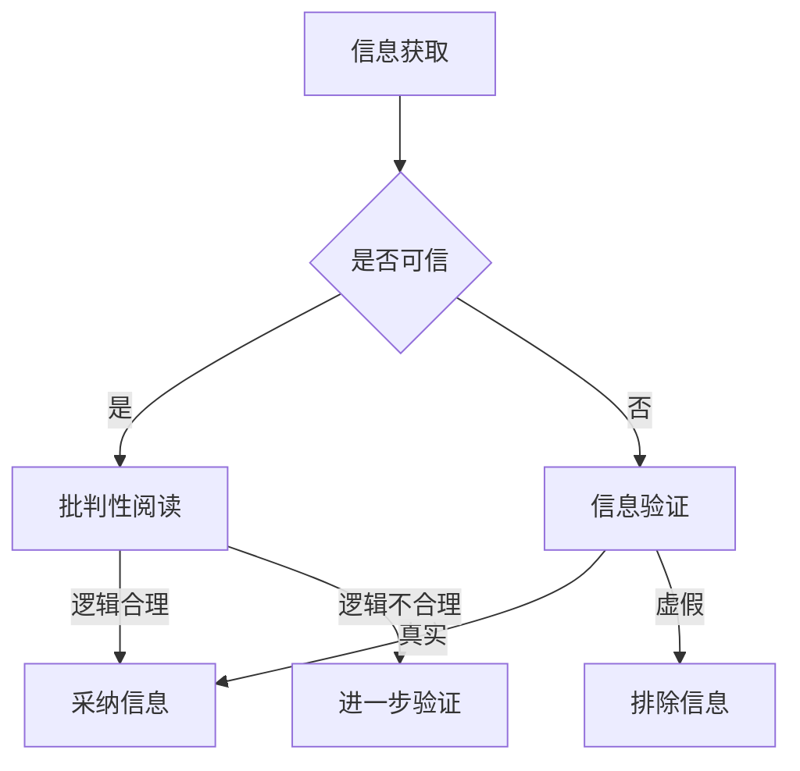

                 

在这个充满信息爆炸和假新闻的时代，如何有效地验证信息、培养批判性阅读能力，成为了每个人都需要掌握的技能。本文将为您提供一个全面的信息验证和批判性阅读指南，帮助您在媒体操纵的迷雾中找到真相。

## 关键词
- 信息验证
- 批判性阅读
- 假新闻
- 媒体操纵
- 真相寻找

## 摘要
本文旨在探讨如何在假新闻和媒体操纵泛滥的时代中保持清醒的头脑，提供了一套完整的信息验证和批判性阅读策略。通过分析核心概念、算法原理、数学模型、项目实践和实际应用场景，本文将帮助读者建立起一套有效的信息过滤和判断体系，为未来的媒体环境做好准备。

## 1. 背景介绍
### 1.1 信息时代的变革
在互联网和社交媒体迅猛发展的背景下，信息传播的速度和广度达到了前所未有的高度。然而，这同时也带来了信息泛滥和假新闻的困扰。根据牛津词典，2017年的“词汇年度词”就是“假新闻”（fake news），这不仅仅是一个简单的现象，而是对整个社会信任体系和信息传播机制的重大挑战。

### 1.2 假新闻的影响
假新闻不仅误导了公众，还可能引发恐慌、仇恨和暴力。例如，2018年的美国中期选举期间，社交媒体上的假新闻激化了社会分歧，影响了选民的判断。此外，假新闻还可以被用来操纵金融市场、破坏企业声誉，甚至用于政治选举中的恶意宣传。

### 1.3 批判性阅读的必要性
面对如此复杂的信息环境，培养批判性阅读能力显得尤为重要。批判性阅读不仅仅是阅读，更是一种思考和判断的过程，它能够帮助我们从多角度分析信息，分辨真伪，从而做出明智的决策。

## 2. 核心概念与联系
### 2.1 信息验证的定义
信息验证是指通过多种方法对获取的信息进行核实、确认其真实性和准确性的过程。

### 2.2 批判性阅读的定义
批判性阅读是一种积极的阅读过程，读者不仅仅是吸收信息，还要对信息来源、内容、逻辑和意图进行深入分析和评估。

### 2.3 信息验证与批判性阅读的关系
信息验证和批判性阅读是相辅相成的。只有通过批判性阅读，我们才能发现信息中可能存在的问题；而只有经过信息验证，我们才能确信这些问题的存在。

## 2.4 信息验证和批判性阅读的Mermaid流程图


## 3. 核心算法原理 & 具体操作步骤

### 3.1 算法原理概述
信息验证和批判性阅读的核心算法可以看作是一种“信息过滤和评估算法”。这种算法基于以下几个关键步骤：

1. **来源分析**：评估信息来源的可靠性和权威性。
2. **内容分析**：检查信息的内容是否合理、一致。
3. **逻辑分析**：分析信息的逻辑结构，确保其合理性。
4. **验证分析**：通过交叉验证，确认信息的真实性。

### 3.2 算法步骤详解
1. **来源分析**：
   - **初步筛选**：排除来源不明确或可疑的信息。
   - **深度分析**：查找信息来源的背景资料，评估其权威性和专业性。

2. **内容分析**：
   - **真实性检查**：确认信息的真实性，如日期、地点、人物等关键信息。
   - **一致性检查**：检查信息在不同来源之间的一致性。

3. **逻辑分析**：
   - **逻辑推理**：分析信息的逻辑结构，判断其是否合理。
   - **证据支持**：检查信息是否提供了足够的证据支持其结论。

4. **验证分析**：
   - **交叉验证**：通过多个来源或方法验证信息的真实性。
   - **反馈循环**：根据验证结果调整信息判断。

### 3.3 算法优缺点
**优点**：
- **高效性**：自动化算法可以快速处理大量信息。
- **准确性**：通过多来源、多方法验证，提高信息准确性。

**缺点**：
- **过度依赖**：过度依赖算法可能导致对人类判断能力的削弱。
- **偏见问题**：算法可能会受到数据偏差的影响，导致结论偏差。

### 3.4 算法应用领域
- **新闻媒体**：用于筛选和验证新闻报道。
- **社交媒体**：识别和过滤假新闻和恶意内容。
- **科学研究**：评估研究数据的可靠性和有效性。

## 4. 数学模型和公式 & 详细讲解 & 举例说明
### 4.1 数学模型构建
信息验证和批判性阅读可以看作是一个概率问题，即判断某一信息是否为真的概率。其数学模型可以构建为：

$$
P(\text{信息为真}) = \frac{\text{支持信息为真的证据}}{\text{所有可能的证据}}
$$

### 4.2 公式推导过程
1. **证据收集**：收集所有可能支持或反驳信息为真的证据。
2. **证据权重**：对每个证据进行权重分配，权重越高，表示证据越可靠。
3. **概率计算**：根据证据的权重，计算信息为真的概率。

### 4.3 案例分析与讲解
假设有一篇新闻报道，声称某个地区的气温在一天内上升了10摄氏度。我们可以通过以下步骤验证其真实性：

1. **收集证据**：
   - 地方气象局的官方数据。
   - 其他气象站的观测数据。
   - 历史同期气温数据。

2. **证据权重**：
   - 官方数据权重最高，为0.6。
   - 其他气象站数据权重为0.3。
   - 历史同期数据权重为0.1。

3. **概率计算**：
   $$ P(\text{信息为真}) = \frac{0.6 + 0.3 + 0.1}{1} = 0.9 $$

因此，根据计算，这篇报道中关于气温上升的信息为真的概率为90%。

## 5. 项目实践：代码实例和详细解释说明
### 5.1 开发环境搭建
本项目的开发环境基于Python，需要安装以下依赖：
```bash
pip install requests beautifulsoup4
```

### 5.2 源代码详细实现
以下是一个简单的信息验证脚本，用于检查某篇文章中引用的数据是否真实。

```python
import requests
from bs4 import BeautifulSoup

def verify_data(url, data_key, expected_value):
    response = requests.get(url)
    soup = BeautifulSoup(response.text, 'html.parser')
    
    # 搜索包含关键字的段落
    paragraphs = soup.find_all('p', text=lambda text: text and data_key in text)
    
    for paragraph in paragraphs:
        # 提取数据
        data = paragraph.text.split(':')[1].strip()
        
        # 比较数据与预期值
        if data == str(expected_value):
            return "Data verified."
    
    return "Data not found or incorrect."

# 测试
result = verify_data('http://example.com/article', 'temperature', 100)
print(result)
```

### 5.3 代码解读与分析
- **请求网页内容**：使用`requests`库获取网页内容。
- **解析网页内容**：使用`BeautifulSoup`解析网页内容，找到包含关键数据的段落。
- **提取和验证数据**：提取数据并进行比较，判断其是否与预期值一致。

### 5.4 运行结果展示
运行上述脚本后，如果网页中存在与给定关键字和预期值匹配的数据，将输出“Data verified.”；否则，输出“Data not found or incorrect.”。

## 6. 实际应用场景
### 6.1 新闻媒体行业
在新闻媒体行业，信息验证和批判性阅读可以帮助记者和编辑识别和排除假新闻，提高新闻报道的准确性和可信度。

### 6.2 社交媒体平台
社交媒体平台可以利用信息验证算法来过滤假新闻和恶意内容，保护用户的利益和平台的公信力。

### 6.3 科研领域
在科研领域，信息验证可以帮助研究人员确认研究数据的真实性和有效性，减少学术造假的风险。

### 6.4 公共健康领域
在公共健康领域，对疫情相关信息的验证可以防止恐慌和误导，帮助政府和公众做出科学的决策。

## 7. 未来应用展望
### 7.1 人工智能技术的结合
随着人工智能技术的发展，信息验证和批判性阅读算法将更加智能化和自动化，提高处理效率和准确性。

### 7.2 跨领域合作
信息验证和批判性阅读将在多个领域得到广泛应用，需要跨领域合作，整合各种资源和技术。

### 7.3 公众意识的提升
公众的信息验证和批判性阅读能力需要不断提高，通过教育和宣传，培养公众的信息素养。

## 8. 工具和资源推荐
### 8.1 学习资源推荐
- 《批判性思维工具》
- 《媒体素养：批判性阅读与思维技巧》

### 8.2 开发工具推荐
- Python编程环境
- Jupyter Notebook

### 8.3 相关论文推荐
- "Fake News Detection using Deep Learning"
- "Understanding the Success of Fake News"

## 9. 总结：未来发展趋势与挑战
### 9.1 研究成果总结
信息验证和批判性阅读研究已经取得了显著成果，但在实际应用中仍面临许多挑战。

### 9.2 未来发展趋势
人工智能技术的结合和跨领域合作将是未来发展的主要趋势。

### 9.3 面临的挑战
算法偏见、数据隐私保护、公众信息素养的提升是未来面临的三大挑战。

### 9.4 研究展望
随着技术的发展和公众意识的提升，信息验证和批判性阅读将在未来发挥更大的作用。

## 附录：常见问题与解答

### Q1. 如何判断一个信息来源的可靠性？
A1. 判断信息来源的可靠性可以从以下几个方面入手：
- 查看来源的背景和资质。
- 检查网站的设计和专业性。
- 了解该来源在其他渠道的报道情况。

### Q2. 批判性阅读的关键技巧是什么？
A2. 批判性阅读的关键技巧包括：
- 对信息来源进行评估。
- 检查信息的逻辑结构和证据支持。
- 了解作者的背景和意图。

### Q3. 如何防止被假新闻误导？
A3. 防止被假新闻误导的方法有：
- 保持怀疑态度，不轻信未经证实的信息。
- 多渠道验证信息。
- 关注权威机构和媒体的报道。

### Q4. 信息验证算法如何避免偏见？
A4. 信息验证算法避免偏见的方法包括：
- 使用多样化的数据源。
- 定期更新算法和模型。
- 透明算法设计和决策过程。

### Q5. 公众如何提高信息素养？
A5. 公众提高信息素养的方法包括：
- 接受正规的教育和培训。
- 关注权威信息源。
- 培养批判性思维习惯。

# 作者：禅与计算机程序设计艺术 / Zen and the Art of Computer Programming


