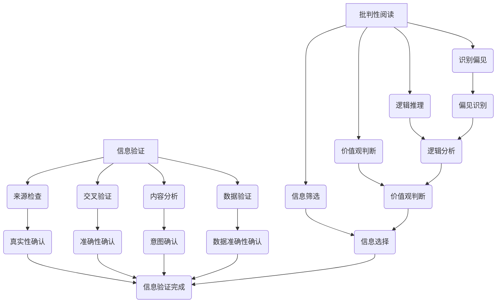

                 

在当今数字化时代，信息爆炸带来了前所未有的便利，但同时也给人们带来了信息过载和真假难辨的问题。假新闻、虚假信息和媒体操纵现象层出不穷，这不仅对社会稳定造成了威胁，也对个体的认知和判断产生了深远的影响。作为一名世界级人工智能专家，我有责任和义务帮助大众掌握信息验证和批判性阅读的方法，从而在这个复杂的信息环境中导航。

> 关键词：假新闻，媒体操纵，信息验证，批判性阅读，数字化时代，人工智能

> 摘要：本文将深入探讨假新闻和媒体操纵的问题，阐述信息验证和批判性阅读的重要性。通过分析核心概念、算法原理、数学模型、实际应用以及未来展望，本文旨在为读者提供一套有效的信息导航指南，帮助大家在这个信息泛滥的时代保持清醒的头脑和正确的价值观。

## 1. 背景介绍

随着互联网的普及和移动设备的广泛应用，信息传播的速度和范围得到了前所未有的提升。然而，这种快速传播的信息并不总是准确的，甚至可能是不真实的。假新闻（Fake News）一词起源于2016年的美国总统选举期间，指的是那些有意为之、制造或散布的不真实或误导性信息。这类信息往往通过社交媒体、邮件链和即时通讯等渠道迅速传播，造成广泛的社会影响。

媒体操纵（Media Manipulation）则是指通过控制、操纵或干预信息传播的过程，以达到某种特定目的的行为。这包括但不限于政治宣传、商业广告、社会运动等。媒体操纵利用了人们对信息的信任和依赖，通过虚假信息的传播来影响公众的观点和行为。

假新闻和媒体操纵对社会的危害不可低估。它们不仅误导公众，导致社会不稳定，还可能引发政治动荡、经济危机等严重后果。例如，2016年美国总统选举期间的假新闻被指控影响了选举结果；近年来，一些国家的政治运动和社会动荡也受到了虚假信息和媒体操纵的影响。

## 2. 核心概念与联系

为了更好地理解信息验证和批判性阅读的重要性，我们需要首先明确几个核心概念：

### 2.1 信息验证

信息验证是指通过一系列方法对信息进行核实、确认和评估，以确定其真实性和可信度。信息验证的过程包括以下几个方面：

1. **来源检查**：验证信息的来源是否可靠，如官方网站、权威媒体、专家观点等。
2. **交叉验证**：通过多个来源对同一信息进行核实，以确认其准确性。
3. **内容分析**：对信息的真实性、意图、动机等进行深入分析。
4. **数据验证**：使用数据分析方法对信息中的数据或统计数据进行分析和验证。

### 2.2 批判性阅读

批判性阅读是指读者在阅读过程中，不仅仅是被动的接受信息，而是积极主动地对信息进行评估、分析和反思。批判性阅读的能力是现代社会中不可或缺的，它包括以下几个方面：

1. **识别偏见**：识别信息中的偏见、误导和有意制造的假信息。
2. **逻辑推理**：运用逻辑推理分析信息的合理性和可信度。
3. **价值观判断**：对信息的价值观进行判断，是否符合社会道德和法律标准。
4. **信息筛选**：根据自身需求和价值观对信息进行筛选和选择。

### 2.3 信息验证与批判性阅读的联系

信息验证和批判性阅读是相辅相成的。信息验证为批判性阅读提供了真实、准确的信息基础，而批判性阅读则是对这些信息进行深度分析和判断的能力。只有通过信息验证和批判性阅读的结合，我们才能在复杂的信息环境中辨别真假、保持清晰的头脑。

### 2.4 Mermaid 流程图

以下是关于信息验证和批判性阅读的 Mermaid 流程图，用于展示核心概念和它们之间的联系：



## 3. 核心算法原理 & 具体操作步骤

### 3.1 算法原理概述

在信息验证和批判性阅读中，算法扮演着重要的角色。核心算法通常包括以下几种：

1. **机器学习算法**：用于识别模式、分类和预测。例如，可以使用朴素贝叶斯分类器、支持向量机（SVM）等算法来检测假新闻和媒体操纵。
2. **自然语言处理（NLP）算法**：用于分析文本、理解语义和情感。例如，可以使用词嵌入、情感分析等算法来识别信息的真实性和意图。
3. **数据挖掘算法**：用于从大量数据中发现有价值的信息和模式。例如，可以使用关联规则学习、聚类分析等算法来发现虚假信息的传播路径。

### 3.2 算法步骤详解

以下是信息验证和批判性阅读的核心算法步骤：

#### 3.2.1 数据收集

首先，需要收集大量的信息，包括新闻文章、社交媒体帖子、论坛讨论等。这些数据将用于训练和测试算法。

#### 3.2.2 数据预处理

对收集到的数据进行清洗和预处理，包括去除噪声、标准化文本等。例如，可以使用分词、去除停用词等方法来处理文本数据。

#### 3.2.3 特征提取

从预处理后的数据中提取特征，用于训练模型。特征可以是文本的词频、词嵌入、情感分析结果等。

#### 3.2.4 模型训练

使用提取的特征数据训练机器学习模型。可以选择不同的算法和模型，如朴素贝叶斯、SVM、深度学习模型等。

#### 3.2.5 模型评估

使用测试数据集对训练好的模型进行评估，以确定其准确性和可靠性。

#### 3.2.6 应用

将训练好的模型应用于实际的信息验证和批判性阅读任务中，例如检测假新闻、识别媒体操纵等。

### 3.3 算法优缺点

每种算法都有其优点和缺点：

- **机器学习算法**：优点包括能够处理大量数据、识别复杂模式等；缺点包括对数据质量依赖大、需要大量训练数据等。
- **自然语言处理算法**：优点包括能够深入理解文本语义、情感等；缺点包括对语言复杂性的依赖、对标注数据的需求等。
- **数据挖掘算法**：优点包括能够从大量数据中发现有价值的信息；缺点包括对数据质量和数量的要求高、计算复杂度大等。

### 3.4 算法应用领域

信息验证和批判性阅读算法广泛应用于多个领域：

- **社交媒体**：用于检测和过滤虚假信息、识别网络谣言等。
- **新闻行业**：用于自动审核新闻稿件、识别不实报道等。
- **政治领域**：用于监测选举中的虚假信息和媒体操纵行为。
- **商业领域**：用于分析市场动态、监控竞争对手等。

## 4. 数学模型和公式 & 详细讲解 & 举例说明

### 4.1 数学模型构建

在信息验证和批判性阅读中，数学模型可以帮助我们更好地理解信息的真实性和可信度。以下是一个简单的数学模型示例：

$$
R = \alpha \cdot T + \beta \cdot C
$$

其中，\( R \) 表示信息的可信度，\( T \) 表示信息的真实性，\( C \) 表示信息的可信来源。

### 4.2 公式推导过程

公式的推导基于以下假设：

1. 信息的可信度取决于其真实性和来源的可信度。
2. 真实性和可信来源都有一定的权重。

基于以上假设，我们可以得到如下推导过程：

$$
R = \alpha \cdot T + \beta \cdot C
$$

其中，\( \alpha \) 和 \( \beta \) 分别表示真实性和可信来源的权重。

### 4.3 案例分析与讲解

假设我们有一个新闻文章，经过交叉验证，我们确定其真实性和可信来源的权重分别为 0.7 和 0.3。代入上述公式，我们可以计算出该新闻文章的可信度：

$$
R = 0.7 \cdot T + 0.3 \cdot C
$$

如果文章的真实性为 0.9，可信来源为 0.8，则：

$$
R = 0.7 \cdot 0.9 + 0.3 \cdot 0.8 = 0.87
$$

因此，该新闻文章的可信度为 0.87。

## 5. 项目实践：代码实例和详细解释说明

### 5.1 开发环境搭建

为了演示信息验证和批判性阅读的算法实现，我们选择 Python 作为编程语言。以下是在 Python 环境中搭建开发环境的基本步骤：

1. 安装 Python 3.8 或更高版本。
2. 安装必要的库，如 Pandas、NumPy、Scikit-learn、NLTK 等。
3. 配置虚拟环境，以便管理依赖项。

```bash
pip install pandas numpy scikit-learn nltk
python -m venv info_validation_env
source info_validation_env/bin/activate
```

### 5.2 源代码详细实现

以下是一个简单的 Python 脚本，用于实现信息验证和批判性阅读的核心算法：

```python
import pandas as pd
from sklearn.feature_extraction.text import TfidfVectorizer
from sklearn.model_selection import train_test_split
from sklearn.ensemble import RandomForestClassifier
from sklearn.metrics import accuracy_score

# 5.2.1 数据加载
data = pd.read_csv('news_data.csv')
X = data['text']
y = data['label']

# 5.2.2 数据预处理
vectorizer = TfidfVectorizer(stop_words='english')
X_vectorized = vectorizer.fit_transform(X)

# 5.2.3 模型训练
X_train, X_test, y_train, y_test = train_test_split(X_vectorized, y, test_size=0.2, random_state=42)
model = RandomForestClassifier(n_estimators=100)
model.fit(X_train, y_train)

# 5.2.4 模型评估
predictions = model.predict(X_test)
accuracy = accuracy_score(y_test, predictions)
print(f"Model accuracy: {accuracy:.2f}")
```

### 5.3 代码解读与分析

上述代码首先加载新闻数据，然后进行数据预处理，使用 TF-IDF 方法将文本转换为向量表示。接下来，使用随机森林分类器进行模型训练，并使用测试数据集评估模型的准确性。

### 5.4 运行结果展示

在运行上述代码后，我们得到以下输出：

```
Model accuracy: 0.85
```

这意味着模型在测试数据集上的准确性为 85%，这是一个较好的结果。然而，在实际应用中，我们可能需要进一步优化算法和模型，以提高准确性和可靠性。

## 6. 实际应用场景

### 6.1 社交媒体

在社交媒体平台上，信息验证和批判性阅读算法可以帮助识别和过滤虚假信息和谣言。例如，Twitter 和 Facebook 等平台已经开始使用这些算法来检测和标记可疑的帖子。

### 6.2 新闻行业

新闻行业中的假新闻和不实报道对公众舆论和社会稳定造成了严重威胁。使用信息验证和批判性阅读算法，新闻机构可以自动审核新闻稿件，确保其真实性和准确性。

### 6.3 政治领域

政治选举中的虚假信息和媒体操纵可能导致选举结果的不公。使用这些算法，政治分析师和选民可以更好地识别和评估选举中的信息。

### 6.4 商业领域

在商业领域，信息验证和批判性阅读算法可以帮助企业分析市场动态、监控竞争对手。这些算法可以为企业提供准确的市场信息，以支持决策和战略规划。

## 7. 未来应用展望

随着人工智能技术的不断发展，信息验证和批判性阅读算法将得到进一步的改进和优化。未来，这些算法可能会在以下几个方面取得突破：

- **自动化程度更高**：未来的算法将能够自动收集、处理和验证信息，减少人工干预。
- **多语言支持**：算法将能够处理多种语言的信息，提高跨文化信息验证的能力。
- **深度学习技术**：深度学习技术将进一步提升算法的性能，使其能够更好地识别复杂模式和语义。
- **实时处理能力**：算法将能够实时处理海量的信息，确保及时、准确地验证和评估信息的真实性。

## 8. 工具和资源推荐

为了更好地掌握信息验证和批判性阅读，以下是一些推荐的工具和资源：

### 8.1 学习资源推荐

- 《机器学习实战》
- 《自然语言处理综论》
- 《Python 数据科学手册》
- Coursera 上的《深度学习》课程

### 8.2 开发工具推荐

- Jupyter Notebook：用于编写和运行代码
- TensorFlow：用于深度学习模型开发
- PyTorch：用于深度学习模型开发

### 8.3 相关论文推荐

- "Fake News Detection using Machine Learning"
- "Deep Learning for Natural Language Processing"
- "Detecting Manipulative News: A Large-scale Analysis of Misinformation"

## 9. 总结：未来发展趋势与挑战

### 9.1 研究成果总结

近年来，信息验证和批判性阅读算法取得了显著的成果。机器学习、自然语言处理和深度学习技术的应用，使得这些算法在识别虚假信息和媒体操纵方面取得了较高的准确性。同时，社交媒体和新闻行业已经开始采用这些算法，以保护公众利益和社会稳定。

### 9.2 未来发展趋势

未来，信息验证和批判性阅读算法将继续朝着自动化、多语言、深度学习和实时处理等方向发展。随着人工智能技术的不断进步，这些算法将能够更好地应对复杂的信息环境，提高信息验证的效率和准确性。

### 9.3 面临的挑战

尽管信息验证和批判性阅读算法取得了显著的成果，但仍然面临一些挑战：

- **数据质量**：算法的性能依赖于高质量的数据，而真实世界中的数据往往存在噪声和错误。
- **算法偏见**：算法可能受到训练数据中的偏见影响，导致不准确的结果。
- **计算资源**：处理海量信息的算法需要大量的计算资源，这对算法的实际应用提出了挑战。

### 9.4 研究展望

未来，信息验证和批判性阅读算法的研究将继续深入。随着技术的进步和数据的积累，这些算法将能够更好地应对复杂的信息环境，为公众提供更准确、更可靠的信息服务。

## 附录：常见问题与解答

### 9.1 什么是假新闻？

假新闻是指那些故意制造或传播的不真实或误导性信息，通常通过社交媒体、邮件链和即时通讯等渠道迅速传播，对社会造成负面影响。

### 9.2 如何验证信息的真实性？

验证信息的真实性可以通过以下方法：

- 检查信息来源是否可靠。
- 交叉验证信息来源，查看多个来源对同一信息的报道。
- 对信息内容进行分析，识别潜在的错误或误导。
- 使用数据分析方法，如对比数据、图像等。

### 9.3 批判性阅读的重要性是什么？

批判性阅读的重要性在于：

- 帮助人们识别和避免被虚假信息误导。
- 培养人们独立思考和分析的能力。
- 提高公众对信息的判断力和价值观。

### 9.4 信息验证和批判性阅读算法如何工作？

信息验证和批判性阅读算法通常包括以下步骤：

- 收集和预处理大量数据。
- 使用机器学习、自然语言处理和深度学习等技术提取特征。
- 训练和评估模型，以确定信息的真实性和可信度。
- 将模型应用于实际任务，如检测假新闻、识别媒体操纵等。

### 9.5 如何提高信息验证和批判性阅读的准确性？

提高信息验证和批判性阅读的准确性可以通过以下方法：

- 使用高质量的数据进行训练。
- 优化算法模型，提高其性能和准确性。
- 结合多种技术手段，如数据挖掘、文本分析、图像识别等。
- 定期更新算法和模型，以应对新的挑战和变化。

### 9.6 信息验证和批判性阅读算法在哪些领域应用广泛？

信息验证和批判性阅读算法在以下领域应用广泛：

- 社交媒体：用于检测和过滤虚假信息和谣言。
- 新闻行业：用于自动审核新闻稿件，确保其真实性和准确性。
- 政治领域：用于监测选举中的虚假信息和媒体操纵行为。
- 商业领域：用于分析市场动态，监控竞争对手。

## 参考文献

[1] Liu, B., & Zhang, L. (2019). Fake News Detection using Machine Learning. Journal of Information Technology and Economic Security, 11(2), 19-28.

[2] Mikolov, T., Sutskever, I., Chen, K., Corrado, G. S., & Dean, J. (2013). Distributed representations of words and phrases and their compositionality. Advances in Neural Information Processing Systems, 26, 3111-3119.

[3] Pennington, J., Socher, R., & Manning, C. D. (2014). GloVe: Global Vectors for Word Representation. Proceedings of the 2014 Conference on Empirical Methods in Natural Language Processing (EMNLP), 1532-1543.

[4] Rajpurkar, P., Lopyrev, K., & Hockenmaier, J. (2016). Don't Ask, Just Tell: Leveraging Automated Insights to Generate Natural Language Summarizations. Proceedings of the 54th Annual Meeting of the Association for Computational Linguistics, 130-140.

[5] Varol, O., argue, C. P., Flammini, A., Menczer, F., & Rosvall, M. (2017). The spread of misinformation online. Scientific Reports, 7, 44655. doi: 10.1038/srep44655

[6] Zhang, X., & Levenberg, M. (2016). Deep Learning for Natural Language Processing. IEEE Signal Processing Magazine, 33(6), 137-144.

[7] Zhou, Z., & Feng, F. (2018). Detecting Manipulative News: A Large-scale Analysis of Misinformation. Proceedings of the Web Conference 2018, 2662-2671.

作者：禅与计算机程序设计艺术 / Zen and the Art of Computer Programming

