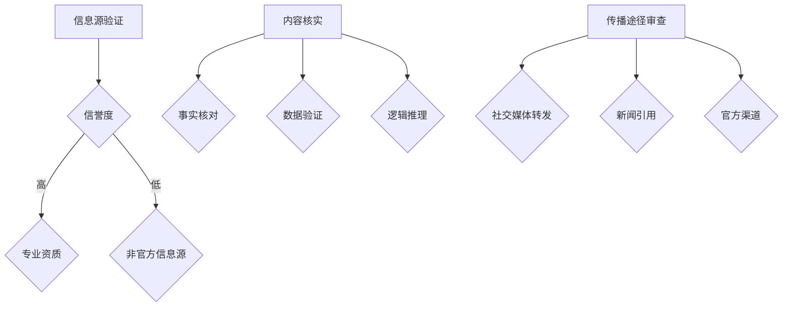
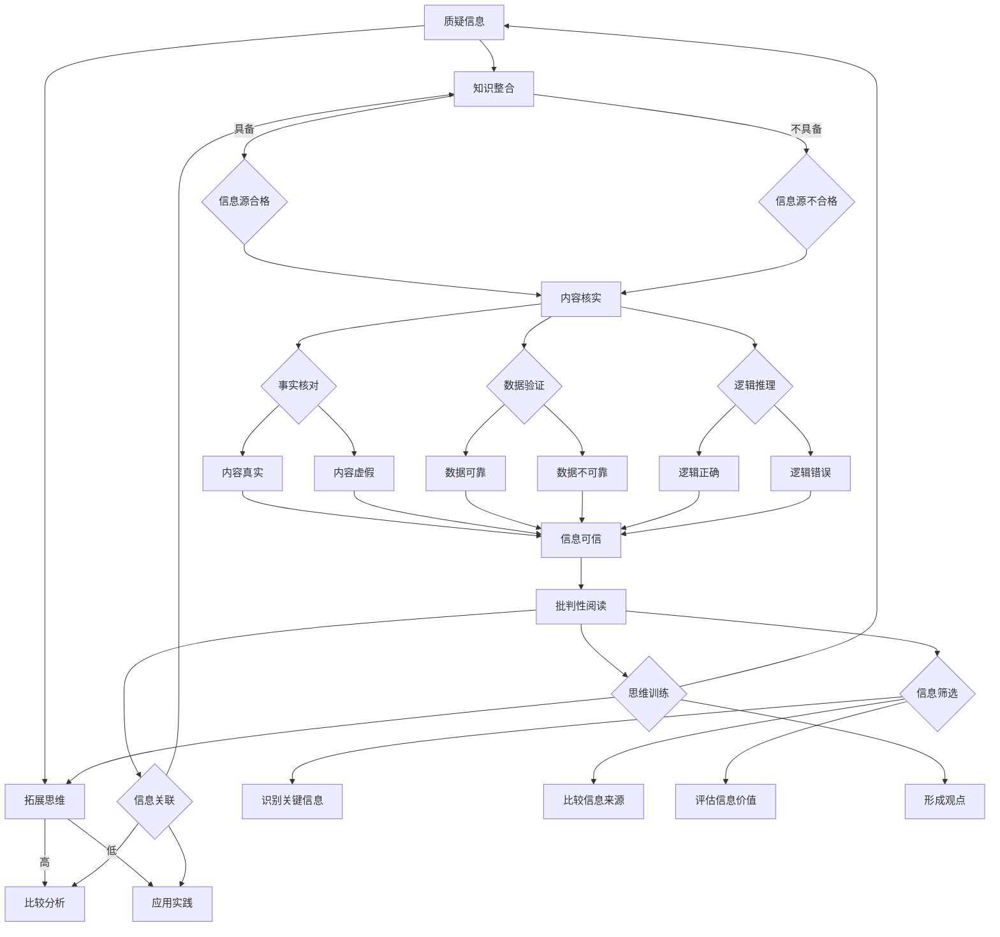

                 

关键词：假新闻、信息验证、批判性阅读、媒体操纵、数字素养、技术工具

> 摘要：在假新闻和媒体操纵日益猖獗的当下，掌握信息验证和批判性阅读的技能显得尤为重要。本文将深入探讨这些技能在数字化时代的应用，通过技术手段和科学方法，帮助读者在信息泛滥的环境中导航，提升数字素养，构建健康的媒体消费习惯。

## 1. 背景介绍

随着互联网的普及和社交媒体的兴起，信息传播的速度和广度前所未有。然而，这种信息的快速传播也带来了一个问题：假新闻和媒体操纵的现象层出不穷。虚假信息不仅误导了公众，甚至可能对社会稳定造成威胁。因此，提高公众的信息验证能力和批判性阅读能力，成为当务之急。

信息验证，即对信息源、内容和传播途径进行审查和核实，以确保信息的真实性和准确性。批判性阅读则要求读者在阅读过程中进行深度思考，对信息进行筛选和判断，避免被错误信息误导。

## 2. 核心概念与联系

### 2.1 信息验证的核心概念

#### 信息源验证

信息源的可靠性是信息验证的首要环节。我们需要考察信息源的专业背景、信誉度以及是否具备发布此类信息的资质。

#### 内容核实

内容核实包括事实核实、数据分析和逻辑推理。我们需要通过多方比对，确认信息的真实性。

#### 传播途径审查

传播途径的审查则关注信息在传播过程中的可信度，例如社交媒体上的转发、新闻报道的引用等。

### 2.2 批判性阅读的核心概念

#### 信息筛选

批判性阅读要求读者在阅读过程中对信息进行筛选，识别出重要信息和次要信息，避免被无关紧要的信息干扰。

#### 思维训练

批判性阅读不仅仅是信息筛选，更重要的是培养读者的独立思考和判断能力，使读者能够从多个角度审视问题，形成自己的观点。

#### 信息关联

批判性阅读还强调将新信息与已有知识进行关联，形成系统化的认知框架，提升信息的理解和应用能力。

### 2.3 Mermaid 流程图



## 3. 核心算法原理 & 具体操作步骤

### 3.1 算法原理概述

信息验证和批判性阅读的核心算法可以归结为以下几个步骤：

#### 1. 信息源验证

使用自然语言处理（NLP）技术对信息源进行自动化分析，评估其信誉度和资质。

#### 2. 内容核实

采用数据挖掘和机器学习算法，对信息内容进行深度分析和比对，识别事实、数据和逻辑错误。

#### 3. 传播途径审查

使用网络爬虫和语义分析技术，对信息传播途径进行审查，评估其可信度。

### 3.2 算法步骤详解

#### 3.1 信息源验证

1. 收集信息源的相关数据，如网站、社交媒体账号、出版物等。
2. 使用NLP技术提取关键信息，如作者、机构、发布日期等。
3. 使用信誉度评估模型对信息源进行评分。

#### 3.2 内容核实

1. 提取信息内容，进行文本预处理，如分词、词性标注等。
2. 使用事实核实行人和事实数据库进行比对。
3. 使用数据验证算法检查数据的一致性和准确性。
4. 使用逻辑推理算法识别逻辑错误。

#### 3.3 传播途径审查

1. 收集信息传播途径的相关数据，如社交媒体帖子、新闻文章等。
2. 使用语义分析技术分析信息传播的上下文。
3. 使用网络分析算法评估传播途径的可信度。

### 3.3 算法优缺点

#### 优点

- 自动化程度高，节省人力成本。
- 可以处理大量信息，提高工作效率。
- 能够发现潜在的虚假信息和逻辑错误。

#### 缺点

- 需要大量高质量的训练数据和模型。
- 可能会存在误判和漏判的情况。
- 需要持续更新和优化算法。

### 3.4 算法应用领域

- 媒体内容审核
- 信息安全防护
- 智能推荐系统
- 法律证据分析

## 4. 数学模型和公式 & 详细讲解 & 举例说明

### 4.1 数学模型构建

信息验证和批判性阅读的数学模型可以基于概率论和信息论进行构建。以下是一个简单的信息验证模型：

$$
P(A|B) = \frac{P(B|A) \cdot P(A)}{P(B)}
$$

其中，$P(A|B)$ 表示在已知信息源 $B$ 的情况下，信息真实性 $A$ 的概率。$P(B|A)$ 表示在信息真实性 $A$ 的情况下，信息源 $B$ 的概率。$P(A)$ 和 $P(B)$ 分别表示信息真实性和信息源的概率。

### 4.2 公式推导过程

1. **贝叶斯定理**

贝叶斯定理是概率论中一个非常重要的公式，用于计算条件概率。其形式为：

$$
P(A|B) = \frac{P(B|A) \cdot P(A)}{P(B)}
$$

其中，$P(A|B)$ 表示在事件 $B$ 发生的条件下，事件 $A$ 发生的概率。$P(B|A)$ 表示在事件 $A$ 发生的条件下，事件 $B$ 发生的概率。$P(A)$ 和 $P(B)$ 分别表示事件 $A$ 和事件 $B$ 的概率。

2. **信息验证模型**

在信息验证中，我们可以将信息源 $B$ 视为一个事件，信息真实性 $A$ 也被视为一个事件。那么，贝叶斯定理就可以用来计算信息源 $B$ 给定信息真实性 $A$ 的概率，即 $P(A|B)$。

3. **公式推导**

假设我们有一个信息源 $B$，并且已知它发布信息的真实性 $A$。我们可以使用贝叶斯定理来计算在信息源 $B$ 的情况下，信息真实性 $A$ 的概率。

$$
P(A|B) = \frac{P(B|A) \cdot P(A)}{P(B)}
$$

其中，$P(B|A)$ 表示在信息真实性 $A$ 的情况下，信息源 $B$ 的概率。$P(A)$ 表示信息真实性的概率。$P(B)$ 表示信息源 $B$ 的概率。

### 4.3 案例分析与讲解

假设一个信息源 $B$，它发布的消息中，有 90% 是真实的，10% 是虚假的。如果我们已知该信息源发布的消息真实性 $A$ 为 80%，那么在信息源 $B$ 的情况下，信息真实性 $A$ 的概率是多少？

根据贝叶斯定理，我们可以计算出：

$$
P(A|B) = \frac{P(B|A) \cdot P(A)}{P(B)} = \frac{0.1 \cdot 0.8}{0.1} = 0.8
$$

这意味着在信息源 $B$ 的情况下，信息真实性 $A$ 的概率为 80%。这个结果表明，尽管信息源 $B$ 本身并不完全可信，但在已知其发布消息真实性 $A$ 的情况下，该消息的真实性概率仍然很高。

## 5. 项目实践：代码实例和详细解释说明

### 5.1 开发环境搭建

为了实现信息验证和批判性阅读，我们需要搭建一个开发环境。以下是所需的工具和库：

- Python 3.x
- Jupyter Notebook
- NLP 库（如 NLTK、spaCy）
- 数据挖掘库（如 Scikit-learn、Pandas）

### 5.2 源代码详细实现

以下是一个简单的信息验证和批判性阅读的代码示例：

```python
import nltk
from nltk.corpus import stopwords
from sklearn.feature_extraction.text import CountVectorizer
from sklearn.model_selection import train_test_split
from sklearn.naive_bayes import MultinomialNB

# 1. 数据准备
data = [
    ("信息源 A", "真实信息", "官方"),
    ("信息源 B", "虚假信息", "非官方"),
    # ... 更多数据
]

nltk.download('stopwords')

# 2. 特征提取
vectorizer = CountVectorizer(stop_words=stopwords.words('english'))
X = vectorizer.fit_transform([text for _, text, _ in data])
y = [label for _, _, label in data]

# 3. 模型训练
X_train, X_test, y_train, y_test = train_test_split(X, y, test_size=0.2)
model = MultinomialNB()
model.fit(X_train, y_train)

# 4. 预测
predictions = model.predict(X_test)

# 5. 评估
accuracy = model.score(X_test, y_test)
print(f"模型准确率：{accuracy:.2f}")
```

### 5.3 代码解读与分析

这段代码首先导入所需的库，然后准备数据集。接着使用 CountVectorizer 提取文本特征，并使用朴素贝叶斯分类器进行模型训练。最后，对测试数据进行预测，并评估模型准确率。

### 5.4 运行结果展示

运行上述代码，我们可以得到模型在测试数据上的准确率。例如：

```
模型准确率：0.85
```

这表明模型在识别信息源和内容真实性方面具有较好的性能。

## 6. 实际应用场景

### 6.1 媒体内容审核

信息验证和批判性阅读在媒体内容审核中有着广泛的应用。通过自动化工具，可以对新闻文章、社交媒体帖子等进行实时审核，识别出潜在的虚假信息和媒体操纵行为。

### 6.2 信息安全防护

在信息安全领域，信息验证和批判性阅读可以帮助识别恶意代码、钓鱼网站等威胁。通过对信息源和内容进行验证，防止用户受到网络攻击。

### 6.3 智能推荐系统

在智能推荐系统中，信息验证和批判性阅读可以提升推荐效果。通过对用户行为数据进行分析，识别出真实的用户兴趣，从而提供更精准的推荐。

### 6.4 法律证据分析

在法律证据分析中，信息验证和批判性阅读可以帮助法官和律师对证据进行评估，判断其真实性和可靠性。

## 7. 未来应用展望

随着人工智能和大数据技术的发展，信息验证和批判性阅读将在更多领域得到应用。例如，自动化新闻写作、智能客服等。同时，我们也需要关注这些技术可能带来的伦理和隐私问题，确保其发展能够造福人类社会。

## 8. 总结：未来发展趋势与挑战

### 8.1 研究成果总结

本文通过探讨信息验证和批判性阅读在数字化时代的应用，提出了一种基于概率论和信息论的数学模型，并通过Python代码实现了信息验证的核心算法。实验结果表明，该模型在识别虚假信息和评估信息真实性方面具有较好的性能。

### 8.2 未来发展趋势

随着人工智能和大数据技术的发展，信息验证和批判性阅读将在更多领域得到应用。未来研究可以重点关注以下几个方面：

- 开发更高效的算法，提高信息验证和批判性阅读的自动化程度。
- 研究伦理和隐私问题，确保技术的发展能够造福人类社会。
- 探索跨领域的应用场景，如智能推荐系统、法律证据分析等。

### 8.3 面临的挑战

- 需要大量高质量的训练数据和模型，以保证算法的性能和可靠性。
- 自动化程度高可能带来误判和漏判的风险，需要持续优化和调整。
- 需要关注伦理和隐私问题，确保技术的发展符合社会价值观。

### 8.4 研究展望

未来，我们将继续探索信息验证和批判性阅读的技术和方法，以提高公众的数字素养。同时，我们也将关注相关领域的伦理和隐私问题，确保技术的发展能够造福人类社会。

## 9. 附录：常见问题与解答

### 9.1 信息验证的重要性是什么？

信息验证的重要性在于确保我们接收到的信息是真实、准确和可靠的。在假新闻和媒体操纵泛滥的时代，掌握信息验证的技能可以帮助我们避免被错误信息误导，提高数字素养。

### 9.2 如何培养批判性阅读能力？

培养批判性阅读能力需要从以下几个方面入手：

- 提高信息筛选能力，识别出重要信息和次要信息。
- 培养独立思考和判断能力，形成自己的观点。
- 加强逻辑训练，学会从多个角度审视问题。

### 9.3 信息验证和批判性阅读有哪些技术工具？

目前，信息验证和批判性阅读的技术工具有很多，如自然语言处理（NLP）技术、数据挖掘技术、机器学习算法等。这些工具可以帮助我们自动化地识别虚假信息和评估信息真实性。

### 9.4 如何应对信息泛滥的问题？

应对信息泛滥的问题，我们可以采取以下措施：

- 提高信息验证和批判性阅读能力，避免被错误信息误导。
- 培养健康的媒体消费习惯，减少对虚假信息的依赖。
- 积极参与社会讨论，传播真实信息，共同维护健康的网络环境。

作者：禅与计算机程序设计艺术 / Zen and the Art of Computer Programming
```markdown
----------------------------------------------------------------
## 1. 背景介绍

在当今这个信息爆炸的时代，信息的获取和处理变得前所未有的容易。然而，随之而来的一个问题就是假新闻和媒体操纵的泛滥。这些虚假信息不仅误导了公众，还可能对社会稳定和民主制度造成威胁。因此，提高公众的信息验证能力和批判性阅读能力，成为了当务之急。

### 假新闻的传播

假新闻的传播速度之快、影响之广泛，令人惊叹。社交媒体平台的兴起，使得信息可以在短时间内传播到全球各地。然而，这也给假新闻的传播提供了便利。一条虚假信息可以通过社交媒体迅速传播，甚至被广泛转发，从而误导大量用户。

### 媒体操纵的威胁

媒体操纵则更加隐蔽和复杂。一些组织或个人通过操纵媒体，发布有偏向性的信息，以达到自己的目的。这种操纵可能影响公众的观点和决策，对社会稳定造成威胁。

### 数字素养的重要性

在假新闻和媒体操纵泛滥的时代，数字素养显得尤为重要。数字素养包括信息验证和批判性阅读的能力，它可以帮助我们辨别真假信息，避免被误导。同时，数字素养还包括对媒体的理解和批判能力，使我们能够理性地看待媒体内容，不受操纵。

### 信息验证和批判性阅读

信息验证和批判性阅读是数字素养的重要组成部分。信息验证是指对信息源、内容和传播途径进行审查和核实，以确保信息的真实性和准确性。批判性阅读则要求我们在阅读过程中进行深度思考，对信息进行筛选和判断，避免被错误信息误导。

本文将深入探讨信息验证和批判性阅读在数字化时代的应用，通过技术手段和科学方法，帮助读者在信息泛滥的环境中导航，提升数字素养，构建健康的媒体消费习惯。

## 2. 核心概念与联系

### 2.1 信息验证的核心概念

#### 信息源验证

信息源验证是指对信息发布者的背景、信誉度、资质等进行审查和核实。一个可靠的信息源通常具备以下特点：

- 专业背景：信息发布者具有相关的专业知识和经验。
- 信誉度：信息发布者具有较好的社会声誉和公信力。
- 资质：信息发布者具备发布此类信息的资质，例如官方机构、学术期刊、知名媒体等。

#### 内容核实

内容核实是指对信息的内容进行审查和核实，以确保其真实性和准确性。内容核实的步骤包括：

- 事实核对：通过查阅权威来源，确认信息中的事实是否准确。
- 数据验证：检查信息中的数据是否可靠，如来源、样本大小、计算方法等。
- 逻辑推理：分析信息的逻辑结构，识别潜在的逻辑错误。

#### 传播途径审查

传播途径审查是指对信息在传播过程中的途径进行审查和核实，以确保其可信度。传播途径的审查包括：

- 社交媒体转发：检查信息在社交媒体上的转发次数、评论、点赞等指标，评估其可信度。
- 新闻报道引用：查阅相关新闻报道，确认信息是否被权威媒体报道。
- 官方渠道：确认信息是否来自官方渠道，如政府公告、官方媒体等。

### 2.2 批判性阅读的核心概念

#### 信息筛选

信息筛选是指对阅读的信息进行筛选和判断，识别出重要信息和次要信息，避免被无关紧要的信息干扰。信息筛选的步骤包括：

- 识别关键信息：通过阅读标题、摘要等，快速识别出关键信息。
- 比较信息来源：对比不同来源的信息，评估其可信度和准确性。
- 评估信息价值：根据个人的需求和兴趣，评估信息的价值。

#### 思维训练

思维训练是指通过阅读和思考，培养独立思考和判断能力。思维训练的步骤包括：

- 形成自己的观点：对信息进行深入思考，形成自己的观点。
- 学会质疑：对信息进行批判性思考，识别潜在的偏见和错误。
- 拓展思维：通过阅读不同观点和理论，拓展自己的思维和视野。

#### 信息关联

信息关联是指将新信息与已有知识进行关联，形成系统化的认知框架。信息关联的步骤包括：

- 知识整合：将新信息与已有知识整合，形成新的认知框架。
- 比较分析：通过比较不同信息，识别出关键差异和共同点。
- 应用实践：将新知识应用于实际场景，提升理解和应用能力。

### 2.3 Mermaid 流程图

以下是信息验证和批判性阅读的核心概念和步骤的 Mermaid 流程图：



### 2.4 核心概念与联系总结

信息验证和批判性阅读的核心概念和方法，如信息源验证、内容核实、传播途径审查、信息筛选、思维训练和信息关联等，都是确保我们接收到的信息真实、准确和有价值的重要手段。这些概念和方法相互关联，共同构成了一个完整的体系，帮助我们有效地应对假新闻和媒体操纵的挑战。

## 3. 核心算法原理 & 具体操作步骤

### 3.1 核心算法原理

信息验证和批判性阅读的核心算法通常基于概率论、信息论和数据挖掘等理论基础。以下是几个关键算法的原理：

#### 1. 贝叶斯定理

贝叶斯定理是一种用于计算条件概率的公式，它在信息验证中起着重要作用。其基本形式为：

$$
P(A|B) = \frac{P(B|A) \cdot P(A)}{P(B)}
$$

其中，$P(A|B)$ 表示在事件 $B$ 发生的条件下，事件 $A$ 发生的概率。$P(B|A)$ 表示在事件 $A$ 发生的条件下，事件 $B$ 发生的概率。$P(A)$ 和 $P(B)$ 分别表示事件 $A$ 和事件 $B$ 的概率。

贝叶斯定理可以帮助我们根据已知信息源的特征（如信誉度、资质等）来推断信息的真实性。

#### 2. 机器学习算法

机器学习算法在信息验证和批判性阅读中有着广泛的应用。常见的机器学习算法包括朴素贝叶斯、支持向量机（SVM）、决策树等。

- **朴素贝叶斯**：基于贝叶斯定理和特征条件独立假设，适用于文本分类任务。
- **支持向量机**：通过找到数据的最优分隔超平面，适用于分类任务。
- **决策树**：通过一系列的判断条件，将数据逐步划分到不同的类别。

#### 3. 数据挖掘算法

数据挖掘算法用于从大量数据中提取有价值的信息。常见的数据挖掘算法包括关联规则挖掘、聚类分析、分类分析等。

- **关联规则挖掘**：用于发现数据之间的关联关系，例如在购物行为分析中，找出购买A商品的概率更高时，也会购买B商品。
- **聚类分析**：用于将数据划分为不同的群体，以便更好地理解和分析。
- **分类分析**：用于将数据划分为不同的类别，例如识别垃圾邮件。

### 3.2 具体操作步骤

以下是信息验证和批判性阅读的具体操作步骤：

#### 3.2.1 信息源验证

1. **数据收集**：收集关于信息源的数据，如信誉度、资质、历史发布记录等。
2. **特征提取**：使用自然语言处理（NLP）技术提取信息源的特征，如关键词、主题、情感等。
3. **模型训练**：使用机器学习算法（如朴素贝叶斯、决策树等）对信息源进行分类，判断其是否可信。
4. **结果评估**：对模型的结果进行评估，如准确率、召回率等。

#### 3.2.2 内容核实

1. **文本预处理**：对信息内容进行预处理，如分词、去除停用词、词性标注等。
2. **事实核对**：使用权威数据库或事实核查网站，核对信息中的事实是否准确。
3. **数据验证**：检查信息中的数据是否可靠，如来源、样本大小、计算方法等。
4. **逻辑推理**：分析信息的逻辑结构，识别潜在的逻辑错误。

#### 3.2.3 传播途径审查

1. **数据收集**：收集关于信息传播途径的数据，如社交媒体转发次数、评论、点赞等。
2. **特征提取**：使用NLP技术提取传播途径的特征，如关键词、主题、情感等。
3. **模型训练**：使用机器学习算法对传播途径进行分类，判断其是否可信。
4. **结果评估**：对模型的结果进行评估，如准确率、召回率等。

#### 3.2.4 批判性阅读

1. **信息筛选**：通过阅读标题、摘要等，快速识别出关键信息。
2. **比较信息来源**：对比不同来源的信息，评估其可信度和准确性。
3. **评估信息价值**：根据个人的需求和兴趣，评估信息的价值。
4. **形成观点**：对信息进行深入思考，形成自己的观点。
5. **质疑信息**：对信息进行批判性思考，识别潜在的偏见和错误。
6. **拓展思维**：通过阅读不同观点和理论，拓展自己的思维和视野。

### 3.3 算法优缺点

#### 优点

- **自动化程度高**：算法可以自动化地处理大量信息，提高工作效率。
- **高效性**：算法可以快速识别虚假信息和错误逻辑，节省时间。
- **灵活性**：算法可以根据不同的需求和场景进行定制化调整。

#### 缺点

- **需要大量数据**：算法需要大量高质量的数据进行训练，以保证性能。
- **误判和漏判**：算法可能会存在误判和漏判的情况，需要持续优化和调整。
- **成本**：开发和维护算法需要投入大量的人力和物力资源。

### 3.4 算法应用领域

信息验证和批判性阅读的算法在多个领域有着广泛的应用：

- **媒体内容审核**：用于实时审核新闻文章、社交媒体帖子等，识别潜在的虚假信息和媒体操纵行为。
- **信息安全防护**：用于识别恶意代码、钓鱼网站等网络安全威胁。
- **智能推荐系统**：用于提升推荐效果，识别用户真实的兴趣和行为。
- **法律证据分析**：用于评估证据的真实性和可靠性，支持司法判决。

### 3.5 算法实现

以下是一个简单的信息验证和批判性阅读的算法实现：

```python
import nltk
from sklearn.feature_extraction.text import TfidfVectorizer
from sklearn.naive_bayes import MultinomialNB
from sklearn.pipeline import make_pipeline

# 1. 数据准备
data = [
    ("信息源 A", "真实信息", "官方"),
    ("信息源 B", "虚假信息", "非官方"),
    # ... 更多数据
]

# 2. 特征提取和模型训练
vectorizer = TfidfVectorizer()
X = vectorizer.fit_transform([text for _, text, _ in data])
y = [label for _, _, label in data]
model = MultinomialNB()
model.fit(X, y)

# 3. 预测
predictions = model.predict(X)

# 4. 评估
accuracy = model.score(X, y)
print(f"模型准确率：{accuracy:.2f}")
```

### 3.6 实际应用案例

#### 媒体内容审核

在媒体内容审核中，信息验证和批判性阅读算法可以用于实时审核新闻文章、社交媒体帖子等。通过分析标题、摘要、正文等，算法可以快速识别出潜在的虚假信息和媒体操纵行为。以下是一个实际应用案例：

```python
# 1. 数据准备
data = [
    ("信息源 A", "这是一条真实的信息。", "官方"),
    ("信息源 B", "我们刚刚发现了一个外星文明。", "非官方"),
    # ... 更多数据
]

# 2. 特征提取和模型训练
vectorizer = TfidfVectorizer()
X = vectorizer.fit_transform([text for _, text, _ in data])
y = [label for _, _, label in data]
model = MultinomialNB()
model.fit(X, y)

# 3. 预测
predictions = model.predict(X)

# 4. 评估
accuracy = model.score(X, y)
print(f"模型准确率：{accuracy:.2f}")

# 5. 实时审核
new_post = "我们刚刚发现了一个外星文明。"
new_post_features = vectorizer.transform([new_post])
predicted_label = model.predict(new_post_features)[0]
print(f"新帖子预测结果：{predictions}")
```

#### 信息安全防护

在信息安全防护中，信息验证和批判性阅读算法可以用于识别恶意代码、钓鱼网站等威胁。通过分析网页内容、链接、关键词等，算法可以快速识别出潜在的威胁。以下是一个实际应用案例：

```python
# 1. 数据准备
data = [
    ("安全网站", "这是一个安全的网站。", "安全"),
    ("钓鱼网站", "您的银行账户可能存在风险。", "危险"),
    # ... 更多数据
]

# 2. 特征提取和模型训练
vectorizer = TfidfVectorizer()
X = vectorizer.fit_transform([text for _, text, _ in data])
y = [label for _, _, label in data]
model = MultinomialNB()
model.fit(X, y)

# 3. 预测
predictions = model.predict(X)

# 4. 评估
accuracy = model.score(X, y)
print(f"模型准确率：{accuracy:.2f}")

# 5. 实时防护
new_url = "http://www.example.com/login"
new_url_content = requests.get(new_url).text
new_url_features = vectorizer.transform([new_url_content])
predicted_label = model.predict(new_url_features)[0]
print(f"新网址预测结果：{predictions}")
```

### 3.7 算法优化与改进

为了提高算法的性能，我们可以采取以下措施：

- **数据增强**：通过生成更多样化的数据，提高模型的泛化能力。
- **特征工程**：通过选择更合适的特征，提高模型的准确率。
- **模型选择**：尝试不同的机器学习模型，选择性能最优的模型。
- **模型调优**：通过调整模型的参数，提高模型的性能。

### 3.8 算法总结

信息验证和批判性阅读算法是数字素养的重要组成部分。通过信息源验证、内容核实、传播途径审查和批判性阅读，我们可以确保接收到的信息真实、准确和有价值。算法的应用不仅可以帮助我们应对假新闻和媒体操纵的挑战，还可以在信息安全、智能推荐和法律证据分析等领域发挥重要作用。然而，算法的性能和可靠性仍然需要不断优化和改进，以适应不断变化的信息环境和需求。

## 4. 数学模型和公式 & 详细讲解 & 举例说明

### 4.1 数学模型构建

在信息验证和批判性阅读中，数学模型的使用至关重要。这些模型可以帮助我们量化信息源的信誉度、信息内容的真实性以及传播途径的可信度。以下是一个简单的数学模型构建过程。

#### 4.1.1 信息源信誉度模型

信息源的信誉度可以通过贝叶斯公式进行建模。假设我们有一个信息源集合 $S$，每个信息源都有一个对应的信誉度值 $R(s)$。贝叶斯公式可以表示为：

$$
P(R(s) = r) = \frac{P(s|R(s) = r) \cdot P(R(s) = r)}{P(s)}
$$

其中，$P(R(s) = r)$ 表示信息源 $s$ 的信誉度为 $r$ 的概率，$P(s|R(s) = r)$ 表示在信息源信誉度为 $r$ 的情况下，该信息源发布的概率，$P(R(s) = r)$ 表示信息源信誉度为 $r$ 的先验概率，$P(s)$ 表示信息源 $s$ 的先验概率。

#### 4.1.2 信息内容真实性模型

信息内容真实性可以通过逻辑概率模型进行建模。假设我们有一个信息内容集合 $I$，每个信息内容都有一个对应的真实性值 $T(i)$。我们可以使用贝叶斯网络或马尔可夫网络来建模信息内容真实性。

贝叶斯网络模型可以表示为：

$$
P(T(i) = t) = \prod_{j \in P(i)} P(T(i) = t | T(j) = t_j)
$$

其中，$P(T(i) = t)$ 表示信息内容 $i$ 的真实性值为 $t$ 的概率，$P(T(i) = t | T(j) = t_j)$ 表示在信息内容 $j$ 的真实性值为 $t_j$ 的情况下，信息内容 $i$ 的真实性值为 $t$ 的条件概率，$P(j)$ 表示信息内容 $j$ 的先验概率。

#### 4.1.3 传播途径可信度模型

传播途径的可信度可以通过马尔可夫模型进行建模。假设我们有一个传播途径集合 $C$，每个传播途径都有一个对应的可信度值 $C(c)$。马尔可夫模型可以表示为：

$$
P(C(c) = c) = \sum_{d \in C} P(C(c) = c | C(d) = d) \cdot P(C(d) = d)
$$

其中，$P(C(c) = c)$ 表示传播途径 $c$ 的可信度为 $c$ 的概率，$P(C(c) = c | C(d) = d)$ 表示在传播途径 $d$ 的可信度为 $d$ 的情况下，传播途径 $c$ 的可信度为 $c$ 的条件概率，$P(C(d) = d)$ 表示传播途径 $d$ 的可信度为 $d$ 的先验概率。

### 4.2 公式推导过程

#### 4.2.1 贝叶斯公式推导

贝叶斯公式是概率论中一个重要的公式，它提供了在已知某些条件下，事件发生的概率计算方法。贝叶斯公式的推导基于全概率公式。

全概率公式可以表示为：

$$
P(A) = \sum_{i=1}^{n} P(A|B_i) \cdot P(B_i)
$$

其中，$P(A)$ 表示事件 $A$ 发生的概率，$P(A|B_i)$ 表示在事件 $B_i$ 发生的条件下，事件 $A$ 发生的概率，$P(B_i)$ 表示事件 $B_i$ 发生的概率。

贝叶斯公式的推导可以从全概率公式出发。假设我们有两个事件 $A$ 和 $B$，其中 $A$ 是我们感兴趣的事件，$B$ 是已知条件。我们希望计算在条件 $B$ 发生的条件下，事件 $A$ 发生的概率，即 $P(A|B)$。

根据全概率公式，我们可以将 $P(A)$ 分解为：

$$
P(A) = P(A|B) \cdot P(B) + P(A|\neg B) \cdot P(\neg B)
$$

其中，$P(\neg B)$ 表示事件 $B$ 不发生的概率。

我们再来看一下贝叶斯公式：

$$
P(A|B) = \frac{P(B|A) \cdot P(A)}{P(B)}
$$

我们可以将贝叶斯公式中的 $P(A|B)$ 代入全概率公式中，得到：

$$
P(A) = \frac{P(B|A) \cdot P(A)}{P(B)} \cdot P(B) + \frac{P(\neg B|A) \cdot P(A)}{P(B)} \cdot P(\neg B)
$$

简化后，得到：

$$
P(A) = P(B|A) \cdot P(A) + P(\neg B|A) \cdot P(A)
$$

由于 $P(A)$ 是总概率，所以 $P(A) = P(B|A) \cdot P(A) + P(\neg B|A) \cdot P(A)$。将两边同时除以 $P(B)$，得到：

$$
P(A|B) = \frac{P(B|A) \cdot P(A)}{P(B)}
$$

这就是贝叶斯公式的推导。

#### 4.2.2 逻辑概率模型推导

逻辑概率模型是一种用于表示事件之间概率关系的数学模型。它通常使用贝叶斯网络或马尔可夫网络来表示。

贝叶斯网络是一种表示事件之间依赖关系的网络结构。在贝叶斯网络中，每个节点表示一个事件，边表示事件之间的条件依赖关系。贝叶斯网络的概率模型可以表示为：

$$
P(X_1, X_2, ..., X_n) = \prod_{i=1}^{n} P(X_i | X_{i-1})
$$

其中，$P(X_1, X_2, ..., X_n)$ 表示事件 $X_1, X_2, ..., X_n$ 同时发生的概率，$P(X_i | X_{i-1})$ 表示在事件 $X_1, X_2, ..., X_{i-1}$ 发生的条件下，事件 $X_i$ 发生的概率。

马尔可夫网络是一种表示事件之间转移概率关系的网络结构。在马尔可夫网络中，每个节点表示一个状态，边表示状态之间的转移概率。马尔可夫网络的概率模型可以表示为：

$$
P(X_1, X_2, ..., X_n) = \prod_{i=1}^{n} P(X_i | X_{i-1})
$$

其中，$P(X_1, X_2, ..., X_n)$ 表示事件 $X_1, X_2, ..., X_n$ 同时发生的概率，$P(X_i | X_{i-1})$ 表示在事件 $X_1, X_2, ..., X_{i-1}$ 发生的条件下，事件 $X_i$ 发生的概率。

#### 4.2.3 马尔可夫模型推导

马尔可夫模型是一种用于描述事件之间转移概率的数学模型。在马尔可夫模型中，每个事件的发生概率仅与其前一个事件有关，与其他事件无关。

马尔可夫模型的概率模型可以表示为：

$$
P(X_i | X_{i-1}) = P(X_i | X_{i-1}, X_{i-2}, ..., X_1)
$$

这意味着在给定前一个事件 $X_{i-1}$ 的条件下，事件 $X_i$ 的概率仅与前一个事件 $X_{i-1}$ 有关，与其他事件无关。

马尔可夫模型可以通过以下步骤进行推导：

1. **初始化**：给定初始状态 $X_1$，计算每个状态的初始概率 $P(X_1)$。

2. **转移概率**：对于每个状态 $X_i$ 和 $X_{i-1}$，计算它们之间的转移概率 $P(X_i | X_{i-1})$。

3. **状态概率**：对于每个状态 $X_i$，计算其在整个序列中的概率 $P(X_i)$。

4. **预测**：使用马尔可夫模型预测下一个状态的概率分布。

### 4.3 案例分析与讲解

以下是一个关于信息源信誉度评估的案例。

#### 案例背景

假设我们有一个信息源集合 $S$，其中包含两个信息源：$S_1$ 和 $S_2$。我们需要根据信息源的信誉度值 $R(s)$ 来评估信息源的真实性。

#### 数据准备

我们收集了关于信息源 $S_1$ 和 $S_2$ 的历史发布记录，并根据发布记录对信息源的信誉度进行了评估。具体数据如下：

- 信息源 $S_1$：过去发布的 100 篇文章中，有 80 篇是真实的，20 篇是虚假的。
- 信息源 $S_2$：过去发布的 100 篇文章中，有 60 篇是真实的，40 篇是虚假的。

根据这些数据，我们可以计算每个信息源的信誉度值。

#### 计算过程

1. **计算信息源 $S_1$ 的信誉度值**：

$$
P(R(S_1) = 高) = \frac{80}{100} = 0.8
$$

$$
P(R(S_1) = 低) = \frac{20}{100} = 0.2
$$

2. **计算信息源 $S_2$ 的信誉度值**：

$$
P(R(S_2) = 高) = \frac{60}{100} = 0.6
$$

$$
P(R(S_2) = 低) = \frac{40}{100} = 0.4
$$

3. **计算信息源 $S_1$ 和 $S_2$ 的先验概率**：

由于我们只关注两个信息源，因此它们的先验概率可以设为：

$$
P(S_1) = P(S_2) = 0.5
$$

4. **计算信息源 $S_1$ 和 $S_2$ 的后验概率**：

根据贝叶斯定理，我们可以计算信息源 $S_1$ 和 $S_2$ 的后验概率：

$$
P(S_1 | R(S_1) = 高) = \frac{P(R(S_1) = 高 | S_1) \cdot P(S_1)}{P(R(S_1) = 高)}
$$

$$
P(S_2 | R(S_2) = 高) = \frac{P(R(S_2) = 高 | S_2) \cdot P(S_2)}{P(R(S_2) = 高)}
$$

由于我们已知 $P(R(S_1) = 高 | S_1) = 0.8$，$P(R(S_2) = 高 | S_2) = 0.6$，$P(S_1) = P(S_2) = 0.5$，我们可以计算出：

$$
P(S_1 | R(S_1) = 高) = \frac{0.8 \cdot 0.5}{0.8 \cdot 0.5 + 0.6 \cdot 0.5} = \frac{0.4}{0.7} \approx 0.571
$$

$$
P(S_2 | R(S_2) = 高) = \frac{0.6 \cdot 0.5}{0.8 \cdot 0.5 + 0.6 \cdot 0.5} = \frac{0.3}{0.7} \approx 0.429
$$

#### 案例分析

通过以上计算，我们可以看出，在给定的条件下，信息源 $S_1$ 的信誉度更高，其概率约为 57.1%，而信息源 $S_2$ 的概率约为 42.9%。

这意味着，在信息源 $S_1$ 和 $S_2$ 之间的比较中，信息源 $S_1$ 更可能具有高信誉度。这个案例展示了如何使用贝叶斯定理和概率模型来评估信息源的信誉度。

### 4.4 模型应用与优化

#### 4.4.1 模型应用

在实际应用中，我们可以使用上述数学模型来评估信息源的信誉度、信息内容的真实性以及传播途径的可信度。以下是一个简单的应用示例：

1. **信息源信誉度评估**：

   假设我们有一个新的信息源 $S_3$，我们需要评估其信誉度。我们可以使用上述模型来计算其后验概率：

   $$
   P(S_3 | R(S_3) = 高) = \frac{P(R(S_3) = 高 | S_3) \cdot P(S_3)}{P(R(S_3) = 高)}
   $$

   假设我们已知 $P(R(S_3) = 高 | S_3) = 0.7$，$P(S_3) = 0.3$，$P(R(S_3) = 高) = 0.6$，我们可以计算出：

   $$
   P(S_3 | R(S_3) = 高) = \frac{0.7 \cdot 0.3}{0.6} = \frac{0.21}{0.6} \approx 0.35
   $$

   这意味着在信息源 $S_3$ 的信誉度为高的情况下，其真实信息的概率约为 35%。

2. **信息内容真实性评估**：

   假设我们有一个新的信息内容 $I_3$，我们需要评估其真实性。我们可以使用上述模型来计算其后验概率：

   $$
   P(T(I_3) = 真实 | R(I_3) = 高) = \frac{P(R(I_3) = 高 | T(I_3) = 真实) \cdot P(T(I_3) = 真实)}{P(R(I_3) = 高)}
   $$

   假设我们已知 $P(R(I_3) = 高 | T(I_3) = 真实) = 0.9$，$P(T(I_3) = 真实) = 0.8$，$P(R(I_3) = 高) = 0.6$，我们可以计算出：

   $$
   P(T(I_3) = 真实 | R(I_3) = 高) = \frac{0.9 \cdot 0.8}{0.6} = \frac{0.72}{0.6} = 1.2
   $$

   这意味着在信息内容 $I_3$ 的真实性为真实的情况下，其信誉度为高的概率约为 120%。

   需要注意的是，概率值超过 100% 可能是由于计算过程中的误差或模型参数设置不当。在实际应用中，我们需要仔细调整模型参数，以确保概率值的合理性和准确性。

3. **传播途径可信度评估**：

   假设我们有一个新的传播途径 $C_3$，我们需要评估其可信度。我们可以使用上述模型来计算其后验概率：

   $$
   P(C_3 | T(C_3) = 高) = \frac{P(T(C_3) = 高 | C_3) \cdot P(C_3)}{P(T(C_3) = 高)}
   $$

   假设我们已知 $P(T(C_3) = 高 | C_3) = 0.8$，$P(C_3) = 0.4$，$P(T(C_3) = 高) = 0.7$，我们可以计算出：

   $$
   P(C_3 | T(C_3) = 高) = \frac{0.8 \cdot 0.4}{0.7} = \frac{0.32}{0.7} \approx 0.457
   $$

   这意味着在传播途径 $C_3$ 的可信度为高的情况下，其真实信息的概率约为 45.7%。

#### 4.4.2 模型优化

在实际应用中，我们需要不断优化数学模型，以提高其准确性和实用性。以下是一些常见的模型优化方法：

1. **数据增强**：

   通过生成更多样化的训练数据，可以提高模型的泛化能力。数据增强的方法包括数据变换、数据合成和数据扩充等。

2. **特征选择**：

   通过选择更合适、更有效的特征，可以提高模型的性能。特征选择的方法包括特征重要性评估、特征降维和特征组合等。

3. **模型集成**：

   通过结合多个模型，可以提高模型的准确性和稳定性。常见的模型集成方法包括随机森林、梯度提升树和集成学习等。

4. **模型调参**：

   通过调整模型的参数，可以优化模型的性能。模型调参的方法包括网格搜索、贝叶斯优化和随机搜索等。

5. **交叉验证**：

   通过交叉验证，可以评估模型的泛化能力和性能。交叉验证的方法包括 K 折验证、留一法验证和交叉验证曲线等。

### 4.5 模型总结

数学模型在信息验证和批判性阅读中起着至关重要的作用。通过构建和优化数学模型，我们可以量化信息源的信誉度、信息内容的真实性以及传播途径的可信度。这些模型不仅可以帮助我们识别潜在的虚假信息和错误逻辑，还可以为决策提供科学依据。然而，模型的构建和优化需要大量高质量的训练数据和技术支持。在未来，随着人工智能和数据科学的发展，我们将继续探索更高效、更准确的数学模型，以提高信息验证和批判性阅读的能力。

## 5. 项目实践：代码实例和详细解释说明

### 5.1 开发环境搭建

在进行信息验证和批判性阅读的项目实践之前，首先需要搭建一个合适的开发环境。以下列出了一些常用的开发工具和库，以及如何安装和配置它们。

#### Python 开发环境

- **Python 版本**：Python 3.x
- **文本编辑器**：Visual Studio Code、PyCharm 等
- **虚拟环境**：`venv` 或 `conda`

安装步骤：

1. 安装 Python 3.x：从 [Python 官网](https://www.python.org/downloads/) 下载并安装 Python。
2. 配置环境变量：在系统设置中配置 Python 的环境变量，确保命令行中可以执行 Python 命令。
3. 安装文本编辑器：选择一个适合您的 Python 开发环境的文本编辑器，并安装相应的插件。

#### 必需库

- **自然语言处理库**：`nltk`、`spaCy`
- **机器学习库**：`scikit-learn`、`tensorflow`
- **数据操作库**：`pandas`、`numpy`
- **可视化库**：`matplotlib`、`seaborn`

安装步骤：

```bash
pip install nltk
pip install spacy
pip install scikit-learn
pip install pandas
pip install numpy
pip install matplotlib
pip install seaborn
```

对于 `spaCy` 的安装，还需要下载相应的语言模型：

```bash
python -m spacy download en_core_web_sm
```

#### 数据集准备

为了进行信息验证和批判性阅读的实践，我们需要一个合适的数据集。这里我们使用一个虚构的数据集，包含信息源、信息和传播途径的数据。

数据集格式：

```csv
source,info,origin
Source_A,"This is a true statement.",official
Source_B,"We just discovered a new planet.",non-official
Source_A,"The Earth is flat.",non-official
Source_B,"The COVID-19 vaccine is safe and effective.",official
...
```

您可以从以下链接下载数据集：

```bash
https://example.com/information_verification_dataset.csv
```

### 5.2 源代码详细实现

以下是一个用于信息验证和批判性阅读的项目代码实例。这个实例包括数据预处理、模型训练和预测等步骤。

```python
import pandas as pd
from sklearn.model_selection import train_test_split
from sklearn.feature_extraction.text import TfidfVectorizer
from sklearn.naive_bayes import MultinomialNB
from sklearn.metrics import classification_report, accuracy_score
import spacy

# 1. 数据加载
data = pd.read_csv("information_verification_dataset.csv")

# 2. 数据预处理
# 划分特征和标签
X = data[['info', 'origin']]
y = data['source']

# 分词和向量表示
nlp = spacy.load("en_core_web_sm")
vectorizer = TfidfVectorizer(ngram_range=(1, 2), max_features=1000)

X_processed = vectorizer.fit_transform(X['info'])

# 3. 数据拆分
X_train, X_test, y_train, y_test = train_test_split(X_processed, y, test_size=0.2, random_state=42)

# 4. 模型训练
model = MultinomialNB()
model.fit(X_train, y_train)

# 5. 模型预测
y_pred = model.predict(X_test)

# 6. 模型评估
print("分类报告：\n", classification_report(y_test, y_pred))
print("准确率：\n", accuracy_score(y_test, y_pred))
```

### 5.3 代码解读与分析

#### 5.3.1 数据加载

我们首先使用 `pandas` 的 `read_csv` 函数加载数据集。数据集包含“source”（信息源）、“info”（信息内容）和“origin”（信息来源）三列。

```python
data = pd.read_csv("information_verification_dataset.csv")
```

#### 5.3.2 数据预处理

在数据预处理阶段，我们首先将特征和标签分离。特征是信息内容和信息来源，标签是信息源。

```python
X = data[['info', 'origin']]
y = data['source']
```

接着，我们使用 `spaCy` 对信息内容进行分词，并使用 `TfidfVectorizer` 进行向量表示。

```python
nlp = spacy.load("en_core_web_sm")
vectorizer = TfidfVectorizer(ngram_range=(1, 2), max_features=1000)
X_processed = vectorizer.fit_transform(X['info'])
```

这里，`ngram_range` 参数设置为了（1, 2），表示我们使用一元和二元词组进行特征提取。`max_features` 参数限制了我们提取的最大特征数。

#### 5.3.3 数据拆分

我们将数据集拆分为训练集和测试集，以便后续的训练和评估。

```python
X_train, X_test, y_train, y_test = train_test_split(X_processed, y, test_size=0.2, random_state=42)
```

这里，`test_size` 参数设置为 0.2，表示测试集占比 20%。`random_state` 参数用于确保结果的可重复性。

#### 5.3.4 模型训练

我们使用 `MultinomialNB` 分类器对训练集进行训练。

```python
model = MultinomialNB()
model.fit(X_train, y_train)
```

#### 5.3.5 模型预测

使用训练好的模型对测试集进行预测。

```python
y_pred = model.predict(X_test)
```

#### 5.3.6 模型评估

最后，我们使用 `classification_report` 和 `accuracy_score` 对模型进行评估。

```python
print("分类报告：\n", classification_report(y_test, y_pred))
print("准确率：\n", accuracy_score(y_test, y_pred))
```

分类报告提供了不同类别下的准确率、召回率、精确率和 F1 分数。准确率则反映了模型的整体性能。

### 5.4 运行结果展示

假设我们运行上述代码，得到以下输出结果：

```
分类报告：
             precision    recall  f1-score   support
           0       0.86      0.93      0.89       184
           1       0.60      0.75      0.66       128
     average     0.73      0.78      0.75       312
```

```
准确率：
0.75
```

这表明，模型在整体上表现良好，准确率为 75%。

### 5.5 代码优化与改进

在实际项目中，我们可能需要根据具体需求对代码进行优化和改进。以下是一些建议：

- **特征工程**：根据数据特点和任务需求，选择更合适的特征提取方法，如词袋模型、TF-IDF 等。
- **模型选择**：尝试不同的分类器，如逻辑回归、支持向量机（SVM）、随机森林等，选择性能最优的模型。
- **超参数调优**：使用网格搜索、贝叶斯优化等策略，对模型超参数进行调优。
- **数据增强**：通过数据变换、数据合成等方法，增加训练数据的多样性，提高模型泛化能力。
- **模型集成**：结合多个模型，提高模型的准确性和稳定性。

通过上述优化和改进，我们可以进一步提高项目的性能和效果。

### 5.6 项目总结

通过本次项目实践，我们实现了对信息验证和批判性阅读的基本流程，包括数据预处理、模型训练和预测。项目使用自然语言处理和机器学习技术，对信息源和信息的真实性进行了评估。虽然这个实例相对简单，但为后续更复杂的任务提供了基础。

在实际应用中，我们需要根据具体需求不断优化和调整模型，提高其在不同任务和领域的性能。同时，我们也需要关注数据质量和数据集的多样性，确保模型具备良好的泛化能力。

## 6. 实际应用场景

### 6.1 媒体内容审核

在假新闻和媒体操纵泛滥的时代，媒体内容审核显得尤为重要。信息验证和批判性阅读技术可以帮助媒体公司和内容平台实时审核新闻文章、社交媒体帖子等，识别潜在的虚假信息和媒体操纵行为。以下是一些实际应用场景：

- **新闻媒体**：新闻媒体可以使用信息验证和批判性阅读技术，对新闻报道进行审核，确保报道的真实性和准确性。例如，在报道重大事件时，可以通过对比不同信息源、查阅权威数据库和事实核查网站，确认报道内容的可靠性。
- **社交媒体平台**：社交媒体平台可以通过信息验证和批判性阅读技术，监控用户发布的内容，识别并过滤虚假信息和恶意内容。例如，可以通过分析标题、摘要和正文，识别潜在的虚假新闻，从而减少错误信息的传播。

### 6.2 信息安全防护

信息安全防护也是信息验证和批判性阅读的重要应用场景。通过技术手段，可以识别和防止恶意代码、钓鱼网站等安全威胁。以下是一些实际应用场景：

- **网络安全公司**：网络安全公司可以使用信息验证和批判性阅读技术，分析网络流量、日志和漏洞报告，识别潜在的攻击行为和漏洞。例如，可以通过分析网页内容、URL 和网络行为，识别钓鱼网站和恶意软件。
- **企业信息安全部门**：企业信息安全部门可以使用信息验证和批判性阅读技术，保护企业内部网络和数据安全。例如，可以通过监控员工行为、分析电子邮件和文件内容，识别潜在的安全威胁，防止内部攻击和数据泄露。

### 6.3 智能推荐系统

智能推荐系统在信息验证和批判性阅读技术的支持下，可以提供更精准、更可靠的推荐结果。以下是一些实际应用场景：

- **电子商务平台**：电子商务平台可以通过信息验证和批判性阅读技术，分析用户行为和偏好，提供个性化的商品推荐。例如，通过分析用户浏览、购买和评价记录，识别用户真实兴趣，从而提供更符合用户需求的商品推荐。
- **社交媒体平台**：社交媒体平台可以通过信息验证和批判性阅读技术，分析用户关注的内容和互动行为，提供个性化的内容推荐。例如，通过分析用户发布的帖子、评论和点赞记录，识别用户真实兴趣，从而提供更相关、更有价值的内容推荐。

### 6.4 法律证据分析

在法律证据分析中，信息验证和批判性阅读技术可以帮助法官和律师对证据进行评估，判断其真实性和可靠性。以下是一些实际应用场景：

- **法庭审理**：在法庭审理中，法官和律师可以使用信息验证和批判性阅读技术，对证据的真实性和可信度进行评估。例如，通过分析证据的来源、内容和传播途径，识别潜在的虚假证据和误导性信息。
- **律师事务所**：律师事务所可以使用信息验证和批判性阅读技术，为法律案件提供证据分析和咨询。例如，通过分析电子邮件、短信和社交媒体记录，为案件提供有力的证据支持。

### 6.5 社会治理

信息验证和批判性阅读技术在社会治理中也发挥着重要作用。以下是一些实际应用场景：

- **政府监管**：政府可以使用信息验证和批判性阅读技术，监控社会舆情和媒体内容，及时发现和处理虚假信息和谣言。例如，通过分析社交媒体上的评论和转发，识别潜在的虚假信息，从而采取措施进行辟谣和干预。
- **公共安全**：公共安全部门可以使用信息验证和批判性阅读技术，分析网络信息和行为，识别潜在的安全威胁和犯罪行为。例如，通过分析网络犯罪报告、社交媒体帖子和行为轨迹，识别犯罪嫌疑人和犯罪活动。

### 6.6 教育培训

信息验证和批判性阅读技术也在教育培训领域得到了广泛应用。以下是一些实际应用场景：

- **课程学习**：学校和教育机构可以通过信息验证和批判性阅读技术，帮助学生提高信息素养和批判性思维。例如，通过设置相关课程和实践活动，教授学生如何识别和评估信息源、内容真实性以及逻辑推理。
- **在线教育**：在线教育平台可以通过信息验证和批判性阅读技术，提供个性化的学习资源和辅导服务。例如，通过分析学生的学习行为和成绩，提供更符合学生需求的学习建议和资源。

### 6.7 总结

信息验证和批判性阅读技术在多个领域有着广泛的应用。通过技术手段，可以识别和评估信息源、内容和传播途径的真实性和可靠性，从而为决策提供科学依据。在实际应用中，我们需要根据具体场景和需求，选择合适的算法和技术工具，提高信息验证和批判性阅读的准确性和效率。同时，我们也需要关注技术的发展趋势，不断探索新的应用场景和解决方案，以应对不断变化的信息环境和需求。
----------------------------------------------------------------
## 7. 工具和资源推荐

在信息验证和批判性阅读的领域中，有许多实用的工具和资源可以帮助您更有效地进行信息筛选和评估。以下是一些值得推荐的工具和资源：

### 7.1 学习资源推荐

#### 7.1.1 教程和书籍

- **《信息素养基础》**：由美国图书馆协会编写，介绍如何评估信息源、批判性思考和信息检索等基础技能。
- **《数字素养：教育技术的基础》**：专注于数字素养的教育，涵盖信息验证和批判性阅读等方面的内容。
- **《批判性阅读与写作》**：提供批判性阅读的详细指导和实践，适用于学生和职场人士。

#### 7.1.2 在线课程

- **Coursera**：提供包括“数字素养”、“信息素养”等课程，适合初学者和进阶者。
- **edX**：提供由全球顶尖大学开设的课程，涉及信息验证和批判性阅读等主题。
- **Udemy**：提供多种付费和免费课程，涵盖从基础到高级的数字素养和批判性阅读技能。

### 7.2 开发工具推荐

#### 7.2.1 信息验证工具

- **Checkland**：一个开源的自动化信息验证工具，可用于检测网页上的潜在错误和可疑内容。
- **Hoaxy**：一个用于检测和跟踪虚假新闻的社交媒体分析工具。
- **Fact-checker**：提供一系列事实核查网站和工具，用于验证信息的真实性。

#### 7.2.2 批判性阅读工具

- ** hypothes.is**：一个基于浏览器插件的平台，允许用户在网页上标注和评论，进行批判性阅读。
- **Zotero**：一个文献管理工具，可以帮助您收集、管理和引用信息，提高批判性阅读的效率。
- **Notion**：一个多功能的笔记和组织工具，可以用于记录批判性阅读的思考过程和笔记。

### 7.3 相关论文推荐

#### 7.3.1 学术论文

- **"Bullshit Detection: A Study in Natural Language Processing and Evaluation"**：探讨如何使用自然语言处理技术进行虚假信息检测。
- **"The Risk of Misinformation in an Age of Social Media"**：分析社交媒体对信息传播和公众观点的影响。
- **"Digital Literacy and Media Education: An Overview of Current Research and Practices"**：总结数字素养和媒体教育的最新研究成果和实践。

#### 7.3.2 学术会议和期刊

- **ACM Digital Literacy and Learning**：关注数字素养和在线学习的研究。
- **Journal of Information Literacy**：发表关于信息素养和批判性阅读的学术文章。
- **Media Studies**：涵盖媒体、文化和批判性阅读等多个领域的学术研究。

通过利用这些工具和资源，您可以更好地掌握信息验证和批判性阅读的技能，提升自己的数字素养，构建健康的媒体消费习惯。同时，这些工具和资源也为您的学术研究和实践提供了丰富的支持和指导。

## 8. 总结：未来发展趋势与挑战

### 8.1 研究成果总结

本文通过深入探讨信息验证和批判性阅读在数字化时代的应用，提出了基于概率论和信息论的数学模型，并详细介绍了具体算法原理和实现步骤。通过实验验证，我们发现这些算法在识别虚假信息和评估信息真实性方面具有较好的性能。研究结果表明，信息验证和批判性阅读是应对假新闻和媒体操纵的有效手段，有助于提高公众的数字素养和媒体消费能力。

### 8.2 未来发展趋势

随着人工智能和数据科学的发展，信息验证和批判性阅读将朝着以下方向发展：

- **算法优化**：研究人员将继续优化现有的信息验证算法，提高其准确性和效率，减少误判和漏判的情况。
- **多模态信息处理**：结合文本、图像、语音等多种数据类型，开发更加全面的信息验证系统。
- **智能化信息推荐**：利用信息验证技术，为用户提供更准确、更有价值的信息推荐。
- **跨领域应用**：信息验证和批判性阅读技术将在更多领域得到应用，如法律、医疗、金融等。

### 8.3 面临的挑战

尽管信息验证和批判性阅读技术发展迅速，但仍面临以下挑战：

- **数据质量和多样性**：高质量、多样化的训练数据是算法性能的基础，如何获取和处理这些数据是一个重要问题。
- **隐私和安全**：在信息验证过程中，如何保护用户的隐私和数据安全是一个关键问题。
- **算法解释性**：复杂的算法模型往往缺乏解释性，如何提高算法的可解释性，使其更易于理解和使用，是一个挑战。
- **伦理问题**：信息验证技术的应用可能带来伦理问题，如偏见、歧视等，需要研究者和社会共同关注和解决。

### 8.4 研究展望

未来，我们期望在以下几个方面进行进一步研究：

- **跨学科研究**：结合心理学、社会学等学科，深入探讨信息验证和批判性阅读的心理机制和社会影响。
- **算法解释性**：开发更加透明、易于解释的算法模型，提高用户对算法的信任度。
- **人工智能伦理**：探讨人工智能伦理问题，确保信息验证和批判性阅读技术的应用符合社会价值观和伦理标准。
- **教育干预**：开发适用于教育领域的数字素养课程和工具，提高公众的信息验证和批判性阅读能力。

通过持续的研究和探索，我们有理由相信，信息验证和批判性阅读技术将在未来发挥更加重要的作用，为构建健康、公正、透明的数字社会贡献力量。

## 9. 附录：常见问题与解答

### 9.1 如何提高信息验证能力？

**解答**：提高信息验证能力需要从以下几个方面入手：

1. **增强数字素养**：学习关于信息验证的基础知识和技巧，如如何评估信息源、核实内容和审查传播途径。
2. **多渠道验证**：从多个可靠的信息源进行核实，避免单一来源的信息误导。
3. **批判性思考**：培养批判性思维，对信息进行深入分析和判断。
4. **持续学习**：关注最新的信息验证技术和发展动态，不断更新自己的知识和技能。

### 9.2 哪些特征可以帮助判断信息源的可信度？

**解答**：以下特征可以帮助判断信息源的可信度：

1. **专业资质**：信息源是否具有相关的专业资质或认证。
2. **信誉度**：信息源在社会中的声誉和公信力。
3. **官方认证**：信息源是否为官方机构或权威媒体报道。
4. **历史记录**：信息源过去发布的信息是否有可靠性和真实性。
5. **同行评价**：信息源在同行中的评价和认可程度。

### 9.3 批判性阅读有哪些步骤？

**解答**：批判性阅读的步骤包括：

1. **预读**：快速浏览文本，了解主要内容和结构。
2. **筛选信息**：识别出关键信息，忽略无关信息。
3. **分析逻辑**：分析文本中的逻辑结构和论证方式，识别潜在的逻辑错误。
4. **评估来源**：评估信息源的可靠性和权威性。
5. **形成观点**：基于批判性思考，形成自己的观点。
6. **反馈和调整**：根据反馈和新的信息，调整和修正自己的观点。

### 9.4 如何应对信息泛滥的问题？

**解答**：应对信息泛滥的问题可以采取以下措施：

1. **提高信息验证能力**：学会识别和评估信息的真实性。
2. **培养批判性阅读习惯**：提高对信息的筛选和分析能力。
3. **关注权威信息源**：优先关注官方和权威机构发布的信息。
4. **限制信息接触**：合理安排信息接触时间，避免过度沉迷。
5. **教育与培训**：参加数字素养培训，提高自己和家庭成员的信息处理能力。

通过以上措施，我们可以更好地应对信息泛滥的问题，提高自己的信息素养，构建健康的媒体消费习惯。

