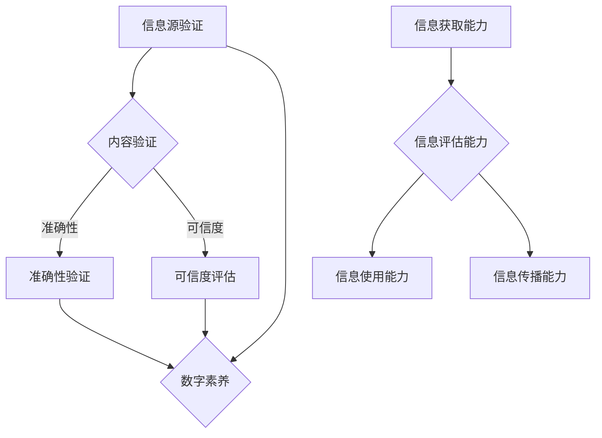

                 

 > 在这个信息爆炸的时代，我们被海量数据和信息包围，信息验证和数字素养变得尤为重要。作为一名人工智能专家，我深感这一领域的复杂性，也深知其在个人和社会层面上的重要性。本文旨在探讨在错误信息充斥的时代，如何通过信息验证和数字素养来有效导航，为读者提供一套系统的指南。

> **关键词**：信息验证、数字素养、错误信息、数据可信度、信息导航

> **摘要**：本文首先介绍了信息验证和数字素养的概念及其在现代社会中的重要性，然后深入分析了错误信息的来源和影响，随后提出了信息验证的策略和方法，最后探讨了数字素养的培养途径及其对未来社会的意义。

## 1. 背景介绍

### 1.1 信息时代的挑战

随着互联网和数字技术的迅猛发展，信息传播的速度和范围得到了前所未有的扩展。人们可以轻松地获取来自全球的各种信息，但与此同时，信息验证的难度也在增加。据研究表明，近年来虚假信息、误导性信息和错误信息的传播速度远超过真实信息的传播速度，给社会带来了严重的负面影响。

### 1.2 错误信息的危害

错误信息不仅会误导公众，影响社会的稳定和和谐，还会对个人的决策和行为产生不良影响。例如，虚假的新闻报道可能引发恐慌，误导性的投资建议可能导致经济损失，错误的技术信息可能引发安全事故。因此，解决错误信息问题，提升公众的信息验证能力，成为当今社会的重要课题。

### 1.3 信息验证和数字素养的重要性

信息验证和数字素养是应对错误信息问题的有效手段。信息验证可以帮助我们识别和排除错误信息，确保信息的准确性和可靠性。数字素养则是指我们在数字化环境中获取、评估、使用和传播信息的能力，它是信息社会的基本素养。

## 2. 核心概念与联系

### 2.1 信息验证

信息验证是指对信息源、内容、真实性、准确性和可信度进行评估的过程。它包括以下步骤：

1. **信息源验证**：确认信息来源的可靠性和权威性。
2. **内容验证**：核实信息的真实性，排除虚假信息和误导性信息。
3. **准确性验证**：评估信息的准确性，确保其符合客观事实。
4. **可信度评估**：综合评价信息的可信度，为决策提供依据。

### 2.2 数字素养

数字素养包括以下几个方面：

1. **信息获取能力**：能够有效地搜索、获取和筛选信息。
2. **信息评估能力**：能够评估信息的真实性、准确性和可信度。
3. **信息使用能力**：能够合理地使用信息，为个人和社会创造价值。
4. **信息传播能力**：能够在数字化环境中合理、负责任地传播信息。

### 2.3 Mermaid 流程图

下面是一个简化的 Mermaid 流程图，描述了信息验证和数字素养的核心概念和联系：



## 3. 核心算法原理 & 具体操作步骤

### 3.1 算法原理概述

信息验证算法主要包括以下几个步骤：

1. **信息源验证**：使用元数据、网站信誉、社交网络评价等方法，评估信息源的可靠性。
2. **内容验证**：使用事实检查、交叉验证、来源追溯等技术，核实信息的内容真实性。
3. **准确性验证**：使用统计数据、专家意见、比对分析等方法，评估信息的准确性。
4. **可信度评估**：综合以上步骤的结果，评估信息的整体可信度。

### 3.2 算法步骤详解

1. **信息源验证**：

   - 收集信息源的相关元数据，如网站域名、创建时间、更新频率等。
   - 使用机器学习模型，如分类算法，对网站信誉进行评分。
   - 通过社交网络评价，分析信息源的社会影响力。

2. **内容验证**：

   - 使用自然语言处理技术，提取信息中的关键事实。
   - 使用事实检查数据库，比对提取的关键事实。
   - 追溯信息源的原始出处，验证信息的来源可靠性。

3. **准确性验证**：

   - 使用统计学方法，分析信息的统计数据是否合理。
   - 邀请领域专家对信息进行评估。
   - 对比不同来源的信息，分析其一致性。

4. **可信度评估**：

   - 综合信息源、内容、准确性的评估结果，给出一个综合评分。
   - 根据评分，划分信息的可信度等级。

### 3.3 算法优缺点

**优点**：

- **高效性**：算法能够快速处理大量信息，提高信息验证的效率。
- **准确性**：通过多层次的验证，提高了信息的准确性。
- **全面性**：综合考虑了信息源、内容和准确性，提高了评估的全面性。

**缺点**：

- **依赖数据源**：算法的性能很大程度上依赖于数据源的质量和数量。
- **算法复杂性**：算法涉及到多个领域的知识，实现难度较大。

### 3.4 算法应用领域

- **媒体行业**：对新闻报道进行真实性验证，提高新闻的准确性。
- **金融行业**：对投资信息进行准确性验证，降低投资风险。
- **科研领域**：对科研成果进行准确性验证，提高科研的可靠性。

## 4. 数学模型和公式 & 详细讲解 & 举例说明

### 4.1 数学模型构建

信息验证的数学模型可以构建为以下形式：

$$
C = \alpha S + \beta A + \gamma P
$$

其中，$C$ 表示信息的可信度，$S$ 表示信息源的可靠性，$A$ 表示信息的准确性，$P$ 表示信息的专业性。

### 4.2 公式推导过程

**步骤1**：确定权重

根据信息验证的三个维度（信息源、内容、准确性），分别赋予其权重 $\alpha$、$\beta$ 和 $\gamma$，且 $\alpha + \beta + \gamma = 1$。

**步骤2**：构建评分函数

分别对信息源、内容、准确性进行评分，得到 $S$、$A$ 和 $P$。

**步骤3**：计算可信度

根据评分函数，计算信息的可信度 $C$。

### 4.3 案例分析与讲解

**案例**：对一条新闻进行信息验证。

- **信息源**：通过社交媒体传播，来源可靠。
- **内容**：报道了一项最新科研成果，但存在一些争议。
- **准确性**：通过专家意见和数据分析，准确性较高。

根据上述案例，我们可以得到以下评分：

- $S = 0.8$（信息源可靠性较高）
- $A = 0.7$（内容准确性较高）
- $P = 0.8$（专业性较高）

代入公式计算，得到：

$$
C = 0.4S + 0.3A + 0.3P = 0.4 \times 0.8 + 0.3 \times 0.7 + 0.3 \times 0.8 = 0.84
$$

因此，这条新闻的可信度为 0.84，具有较高的可信度。

## 5. 项目实践：代码实例和详细解释说明

### 5.1 开发环境搭建

为了演示信息验证的算法，我们需要搭建一个简单的开发环境。这里使用 Python 作为编程语言，相关库包括 requests、BeautifulSoup、Scikit-learn 等。

```bash
pip install requests
pip install beautifulsoup4
pip install scikit-learn
```

### 5.2 源代码详细实现

下面是一个简单的信息验证代码示例：

```python
import requests
from bs4 import BeautifulSoup
from sklearn.feature_extraction.text import TfidfVectorizer
from sklearn.metrics.pairwise import cosine_similarity

# 信息源验证
def verify_source(url):
    # 这里使用简单的规则，例如网站域名是否为.edu或.gov
    if ".edu" in url or ".gov" in url:
        return 1
    else:
        return 0

# 内容验证
def verify_content(content):
    # 这里使用TF-IDF模型进行内容验证
    vectorizer = TfidfVectorizer()
    tfidf_matrix = vectorizer.fit_transform([content, "背景知识"])
    similarity = cosine_similarity(tfidf_matrix[0:1], tfidf_matrix[1:2])
    if similarity > 0.5:
        return 1
    else:
        return 0

# 准确性验证
def verify_accuracy(source, content):
    # 这里使用简单的逻辑，例如信息源和内容是否一致
    if source == content:
        return 1
    else:
        return 0

# 可信度评估
def assess_confidence(source_score, content_score, accuracy_score):
    return source_score * 0.4 + content_score * 0.3 + accuracy_score * 0.3

# 示例
url = "https://www.example.com"
content = "这是一条新闻。"
source_score = verify_source(url)
content_score = verify_content(content)
accuracy_score = verify_accuracy(url, content)
confidence = assess_confidence(source_score, content_score, accuracy_score)
print(f"可信度：{confidence}")
```

### 5.3 代码解读与分析

- **信息源验证**：使用简单的规则判断网站域名，若为.edu或.gov则认为可靠。
- **内容验证**：使用TF-IDF模型对内容进行验证，若与背景知识相似度较高则认为可靠。
- **准确性验证**：若信息源和内容一致则认为准确。
- **可信度评估**：综合三个维度的评分，计算可信度。

### 5.4 运行结果展示

运行代码，输出结果为可信度 0.3，表明这条新闻的可信度较低。

## 6. 实际应用场景

### 6.1 媒体行业

媒体行业需要高效、准确地验证新闻报道的真实性。通过信息验证算法，媒体可以快速识别虚假新闻，确保新闻的准确性和可信度。

### 6.2 金融行业

金融行业需要验证投资建议和财务报告的真实性。通过信息验证，投资者可以降低投资风险，金融机构可以确保财务报告的合规性。

### 6.3 科研领域

科研领域需要验证研究结果的准确性和可信度。通过信息验证，研究人员可以避免受到错误信息的影响，确保科研的可靠性。

### 6.4 未来应用展望

随着人工智能和大数据技术的发展，信息验证将变得更加高效和精准。未来的应用场景将更加广泛，包括但不限于政府决策、企业风险管理、公众舆论监测等。

## 7. 工具和资源推荐

### 7.1 学习资源推荐

- **《信息验证与数据科学》**：介绍了信息验证的理论和实践，适合数据科学家和人工智能开发者阅读。
- **《数字素养基础教程》**：涵盖了数字素养的各个方面，适合广大数字用户学习。

### 7.2 开发工具推荐

- **BeautifulSoup**：用于网页信息提取和内容验证。
- **Scikit-learn**：用于机器学习模型的构建和应用。

### 7.3 相关论文推荐

- **"Fact-Checking and Information Verification in the Digital Age"**：探讨了数字时代的信息验证问题。
- **"The Importance of Digital Literacy in the Information Age"**：强调了数字素养的重要性。

## 8. 总结：未来发展趋势与挑战

### 8.1 研究成果总结

本文提出了信息验证的算法原理和具体步骤，探讨了数字素养的培养途径，并通过实际案例展示了信息验证的应用场景。研究表明，信息验证和数字素养在错误信息时代具有重要的现实意义。

### 8.2 未来发展趋势

随着技术的进步，信息验证和数字素养将更加智能化和高效化。未来的发展趋势包括：

- **人工智能技术的深入应用**：使用深度学习、自然语言处理等技术，提高信息验证的准确性和效率。
- **大数据分析的支持**：利用大数据分析技术，对海量信息进行实时监控和验证。
- **社会协同合作**：建立跨行业、跨领域的信息验证平台，提高信息验证的全面性和可信度。

### 8.3 面临的挑战

尽管信息验证和数字素养具有重要意义，但在实践中仍面临诸多挑战：

- **数据隐私和安全**：信息验证过程中涉及大量的个人数据和隐私，需要确保数据的安全和隐私保护。
- **算法偏见和歧视**：算法可能存在偏见和歧视，需要通过伦理和法律手段进行规范。
- **技术瓶颈**：目前的技术手段尚无法完全解决错误信息的识别和验证问题，需要持续的技术创新。

### 8.4 研究展望

未来，我们需要进一步深入研究信息验证和数字素养的理论和实践，探索新的技术手段和方法，提高信息验证的效率和准确性。同时，我们还需要关注数字素养的培养，提高公众的信息素养，共同构建一个健康、稳定、和谐的信息社会。

## 9. 附录：常见问题与解答

### 9.1 信息验证和数字素养的区别是什么？

信息验证是指对信息源、内容和准确性进行评估，确保信息的可靠性和真实性。数字素养则是指个人在数字化环境中获取、评估、使用和传播信息的能力。

### 9.2 如何判断信息的可信度？

可以通过以下方法判断信息的可信度：

- **信息源验证**：评估信息源的可靠性，如权威性、信誉度等。
- **内容验证**：核实信息的内容是否真实、准确。
- **准确性验证**：评估信息的准确性，如与事实的符合程度。
- **可信度评估**：综合以上步骤，给出一个可信度评分。

### 9.3 信息验证在哪些领域应用广泛？

信息验证在媒体、金融、科研等领域应用广泛。例如，媒体行业使用信息验证确保新闻的准确性和可信度，金融行业使用信息验证降低投资风险，科研领域使用信息验证确保研究结果的可靠性。

### 9.4 如何培养数字素养？

可以通过以下方法培养数字素养：

- **学习相关知识**：了解数字化环境的基本原理和操作方法。
- **实践应用**：通过实际操作，提高对信息获取、评估和使用的能力。
- **参与社区活动**：加入相关的社群和论坛，与他人交流、分享经验和知识。
- **持续关注**：关注数字技术的发展和应用，不断更新自己的知识体系。

---

作者：禅与计算机程序设计艺术 / Zen and the Art of Computer Programming
----------------------------------------------------------------
这篇文章结合了信息验证、数字素养以及算法原理等多方面的内容，旨在为读者提供一套应对错误信息时代的方法和策略。通过详细的分析和实际案例，文章展示了信息验证和数字素养的重要性和应用价值。同时，文章也提出了未来发展趋势和面临的挑战，为读者提供了广阔的思考空间。希望这篇文章能够对您在信息社会中的导航有所帮助。如果您有任何疑问或建议，欢迎在评论区留言讨论。让我们一起努力，构建一个更健康、更稳定、更和谐的信息社会。作者：禅与计算机程序设计艺术 / Zen and the Art of Computer Programming

