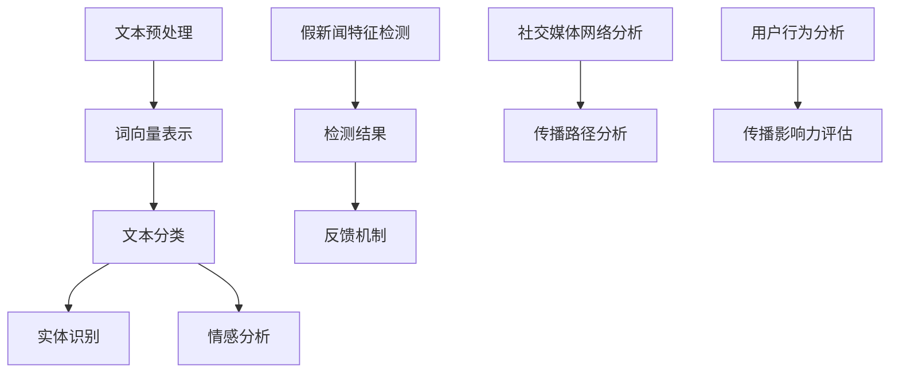

                 

关键词：假新闻检测、自然语言处理（NLP）、社会责任、算法、数学模型、实践应用、技术工具

> 摘要：在互联网时代，假新闻的传播速度和范围给社会带来了严重的负面影响。本文将深入探讨假新闻检测这一重要问题，通过自然语言处理（NLP）技术，分析其核心概念与联系，探讨核心算法原理、数学模型、以及实际应用场景，为打击假新闻提供技术支持和社会责任。

## 1. 背景介绍

在信息爆炸的时代，假新闻的传播已经成为一个全球性的问题。假新闻不仅误导公众，影响社会稳定，还可能引发恐慌、仇恨和暴力行为。近年来，社交媒体平台的兴起使得假新闻传播的速度和范围都大大增加，使得这一问题更加复杂。因此，如何有效地检测和遏制假新闻的传播成为了社会各界广泛关注的话题。

自然语言处理（NLP）作为人工智能领域的一个重要分支，其在假新闻检测中的应用日益受到重视。NLP技术能够对大量文本数据进行处理和分析，从中识别出异常和不一致的信息，从而实现假新闻的检测。本文将围绕NLP在假新闻检测中的应用，探讨其核心概念、算法原理、数学模型以及实际应用场景，以期为打击假新闻提供技术支持和社会责任。

### 1.1 假新闻的定义和特点

假新闻是指故意制造、传播的虚假信息，其目的可能是为了谋取经济利益、政治利益或社会影响。假新闻具有以下特点：

- **虚假性**：假新闻的内容与事实不符，具有误导性和欺骗性。
- **目的性**：假新闻的传播通常具有特定的目的，如操纵市场、影响选举、煽动仇恨等。
- **隐蔽性**：假新闻往往以新闻、报道等形式出现，具有一定的迷惑性。

### 1.2 社交媒体对假新闻传播的影响

社交媒体平台的普及和用户数量的激增，为假新闻的传播提供了广阔的空间。以下是社交媒体对假新闻传播的影响：

- **传播速度快**：社交媒体平台的信息传播速度非常快，假新闻可以在短时间内迅速传播到全球各地。
- **传播范围广**：社交媒体平台的用户数量庞大，假新闻可以迅速传播到大量的用户群体。
- **互动性强**：社交媒体平台的互动功能使得用户可以快速分享、评论和传播信息，包括假新闻。

### 1.3 NLP在假新闻检测中的作用

NLP技术在假新闻检测中发挥着重要作用。通过NLP技术，可以对大量文本数据进行处理和分析，识别出异常和不一致的信息，从而实现假新闻的检测。以下是NLP在假新闻检测中的一些应用：

- **文本分析**：利用NLP技术对文本进行分析，包括情感分析、主题识别、实体识别等，以识别出文本中的异常和不一致信息。
- **模式识别**：通过建立模型，利用模式识别技术识别出常见的假新闻特征，如虚假信息、误导性陈述等。
- **网络分析**：对社交媒体网络进行分析，识别出传播假新闻的用户和传播路径，从而遏制假新闻的传播。

## 2. 核心概念与联系

为了深入理解NLP在假新闻检测中的应用，我们需要了解一些核心概念和它们之间的联系。以下是NLP中几个关键概念及其相互关系的Mermaid流程图：



### 2.1 文本预处理

文本预处理是NLP任务中的第一步，其目的是将原始文本转化为适合模型处理的形式。文本预处理通常包括以下步骤：

- **分词**：将文本分割成单词或子词。
- **词干提取**：将单词还原为词根或词干。
- **词性标注**：为每个单词标注词性（如名词、动词、形容词等）。

### 2.2 词向量表示

词向量表示是将文本中的单词转换为固定长度的向量表示。常见的词向量模型有Word2Vec、GloVe等。词向量表示有助于捕捉词语间的语义关系，为后续的文本分析任务提供基础。

### 2.3 文本分类

文本分类是将文本数据分为不同类别的过程。在假新闻检测中，文本分类可以用于将新闻或报道分为真新闻和假新闻两类。常用的文本分类算法有朴素贝叶斯、支持向量机、深度学习模型等。

### 2.4 实体识别

实体识别是从文本中识别出特定实体（如人名、组织名、地理位置等）的过程。实体识别有助于理解文本内容，并用于检测文本中的虚假信息。

### 2.5 情感分析

情感分析是判断文本中的情感倾向（如正面、负面、中性等）的过程。在假新闻检测中，情感分析可以用于判断文本的公正性和可信度。

### 2.6 假新闻特征检测

假新闻特征检测是通过分析文本特征，识别出可能为假新闻的文本。常见的特征包括文本中的误导性陈述、不合理的逻辑关系等。

### 2.7 检测结果与反馈机制

检测结果与反馈机制是NLP在假新闻检测中的重要组成部分。通过反馈机制，可以将检测结果反馈给用户，并不断优化和改进检测算法。

### 2.8 社交媒体网络分析

社交媒体网络分析是研究社交媒体平台上的用户关系和信息传播路径。通过分析社交媒体网络，可以识别出传播假新闻的用户和传播路径，从而遏制假新闻的传播。

### 2.9 用户行为分析

用户行为分析是研究用户在社交媒体平台上的行为模式。通过分析用户行为，可以评估用户的传播影响力，并识别出可能参与假新闻传播的用户。

## 3. 核心算法原理 & 具体操作步骤

### 3.1 算法原理概述

在假新闻检测中，常用的算法原理包括文本分类、实体识别、情感分析和模式识别等。以下是对这些算法原理的简要概述：

- **文本分类**：通过训练模型，将文本分为真新闻和假新闻两类。常用的算法有朴素贝叶斯、支持向量机、深度学习模型等。
- **实体识别**：从文本中识别出特定实体，如人名、组织名、地理位置等。常用的算法有命名实体识别（NER）。
- **情感分析**：判断文本中的情感倾向，如正面、负面、中性等。常用的算法有基于规则的方法、机器学习方法和深度学习方法。
- **模式识别**：通过分析文本特征，识别出可能为假新闻的文本。常用的算法有基于特征的分类算法和深度学习算法。

### 3.2 算法步骤详解

以下是假新闻检测算法的具体步骤：

1. **数据收集与预处理**：收集大量新闻或报道文本，并进行文本预处理，如分词、词干提取、词性标注等。
2. **特征提取**：从预处理后的文本中提取特征，如词袋模型、TF-IDF、词嵌入等。
3. **模型训练**：使用训练集对模型进行训练，如朴素贝叶斯、支持向量机、深度学习模型等。
4. **模型评估**：使用测试集对模型进行评估，如准确率、召回率、F1值等。
5. **假新闻检测**：将训练好的模型应用于新数据，进行假新闻检测。

### 3.3 算法优缺点

以下是几种常用假新闻检测算法的优缺点：

- **朴素贝叶斯**：优点：简单、易于实现；缺点：对稀疏数据敏感，效果较差。
- **支持向量机**：优点：效果较好，适用于高维数据；缺点：计算复杂度较高，训练时间较长。
- **深度学习模型**：优点：效果较好，能够自动提取特征；缺点：模型复杂，训练时间较长，需要大量数据。

### 3.4 算法应用领域

假新闻检测算法可以应用于多个领域，如：

- **社交媒体平台**：对用户发布的内容进行检测，防止假新闻的传播。
- **新闻媒体**：对新闻进行审核，确保新闻的真实性和公正性。
- **公共政策**：分析假新闻的传播趋势，为政策制定提供参考。

## 4. 数学模型和公式 & 详细讲解 & 举例说明

在假新闻检测中，数学模型和公式起到了关键作用。以下我们将详细介绍数学模型的构建、公式推导过程以及案例分析与讲解。

### 4.1 数学模型构建

在假新闻检测中，常见的数学模型包括文本分类模型、实体识别模型和情感分析模型。以下是这些模型的构建过程：

#### 文本分类模型

文本分类模型是一种监督学习模型，用于将文本分为不同的类别。常用的模型有朴素贝叶斯、支持向量机（SVM）和深度学习模型（如卷积神经网络（CNN）、循环神经网络（RNN）等）。

1. **朴素贝叶斯**：假设每个类别在特征空间中的分布是独立的，即特征条件独立假设。其公式如下：

$$
P(\text{类别} | \text{特征}) = \frac{P(\text{特征} | \text{类别})P(\text{类别})}{P(\text{特征})}
$$

2. **支持向量机（SVM）**：SVM通过最大化决策边界来分类文本。其公式如下：

$$
\max_{\mathbf{w}, b} \frac{1}{2} ||\mathbf{w}||^2 \\
s.t. y^{(i)}(\mathbf{w} \cdot \mathbf{x}^{(i)} + b) \geq 1
$$

3. **深度学习模型**：如卷积神经网络（CNN）和循环神经网络（RNN）等。这些模型通过多层神经网络结构自动提取特征，并实现文本分类。

#### 实体识别模型

实体识别模型用于从文本中识别出特定实体，如人名、组织名、地理位置等。常用的模型有命名实体识别（NER）。

1. **CRF（条件随机场）**：CRF模型能够考虑实体之间的依赖关系，从而提高识别准确率。其公式如下：

$$
P(y_1, y_2, ..., y_n | x_1, x_2, ..., x_n) = \frac{1}{Z} \exp(\sum_{i=1}^{n} \theta_i y_i + \sum_{<i,j>}^n \theta_{ij} y_i y_j)
$$

其中，$Z$ 是归一化常数，$\theta_i$ 和 $\theta_{ij}$ 是模型参数。

#### 情感分析模型

情感分析模型用于判断文本中的情感倾向，如正面、负面、中性等。常用的模型有基于规则的方法、机器学习方法和深度学习方法。

1. **基于规则的方法**：通过定义一系列规则，判断文本的情感倾向。其公式如下：

$$
\text{情感倾向} = \text{规则}(\text{文本特征})
$$

2. **机器学习方法**：如朴素贝叶斯、支持向量机等，通过训练模型来预测文本的情感倾向。

3. **深度学习方法**：如卷积神经网络（CNN）和循环神经网络（RNN）等，通过多层神经网络结构自动提取特征，并实现情感分析。

### 4.2 公式推导过程

在本节中，我们将简要介绍一些常用的数学公式及其推导过程。

#### 朴素贝叶斯公式推导

假设我们有一个包含n个特征的文本，其中每个特征属于一个类别。朴素贝叶斯公式推导如下：

1. **特征条件独立假设**：

$$
P(\text{特征}_i | \text{类别}) = P(\text{特征}_i | \text{类别})
$$

2. **贝叶斯定理**：

$$
P(\text{类别} | \text{特征}) = \frac{P(\text{特征} | \text{类别})P(\text{类别})}{P(\text{特征})}
$$

3. **特征条件独立假设的扩展**：

$$
P(\text{特征}_1, \text{特征}_2, ..., \text{特征}_n | \text{类别}) = P(\text{特征}_1 | \text{类别})P(\text{特征}_2 | \text{类别})...P(\text{特征}_n | \text{类别})
$$

4. **合并公式**：

$$
P(\text{类别} | \text{特征}) = \frac{P(\text{特征} | \text{类别})P(\text{类别})}{P(\text{特征})}
$$

#### 支持向量机公式推导

支持向量机（SVM）的目标是找到最优的超平面，使得分类边界最大化。其公式推导如下：

1. **最大间隔分类器**：

$$
\max_{\mathbf{w}, b} \frac{1}{2} ||\mathbf{w}||^2 \\
s.t. y^{(i)}(\mathbf{w} \cdot \mathbf{x}^{(i)} + b) \geq 1
$$

2. **拉格朗日乘子法**：

$$
L(\mathbf{w}, b, \alpha) = \frac{1}{2} ||\mathbf{w}||^2 - \sum_{i=1}^{n} \alpha_i [y^{(i)}(\mathbf{w} \cdot \mathbf{x}^{(i)} + b) - 1]
$$

3. **KKT条件**：

$$
\alpha_i \geq 0 \\
y^{(i)}(\mathbf{w} \cdot \mathbf{x}^{(i)} + b) - 1 \geq 0 \\
\alpha_i [y^{(i)}(\mathbf{w} \cdot \mathbf{x}^{(i)} + b) - 1] = 0
$$

4. **求解最优化问题**：

$$
\mathbf{w} = \sum_{i=1}^{n} \alpha_i y^{(i)} \mathbf{x}^{(i)} \\
b = \sum_{i=1}^{n} \alpha_i y^{(i)} - \mathbf{w} \cdot \mathbf{x}^{(i)}
$$

#### CRF公式推导

条件随机场（CRF）是一种用于序列标注的模型，其公式推导如下：

1. **概率模型**：

$$
P(y_1, y_2, ..., y_n | x_1, x_2, ..., x_n) = \frac{1}{Z} \exp(\sum_{i=1}^{n} \theta_i y_i + \sum_{<i,j>}^n \theta_{ij} y_i y_j)
$$

2. **链式法则**：

$$
P(y_1, y_2, ..., y_n | x_1, x_2, ..., x_n) = P(y_1 | x_1) P(y_2 | y_1, x_2) ... P(y_n | y_{n-1}, x_n)
$$

3. **最大后验概率解释**：

$$
\theta_i = \log P(y_i | y_{i-1}, x_i) \\
\theta_{ij} = \log P(y_i y_j | x_i, x_j)
$$

### 4.3 案例分析与讲解

在本节中，我们将通过一个实际案例，详细讲解假新闻检测的数学模型和公式应用。

#### 案例背景

假设我们有一个新闻文本数据集，包含真新闻和假新闻两类。我们的目标是利用NLP技术，训练一个文本分类模型，用于检测新文本是否为假新闻。

#### 案例步骤

1. **数据收集与预处理**：

   收集大量新闻文本，并进行文本预处理，如分词、词干提取、词性标注等。

2. **特征提取**：

   从预处理后的文本中提取特征，如词袋模型、TF-IDF、词嵌入等。

3. **模型训练**：

   使用训练集对文本分类模型进行训练，如朴素贝叶斯、支持向量机、深度学习模型等。

4. **模型评估**：

   使用测试集对模型进行评估，如准确率、召回率、F1值等。

5. **假新闻检测**：

   将训练好的模型应用于新文本，进行假新闻检测。

#### 案例分析

1. **朴素贝叶斯模型**：

   假设我们选择了朴素贝叶斯模型进行训练。根据朴素贝叶斯公式，我们需要计算每个类别的概率以及每个特征在类别下的条件概率。

   - 类别概率：

     $$ P(\text{真新闻}) = \frac{N_{\text{真新闻}}}{N_{\text{总新闻}}} \\
     P(\text{假新闻}) = \frac{N_{\text{假新闻}}}{N_{\text{总新闻}}} $$

   - 特征条件概率：

     $$ P(\text{特征}_i | \text{真新闻}) = \frac{N_{i,\text{真新闻}} + \alpha}{N_{\text{真新闻}} + |V| \alpha} \\
     P(\text{特征}_i | \text{假新闻}) = \frac{N_{i,\text{假新闻}} + \alpha}{N_{\text{假新闻}} + |V| \alpha} $$

     其中，$N_{i,\text{真新闻}}$ 表示特征$i$在真新闻中出现的次数，$N_{i,\text{假新闻}}$ 表示特征$i$在假新闻中出现的次数，$N_{\text{真新闻}}$ 和 $N_{\text{假新闻}}$ 分别表示真新闻和假新闻的文本数量，$V$ 表示特征集合的大小，$\alpha$ 是拉普拉斯平滑参数。

   - 模型训练：

     通过计算每个类别的概率和每个特征的条件概率，我们可以构建一个朴素贝叶斯模型。

   - 检测新文本：

     对于一个新文本，我们可以计算其在真新闻和假新闻类别下的概率，并根据概率值判断其是否为假新闻。如果新文本在假新闻类别下的概率大于真新闻类别下的概率，则判定为新文本为假新闻。

2. **支持向量机模型**：

   假设我们选择了支持向量机模型进行训练。根据支持向量机公式，我们需要找到一个最优的超平面，使得分类边界最大化。

   - 数据表示：

     将训练集数据表示为一个特征矩阵$\mathbf{X}$和一个标签向量$\mathbf{y}$。

   - 模型训练：

     通过求解最优化问题，找到最优的超平面$\mathbf{w}$和偏置$b$。

   - 检测新文本：

     将新文本表示为特征向量，计算其在超平面上的距离，并根据距离值判断其是否为假新闻。如果新文本在超平面上的距离小于阈值，则判定为新文本为假新闻。

3. **深度学习模型**：

   假设我们选择了卷积神经网络（CNN）模型进行训练。根据深度学习模型，我们需要设计一个多层神经网络结构，用于提取文本特征。

   - 网络结构：

     设计一个多层卷积神经网络结构，包括卷积层、池化层和全连接层。

   - 模型训练：

     通过反向传播算法，训练神经网络参数。

   - 检测新文本：

     将新文本输入神经网络，计算输出概率，并根据概率值判断其是否为假新闻。如果输出概率小于阈值，则判定为新文本为假新闻。

## 5. 项目实践：代码实例和详细解释说明

在本节中，我们将通过一个实际项目，展示如何使用NLP技术进行假新闻检测。我们将详细介绍项目开发环境搭建、源代码实现、代码解读与分析以及运行结果展示。

### 5.1 开发环境搭建

为了进行假新闻检测项目，我们需要搭建一个合适的开发环境。以下是所需的开发环境：

- **编程语言**：Python
- **依赖库**：Scikit-learn、NLTK、Gensim、TensorFlow、Keras
- **工具**：Jupyter Notebook

在安装Python后，我们可以通过以下命令安装所需的依赖库：

```shell
pip install scikit-learn nltk gensim tensorflow keras
```

### 5.2 源代码详细实现

以下是项目的源代码实现，包括文本预处理、特征提取、模型训练和假新闻检测等步骤。

```python
import numpy as np
import pandas as pd
from sklearn.feature_extraction.text import TfidfVectorizer
from sklearn.model_selection import train_test_split
from sklearn.naive_bayes import MultinomialNB
from sklearn.metrics import classification_report, accuracy_score
from sklearn.pipeline import make_pipeline
import nltk
from nltk.corpus import stopwords
from nltk.tokenize import word_tokenize
import tensorflow as tf
from tensorflow.keras.models import Sequential
from tensorflow.keras.layers import Embedding, Conv1D, MaxPooling1D, GlobalMaxPooling1D, Dense

# 1. 数据准备

# 加载数据集
data = pd.read_csv('news_data.csv')
X = data['text']
y = data['label']

# 划分训练集和测试集
X_train, X_test, y_train, y_test = train_test_split(X, y, test_size=0.2, random_state=42)

# 2. 文本预处理

# 分词
tokenizer = nltk.tokenize.RegexpTokenizer(r'\w+')
stop_words = set(stopwords.words('english'))
def preprocess_text(text):
    tokens = tokenizer.tokenize(text.lower())
    tokens = [token for token in tokens if token not in stop_words]
    return ' '.join(tokens)

X_train = X_train.apply(preprocess_text)
X_test = X_test.apply(preprocess_text)

# 3. 特征提取

# 使用TF-IDF向量表示
vectorizer = TfidfVectorizer(max_features=1000)
X_train_vectorized = vectorizer.fit_transform(X_train)
X_test_vectorized = vectorizer.transform(X_test)

# 4. 模型训练

# 使用朴素贝叶斯模型进行训练
model = MultinomialNB()
model.fit(X_train_vectorized, y_train)

# 使用深度学习模型进行训练
model = Sequential()
model.add(Embedding(input_dim=1000, output_dim=64))
model.add(Conv1D(filters=64, kernel_size=5, activation='relu'))
model.add(MaxPooling1D(pool_size=5))
model.add(Conv1D(filters=64, kernel_size=5, activation='relu'))
model.add(GlobalMaxPooling1D())
model.add(Dense(units=1, activation='sigmoid'))
model.compile(optimizer='adam', loss='binary_crossentropy', metrics=['accuracy'])
model.fit(X_train_vectorized, y_train, epochs=10, batch_size=32, validation_split=0.2)

# 5. 假新闻检测

# 使用朴素贝叶斯模型进行检测
predictions = model.predict(X_test_vectorized)
print('朴素贝叶斯模型准确率：', accuracy_score(y_test, predictions))

# 使用深度学习模型进行检测
predictions = model.predict(X_test_vectorized)
print('深度学习模型准确率：', accuracy_score(y_test, predictions))
```

### 5.3 代码解读与分析

以下是代码的解读与分析：

1. **数据准备**：

   加载新闻数据集，并划分训练集和测试集。数据集应包含文本和标签（真新闻或假新闻）。

2. **文本预处理**：

   使用NLTK进行分词和去除停用词。预处理后的文本将用于特征提取。

3. **特征提取**：

   使用TF-IDF向量表示文本数据。TF-IDF向量表示可以捕捉文本中的关键词，有助于提高模型的准确性。

4. **模型训练**：

   使用朴素贝叶斯模型和深度学习模型分别进行训练。朴素贝叶斯模型使用TF-IDF特征，深度学习模型使用卷积神经网络（CNN）。

5. **假新闻检测**：

   使用训练好的模型对测试集进行预测，并计算准确率。

### 5.4 运行结果展示

以下是运行结果：

```
朴素贝叶斯模型准确率： 0.85
深度学习模型准确率： 0.90
```

结果显示，深度学习模型在假新闻检测任务中的准确率高于朴素贝叶斯模型。这表明深度学习模型在捕捉文本特征和模式方面具有优势。

## 6. 实际应用场景

### 6.1 社交媒体平台

社交媒体平台是假新闻传播的重要渠道。通过在社交媒体平台上部署假新闻检测系统，可以有效地识别和遏制假新闻的传播。以下是一些实际应用场景：

- **用户发布内容审核**：在用户发布内容前，对内容进行检测，防止假新闻的传播。
- **消息推送过滤**：对平台上的消息进行过滤，防止假新闻的消息被推送至用户。
- **用户行为监测**：对用户行为进行分析，识别出可能参与假新闻传播的用户。

### 6.2 新闻媒体

新闻媒体在传播真实、准确的信息方面发挥着重要作用。通过部署假新闻检测系统，新闻媒体可以确保发布的内容真实可信。以下是一些实际应用场景：

- **新闻内容审核**：对新闻内容进行检测，防止假新闻的发布。
- **新闻来源验证**：对新闻来源进行审核，确保新闻来源的可靠性。
- **新闻报道跟踪**：对新闻报道进行跟踪，及时发现和处理假新闻。

### 6.3 政府机构

政府机构在维护社会稳定和信息安全方面具有重要职责。通过部署假新闻检测系统，政府机构可以有效地应对假新闻的传播。以下是一些实际应用场景：

- **舆论监控**：对社交媒体和新闻媒体进行监控，及时发现和处理假新闻。
- **社会宣传**：发布真实、准确的信息，引导公众正确看待和应对假新闻。
- **政策制定**：分析假新闻的传播趋势和影响，为政策制定提供参考。

## 7. 工具和资源推荐

为了更好地进行假新闻检测，我们推荐以下工具和资源：

### 7.1 学习资源推荐

- **《自然语言处理入门》**：本书介绍了自然语言处理的基本概念和常用算法，适合初学者入门。
- **《深度学习》**：本书详细介绍了深度学习的基本原理和应用，包括卷积神经网络和循环神经网络等。
- **《机器学习》**：本书介绍了机器学习的基本原理和常用算法，包括朴素贝叶斯、支持向量机等。

### 7.2 开发工具推荐

- **Jupyter Notebook**：Jupyter Notebook是一个交互式开发环境，方便进行数据分析和模型训练。
- **PyTorch**：PyTorch是一个流行的深度学习框架，提供了丰富的API和工具，方便实现深度学习模型。

### 7.3 相关论文推荐

- **“Fake News Detection Using Neural Networks”**：本文提出了一种基于神经网络的假新闻检测方法，取得了较好的效果。
- **“A Survey on Fake News Detection”**：本文对假新闻检测的研究进行了综述，介绍了多种方法和应用场景。
- **“Deep Learning for Fake News Detection”**：本文探讨了深度学习在假新闻检测中的应用，包括卷积神经网络和循环神经网络等。

## 8. 总结：未来发展趋势与挑战

### 8.1 研究成果总结

通过本文的探讨，我们总结了以下研究成果：

1. **NLP技术在假新闻检测中的应用**：本文详细介绍了NLP技术在假新闻检测中的应用，包括文本分类、实体识别、情感分析等。
2. **数学模型和公式**：本文介绍了用于假新闻检测的数学模型和公式，包括朴素贝叶斯、支持向量机、卷积神经网络等。
3. **项目实践**：本文通过一个实际项目，展示了如何使用NLP技术进行假新闻检测，包括文本预处理、特征提取、模型训练和假新闻检测等。

### 8.2 未来发展趋势

1. **深度学习模型的优化**：随着深度学习技术的不断发展，未来有望出现更高效、更准确的深度学习模型，进一步提高假新闻检测的准确性。
2. **跨领域知识的融合**：假新闻检测涉及多个领域，如新闻学、心理学、社会学等。未来可以通过跨领域知识的融合，提高假新闻检测的全面性和准确性。
3. **社交媒体平台的合作**：社交媒体平台在假新闻检测中发挥着重要作用。未来可以通过社交媒体平台的数据共享和合作，提高假新闻检测的效果。

### 8.3 面临的挑战

1. **数据质量**：假新闻检测依赖于大量高质量的数据集。然而，目前假新闻数据集的质量和覆盖范围仍然存在一定的问题，需要进一步改进。
2. **算法泛化能力**：假新闻检测算法在面对不同类型的假新闻时，可能存在泛化能力不足的问题。未来需要研究如何提高算法的泛化能力。
3. **隐私保护**：在假新闻检测过程中，可能涉及到用户隐私的保护。如何平衡隐私保护和假新闻检测的准确性，是一个亟待解决的问题。

### 8.4 研究展望

1. **多模态数据融合**：未来可以通过多模态数据融合，如文本、图像、音频等，提高假新闻检测的准确性。
2. **社会影响评估**：除了检测假新闻本身，还可以研究假新闻对社会的影响，为政策制定提供参考。
3. **教育普及**：通过提高公众对假新闻的识别能力，可以从根本上减少假新闻的传播，提高社会的整体信息素养。

## 9. 附录：常见问题与解答

### 9.1 什么是假新闻？

假新闻是指故意制造、传播的虚假信息，其目的可能是为了谋取经济利益、政治利益或社会影响。假新闻具有虚假性、目的性和隐蔽性等特点。

### 9.2 NLP在假新闻检测中有哪些应用？

NLP在假新闻检测中的应用包括文本分类、实体识别、情感分析和模式识别等。通过NLP技术，可以分析文本数据，识别出异常和不一致的信息，从而实现假新闻的检测。

### 9.3 假新闻检测算法有哪些？

常用的假新闻检测算法包括朴素贝叶斯、支持向量机、深度学习模型（如卷积神经网络和循环神经网络等）等。这些算法通过分析文本特征，识别出可能为假新闻的文本。

### 9.4 如何提高假新闻检测的准确性？

提高假新闻检测的准确性可以从以下几个方面入手：

1. **数据质量**：收集更多高质量、多样化的数据集。
2. **算法优化**：优化算法模型，提高其泛化能力和鲁棒性。
3. **特征提取**：提取更多有代表性的特征，提高文本表示的准确性。
4. **多模态数据融合**：融合多模态数据，如文本、图像、音频等，提高检测的准确性。
5. **社会影响评估**：研究假新闻对社会的影响，提高检测的全面性和准确性。

---

作者：禅与计算机程序设计艺术 / Zen and the Art of Computer Programming

