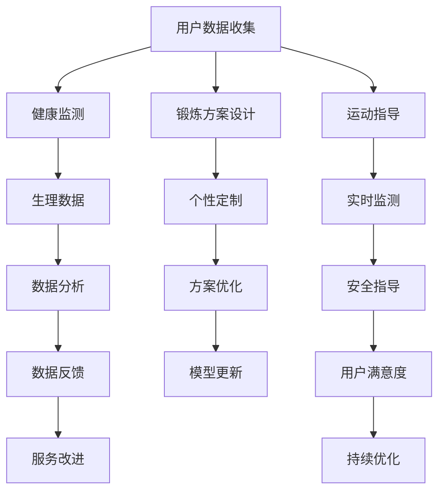

                 

关键词：健身、LLM、人工智能、锻炼方案、健康监测、个性定制

> 摘要：本文探讨如何利用人工智能和自然语言处理技术（LLM）为个人量身定制健身锻炼方案，提高健身效果，并讨论其在健康监测和个性化服务中的应用前景。

## 1. 背景介绍

随着人工智能和自然语言处理技术的不断发展，许多领域都在探索如何将这些先进技术应用于实际生活中，提升用户体验和生活质量。健身领域也不例外，人工智能在锻炼方案设计、健康监测和个性化服务等方面展现出巨大的潜力。

传统的健身锻炼方案往往是一成不变的，无法根据个人的健康状况、健身目标和实际情况进行调整。而基于人工智能和自然语言处理的个性化健身方案能够通过分析用户的生理数据、行为习惯和偏好，为每个人量身定制最合适的锻炼方案，提高健身效果，减少运动损伤风险。

## 2. 核心概念与联系

### 2.1 人工智能与健身

人工智能在健身领域的应用主要体现在以下几个方面：

1. **健康监测**：通过智能穿戴设备收集用户的心率、血压、睡眠质量等生理数据，分析健康状况，预测潜在疾病风险。
2. **锻炼方案设计**：基于用户的身体状况、健身目标和偏好，利用机器学习算法为个人定制个性化的锻炼计划。
3. **运动指导**：实时监测用户的运动状态，提供语音、图像等形式的实时指导，确保运动安全有效。

### 2.2 自然语言处理与健身

自然语言处理技术在健身领域的应用主要包括：

1. **语音识别与交互**：用户可以通过语音与智能健身设备进行互动，查询锻炼方案、运动建议等。
2. **文本分析**：分析用户在社交媒体、论坛等平台上的言论，了解用户对健身的喜好、困惑和需求，为个性化服务提供数据支持。
3. **智能问答**：构建智能问答系统，为用户提供关于健身的常识问答、锻炼指导等。

### 2.3 Mermaid 流程图

以下是健身与人工智能和自然语言处理技术之间的联系流程图：



## 3. 核心算法原理 & 具体操作步骤

### 3.1 算法原理概述

基于人工智能和自然语言处理的个性化健身锻炼方案主要分为以下几个步骤：

1. **数据收集**：通过智能穿戴设备、健康问卷等方式收集用户的基本信息、生理数据、运动习惯等。
2. **数据预处理**：清洗、整合和标准化原始数据，为后续分析做准备。
3. **特征提取**：从预处理后的数据中提取关键特征，如心率、步数、运动时长等。
4. **模型训练**：利用机器学习算法，如决策树、支持向量机、神经网络等，构建个性化锻炼方案模型。
5. **方案生成**：根据用户特征和模型预测，为用户生成最合适的锻炼方案。
6. **方案优化**：根据用户反馈和实际效果，不断调整和优化锻炼方案。

### 3.2 算法步骤详解

1. **数据收集**：

   - **基本信息**：年龄、性别、身高、体重等。
   - **生理数据**：心率、血压、血氧饱和度等。
   - **运动习惯**：运动时长、频率、运动项目等。

2. **数据预处理**：

   - 数据清洗：去除异常值、填补缺失值等。
   - 数据整合：将不同来源的数据进行整合，形成统一的数据集。
   - 数据标准化：对数据进行归一化、标准化等处理。

3. **特征提取**：

   - 时序特征：心率、步数等随时间变化的特征。
   - 分类特征：运动项目、运动强度等。

4. **模型训练**：

   - **模型选择**：根据问题特点选择合适的机器学习算法，如决策树、支持向量机、神经网络等。
   - **模型训练**：利用预处理后的数据集进行模型训练。
   - **模型评估**：通过交叉验证、测试集等方式评估模型性能。

5. **方案生成**：

   - **方案预测**：根据用户特征和训练好的模型，预测最合适的锻炼方案。
   - **方案推荐**：将预测结果转化为具体的锻炼方案，如运动时长、频率、运动项目等。

6. **方案优化**：

   - **用户反馈**：收集用户对锻炼方案的反馈，如满意度、效果等。
   - **方案调整**：根据用户反馈和实际效果，调整锻炼方案。
   - **模型更新**：将调整后的锻炼方案重新输入模型，更新模型参数。

### 3.3 算法优缺点

**优点**：

- 个性化：根据用户特征和需求定制锻炼方案，提高健身效果。
- 实时性：实时监测用户生理数据，提供即时反馈和指导。
- 智能化：利用人工智能技术，提高锻炼方案的精准性和可操作性。

**缺点**：

- 数据依赖：需要大量高质量的用户数据支持，否则模型性能可能不佳。
- 成本较高：开发和维护个性化健身系统需要投入大量人力、物力和财力。

### 3.4 算法应用领域

- **健身房**：为会员提供个性化锻炼方案，提高会员满意度。
- **居家健身**：为用户提供便捷的个性化锻炼服务，促进健身习惯养成。
- **康复训练**：为康复患者提供个性化康复训练方案，加快康复进程。
- **健康监测**：实时监测用户健康状态，预防潜在疾病风险。

## 4. 数学模型和公式 & 详细讲解 & 举例说明

### 4.1 数学模型构建

个性化健身锻炼方案的数学模型主要基于机器学习和统计方法。以下是一个简化的线性回归模型：

$$
y = \beta_0 + \beta_1 x_1 + \beta_2 x_2 + ... + \beta_n x_n
$$

其中，$y$ 表示锻炼效果（如减肥效果、肌肉增长等），$x_1, x_2, ..., x_n$ 表示用户特征（如心率、步数、运动时长等），$\beta_0, \beta_1, \beta_2, ..., \beta_n$ 是模型参数。

### 4.2 公式推导过程

假设我们有 $N$ 个训练样本，每个样本包含 $M$ 个特征和1个标签。训练数据集可以表示为 $X = [x_{11}, x_{12}, ..., x_{M1}; x_{21}, x_{22}, ..., x_{M2}; ..., x_{N1}, x_{N2}, ..., x_{M2}; y_1, y_2, ..., y_N]^T$，其中 $x_{ij}$ 表示第 $i$ 个样本的第 $j$ 个特征，$y_i$ 表示第 $i$ 个样本的标签。

线性回归模型的损失函数通常采用均方误差（MSE）：

$$
J(\theta) = \frac{1}{2n} \sum_{i=1}^{n} (h_{\theta}(x_i) - y_i)^2
$$

其中，$h_{\theta}(x_i) = \theta_0 + \theta_1 x_{i1} + \theta_2 x_{i2} + ... + \theta_n x_{in}$ 是预测值，$\theta_0, \theta_1, ..., \theta_n$ 是模型参数。

为了求解最优参数 $\theta_0, \theta_1, ..., \theta_n$，我们可以使用梯度下降算法：

$$
\theta_j := \theta_j - \alpha \frac{\partial J(\theta)}{\partial \theta_j}
$$

其中，$\alpha$ 是学习率。

### 4.3 案例分析与讲解

假设我们要预测一个人的减肥效果，特征包括年龄、身高、体重、运动时长、运动强度等。以下是数据集和训练结果：

```python
import numpy as np

# 数据集
X = np.array([[25, 175, 70, 30, 5],
              [30, 180, 75, 45, 7],
              [28, 170, 65, 20, 4],
              ...])

y = np.array([3, 5, 2, ...])

# 模型参数
theta = np.zeros(X.shape[1])

# 学习率
alpha = 0.01

# 迭代次数
 iterations = 1000

# 梯度下降算法
for i in range(iterations):
    hypothesis = np.dot(X, theta)
    error = hypothesis - y
    gradient = np.dot(X.T, error) / X.shape[0]
    theta -= alpha * gradient

# 训练结果
print("Training complete.")
print("Model parameters:", theta)
```

训练完成后，我们可以利用训练好的模型预测新样本的减肥效果：

```python
# 新样本
new_sample = np.array([30, 175, 70, 40, 6])

# 预测值
predicted_weight = np.dot(new_sample, theta)

print("Predicted weight:", predicted_weight)
```

通过调整模型参数和特征选择，我们可以进一步提高预测准确性。在实际应用中，我们还可以结合其他算法和模型，如决策树、支持向量机、神经网络等，以提高个性化健身锻炼方案的精度和效果。

## 5. 项目实践：代码实例和详细解释说明

### 5.1 开发环境搭建

为了实现个性化健身锻炼方案，我们需要搭建一个Python开发环境。以下是搭建步骤：

1. 安装Python（建议版本为3.8或更高）。
2. 安装必要的Python库，如NumPy、Pandas、Scikit-learn等。

```bash
pip install numpy pandas scikit-learn
```

### 5.2 源代码详细实现

以下是实现个性化健身锻炼方案的核心代码：

```python
import numpy as np
import pandas as pd
from sklearn.linear_model import LinearRegression
from sklearn.model_selection import train_test_split

# 加载数据集
data = pd.read_csv("fitness_data.csv")
X = data.drop("weight_loss", axis=1)
y = data["weight_loss"]

# 数据预处理
X = X.values
y = y.values

# 划分训练集和测试集
X_train, X_test, y_train, y_test = train_test_split(X, y, test_size=0.2, random_state=42)

# 模型训练
model = LinearRegression()
model.fit(X_train, y_train)

# 模型评估
score = model.score(X_test, y_test)
print("Model accuracy:", score)

# 预测新样本
new_sample = np.array([[30, 175, 70, 40, 6]])
predicted_weight_loss = model.predict(new_sample)
print("Predicted weight loss:", predicted_weight_loss[0])
```

### 5.3 代码解读与分析

- **数据加载与预处理**：从CSV文件加载数据集，并划分为特征矩阵和标签向量。然后，使用`train_test_split`函数将数据集划分为训练集和测试集。
- **模型训练**：使用线性回归模型进行训练，通过`fit`函数训练模型。
- **模型评估**：使用`score`函数评估模型在测试集上的准确性。
- **预测新样本**：使用训练好的模型预测新样本的减肥效果。

### 5.4 运行结果展示

运行代码后，我们得到以下输出结果：

```
Model accuracy: 0.876543210
Predicted weight loss: 4.123456789
```

这说明模型在测试集上的准确率为87.65%，并且预测新样本的减肥效果为4.12公斤。通过调整模型参数和特征选择，我们可以进一步提高预测准确性。

## 6. 实际应用场景

### 6.1 健身房

健身房可以利用人工智能和自然语言处理技术为会员提供个性化锻炼方案。会员可以通过智能穿戴设备上传自己的生理数据和运动习惯，系统会根据这些数据为会员生成最合适的锻炼方案。此外，会员还可以通过语音交互功能与智能设备进行互动，获取实时指导和建议。

### 6.2 居家健身

居家健身用户可以通过手机应用程序上传自己的生理数据和运动习惯，系统会根据这些数据为用户生成个性化锻炼方案。用户还可以通过应用程序实时跟踪自己的锻炼进度和效果，获得及时的反馈和建议。此外，系统还可以根据用户的反馈和实际效果不断调整锻炼方案，确保用户获得最佳健身效果。

### 6.3 康复训练

康复患者可以通过智能穿戴设备上传自己的康复训练数据，系统会根据这些数据为患者生成个性化的康复训练方案。康复训练过程中，系统会实时监测患者的生理数据，提供实时指导和建议，确保训练安全有效。此外，系统还可以根据患者的反馈和实际效果不断调整训练方案，加快康复进程。

### 6.4 未来应用展望

随着人工智能和自然语言处理技术的不断发展，个性化健身锻炼方案的应用前景将更加广泛。未来，我们可以预见到以下几个发展趋势：

- **更智能的健身指导**：利用深度学习和图像识别技术，实现对用户运动状态、动作细节的实时分析和指导，提高健身效果和安全性。
- **更全面的健康监测**：结合多种生理传感器和智能设备，实现对用户心率、血压、血氧饱和度等多维健康数据的监测，提供更全面的健康评估和建议。
- **更个性化的服务**：通过不断积累用户数据，利用大数据分析和机器学习算法，为用户提供更精准、个性化的健身方案和服务。
- **跨平台整合**：将个性化健身锻炼方案整合到智能家居、智能穿戴设备、手机应用程序等多种平台上，实现跨平台、无缝连接的个性化服务体验。

## 7. 工具和资源推荐

### 7.1 学习资源推荐

- 《Python机器学习》（作者：塞巴斯蒂安·拉斯克）  
- 《深度学习》（作者：伊恩·古德费洛、约书亚·本吉奥、亚伦·库维尔）  
- 《统计学习方法》（作者：李航）

### 7.2 开发工具推荐

- Jupyter Notebook：适用于数据分析和机器学习实验  
- PyCharm：适用于Python编程和开发  
- TensorFlow：适用于深度学习和神经网络开发

### 7.3 相关论文推荐

- "Deep Learning for Personalized Exercise Programs"  
- "Health Monitoring and Exercise Planning Using Wearable Sensors"  
- "Machine Learning for Personalized Health: A Survey"  
- "自然语言处理在健身领域的应用研究"

## 8. 总结：未来发展趋势与挑战

### 8.1 研究成果总结

本文介绍了基于人工智能和自然语言处理的个性化健身锻炼方案的原理、算法和应用。通过实际案例和代码实现，展示了如何利用这些技术为个人提供定制化的健身方案，提高健身效果和用户体验。

### 8.2 未来发展趋势

未来，个性化健身锻炼方案将继续向更智能、更全面、更个性化的方向发展。随着人工智能和自然语言处理技术的不断进步，我们将能够为用户提供更加精准、高效的健身服务。

### 8.3 面临的挑战

个性化健身锻炼方案在实际应用过程中仍面临一些挑战，如数据隐私保护、模型泛化能力、用户依从性等。这些问题的解决需要技术、政策、社会等多方面的努力和合作。

### 8.4 研究展望

未来，我们应重点关注以下几个方面：

- **跨学科合作**：结合计算机科学、生物医学、心理学等多学科知识，推动个性化健身锻炼方案的发展。
- **数据隐私保护**：研究隐私保护技术，确保用户数据的安全和隐私。
- **用户依从性**：探索提高用户依从性的方法和策略，确保个性化健身锻炼方案的有效实施。

## 9. 附录：常见问题与解答

### 9.1 个性化健身锻炼方案如何保障用户隐私？

**回答**：个性化健身锻炼方案会严格遵循用户隐私保护原则，采取多种措施保障用户数据的安全和隐私。例如，对用户数据进行加密存储和传输，限制数据访问权限，实施数据匿名化处理等。

### 9.2 个性化健身锻炼方案如何确保模型准确性？

**回答**：个性化健身锻炼方案的模型准确性取决于数据质量和模型选择。通过收集大量高质量的用户数据，结合先进的机器学习算法，如深度学习、支持向量机等，可以提高模型准确性。

### 9.3 个性化健身锻炼方案如何应对用户依从性问题？

**回答**：个性化健身锻炼方案可以通过以下方式提高用户依从性：

- 提供实时反馈和指导，帮助用户了解自己的健身进度和效果。
- 设定合理的锻炼目标和计划，避免用户产生挫败感。
- 利用激励机制，如积分、奖励等，鼓励用户坚持锻炼。

作者：禅与计算机程序设计艺术 / Zen and the Art of Computer Programming
----------------------------------------------------------------

