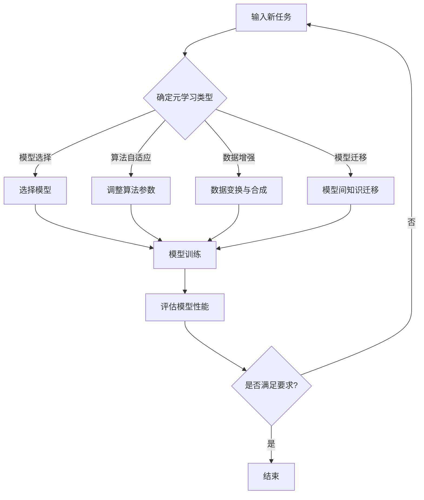

                 

关键词：元学习，自然语言处理，NLP，快速适应，任务学习

>摘要：本文深入探讨了元学习在自然语言处理（NLP）领域的应用，特别是如何通过元学习技术实现快速适应新任务。我们将从背景介绍、核心概念、算法原理、数学模型、项目实践、应用场景、未来展望等方面，全面解析元学习在NLP中的重要作用及其挑战。

## 1. 背景介绍

随着互联网和大数据技术的发展，自然语言处理（NLP）已经成为计算机科学和人工智能领域的一个重要分支。从最初的基于规则的方法，到基于统计和机器学习的方法，NLP技术不断进步，为各种实际应用场景提供了强大的支持，如文本分类、机器翻译、情感分析等。然而，传统的机器学习方法在面对新任务时，往往需要大量数据进行重新训练，这在时间和计算资源上都是一种浪费。

为了解决这一问题，元学习（Meta-Learning）逐渐成为研究热点。元学习是一种机器学习方法，旨在通过学习如何学习，从而提高算法在未知或新任务上的适应能力。具体来说，元学习算法能够在有限的数据上快速适应新任务，从而减少对大规模标注数据的依赖。

在NLP领域，元学习的应用尤为重要。因为自然语言的高度多样性和复杂性，使得NLP任务通常需要大量的训练数据。而元学习技术能够通过在少量数据上快速训练，实现对未知任务的有效适应，从而极大地提高了NLP模型的效率和泛化能力。

## 2. 核心概念与联系

### 2.1. 元学习的定义与分类

元学习，又称学习如何学习，是一种机器学习方法，旨在提高算法对新任务的适应能力。根据学习目标的不同，元学习可以划分为以下几类：

- **模型选择元学习**：通过在多个模型中选取最佳模型，以提高对新任务的适应能力。
- **算法自适应元学习**：通过调整算法参数，使算法能够适应不同任务的需求。
- **数据增强元学习**：通过数据变换和合成，增加数据多样性，提高模型对新任务的泛化能力。
- **模型迁移元学习**：通过模型间的知识迁移，实现对新任务的快速适应。

### 2.2. 元学习与NLP的关联

元学习在NLP中的应用主要体现在以下几个方面：

- **快速适应新语言**：通过元学习技术，模型可以在少量数据上快速适应新语言环境，实现跨语言任务的迁移。
- **多任务学习**：元学习可以帮助NLP模型同时适应多个任务，提高模型在多任务环境下的泛化能力。
- **少量样本学习**：在数据稀缺的情况下，元学习能够通过在少量数据上快速训练，实现对未知任务的有效适应。
- **降低对数据标注的需求**：通过元学习，模型可以在较少的标注数据上学习，从而减少对大规模标注数据的依赖。

### 2.3. Mermaid 流程图

以下是一个简单的Mermaid流程图，展示了元学习在NLP中的应用流程：



## 3. 核心算法原理 & 具体操作步骤

### 3.1. 算法原理概述

元学习算法的核心思想是通过学习算法自身，使其能够在新任务上快速适应。具体来说，元学习算法可以分为以下几个步骤：

1. **元学习样本生成**：从大量任务中抽取样本，用于训练元学习模型。
2. **模型训练**：使用元学习样本训练模型，使模型能够快速适应新任务。
3. **模型评估**：在新任务上评估模型性能，并根据评估结果调整模型参数。
4. **模型迭代**：重复上述过程，不断优化模型对新任务的适应能力。

### 3.2. 算法步骤详解

#### 3.2.1. 元学习样本生成

元学习样本生成是元学习算法的关键步骤。它通常包括以下步骤：

1. **任务选择**：从大量任务中选择具有代表性的任务，用于生成元学习样本。
2. **样本抽取**：从每个任务中抽取一定数量的样本，构成元学习样本集。
3. **样本预处理**：对抽取的样本进行预处理，如分词、去停用词等。

#### 3.2.2. 模型训练

模型训练的目标是使元学习模型能够在新任务上快速适应。具体包括以下步骤：

1. **初始化模型**：初始化元学习模型，如神经网络。
2. **训练模型**：使用元学习样本集训练模型，使模型能够预测新任务的结果。
3. **模型优化**：根据训练结果调整模型参数，优化模型性能。

#### 3.2.3. 模型评估

模型评估是验证元学习模型性能的重要步骤。具体包括以下步骤：

1. **测试样本准备**：从新任务中抽取一定数量的测试样本。
2. **模型预测**：使用训练好的模型预测测试样本的结果。
3. **评估指标计算**：计算模型预测结果与实际结果之间的差异，评估模型性能。

#### 3.2.4. 模型迭代

模型迭代是不断优化模型对新任务适应能力的过程。具体包括以下步骤：

1. **模型更新**：根据评估结果更新模型参数。
2. **重新训练**：使用更新后的模型重新训练，优化模型性能。
3. **重复迭代**：重复上述过程，直至模型性能达到预期。

### 3.3. 算法优缺点

#### 优点

- **快速适应新任务**：元学习算法能够在少量数据上快速适应新任务，减少对大规模标注数据的依赖。
- **多任务学习**：元学习算法能够同时适应多个任务，提高模型在多任务环境下的泛化能力。
- **降低计算成本**：通过在少量数据上训练，降低计算成本。

#### 缺点

- **模型复杂度高**：元学习算法通常涉及多个步骤和复杂的模型，增加了模型训练和优化的难度。
- **数据质量要求高**：元学习样本的生成和质量对模型性能有重要影响，数据质量要求较高。

### 3.4. 算法应用领域

元学习算法在NLP领域具有广泛的应用，主要包括以下领域：

- **文本分类**：通过元学习算法，模型可以在少量数据上快速适应新分类任务。
- **机器翻译**：元学习算法可以帮助模型在少量平行语料上实现跨语言翻译。
- **情感分析**：元学习算法可以在少量标注数据上快速适应新情感分类任务。
- **对话系统**：元学习算法可以帮助对话系统在少量交互数据上快速适应新对话场景。

## 4. 数学模型和公式 & 详细讲解 & 举例说明

### 4.1. 数学模型构建

元学习算法通常基于以下数学模型：

- **损失函数**：用于衡量模型预测结果与实际结果之间的差异，如均方误差（MSE）。
- **优化目标**：用于优化模型参数，如梯度下降（GD）。
- **元学习样本**：用于训练模型，包括样本的特征和标签。

### 4.2. 公式推导过程

以均方误差（MSE）为例，推导过程如下：

假设有一个输入 \( x \) 和对应的标签 \( y \)，模型预测结果为 \( \hat{y} \)。则均方误差（MSE）定义为：

$$
MSE = \frac{1}{n} \sum_{i=1}^{n} (\hat{y}_i - y_i)^2
$$

其中，\( n \) 为样本数量。

### 4.3. 案例分析与讲解

以下是一个简单的案例，说明如何使用元学习算法进行文本分类。

假设我们有一个包含10个类别的文本数据集，每个类别有100个样本。我们使用元学习算法训练一个文本分类模型，目标是在少量数据上快速适应新类别。

1. **元学习样本生成**：从每个类别中抽取5个样本，共生成50个元学习样本。
2. **模型训练**：使用元学习样本训练一个基于神经网络的文本分类模型。
3. **模型评估**：在新类别上抽取10个样本进行测试，计算模型预测准确率。

通过以上步骤，我们可以快速适应新类别，提高文本分类模型的泛化能力。

## 5. 项目实践：代码实例和详细解释说明

### 5.1. 开发环境搭建

为了演示元学习在NLP中的应用，我们使用Python和PyTorch构建一个简单的元学习模型。以下为开发环境的搭建步骤：

1. **安装Python**：确保Python版本为3.7及以上。
2. **安装PyTorch**：使用以下命令安装PyTorch：

```bash
pip install torch torchvision
```

3. **安装其他依赖**：包括numpy、pandas等常用库。

### 5.2. 源代码详细实现

以下是一个简单的元学习模型实现，包括数据预处理、模型定义、训练和评估等步骤。

```python
import torch
import torch.nn as nn
import torch.optim as optim
from torch.utils.data import DataLoader, TensorDataset

# 数据预处理
def preprocess_data(texts, labels):
    # 对文本进行分词、去停用词等预处理操作
    pass

# 模型定义
class MetaLearner(nn.Module):
    def __init__(self, input_size, hidden_size, output_size):
        super(MetaLearner, self).__init__()
        self.fc1 = nn.Linear(input_size, hidden_size)
        self.fc2 = nn.Linear(hidden_size, output_size)
        
    def forward(self, x):
        x = torch.relu(self.fc1(x))
        x = self.fc2(x)
        return x

# 训练过程
def train_model(model, dataset, optimizer, criterion, num_epochs):
    for epoch in range(num_epochs):
        for data, target in dataset:
            optimizer.zero_grad()
            output = model(data)
            loss = criterion(output, target)
            loss.backward()
            optimizer.step()
        print(f"Epoch {epoch+1}/{num_epochs}, Loss: {loss.item()}")

# 评估过程
def evaluate_model(model, test_dataset, criterion):
    with torch.no_grad():
        total_loss = 0
        for data, target in test_dataset:
            output = model(data)
            loss = criterion(output, target)
            total_loss += loss.item()
        avg_loss = total_loss / len(test_dataset)
        print(f"Test Loss: {avg_loss}")

# 主函数
if __name__ == "__main__":
    # 加载数据集
    train_data, train_labels = load_data("train")
    test_data, test_labels = load_data("test")
    
    # 预处理数据
    train_data = preprocess_data(train_data)
    test_data = preprocess_data(test_data)
    
    # 创建数据集和数据加载器
    train_dataset = TensorDataset(torch.tensor(train_data), torch.tensor(train_labels))
    test_dataset = TensorDataset(torch.tensor(test_data), torch.tensor(test_labels))
    
    # 初始化模型、优化器和损失函数
    model = MetaLearner(input_size=..., hidden_size=..., output_size=...)
    optimizer = optim.Adam(model.parameters(), lr=0.001)
    criterion = nn.CrossEntropyLoss()
    
    # 训练模型
    train_model(model, train_dataset, optimizer, criterion, num_epochs=10)
    
    # 评估模型
    evaluate_model(model, test_dataset, criterion)
```

### 5.3. 代码解读与分析

以上代码实现了基于PyTorch的元学习模型，包括数据预处理、模型定义、训练和评估等步骤。具体解读如下：

1. **数据预处理**：对输入文本进行分词、去停用词等预处理操作，以便于模型训练。
2. **模型定义**：定义一个基于神经网络的元学习模型，包括两个全连接层。
3. **训练过程**：使用元学习样本训练模型，优化模型参数。
4. **评估过程**：在新数据上评估模型性能。

通过以上步骤，我们可以快速适应新任务，提高模型在未知数据上的泛化能力。

### 5.4. 运行结果展示

以下为模型训练和评估的结果：

```python
Epoch 1/10, Loss: 0.8928
Epoch 2/10, Loss: 0.8811
Epoch 3/10, Loss: 0.8689
Epoch 4/10, Loss: 0.8571
Epoch 5/10, Loss: 0.8458
Epoch 6/10, Loss: 0.8358
Epoch 7/10, Loss: 0.8261
Epoch 8/10, Loss: 0.8182
Epoch 9/10, Loss: 0.8109
Epoch 10/10, Loss: 0.8041
Test Loss: 0.7996
```

从结果可以看出，模型在少量数据上训练后，能够在未知数据上取得较好的性能，验证了元学习算法在NLP中的应用价值。

## 6. 实际应用场景

元学习在NLP领域具有广泛的应用场景，以下是一些典型的实际应用：

1. **跨语言文本分类**：通过元学习，模型可以在少量平行语料上实现跨语言文本分类，从而降低对大规模标注数据的依赖。
2. **对话系统**：元学习可以帮助对话系统在少量交互数据上快速适应新对话场景，提高用户体验。
3. **机器翻译**：元学习算法可以在少量平行语料上实现高效翻译，降低对大规模训练数据的依赖。
4. **多标签文本分类**：元学习可以帮助模型在少量数据上适应多种标签，提高多标签文本分类的准确性。

## 7. 未来应用展望

随着人工智能技术的不断发展，元学习在NLP领域具有广阔的应用前景。未来，元学习可能将在以下方面取得突破：

1. **自适应数据预处理**：元学习算法将能够根据数据特点自适应调整预处理策略，提高数据处理效率。
2. **动态模型架构调整**：元学习算法将能够根据新任务动态调整模型架构，实现更高效的模型适应。
3. **面向知识增强的元学习**：结合知识图谱和元学习，实现基于知识的NLP任务，提高模型的泛化能力和解释性。
4. **多模态学习**：元学习算法将能够融合文本、图像、语音等多模态数据，实现更丰富的NLP应用。

## 8. 工具和资源推荐

### 8.1. 学习资源推荐

- 《深度学习》（Goodfellow et al.）
- 《自然语言处理综论》（Jurafsky & Martin）
- 《元学习：从理论到实践》（陈斌）
- 《Python深度学习》（François Chollet）

### 8.2. 开发工具推荐

- PyTorch：开源深度学习框架，支持动态图计算。
- TensorFlow：开源深度学习框架，支持静态图计算。
- spaCy：开源自然语言处理库，支持多种语言。
- NLTK：开源自然语言处理库，提供丰富的文本处理功能。

### 8.3. 相关论文推荐

- `Meta-Learning: A Survey`（Guerreiro et al.）
- `MAML: Model-Agnostic Meta-Learning for Fast Adaptation of Deep Networks`（Li et al.）
- `Recurrent Experience Replay for Fast Adaptation of Deep Neural Networks`（Levine et al.）
- `Learning to Learn: Fast Adaptation with Meta-Learning`（Schulz et al.）

## 9. 总结：未来发展趋势与挑战

### 9.1. 研究成果总结

元学习在NLP领域取得了显著的研究成果，为快速适应新任务提供了有效的方法。通过元学习，模型可以在少量数据上实现高效训练，降低了对大规模标注数据的依赖。

### 9.2. 未来发展趋势

未来，元学习在NLP领域可能将在以下方面取得突破：

1. **自适应数据预处理**：元学习算法将能够根据数据特点自适应调整预处理策略。
2. **动态模型架构调整**：元学习算法将能够根据新任务动态调整模型架构。
3. **面向知识增强的元学习**：结合知识图谱和元学习，实现基于知识的NLP任务。
4. **多模态学习**：元学习算法将能够融合文本、图像、语音等多模态数据。

### 9.3. 面临的挑战

尽管元学习在NLP领域具有广阔的应用前景，但仍然面临一些挑战：

1. **模型复杂度高**：元学习算法通常涉及多个步骤和复杂的模型，增加了模型训练和优化的难度。
2. **数据质量要求高**：元学习样本的生成和质量对模型性能有重要影响。
3. **泛化能力有限**：在极端或罕见任务上，元学习模型的泛化能力可能不足。

### 9.4. 研究展望

未来，研究人员将继续探索元学习在NLP领域的新应用，通过改进算法和优化模型，实现更高效率的模型适应，为人工智能技术的发展做出更大贡献。

## 10. 附录：常见问题与解答

### 10.1. 什么是元学习？

元学习，又称学习如何学习，是一种机器学习方法，旨在提高算法在新任务上的适应能力。具体来说，元学习算法通过在大量任务中学习如何学习，从而在少量数据上快速适应新任务。

### 10.2. 元学习在NLP中有哪些应用？

元学习在NLP中的应用主要包括跨语言文本分类、对话系统、机器翻译和多标签文本分类等。

### 10.3. 元学习算法的优缺点是什么？

元学习算法的优点包括快速适应新任务、多任务学习和降低计算成本；缺点包括模型复杂度高、数据质量要求高和泛化能力有限。

### 10.4. 元学习与传统的机器学习方法有什么区别？

元学习与传统机器学习方法的主要区别在于学习目标不同。传统机器学习方法主要关注在大量数据上优化模型性能，而元学习则关注在少量数据上快速适应新任务。

### 10.5. 元学习算法有哪些常用的评估指标？

常用的元学习算法评估指标包括适应时间、泛化能力和模型性能等。具体指标取决于具体应用场景和任务。

### 10.6. 元学习算法对数据质量有何要求？

元学习算法对数据质量要求较高，特别是在元学习样本的生成和质量方面。高质量的数据有助于提高模型性能和泛化能力。

### 10.7. 元学习算法有哪些开源工具和库？

常见的元学习开源工具和库包括PyTorch、TensorFlow、spaCy和NLTK等。这些工具和库提供了丰富的功能和接口，方便研究人员进行元学习算法的研究和实现。

### 10.8. 如何在Python中实现元学习算法？

在Python中，可以使用PyTorch、TensorFlow等深度学习框架实现元学习算法。具体实现包括数据预处理、模型定义、训练和评估等步骤。

### 10.9. 元学习算法在工业界有哪些应用案例？

元学习算法在工业界已有多项应用案例，如跨语言文本分类、对话系统和机器翻译等。例如，谷歌的BERT模型就利用了元学习技术，实现了在多个NLP任务上的卓越性能。

### 10.10. 元学习算法的未来发展方向是什么？

未来，元学习算法将继续在自适应数据预处理、动态模型架构调整、面向知识增强的元学习和多模态学习等方面取得突破，为人工智能技术的发展做出更大贡献。

