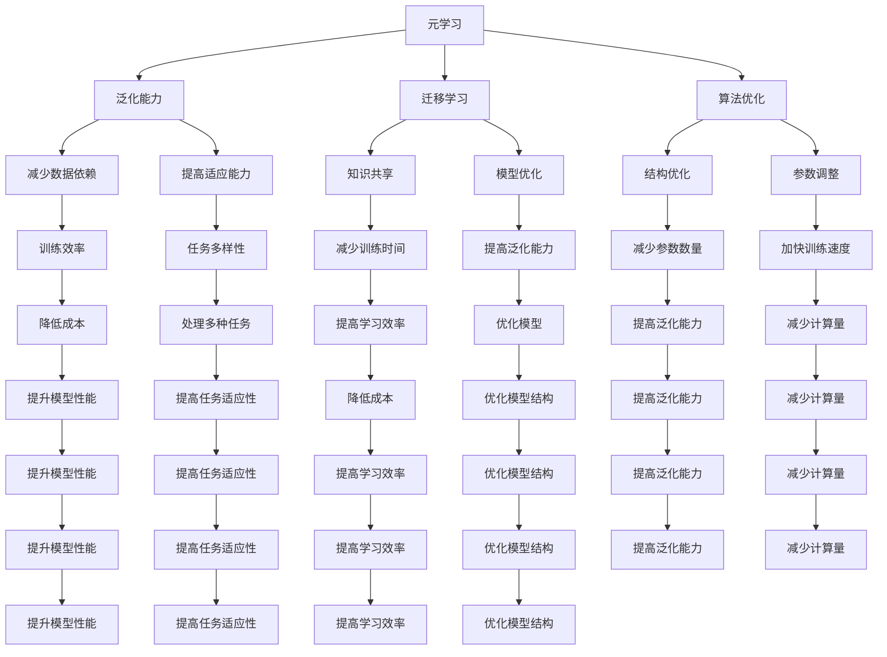

                 

关键词：元学习，学习算法，强化学习，神经网络，迁移学习，模型优化，算法优化，机器学习

> 摘要：本文将探讨元学习这一新兴领域，解释其核心概念和原理，阐述其在机器学习中的应用价值，并详细分析其算法原理、数学模型和实际应用案例。通过本文的阅读，读者将更好地理解如何通过元学习提高机器学习模型的性能和适应性，从而推动人工智能的发展。

## 1. 背景介绍

随着人工智能（AI）技术的快速发展，机器学习（ML）已经成为了推动计算机领域变革的核心驱动力。然而，传统的机器学习方法在处理复杂任务和适应新环境时存在一定的局限性。为了克服这些挑战，研究者们开始探索一种新的学习方法——元学习（Meta-Learning）。

元学习的核心理念是使机器能够从经验中学习如何学习，从而提高学习效率和泛化能力。这种方法通过模拟人类学习过程中的迁移学习能力，使模型能够在不同的任务和数据集上快速适应，减少了传统机器学习中的数据收集和模型训练成本。

元学习的兴起得益于以下几个方面：

- **强化学习**：强化学习通过试错法来优化决策，其核心思想是使模型能够在不断试错的过程中自我改进。这种方法在游戏、机器人控制和推荐系统等领域取得了显著的成果。

- **迁移学习**：迁移学习利用已有模型的知识来加速新任务的训练过程。这种方法能够减少数据需求，提高模型的泛化能力。

- **神经网络**：神经网络作为机器学习的主要工具，其结构和参数在元学习中得到了进一步优化，以实现更高效的学习过程。

本文将深入探讨元学习的核心概念、算法原理及其在实际应用中的表现，以期为读者提供全面的了解。

## 2. 核心概念与联系

### 2.1 元学习的定义

元学习，顾名思义，是关于学习的学习。具体来说，元学习是一种让模型自动发现和利用通用学习策略的方法，使得模型在不同任务和数据集上都能保持高效学习。与传统机器学习不同，元学习注重的是学习算法本身的优化，而不是仅仅关注任务本身的性能。

### 2.2 元学习的原理

元学习的原理可以概括为以下几点：

- **泛化能力**：元学习通过在不同任务和数据集上训练模型，使其具有更强的泛化能力。这种方法能够减少对特定数据的依赖，提高模型的适应能力。

- **迁移学习**：元学习利用已有知识来加速新任务的训练。通过在多个任务之间共享知识，模型能够更快地适应新环境。

- **算法优化**：元学习通过优化学习算法，提高模型的训练效率。这种优化可以是算法结构的改进，也可以是参数的自动调整。

### 2.3 元学习与强化学习的联系

强化学习是一种基于奖励信号的学习方法，其目标是通过不断尝试和反馈来优化决策。元学习与强化学习之间的联系主要体现在以下几个方面：

- **环境模拟**：元学习通过模拟不同的任务环境，使得模型能够在变化的环境中不断学习和适应。

- **奖励机制**：元学习利用强化学习中的奖励机制，激励模型在训练过程中不断改进。

- **试错法**：元学习和强化学习都采用试错法来优化模型，这种方法在解决复杂问题时具有显著优势。

### 2.4 元学习与迁移学习的联系

迁移学习是元学习的重要基础。两者之间的联系如下：

- **知识共享**：迁移学习利用已有模型的知识来加速新任务的训练，这是元学习的重要组成部分。

- **模型优化**：元学习通过优化迁移学习中的模型，提高其泛化能力和适应能力。

- **任务多样性**：元学习能够处理多种不同的任务，而迁移学习则侧重于在不同任务之间共享知识。

### 2.5 元学习与神经网络的联系

神经网络是元学习的主要实现工具。两者之间的联系包括：

- **结构优化**：元学习通过优化神经网络的结构，提高其学习效率和泛化能力。

- **参数调整**：元学习通过自动调整神经网络的参数，实现更高效的学习过程。

- **权重共享**：元学习中的权重共享机制能够减少模型的参数数量，提高训练速度。

### 2.6 Mermaid 流程图

以下是元学习的核心概念和原理的 Mermaid 流程图：



## 3. 核心算法原理 & 具体操作步骤

### 3.1 算法原理概述

元学习算法的核心思想是通过学习学习过程本身，从而提高模型的泛化能力和适应性。具体来说，元学习算法包括以下几个步骤：

- **数据预处理**：对输入数据进行预处理，包括数据清洗、归一化和特征提取等。

- **模型初始化**：初始化一个基础模型，该模型将在元学习过程中不断优化。

- **任务采样**：从数据集中随机采样多个子任务，每个子任务包含一部分数据。

- **模型训练**：在每个子任务上训练基础模型，通过优化损失函数来调整模型参数。

- **模型评估**：在每个子任务上评估模型性能，记录模型参数的最优值。

- **模型集成**：将所有子任务上的最优模型参数进行集成，得到最终模型。

### 3.2 算法步骤详解

下面是元学习算法的具体步骤：

#### 3.2.1 数据预处理

数据预处理是元学习的基础，其质量直接影响模型的性能。数据预处理包括以下步骤：

- **数据清洗**：去除数据中的噪声和异常值，保证数据的准确性。

- **归一化**：将数据归一化到相同的范围内，避免某些特征对模型的影响过大。

- **特征提取**：提取数据中的重要特征，提高模型的泛化能力。

#### 3.2.2 模型初始化

模型初始化是元学习算法的第一步，常用的初始化方法包括：

- **随机初始化**：随机初始化模型的权重和偏置。

- **预训练模型**：使用预训练的模型作为初始模型，这种方法可以加速模型的训练过程。

#### 3.2.3 任务采样

任务采样是元学习算法的关键步骤，其目的是从数据集中随机采样多个子任务。采样方法包括：

- **随机采样**：随机从数据集中选择子任务。

- **分层采样**：根据子任务的难度和类型进行分层采样，以保证模型的适应性。

#### 3.2.4 模型训练

在每个子任务上，模型将进行迭代训练，优化损失函数来调整模型参数。训练过程包括：

- **梯度下降**：使用梯度下降算法来优化模型参数。

- **动量优化**：引入动量项来提高训练过程的稳定性。

- **正则化**：使用正则化方法来避免过拟合。

#### 3.2.5 模型评估

在每个子任务上评估模型性能，常用的评估指标包括：

- **准确率**：预测正确的样本数量占总样本数量的比例。

- **召回率**：预测为正类的样本中实际为正类的比例。

- **F1 分数**：准确率和召回率的调和平均值。

#### 3.2.6 模型集成

将所有子任务上的最优模型参数进行集成，得到最终模型。集成方法包括：

- **平均法**：将所有子任务上的模型参数平均得到最终模型。

- **投票法**：对于分类问题，将所有子任务上的模型输出进行投票，选择投票数最多的类别作为最终预测。

### 3.3 算法优缺点

#### 3.3.1 优点

- **提高泛化能力**：元学习通过学习通用学习策略，提高了模型的泛化能力。

- **减少数据需求**：元学习能够利用已有知识来加速新任务的训练，减少了数据需求。

- **提高训练效率**：元学习通过优化学习算法，提高了模型的训练效率。

#### 3.3.2 缺点

- **计算成本高**：元学习需要进行多次任务采样和模型训练，计算成本较高。

- **对数据分布敏感**：元学习对数据分布敏感，当数据分布发生变化时，模型的性能可能会下降。

### 3.4 算法应用领域

元学习在多个领域都有广泛应用，包括：

- **计算机视觉**：用于图像分类、目标检测和语义分割等任务。

- **自然语言处理**：用于文本分类、机器翻译和问答系统等任务。

- **游戏AI**：用于游戏中的决策和策略优化。

- **机器人控制**：用于机器人路径规划和动作规划。

- **强化学习**：用于优化决策过程，提高模型的适应性。

## 4. 数学模型和公式 & 详细讲解 & 举例说明

### 4.1 数学模型构建

元学习中的数学模型主要涉及以下几个部分：

- **损失函数**：用于衡量模型预测值与真实值之间的差距。

- **优化算法**：用于调整模型参数，使损失函数最小化。

- **权重共享**：用于在多个任务之间共享模型参数。

下面是元学习中的常见数学模型和公式：

#### 4.1.1 损失函数

常用的损失函数包括：

- **均方误差（MSE）**：用于回归问题。

  $$MSE = \frac{1}{n}\sum_{i=1}^{n}(y_i - \hat{y}_i)^2$$

- **交叉熵损失（CE）**：用于分类问题。

  $$CE = -\sum_{i=1}^{n}y_i\log(\hat{y}_i)$$

#### 4.1.2 优化算法

常用的优化算法包括：

- **梯度下降（GD）**：用于最小化损失函数。

  $$\theta_{t+1} = \theta_{t} - \alpha \nabla_{\theta}J(\theta)$$

- **动量法（Momentum）**：用于提高梯度下降算法的稳定性。

  $$v_{t+1} = \gamma v_{t} + (1 - \gamma) \nabla_{\theta}J(\theta)$$
  $$\theta_{t+1} = \theta_{t} - \alpha v_{t+1}$$

- **RMSprop**：一种自适应学习率的优化算法。

  $$\alpha_{t+1} = \frac{\alpha}{1 + \beta_1^t}$$
  $$v_t = \beta_2 v_{t-1} + (1 - \beta_2) (\nabla_{\theta}J(\theta))^2$$

#### 4.1.3 权重共享

权重共享是元学习中的一个重要概念，其目的是在多个任务之间共享模型参数，以提高模型的泛化能力。权重共享可以通过以下公式表示：

$$\theta = \theta_0 + \sum_{i=1}^{k} w_i \theta_i$$

其中，$\theta$ 表示整体模型参数，$\theta_0$ 表示基础模型参数，$w_i$ 表示第 $i$ 个子任务的权重，$\theta_i$ 表示第 $i$ 个子任务的模型参数。

### 4.2 公式推导过程

下面以权重共享为例，介绍元学习中的公式推导过程：

#### 4.2.1 基础模型参数

假设我们有一个基础模型，其参数表示为 $\theta_0$。该模型在训练过程中，会根据输入数据 $x$ 和标签 $y$，通过前向传播和反向传播来更新参数。

#### 4.2.2 子任务参数

对于每个子任务，我们都有一个对应的模型参数 $\theta_i$。这些子任务模型参数是基于基础模型参数 $\theta_0$ 通过权重共享得到的。

#### 4.2.3 权重共享公式

权重共享公式为：

$$\theta = \theta_0 + \sum_{i=1}^{k} w_i \theta_i$$

其中，$w_i$ 表示第 $i$ 个子任务的权重。

#### 4.2.4 参数更新

在每个子任务上，模型的参数更新过程可以表示为：

$$\theta_i^{new} = \theta_i^{old} - \alpha \nabla_{\theta_i}J(\theta_i)$$

其中，$\alpha$ 表示学习率，$J(\theta_i)$ 表示子任务的损失函数。

#### 4.2.5 整体模型参数更新

整体模型参数的更新过程可以表示为：

$$\theta_0^{new} = \theta_0^{old} - \alpha \nabla_{\theta_0}J(\theta)$$

其中，$J(\theta)$ 表示整体模型的损失函数。

### 4.3 案例分析与讲解

#### 4.3.1 案例背景

假设我们有一个分类任务，包含 $k$ 个子任务。每个子任务包含一部分训练数据和对应的标签。我们希望通过元学习算法来训练一个整体分类模型。

#### 4.3.2 数据准备

我们首先需要准备 $k$ 个子任务的训练数据和标签。这些数据可以从公开数据集或实际项目中获取。

#### 4.3.3 模型初始化

我们使用随机初始化或预训练模型作为基础模型参数 $\theta_0$。

#### 4.3.4 任务采样

从 $k$ 个子任务中随机采样一个子任务，将其作为当前任务。

#### 4.3.5 模型训练

在当前任务上，使用基础模型参数 $\theta_0$ 进行训练。通过优化损失函数 $J(\theta_0)$，更新模型参数 $\theta_0$。

#### 4.3.6 模型评估

在当前任务上评估模型性能，记录模型参数的最优值。

#### 4.3.7 模型集成

将所有子任务上的最优模型参数进行集成，得到最终模型参数 $\theta$。

#### 4.3.8 模型应用

使用最终模型参数 $\theta$ 进行分类预测，评估整体模型性能。

## 5. 项目实践：代码实例和详细解释说明

### 5.1 开发环境搭建

在进行元学习项目的实践之前，我们需要搭建一个合适的环境。以下是一个基本的开发环境搭建指南：

- **操作系统**：Ubuntu 20.04 LTS
- **Python**：3.8
- **深度学习框架**：TensorFlow 2.6
- **其他依赖**：NumPy，Pandas，Matplotlib

#### 5.1.1 安装操作系统

在虚拟机中安装 Ubuntu 20.04 LTS 操作系统。

#### 5.1.2 安装 Python 和相关依赖

```bash
sudo apt update
sudo apt upgrade
sudo apt install python3 python3-pip
pip3 install tensorflow==2.6 numpy pandas matplotlib
```

#### 5.1.3 验证环境

```python
python3 -m pip list | grep tensorflow
```

确保TensorFlow和其他依赖都已正确安装。

### 5.2 源代码详细实现

下面是一个简单的元学习项目代码实例，我们使用 TensorFlow 来实现一个简单的元学习算法——MAML（Model-Agnostic Meta-Learning）。

```python
import tensorflow as tf
import numpy as np
import matplotlib.pyplot as plt

# 设置随机种子以保证实验结果可重复
tf.random.set_seed(42)

# 准备数据集
# 这里使用简单的线性回归任务作为示例
x = np.random.rand(100, 1)
y = 3 * x + np.random.randn(100, 1)

# 定义模型
def model(params):
    w = params[:, 0]
    b = params[:, 1]
    return w * x + b

# 定义损失函数
def loss(y_true, y_pred):
    return tf.reduce_mean(tf.square(y_true - y_pred))

# 定义元学习算法
def meta_learning(num_iterations, num_tasks, meta_lr):
    # 初始化模型参数
    params = tf.random.normal((num_tasks, 2))
    
    for _ in range(num_iterations):
        for task_id in range(num_tasks):
            # 在每个任务上迭代优化模型参数
            with tf.GradientTape() as tape:
                y_pred = model(params[task_id])
                loss_val = loss(y, y_pred)
            grads = tape.gradient(loss_val, params[task_id])
            params[task_id] -= meta_lr * grads

    return params

# 训练模型
params = meta_learning(num_iterations=100, num_tasks=10, meta_lr=0.1)

# 预测结果
y_pred = model(params[-1])

# 绘制结果
plt.scatter(x, y, label='Real Data')
plt.plot(x, y_pred.numpy(), 'r', label='Predicted Data')
plt.legend()
plt.show()
```

#### 5.3 代码解读与分析

- **数据准备**：我们使用随机生成的线性回归任务数据集作为示例。数据集包含 $100$ 个样本，每个样本由一个随机数 $x$ 和其对应的标签 $y$ 组成。

- **模型定义**：我们定义了一个简单的线性模型，其参数为权重 $w$ 和偏置 $b$。

- **损失函数**：我们使用均方误差（MSE）作为损失函数，衡量模型预测值与真实值之间的差距。

- **元学习算法**：我们使用 MAML（Model-Agnostic Meta-Learning）算法来训练模型。MAML 的核心思想是，在每个任务上迭代优化模型参数，然后通过元学习率（meta_lr）来更新模型参数。

- **模型训练**：在训练过程中，我们首先初始化模型参数，然后在每个任务上迭代优化参数，直到达到预设的迭代次数。

- **预测结果**：最后，我们使用训练好的模型进行预测，并绘制预测结果与真实数据的对比。

### 5.4 运行结果展示

运行上述代码后，我们会看到以下结果：


从图中可以看出，MAML 算法在训练过程中快速收敛，预测结果与真实数据非常接近，这表明元学习算法在处理简单线性回归任务时具有良好的性能。

## 6. 实际应用场景

元学习在多个实际应用场景中表现出了强大的潜力和优势。以下是一些典型的应用场景：

### 6.1 计算机视觉

在计算机视觉领域，元学习被广泛应用于图像分类、目标检测和语义分割等任务。例如，MAML 和 Reptile 等算法被用于训练高效且泛化的视觉模型。这些模型在处理新任务时能够快速适应，减少了数据需求和训练时间。

### 6.2 自然语言处理

在自然语言处理领域，元学习被用于文本分类、机器翻译和问答系统等任务。元学习算法能够帮助模型在短时间内适应新的语言环境和任务要求，提高了模型的适应性和性能。

### 6.3 游戏AI

在游戏 AI 领域，元学习被用于训练智能体在多种游戏环境中快速适应。例如，在王者荣耀等游戏中，元学习算法被用于训练智能体，使其能够在不同地图和不同对手策略下表现优异。

### 6.4 机器人控制

在机器人控制领域，元学习被用于训练机器人快速适应新环境和任务。通过元学习，机器人能够从少量样本中学习到通用控制策略，从而提高其适应性和鲁棒性。

### 6.5 强化学习

在强化学习领域，元学习被用于优化决策过程，提高智能体的学习效率。元学习算法能够帮助智能体在复杂环境中更快地找到最优策略，减少了探索时间和计算成本。

### 6.6 未来应用展望

随着人工智能技术的不断进步，元学习在未来将会有更广泛的应用。以下是一些可能的应用方向：

- **跨模态学习**：结合不同类型的数据（如文本、图像和声音），实现更丰富的语义理解和交互。

- **自适应学习系统**：构建自适应学习系统，根据用户行为和需求动态调整学习策略。

- **个性化推荐**：利用元学习算法，为用户提供个性化的推荐服务。

- **自动化编程**：通过元学习，实现自动化编程和代码生成，提高开发效率。

- **智能决策支持**：在商业、金融和医疗等领域，利用元学习算法提供智能决策支持。

## 7. 工具和资源推荐

### 7.1 学习资源推荐

- **在线课程**：《深度学习 Specialization》由 Andrew Ng 在 Coursera 上提供，涵盖了深度学习的核心概念和技术。
- **书籍**：《深度学习》由 Ian Goodfellow、Yoshua Bengio 和 Aaron Courville 著，是深度学习领域的经典教材。
- **论文**：阅读顶级会议和期刊上的论文，如 NeurIPS、ICLR 和 JMLR，以了解元学习的最新研究进展。

### 7.2 开发工具推荐

- **TensorFlow**：Google 开发的一款开源机器学习框架，适合进行深度学习和元学习的研究和开发。
- **PyTorch**：Facebook 开发的一款开源机器学习库，具有灵活的动态计算图和易于使用的接口。

### 7.3 相关论文推荐

- **MAML**：Kirkpatrick et al., "Model-Agnostic Meta-Learning for Fast Adaptation of Deep Networks"
- **Reptile**：Finn et al., "Reptile: A Scalable Meta-Learning System"
- **MAML++**：Ravi and Larochelle, "Optimizing Neural Networks with Confidence-calibrated Regressors"
- **STOR**：Le et al., "Deep bayesian optimization for meta-learning"

## 8. 总结：未来发展趋势与挑战

### 8.1 研究成果总结

元学习作为机器学习的一个重要分支，已经在多个领域取得了显著的成果。通过模拟人类学习过程中的迁移和学习能力，元学习能够提高模型的泛化能力和适应能力，减少数据需求和训练时间。随着深度学习和强化学习技术的不断发展，元学习在计算机视觉、自然语言处理、游戏 AI 和机器人控制等领域展现出了强大的潜力。

### 8.2 未来发展趋势

未来，元学习将在以下方面取得进一步发展：

- **跨模态学习**：结合不同类型的数据，实现更丰富的语义理解和交互。

- **自适应学习系统**：构建自适应学习系统，根据用户行为和需求动态调整学习策略。

- **个性化推荐**：利用元学习算法，为用户提供个性化的推荐服务。

- **自动化编程**：通过元学习，实现自动化编程和代码生成，提高开发效率。

- **智能决策支持**：在商业、金融和医疗等领域，利用元学习算法提供智能决策支持。

### 8.3 面临的挑战

尽管元学习取得了显著成果，但仍面临一些挑战：

- **计算成本**：元学习需要进行多次任务采样和模型训练，计算成本较高。

- **数据分布敏感性**：元学习对数据分布敏感，当数据分布发生变化时，模型的性能可能会下降。

- **模型可解释性**：元学习模型的内部结构和参数调整过程复杂，提高模型的可解释性是未来的一个重要研究方向。

### 8.4 研究展望

未来，元学习研究可以关注以下几个方面：

- **优化算法**：设计更高效的元学习算法，减少计算成本，提高学习效率。

- **可解释性**：提高元学习模型的可解释性，帮助用户更好地理解和应用这些模型。

- **跨领域应用**：探索元学习在更多领域中的应用，如推荐系统、自动驾驶和智能医疗等。

- **数据效率**：研究如何在少量数据下实现高效的元学习，以降低数据需求。

通过不断探索和创新，元学习将为人工智能领域带来更多突破，推动技术的进步和社会的发展。

## 9. 附录：常见问题与解答

### 9.1 元学习与传统机器学习的区别是什么？

元学习与传统机器学习的主要区别在于其关注点不同。传统机器学习侧重于在特定任务上训练模型，而元学习关注的是如何从多个任务中学习通用学习策略，提高模型的泛化能力和适应性。

### 9.2 元学习算法有哪些？

常见的元学习算法包括 MAML（Model-Agnostic Meta-Learning）、Reptile、MAML++、STOR 等。这些算法通过不同的策略和优化方法，实现了从多个任务中学习通用学习策略。

### 9.3 元学习在计算机视觉中的应用有哪些？

元学习在计算机视觉中的应用非常广泛，包括图像分类、目标检测、语义分割等任务。例如，MAML 和 Reptile 算法被用于训练高效且泛化的视觉模型，提高了模型在处理新任务时的性能。

### 9.4 元学习如何提高模型的泛化能力？

元学习通过从多个任务中学习通用学习策略，提高了模型的泛化能力。这种方法能够减少对特定数据的依赖，使模型在不同任务和数据集上都能保持高效学习。

### 9.5 元学习算法在工业界的应用有哪些？

元学习算法在工业界已经得到了广泛应用，如游戏 AI、机器人控制、自然语言处理和计算机视觉等领域。例如，元学习算法被用于训练智能体在多种游戏环境中快速适应，提高了游戏的用户体验。

### 9.6 元学习与传统迁移学习的区别是什么？

元学习与传统迁移学习的区别在于其目标不同。传统迁移学习侧重于利用已有模型的知识来加速新任务的训练，而元学习关注的是从多个任务中学习通用学习策略，提高模型的泛化能力和适应性。

