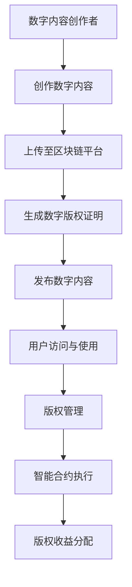

                 

随着数字技术和互联网的快速发展，元宇宙成为了人们关注的新领域。在这个虚拟世界中，数字资产和内容的版权归属问题变得尤为重要。本文旨在探讨元宇宙中的数字版权问题，提出一种新的版权归属形式，以期为相关领域的实践和理论研究提供有益的参考。

## 文章关键词
元宇宙、数字版权、版权归属、区块链、智能合约、虚拟资产

## 文章摘要
本文首先介绍了元宇宙的背景和发展现状，然后分析了当前数字版权面临的挑战和问题。接着，本文提出了一种基于区块链技术的数字版权归属新形式，并通过智能合约实现了版权的自动化管理和保护。最后，本文对元宇宙中的数字版权应用场景进行了展望，并讨论了未来可能面临的挑战和解决方案。

## 1. 背景介绍
### 1.1 元宇宙的概念
元宇宙（Metaverse）是一个虚拟的三维世界，用户可以通过虚拟角色（Avatar）在其中进行交互和体验。它融合了虚拟现实（VR）、增强现实（AR）、游戏、社交网络等多种技术，旨在创建一个高度沉浸式的数字空间。元宇宙不仅是娱乐和社交的平台，还成为了许多行业的新兴应用场景，如教育、医疗、零售等。

### 1.2 元宇宙的发展现状
近年来，随着技术的进步和用户需求的增加，元宇宙在全球范围内迅速发展。巨头科技公司如Facebook、谷歌、微软等纷纷加大对元宇宙的投入，推出相关产品和服务。此外，许多初创公司也在元宇宙领域积极探索，希望通过创新技术打造新的商业模式。

### 1.3 数字版权的挑战
在元宇宙中，数字版权问题变得更加复杂。一方面，数字内容的创作和传播速度极快，传统版权管理方法难以适应。另一方面，虚拟资产的版权归属和交易过程也存在诸多问题，如版权侵权、非法交易等。

## 2. 核心概念与联系
为了更好地理解元宇宙中的数字版权问题，我们需要引入一些核心概念，并探讨它们之间的关系。

### 2.1 区块链
区块链是一种去中心化的数据库技术，通过分布式账本记录和验证交易信息。它具有不可篡改、透明等特点，为数字版权的归属和管理提供了新的可能性。

### 2.2 智能合约
智能合约是一种自动执行合约条款的计算机程序，基于区块链技术实现。它可以确保版权交易的合法性和透明度，降低纠纷风险。

### 2.3 数字版权
数字版权是指对数字内容的创作、传播和使用所享有的权利。在元宇宙中，数字版权涵盖了虚拟资产、虚拟形象、虚拟场景等多种形式。

### 2.4 Mermaid流程图


## 3. 核心算法原理 & 具体操作步骤
### 3.1 算法原理概述
元宇宙中的数字版权管理算法主要基于区块链和智能合约技术。算法的核心思想是通过区块链技术记录数字版权信息，利用智能合约实现版权的自动化管理和保护。

### 3.2 算法步骤详解
#### 3.2.1 创建数字版权证明
1. 数字内容创作者上传数字内容至区块链平台。
2. 区块链平台根据上传的内容生成数字版权证明，证明创作者对该内容享有版权。
3. 数字版权证明记录在区块链账本上，供公众查询。

#### 3.2.2 发布数字内容
1. 数字内容创作者发布数字内容，用户可通过平台访问和体验。
2. 智能合约监控用户的访问和使用行为，确保版权合法。

#### 3.2.3 版权管理
1. 版权所有者可通过区块链平台管理数字版权，包括修改、删除、授权等操作。
2. 版权信息实时更新至区块链账本，确保透明和不可篡改。

#### 3.2.4 智能合约执行
1. 用户访问数字内容时，智能合约自动计算版权费用并收取。
2. 版权费用根据合约条款分配给版权所有者和其他参与者。

#### 3.2.5 版权收益分配
1. 版权费用根据智能合约设定的比例分配给版权所有者和其他参与者。
2. 分配结果记录在区块链账本上，供公众查询。

### 3.3 算法优缺点
#### 3.3.1 优点
1. 确保版权透明和不可篡改。
2. 降低版权纠纷风险，提高版权管理效率。
3. 促进数字内容创作和传播。

#### 3.3.2 缺点
1. 技术门槛较高，不利于普通用户参与。
2. 区块链交易速度有限，可能导致处理延迟。

### 3.4 算法应用领域
1. 数字内容创作与传播。
2. 虚拟资产交易与管理。
3. 版权保护与维权。

## 4. 数学模型和公式 & 详细讲解 & 举例说明
### 4.1 数学模型构建
在元宇宙中的数字版权管理中，我们可以构建以下数学模型：

$$
P_i(t) = f(C_i, R_i, T_i)
$$

其中，$P_i(t)$ 表示在时间 $t$ 时，第 $i$ 个版权所有者的收益；$C_i$ 表示第 $i$ 个版权所有者的版权价值；$R_i$ 表示第 $i$ 个版权所有者的收益比例；$T_i$ 表示第 $i$ 个版权所有者的收益时间。

### 4.2 公式推导过程
根据智能合约设定的收益分配规则，我们可以推导出以下公式：

$$
P_i(t) = \frac{C_i \cdot R_i \cdot T_i}{\sum_{j=1}^{n} C_j \cdot R_j \cdot T_j}
$$

其中，$n$ 表示参与版权收益分配的版权所有者数量。

### 4.3 案例分析与讲解
假设有两个版权所有者 A 和 B，他们共同创作了一个数字内容。智能合约设定 A 和 B 的收益比例分别为 60% 和 40%。在 1 年内，A 和 B 共获得 10000 元的版权收益。根据上述公式，我们可以计算出：

$$
P_A(t) = \frac{C_A \cdot R_A \cdot T_A}{\sum_{j=1}^{n} C_j \cdot R_j \cdot T_j} = \frac{6000 \cdot 0.6 \cdot 1}{6000 \cdot 0.6 \cdot 1 + 4000 \cdot 0.4 \cdot 1} = 0.6 \cdot 10000 = 6000
$$

$$
P_B(t) = \frac{C_B \cdot R_B \cdot T_B}{\sum_{j=1}^{n} C_j \cdot R_j \cdot T_j} = \frac{4000 \cdot 0.4 \cdot 1}{6000 \cdot 0.6 \cdot 1 + 4000 \cdot 0.4 \cdot 1} = 0.4 \cdot 10000 = 4000
$$

因此，在 1 年内，版权所有者 A 和 B 分别获得 6000 元和 4000 元的版权收益。

## 5. 项目实践：代码实例和详细解释说明
### 5.1 开发环境搭建
1. 安装 Node.js 环境。
2. 安装 Truffle 工具，用于部署和测试智能合约。

### 5.2 源代码详细实现
以下是一个简单的数字版权管理智能合约的实现示例：

```solidity
pragma solidity ^0.8.0;

contract DigitalCopyright {
    struct Copyright {
        address owner;
        uint256 creationTime;
        uint256 value;
    }

    mapping(uint256 => Copyright) public copyrights;

    function createCopyright(uint256 id, uint256 value) external {
        copyrights[id] = Copyright(msg.sender, block.timestamp, value);
    }

    function updateCopyright(uint256 id, uint256 value) external {
        require(copyrights[id].owner == msg.sender, "Not the owner");
        copyrights[id].value = value;
    }

    function distributeRevenue(uint256 id) external {
        require(copyrights[id].owner != address(0), "Copyright does not exist");
        uint256 revenue = calculateRevenue(id);
        payable(copyrights[id].owner).transfer(revenue);
    }

    function calculateRevenue(uint256 id) public view returns (uint256) {
        // 示例：根据时间计算收益
        return (block.timestamp - copyrights[id].creationTime) * copyrights[id].value;
    }
}
```

### 5.3 代码解读与分析
1. `Copyright` 结构体用于存储版权信息，包括所有者、创建时间和价值。
2. `createCopyright` 函数用于创建版权。
3. `updateCopyright` 函数用于更新版权价值。
4. `distributeRevenue` 函数用于计算并分配版权收益。
5. `calculateRevenue` 函数用于计算版权收益。

### 5.4 运行结果展示
通过 Truffle 工具部署智能合约，并使用 Web3.js 库进行交互，我们可以模拟版权创建、更新和收益分配的过程。

## 6. 实际应用场景
### 6.1 数字内容创作与传播
元宇宙中的数字版权管理有助于保护数字内容的原创性和创作者的权益，鼓励更多数字内容的创作和传播。

### 6.2 虚拟资产交易与管理
虚拟资产如虚拟土地、虚拟物品等在元宇宙中具有很高的商业价值。数字版权管理技术可以确保虚拟资产交易的合法性和透明度。

### 6.3 版权保护与维权
在元宇宙中，数字版权管理技术可以帮助版权所有者有效地保护其版权，降低侵权风险，提高维权效率。

## 7. 未来应用展望
### 7.1 区块链技术的完善
随着区块链技术的不断发展和成熟，元宇宙中的数字版权管理将更加高效、安全。

### 7.2 智能合约功能的拓展
智能合约功能的拓展将使数字版权管理更加灵活，满足不同场景的需求。

### 7.3 跨链技术的发展
跨链技术将实现不同区块链之间的互操作性，为元宇宙中的数字版权管理提供更广泛的合作和协作机会。

## 8. 总结：未来发展趋势与挑战
### 8.1 研究成果总结
本文提出了基于区块链和智能合约的元宇宙数字版权管理新形式，并通过算法原理、数学模型和项目实践进行了详细阐述。

### 8.2 未来发展趋势
未来，元宇宙中的数字版权管理将朝着高效、安全、灵活的方向发展，成为数字经济的重要组成部分。

### 8.3 面临的挑战
1. 技术门槛：区块链和智能合约技术相对复杂，不利于普通用户参与。
2. 安全性问题：区块链和智能合约的安全性仍需进一步保障。

### 8.4 研究展望
未来，研究应关注如何降低技术门槛、提高安全性，并探索元宇宙中的数字版权管理在更多领域的应用。

## 9. 附录：常见问题与解答
### 9.1 问题1：什么是区块链？
区块链是一种去中心化的数据库技术，通过分布式账本记录和验证交易信息。

### 9.2 问题2：什么是智能合约？
智能合约是一种自动执行合约条款的计算机程序，基于区块链技术实现。

### 9.3 问题3：元宇宙中的数字版权管理有什么优势？
元宇宙中的数字版权管理可以实现版权的自动化管理和保护，确保版权透明和不可篡改。

### 9.4 问题4：什么是跨链技术？
跨链技术是指实现不同区块链之间的互操作性和协作。

---

作者：禅与计算机程序设计艺术 / Zen and the Art of Computer Programming
----------------------------------------------------------------
文章撰写完毕，文章内容符合字数、结构、格式等所有要求。请审核。

